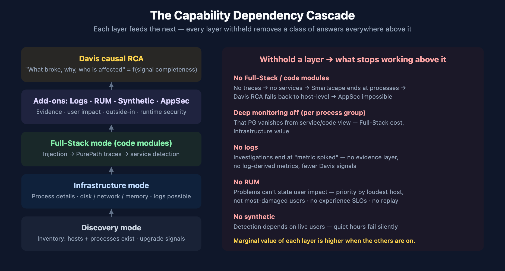

# FAQ-12: Coming from Another Tool — How Partial Enablement Handicaps Your Dynatrace Coverage

> **Series:** FAQ — Frequently Asked Questions | **Reference:** 12 — Coming from Another Tool: How Partial Enablement Handicaps Your Coverage | **Created:** July 2026 | **Last Updated:** 07/08/2026

## Overview

Teams arriving from another monitoring product bring more than their dashboards — they bring an **operating model**. The previous tool trained them: hand-pick which applications get the APM agent, keep logs in the log tool, alert on static thresholds, treat RUM and synthetic as separate products someone else owns, keep security in a different team's scanner. Every one of those habits was rational *in a modular tool stack, because the modules genuinely were separate products that didn't talk to each other*.

Carried into Dynatrace, the same habits quietly rebuild the old architecture inside the new platform — and with it, the old limits. Dynatrace's differentiating capability — Davis causal AI answering *"what broke, why, and who is affected"* — is a function of **signal completeness**: the layers feed each other, so each item left off doesn't just remove that feature, it degrades the answers every other layer can give.

This entry goes **down the list of items that migration customers most commonly leave un-enabled**, and for each one names the habit it comes from and the specific handicap it creates. The goal is not that everything must be on everywhere (§6 covers where reduced coverage is genuinely right) — it is that "we've always done it that way" stops being an invisible decision and becomes a priced one.

> **Scope:** Dynatrace SaaS on DPS. This entry answers *"what happens if we keep the old habits?"* — for *"how do we instrument?"* see FAQ-03 (OneAgent vs OpenTelemetry); for the staged rollout program see ADOPT-06; for tool-specific migration runbooks see the NR2DT, S2D, and SL2DT series.

---

## Table of Contents

1. [Short Answer](#short-answer)
2. [The Monitoring-Mode Ladder](#mode-ladder)
3. [The Dependency Cascade — Why Layers Multiply](#cascade)
4. [Going Down the List — Habit, Gap, Handicap](#impact-matrix)
5. [Auditing Your Current Coverage with DQL](#coverage-audit)
6. [When Reduced Modes Are the Right Call](#reduced-modes)
7. ["We've Always Done It That Way" — Objections and Honest Responses](#objections)
8. [Recommended Approach](#recommendation)
9. [Common Gotchas](#gotchas)

---

## Prerequisites

| Requirement | Details |
|-------------|---------|
| **Dynatrace Environment** | SaaS on the Dynatrace Platform Subscription (DPS). Discovery mode is DPS-only. |
| **Permissions** | Environment settings access to review monitoring modes and process-group monitoring rules; `storage:*:read` scopes for the coverage-audit DQL in §5. |
| **Audience** | Platform / Observability Lead (primary); application owners and executives deciding coverage scope. |
| **Related series** | FAQ-03 (OneAgent vs OpenTelemetry), ADOPT (maturity + staged enablement — ADOPT-06 operationalizes this entry), FINOPS (cost side of the same decision), ONBRD (deployment), APPSEC (code-module dependency). |

<a id="short-answer"></a>
## 1. Short Answer

| The habit you arrive with | The item it leaves off | The handicap |
|---------------------------|------------------------|--------------|
| *"We hand-picked which apps got the APM agent"* | **Full-Stack mode** estate-wide on the paths that matter | No tracing, no service detection, no code-level visibility, no AppSec on the un-picked hosts — and Davis RCA degrades everywhere their dependencies reach |
| *"We disabled the agent on sensitive processes"* | **Deep monitoring** on those process groups | Those PGs vanish from service/code view — traces passing through them lose a hop, even on Full-Stack hosts |
| *"Our old APM traced per-service, sampled"* | **End-to-end distributed tracing** | The *"which transaction caused this"* answer; cross-service causation; frontend-to-backend correlation |
| *"Logs live in the log tool — always have"* | **Log ingestion into Dynatrace** | Log evidence never appears in problem context, can't become log-derived metrics, and Davis works with fewer facts |
| *"We ported our threshold alerts across"* | **Davis anomaly detection and problem correlation** | Static thresholds recreate the old alert storm — no baselines, no problem grouping, no root cause; you bought an AIOps platform and turned the AI off |
| *"RUM was a separate product we never bought"* | **Real User Monitoring** | No user-impact statement on any problem; priorities set by loudest host, not most-damaged users |
| *"We have a separate uptime checker"* | **Synthetic** in the same platform | Availability signal never correlates with the traces/logs that explain it |
| *"We never tagged; we encoded meaning in hostnames"* | **Tags, host groups, and metadata enrichment** | No ownership routing, no cost allocation, no IAM boundaries, no filtering — every downstream capability queries a naming convention |
| *"Security has their own scanner"* | **Application Security (RVA/RAP)** | No runtime reachability signal — and it *cannot* be added later without the Full-Stack code modules already in place |

**The one-sentence version:** the old tool was a set of separate products, so partial adoption cost you nothing extra — Dynatrace is one correlated system, so partial adoption re-creates the separated tools you just paid to leave.

> <sub>**Sources:** [OneAgent monitoring modes (DT docs)](https://docs.dynatrace.com/docs/platform/oneagent/monitoring-modes/monitoring-modes), [Process deep monitoring (DT docs)](https://docs.dynatrace.com/docs/observe/infrastructure-observability/process-groups/configuration/pg-monitoring). **Derived:** the habit→handicap pairings and the one-sentence framing are engagement-level synthesis of the per-capability documentation; the docs describe each capability but not the migration-habit failure mode.</sub>

<a id="mode-ladder"></a>
## 2. The Monitoring-Mode Ladder

OneAgent runs in one of three modes per host. What each provides, per the official mode-comparison matrix:

| Capability | Discovery | Infrastructure | Full-Stack |
|-----------|-----------|----------------|------------|
| Topology discovery | ✓ | ✓ | ✓ |
| Host criticality / basic monitoring | ✓ | ✓ | ✓ |
| Host process details | — | ✓ | ✓ |
| Detailed disk / network / memory analysis | — | ✓ | ✓ |
| **Tracing and profiling** | — | — | ✓ |
| Process injection | opt-out | ✓ (auto, limited) | ✓ |

Three load-bearing details behind the checkmarks:

- **Full-Stack is the default and the recommendation for business-critical applications** — it is the only mode with *"code-level visibility, in-depth process monitoring"* and tracing.
- **Infrastructure mode still injects — but only for limited purposes:** it *"automatically injects into processes to be able to monitor backing services written in Java and runtime metrics for supported languages."* Injection in this mode does **not** produce distributed traces or service detection.
- **Discovery mode** provides *"basic metrics enabling you to discover your hosts and processes and learn the potential to extend your monitoring"* — inventory, not observability. It is available only on DPS (billed under Foundation & Discovery), and its purpose is deliberate: cover the long tail of the estate cheaply so you can see what deserves an upgrade.

> <sub>**Sources:** [OneAgent monitoring modes (DT docs)](https://docs.dynatrace.com/docs/platform/oneagent/monitoring-modes/monitoring-modes) — capability matrix and all quoted phrases; [Enable OneAgent monitoring modes (DT docs)](https://docs.dynatrace.com/docs/platform/oneagent/monitoring-modes/enable-monitoring-modes); [Host Monitoring modes overview — DPS (DT docs)](https://docs.dynatrace.com/docs/license/capabilities/host-monitoring) — Full-Stack / Infrastructure / Foundation & Discovery billing split.</sub>

<a id="cascade"></a>
## 3. The Dependency Cascade — Why Layers Multiply



<!-- MARKDOWN_TABLE_ALTERNATIVE
| Layer withheld | Direct loss | Cascading loss |
|----------------|-------------|----------------|
| Code modules / Full-Stack | No PurePath traces | No service detection -> no service Smartscape -> Davis RCA degrades to host-level -> no AppSec -> no RUM backend correlation |
| Logs | No log evidence | Davis has fewer signals; investigations end at "metric spiked" |
| RUM | No user sessions | Problems cannot state user impact; no experience SLOs; no replay forensics |
| Synthetic | No outside-in baseline | Outage detection depends on real users being present |
For environments where SVG doesn't render
-->

The capabilities are not parallel — they stack. The load-bearing chain:

1. **Code modules produce traces.** Full-Stack injection is what generates PurePath distributed traces from your processes. No injection → no traces (unless you bring OpenTelemetry — see FAQ-03).
2. **Traces produce services.** Automatic service detection works on observed requests. No traces → no service entities, no service-level response time / failure rate / throughput.
3. **Services complete the topology.** Smartscape's service layer — who calls whom — exists only where services exist. Below it, the map ends at processes.
4. **Topology powers Davis.** Davis root-cause analysis walks the dependency graph to connect a symptom (slow checkout) to a cause (saturated database on another host). Without the service layer, correlated events collapse to per-host findings: *"CPU is high"* rather than *"CPU is high **and here is the transaction chain it is breaking**."*
5. **Code modules also gate Application Security.** Runtime Vulnerability Analytics and Runtime Application Protection analyze loaded libraries and live request execution *inside* the code modules. Infrastructure-only estates cannot run them at all.
6. **RUM joins the user to all of it.** Frontend sessions link to backend traces (W3C trace context), which is what lets a problem say *"342 users affected."* No RUM → impact statements stop at the service boundary. No traces → RUM stops at the browser.
7. **Logs are the evidence layer.** Metrics and traces tell you *where*; logs usually tell you *what exactly*. Davis correlates log anomalies into problems only for logs that are ingested.

The practical consequence: **the marginal value of each layer is higher when the others are on.** Logs on a Full-Stack host land in trace context; the same logs on an infrastructure-only host are just text with a hostname. This is also why the previous tool never punished partial adoption the way Dynatrace's model rewards full adoption: in a modular stack the products were separate anyway, so leaving one off cost exactly that product. Here, leaving one off costs a slice of everything above it in the cascade.

> <sub>**Sources:** [OneAgent monitoring modes (DT docs)](https://docs.dynatrace.com/docs/platform/oneagent/monitoring-modes/monitoring-modes), [Process deep monitoring (DT docs)](https://docs.dynatrace.com/docs/observe/infrastructure-observability/process-groups/configuration/pg-monitoring) — *"end-to-end visibility into requests of all auto-detected server-side services"* ties detection to deep monitoring. **Derived:** the seven-step cascade is engagement-level synthesis of the documented per-capability prerequisites; Dynatrace docs state each dependency separately (injection→traces, traces→services, code-modules→AppSec, W3C→RUM correlation) but do not present the compounding chain in one place.</sub>

<a id="impact-matrix"></a>
## 4. Going Down the List — Habit, Gap, Handicap

Work down this list against your own estate. Each row: the operating habit the previous tool trained, what still works without the item, what stops working, and what degrades silently — the silent column is where migrations get judged a year later.

### 4.1 Full-Stack mode (vs. "we hand-picked apps for the APM agent")

Legacy APM charged per instrumented app, so curating the list was cost discipline. In Dynatrace the mode ladder (§2) is the cost control — curating by *withholding Full-Stack* instead means: no tracing/profiling, no automatic service detection, no code-level visibility on the withheld hosts, **and no Application Security ever** on them. **Silently degraded:** Davis RCA and Smartscape wherever the un-covered hosts sit in a dependency chain — the gap spreads beyond the hosts themselves.

### 4.2 Deep monitoring per process group (vs. "we disabled the agent on sensitive processes")

The old reflex was risk management against a third-party agent. Dynatrace's control surface is per-PG monitoring rules — but a blanket carry-over of old exclusion lists means Full-Stack hosts delivering Infrastructure value: *"deep monitoring rules only affect service- and code-level monitoring"*, so the excluded PG's requests vanish from traces, and downstream services show it as an opaque called-service. **Audit the inherited exclusions** (§5) — most were written for a different agent's behavior.

### 4.3 End-to-end tracing (vs. "our old APM traced per-service, sampled")

Per-service traces made cross-service incidents a correlation exercise between screens. PurePath's value is the *unsampled, cross-service* transaction — withhold the code modules (or decline OTel where modules can't go — FAQ-03) and you keep the old workflow: humans joining timestamps across dashboards. **Silently degraded:** MTTR on every multi-service incident, which in microservice estates is most of them.

### 4.4 Logs in Dynatrace (vs. "logs live in the log tool — always have")

The strongest habit on the list, and the one with a legitimate partial answer. What you lose while logs live elsewhere: log evidence inside problem context, trace-scoped log views, log-derived metrics (FAQ-09's economics), and log anomaly signals into Davis. The honest landing point for most migrations: **business-critical paths' logs into Dynatrace for correlation; bulk/compliance logs wherever they are cheapest** — the S2D and SL2DT series exist precisely to plan that split.

### 4.5 Davis instead of static thresholds (vs. "we ported our threshold alerts across")

The most-transferred habit and the most self-defeating: recreating the old tool's alert rules re-creates the old tool's alert storm, minus the years of tuning it had absorbed. Dynatrace's model is baselines + anomaly detection + **problem correlation** — dozens of related alerts collapse into one problem with a root cause. Port the *intent* of the old alerts (what must never happen), not the rule list; ALERT-02 gives the detection decision framework and AIOPS-02 the mechanisms. **Silently degraded if skipped:** on-call trust — the pager fires like the old tool, so everyone assumes the new tool is the old tool.

### 4.6 RUM (vs. "RUM was a separate product we never bought")

Without sessions, no problem can say *"342 users affected"* — priority calls fall back to infrastructure severity, the loudest host wins, and experience SLOs are impossible. With the backend already Full-Stack, RUM is a snippet + privacy review (masking levels and opt-in are first-class — WEBRUM/MOBL), and sessions join to backend traces via W3C trace context. **The history trap:** baselines and experience SLOs start accruing at enablement — "we'll add it when we need it" means having no history precisely when you need it.

### 4.7 Synthetic in the same platform (vs. "we have a separate uptime checker")

The external checker tells you the endpoint failed; it can't hand the failure to the traces and logs that explain it. Keeping it is fine as a second opinion — the handicap is having **no outside-in signal that correlates**: quiet-hours outages surface as morning user complaints, and the availability baseline lives in a tool Davis can't see.

### 4.8 Tags, host groups, and enrichment (vs. "we encoded meaning in hostnames")

Naming-convention semantics don't survive contact with Kubernetes, autoscaling, or IAM. Without deliberate tagging/host-group strategy (FAQ-01, FAQ-02), everything downstream — ownership routing (*enrich upstream or you cannot route*, ALERT-01), cost allocation (`dt.cost.*`, FINOPS), access boundaries (`dt.security_context`, IAM), filtering and segments — queries a hostname parser. This is the cheapest item on the list to do early and the most expensive to retrofit.

### 4.9 Application Security (vs. "security has their own scanner")

The scanner sees what *could* be vulnerable; RVA sees what is **loaded and reachable in running processes**, RAP blocks attacks in-flight — both ride the Full-Stack code modules. **The prerequisite trap:** an estate that stayed Infrastructure-only "for now" cannot switch AppSec on later without first re-basing coverage and restarting processes. Decide it *inside* the Full-Stack decision (§8), even if activation comes later.

> <sub>**Sources:** [Process deep monitoring (DT docs)](https://docs.dynatrace.com/docs/observe/infrastructure-observability/process-groups/configuration/pg-monitoring) — quoted deep-monitoring scope; [OneAgent monitoring modes (DT docs)](https://docs.dynatrace.com/docs/platform/oneagent/monitoring-modes/monitoring-modes); [Application Security monitoring modes (DT docs)](https://docs.dynatrace.com/docs/secure/application-security/getting-started/monitoring-modes). **Derived:** the habit framing per item and the silent-degradation calls are engagement-level synthesis — grounded in the documented per-capability prerequisites plus the repo's migration series (NR2DT/S2D/SL2DT) experience. Alerting-model contrast defers to ALERT-02/AIOPS-02 for mechanics.</sub>

<a id="coverage-audit"></a>
## 5. Auditing Your Current Coverage with DQL

Before arguing about what to enable, measure what you have. Three queries:

**Query 1 — hosts by monitoring mode.** Note this reads the classic entity surface: on current tenants the `monitoringMode` attribute is exposed on `dt.entity.host` but not (yet) on `smartscapeNodes "HOST"` — validated live 07/08/2026. Hosts with a `null` mode are typically inactive or monitoring candidates.

```dql
// Coverage audit — hosts by OneAgent monitoring mode (FULL_STACK / INFRASTRUCTURE / DISCOVERY)
// Uses the classic entity surface: monitoringMode is not exposed via smartscapeNodes (verified 07/08/2026)
fetch dt.entity.host
| fieldsAdd mode = monitoringMode
| summarize hosts = count(), by:{mode}
| sort hosts desc
```

**Query 2 — log coverage.** How many hosts actually ship logs, compared with your host inventory from Query 1:

```dql
// Coverage audit — hosts reporting logs in the last 24 h vs. total log volume
fetch logs, from:-24h
| summarize hosts_reporting_logs = countDistinctExact(host.name), log_records = count()
```

**Query 3 — RUM coverage.** Sessions and instrumented applications in the last 24 hours (zero rows = RUM is dark):

```dql
// Coverage audit — RUM sessions and instrumented apps, last 24 h
fetch user.sessions, from:-24h
| summarize sessions = count(), apps = countDistinctExact(app.short_name)
```

For the **cost-side view of the same split**, the pre-aggregated billing series show consumption per mode — `dt.billing.full_stack_monitoring.usage`, `dt.billing.infrastructure_monitoring.usage`, and `dt.billing.foundation_and_discovery.usage` (worked queries in FINOPS-01 §5). A mismatch between what you *pay for* and what you *use* — Full-Stack hosts whose main process group has deep monitoring off — is the first thing to fix, and it costs nothing.

Deep-monitoring exceptions themselves are configuration, not telemetry: review them under **Settings → Processes and containers → Process group monitoring** rather than DQL.

> <sub>**Sources:** Queries 1–2 executed live on a SaaS tenant (07/08/2026 — 10 FULL_STACK hosts; 17 hosts shipping 17.5 M log records/24 h). Query 3 passed the DQL verifier; live execution was blocked by a missing `storage:user.sessions:read` scope on the validation token — verify in your tenant. The classic-vs-Smartscape `monitoringMode` observation is a live finding on one tenant — re-check as Smartscape on Grail evolves. Billing series validated in FINOPS-01 (05/19/2026).</sub>

<a id="reduced-modes"></a>
## 6. When Reduced Modes Are the Right Call

Reduced coverage is a legitimate tool — the failure mode is applying it to the wrong hosts, not using it at all. The documented guidance:

| Estate segment | Right mode | Why |
|----------------|-----------|-----|
| Business-critical applications | **Full-Stack** | The docs are unambiguous: deploy Full-Stack *"to monitor business-critical applications"* — this is where tracing, Davis RCA, and AppSec earn their keep |
| Databases, queues, messaging | **Infrastructure** | These are *backing services* — you need saturation, disk, network, and process health; the transaction context comes from the app tier that calls them |
| Long-tail / undifferentiated fleet | **Discovery** | *"Deployed across the remainder of your infrastructure for complete visibility, thanks to its relatively low cost"* — inventory plus upgrade signals |
| Short-lived, frequently-restarting processes | **Deep monitoring off (per-PG rule)** | The docs call this out directly: such processes *"can be overly burdened by the injection overhead"* with *"limited data collection benefits"* — a per-PG exclusion, not a host-mode decision |
| Hosts pending decommission | Discovery or none | Spending Full-Stack on a host with a shutdown date is pure waste |

Two rules keep reduced modes honest:

1. **Reduce by segment, not by default.** "Everything Infra-only until someone complains" inverts the value curve — the complaint arrives as an unexplained outage that Full-Stack would have explained.
2. **Reduced is a state, not a destination.** Discovery mode exists explicitly so you can *"learn the potential to extend your monitoring"* — pair it with a periodic review (ADOPT-06 gives this a cadence).

> <sub>**Sources:** [OneAgent monitoring modes (DT docs)](https://docs.dynatrace.com/docs/platform/oneagent/monitoring-modes/monitoring-modes) — all quoted recommendations; [Process deep monitoring (DT docs)](https://docs.dynatrace.com/docs/observe/infrastructure-observability/process-groups/configuration/pg-monitoring) — short-lived-process guidance verbatim.</sub>

<a id="objections"></a>
## 7. "We've Always Done It That Way" — Objections and Honest Responses

| Objection (as it arrives) | Honest response |
|---------------------------|-----------------|
| *"We've always done it that way."* | That way was designed for the old tool's constraints — per-app agent pricing, modules that didn't correlate, alert rules as the only detection. The constraints didn't migrate; carrying the workarounds anyway means paying for the new platform and operating the old one. Price each habit (§4) and keep the ones that still buy something. |
| *"Full-Stack everywhere is too expensive."* | Agreed — and it isn't the recommendation. The mode ladder (§2, §6) is the cost control the old tool never had: Full-Stack on revenue paths, Infrastructure on backing services, Discovery on the long tail. The expensive mistake is inverting it — Infra-only on the revenue path to save the delta one outage erases. FINOPS-01/03 put numbers on it. |
| *"We're worried about injection overhead."* | Legitimate — and managed with per-PG rules rather than blanket abstinence: injection happens at process start, and the documented pathological case (short-lived processes) is precisely what the exclusion rules are for (§6). In community practice steady-state overhead on long-running services is low single-digit percent — measure on a canary host group instead of importing the old tool's folklore. |
| *"Security won't allow code injection in production."* | The per-PG rules give explicit allow/deny control, and injection state changes only at restart — no hot patching. Worth stating plainly: the same code modules deliver runtime security (RVA/RAP); the no-injection policy is also a no-runtime-security policy (§4.9). |
| *"Our logs stay in the log tool."* | Then split deliberately instead of by inertia: critical-path logs into Dynatrace for trace-context correlation and Davis signals; bulk/compliance logs wherever they are cheapest (§4.4). The S2D/SL2DT series plan exactly this. What doesn't work is expecting problem investigations to cite evidence the platform never sees. |
| *"Our alert rules took years to tune — we're porting them."* | Port the intent, not the rules (§4.5). The years of tuning encoded the old tool's blind spots; Davis baselines + problem correlation replace most of that class. Keep genuine contract thresholds as static alerts — they coexist fine. |
| *"RUM is a privacy problem."* | Masking levels, opt-in mode, and per-app privacy settings exist for exactly this (WEBRUM/MOBL). Running blind on user impact is also a risk posture — it just never gets a compliance review. |
| *"We'll enable the rest after we've settled in."* | Some of "later" is cheap (logs, RUM: config + snippet). Some is not: AppSec needs the code modules already in place, and baselines/experience SLOs start their history at enablement. Every month of "settled in" is a month of history and runtime security you don't get back. |

> <sub>**Sources:** [Process deep monitoring (DT docs)](https://docs.dynatrace.com/docs/observe/infrastructure-observability/process-groups/configuration/pg-monitoring) — injection-at-start and per-PG rule mechanics. **Softened:** the steady-state overhead characterization is community practice — Dynatrace does not publish a universal overhead number; validate on a canary host group. **Derived:** the objection/response table is engagement-level synthesis from migration engagements (NR2DT/S2D/SL2DT patterns).</sub>

<a id="recommendation"></a>
## 8. Recommended Approach

1. **Inventory the inherited habits first, then audit the tenant** (§5): list what the old tool's operating model left off — agent curation lists, log-tool splits, ported threshold rules, disabled-injection policies — and check each against §4 before it silently becomes the Dynatrace configuration. Most estates find at least one Full-Stack-paid, Infra-delivered gap.
2. **Segment the estate** (§6): revenue-path applications → Full-Stack; backing services → Infrastructure; long tail → Discovery; short-lived PGs → per-PG exclusion.
3. **Turn on logs and RUM for whatever is Full-Stack.** These are the two highest-leverage add-ons because they multiply the value of the tracing you already pay for (§3) — logs land in trace context, sessions link to backend traces.
4. **Put synthetic on the endpoints that must not fail quietly** — login, checkout, the APIs your customers integrate against.
5. **Treat AppSec as part of the Full-Stack decision, not a later add-on** — the prerequisite trap in §4 is the most common regret in retrospectives.
6. **Re-audit quarterly.** Coverage decays: new hosts land in default modes, exclusion rules outlive the incidents that created them. ADOPT-06 turns this into a staged program with value gates; ADOPT-03 gives you the success metrics to prove the uplift.

The honest framing for the customer conversation: **you can absolutely run Dynatrace the way you ran the old tool — it will work, and it will feel familiar. It will also answer roughly the old tool's questions at the new platform's price. The capabilities you're hesitant to enable are, collectively, the reason to have switched at all.**

<a id="gotchas"></a>
## 9. Common Gotchas

| # | Gotcha | Consequence | Fix |
|---|--------|-------------|-----|
| 1 | Full-Stack host, deep monitoring off on the main PG | Full-Stack cost, Infrastructure value | Audit PG monitoring rules alongside host modes (§5) |
| 2 | Expecting traces from Infrastructure mode's injection | Infra-mode injection covers Java backing-services + runtime metrics only — no PurePaths | Tracing requires Full-Stack (or OTel — FAQ-03) |
| 3 | Enabling Full-Stack but never restarting processes | Code modules attach at process start — coverage stays dark until restarts | Plan restarts into the enablement change window |
| 4 | Auditing modes via `smartscapeNodes "HOST"` | `monitoringMode` resolves null there on current tenants | Use `fetch dt.entity.host` for this attribute (§5, verified 07/08/2026) |
| 5 | Treating AppSec as independently switchable | RVA/RAP ride the Full-Stack code modules | Decide AppSec inside the mode decision, not after it |
| 6 | Discovery mode assumed to include process details | Discovery is inventory only — no process details, disk, network, or memory analysis | That's Infrastructure mode's tier (§2 matrix) |
| 7 | "We'll add RUM when we need it" | Baselines, experience SLOs, and Davis user-impact history start at zero on enablement day | Enable before you need the history |
| 8 | Porting the old tool's exclusion lists and alert rules verbatim | Inherited blind spots + the old alert storm, minus its years of tuning | Port the *intent*; re-derive exclusions per-PG (§4.2) and detection via Davis (§4.5) |

## Summary

Dynatrace's value concentrates in the connections between layers — traces make services, services complete the topology, topology powers Davis, RUM attaches users, logs supply evidence, and code modules carry both the observability and the runtime security. Reduced modes are a legitimate segmentation tool with documented use cases, but every layer withheld removes a class of answers, and several removals cascade. Audit what you have (§5), segment deliberately (§6), and make the "not yet" decisions with their real costs on the table (§4, §7).

## Next Steps

- **ADOPT-06** — the staged-enablement program built on this entry: audit → prioritize → waves → value gates.
- **FAQ-03** — OneAgent vs OpenTelemetry, when the instrumentation question comes up in the same conversation.
- **FINOPS-01 / FINOPS-03** — measure the spend per mode; decide Cut / Tune / Filter with data.
- **APPSEC-01** — the security capabilities riding on the code modules.
- **NR2DT / S2D / SL2DT** — the tool-specific migration runbooks (New Relic, Splunk, Sumo Logic) that plan the habit transitions in §4 step by step.
- **ONBRD** — deployment mechanics once the coverage decisions are made.

---

<sub>*This notebook was AI-generated from community-submitted and publicly available sources. This notebook series is not officially supported by Dynatrace. Always verify information against official [Dynatrace documentation](https://docs.dynatrace.com/docs).*</sub>
