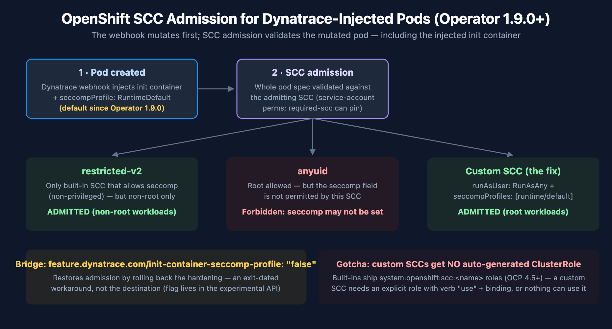

# FAQ-13: How Do Dynatrace Injection and OpenShift SCCs Interact? (seccomp, anyuid, and the Operator 1.9.0 Change)

> **Series:** FAQ — Frequently Asked Questions | **Reference:** 13 — Dynatrace Injection and OpenShift SCCs: seccomp, anyuid, and the Operator 1.9.0 Change | **Created:** July 2026 | **Last Updated:** 07/08/2026

## Overview

A recurring incident pattern on OpenShift: after upgrading Dynatrace Operator to **v1.9.0+**, pods that previously ran fine under the **`anyuid`** SCC are rejected at admission with `Forbidden: seccomp may not be set` — before they are even scheduled. Nothing crashed and no Dynatrace component errored; the pods simply stopped being admitted, which is why the break often surfaces first in production restarts.

The mechanics live in the gap between two documentation pages: the [seccomp profiles page (DT docs)](https://docs.dynatrace.com/docs/ingest-from/setup-on-k8s/guides/networking-security-compliance/security-configurations/seccomp) documents that Operator 1.9.0 changed the `feature.dynatrace.com/init-container-seccomp-profile` default — but says nothing about OpenShift or SCCs. The [Additional OpenShift configurations page (DT docs)](https://docs.dynatrace.com/docs/ingest-from/setup-on-k8s/guides/networking-security-compliance/security-configurations/openshift-configuration) documents which SCCs Dynatrace components use — but says nothing about seccomp or the 1.9.0 change. This entry covers the intersection: why the combination fails, a compatibility matrix, the recommended long-term fix (a custom SCC), how to find affected workloads **before** upgrading, and the operator change-management practices that keep the next default-flip from being a surprise.

> **Scope:** Dynatrace Operator ≥1.9.0 on OpenShift 4.11+ (incl. ARO/ROSA) with `applicationMonitoring` or `cloudNativeFullStack` injection. Claims about OpenShift built-in SCC behavior are cited to Red Hat documentation and knowledge base — verify against your exact OCP version, since SCC semantics have changed across 4.x.

---

## Table of Contents

1. [Short Answer](#short-answer)
2. [What Changed in Operator 1.9.0](#what-changed)
3. [Why anyuid + RuntimeDefault Fails at Admission](#why-it-fails)
4. [SCC Compatibility Matrix for Injected Workloads](#scc-matrix)
5. [The Long-Term Fix — a Custom SCC](#custom-scc)
6. [Assessing Impact Before You Upgrade](#pre-upgrade)
7. [Operator Change Management: Scope, Uninstall Residue, and Failure Isolation](#change-management)
8. [Recommended Approach](#recommendation)
9. [Common Gotchas](#gotchas)

---

## Prerequisites

| Requirement | Details |
|-------------|---------|
| **Platform** | OpenShift 4.11+ (SCC v2 family present); Dynatrace Operator with `applicationMonitoring` or `cloudNativeFullStack` |
| **Permissions** | Cluster-admin (or SCC-management rights) to inspect/create SCCs; ability to edit DynaKube resources |
| **Audience** | OpenShift platform/SRE teams; Dynatrace platform owners; account teams preparing an operator upgrade |
| **Related series** | K8S (DynaKube deployment modes, troubleshooting), ONBRD (deployment), FAQ-04/05 (update change-management on the agent side) |

<a id="short-answer"></a>
## 1. Short Answer

Since Operator **1.9.0**, the injected Dynatrace init container carries `seccompProfile: RuntimeDefault` **by default** (the `feature.dynatrace.com/init-container-seccomp-profile` flag flipped from `false` to `true`). OpenShift validates every pod's security context against the SCC that admits it — and among the built-in SCCs, per Dynatrace's own OpenShift documentation, **`restricted-v2` *"is the only built-in OpenShift SCC that allows usage of seccomp"*** (privileged aside). A pod admitted under **`anyuid`** therefore fails SCC validation the moment the webhook adds the seccomp profile: `Forbidden: seccomp may not be set` — a documented Red Hat failure mode, not a Dynatrace bug or an OpenShift bug, but an interaction neither doc page covers.

| Your situation | Your path |
|----------------|-----------|
| Injected workloads run under `restricted-v2` | No action — seccomp is allowed there; this is the happy path |
| Injected workloads need root (`anyuid` today) | **Long-term:** custom SCC allowing both `RunAsAny` and `runtime/default` seccomp (§5). **Immediate:** set the flag to `false` on the DynaKube (§2) — a rollback of the security improvement, not a destination |
| Not yet on 1.9.0 | Run the §6 assessment first; upgrade with the affected-workload list in hand |

> <sub>**Sources:** [Seccomp profiles (DT docs)](https://docs.dynatrace.com/docs/ingest-from/setup-on-k8s/guides/networking-security-compliance/security-configurations/seccomp) — the 1.9.0 default change; [Additional OpenShift configurations (DT docs)](https://docs.dynatrace.com/docs/ingest-from/setup-on-k8s/guides/networking-security-compliance/security-configurations/openshift-configuration) — the quoted restricted-v2 statement; [Pod not admitted due to seccomp with anyuid SCC (Red Hat KB, solution 7064000)](https://access.redhat.com/solutions/7064000) — the exact `Forbidden: seccomp may not be set` failure mode.</sub>

<a id="what-changed"></a>
## 2. What Changed in Operator 1.9.0

The [Operator 1.9.0 release notes (DT docs)](https://docs.dynatrace.com/docs/whats-new/dynatrace-operator/dto-fix-1-9-0) state the change in one line: the `feature.dynatrace.com/init-container-seccomp-profile` feature flag is now **enabled by default**, with the remediation *"If you relied on the unspecified seccomp profile on injected init containers, set the flag to `false`."* No OpenShift or SCC implications are mentioned.

**The intended benefit** (from the seccomp page): with the flag on, the init container gets the `RuntimeDefault` seccomp profile, which restricts the system calls it can make and helps *"meet the requirements of the **restricted** Pod Security Standard"* — a genuine hardening improvement, and on vanilla Kubernetes (Pod Security admission) it is a pure win. The breakage is OpenShift-specific, because OpenShift layers **SCC validation** on top (§3).

**The immediate workaround** — on the DynaKube:

```yaml
apiVersion: dynatrace.com/v1beta6
kind: DynaKube
metadata:
  name: dynakube
  annotations:
    feature.dynatrace.com/init-container-seccomp-profile: "false"
```

**Is the flag a long-term answer?** Treat it as a bridge, not a destination, for three reasons: (1) it rolls back a security improvement rather than solving the SCC conflict; (2) the flag is implemented in the operator's experimental API package (`pkg/api/exp/` in the [operator source (Dynatrace GitHub)](https://github.com/Dynatrace/dynatrace-operator)), and the operator maintains a *Deprecated feature flags* register that historically retires flags after a version threshold — no deprecation is published for this flag today, but the pattern argues against building on it; (3) the custom-SCC fix (§5) solves the actual conflict and keeps the hardening.

> **Docs inconsistency (as of 07/08/2026):** the [DynaKube feature-flags reference (DT docs)](https://docs.dynatrace.com/docs/ingest-from/setup-on-k8s/reference/dynakube-feature-flags) still lists this flag's default as `"false"` — the seccomp page and the 1.9.0 release notes are authoritative for Operator ≥1.9.0. Expect the reference page to catch up.

**Also in 1.9.0** — relevant to any upgrade assessment (§6): the DynaKube **`v1beta3` API version is removed from the CRD** (*"Applying DynaKube resources using this version will fail"* — migrate to `v1beta6` first), `v1beta4` is deprecated, pods injected via `applicationMonitoring`/`cloudNativeFullStack` now receive **automatic metadata enrichment**, legacy `dt.kubernetes.*` attributes are deprecated for `k8s.*`, and the `dynatrace/helm-charts` repository is deprecated in favor of `dynatrace/dynatrace-operator`.

> <sub>**Sources:** [Operator 1.9.0 release notes (DT docs)](https://docs.dynatrace.com/docs/whats-new/dynatrace-operator/dto-fix-1-9-0) — quoted remediation + breaking changes; [Seccomp profiles (DT docs)](https://docs.dynatrace.com/docs/ingest-from/setup-on-k8s/guides/networking-security-compliance/security-configurations/seccomp) — quoted PSS rationale; [DynaKube feature flags (DT docs)](https://docs.dynatrace.com/docs/ingest-from/setup-on-k8s/reference/dynakube-feature-flags) — stale default noted; flag location verified in the operator source 07/08/2026. **Derived:** the bridge-not-destination guidance synthesizes the flag's experimental-package location and the operator's flag-retirement pattern — no official deprecation exists for this flag today.</sub>

<a id="why-it-fails"></a>
## 3. Why anyuid + RuntimeDefault Fails at Admission



<!-- MARKDOWN_TABLE_ALTERNATIVE
| Step | What happens |
|------|--------------|
| 1 | Workload pod is created; Dynatrace webhook injects the init container (with seccompProfile RuntimeDefault since 1.9.0) |
| 2 | OpenShift SCC admission matches the pod to an SCC (service-account permissions decide; required-scc annotation can pin) |
| 3a | restricted-v2 admits: seccomp runtime/default allowed -> pod runs (if workload is non-root) |
| 3b | anyuid admits root workload BUT does not allow the seccomp field -> Forbidden: seccomp may not be set |
| 3c | custom SCC (RunAsAny + runtime/default) -> root workload AND seccomp both allowed -> pod runs |
For environments where SVG doesn't render
-->

Three facts collide:

1. **The webhook mutates every injected pod.** Since 1.9.0 the injected init container carries `seccompProfile: RuntimeDefault` — the workload team changed nothing; the pod spec changed anyway.
2. **SCC admission validates the whole pod** — init containers included — against the SCC the pod is admitted under. A field the SCC doesn't allow means rejection at admission, before scheduling: the *"Forbidden: seccomp may not be set"* error documented in [Red Hat KB solution 7064000](https://access.redhat.com/solutions/7064000) for exactly the anyuid case.
3. **No built-in SCC satisfies both needs.** Workloads that must run as root (or a fixed UID) sit on `anyuid` — which does not allow the seccomp field. Seccomp is allowed on `restricted-v2` — which does not allow arbitrary UIDs. Per the [DT OpenShift configuration page](https://docs.dynatrace.com/docs/ingest-from/setup-on-k8s/guides/networking-security-compliance/security-configurations/openshift-configuration), restricted-v2 *"is the only built-in OpenShift SCC that allows usage of seccomp, which our components have set by default"* (the fully-permissive `privileged` SCC aside — see §4). **The intersection your root workload needs — `RunAsAny` UID + `runtime/default` seccomp — exists in no built-in SCC**, which is why the durable answer is a custom one (§5).

Why it was *silent*: the failure fires only when a pod is (re)created — steady-state pods keep running after the operator upgrade, and the rejections begin with the next rollout, node drain, or crash-restart. That gap between upgrade and symptom is what makes pre-upgrade assessment (§6) the load-bearing practice.

> <sub>**Sources:** [Red Hat KB solution 7064000](https://access.redhat.com/solutions/7064000) — the anyuid + seccomp admission failure; [Additional OpenShift configurations (DT docs)](https://docs.dynatrace.com/docs/ingest-from/setup-on-k8s/guides/networking-security-compliance/security-configurations/openshift-configuration) — quoted restricted-v2 statement; [Seccomp profiles (DT docs)](https://docs.dynatrace.com/docs/ingest-from/setup-on-k8s/guides/networking-security-compliance/security-configurations/seccomp). **Derived:** the three-facts framing and the silence analysis are engagement-level synthesis of the cited mechanics.</sub>

<a id="scc-matrix"></a>
## 4. SCC Compatibility Matrix for Injected Workloads

For workloads receiving Dynatrace injection on Operator ≥1.9.0 (flag at its default `true`):

| SCC | UID policy | Allows `runtime/default` seccomp? | Injected pod outcome |
|-----|-----------|-----------------------------------|----------------------|
| `restricted-v2` | `MustRunAsRange` (non-root) | **Yes** — the only built-in that allows seccomp (per DT docs) | ✅ Admitted — the designed happy path for non-root workloads |
| `anyuid` | `RunAsAny` (root allowed) | **No** | ❌ `Forbidden: seccomp may not be set` at admission ([RH KB 7064000](https://access.redhat.com/solutions/7064000)) |
| `nonroot-v2` | `MustRunAsNonRoot` | Verify in your cluster: `oc get scc nonroot-v2 -o jsonpath='{.seccompProfiles}'` | Non-root only either way; confirm the seccomp field before relying on it |
| `privileged` | `RunAsAny` | Yes (allows everything) | ✅ Admitted — but grossly over-grants; not a remediation, a liability |
| **Custom SCC (§5)** | `RunAsAny` | **Yes** (explicitly listed) | ✅ Admitted — the recommended long-term path for root workloads |

**How the SCC is chosen — and how `openshift.io/required-scc` interacts with injection.** OpenShift picks the most-restrictive applicable SCC based on what the pod's creator/service account has `use` permission for; the webhook's mutation happens *before* SCC admission, so the injected fields participate in that selection/validation. To remove ambiguity you can pin the SCC: per the [Red Hat 4.18 SCC documentation](https://docs.redhat.com/en/documentation/openshift_container_platform/4.18/html/authentication_and_authorization/managing-pod-security-policies), set the `openshift.io/required-scc` annotation on the workload's **pod template** — the SCC *"must exist in the cluster and must be applicable to the workload, otherwise pod admission fails,"* and *"do not change the `openshift.io/required-scc` annotation in the live pod's manifest"* (update the template so pods are re-created). Pinning is double-edged with injection: it makes admission deterministic, and it also means a pinned-to-`anyuid` workload fails hard the moment the webhook adds seccomp — which is arguably better than failing unpredictably.

> <sub>**Sources:** [Additional OpenShift configurations (DT docs)](https://docs.dynatrace.com/docs/ingest-from/setup-on-k8s/guides/networking-security-compliance/security-configurations/openshift-configuration), [Red Hat KB 7064000](https://access.redhat.com/solutions/7064000), [Managing security context constraints, OCP 4.18 (Red Hat docs)](https://docs.redhat.com/en/documentation/openshift_container_platform/4.18/html/authentication_and_authorization/managing-pod-security-policies) — required-scc rules quoted. **Softened:** nonroot-v2's seccomp allowance is left to an in-cluster check rather than asserted — built-in SCC fields have shifted across 4.x releases; the one-line `oc` check is authoritative for your cluster.</sub>

<a id="custom-scc"></a>
## 5. The Long-Term Fix — a Custom SCC

For root-requiring workloads with Dynatrace injection, create a custom SCC that allows exactly the missing intersection — arbitrary UID **plus** `runtime/default` seccomp. Start from `anyuid`'s posture and add the seccomp allowance (never modify the built-in SCCs themselves — Red Hat's guidance is that default SCCs should not be edited, both for supportability and upgrade safety):

```yaml
apiVersion: security.openshift.io/v1
kind: SecurityContextConstraints
metadata:
  name: anyuid-seccomp
allowHostDirVolumePlugin: false
allowHostIPC: false
allowHostNetwork: false
allowHostPID: false
allowHostPorts: false
allowPrivilegedContainer: false
allowPrivilegeEscalation: true
runAsUser:
  type: RunAsAny            # the anyuid property your root workloads need
seLinuxContext:
  type: MustRunAs
seccompProfiles:
  - runtime/default          # the allowance anyuid lacks
fsGroup:
  type: RunAsAny
supplementalGroups:
  type: RunAsAny
volumes:
  - configMap
  - csi                      # required when the Dynatrace CSI driver provides the agent binaries
  - downwardAPI
  - emptyDir
  - persistentVolumeClaim
  - projected
  - secret
priority: 5                  # outrank anyuid (10 default? verify) only if you want auto-selection; omit and pin via required-scc for determinism
```

**The RBAC step everyone misses:** since OpenShift 4.5, the *built-in* SCCs ship with auto-generated `system:openshift:scc:<name>` ClusterRoles — **a custom SCC gets no such role automatically**. Grant access explicitly, either per-namespace:

```bash
oc create role use-anyuid-seccomp --verb=use \
  --resource=securitycontextconstraints --resource-name=anyuid-seccomp -n <namespace>
oc create rolebinding use-anyuid-seccomp --role=use-anyuid-seccomp \
  --serviceaccount=<namespace>:<serviceaccount> -n <namespace>
```

or with `oc adm policy add-scc-to-user anyuid-seccomp -z <serviceaccount> -n <namespace>` (which, since 4.5, manages this via role bindings rather than editing the SCC's user list). Then either remove the workload's `anyuid` grant (so the custom SCC is selected) or pin it with `openshift.io/required-scc: anyuid-seccomp` on the pod template (§4).

**Verify before rollout:** re-create one affected pod and confirm its admitting SCC with `oc get pod <pod> -o jsonpath='{.metadata.annotations.openshift\.io/scc}'` — the pod-level `openshift.io/scc` annotation records what actually admitted it. Once workloads run under the custom SCC, set the DynaKube flag back to its secure default (remove the `"false"` override).

> <sub>**Sources:** [Managing security context constraints, OCP 4.18 (Red Hat docs)](https://docs.redhat.com/en/documentation/openshift_container_platform/4.18/html/authentication_and_authorization/managing-pod-security-policies) — custom-SCC + RBAC `use`-verb model, don't-modify-defaults guidance; [`oc adm policy add-scc-to-user` behavior change in 4.x (Red Hat KB, solution 5529581)](https://access.redhat.com/solutions/5529581) — role-binding-based since 4.5; [Additional OpenShift configurations (DT docs)](https://docs.dynatrace.com/docs/ingest-from/setup-on-k8s/guides/networking-security-compliance/security-configurations/openshift-configuration) — CSI volume requirement for CSI-driver deployments. **Derived:** the specific `anyuid-seccomp` YAML is a worked synthesis of the anyuid posture + the seccomp allowance — review every field against your security baseline before applying; the `priority` field's interaction with SCC auto-selection is deliberately flagged for per-cluster verification.</sub>

<a id="pre-upgrade"></a>
## 6. Assessing Impact Before You Upgrade

The 1.9.0 incident pattern generalizes: **operator upgrades change injected pod specs, and injected pod specs are validated by platform admission** — so the pre-upgrade question is *"which of my injected workloads are admitted under an SCC that won't accept the new spec?"* For the seccomp change specifically:

```bash
# 1. Which SCC is admitting each running pod? (the openshift.io/scc annotation records it)
oc get pods -A -o jsonpath='{range .items[*]}{.metadata.namespace}{"\t"}{.metadata.name}{"\t"}{.metadata.annotations.openshift\.io/scc}{"\n"}{end}' | sort | uniq -c -f2 | sort -rn

# 2. Narrow to Dynatrace-injected pods (init container name) admitted under anyuid
oc get pods -A -o json | jq -r '.items[]
  | select(.metadata.annotations."openshift.io/scc" == "anyuid")
  | select([.spec.initContainers[]?.name] | index("dynatrace-oneagent-injection"))
  | "\(.metadata.namespace)\t\(.metadata.name)"'
```

Every hit on query 2 is a pod that will be rejected on its next re-creation after the upgrade (unless the flag is `false` or a custom SCC lands first). Run the same *annotation-vs-new-spec* thinking against each release's notes: the general checklist —

1. **Read the release notes for the versions you're crossing** — Dynatrace publishes per-version operator notes; 1.9.0 alone carried the seccomp default, a CRD API-version **removal** (`v1beta3`), and behavioral changes (automatic metadata enrichment). Multi-version jumps compound.
2. **Diff the rendered manifests** — `helm template` old vs. new (or `oc diff`) shows exactly what the upgrade changes cluster-side before anything applies.
3. **Canary one non-production DynaKube first** and re-create (not just observe) injected pods there — admission failures only fire on creation (§3).
4. **Check API-version currency** — `oc get dynakube -o jsonpath='{.items[*].apiVersion}'` before any upgrade that removes CRD versions.
5. **Watch the injection webhook's events after upgrade** — `oc get events -A --field-selector reason=FailedCreate` catches admission rejections centrally (they surface on the ReplicaSet, not the pod).

> <sub>**Sources:** the pod-level `openshift.io/scc` annotation and admission behavior per [Red Hat SCC documentation](https://docs.redhat.com/en/documentation/openshift_container_platform/4.18/html/authentication_and_authorization/managing-pod-security-policies); [Operator 1.9.0 release notes (DT docs)](https://docs.dynatrace.com/docs/whats-new/dynatrace-operator/dto-fix-1-9-0). **Derived:** the assessment commands are worked examples (verify the injected init-container name against your operator version — check one injected pod's spec first); the five-step checklist is engagement-level synthesis.</sub>

<a id="change-management"></a>
## 7. Operator Change Management: Scope, Uninstall Residue, and Failure Isolation

**What is cluster-scoped vs. namespace-scoped.** Cluster-scoped: the DynaKube **CRD** (and its stored API versions), the mutating/validating **webhook configurations**, the **CSI driver** (DaemonSet machinery + node-local state), and SCCs/RBAC. Namespace-scoped: the operator deployment and DynaKube resources (in the Dynatrace namespace) and the **injection secrets the operator places into each monitored application namespace**. The practical consequence: a "small" operator change can have cluster-wide blast radius via the webhook and CRD — which is exactly how a default-flip reaches every injected namespace at once.

**What persists after uninstall.** Per the [update/uninstall documentation (DT docs)](https://docs.dynatrace.com/docs/ingest-from/setup-on-k8s/guides/deployment-and-configuration/updates-and-maintenance/update-uninstall-operator): delete DynaKubes first and wait for cleanup, because **Kubernetes OwnerReferences don't cross namespaces** — the operator must delete the secrets it created in application namespaces itself; applications using the **CSI driver must be shut down/restarted** before the driver is removed; and **node-level data can remain** depending on monitoring mode — Dynatrace ships a **cleanup DaemonSet script** to purge OneAgent/CSI residue from Linux nodes (run only after all DynaKubes are gone and monitored pods restarted).

**Isolating Dynatrace vs. platform when injection fails.** The error's *location* tells you the layer:

| Symptom | Layer | First check |
|---------|-------|-------------|
| Pod never created; `Forbidden` in ReplicaSet events | **Platform admission (SCC/PSS)** — the pod spec (post-mutation) violates the admitting SCC | `oc get events` on the ReplicaSet; the pod's would-be SCC vs. its spec (§4/§6) |
| Pod created; Dynatrace init container fails/CrashLoops | **Injection layer** | Init container logs; CSI driver pod logs on that node |
| Pod runs; no Dynatrace data | **Agent/connectivity layer** | OneAgent pod logs, DynaKube status, network egress |
| Only *new* pods affected after a change | **Webhook/config layer** | What changed in the DynaKube/operator; existing pods carry the old spec |

The first row is the 1.9.0 case — no Dynatrace log anywhere shows an error, because Dynatrace never got to run; the evidence lives in OpenShift admission events. That asymmetry is worth internalizing: **webhook-injected fields fail as platform errors, not vendor errors.**

> <sub>**Sources:** [Update or uninstall Dynatrace Operator (DT docs)](https://docs.dynatrace.com/docs/ingest-from/setup-on-k8s/guides/deployment-and-configuration/updates-and-maintenance/update-uninstall-operator) — cross-namespace secrets, CSI shutdown ordering, node cleanup DaemonSet; [Dynatrace Operator components (DT docs)](https://docs.dynatrace.com/docs/ingest-from/setup-on-k8s/how-it-works/components/dynatrace-operator). **Derived:** the scope split and the four-row isolation table are engagement-level synthesis of the documented component architecture.</sub>

<a id="recommendation"></a>
## 8. Recommended Approach

1. **If you're mid-incident:** set `feature.dynatrace.com/init-container-seccomp-profile: "false"` on the DynaKube to restore admission for anyuid workloads — then treat it as a bridge with an exit date, not a fix.
2. **Build the custom SCC** (§5) for root-requiring injected workloads: `RunAsAny` + `runtime/default` seccomp + the CSI volume, granted via an explicit `use` role (custom SCCs get no auto-generated ClusterRole), pinned with `openshift.io/required-scc` where determinism matters.
3. **Restore the secure default** once workloads admit under the custom SCC — the seccomp profile is a real hardening gain; the goal is keeping it *and* admission.
4. **Institutionalize the pre-upgrade assessment** (§6): release notes for every version crossed, manifest diff, canary DynaKube with pod re-creation, API-version check, admission-event watch. The seccomp flip won't be the last injected-spec change.
5. **For non-root workloads**, move them to `restricted-v2` rather than widening anything — it is the designed path and the only built-in where the seccomp default just works.
6. **For the customer conversation:** acknowledge the docs gap plainly (it is real — the seccomp page and the OpenShift page each cover half the story, and the feature-flags reference still shows the pre-1.9 default), walk this entry's §3 mechanics live with their platform team, and leave the §6 checklist as the artifact that prevents recurrence. Trust rebuilds on the demonstrated ability to predict the next break, not on relitigating the last one.

<a id="gotchas"></a>
## 9. Common Gotchas

| # | Gotcha | Consequence | Fix |
|---|--------|-------------|-----|
| 1 | Expecting the break at upgrade time | Rejections start at the next pod re-creation, days later | Canary with forced pod re-creation (§6) |
| 2 | Looking for the error in Dynatrace logs | Admission failures never reach any Dynatrace component | ReplicaSet events (`FailedCreate`) hold the evidence (§7) |
| 3 | Fixing it with the `privileged` SCC | Admission works; security posture collapses | Custom SCC with exactly the two needed allowances (§5) |
| 4 | Editing `anyuid` to allow seccomp | Modifying default SCCs is unsupported practice and upgrade-fragile | Custom SCC; never edit built-ins (§5) |
| 5 | Custom SCC created, pods still rejected | No auto-generated ClusterRole for custom SCCs — nothing may `use` it | Explicit `use`-verb role + binding (§5) |
| 6 | Changing `required-scc` on live pods | Admission fails — the annotation is validated against the live manifest | Change it on the pod template; pods re-create (§4) |
| 7 | Leaving the flag at `"false"` permanently | Hardening rolled back estate-wide for one workload class's problem | Scope the fix to the workloads (custom SCC), restore the default (§8) |
| 8 | Skipping DynaKube API-version checks on upgrade | 1.9.0 removed `v1beta3` — applies fail outright | `oc get dynakube -o jsonpath='{.items[*].apiVersion}'` first (§6) |

## Summary

Operator 1.9.0's seccomp default is a sound hardening change that collides with OpenShift's SCC model for exactly one class of workload: those admitted under `anyuid`. The collision is documented on the Red Hat side, invisible in the Dynatrace docs' seam, and silent until pods re-create. The durable fix is a custom SCC granting the intersection no built-in provides (`RunAsAny` + `runtime/default` seccomp) with its easily-missed RBAC step; the flag is the bridge. The generalizable lesson is operational: webhook-injected fields fail as *platform* errors, so operator change management on OpenShift means reading release notes as admission-impact questions and canarying with pod re-creation — §6 is the checklist to leave with the platform team.

## Next Steps

- **K8S series** — DynaKube deployment modes, CSI driver architecture, and troubleshooting foundations this entry builds on.
- **FAQ-04 / FAQ-05** — the same staged, assessed change-management discipline applied to OneAgent and ActiveGate updates.
- **ONBRD-04** — deployment planning where the SCC strategy should be decided, not discovered.

---

<sub>*This notebook was AI-generated from community-submitted and publicly available sources. This notebook series is not officially supported by Dynatrace. Always verify information against official [Dynatrace documentation](https://docs.dynatrace.com/docs).*</sub>
