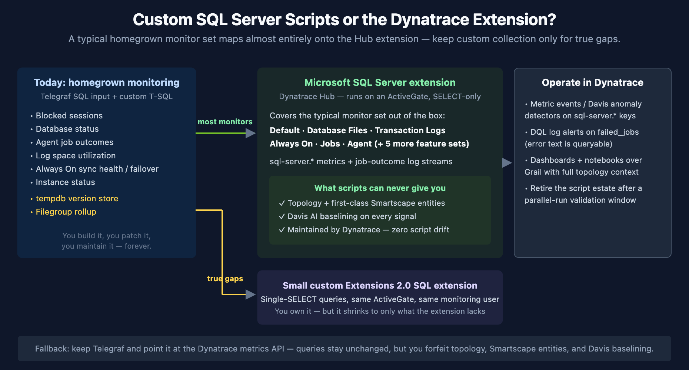

# FAQ-14: Should I Replace My Custom SQL Server Monitoring Scripts with the Dynatrace Extension?

> **Series:** FAQ — Frequently Asked Questions | **Reference:** 14 — Custom SQL Server Scripts vs. the Dynatrace Extension | **Created:** July 2026 | **Last Updated:** 07/15/2026

## Overview

Most teams arriving at Dynatrace with an established SQL Server estate bring a homegrown monitoring layer with them: a set of custom T-SQL queries polled by Telegraf, cron jobs, or a scheduler — blocked sessions, database status, agent job outcomes, log space, Always On health, instance status, and usually one or two exotic checks like tempdb version-store pressure. The scripts work, so the natural question is *"can't we just keep them?"*

You can — but in a typical estate the **Microsoft SQL Server extension from Dynatrace Hub covers nearly the entire homegrown monitor set out of the box**, and it delivers three things a script can never produce: topology, first-class Smartscape entities, and Davis AI baselining. This entry maps a typical custom monitor set onto the extension's signals, is honest about the gaps, and lays out the decision — including when keeping Telegraf is the right call.

---

## Table of Contents

1. [Short Answer](#short-answer)
2. [Two Views of a Database: Caller-Side vs Server-Side](#two-views)
3. [What the Extension Collects Out of the Box](#what-it-collects)
4. [Mapping a Typical Homegrown Monitor Set](#mapping)
5. [What You Gain Beyond the Numbers](#beyond-the-numbers)
6. [Honest Gaps and Constraints](#gaps-and-constraints)
7. [Closing Real Gaps with a Small Custom Extension](#custom-extension)
8. [The Keep-Telegraf Fallback](#keep-telegraf)
9. [Setup Essentials and Cost](#setup-and-cost)
10. [Recommended Approach](#recommended-approach)
11. [Common Objections](#objections)

---

## Prerequisites

| Requirement | Details |
|-------------|---------|
| **Dynatrace Environment** | SaaS with Grail |
| **ActiveGate** | An ActiveGate group with network reach to the SQL Server estate (host-based; a local OneAgent variant of the extension also exists) |
| **SQL monitoring user** | `VIEW SERVER STATE` (SQL Server 2022+: `VIEW SERVER PERFORMANCE STATE`); `VIEW ANY DEFINITION` for Always On views; read on `msdb` for jobs/backups |
| **Audience** | DBA teams with existing script/Telegraf-based SQL Server monitoring; platform teams; account teams |
| **Related series** | DBMON (database monitoring mechanics, dashboards, alerting), FAQ-09 (metric vs log query economics), AUTOM (extension deployment at scale) |

<a id="short-answer"></a>
## 1. Short Answer

**Yes, for almost all of it.** Deploy the Microsoft SQL Server extension (Hub, ActiveGate-based) as Dynatrace recommends, and a typical homegrown monitor set — blocked sessions, database status, job outcomes, log space utilization, Always On sync health and failover posture, instance status, file space — is covered out of the box by documented `sql-server.*` metrics and job-outcome log streams. Keep custom collection only for the checks the extension genuinely doesn't make (in practice: tempdb version-store pressure, and filegroup-level rollups if that exact granularity drives an alert), and implement those as a small Extensions 2.0 SQL extension on the same ActiveGate.

The reason to switch is not just parity. Scripts deliver numbers; the extension delivers numbers **attached to entities** — topology, Smartscape SQL Server instances/databases/availability groups, and Davis AI baselining on every signal. Bypassing the extension and shipping raw script output into Dynatrace forfeits exactly the capabilities most customers bought the platform for.



<!-- MARKDOWN_TABLE_ALTERNATIVE
| Path | What happens | What you get / give up |
|------|--------------|------------------------|
| Hub extension (recommended) | Typical monitor set covered OOTB via sql-server.* metrics + job log streams | Topology, Smartscape entities, Davis baselining; maintained by Dynatrace |
| True gaps (tempdb version store, filegroup rollup) | Small custom EF 2.0 SQL extension, single-SELECT, same ActiveGate | You own it — but it shrinks to only what the extension lacks |
| Keep Telegraf → Dynatrace metrics API | Queries unchanged | No topology, no Smartscape entities, no Davis baselining; second agent to operate |
-->

> <sub>**Sources:** [Microsoft SQL Server extension (DT docs)](https://docs.dynatrace.com/docs/observe/infrastructure-observability/databases/extensions/microsoft-sql-server-2), [SQL Server Monitoring (Dynatrace Hub)](https://www.dynatrace.com/hub/detail/microsoft-sql-server-2/). **Derived:** the "almost all of it" claim combines the extension's documented metric catalog with a monitor inventory common across field engagements.</sub>

<a id="two-views"></a>
## 2. Two Views of a Database: Caller-Side vs Server-Side

Dynatrace observes a database from two independent directions, and the distinction is what makes this question worth asking at all:

| | Caller-side (OneAgent / OpenTelemetry) | Server-side (SQL Server extension) |
|---|---|---|
| **Where it measures** | Inside your application processes | Inside the database engine, via DMV queries from an ActiveGate |
| **What it sees** | Every statement your services execute: response time, failure rate, throughput, per-statement breakdown (`db.system == "mssql"` spans) | Engine internals: blocking, memory/buffer pool, transaction logs, Always On replicas, agent jobs, file space |
| **What it can't see** | Why the engine is slow (blocking, log pressure, failover), jobs, databases no instrumented app talks to | Individual statement latency as your application experienced it |
| **Agent on the DB host?** | No (measures from the caller) | No (remote from ActiveGate) — a local OneAgent variant exists |

Homegrown script estates exist because teams historically only had the server-side view to build on. The caller-side view (covered in the DBMON series) comes free with OneAgent instrumentation of your applications; the extension completes the picture on the server side. **The two are complements, not alternatives** — the migration decision is only about who produces the server-side signals: your scripts, or the extension.

> <sub>**Sources:** [Microsoft SQL Server extension (DT docs)](https://docs.dynatrace.com/docs/observe/infrastructure-observability/databases/extensions/microsoft-sql-server-2), [Microsoft SQL Server local extension (DT docs)](https://docs.dynatrace.com/docs/observe/infrastructure-observability/databases/extensions/microsoft-sql-server-local). **Derived:** the caller-side/server-side framing is a synthesis of the extension docs and Dynatrace's span-based database monitoring model.</sub>

<a id="what-it-collects"></a>
## 3. What the Extension Collects Out of the Box

The extension organizes collection into **11 feature sets**. The ones that matter for replacing a typical script estate:

| Feature set | Key signals (documented keys) |
|---|---|
| **Default** (always on) | `sql-server.general.processesBlocked`, `sql-server.databases.state`, `sql-server.uptime`, `sql-server.general.userConnections`, memory/CPU/worker-thread metrics |
| **Transaction Logs** | `sql-server.databases.log.percentUsed`, `.log.filesUsedSize`, `.log.filesSize`, growth/shrink/truncation/flush-wait counts |
| **Database Files** | `sql-server.databases.file.size` / `.usedSpace` / `.emptySpace` + a `largest_files` log stream (top 100 files every 5 minutes) |
| **Always On** | Availability-group, replica, and database-level health: `.ag.synchronizationHealth`, `.ar.role`, `.ar.failoverMode`, `.ar.operationalState`, `.db.synchronizationState`, log send/redo queue sizes and rates |
| **Jobs** | `current_jobs` log stream (`job_name`, `job_status`, `last_run_outcome`, duration, execution dates) + `failed_jobs` log stream (step, `sql_severity`, retries, **error message text**) |
| **Agent** | `sql-server.sql.agent.status` |
| Memory / Locks / Latches / Queries / Sessions / Replication / Backups | Buffer pool and page life expectancy, deadlocks, latch waits, top longest queries (2016+), session counts, backup age/size |

Two structural points worth internalizing:

- **The metric namespace is `sql-server.*`** — these are documented, versioned keys maintained by Dynatrace, not names you invented in a Telegraf config.
- **Job outcomes arrive as log streams, not metrics.** That is an upgrade: the failure message text lands in Grail and is queryable with DQL, which polling `sysjobhistory` into a numeric metric never gave you.

> <sub>**Sources:** [Microsoft SQL Server extension (DT docs)](https://docs.dynatrace.com/docs/observe/infrastructure-observability/databases/extensions/microsoft-sql-server-2) — feature sets, metric keys, and log-stream attributes are documented on this page.</sub>

<a id="mapping"></a>
## 4. Mapping a Typical Homegrown Monitor Set

The table below maps the monitor set we see most often in script/Telegraf estates onto the extension. If your set looks like this, the extension replaces it nearly one-for-one:

| Typical homegrown monitor | Extension coverage | Notes |
|---|---|---|
| Blocked sessions (poll `sysprocesses`) | ✅ `sql-server.general.processesBlocked` | Semantics differ slightly: scripts often count *blocking* SPIDs, the metric counts *blocked* processes — directionally equivalent, don't copy thresholds 1:1 |
| Database status (`sys.databases`) | ✅ `sql-server.databases.state` | Per database |
| Agent job last-run outcome (`msdb.dbo.sysjobhistory`) | ✅ `current_jobs` / `failed_jobs` log streams | Richer than the script — error text queryable |
| Transaction log space | ✅ `sql-server.databases.log.percentUsed` | Exact equivalent |
| Always On sync health | ✅ `.ag/.ar/.db.synchronizationHealth` family | AG, replica, and database granularity |
| Failover posture / replica role | ✅ `.ar.role`, `.ar.failoverMode`, `.ar.operationalState` | Point the Always On config at the **primary** replica |
| Instance status / uptime | ✅ `sql-server.uptime` + connection/worker metrics | Extension connectivity doubles as reachability signal |
| Database file space | ✅ Database Files feature set | Per database and per file |
| tempdb version-store pressure | ❌ Not collected | The one recurring hard gap — see section 7 |
| Filegroup-level %-of-maxsize rollup | ⚠️ File-level only | No filegroup dimension exists on the file metrics |

> <sub>**Sources:** [Microsoft SQL Server extension (DT docs)](https://docs.dynatrace.com/docs/observe/infrastructure-observability/databases/extensions/microsoft-sql-server-2). **Derived:** the "typical homegrown monitor set" is a field-observed composite; your inventory may differ — run the mapping against your actual script list before deciding.</sub>

<a id="beyond-the-numbers"></a>
## 5. What You Gain Beyond the Numbers

If the extension only matched your scripts metric-for-metric, the migration would be a wash. The case for switching is what arrives *around* the numbers:

1. **Topology and entity context.** Extension signals attach to SQL Server instance/database entities rather than floating as anonymous custom metrics. Since Semantic Dictionary 1.340, Smartscape models SQL Server natively — availability databases, groups, replicas, instances, and databases as first-class typed entities with relationships. A blocked-session spike is one click away from the services calling that database.
2. **Davis AI baselining.** Every extension metric is eligible for Davis anomaly detection — seasonal baselines instead of the static thresholds scripts force you into. Your Telegraf metrics can be alerted on too, but only with thresholds you tune by hand, forever.
3. **Zero maintenance.** Dynatrace versions the extension against SQL Server releases, DMV changes, and permission-model changes (e.g., the 2022 `VIEW SERVER PERFORMANCE STATE` split). Every one of those is currently your job.
4. **Unified alerting surface.** Metric events, Davis problems, and DQL log alerts on `failed_jobs` all flow into the same problem/notification pipeline as the rest of your observability — no parallel alert path to operate.

In community practice, the maintenance point is the one that lands hardest with DBA teams: the scripts are rarely the problem — the person who wrote them leaving is.

> <sub>**Sources:** [Microsoft SQL Server extension (DT docs)](https://docs.dynatrace.com/docs/observe/infrastructure-observability/databases/extensions/microsoft-sql-server-2), [Semantic Dictionary 1.340 changelog (DT docs)](https://docs.dynatrace.com/docs/semantic-dictionary/changelog/version-1-340) — 19 first-class Smartscape database models incl. SQL Server availability database/group/replica, instance, database. **Derived:** the four-point value framing combines both sources with the DPS alerting model.</sub>

<a id="gaps-and-constraints"></a>
## 6. Honest Gaps and Constraints

The migration case survives honesty; hiding these helps no one:

- **No tempdb / version-store metrics.** Nothing in any feature set covers `version_store_reserved_page_count` or the longest-running-transaction counter. If you run read-committed snapshot isolation at scale, this check matters and stays custom.
- **No filegroup dimension.** File metrics are per-database and per-file. A filegroup %-of-maxsize rollup cannot be reconstructed from the documented dimensions.
- **Jobs bill as log ingest,** not metrics (as do the largest-files and top-queries streams). Factor it into DPS planning — the volumes are small (top-100 records every 5 minutes), but it is a different meter.
- **Always On needs deliberate config.** Two monitoring configurations: Always On feature set → primary replicas only; everything else → all instances. Connecting primaries *and* secondaries with Always On enabled produces duplicate metrics — documented as discouraged.
- **Blocked-process semantics** differ from typical scripts (blocked vs blocking counts) — revalidate thresholds during the parallel run.
- **The extension accepts no user-defined SQL.** Custom checks don't bolt onto it; they live in a separate small extension (next section).

> <sub>**Sources:** [Microsoft SQL Server extension (DT docs)](https://docs.dynatrace.com/docs/observe/infrastructure-observability/databases/extensions/microsoft-sql-server-2) — feature-set catalog, dimension lists, Always On configuration guidance, and DDU/DPS notes.</sub>

<a id="custom-extension"></a>
## 7. Closing Real Gaps with a Small Custom Extension

For the checks the extension genuinely lacks, build a **declarative Extensions 2.0 extension with the `sqlServer` data source**. It runs on the same ActiveGate, uses the same monitoring user, and emits gauge/count metrics with dimensions — no agent, no scheduler, no script host.

Constraints that will affect scripts as currently written:

- **Single, plain `SELECT` statements only.** `DECLARE`, table variables, `INSERT…EXEC`, `sp_MSforeachdb`, and `IF/ELSE` are rejected — most homegrown checks need a rewrite into one SELECT (usually straightforward: subqueries + `CROSS JOIN` replace the procedural scaffolding).
- **Comments inside queries are rejected.**
- Default 10-second query timeout; queries run sequentially on one connection.

Design rule worth adopting during the rewrite: **emit raw values, not verdicts.** A script that returns `1` when version store exceeds 30% of tempdb bakes the threshold into the collector. Emit the percentage as a gauge and put the `> 30` in a Dynatrace metric event — thresholds become tunable, and Davis can baseline the raw signal.

The DBMON series carries the mechanics of the server-side view; the [SQL data source reference (DT docs)](https://docs.dynatrace.com/docs/ingest-from/extensions/develop-your-extensions/data-sources/sql/sql-reference) documents the YAML shape, scheduling (per-minute to cron), and dimension model.

> <sub>**Sources:** [SQL data source reference (DT docs)](https://docs.dynatrace.com/docs/ingest-from/extensions/develop-your-extensions/data-sources/sql/sql-reference). **Derived:** the emit-raw-values-not-verdicts rule is a community/engagement pattern, not documented Dynatrace guidance.</sub>

<a id="keep-telegraf"></a>
## 8. The Keep-Telegraf Fallback

Keeping Telegraf and pointing it at Dynatrace is legitimate — the Telegraf output plugin ships to the local OneAgent metric API (`:14499/metrics/ingest`) or the Metrics API v2, and the queries stay exactly as written since Telegraf executes them itself.

Be clear-eyed about what that choice costs:

| | Extension path | Keep-Telegraf path |
|---|---|---|
| Query rewrite | Gaps only (single-SELECT) | None |
| Topology / Smartscape entities | ✅ | ❌ plain custom metrics |
| Davis baselining context | ✅ entity-aware | ⚠️ metric-only |
| Maintenance owner | Dynatrace (+ your small gap extension) | You, indefinitely |
| Agents to operate | ActiveGate (already required) | ActiveGate **+** Telegraf fleet |

If you skip the extension entirely and bring everything in through Telegraf, you are running Dynatrace as a metrics bucket — forfeiting the topology, entity model, and AI baselining that differentiate it, and handicapping the platform's ability to deliver the visibility and predictability you adopted it for. The fallback earns its keep as a **transition state** (parallel-run during migration) or for the rare check that resists a single-SELECT rewrite — not as the destination.

> <sub>**Sources:** [Microsoft SQL Server extension (DT docs)](https://docs.dynatrace.com/docs/observe/infrastructure-observability/databases/extensions/microsoft-sql-server-2). **Derived:** the trade-off table combines the extension's documented entity model with the plain-custom-metric behavior of API-ingested series.</sub>

<a id="setup-and-cost"></a>
## 9. Setup Essentials and Cost

1. Install the extension from **Dynatrace Hub** (remote flavor; a local OneAgent variant exists for hosts already running OneAgent).
2. Designate an **ActiveGate group** for DB connections — one 2 vCPU / 4 GB ActiveGate handles hundreds of endpoints, with automatic failover within the group.
3. Create the **monitoring SQL user** (grants in Prerequisites). The extension only executes `SELECT`s.
4. Enable feature sets to match your monitor inventory — Default, Database Files, Transaction Logs, Always On, Jobs, Agent covers the typical set.
5. Set up the **two Always On configurations** (section 6).
6. **Cost:** the extension is free; you pay for ingested data — `sql-server.*` keys as metrics ingest, the jobs/files/queries streams as log ingest.

Verification once data flows — blocked processes from the Default feature set:

```dql
// Blocked processes from the SQL Server extension (Default feature set)
timeseries blocked = avg(`sql-server.general.processesBlocked`), from:-24h
```

And the job-outcome log stream — the failure message text is right there in Grail:

```dql
// Failed SQL Server Agent jobs in the last 24h (Jobs feature set log stream)
fetch logs, from:-24h
| filter isNotNull(job_name) and last_run_outcome == "Failed"
| summarize {failures = count(), latest = max(timestamp)}, by:{job_name, server}
| sort failures desc
```

<a id="recommended-approach"></a>
## 10. Recommended Approach

1. **Inventory your script estate** — every query, what it measures, and which alerts consume it.
2. **Map each monitor** against section 4. Expect the large majority to land on documented `sql-server.*` signals.
3. **Deploy the extension** per section 9; run it **in parallel** with the scripts for one or two operational cycles.
4. **Rebuild alerts on the Dynatrace side** — metric events / Davis anomaly detectors on the metrics, a DQL log alert on `failed_jobs` — revalidating each threshold against the extension's semantics rather than copying script thresholds blind.
5. **Rewrite only the true gaps** as a small EF 2.0 SQL extension (single-SELECT, raw values, thresholds in metric events).
6. **Retire the redundant scripts** after the parallel run confirms parity.
7. Reserve keep-Telegraf for transition or for checks that genuinely resist rewrite — not as the standing architecture.

> <sub>**Sources:** [Microsoft SQL Server extension (DT docs)](https://docs.dynatrace.com/docs/observe/infrastructure-observability/databases/extensions/microsoft-sql-server-2), [SQL data source reference (DT docs)](https://docs.dynatrace.com/docs/ingest-from/extensions/develop-your-extensions/data-sources/sql/sql-reference). **Derived:** the seven-step sequence is an engagement pattern built on both sources.</sub>

<a id="objections"></a>
## 11. Common Objections

| Objection | Response |
|---|---|
| "Our scripts already work." | They work at the cost of permanent maintenance and zero context. The extension delivers the same signals with topology, Smartscape entities, and Davis baselining — and Dynatrace maintains it. |
| "We have checks the extension doesn't cover." | Usually one or two (tempdb version store is the classic). Those shrink into a small EF 2.0 extension; they don't justify keeping the whole estate. |
| "We don't want an agent on the DB hosts." | The extension is remote — it runs on an ActiveGate and queries over the network. Nothing installs on the database host. |
| "Our thresholds are tuned; we can't lose them." | Keep them as metric events during the parallel run, then let Davis baselines take over where they prove better. Note the blocked-sessions semantic difference before copying values. |
| "The DBA team owns monitoring, not the observability team." | The monitoring SQL user, feature-set selection, and gap-extension queries all remain DBA-owned artifacts — the platform team owns the ActiveGate. The split is cleaner than a shared Telegraf config. |
| "Isn't this just more ingest cost?" | The extension itself is free; you pay for data — and you were already paying (or about to) to ingest the Telegraf versions of the same signals, without the entity context. |

---

<sub>*This notebook was AI-generated from community-submitted and publicly available sources. This notebook series is not officially supported by Dynatrace. Always verify information against official [Dynatrace documentation](https://docs.dynatrace.com/docs).*</sub>
