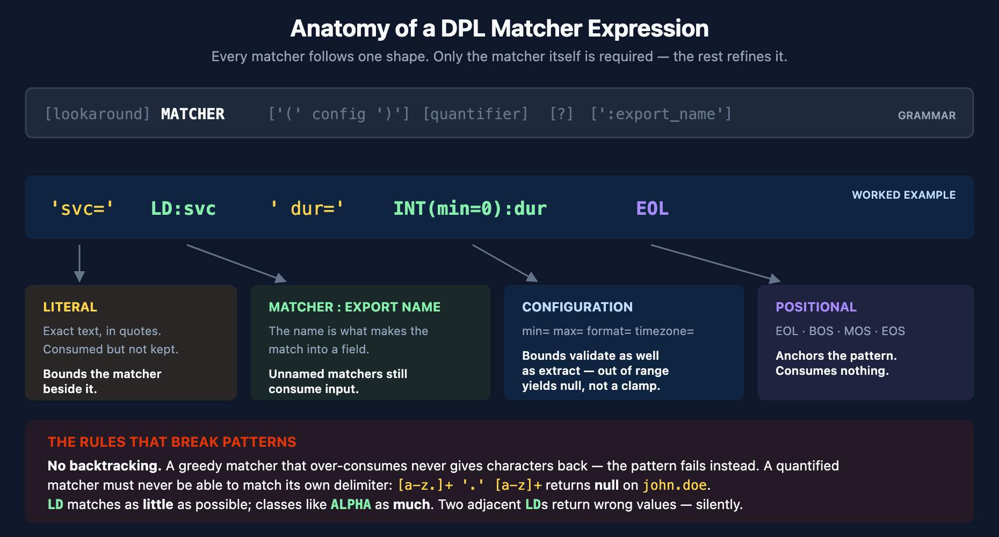
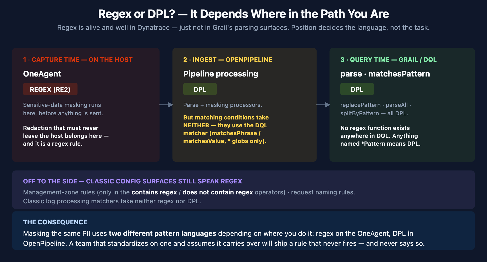
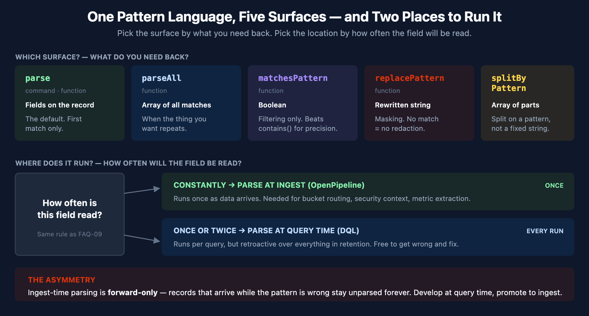

# FAQ-15: How Does DPL Work?

> **Series:** FAQ — Frequently Asked Questions | **Reference:** 15 — How Does DPL Work? | **Created:** July 2026 | **Last Updated:** 07/20/2026

## Overview

Every log line that arrives as an undifferentiated blob of text eventually meets the same question: *how do I get the status code, the customer ID, the duration out of this string and into a field I can filter, group, and alert on?* In Dynatrace the answer is the **Dynatrace Pattern Language (DPL)** — a purpose-built pattern language that replaces the regular expressions most teams arrive with.

DPL is easy to start with and easy to be quietly wrong in. A pattern that looks correct returns `null` for every record. A pattern that returns values returns the *wrong* values, silently, with no error anywhere. A masking rule that appears to redact PII does nothing at all. All three are ordinary outcomes of misunderstanding two or three specific rules, and none of them announce themselves.

This entry is the mechanics deep-dive: **what a DPL pattern actually is, how it compares to the regular expressions you already know, the full matcher catalog, the matching rules that decide whether your pattern succeeds, the five DQL surfaces that consume DPL, where in the data path to parse, and how to diagnose a pattern that isn't working.** It complements **OPMIG-06** (*Processing, Parsing & Transformation*), which applies DPL inside an OpenPipeline pipeline, and **OPLOGS-05** (*Querying & Parsing Logs*), which applies it at query time. This entry is the language itself.

Nearly everyone arrives at DPL fluent in regex, so § 3 handles that head-on: exactly one construct is regex-compatible by design, several translate cleanly, and six pieces of regex intuition are actively wrong — most importantly that DPL does no backtracking, which turns a working regex into a pattern that matches nothing.

**A note on how this was written.** DPL's observable behavior is not fully described by its documentation, and in two places the two disagree. Every behavioral claim below was executed against a live Dynatrace tenant on **07/20/2026** and is labeled **live-verified**; documented-but-unverified claims are cited to the docs and labeled as such. Where the two conflict, both are shown. Examples use `data record(...)`, which fabricates records inline — so **every example here is runnable and scans zero bytes**, needing no log data and incurring no query consumption.

---

## Table of Contents

1. [Short Answer](#short-answer)
2. [The Pattern Model](#the-pattern-model)
3. [Coming from Regex](#coming-from-regex)
4. [The Matcher Catalog](#the-matcher-catalog)
5. [Why Your Pattern Returns Null — or Worse, the Wrong Value](#why-your-pattern-returns-null)
6. [Quantifiers, Optionals, Alternation, Lookaround](#quantifiers-optionals-alternation-lookaround)
7. [The Five Surfaces That Consume DPL](#the-five-surfaces)
8. [DPL Beyond Logs](#dpl-beyond-logs)
9. [Where to Parse — Ingest vs. Query](#where-to-parse)
10. [Diagnosing a Failed Pattern](#diagnosing-a-failed-pattern)
11. [DPL Architect](#dpl-architect)
12. [Recommended Approach](#recommended-approach)
13. [Common Gotchas](#common-gotchas)
14. [References](#references)

---

## Prerequisites

| Requirement | Details |
|-------------|---------|
| **Dynatrace Environment** | SaaS with Grail. Every example runs as-is — `data record(...)` fabricates its own input, so no log data is required |
| **Permissions** | `storage:logs:read` to parse real logs; none at all for the `data record(...)` examples in this entry |
| **OpenPipeline (optional)** | `openpipeline.configurations.read` / `write` for the ingest-time half of § 9 |
| **Audience** | Anyone writing a `parse` command, a Log Processing rule, or a masking processor; teams migrating Grok, regex, or SPL extractions |
| **Related series** | **OPMIG-06** (DPL inside a pipeline), **OPLOGS-05** (DPL at query time), **OPMIG-08** (masking), **OPIPE** (OpenPipeline beyond logs), **FAQ-09** (metric-vs-log query economics) |

---

<a id="short-answer"></a>
## 1. Short Answer

**DPL is a sequence of matchers that must consume the input from left to right, in order, with nothing unmatched between them.** You write the parts you want to keep as named matchers (`INT:status`), the parts you need to step over as literals (`' '`) or unnamed matchers, and the whole sequence has to line up against the text.

Five rules explain nearly every DPL problem:

1. **A pattern does not need to match the whole line — but it must match contiguously from wherever it starts.** Any gap you don't account for breaks the match.
2. **`LD` matches as *little* as possible; character classes like `ALPHA` and `WORD` match as *much* as possible.** These opposite behaviors in one language cause most surprises. *(live-verified)*
3. **There is no backtracking.** A greedy matcher that over-consumes never gives characters back — the pattern fails instead. A quantified matcher must never be able to match the delimiter that follows it. *(live-verified)*
4. **Failure is silent.** A non-matching pattern yields `null`. An *ambiguous* pattern yields wrong values with no warning at all. There is no error either way.
5. **Use the dedicated matcher instead of hand-rolling it.** `HTTPDATE` is one token for what most teams write as a nine-part timestamp pattern, and `KVP` parses key-value text that teams usually attack one field at a time.

The single most important habit: **build patterns in DPL Architect against real sample records**, never in your head. See § 11.

> <sub>**Sources:** [Dynatrace Pattern Language (DT docs)](https://docs.dynatrace.com/docs/platform/grail/dynatrace-pattern-language), [DPL Grammar (DT docs)](https://docs.dynatrace.com/docs/platform/grail/dynatrace-pattern-language/log-processing-grammar). **Derived:** the four-rule framing is an authoring synthesis — the docs describe the grammar, not this diagnostic ordering.</sub>

---

<a id="the-pattern-model"></a>
## 2. The Pattern Model

A DPL pattern is a whitespace-separated sequence of **matcher expressions**. Each one has the same documented shape:

```
[lookaround] MATCHER ['(' configuration ')'] [quantifier] [optional] [':export_name']
```

Only the matcher itself is required. Everything else refines it:

| Part | Purpose | Example |
|------|---------|---------|
| `MATCHER` | What kind of text to consume | `INT` |
| `(config)` | Matcher-specific arguments | `TIMESTAMP(timezone='America/New_York')` |
| `{quantifier}` | How many repetitions | `ALPHA{2,8}` |
| `?` | Optional — may be absent | `(':' INT:port)?` |
| `:export_name` | Capture into a field of this name | `INT:status_code` |
| `>>` `<<` | Assert context without consuming it | `>>'ERROR'` |

**A matcher with no export name still consumes input — it just doesn't keep it.** This is the mechanism for stepping over the parts of a line you don't care about, and it's the part that trips up people coming from regex, where an uncaptured group is optional noise. In DPL every matcher in the sequence must match; naming only decides whether the result is retained.

**Literals** are text in single or double quotes and match exactly: `'status='`. Escape an embedded quote with a backslash, or switch quote styles.

### The anatomy of a real pattern



<!-- MARKDOWN_TABLE_ALTERNATIVE
| Element in `'svc=' LD:svc ' dur=' INT(min=0):dur EOL` | Role |
|---|---|
| `'svc='` | Literal — consumed, not kept |
| `LD:svc` | Matcher + export name — minimal match up to the next matcher |
| `' dur='` | Literal — the delimiter that bounds LD |
| `INT(min=0)` | Matcher + configuration — validates as well as extracts |
| `:dur` | Export name — becomes a field |
| `EOL` | Positional matcher — anchors the end of line |
-->

### Macros keep long patterns readable

Repeated fragments can be named once and reused, which matters for syslog-style formats where every line shares a header:

```dql
$syslog_hdr = TIMESTAMP('MMM d HH:mm:ss'):ts ' ' LD:host;
$syslog_hdr ' ' LD:process ': ' LD:message EOL;
```

> <sub>**Sources:** [DPL Grammar (DT docs)](https://docs.dynatrace.com/docs/platform/grail/dynatrace-pattern-language/log-processing-grammar), [DPL Modifiers (DT docs)](https://docs.dynatrace.com/docs/platform/grail/dynatrace-pattern-language/log-processing-modifiers), [Literal expressions (DT docs)](https://docs.dynatrace.com/docs/platform/grail/dynatrace-pattern-language/log-processing-literal-expression), [Macros (DT docs)](https://docs.dynatrace.com/docs/platform/grail/dynatrace-pattern-language/log-processing-macros).</sub>

---

<a id="coming-from-regex"></a>
## 3. Coming from Regex

Most people meet DPL already fluent in regular expressions, and the resemblance is close enough to be dangerous. DPL is **not** a regex dialect. Exactly one part of it is regex-compatible by design, a handful of constructs translate cleanly, and a few pieces of regex intuition are actively wrong.

### 3.1 The one part that transfers verbatim: character groups

Character groups are the deliberate bridge. The documentation states it plainly — the syntax *"is compatible with Regular Expression Character Class"* — and DPL goes slightly further than regex by accepting **both** `^` and `!` as the negation character:

```dql
data record(t = "abc123")
| fieldsAdd caret = parse(t, "[^0-9]+:x"), bang = parse(t, "[!0-9]+:x")
// live-verified: both return "abc"
```

Ranges (`[0-9]`), sets (`[abc]`), and POSIX bracket forms (`[:lower:]`) all work as a regex user expects. **If you know regex character classes, you already know this part of DPL.**

### 3.2 Translation table

| Regex | DPL | Notes |
|-------|-----|-------|
| `[a-z]` `[0-9]` `[abc]` | identical | Documented as regex-compatible |
| `[^0-9]` | `[^0-9]` or `[!0-9]` | Both negation characters accepted |
| `\d` `\w` `\s` `\S` | `DIGIT` `WORD` `SPACE` `NSPACE` | **Backslash shorthand is a syntax error** |
| `.` (any character) | *no direct equivalent* | See § 3.3 — `'.'` is a literal dot |
| `.*` / `.+` (rest of line) | `LD` | **Semantics differ — see § 3.3** |
| `[\s\S]*` (across lines) | `DATA` | |
| `x*` `x+` `x?` | identical syntax | Open-ended forms cap at 4096 |
| `x{2,5}` `x{3}` | **only on some matchers** | Numeric and semantic matchers reject `{n}` — see § 3.3 |
| Backtracking | **none** | The biggest difference in this table — see § 3.3 |
| `(a\|b)` | `(a\|b)` | Lazy, left-to-right; losers export `null` |
| `(?=…)` `(?!…)` | `>>` `!>>` | |
| `(?<=…)` `(?<!…)` | `<<` `!<<` | 64-byte look-behind window |
| `^` `$` anchors | `BOS` `EOS` / `EOL` | |
| `(?<name>…)` named capture | `MATCHER:name` | Naming *is* how you capture |
| `\.` escaped literal | `'.'` quoted literal | All literals are quoted, never escaped |
| Backreference `\1` | — | Not available |
| Inline flags `(?i)` | — | No general case-insensitivity modifier |

### 3.3 Six places regex intuition is wrong

All six are live-verified, and each produces a different kind of failure. The first one is the most important sentence in this entry.

**1. There is no backtracking.** A regex engine that over-consumes will give characters back and try again. **DPL will not.** A quantified matcher takes everything it can, and if that leaves the next matcher with nothing to match, the whole pattern fails — silently:

```dql
data record(a = "john.doe@corp.com")
| fieldsAdd broken    = parse(a, "[a-z.]+:x '.' [a-z]+:y"),
            tightened = parse(a, "[a-z]+:x '.' [a-z]+:y")
// live-verified: broken = null,  tightened = {x: "john", y: "doe"}
```

`[a-z.]+` includes the dot, so it swallows `john.doe` entirely and the `'.'` literal has nothing left. Every regex engine in common use would backtrack one character and match. DPL returns `null`.

> **The rule that follows: a quantified matcher must never be able to match its own delimiter.** Exclude the delimiter from the character class. This single rule prevents more DPL failures than any other.

This is also why porting a working regex can produce a pattern that never matches anything — the regex was relying on backtracking you didn't know it was using.

**2. `.` is not a wildcard — it's a literal dot.** In DPL a quoted `'.'` matches one actual period and nothing else:

```dql
data record(x = "x")
| fieldsAdd hit  = parse("a.b", "LD:l '.' LD:r"),
            miss = parse("axb", "LD:l '.' LD:r")
// live-verified: hit = {l:"a", r:"b"},  miss = null
```

There is no bare `.` metacharacter. To match "any character" use a character group or a POSIX class.

**3. `.*` is greedy; its DPL counterpart `LD` is shortest-match.** Regex `.*` grabs everything and backs off. `LD` stops at the *first* occurrence of whatever follows it, not the last:

```dql
data record(x = "x")
| fieldsAdd p = parse("a:b:c", "LD:x ':' LD:y")
// live-verified: {x: "a", y: "b:c"} — first colon wins, not the last
```

A regex `(.*):(.*)` on the same input splits at the **last** colon. Ported literally, the two disagree on every line with more than one delimiter. Covered further in § 5.

**4. Backslash shorthand doesn't exist.** `\d+` isn't an unsupported feature, it's a parse failure:

```
ERROR: The parsing pattern is invalid. Syntax error: mismatched input '\'
```

Use `DIGIT+` or `[0-9]+`.

**5. Quantifier support is per-matcher, not universal.** Regex lets you write `\d{3}`. DPL does not let you write `INT{3}` — numeric and semantic matchers accept only `*` and `+`:

```
INT{3}   → ERROR: INT only supports '*' (nullable) and '+' (not nullable) quantifiers
```

To match exactly three digits, use a character class: `[0-9]{3}:code`. Note the type consequence — `[0-9]{3}` yields a **string**, while `INT` yields a number, so add `toLong()` if the numeric type matters. Sequence and alternation groups reject quantifiers entirely.

This one at least fails loudly. It is still worth knowing before you write a fixed-width pattern for an SSN, a zip code, or a card fragment.

**6. Nothing is unbounded.** Regex `+` means "one or more, however many." DPL `+` means `{1,4096}`. A regex that works on a 10 KB line has a DPL translation that silently stops at 4096 characters.

### 3.4 Coming from Grok

Grok is regex underneath, and its `%{SYNTAX:name}` form maps almost one-to-one onto DPL's `MATCHER:name` — `%{IP:client}` → `IPADDR:client`, `%{INT:n}` → `INT:n`, `%{GREEDYDATA:msg}` → `DATA:msg`. **OPMIG-06** carries the fuller Grok and Logstash-filter conversion tables; this entry doesn't duplicate them.

One caution when porting: `%{GREEDYDATA}` is greedy by name and by behavior, and `DATA` is not. Check the § 5 rules before trusting a mechanical substitution.

In community practice this is where most porting effort actually goes — verify converted patterns against real records rather than assuming table-driven equivalence. Dynatrace publishes no Grok migration guidance of its own, so the mapping above is community knowledge, not a documented contract.

### 3.5 Where regex is still the right tool in Dynatrace

This is the part that surprises people: **regex is alive and well in Dynatrace — just not in Grail's parsing surfaces.** Which language a surface speaks depends on *where in the pipeline it sits*, not on what it does.



<!-- MARKDOWN_TABLE_ALTERNATIVE
| Surface | Pattern language |
|---|---|
| OneAgent sensitive-data masking (capture time, pre-ingest) | Regex (RE2 syntax) |
| Management-zone rules (`contains regex` / `does not contain regex`) | Regex |
| Request naming rules | Regex |
| OpenPipeline processing and masking | DQL + DPL |
| OpenPipeline matching conditions | DQL matcher — matchesPhrase / matchesValue; no regex, no DPL |
| Classic log processing matcher, log metrics, log events | DQL matcher — no regex |
| Log processing rule bodies | DPL |
| DQL parse / matchesPattern / replacePattern / splitByPattern | DPL |
-->

The practical consequence is worth stating directly: **masking the same PII uses two different pattern languages depending on where you mask it.** Redacting at capture time on the OneAgent is a regex rule; redacting the same field in OpenPipeline is DPL. A team that standardizes on one and assumes it applies to the other will ship a rule that never fires. **OPMIG-08** covers the OpenPipeline side.

### 3.6 Functions that sound like regex but aren't

The naming actively misleads here. Everything with "Pattern" in it takes **DPL**:

| Function | Actually takes |
|----------|----------------|
| `matchesPattern`, `replacePattern`, `splitByPattern` | **DPL** — despite the name |
| `like` | SQL wildcards — `%` (any sequence), `_` (one character) |
| `matchesValue` | `*` wildcard; **no mid-value wildcards** |
| `matchesPhrase` | `*` wildcard scoped to a token; **no mid-string wildcards** |
| `contains`, `startsWith`, `endsWith` | No wildcards at all — plain substring |

```dql
data record(u = "GET /api/users")
| fieldsAdd mv = matchesValue(u, "GET*"), mp = matchesPhrase(u, "api*")
// live-verified: both true
```

### 3.7 A note on the regex you do write

Where Dynatrace *does* accept regex, its own documentation is unusually cautionary: quantified or repeated groups are not allowed, backreferences are not supported, greedy captures should be replaced with lazy or possessive forms, and the docs give a worked example of `(.*)+b` consuming more than ten seconds against a string with no `b` — the classic catastrophic-backtracking blowup.

DPL cannot express that failure mode: every quantifier is bounded and look-behind is capped at 64 bytes. Whether that boundedness was *chosen* to avoid backtracking is not something Dynatrace states anywhere, so treat the connection as an observation about the design rather than a documented rationale.

> <sub>**Sources:**</sub>
> - <sub>[Lines and strings (DT docs)](https://docs.dynatrace.com/docs/platform/grail/dynatrace-pattern-language/log-processing-lines-strings) — "The syntax is compatible with Regular Expression Character Class"; negation via `^` or `!`</sub>
> - <sub>[Dynatrace Pattern Language (DT docs)](https://docs.dynatrace.com/docs/platform/grail/dynatrace-pattern-language) — character groups described as "Regular Expression compatible"</sub>
> - <sub>[Regular expressions in Dynatrace (DT docs)](https://docs.dynatrace.com/docs/manage/tags-and-metadata/reference/regular-expressions-in-dynatrace) — the catastrophic-backtracking warning, the `(.*)+b` example, and the no-backreferences / no-repeated-groups restrictions</sub>
> - <sub>[Sensitive data masking (DT docs)](https://docs.dynatrace.com/docs/analyze-explore-automate/logs/lma-log-ingestion/lma-log-ingestion-via-oa/lma-sensitive-data-masking) — OneAgent-side masking takes RE2 regex</sub>
> - <sub>[Management zone rules (DT docs)](https://docs.dynatrace.com/docs/manage/identity-access-management/permission-management/management-zones/management-zone-rules) — regex permitted only in the `contains regex` / `does not contain regex` operators</sub>
> - <sub>[DQL matcher in OpenPipeline (DT docs)](https://docs.dynatrace.com/docs/platform/openpipeline/reference/dql/dql-matcher-in-openpipeline) — matching conditions accept neither regex nor DPL</sub>
> - <sub>[String functions (DT docs)](https://docs.dynatrace.com/docs/platform/grail/dynatrace-query-language/functions/string-functions) — `like` SQL wildcards; `matchesValue` / `matchesPhrase` wildcard scope</sub>
> - <sub>**Derived:** § 3.5's "two languages for the same masking job" conclusion combines the OneAgent RE2 masking page with the OpenPipeline masking surface — neither page draws the contrast. § 3.7's bounded-quantifier observation is likewise an inference; Dynatrace publishes no DPL design rationale.</sub>
> - <sub>Grok mappings in § 3.4 are **softened** — no Dynatrace documentation covers Grok, and searches of docs.dynatrace.com return no Grok page.</sub>

---

<a id="the-matcher-catalog"></a>
## 4. The Matcher Catalog

The catalog below is the DPL Grammar reference, reorganized by what you reach for it to do. **Matcher names are case-sensitive and exact** — a name that isn't in this catalog is a syntax error, not a silent no-match (see § 10).

### Numeric and boolean

| Matcher | Matches | Config |
|---------|---------|--------|
| `INT`, `INTEGER` | Integers, −2147483648 … 2147483647 | `min=`, `max=` |
| `LONG` | Integers, long range | `min=`, `max=` |
| `HEXINT` / `HEXLONG` | Hex notation | — |
| `FLOAT` / `DOUBLE` | Decimal or scientific notation | `min=`, `max=` |
| `CFLOAT` / `CDOUBLE` | As above, comma as decimal separator | `min=`, `max=` |
| `BOOLEAN`, `BOOL` | `true` / `false`, case-insensitive | — |

> ⚠️ **Numeric matchers accept only the `*` and `+` quantifiers** — `INT{3}` is rejected outright. Use a character class for fixed-width digits. See § 6. *(live-verified)*

**`min=` / `max=` make a matcher a validator, not just an extractor.** An out-of-range value doesn't clamp — the match fails and the field is `null`:

```dql
data record(t = "404")
| fieldsAdd in_range = parse(t, "INT(min=200, max=299):code"),
            no_bound = parse(t, "INT:code")
// live-verified: in_range = null, no_bound = 404
```

That makes bounded matchers a neat way to extract *and* filter in one step — `INT(min=500):code` captures only server errors.

### Strings and line data

| Matcher | Matches | Default quantifier |
|---------|---------|--------------------|
| `LD`, `LDATA` | Any characters up to the next matcher, **within one line** | `{1,4096}` |
| `DATA` | Any characters up to the next matcher, **across lines** | `{1,4096}` |
| `SQS` / `DQS` | Single- / double-quoted strings, backslash escaping | `{1,4096}` |
| `CSVSQS` / `CSVDQS` | Quoted strings with CSV doubling (`""`) | `{1,4096}` |
| `STRING` | Quoted strings or character groups | *not documented* |

`DQS` deserves attention: the Apache and Nginx patterns most teams write hand-roll quoted fields as `'"' LD:x '"'`, which breaks on any escaped quote inside the value. `DQS:x` handles that correctly in one token.

### Character classes

POSIX classes, usable directly as matchers: `ALNUM`, `ALPHA`, `BLANK`, `CNTRL`, `DIGIT`, `GRAPH`, `LOWER`, `PRINT`, `PUNCT`, `SPACE`, `NSPACE` (non-space), `UPPER`, `XDIGIT`, `ASCII`, `WORD`. Custom groups use bracket syntax — `[0-9]`, `[a-fA-F]`, negated with `^` or `!`.

> ⚠️ **Documented default vs. observed behavior.** The grammar reference gives character classes a default quantifier of `{1,1}`. Live testing shows them consuming greedily: on input `abcdef`, `ALPHA:x` returned **`abcdef`**, not `a`; `ALPHA{2}:x` returned `ab`. *(live-verified 07/20/2026)* Don't rely on either reading — **state the quantifier explicitly** whenever the length matters.

### Date and time

| Matcher | Format |
|---------|--------|
| `TIMESTAMP`, `TIME` | Flexible; default `yyyy-MM-dd HH:mm:ss`. Config: `format=`, `timezone=`, `locale=` |
| `ISO8601` | `yyyy-MM-ddTHH:mm:ssZ` |
| `JSONTIMESTAMP` | `yyyy-MM-ddTHH:mm:ss.SSSZ` |
| `HTTPDATE` | `dd/MMM/yyyy:HH:mm:ss Z` |

All output is normalized to UTC. Two verified behaviors worth knowing:

```dql
data record(t = "12/Dec/2024:10:30:45 +0000")
| fieldsAdd short = parse(t, "HTTPDATE:ts"),
            long  = parse(t, "TIMESTAMP('dd/MMM/yyyy:HH:mm:ss Z'):ts")
// live-verified: both return 2024-12-12T10:30:45.000000000Z — identical
```

`HTTPDATE` **is** the Apache/Nginx timestamp format. Any pattern spelling it out by hand is doing work a single token already does.

```dql
data record(t = "2024-12-12 10:30:45")
| fieldsAdd utc = parse(t, "TIMESTAMP(timezone='America/New_York'):ts")
// live-verified: 2024-12-12T15:30:45Z — the timezone config converts, it does not merely label
```

### Network

`IPADDR` (v4 or v6), `IPV4` / `IPV4ADDR`, `IPV6` / `IPV6ADDR`. No quantifier, no configuration. **There is no CIDR or prefix matcher.**

### Structured data

| Matcher | Syntax | Produces |
|---------|--------|----------|
| `JSON`, `JSON_OBJECT` | `JSON:payload` or `JSON{ MATCHER:member, … }` | object |
| `JSON_ARRAY` / `JSON_VALUE` | `JSON_ARRAY{jsonValueType}` | array / value |
| `XML`, `XML_PLAIN`, `XML_VERBOSE` | `XML:doc` | object |
| `KVP` | `KVP{ …:key … :value }:name` | object |
| `ARRAY` | `ARRAY{ … }{n,m}:name` | array |
| `STRUCTURE` | `STRUCTURE{ … }:name` | tuple |
| `ENUM` | `ENUM{'A'=1,'B'=2}:name` | integer |

These four are the most under-used matchers in the language, and all are live-verified:

```dql
data record(t = "a=1, b=2, c=3")
| parse t, "KVP{ALNUM+:key '=' INT:value ', '?}:kv"
// live-verified: kv = {"a": "1", "b": "2", "c": "3"}
```

```dql
data record(x = "x")
| fieldsAdd sev   = parse("WARN",     "ENUM{'INFO'=1,'WARN'=2,'ERROR'=3}:sev"),
            nums  = parse("1,2,3",    "ARRAY{INT:v ','?}{1,10}:nums"),
            point = parse("10.5:200", "STRUCTURE{DOUBLE:lat ':' INT:port}:s")
// live-verified: sev = 2, nums = [1,2,3], point = {lat: 10.5, port: 200}
```

> ⚠️ **`ARRAY` requires an explicit quantifier.** Omitting it is a hard syntax error, not a default: `The parsing pattern is invalid. ARRAY requires a quantifier expression`. *(live-verified)*

`JSON` is worth a special note: if a log line is entirely JSON, `parse content, "JSON:j"` gives you the whole document as a navigable object in one step, and `j[fieldName]` reaches into it — usually better than extracting fields one at a time.

### Positional and specialized

- **`BOS`/`BOF`, `MOS`/`MOF`, `EOS`/`EOF`** — beginning, middle, end of string. Anchors; they consume nothing.
- **`EOL`/`LF`, `CR`, `EOLWIN`/`WINEOL`** — line terminators.
- **`CREDITCARD`** — validates the Luhn checksum across formats and encodings; a failed checksum yields `null`. This is the matcher behind PCI masking rules.
- **`SMARTSCAPEID`** — Smartscape entity ID form.

> ⚠️ **There is no `EMAIL` matcher.** It is a natural guess and it is not real — `parse t, "EMAIL:mail"` fails with `Named pattern element 'EMAIL' is not valid`. *(live-verified)* Email extraction and masking must be hand-rolled from character classes and literals. Other plausible-sounding names that **do not exist**: `URI`, `URL`, `HEXNUM` (use `HEXINT`/`HEXLONG`), `IPPREFIX`, `HTTPMETHOD`, `DATETIME` (use `TIMESTAMP`/`TIME`), `LINE`, `CHAR`, `BYTE`, `BOM`.

> <sub>**Sources:**</sub>
> - <sub>[DPL Grammar (DT docs)](https://docs.dynatrace.com/docs/platform/grail/dynatrace-pattern-language/log-processing-grammar)</sub>
> - <sub>[Numeric matchers (DT docs)](https://docs.dynatrace.com/docs/platform/grail/dynatrace-pattern-language/log-processing-numeric)</sub>
> - <sub>[Lines and strings (DT docs)](https://docs.dynatrace.com/docs/platform/grail/dynatrace-pattern-language/log-processing-lines-strings)</sub>
> - <sub>[Time and date (DT docs)](https://docs.dynatrace.com/docs/platform/grail/dynatrace-pattern-language/log-processing-time-date)</sub>
> - <sub>[Network matchers (DT docs)](https://docs.dynatrace.com/docs/platform/grail/dynatrace-pattern-language/log-processing-network)</sub>
> - <sub>[Key-value pairs (DT docs)](https://docs.dynatrace.com/docs/platform/grail/dynatrace-pattern-language/log-processing-key-value-pairs)</sub>
> - <sub>[Positional matchers (DT docs)](https://docs.dynatrace.com/docs/platform/grail/dynatrace-pattern-language/log-processing-positional-matchers)</sub>
> - <sub>[XML matchers (DT docs)](https://docs.dynatrace.com/docs/discover-dynatrace/platform/grail/dynatrace-pattern-language/dpl-xml) — absent from the grammar table; reachable only by direct link</sub>
> - <sub>**Derived:** the "does not exist" list and the character-class quantifier discrepancy are live-tenant findings (07/20/2026), not documented statements.</sub>

---

<a id="why-your-pattern-returns-null"></a>
## 5. Why Your Pattern Returns Null — or Worse, the Wrong Value

This section is the reason the entry exists. DPL has **two** failure modes, and the dangerous one produces data rather than nothing.

### Rule 1 — `LD` is minimal; character classes are greedy

`LD` consumes **as little as possible** until the next matcher can succeed. Character classes consume **as much as possible**. Both live-verified, and the asymmetry is the root of most confusion:

```dql
data record(t = "key_abcdef rest")
| fieldsAdd via_class = parse(t, "'key_' WORD:w"),
            via_ld    = parse(t, "'key_' LD:w ' '")
// live-verified: via_class = "abcdef"  (greedy — took the whole word)
//                via_ld    = "abcdef"  (minimal — stopped at the space delimiter)
```

Both give the right answer here, for opposite reasons. Change the input and they diverge — which is exactly why the next rule matters.

### Rule 2 — greedy matchers never give characters back

DPL has **no backtracking**. When a quantified matcher over-consumes, it does not retry with less. The pattern just fails:

```dql
data record(a = "john.doe@corp.com")
| fieldsAdd broken    = parse(a, "[a-z.]+:x '.' [a-z]+:y"),
            tightened = parse(a, "[a-z]+:x '.' [a-z]+:y")
// live-verified: broken = null,  tightened = {x: "john", y: "doe"}
```

`[a-z.]+` can match the dot, so it eats `john.doe` and leaves the `'.'` literal with nothing. A regex engine backtracks one character and succeeds; DPL returns `null`.

**A quantified matcher must never be able to match the delimiter that follows it.** Exclude the delimiter from the class. This is the highest-yield rule in this section, and it is the reason a regex ported verbatim can match nothing at all — the original was quietly relying on backtracking.

### Rule 3 — `LD` without a following delimiter takes one character

Because `LD` is minimal, **its minimum is what it takes when nothing forces it wider**. Two adjacent `LD` matchers are the classic trap:

```dql
data record(t = "alpha beta gamma")
| fieldsAdd broken   = parse(t, "LD:x LD:y"),
            anchored = parse(t, "LD:x ' ' LD:y ' '")
// live-verified: broken   = {x: "a",     y: "lpha beta gamma"}   ← no error, just wrong
//                anchored = {x: "alpha", y: "beta"}              ← correct
```

**`broken` did not fail.** It produced two populated fields, one of which is a single stray character, and nothing in the query, the pipeline, or the UI flags it. A pipeline built on that pattern will happily write `x = "a"` for millions of records. **Always put a literal or a non-optional matcher between two `LD`s.**

### Rule 4 — `LD` stops at the line; `DATA` crosses lines

```dql
data record(t = "line one\nline two\nline three")
| fieldsAdd ld   = parse(t, "'line ' LD:x"),
            data = parse(t, "'line ' DATA:x EOS")
// live-verified: ld   = "one"
//                data = "one\nline two\nline three"
```

This is the whole reason `DATA` exists, and it is how you capture a Java stack trace: the message is `LD`, the trace body is `DATA`.

### Rule 5 — an unmatched literal yields `null`, full stop

```dql
data record(t = "alpha beta gamma")
| fieldsAdd nope = parse(t, "'zzz' LD:x")
// live-verified: nope = null
```

No error, no warning. When every record comes back `null`, suspect a literal that doesn't appear in the text — a different separator, a tab instead of a space, a field order that varies.

### Rule 6 — both `LD` and `DATA` cap at 4096 characters by default

The documented default quantifier is `{1,4096}`. On long lines — stack traces, embedded payloads, verbose access logs — a pattern that works on your samples can fail on production records simply because the text ran past the cap. Widen it explicitly: `DATA{1,20000}:body`.

> <sub>**Sources:** [Lines and strings (DT docs)](https://docs.dynatrace.com/docs/platform/grail/dynatrace-pattern-language/log-processing-lines-strings) — documents the `{1,4096}` defaults, the line-vs-pattern scope distinction, and the rule that `LD`/`DATA` "must always be followed by a non-optional matcher expression". **Derived:** the minimal-vs-greedy framing and the silent-wrong-value failure mode are live-tenant findings (07/20/2026); the documentation states the constraint but does not describe what happens when it is violated.</sub>

---

<a id="quantifiers-optionals-alternation-lookaround"></a>
## 6. Quantifiers, Optionals, Alternation, Lookaround

### Quantifiers

| Syntax | Meaning |
|--------|---------|
| `{n}` | Exactly n |
| `{n,m}` | Between n and m |
| `{n,}` | At least n, capped at **4096** |
| `{,m}` | Up to m |
| `*` | 0 to 4096 |
| `+` | 1 to 4096 |

**Every open-ended quantifier is capped at 4096.** `+` is not unbounded — it is `{1,4096}`.

> ⚠️ **Which quantifiers you may use depends on the matcher.** Counted forms (`{n}`, `{n,m}`) are not universal:
>
> | Matcher family | `*` `+` | `{n}` `{n,m}` |
> |---|---|---|
> | Character classes and character/token matchers (`[0-9]`, `WORD`, `ALPHA`, `LD`, `DATA`, `STRING`) | yes | yes |
> | Numeric and semantic matchers (`INT`, `LONG`, `DOUBLE`, `FLOAT`, `IPADDR`, `TIMESTAMP`, `BOOLEAN`, `CREDITCARD`) | yes | **no** |
> | Sequence groups `( … )` and alternation groups | **no** | **no** |
>
> `INT{3}` fails with `INT only supports '*' (nullable) and '+' (not nullable) quantifiers`. For a fixed-width number use a character class — `[0-9]{3}:code` — and remember it yields a **string**, not a number; wrap in `toLong()` if the type matters. *(live-verified)*

### Optional matchers

`?` marks a matcher expression as optional and goes *after* any quantifier. Group it with its delimiter so the whole unit disappears together:

```dql
// Right — the colon vanishes with the port
parse content, "IPADDR:ip (':' INT:port)?"

// Wrong — a missing port leaves an unmatched literal colon
parse content, "IPADDR:ip ':' INT:port?"
```

This is how you write one pattern for a log format with genuinely optional fields, instead of two patterns and a `coalesce`.

### Alternation

`( a | b )` matches the first alternative that succeeds — a documented **lazy, left-to-right** strategy. Fields exported by the alternatives that didn't win are `null`, so order matters: put the most specific alternative first.

```dql
parse content, "('userId=' | 'user=' | 'uid=') LD:user"
```

### Lookaround — assert without consuming

Four modifiers test the surrounding text without advancing the match position:

| Modifier | Meaning |
|----------|---------|
| `>>` | Positive lookahead |
| `!>>` | Negative lookahead |
| `<<` | Positive lookbehind (**64-byte window**) |
| `!<<` | Negative lookbehind (64-byte window) |

```dql
data record(t = "ERROR svc=api code=500 code=502")
| fieldsAdd ahead  = parse(t, ">>'ERROR' LD:lvl ' '"),
            behind = parse(t, "LD <<'svc=' NSPACE+:svcname ' '")
// live-verified: ahead = "ERROR", behind = "api"
```

Negative lookahead is the tidy way to say "parse this line only if it *isn't* a heartbeat" without a separate filter.

> <sub>**Sources:** [DPL Modifiers (DT docs)](https://docs.dynatrace.com/docs/platform/grail/dynatrace-pattern-language/log-processing-modifiers) — quantifier forms, the 4096 cap, optional placement, and the 64-byte look-behind window; [Alternatives group (DT docs)](https://docs.dynatrace.com/docs/platform/grail/dynatrace-pattern-language/log-processing-alternatives-group) — the lazy left-to-right strategy and `null` for losing alternatives.</sub>

---

<a id="the-five-surfaces"></a>
## 7. The Five Surfaces That Consume DPL

Most teams know `parse`. There are five, and picking the right one removes a lot of awkward DQL.



<!-- MARKDOWN_TABLE_ALTERNATIVE
| Surface | Form | Returns | Use when |
|---|---|---|---|
| parse | command | adds fields to the record | Extracting several fields for downstream use |
| parse | function | value, or record if multiple names | Extracting inline without touching the record shape |
| parseAll | function | array of every match | The pattern occurs more than once per record |
| matchesPattern | function | boolean | Filtering only — you don't need the value |
| replacePattern | function | string | Masking and redaction |
| splitByPattern | function | array | Splitting on a pattern rather than a fixed string |
-->

### `parse` — the command

```
parse expression, pattern [, preserveFieldsOnFailure] [, parsingPrerequisite]
```

Adds extracted fields directly to the record. Two optional parameters are almost unknown and both are useful:

- **`preserveFieldsOnFailure`** — keep existing field values when parsing fails instead of overwriting them with `null`.
- **`parsingPrerequisite`** — a condition deciding whether a record is parsed at all, so mixed-format streams don't have to be split first.

> ⚠️ **`parse` silently overrides existing fields of the same name.** DQL emits a warning — ``The field `<fieldName>` overrides an existing field`` — but the query still runs. Prefix your export names (`x_status`, not `status`) when parsing into a record that already has semantic fields.

### `parse` — the function

The same DPL, used inline in `fieldsAdd`. Returns the value directly, or a record when the pattern exports several names. Every example in this entry uses this form.

### `parseAll` — every occurrence

`parse` stops at the first match. When the thing you want repeats, `parseAll` returns all of them:

```dql
data record(t = "ERROR svc=api code=500 code=502")
| fieldsAdd codes = parseAll(t, "'code=' INT:c")
// live-verified: codes = ["500", "502"]
```

### `matchesPattern` — DPL as a filter

`matchesPattern(expression, pattern)` returns a boolean. This is DPL used for classification rather than extraction, and it's far more precise than `contains()`:

```dql
fetch logs, from: -1h
| filter matchesPattern(content, "IPADDR ' - - ['")
```

`contains(content, "192.168")` matches a version string; `matchesPattern` with `IPADDR` matches only an actual address. This is also the natural expression for OpenPipeline **matching conditions**.

### `replacePattern` — masking

`replacePattern(expression, pattern, replacement)` is the masking primitive:

```dql
fieldsAdd content = replacePattern(content, "CREDITCARD", "[PAN_REDACTED]")
```

Because masking depends on the pattern matching, **an invalid or non-matching pattern means no redaction happens** — and nothing tells you. Test every masking pattern against sample data before deploying it. See § 13.

### `splitByPattern` — splitting on a pattern

```dql
data record(t = "ERROR svc=api code=500")
| fieldsAdd parts = splitByPattern(t, "' '")
// live-verified: parts = ["ERROR", "svc=api", "code=500"]
```

All five are available inside the OpenPipeline DQL processor as well as at query time.

> <sub>**Sources:** [Extraction and parsing commands (DT docs)](https://docs.dynatrace.com/docs/platform/grail/dynatrace-query-language/commands/extraction-and-parsing-commands) — `parse` signature, the four parameters, and the field-override warning; [String functions (DT docs)](https://docs.dynatrace.com/docs/platform/grail/dynatrace-query-language/functions/string-functions) — `parse`, `parseAll`, `matchesPattern`, `replacePattern`, `splitByPattern`; [OpenPipeline DQL functions (DT docs)](https://docs.dynatrace.com/docs/platform/openpipeline/reference/dql/openpipeline-dql-functions) — availability inside the DQL processor.</sub>

---

<a id="dpl-beyond-logs"></a>
## 8. DPL Beyond Logs

DPL is almost always taught with logs, and both the documentation and this corpus's own examples reinforce that. **The restriction isn't real.**

`parse` operates on a *string expression*, not on a record type. Any string field on any record type can be parsed — span attributes, event fields, business-event payloads, entity names:

```dql
fetch spans, from: -10m
| fieldsAdd probe = "svc=checkout dur=42"
| parse probe, "'svc=' LD:svc ' dur=' INT:dur"
| fields svc, dur
// live-verified: accepted and executed against spans
```

Practical uses that have nothing to do with logs:

| Record type | Use |
|-------------|-----|
| **Spans** | Extract a tenant or route segment out of `http.url`; pull structure from a custom request attribute |
| **Business events** | Parse a composite order or SKU identifier into its parts |
| **Events** | Extract a change ticket number from a deployment event's title |
| **Entity fields** | Decompose a host or service naming convention into environment / region / role — see **FAQ-01** |

That last one is a common request that teams usually solve with nested `substring()` calls. A naming convention is a grammar, and DPL parses grammars:

```dql
data record(host = "prd-use1-web-014")
| parse host, "LD:env '-' LD:region '-' LD:role '-' INT:instance"
// env = "prd", region = "use1", role = "web", instance = 14
```

> <sub>**Sources:** [Extraction and parsing commands (DT docs)](https://docs.dynatrace.com/docs/platform/grail/dynatrace-query-language/commands/extraction-and-parsing-commands) — defines `expression` as "a field or string expression to parse", with no record-type restriction stated. The Dynatrace documentation does **not** explicitly state that `parse` works on spans, events, or business events; the claim here rests on live-tenant execution against `fetch spans` (07/20/2026) plus the string-expression signature. **Derived:** the applicability table is an authoring synthesis of that finding.</sub>

---

<a id="where-to-parse"></a>
## 9. Where to Parse — Ingest vs. Query

The same pattern can run in two places, and the choice is architectural rather than stylistic.

| | **Ingest-time** (OpenPipeline) | **Query-time** (DQL `parse`) |
|---|---|---|
| **Runs** | Once, as data arrives | Every time the query runs |
| **Applies to** | Records ingested **after** the rule is deployed | All records in retention, including historical |
| **Changing it** | Redeploy; no effect on data already stored | Edit the query; instantly retroactive |
| **Wrong pattern costs you** | Permanently unparsed data | Nothing — fix and re-run |
| **Best for** | Fields queried constantly; fields needed for bucket routing, security context, or metric extraction | Exploration, ad-hoc investigation, one-off analysis |

The decision rule mirrors **FAQ-09**'s metric-vs-log-query logic: **how often will this field be read?** A field on a dashboard refreshing every minute should be parsed once at ingest. A field you need for a single incident should be parsed in the query and forgotten.

Two asymmetries matter more than the table suggests:

- **Ingest-time parsing is forward-only.** Deploy a pattern today and yesterday's records stay unparsed forever. Anything you might want historically must be parseable at query time regardless.
- **Ingest-time parsing is where the mistakes are expensive.** A query-time typo costs one re-run. A pipeline typo silently mis-populates every record until someone notices — and § 5 established that DPL failures don't announce themselves.

**The practical sequence: develop at query time, promote to ingest time.** Iterate in DPL Architect against real records until the pattern is right, confirm it at query scale, and only then move the settled pattern into a pipeline processor.

### Limits that bound ingest-time patterns

| Limit | Value |
|-------|-------|
| DQL processor script length | 8,192 characters |
| Processor matching condition length | 4,096 characters |
| Record size after processing | 16 MB |
| Processors per pipeline | 1,000 |

The Dynatrace documentation states **no** DPL-specific performance or DPS-consumption cost for pattern complexity. In community practice, teams treat pattern count and pipeline depth as the thing to keep an eye on rather than individual pattern complexity — verify against your own pipeline metrics before optimizing on assumption.

> <sub>**Sources:** [OpenPipeline limits (DT docs)](https://docs.dynatrace.com/docs/discover-dynatrace/platform/openpipeline/reference/limits) — the four limits in the table. **Derived:** the ingest-vs-query decision rule extends FAQ-09's read-frequency heuristic to parsing; the forward-only asymmetry follows from OpenPipeline processing records at ingest, which the docs describe but do not frame as a parsing-design constraint.</sub>

---

<a id="diagnosing-a-failed-pattern"></a>
## 10. Diagnosing a Failed Pattern

Work down this list in order — it moves from loudest failure to quietest.

### Step 1 — Is it a syntax error or a non-match?

They are completely different problems and DPL tells them apart clearly:

- **Syntax error** — the query fails outright: `The parsing pattern is invalid. Named pattern element 'EMAIL' is not valid`. A matcher name is wrong, or a required element is missing (`ARRAY requires a quantifier expression`). Check the name against § 4.
- **Non-match** — the query succeeds and every field is `null`. The syntax is fine; the pattern doesn't fit the text.

### Step 2 — For a non-match, test the pattern against one known record

Shrink the problem. Copy one real line into `data record(...)` and rebuild the pattern from the left, one matcher at a time, checking the output after each addition. The first addition that turns a value into `null` is the culprit.

```dql
data record(t = "<paste one real log line here>")
| fieldsAdd step1 = parse(t, "IPADDR:ip"),
            step2 = parse(t, "IPADDR:ip ' - '"),
            step3 = parse(t, "IPADDR:ip ' - ' LD:user ' '")
```

Zero bytes scanned, instant feedback, no tenant data required.

### Step 3 — Check the usual suspects

| Symptom | Likely cause |
|---------|--------------|
| Every record `null` | A literal that isn't in the text — different separator, tab vs. space, or the format varies more than your sample showed |
| Some records `null` | Genuinely optional fields — mark them `?`, or use alternation |
| One field holds a single character | Two `LD`s with nothing between them (§ 5, Rule 2) |
| Works on short lines, fails on long ones | The `{1,4096}` default cap on `LD`/`DATA` |
| Works on the first line of a multi-line record only | You want `DATA`, not `LD` |
| Timestamp is right but hours are off | Missing `timezone=` — DPL normalizes to UTC |
| Numeric field `null` for valid-looking numbers | `min=`/`max=` bounds rejecting them, or `INT` overflow — use `LONG` |
| Masking appears to do nothing | The pattern doesn't match, or the matcher doesn't exist — § 13 |

### Step 4 — Measure the parse rate before you trust it

A pattern that works on your three samples may cover 60% of production. Quantify it:

```dql
fetch logs, from: -1h
| filter matchesPattern(content, "IPADDR ' - - ['")
| summarize matched = count()
```

Compare against the unfiltered count. Anything short of the coverage you expected means the format varies — go find the variants before deploying to a pipeline.

> <sub>**Sources:** [DPL Architect (DT docs)](https://docs.dynatrace.com/docs/platform/grail/dynatrace-pattern-language/dpl-architect) — coverage feedback as the intended validation loop. **Derived:** the four-step ladder and the symptom table are authoring syntheses of the live-verified behaviors in § 5 and § 4; the documentation does not provide a troubleshooting guide.</sub>

---

<a id="dpl-architect"></a>
## 11. DPL Architect

DPL Architect is the pattern-development environment, and using it is the difference between DPL being pleasant and DPL being guesswork. Its purpose, per the documentation: extract fields from records, develop patterns faster, and **get instant feedback about the effectiveness and coverage of your patterns**. That last point is what a hand-written pattern can't give you.

**It is not a standalone app** — it opens from inside the surfaces where you'd need it:

- **Notebooks** — add a *Logs → Fetch logs* section, run it, select a cell, choose **Extract fields**
- **Investigations** — several entry points from a record view

**The loop:**

1. Start from a query returning the records you actually want to parse
2. Write the pattern in the expression editor
3. Watch the **Match preview** highlight what the pattern consumes, live
4. Check the **Results** panel for the extracted fields as columns
5. **Add more records to the preview** — this is the step people skip, and it's the one that catches format variants
6. Insert the finished pattern back into the query

Two features worth knowing: patterns can be developed across **multiple tabs** for comparing approaches, and there are **preset patterns for 14+ technologies** — Apache, IIS, HAProxy, CoreDNS, Kubernetes, AWS, Google Cloud, and Microsoft formats among them. Check the presets before writing a pattern for any well-known format; the odds are good it already exists.

> <sub>**Sources:** [DPL Architect (DT docs)](https://docs.dynatrace.com/docs/platform/grail/dynatrace-pattern-language/dpl-architect) — purpose statement, entry points, workflow, multi-tab support, and technology presets.</sub>

---

<a id="recommended-approach"></a>
## 12. Recommended Approach

1. **Check for a dedicated matcher first.** `HTTPDATE`, `KVP`, `DQS`, `JSON`, `CREDITCARD`, and the DPL Architect technology presets replace a great deal of hand-written pattern. Reach for § 4 before writing anything.
2. **Translate regex deliberately, never mechanically.** Character groups port verbatim; `.*` → `LD` does not. Re-test every ported pattern against real records — a regex translation that "looks right" is exactly the shape of failure DPL doesn't report.
3. **Develop in DPL Architect against real records, never from memory.** Add records to the preview until you've seen the format's variants.
4. **Never place two `LD`s next to each other.** Always separate them with a literal or a non-optional matcher.
5. **State quantifiers explicitly whenever length matters** — both because the open-ended forms cap at 4096 and because character-class defaults don't behave as documented.
6. **Prefix your export names** (`x_status`) so `parse` can't override existing semantic fields.
7. **Develop at query time, promote to ingest time.** Only move a pattern into a pipeline once it's settled and you've measured its parse rate.
8. **Measure coverage with `matchesPattern` before deploying**, and re-measure after — a pattern is a hypothesis about a format until you've counted.
9. **Test every masking pattern against sample data containing the thing you're masking.** Redaction that doesn't match fails silently and looks identical to redaction that works.

---

<a id="common-gotchas"></a>
## 13. Common Gotchas

**Inventing a matcher that doesn't exist.** `EMAIL`, `URI`, `URL`, `HTTPMETHOD`, `HEXNUM`, `IPPREFIX`, and `DATETIME` all sound like they should be matchers. None of them are. This fails loudly at query time — but in an OpenPipeline processor a rule built on a non-existent matcher can be saved and simply never do its job. **If that rule was a masking rule, PII flows unredacted while the configuration says it's protected.** Verify every matcher name against § 4.

**Two `LD`s with nothing between them.** Covered in § 5 and repeated here because it produces plausible-looking wrong data rather than an error. `parse(t, "LD:x LD:y")` on `"alpha beta gamma"` returns `x = "a"`. *(live-verified)*

**Assuming `+` is unbounded.** It's `{1,4096}`. Long records silently exceed it.

**Hand-rolling quoted strings as `'"' LD:x '"'`.** Breaks on any escaped quote inside the value. Use `DQS`.

**Hand-rolling the Apache timestamp.** `HTTPDATE` produces byte-identical output to the nine-part `TIMESTAMP('dd/MMM/yyyy:HH:mm:ss Z')` spelling. *(live-verified)*

**Forgetting `timezone=`.** DPL normalizes to UTC. A local-time log without a timezone config produces timestamps offset by your UTC delta — data that looks fine until someone correlates it with something else.

**Letting `parse` override a semantic field.** Exporting to `status` or `duration` on a record that already has those fields overwrites them. DQL warns; the query still runs.

**Testing masking with a pattern instead of with data.** The only valid test is sample text containing a real example of what you're redacting, run through `replacePattern`, with the output inspected.

**Deploying to a pipeline before measuring the parse rate.** Ingest-time parsing is forward-only: records that arrive while the pattern is wrong are permanently unparsed.

**Letting a character class match its own delimiter.** `[a-z.]+ '.' [a-z]+` returns `null` on `john.doe` because the class eats the dot and DPL never backtracks to give it back. The most common cause of a pattern that matches nothing. *(live-verified)*

**Writing `INT{3}` for a fixed-width number.** Numeric matchers take only `*` and `+`. Use `[0-9]{3}`. This one at least errors rather than failing silently. *(live-verified)*

**Porting a regex literally.** `.*` → `LD` looks like a safe substitution and isn't: regex `.*` is greedy, `LD` is minimal. The ported pattern parses, returns values, and under-matches. See § 3.3.

**Writing `.` and expecting a wildcard.** In DPL `'.'` is a literal period. `\d`, `\w`, and `\s` don't exist at all — they're syntax errors, not silent no-ops. *(live-verified)*

**Assuming `matchesPattern` takes a regex.** Everything named `*Pattern` takes DPL. `like` takes SQL wildcards, `matchesValue` and `matchesPhrase` take a `*` glob with no mid-string support, and `contains` takes no wildcards at all. See § 3.6.

**Assuming your masking language is portable.** OneAgent-side masking is regex; OpenPipeline-side masking is DPL. A rule written for one will not fire in the other. See § 3.5.

---

<a id="references"></a>
## 14. References

- [Dynatrace Pattern Language (DT docs)](https://docs.dynatrace.com/docs/platform/grail/dynatrace-pattern-language)
- [DPL Grammar (DT docs)](https://docs.dynatrace.com/docs/platform/grail/dynatrace-pattern-language/log-processing-grammar) — the authoritative matcher table
- [DPL Modifiers (DT docs)](https://docs.dynatrace.com/docs/platform/grail/dynatrace-pattern-language/log-processing-modifiers)
- [Lines and strings (DT docs)](https://docs.dynatrace.com/docs/platform/grail/dynatrace-pattern-language/log-processing-lines-strings)
- [Numeric matchers (DT docs)](https://docs.dynatrace.com/docs/platform/grail/dynatrace-pattern-language/log-processing-numeric)
- [Time and date matchers (DT docs)](https://docs.dynatrace.com/docs/platform/grail/dynatrace-pattern-language/log-processing-time-date)
- [Network matchers (DT docs)](https://docs.dynatrace.com/docs/platform/grail/dynatrace-pattern-language/log-processing-network)
- [Key-value pairs (DT docs)](https://docs.dynatrace.com/docs/platform/grail/dynatrace-pattern-language/log-processing-key-value-pairs)
- [Positional matchers (DT docs)](https://docs.dynatrace.com/docs/platform/grail/dynatrace-pattern-language/log-processing-positional-matchers)
- [Alternatives group (DT docs)](https://docs.dynatrace.com/docs/platform/grail/dynatrace-pattern-language/log-processing-alternatives-group)
- [Macros (DT docs)](https://docs.dynatrace.com/docs/platform/grail/dynatrace-pattern-language/log-processing-macros)
- [XML matchers (DT docs)](https://docs.dynatrace.com/docs/discover-dynatrace/platform/grail/dynatrace-pattern-language/dpl-xml) — not listed in the grammar table
- [DPL Architect (DT docs)](https://docs.dynatrace.com/docs/platform/grail/dynatrace-pattern-language/dpl-architect)
- [Extraction and parsing commands (DT docs)](https://docs.dynatrace.com/docs/platform/grail/dynatrace-query-language/commands/extraction-and-parsing-commands)
- [String functions (DT docs)](https://docs.dynatrace.com/docs/platform/grail/dynatrace-query-language/functions/string-functions)
- [OpenPipeline DQL functions (DT docs)](https://docs.dynatrace.com/docs/platform/openpipeline/reference/dql/openpipeline-dql-functions)
- [OpenPipeline limits (DT docs)](https://docs.dynatrace.com/docs/discover-dynatrace/platform/openpipeline/reference/limits)

---

<sub>*This notebook was AI-generated from community-submitted and publicly available sources. This notebook series is not officially supported by Dynatrace. Always verify information against official [Dynatrace documentation](https://docs.dynatrace.com/docs).*</sub>
