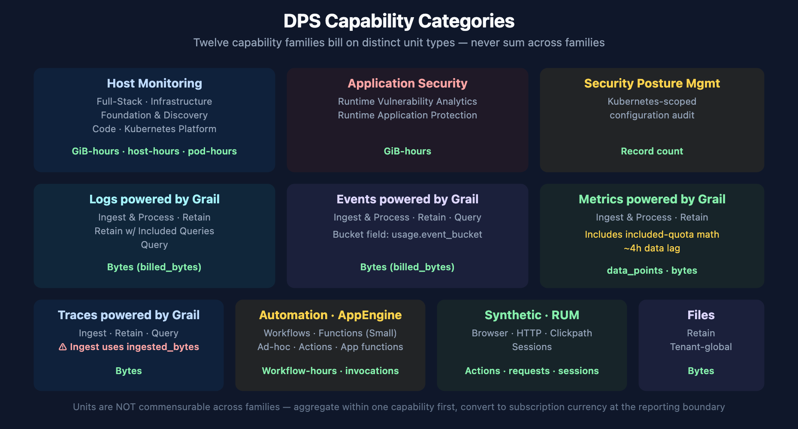
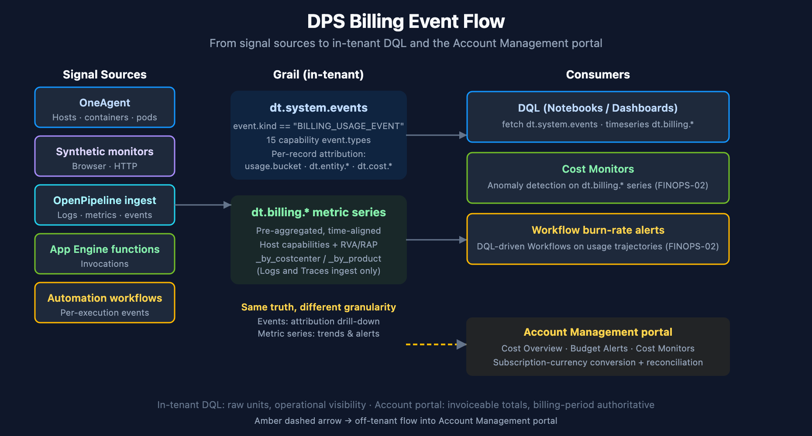
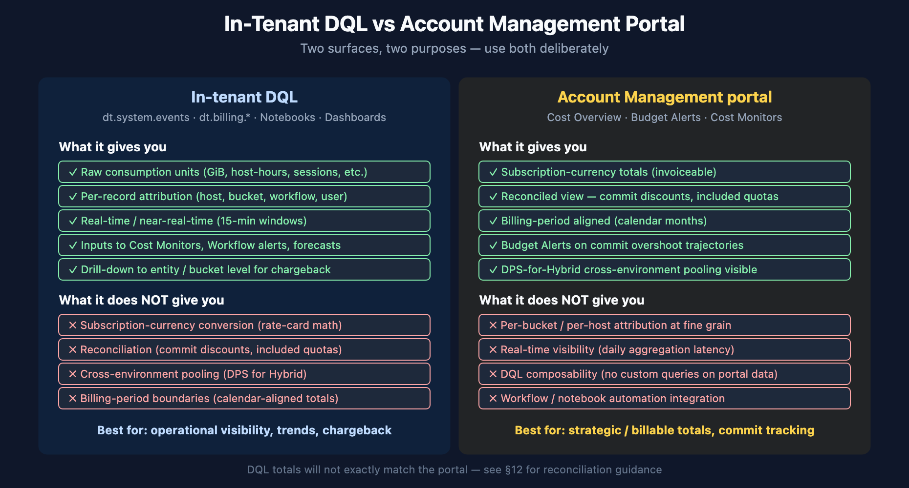

# FINOPS-01: DPS Capability Units and Querying Consumption with DQL

> **Series:** FINOPS — Cost Management & FinOps | **Reference:** 01 — DPS Capability Units and Querying Consumption with DQL | **Created:** May 2026 | **Last Updated:** 06/30/2026

## Overview

*"How much are we using, and where is it going?"* — the single most common DPS question, and the one customers most often answer by squinting at the Subscription portal once a month. This entry is the platform-engineer view of the same question: how DPS consumption is recorded inside the tenant, where the data lives in Grail, what the DQL canon looks like, and how to reconcile in-tenant numbers against the Account Management portal.

**Two surfaces, one truth.** Consumption data appears in two places: as raw per-record `BILLING_USAGE_EVENT` records in `dt.system.events`, and as pre-aggregated `dt.billing.*` metric series. They report the same underlying usage, but at different granularity — choose based on whether you need per-record attribution or fast time-aligned aggregates.

**Per-capability schemas.** There is no universal `billed_*` field. Each capability has its own unit field — `billed_gibibyte_hours` for Full-Stack, `billed_bytes` for log ingest, `data_points` for metrics, `billed_sessions` for RUM, and so on. Mixing units across capabilities is the most common authoring mistake. The schema reference is in the [REFERENCE.md](../docs/REFERENCE.md) for this series.

> **Scope:** Dynatrace SaaS, DPS license model. Classic licensing surfaces some of the same consumption data — the linked Classic-license doc covers the equivalents. Anything called out as **Softened** evolves sprint-to-sprint; verify against current docs before signing off on a procurement review.

---

## Table of Contents

1. [Short Answer](#short-answer)
2. [The DPS Capability Model](#capability-model)
3. [Two Data Surfaces — `dt.system.events` and `dt.billing.*`](#data-surfaces)
4. [Mandatory Patterns — `dedup`, `event.kind`, `billing_type`](#mandatory-patterns)
5. [Querying Host-Based Capabilities](#host-based)
6. [Querying Byte-Based Capabilities](#byte-based)
7. [Querying Count-Based Capabilities](#count-based)
8. [Metrics-Ingest with Included-Quota Subtraction](#metrics-ingest)
9. [Query-Side Billing — Chargeback by App and User](#query-side)
10. [Per-Bucket and Per-Cost-Center Attribution](#attribution)
11. [Common Pitfalls](#pitfalls)
12. [Validating Numbers Against Account Management](#validating)
13. [Bootstrap from the DEMO Dashboard](#bootstrap)
14. [Recommended Approach](#recommendation)
15. [Summary and Next Steps](#summary)

---

## Prerequisites

| Requirement | Details |
|-------------|---------|
| **Dynatrace Environment** | SaaS on the Dynatrace Platform Subscription (DPS). Most queries also work on Classic licensing — output reflects DPS-equivalent usage. |
| **Permissions** | `storage:events:read` for `fetch dt.system.events`; `storage:metrics:read` for the `dt.billing.*` metric series; `account-management` role at the account level for cross-checking against the Subscription portal. |
| **Audience** | Platform / Observability Lead (primary); Executive / Procurement (TL;DR and §12). |
| **Related series** | ORGNZ (bucket strategy, retention), OPLOGS (sampling and ingestion control), AUTOM (Cost Allocation app deployment), ADOPT-05 (optimization roadmap and ROI framing). |
| **Companion FINOPS entries** | FINOPS-02 (forecasting + anomaly detection on consumption), FINOPS-03 (the Cut / Tune / Filter optimization decision framework). |

<a id="short-answer"></a>
## 1. Short Answer

| Question | One-line answer |
|----------|-----------------|
| Where does consumption data live? | Per-record: `fetch dt.system.events \| filter event.kind == "BILLING_USAGE_EVENT"`. Pre-aggregated: `timeseries <metric>(dt.billing.<capability>.usage)`. |
| What's the unit field? | Per capability — 7 distinct unit-field families. `billed_gibibyte_hours`, `billed_container_hours`, `billed_pod_hours`, `billed_bytes`, `ingested_bytes` (Traces-Ingest only), `data_points` (Metrics), `billed_synthetic_action_count`, `billed_http_request_count`, `billed_sessions`, `billed_invocations`, or record-count (Workflows). |
| What's the canonical filter pattern? | `event.kind == "BILLING_USAGE_EVENT"` then `dedup event.id` before any aggregation. |
| How do I attribute cost to a team or product? | Use the pre-aggregated `dt.billing.*_by_costcenter` / `_by_product` metric series (Logs and Traces only), or `expand dt.cost.costcenter` / `expand dt.cost.product` on the per-record events. Other capabilities attribute via `usage.bucket`, `dt.entity.host`, or `dt.entity.application`. |
| How fresh is the data? | Most capabilities update every 15 minutes (`usage.start` / `usage.end`). Metrics - Ingest lags by ~4 hours, so query timeframes shorter than 4 hours are incomplete. Automation Workflow uses 1-hour windows. |
| What's the account-level equivalent? | Account Management portal → Subscription → Cost Overview (billable totals), Budget Alerts (commit tracking), Cost Monitors (anomaly detection). The portal applies subscription-currency conversion + reconciliation logic that DQL does not. |
| When does DQL disagree with the portal? | Three typical causes: (a) portal converts raw units to subscription currency, DQL does not; (b) portal includes pending reconciliations; (c) time-zone or time-window alignment. See §12. |

> <sub>**Sources:** [Dynatrace Platform Subscription (DT docs)](https://docs.dynatrace.com/docs/shortlink/dynatrace-platform-subscription), [DPS Hosts capabilities (DT docs)](https://docs.dynatrace.com/docs/shortlink/dps-hosts), [Account Management portal (DT docs)](https://docs.dynatrace.com/docs/shortlink/account-management). The per-capability schema table is derived from live `dt.system.events` schema inspection on a SaaS tenant (2026-05-19) — see [REFERENCE.md](../docs/REFERENCE.md) for the full schema reference.</sub>

<a id="capability-model"></a>
## 2. The DPS Capability Model



<!-- MARKDOWN_TABLE_ALTERNATIVE
| Category | Capabilities | Unit |
|----------|-------------|------|
| Host Monitoring | Full-Stack · Infrastructure · Foundation · Code · Kubernetes | GiB-hours · host-hours · pod-hours |
| Application Security | RVA · RAP | GiB-hours |
| Security Posture Management | Kubernetes-scoped audit | Record count |
| Logs powered by Grail | Ingest · Retain · Retain w/ Included Queries · Query | Bytes |
| Events powered by Grail | Ingest · Retain · Query | Bytes |
| Metrics powered by Grail | Ingest (with included-quota math) · Retain | data_points · Bytes |
| Traces powered by Grail | Ingest (ingested_bytes!) · Retain · Query | Bytes |
| Automation · AppEngine | Workflow · Functions (Small) | Workflow-hours · invocations |
| Synthetic · RUM | Browser · HTTP · Clickpath · Sessions | Actions · requests · sessions |
| Files | Retain (tenant-global) | Bytes |
| Data | Data Egress (forward to S3 / GCP / Azure) | Bytes (per-destination) |
Units are NOT commensurable — aggregate within one capability first.
-->

DPS bills along **capabilities** — discrete units of platform functionality, each with its own unit of measure and a price defined in the customer's rate card. Capabilities group into categories that match the official documentation taxonomy:

| Category | Capabilities | Unit |
|----------|-------------|------|
| **Host Monitoring** | Full-Stack Monitoring, Infrastructure Monitoring, Foundation & Discovery, Code Monitoring, Kubernetes Platform Monitoring | GiB-hours / host-hours / container-hours / pod-hours |
| **Application Security** | Runtime Vulnerability Analytics (RVA), Runtime Application Protection (RAP) | GiB-hours |
| **Security Posture Management** | Security Posture Management (Kubernetes-scoped) | Record count |
| **Logs powered by Grail** | Ingest & Process, Retain, Retain with Included Queries, Query | Bytes |
| **Events powered by Grail** | Ingest & Process, Retain, Query | Bytes |
| **Metrics powered by Grail** | Ingest & Process (with included-quota subtraction), Retain | Data points / Bytes |
| **Traces powered by Grail** | Ingest & Process, Retain, Query | Bytes (`ingested_bytes` for Ingest, `billed_bytes` for Retain/Query) |
| **Automation** | Automation Workflow | Workflow-hours (record count per hour) |
| **AppEngine Functions** | AppEngine Functions - Small (Ad-hoc, Actions, App functions) | Invocations |
| **Synthetic Monitoring** | Browser Monitor / Clickpath, HTTP Monitor | Synthetic actions / HTTP requests |
| **Real User Monitoring** | RUM session billing | Sessions |
| **Files** | Files - Retain | Bytes |
| **Data** | Data Egress (forward logs / metrics / events to AWS S3, GCP, Azure) | Bytes (uncompressed, counted per destination) |

### Why the unit families matter

A common analysis mistake is summing across capabilities — e.g., `total = sum(billed_bytes) + sum(billed_gibibyte_hours)`. The result is dimensionally meaningless. **Always aggregate within a single capability first**, convert to subscription currency at the reporting boundary, and only then combine totals if a single "how much" number is needed.

The conversion factors (units → subscription currency) are in the rate card attached to the customer's DPS agreement and are also surfaced in the Account Management portal's Cost Overview. They are not exposed via DQL — that's a deliberate separation. DQL gives raw consumption; the portal does the currency math.

> <sub>**Sources:** [Dynatrace Platform Subscription (DT docs)](https://docs.dynatrace.com/docs/shortlink/dynatrace-platform-subscription), [DPS Hosts (DT docs)](https://docs.dynatrace.com/docs/shortlink/dps-hosts), [DPS Application Security (DT docs)](https://docs.dynatrace.com/docs/shortlink/dps-appsec), [DPS Log Management (DT docs)](https://docs.dynatrace.com/docs/shortlink/dps-log-management), [DPS Metrics (DT docs)](https://docs.dynatrace.com/docs/shortlink/dps-metrics), [DPS Traces (DT docs)](https://docs.dynatrace.com/docs/shortlink/dps-traces), [DPS Automation (DT docs)](https://docs.dynatrace.com/docs/shortlink/dps-automation), [DPS AppEngine Functions (DT docs)](https://docs.dynatrace.com/docs/shortlink/dps-appfunctions). The per-capability category taxonomy matches the layout of the official [DPS Usage Details DEMO dashboard](https://docs.dynatrace.com/docs/shortlink/dynatrace-platform-subscription).</sub>

<a id="data-surfaces"></a>
## 3. Two Data Surfaces — `dt.system.events` and `dt.billing.*`



<!-- MARKDOWN_TABLE_ALTERNATIVE
| Stage | Component | Function |
|-------|-----------|----------|
| Signal sources | OneAgent · Synthetic · OpenPipeline · AppEngine · Workflows | Emit billable activity |
| In-tenant Grail | dt.system.events (per-record) · dt.billing.* (pre-aggregated metric series) | Same truth, different granularity |
| Consumers | DQL queries · Cost Monitors · Workflow burn-rate alerts | Operational visibility |
| Off-tenant (amber arrow) | Account Management portal — Cost Overview · Budget Alerts · Cost Monitors | Subscription-currency reconciliation |
-->

Consumption appears in two distinct Grail surfaces. They report the same underlying truth but at different granularity. The right choice depends on the question being asked.

### `dt.system.events` — per-record billing events

Every billable activity emits a record into `dt.system.events` with `event.kind == "BILLING_USAGE_EVENT"`. Records carry per-capability attribution (which host, which bucket, which workflow, which synthetic test). Fields vary per `event.type`.

Use this surface when you need:

- Per-host, per-bucket, per-test, per-workflow attribution
- Query-side billing (`Log Management & Analytics - Query`, `Events - Query`, `Traces - Query`) with `client.application_context` and `user.email`
- Capabilities that don't have a pre-aggregated metric series (Logs - Retain, Events, Metrics - Ingest, Synthetic, RUM, AppEngine, Automation Workflow)
- Custom chargeback expansion via `expand dt.cost.costcenter` / `dt.cost.product`

### `dt.billing.*` — pre-aggregated metric series

For host-based and security capabilities (plus pre-aggregated chargeback views for Logs and Traces), Dynatrace exposes first-class metric series. These are faster to query, naturally time-aligned, and ideal for dashboards and alerts.

| Metric series | Unit | Use |
|---------------|------|------|
| `dt.billing.full_stack_monitoring.usage` | GiB-hours | Full-Stack hourly trend |
| `dt.billing.infrastructure_monitoring.usage` | host-hours | Infrastructure hourly trend |
| `dt.billing.foundation_and_discovery.usage` | host-hours | Discovery-tier hourly trend |
| `dt.billing.code_monitoring.usage` | container-hours | Code Monitoring hourly trend |
| `dt.billing.kubernetes_monitoring.usage` | pod-hours | K8s Platform hourly trend |
| `dt.billing.runtime_vulnerability_analytics.usage` | GiB-hours | RVA hourly trend |
| `dt.billing.runtime_application_protection.usage` | GiB-hours | RAP hourly trend |
| `dt.billing.logs.ingest.usage_by_costcenter` | bytes | Log Ingest chargeback by cost center |
| `dt.billing.logs.ingest.usage_by_product` | bytes | Log Ingest chargeback by product |
| `dt.billing.traces.ingest.usage_by_costcenter` | bytes | Trace Ingest chargeback by cost center |
| `dt.billing.traces.ingest.usage_by_product` | bytes | Trace Ingest chargeback by product |

Use this surface when you need:

- Fast hourly / daily trends without raw-record aggregation overhead
- Dashboard tiles and Cost Monitor anomaly inputs
- Pre-aggregated cost-center / product views (Logs, Traces)
- Forecast inputs for Davis Predictive AI (FINOPS-02 deep-dives this)

### Decision

If your question is *"how much did capability X cost over time?"* — use `dt.billing.*`. If your question is *"who is consuming what?"* or *"which bucket / host / workflow drove the cost?"* — use `dt.system.events`. Many dashboards combine both: `dt.billing.*` for the top-line trend, `dt.system.events` for drill-down attribution.

> <sub>**Sources:** Both surfaces verified live on a SaaS tenant (2026-05-19) — the `dt.billing.*` metric catalog returned 13 series; `fetch dt.system.events | filter event.kind == "BILLING_USAGE_EVENT"` returned 15 distinct `event.type` values across 7 unit-field families. See [REFERENCE.md](../docs/REFERENCE.md) for the full schema table. **Derived:** the "which surface for which question" decision framing is community / engagement guidance — Dynatrace docs document each surface separately but do not present the choice as a single decision point.</sub>

<a id="mandatory-patterns"></a>
## 4. Mandatory Patterns — `dedup`, `event.kind`, `billing_type`

Three patterns appear in every well-formed DPS consumption query. Skipping them produces results that look reasonable but are wrong.

### `dedup event.id` before any aggregation

Billing events can be re-emitted by the platform — duplicates exist in the raw stream. Without dedup, sums double-count. The canonical pattern is:

```
fetch dt.system.events
| filter event.kind == "BILLING_USAGE_EVENT"
| filter event.type == "<capability>"
| dedup event.id      // ← every aggregation chain starts here
| summarize ...
```

This is the single most commonly forgotten pattern. The official DEMO dashboard applies it consistently — when adapting community queries, verify the dedup is present.

### Always filter on `event.kind`

`dt.system.events` contains many other event kinds beyond billing. Without `filter event.kind == "BILLING_USAGE_EVENT"`, you'll mix billing records with diagnostic events, audit events, and other platform-internal data.

### `billing_type == "BILLABLE"` — capability-specific

Some capabilities (notably **AppEngine Functions - Small**) split records into billable and non-billable. The official DEMO dashboard's AppEngine query uses `filter billing_type == "BILLABLE"` to exclude free-tier and platform-internal usage. The field is optional and not populated on every record family — when in doubt, query without the filter, observe the records, and add the filter only when `billing_type` is actually populated.

### `usage.bucket` vs `usage.event_bucket`

Events use `usage.event_bucket`; Logs and Traces use `usage.bucket`. When unifying across capabilities, `coalesce(usage.bucket, usage.event_bucket)` is the canonical fold.

> <sub>**Sources:** Pattern set lifted from the official [DPS Usage Details DEMO dashboard](https://docs.dynatrace.com/docs/shortlink/dynatrace-platform-subscription) — every query in that dashboard applies `dedup event.id` and the `event.kind` filter, and the AppEngine query uses `billing_type == "BILLABLE"`. The `usage.event_bucket` vs `usage.bucket` distinction is visible in the dashboard's Log-Retain query, which coalesces them. **Derived:** the consolidated "three mandatory patterns" framing is engagement-level guidance.</sub>

<a id="host-based"></a>
## 5. Querying Host-Based Capabilities

Host-based capabilities are the easiest to query because of the pre-aggregated `dt.billing.*` metric series. For dashboards and trend views, prefer `timeseries` over `fetch dt.system.events` — it is faster, time-aligned, and the canonical surface that Cost Monitor anomaly detection (FINOPS-02) inputs against.

**Worked example — Full-Stack Monitoring hourly usage:**

```dql
// Full-Stack Monitoring — hourly GiB-hours over the last 24 hours
timeseries hourlyUsage = sum(dt.billing.full_stack_monitoring.usage, rate:1h),
  from:-24h, interval:1h
```

The `rate:1h` parameter normalizes the metric to hourly rate regardless of the underlying ingestion interval. This is the canonical hourly-trend pattern from the official DEMO dashboard.

**Worked example — all host categories combined for a single hourly comparison:**

```dql
// All host-based capabilities, side-by-side hourly trend
timeseries
  full_stack = sum(dt.billing.full_stack_monitoring.usage, rate:1h),
  infrastructure = sum(dt.billing.infrastructure_monitoring.usage, rate:1h),
  discovery = sum(dt.billing.foundation_and_discovery.usage, rate:1h),
  code = sum(dt.billing.code_monitoring.usage, rate:1h),
  k8s = sum(dt.billing.kubernetes_monitoring.usage, rate:1h),
  from:-7d, interval:1h
```

**Worked example — per-host attribution for Full-Stack (which hosts are driving cost):**

```dql
// Top-spending hosts by Full-Stack Monitoring (uses per-record events for entity attribution)
fetch dt.system.events, from:-7d
| filter event.kind == "BILLING_USAGE_EVENT" and event.type == "Full-Stack Monitoring"
| dedup event.id
| summarize { total_gib_hours = sum(billed_gibibyte_hours) }, by:{ dt.entity.host }
| sort total_gib_hours desc
| limit 10
```

Notice the pattern split — when you need *trend* (line/bar over time), use `dt.billing.*`. When you need *attribution* (which entity drives cost), use `dt.system.events`. The two queries complement each other; many dashboards run both side-by-side.

> <sub>**Sources:** [DPS Hosts capabilities (DT docs)](https://docs.dynatrace.com/docs/shortlink/dps-hosts). All three queries verified live on a SaaS tenant (2026-05-19); the first query returned real hourly Full-Stack values (e.g., 225.75 GiB-hours/hour during business hours, 162.25 GiB-hours/hour during off-hours).</sub>

<a id="byte-based"></a>
## 6. Querying Byte-Based Capabilities

Logs, Events, Traces, Files, and Data Egress all bill in bytes. Use `fetch dt.system.events` because the per-bucket (or, for egress, per-destination) attribution is essential for chargeback — but be aware of the field-name variation:

| Capability | Unit field | Bucket field |
|------------|-----------|--------------|
| Log Management & Analytics - Ingest & Process | `billed_bytes` | `usage.bucket` |
| Log Management & Analytics - Retain | `billed_bytes` | `usage.bucket` |
| Log Management & Analytics - Retain with Included Queries | `billed_bytes` | `usage.bucket` |
| Log Management & Analytics - Query | `billed_bytes` | (`query_start` instead) |
| Events - Ingest & Process | `billed_bytes` | `usage.event_bucket` |
| Events - Retain | `billed_bytes` | `usage.event_bucket` |
| Events - Query | `billed_bytes` | (`query_start` instead) |
| **Traces - Ingest & Process** | **`ingested_bytes`** | `usage.bucket` |
| Traces - Retain | `billed_bytes` | `usage.bucket` |
| Traces - Query | `billed_bytes` | (`query_start` instead) |
| Files - Retain | `billed_bytes` | (none — tenant-global) |
| Data Egress | `billed_bytes` | (per-destination; uncompressed) |

**Traces - Ingest is the outlier** — it uses `ingested_bytes` instead of `billed_bytes`. This is the most common cross-capability footgun.

**Worked example — log ingest by bucket over the last 7 days:**

```dql
// Log Ingest & Process — total GiB ingested per bucket over last 7 days
fetch dt.system.events, from:-7d
| filter event.kind == "BILLING_USAGE_EVENT"
| filter event.type == "Log Management & Analytics - Ingest & Process"
| dedup event.id
| summarize { total_gib = sum(toDouble(billed_bytes)) / 1073741824 }, by:{ usage.bucket }
| sort total_gib desc
| limit 20
```

The `/ 1073741824` divisor converts bytes → GiB (`1024^3`). On a SaaS validation tenant this returned real per-bucket numbers (e.g., `easytrade` 18.5 GiB / 7 days, `default_logs` 8.8 GiB / 7 days).

**Worked example — Trace Ingest using the `ingested_bytes` field:**

```dql
// Trace Ingest — note ingested_bytes, NOT billed_bytes
fetch dt.system.events, from:-7d
| filter event.kind == "BILLING_USAGE_EVENT"
| filter event.type == "Traces - Ingest & Process"
| dedup event.id
| summarize { total_gib = sum(toDouble(ingested_bytes)) / 1073741824 }, by:{ usage.bucket }
| sort total_gib desc
```

**Worked example — hourly log retention bytes per bucket (the canonical area-chart pattern from the DEMO dashboard):**

```dql
// Log Retain — hourly bytes per bucket, area-chart input
fetch dt.system.events, from:-7d
| filter event.kind == "BILLING_USAGE_EVENT"
| filter event.type == "Log Management & Analytics - Retain"
| dedup event.id
| fieldsAdd billing_period = bin(timestamp, 1h)
| fields billing_period, billed_bytes, usage.bucket = coalesce(usage.bucket, usage.event_bucket)
| makeTimeseries billed_bytes = max(billed_bytes), by:{ usage.bucket }, time: billing_period, interval:1h
```

Retention queries use `max(billed_bytes)` rather than `sum()` because each hour's record carries the *cumulative* bucket size — taking the max within the bucket gives the high-water mark for that hour. Summing would double-count.

### Data Egress — forwarding data out of Dynatrace

**Data Egress** is a distinct DPS capability that bills when you forward data (logs, metrics, or events) *out* of Dynatrace to an external destination — currently **AWS S3, GCP, and Azure**. It bills in bytes (`billed_bytes`) measured on the **uncompressed** size, and is counted **once per destination**: routing the same data to N destinations multiplies consumption N×. List price is **$0.15 / GiB** at the time of writing — your rate card may differ.

```
// Data Egress — total GiB forwarded to external destinations over last 7 days
// Doc-cited shape (event.type "Data Egress", billed_bytes); validate in your tenant once egress is configured
fetch dt.system.events, from:-7d
| filter event.kind == "BILLING_USAGE_EVENT"
| filter event.type == "Data Egress"
| dedup event.id
| summarize { total_gib = sum(toDouble(billed_bytes)) / 1073741824 }
```

The account-level equivalent is **Account Management → Subscription → Overview → Cost and usage details → Usage summary → Data Egress**, or the Account Management API `GET /subscriptions/{subscriptionId}/usage`. Because forwarding *is* the cost driver, the optimization levers are *filter before you forward* and *minimize the destination count* — the same shape as the FINOPS-03 Cut / Tune / Filter framework.


> <sub>**Sources:** [DPS Log Management (DT docs)](https://docs.dynatrace.com/docs/shortlink/dps-log-management), [DPS Events (DT docs)](https://docs.dynatrace.com/docs/shortlink/dps-events), [DPS Traces (DT docs)](https://docs.dynatrace.com/docs/shortlink/dps-traces), [Data Egress (DT docs)](https://docs.dynatrace.com/docs/license/capabilities/data/dps-data-egress). The hourly-area-chart pattern is lifted verbatim from the [DPS Usage Details DEMO dashboard](https://docs.dynatrace.com/docs/shortlink/dynatrace-platform-subscription) (Log-Retain tile). The Log / Trace / Retain queries are verified live on a SaaS tenant (2026-05-19); the **Data Egress query is doc-cited, not live-validated** — egress was not configured on the validation tenant, so verify the `event.type` and `billed_bytes` shape in your own tenant once forwarding is enabled.</sub>

<a id="count-based"></a>
## 7. Querying Count-Based Capabilities

Synthetic, RUM, AppEngine, and Automation Workflow bill on counts rather than bytes or hours. The query shape is similar across all four — replace the unit field appropriately.

| Capability | Unit field | Attribution |
|------------|-----------|-------------|
| Browser Monitor / Clickpath | `billed_synthetic_action_count` | `dt.entity.synthetic_test` |
| HTTP Monitor | `billed_http_request_count` | `dt.entity.http_check` |
| Real User Monitoring | `billed_sessions` | `dt.entity.application`, `device.type` |
| AppEngine Functions - Small | `billed_invocations` | `user.email`, `workflow.id`, `function.memory_mib`, `function.duration_sec` |
| Automation Workflow | (record count, 1 per execution) | `workflow.title`, `workflow.trigger_type`, `workflow.owner` |

**Worked example — workflow execution count by trigger type:**

```dql
// Automation Workflow — execution count by trigger type (manual / schedule / event)
fetch dt.system.events, from:-7d
| filter event.kind == "BILLING_USAGE_EVENT" and event.type == "Automation Workflow"
| dedup event.id
| summarize { executions = count() }, by:{ workflow.trigger_type }
| sort executions desc
```

**Worked example — top 10 most expensive workflows (by execution count):**

```dql
// Most-executed workflows — candidates for review (sampling, on-demand-only, optimization)
fetch dt.system.events, from:-7d
| filter event.kind == "BILLING_USAGE_EVENT" and event.type == "Automation Workflow"
| dedup event.id
| summarize { executions = count() }, by:{ workflow.title, workflow.trigger_type }
| sort executions desc
| limit 10
```

**Worked example — AppEngine Functions by function type with the canonical billable filter:**

```dql
// AppEngine Functions - Small — invocation count by function type
// (Ad-hoc = workflow-task invocations, Actions = workflow actions, App functions = standalone app code)
fetch dt.system.events, from:-7d
| filter event.type == "AppEngine Functions - Small"
| filter event.kind == "BILLING_USAGE_EVENT"
| filter billing_type == "BILLABLE"
| dedup event.id
| fieldsAdd category = if(matchesPhrase(function.type, "AD_HOC"), "Ad-hoc",
                       else: if(matchesPhrase(function.type, "ACTION"), "Actions",
                       else: if(matchesPhrase(function.type, "STANDARD"), "App functions")))
| summarize { invocations = sum(coalesce(toLong(billed_invocations), 1)) }, by:{ category }
| sort invocations desc
```

**Worked example — synthetic action consumption by test:**

```dql
// Synthetic Browser / Clickpath — action count by test (high-frequency monitors are review candidates)
fetch dt.system.events, from:-7d
| filter event.kind == "BILLING_USAGE_EVENT" and event.type == "Browser Monitor or Clickpath"
| dedup event.id
| summarize { actions = sum(toLong(billed_synthetic_action_count)) }, by:{ dt.entity.synthetic_test }
| sort actions desc
| limit 10
```

> <sub>**Sources:** [DPS Automation (DT docs)](https://docs.dynatrace.com/docs/shortlink/dps-automation), [DPS AppEngine Functions (DT docs)](https://docs.dynatrace.com/docs/shortlink/dps-appfunctions). The AppEngine `billing_type` filter and `function.type` category mapping pattern are lifted from the [DPS Usage Details DEMO dashboard](https://docs.dynatrace.com/docs/shortlink/dynatrace-platform-subscription). Workflow / Synthetic queries verified live on a SaaS tenant (2026-05-19); AppEngine query is syntactically valid but execution-dependent — verify in your tenant if AppEngine Functions are used.</sub>

<a id="metrics-ingest"></a>
## 8. Metrics-Ingest with Included-Quota Subtraction

Metrics ingestion is the most subtle capability because it has **included quotas**. Each host monitored under Full-Stack Monitoring grants an included metric-data-points allowance; each host monitored under Infrastructure Monitoring grants a (different) allowance. Billable Metrics-Ingest is *only the portion of total data points that exceeds the included allowance*.

This is the canonical query from the official DEMO dashboard — annotated:

```dql
// Metrics-Ingest — billable usage after included-quota subtraction
// (canonical pattern; tenant must have ≥4 hours of data; metrics billing lags by ~4 hours)
fetch dt.system.events, from:-7d
| filter event.kind == "BILLING_USAGE_EVENT" and event.type == "Metrics - Ingest & Process"
| dedup event.id
| fieldsAdd monitoring_source = if(monitoring_source == "fullstack" or monitoring_source == "infrastructure",
                                   monitoring_source, else: "other")
| summarize { total_data_points = toLong(sum(data_points)) }, by:{ usage.start, monitoring_source }
| makeTimeseries { total_usage = sum(total_data_points, default: 0) },
    interval:15m, time: usage.start, by:{ monitoring_source }
// Join in the included-quota allowance from dt.billing.*
// 4 = 15-min buckets per hour; 900 = data-points-per-host for Full-Stack; 1500 for Infrastructure
| join [
    timeseries { included_usage = sum(dt.billing.full_stack_monitoring.usage, default: 0) },
      interval:15m, nonempty:true
    | fields monitoring_source = "fullstack", included_usage = 4 * 900 * included_usage[]
    | append [
        timeseries { included_usage = sum(dt.billing.infrastructure_monitoring.usage, default: 0) },
          interval:15m, nonempty:true
        | fields monitoring_source = "infrastructure", included_usage = 4 * 1500 * included_usage[]
      ]
  ], on:{ monitoring_source }, fields:{ included_usage }, kind:leftOuter
| fieldsAdd billed_usage = if(isNotNull(included_usage) and total_usage[] > included_usage[],
                              total_usage[] - included_usage[], else:0)
| fieldsAdd billed_usage = if(isNull(included_usage), total_usage, else: billed_usage)
| fieldsAdd billed_usage = arraySum(billed_usage)
| fieldsKeep monitoring_source, billed_usage
```

**Key elements:**

1. **`monitoring_source` rollup** — collapses fine-grained values into `fullstack`, `infrastructure`, or `other`. Other-source data points (e.g., custom metrics not tied to a host) have no included quota and are billed directly.
2. **15-minute interval** — matches Dynatrace's billing-event window. Don't change this.
3. **The `4 * 900` and `4 * 1500` factors** — `4` is 15-minute buckets per hour; `900` and `1500` are the included-data-points-per-host-per-bucket allowances for Full-Stack and Infrastructure respectively. These constants are part of the platform billing model and should not be tuned per-customer.
4. **`kind: leftOuter`** — `other`-source data has no matching included quota; `leftOuter` keeps those rows with `null` included_usage; the next two `fieldsAdd` lines handle that case.
5. **The 4-hour lag** — Metrics-Ingest's `usage.start` is approximately 4 hours behind `timestamp`. Query timeframes shorter than 4 hours will show incomplete data. Always query at least the last 4 hours.

> <sub>**Sources:** Pattern lifted from the [DPS Usage Details DEMO dashboard](https://docs.dynatrace.com/docs/shortlink/dynatrace-platform-subscription) Metrics tile — verbatim including the `4 * 900` / `4 * 1500` constants. [DPS Metrics (DT docs)](https://docs.dynatrace.com/docs/shortlink/dps-metrics). The 4-hour lag caveat is verbatim from the demo dashboard's documentation tile. **Softened:** the `900` / `1500` constants are platform-billing-model values that may change in future DPS rate-card revisions — verify against current docs before relying on them in production reporting.</sub>

<a id="query-side"></a>
## 9. Query-Side Billing — Chargeback by App and User

Three Grail capabilities bill on **query execution** in addition to ingest and retention: Log Management, Events, and Traces. The query-side records carry rich attribution — which app made the query, which user, even which finer-grained source.

| Field | Meaning |
|-------|---------|
| `query_start` | When the query ran (use this for time-bucketing, not `timestamp`) |
| `client.application_context` | Which app made the query (Notebooks, Dashboards, custom app) |
| `client.source` | Finer-grained source within the app |
| `user.email` | Who ran the query |
| `billed_bytes` | Bytes scanned by the query |

This is the foundation for chargeback by team — a Notebook that scans 50 GiB hourly is a different financial conversation than the same DQL pasted into a one-time investigation.

**Worked example — top log-query consumers by app and user:**

```dql
// Top log-query consumers — bytes scanned by app and user
fetch dt.system.events, from:-7d
| filter event.kind == "BILLING_USAGE_EVENT"
| filter event.type == "Log Management & Analytics - Query"
| dedup event.id
| summarize {
    bytes_scanned = sum(billed_bytes),
    query_count = count()
  }, by:{ client.application_context, user.email }
| fieldsAdd gib_scanned = bytes_scanned / 1073741824
| sort bytes_scanned desc
| limit 20
```

**Worked example — query-cost trend over time (use `query_start`, not `timestamp`):**

```dql
// Hourly log-query bytes scanned — bucketed by query_start (NOT timestamp)
fetch dt.system.events, from:-7d
| filter event.kind == "BILLING_USAGE_EVENT"
| filter event.type == "Log Management & Analytics - Query"
| dedup event.id
| summarize { data_read_bytes = sum(billed_bytes) }, by:{ startHour = bin(query_start, 1h) }
| sort startHour asc
```

Apply the same shape for Events (`event.type == "Events - Query" or event.type == "Events - Query - SaaS"`) and Traces (`event.type == "Traces - Query"`). The field schema is identical across all three.

> <sub>**Sources:** Pattern from the [DPS Usage Details DEMO dashboard](https://docs.dynatrace.com/docs/shortlink/dynatrace-platform-subscription) Log-Query, Events-Query, and Traces-Query tiles. [DPS Log Management (DT docs)](https://docs.dynatrace.com/docs/shortlink/dps-log-management), [DPS Events (DT docs)](https://docs.dynatrace.com/docs/shortlink/dps-events), [DPS Traces (DT docs)](https://docs.dynatrace.com/docs/shortlink/dps-traces). Query-side billing fires only when the capability is in active use — on validation tenants with light read traffic, these queries may return zero rows. Verify in your tenant before relying on them for chargeback reporting.</sub>

<a id="attribution"></a>
## 10. Per-Bucket and Per-Cost-Center Attribution

Three attribution surfaces exist, in increasing order of attribution power:

1. **`usage.bucket` / `usage.event_bucket`** — every byte-based capability includes the bucket name. Effective only if your bucket-naming convention encodes team / product / environment (covered in ORGNZ).
2. **`dt.cost.costcenter[]` / `dt.cost.product[]` arrays** — present on Metrics, Logs - Retain, and a few other capabilities. Each record carries an array of `{key, billed_bytes}` (or `{key, data_points}`) tuples — one per cost center or product the usage is allocated to.
3. **Pre-aggregated `dt.billing.*_by_costcenter` / `_by_product` metric series** — Dynatrace pre-computes the cost-center / product attribution for **Logs - Ingest** and **Traces - Ingest** and exposes them as standard metric series. Fastest to query.

**Worked example — hourly log ingest by cost center using the pre-aggregated metric:**

```dql
// Pre-aggregated log ingest by cost center — fast chargeback view
timeseries logs_by_cc = sum(dt.billing.logs.ingest.usage_by_costcenter),
  from:-7d, interval:1h, by:{ dt.cost.costcenter }
```

**Worked example — manual cost-center attribution via `expand`:**

When the pre-aggregated metric isn't available (Events, Logs - Retain, etc.), expand the per-record array manually:

```dql
// Manual cost-center attribution — Log Retain via expand
fetch dt.system.events, from:-1d
| filter event.kind == "BILLING_USAGE_EVENT"
| filter event.type == "Log Management & Analytics - Retain"
| dedup event.id
| expand dt.cost.costcenter
| fieldsAdd costcenter = dt.cost.costcenter[`key`],
            cc_bytes = dt.cost.costcenter[`billed_bytes`]
| summarize { total_gib = sum(toDouble(cc_bytes)) / 1073741824 }, by:{ costcenter }
| sort total_gib desc
```

On a validation tenant this returned three cost centers: `unassigned` (~397 TiB / day), `CostCenter2` (~172 GiB / day), `not-allowlisted` (~151 GiB / day). The `unassigned` bucket is universal — every tenant has it, and reducing its share by populating proper cost-center labels at ingest time is the upstream lever.

**Defining cost-center / product labels:** The values come from data ingested with `dt.cost.costcenter` and `dt.cost.product` attributes — typically applied via OneAgent host properties (covered in the FAQ series entry on tagging sources, standards, and strategy) or via OpenPipeline enrichment rules at ingest. Reducing the `unassigned` share is part of the FINOPS-03 optimization framework.

> <sub>**Sources:** [DPS Log Management (DT docs)](https://docs.dynatrace.com/docs/shortlink/dps-log-management) — covers cost-center / product attribution semantics. The `dt.billing.logs.ingest.usage_by_costcenter` and `dt.billing.traces.ingest.usage_by_costcenter` metric series are documented in the same shortlink. Both queries verified live on a SaaS tenant (2026-05-19); the manual-expand query returned the three cost centers above.</sub>

<a id="pitfalls"></a>
## 11. Common Pitfalls

| # | Pitfall | What goes wrong | Fix |
|---|---------|-----------------|-----|
| 1 | Missing `dedup event.id` | Double-counting when billing events are re-emitted | Add `dedup event.id` immediately after `filter event.kind == "BILLING_USAGE_EVENT"` |
| 2 | Assuming `billed_bytes` is universal | Trace Ingest returns NULL — query silently shows zero | Trace Ingest uses `ingested_bytes`; check the schema in [REFERENCE.md](../docs/REFERENCE.md) |
| 3 | Summing across capabilities | Combining `billed_bytes + billed_gibibyte_hours` produces dimensional nonsense | Aggregate within one `event.type`, convert to currency at the reporting boundary |
| 4 | Filtering on `dt.security_context` for attribution | The field is literally `"BILLING_USAGE_EVENT"` on every record | Use `usage.bucket`, `dt.entity.host`, or `dt.cost.costcenter[]` for attribution |
| 5 | Short timeframes on Metrics-Ingest | Last 4 hours are incomplete — under-reports consumption | Always query Metrics-Ingest with at least 4 hours of timeframe |
| 6 | Using `sum()` on retention bytes | Each hourly record carries the cumulative bucket size; summing inflates by 24× per day | Use `max(billed_bytes)` for Retain event types; `sum()` is correct for Ingest |
| 7 | Forgetting the included-quota subtraction for Metrics-Ingest | Over-reports billable metric consumption by the included allowance | Use the canonical query in §8; the included-quota math is non-trivial |
| 8 | Bucketing query-side billing on `timestamp` | Misaligns with actual query execution time | Bucket on `query_start` for query-side billing events |
| 9 | Confusing `usage.event_bucket` (Events) with `usage.bucket` (Logs) | Empty group-by results when querying Events | `coalesce(usage.bucket, usage.event_bucket)` for cross-capability work |
| 10 | Missing `billing_type == "BILLABLE"` on AppEngine | Mixes free-tier and platform-internal usage with billable | Add the filter when querying AppEngine; field is optional on other capabilities |

> <sub>**Sources:** Pitfalls #1–#9 derived from live tenant validation against the [DPS Usage Details DEMO dashboard](https://docs.dynatrace.com/docs/shortlink/dynatrace-platform-subscription) (2026-05-19). Pitfall #10 is explicit in the demo dashboard's AppEngine query. **Derived:** the consolidated pitfall list is engagement-level synthesis — Dynatrace docs cover each capability in isolation but do not present this consolidated set of cross-capability footguns.</sub>

<a id="validating"></a>
## 12. Validating Numbers Against Account Management



<!-- MARKDOWN_TABLE_ALTERNATIVE
| Surface | Best for | Gives | Doesn't give |
|---------|----------|-------|---------------|
| In-tenant DQL | Operational visibility, trends, chargeback | Raw units, per-record attribution, real-time, drill-down | Subscription currency, reconciliation, billing-period totals |
| Account portal | Strategic billable totals, commit tracking | Subscription currency, reconciled view, billing-period aligned, budget tracking | Fine-grained attribution, real-time, DQL composability |
DQL totals will not exactly match the portal — see this section for reconciliation guidance.
-->

DQL totals will not exactly match the Subscription portal's Cost Overview. This is not a bug — they measure overlapping but distinct things. Three reconciliation factors:

### Factor 1 — Subscription-currency conversion

DQL returns **raw units** (GiB, host-hours, sessions, invocations). The portal applies **rate-card conversion** to express usage in subscription currency. The conversion factors are not exposed in DQL by design — they belong to the agreement, not the tenant.

**Practical implication:** If you need a subscription-currency total, the portal's Cost Overview is the authoritative source. DQL is for *operational visibility* (what's consuming what, where is the trend going), not *invoiceable totals*.

### Factor 2 — Reconciliation lag

The portal applies post-hoc reconciliation: included quotas, cross-environment commits (DPS for Hybrid), partial-hour rounding (any consumption under 1 hour rounds up to 15 minutes), and certain capability-specific true-ups. These adjustments land in the portal but do not modify the per-record `dt.system.events` data.

**Practical implication:** Daily DQL totals will usually be *higher* than the portal's recognized billable totals — DQL counts everything; the portal subtracts included quotas and may apply commitment discounts.

### Factor 3 — Time-window alignment

The portal aligns to billing-period boundaries (typically calendar months in the customer's contract time zone). DQL aligns to whatever time range you query. For monthly reconciliation, query `from:` and `to:` exactly matched to the billing-period start/end in the contract time zone.

Additionally, **Metrics-Ingest has a ~4-hour data lag** — the portal incorporates a corrected view once the lag closes, but a same-day DQL total will under-report metrics specifically.

### When the gap is large

If your DQL total deviates from the portal by more than ~15% for the same period after accounting for the three factors above, investigate:

- Are you missing capabilities? Cross-check the `event.type` list in [REFERENCE.md](../docs/REFERENCE.md) against what your queries cover.
- Is `dedup event.id` present? Missing dedup roughly doubles totals.
- Are retention queries using `sum()` where they should use `max()`? (Pitfall #6.)
- For Metrics-Ingest, did you subtract included quotas? (Section 8.)
- For Traces - Ingest, are you reading `ingested_bytes`? Reading `billed_bytes` returns nothing.

> <sub>**Sources:** [Account Management portal (DT docs)](https://docs.dynatrace.com/docs/shortlink/account-management), [License (DT docs)](https://docs.dynatrace.com/docs/license). The rounding-rule ("usage under one hour rounds up to nearest 15 minutes") is documented at the License top-level. **Softened:** the specific reconciliation factors the portal applies (commitment discounts, true-ups, DPS-for-Hybrid pooling) evolve per-contract — the three factors above are the generally observable categories, not an exhaustive list of every portal-side adjustment.</sub>

<a id="bootstrap"></a>
## 13. Bootstrap from the DEMO Dashboard

Dynatrace publishes an official **DPS Usage Details DEMO dashboard** that exercises the patterns in this notebook for every capability category. It is the fastest way to get started:

1. Open the [DPS Usage Details DEMO dashboard](https://docs.dynatrace.com/docs/shortlink/dynatrace-platform-subscription) in your tenant — it's linked from the License overview docs.
2. Use the *Make a copy* menu option to create an editable copy in your tenant.
3. Customize the cost-center / product groupings to match your bucket-naming or `dt.cost.*` labels.
4. Set the timeframe to align with your billing period (see §12).
5. Use the dashboard as the operational view; use this notebook as the canonical query reference when you need to extend or debug.

The DQL queries throughout §§5–9 are directly derived from this dashboard's tile patterns. When the dashboard updates (Dynatrace refreshes it as new capabilities ship), the patterns in this notebook should be re-verified — flag drift in [REFERENCE.md](../docs/REFERENCE.md) Lessons Learned.

> <sub>**Sources:** [DPS Usage Details DEMO dashboard (DT docs)](https://docs.dynatrace.com/docs/shortlink/dynatrace-platform-subscription) — the canonical reference for DPS-consumption DQL patterns. **Derived:** the "make a copy, customize, use as bootstrap" workflow is the standard demo-dashboard adoption pattern.</sub>

<a id="recommendation"></a>
## 14. Recommended Approach

A workable plan for putting in-tenant consumption visibility in place:

1. **Start with the DEMO dashboard** (§13). Copy it, customize it, leave it running. This is the operational view your team will look at most days.
2. **Adopt the three mandatory patterns** (§4) — `dedup event.id`, `event.kind` filter, `billing_type == "BILLABLE"` where applicable. Audit any consumption query in your tenant against these before trusting its numbers.
3. **Use the right surface for the question**: `dt.billing.*` for trends and Cost Monitor inputs; `dt.system.events` for attribution and chargeback.
4. **Pre-aggregated chargeback first.** For Logs and Traces ingest, use `dt.billing.*_by_costcenter` / `_by_product` before reaching for `expand dt.cost.costcenter`. It's faster and cleaner.
5. **Set realistic reconciliation expectations.** DQL totals are not invoiceable. The portal is authoritative for billing-period totals; DQL is authoritative for operational visibility.
6. **Reduce the `unassigned` cost-center share** at ingest time, not at query time. The OpenPipeline / OneAgent enrichment patterns covered in ORGNZ and FAQ-02 are the upstream lever.
7. **Pair with FINOPS-02 for forecasting** (when will we hit commit?) and **FINOPS-03 for optimization** (what should we cut, tune, or filter?). FINOPS-01 is the *what is being used* foundation; the next two entries are *what will be used* and *what should change*.

<a id="summary"></a>
## Summary

DPS consumption lives in two places — per-record in `dt.system.events` and pre-aggregated in `dt.billing.*`. The schema is per-capability with seven distinct unit-field families, and the three non-negotiable patterns (`dedup event.id`, `event.kind` filter, and `billing_type` filter on AppEngine) appear in every well-formed query. The DEMO dashboard is the canonical bootstrap; the queries in §§5–9 are the canonical building blocks. DQL totals will not exactly match the Subscription portal, and that is by design — the portal does subscription-currency conversion and reconciliation that DQL does not. Use both surfaces deliberately.

## Next Steps

- Read **FINOPS-02** for forecasting and anomaly detection on top of the queries in this entry — including Cost Monitors, Davis Predictive AI on `dt.billing.*` metrics, and Workflow-based burn-rate alerting.
- Read **FINOPS-03** for the Cut / Tune / Filter optimization decision framework — once you know what's being consumed (FINOPS-01), the next question is what to do about it.
- Read the **ORGNZ** topic series for bucket strategy and retention policy design — the upstream lever for byte-based capability attribution.
- Read **OPLOGS** for OpenPipeline sampling and filter patterns — the upstream lever for log ingest reduction.
- Open the [Account Management portal](https://docs.dynatrace.com/docs/shortlink/account-management) and run the Cost Overview alongside your DQL totals for one billing period to develop intuition for the reconciliation factors in §12.

---

<sub>*This notebook was AI-generated from community-submitted and publicly available sources. This notebook series is not officially supported by Dynatrace. Always verify information against official [Dynatrace documentation](https://docs.dynatrace.com/docs).*</sub>
