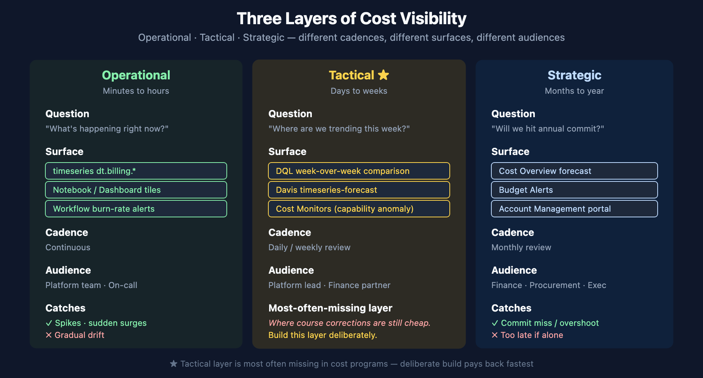
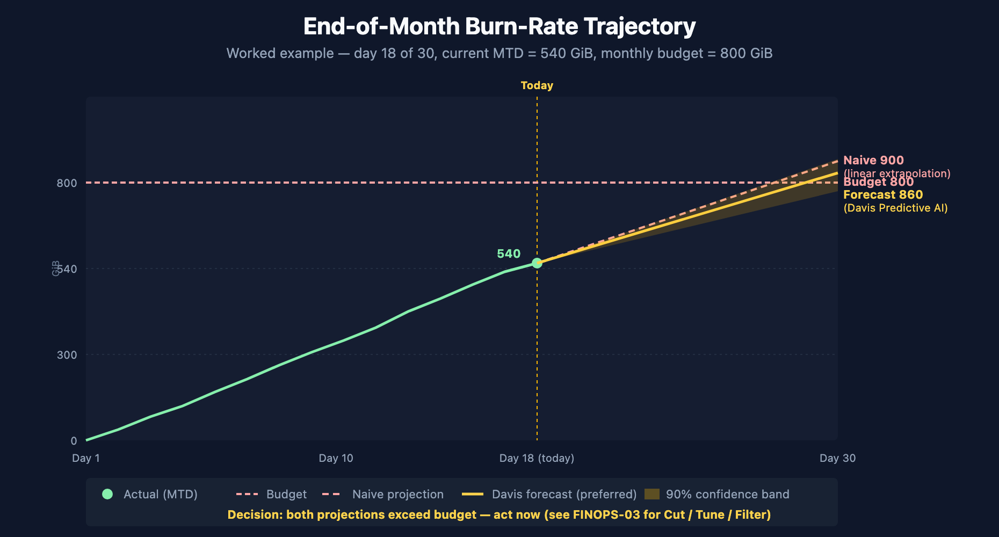
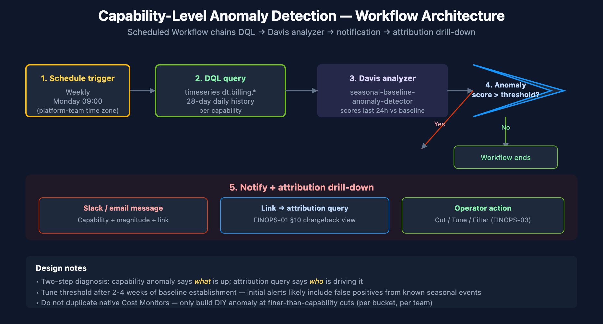

# FINOPS-02: Forecasting and Anomaly Detection on DPS Consumption

> **Series:** FINOPS — Cost Management & FinOps | **Reference:** 02 — Forecasting and Anomaly Detection on DPS Consumption | **Created:** May 2026 | **Last Updated:** 07/01/2026

## Overview

Knowing *current* consumption (covered in FINOPS-01) is operational. Knowing *projected* consumption — and being alerted when the trajectory breaks — is what turns FinOps from a monthly report into a daily control loop. This entry walks through both the native Dynatrace surfaces (Account Management Cost Monitors and Budget Alerts) and the in-tenant DIY surfaces (Davis Predictive AI on `dt.billing.*` series, plus Workflow-driven burn-rate alerts).

**Three layers of cost visibility:** *Operational* (what's happening right now), *Tactical* (where are we trending this week / this month), *Strategic* (will we hit our annual commit?). Each layer pairs with different surfaces, different cadences, and different audiences. Treating them as one thing — "the cost dashboard" — is the most common reason cost programs never escape monthly snapshots.

**Native first, DIY where native is silent.** Cost Monitors and Budget Alerts cover most strategic and tactical use cases out of the box. DIY DQL forecasting is for the operational layer where you want a custom signal (per-bucket trajectory, per-team burn, per-capability projection), or when the native surface doesn't yet exist for the cut you need.

> **Scope:** Dynatrace SaaS on DPS. Davis Predictive AI's `timeseries-forecast` and `seasonal-baseline-anomaly-detector` analyzers run on any time-aligned metric series, including `dt.billing.*`. The portal-side Cost Monitors evolve sprint-to-sprint — verify specific UI affordances against current docs at procurement-review time.

---

## Table of Contents

1. [Short Answer](#short-answer)
2. [Three Layers of Cost Visibility](#three-layers)
3. [Native — Account Management Cost Monitors](#cost-monitors)
4. [Native — Budget Alerts](#budget-alerts)
5. [DIY — DQL Trend Queries with `makeTimeseries`](#dql-trends)
6. [DIY — Davis Predictive AI on `dt.billing.*`](#davis-forecast)
7. [DIY — Workflow Burn-Rate Alerts](#workflow-alerts)
8. [Worked Example — End-of-Month Projection](#wx-projection)
9. [Worked Example — Capability-Level Anomaly Alert](#wx-anomaly)
10. [When to Use Native vs DIY](#native-vs-diy)
11. [Recommended Approach](#recommendation)
12. [Summary and Next Steps](#summary)

---

## Prerequisites

| Requirement | Details |
|-------------|---------|
| **Dynatrace Environment** | SaaS on DPS. Davis Predictive AI is available platform-wide. Cost Monitors and Budget Alerts require Account Management portal access (separate IAM scope from tenant IAM). |
| **Permissions** | `storage:metrics:read` for `timeseries dt.billing.*` queries; `davis:analyzers:execute` for `timeseries-forecast` and `seasonal-baseline-anomaly-detector`; `automation:workflows:write` for workflow-based burn-rate alerts; account-level admin or finance role for Cost Monitors and Budget Alerts configuration. |
| **FINOPS-01 understanding** | This entry assumes familiarity with `dt.billing.*` vs `dt.system.events` and the per-capability schema. |
| **Audience** | Platform / Observability Lead (DIY surfaces), Executive / Procurement (native surfaces and §11 recommendation). |

<a id="short-answer"></a>
## 1. Short Answer

| Question | One-line answer |
|----------|-----------------|
| Will we hit our annual commit? | Account Management → **Cost Overview** → forecast line on Cost Overview. Native, automatic, billing-period-aligned. |
| Alert me if month-to-date is overshooting | Account Management → **Budget Alerts**. Configure thresholds; email / webhook notifications. |
| Alert me if a *specific capability* is spiking | Account Management → **Cost Monitors** (anomaly detection on consumption series). |
| Forecast per-bucket / per-team consumption | DIY — `timeseries dt.billing.*` + Davis `timeseries-forecast` analyzer. |
| Alert when per-bucket burn exceeds threshold | DIY — Workflow with scheduled DQL trigger + Davis anomaly analyzer or static threshold. |
| 7-day / 30-day trend visualization | DIY — `timeseries dt.billing.<capability>.usage` for host-based; `fetch dt.system.events \| makeTimeseries` for byte/count-based. |
| Day-over-day or week-over-week comparison | DIY — DQL with two parallel time ranges; pattern in [`dt-dql-essentials`](https://docs.dynatrace.com/docs/discover-dynatrace/references/dynatrace-query-language) skill. |

**The headline:** native surfaces (Cost Monitors, Budget Alerts) cover commitment-level visibility automatically. DIY surfaces (DQL + Davis analyzers + Workflows) cover the operational cut native doesn't yet do — per-bucket, per-team, per-capability projections that pre-empt the monthly Cost Overview surprise.

> <sub>**Sources:** [Account Management portal (DT docs)](https://docs.dynatrace.com/docs/shortlink/account-management), [Dynatrace Platform Subscription (DT docs)](https://docs.dynatrace.com/docs/shortlink/dynatrace-platform-subscription), [DQL reference (DT docs)](https://docs.dynatrace.com/docs/discover-dynatrace/references/dynatrace-query-language). **Derived:** the native-vs-DIY decision framing is engagement-level guidance — the underlying surfaces are documented separately; the consolidated routing table is the synthesis.</sub>

<a id="three-layers"></a>
## 2. Three Layers of Cost Visibility



<!-- MARKDOWN_TABLE_ALTERNATIVE
| Layer | Horizon | Question | Surface | Cadence | Audience |
|-------|---------|----------|---------|---------|----------|
| Operational | minutes-hours | What's happening now? | timeseries dt.billing.* + Workflow alerts | Continuous | Platform team / On-call |
| Tactical ★ | days-weeks | Where are we trending this week? | DQL week-over-week + Davis forecast + Cost Monitors | Daily / weekly | Platform lead + Finance partner |
| Strategic | months-year | Will we hit annual commit? | Cost Overview + Budget Alerts | Monthly | Finance / Procurement / Exec |
★ Tactical is the layer most often missing
-->

A working FinOps program operates at three time horizons. Conflating them is the most common failure mode — "the cost dashboard" usually means one of the three was built and the other two are missing.

| Layer | Time horizon | Question | Best surface | Cadence |
|-------|-------------|----------|--------------|---------|
| **Operational** | minutes to hours | What's happening right now? | `timeseries dt.billing.*` in a Dynatrace dashboard; Workflow burn-rate alerts | continuous |
| **Tactical** | days to weeks | Where are we trending this week / this month? | DQL forecast (Davis `timeseries-forecast`); Cost Monitors anomaly alerts | daily / weekly review |
| **Strategic** | months to year | Will we hit our annual commit? | Account Management → Cost Overview forecast; Budget Alerts | monthly review |

### Why all three matter

- **Operational alone** catches spikes but misses gradual drift. A team that doubles ingestion volume over six weeks looks fine hour-by-hour but blows the annual commit.
- **Strategic alone** catches the commit miss but only after most of the year has been spent. The conversation with the team that doubled ingest happens in November, when there's no runway left.
- **Tactical alone** is where most cost programs actually live, and it's the layer most likely to be silent — daily / weekly trend is exactly the cadence at which course corrections are still cheap.

**In community practice, the layer most often missing is tactical.** Operational dashboards get built because they're easy. Strategic Cost Overview is automatic. The weekly burn-rate alert that says "this team's ingest is 40% above its 4-week baseline" is the layer that takes deliberate work — and the layer that prevents the November conversation.

> <sub>**Sources:** Layer taxonomy is engagement-level synthesis — Dynatrace docs cover each surface (Cost Overview, Cost Monitors, custom DQL) separately. **Derived** throughout. **Softened:** the "tactical layer is most often missing" observation is from community practice across cost-program engagements, not a Dynatrace-published claim — verify against your own program before treating it as universal.</sub>

<a id="cost-monitors"></a>
## 3. Native — Account Management Cost Monitors

**Cost Monitors** are Dynatrace's native anomaly-detection surface for DPS consumption. They live in the Account Management portal (not in the tenant) and operate on the same usage data that powers Cost Overview, with seasonal-baseline anomaly detection layered on top.

### What they do

- Watch each enabled capability for unusual consumption patterns
- Apply seasonal-baseline anomaly detection (account for weekly / daily seasonality)
- Notify (email, webhook, Slack) when usage deviates significantly from baseline
- Are pre-configured for common cuts (per capability, per environment in DPS for Hybrid)

### What to configure

1. **Enable per-capability monitors** for the capabilities your team uses heavily. Don't enable monitors for capabilities you don't use — the seasonal baseline needs traffic to establish, and an under-used capability will produce noisy alerts.
2. **Choose sensitivity carefully.** Default sensitivity catches large spikes; a more sensitive setting catches gradual drift but produces more alerts. Start at default for the first 2-3 weeks of baseline establishment, then tune.
3. **Wire notifications to the team that can act.** A Cost Monitor that alerts a finance distribution list is information; one that alerts the platform team that owns the OpenPipeline pipeline causing the spike is action.
4. **Review the false-positive rate weekly for the first month.** Tune sensitivity down if you're getting alerts for known seasonal patterns (month-end batch jobs, weekly deployment surges, etc.).

### When Cost Monitors are silent

Cost Monitors operate at the capability level — they catch "Logs ingest is way up" but not "the `payments-team` bucket is way up while the `marketing-team` bucket is steady." For per-bucket / per-team anomaly detection, see §6 (Davis Predictive AI in DQL).

> <sub>**Sources:** [Account Management portal (DT docs)](https://docs.dynatrace.com/docs/shortlink/account-management) — Cost Monitors documentation. **Softened:** specific sensitivity-tuning guidance is community practice — Dynatrace docs document the configuration surface; the tuning heuristics are engagement-level observations.</sub>

<a id="budget-alerts"></a>
## 4. Native — Budget Alerts

Where Cost Monitors are anomaly-detection ("is this period unusual"), **Budget Alerts** are threshold-based ("are we on track to hit the commit"). Both surfaces live in Account Management, often configured by the same person, but they answer different questions.

> Neither Cost Monitors nor Budget Alerts have a Settings 2.0 schema or Terraform resource — they're Account Management API objects, confirmed not to exist alongside the rest of the repo's schema catalog in **AUTOM-02**. Don't go looking for a `builtin:` schema for cost config; it isn't there.

### What they do

- Track month-to-date consumption against an explicit budget (the customer's DPS annual commit, monthly-allocated)
- Fire at configurable thresholds — Dynatrace auto-provisions 75% / 90% / 100% of the annual commitment on every DPS account; customize tiers (e.g., 50/75/90) on top of that default for earlier signal
- Notify finance, procurement, and platform teams via email or webhook
- Provide an end-of-period forecast based on month-to-date trajectory

### What to configure

1. **Set the monthly budget to the DPS annual commit / 12.** If your commit is not evenly distributed (e.g., growth-phased commit), set per-month budgets to match the contract.
2. **Pick threshold tiers based on time-to-react.** The Dynatrace-provisioned default is 75/90/100 of the annual commitment, enabled automatically with no configuration required. Many programs add an earlier custom tier (e.g., 50%) for more lead time; for tight-commit customers a 25/50/75 cadence gives earlier signal still.
3. **Tier the notification escalation.** 50% → platform team. 75% → platform team + finance. 90% → procurement + leadership. The threshold tiers map to who needs to act.
4. **Annual rollover handling.** Confirm whether unused monthly budget rolls within the year (most DPS contracts do) — this affects how a 75% June alert is interpreted (might be fine if January-May ran low).

### When Budget Alerts are insufficient

Budget Alerts are coarse — month-level, account-level. They don't decompose to "which capability is driving the overshoot" without drilling into Cost Overview, and they don't decompose to per-team / per-bucket attribution at all. Pair them with Cost Monitors (capability-level anomalies) and DIY DQL queries (team-level attribution).

> <sub>**Sources:** [Account Management portal (DT docs)](https://docs.dynatrace.com/docs/shortlink/account-management) — Budget Alerts documentation. **Softened:** the threshold-tier and notification-escalation patterns are community practice — Dynatrace docs document the configuration surface; the operational patterns are engagement-level.</sub>

<a id="dql-trends"></a>
## 5. DIY — DQL Trend Queries with `makeTimeseries`

For host-based capabilities, prefer `timeseries dt.billing.*` (covered in FINOPS-01 §5). For byte- and count-based capabilities, use `fetch dt.system.events | makeTimeseries` to build a time-aligned trend series:

```dql
// Daily log ingest GiB per bucket — 30-day trend
fetch dt.system.events, from:-30d
| filter event.kind == "BILLING_USAGE_EVENT"
| filter event.type == "Log Management & Analytics - Ingest & Process"
| dedup event.id
| fieldsAdd gib = toDouble(billed_bytes) / 1073741824
| makeTimeseries daily_gib = sum(gib), by:{ usage.bucket }, interval:1d
```

**Worked example — week-over-week comparison via two parallel time ranges:**

```dql
// Week-over-week log-ingest comparison — this week vs last week
fetch dt.system.events, from:-14d, to:-7d
| filter event.kind == "BILLING_USAGE_EVENT"
| filter event.type == "Log Management & Analytics - Ingest & Process"
| dedup event.id
| summarize { last_week_gib = sum(toDouble(billed_bytes)) / 1073741824 }, by:{ usage.bucket }
| lookup [
    fetch dt.system.events, from:-7d
    | filter event.kind == "BILLING_USAGE_EVENT"
    | filter event.type == "Log Management & Analytics - Ingest & Process"
    | dedup event.id
    | summarize { this_week_gib = sum(toDouble(billed_bytes)) / 1073741824 }, by:{ usage.bucket }
  ], sourceField:usage.bucket, lookupField:usage.bucket
| fieldsAdd this_week_gib = lookup.this_week_gib
| fieldsAdd delta_pct = round((this_week_gib - last_week_gib) / last_week_gib * 100, decimals: 1)
| fields usage.bucket, last_week_gib, this_week_gib, delta_pct
| sort delta_pct desc
```

Buckets with high positive `delta_pct` are growing fast and merit a closer look. The pattern generalizes to month-over-month (`from:-60d, to:-30d` and `from:-30d`), day-over-day (1d), or any other comparison window.

> <sub>**Sources:** [DQL `makeTimeseries` (DT docs)](https://docs.dynatrace.com/docs/discover-dynatrace/references/dynatrace-query-language). The week-over-week `lookup` pattern is canonical in [`dynatrace-dql-examples`](https://docs.dynatrace.com/docs/discover-dynatrace/references/dynatrace-query-language) (parameter-level optimization recipes). Both queries are syntactically valid; execution-dependent on having ≥14 days of tenant history.</sub>

<a id="davis-forecast"></a>
## 6. DIY — Davis Predictive AI on `dt.billing.*`

Davis Predictive AI's `timeseries-forecast` analyzer runs against any time-aligned metric series, including the `dt.billing.*` family. This is the in-tenant equivalent of the Account Management Cost Overview forecast, but at a finer cut — per bucket, per cost center, per capability.

### How to invoke it

The analyzer takes a time-bucketed input series and returns a forecast horizon plus confidence bands. Two access paths:

1. **Notebook tile** — add a Davis-AI / Forecast tile, point it at a `timeseries` query.
2. **Workflow task** — `davis-execute-analyzer` action with `analyzerName: "dt.statistics.forecast"` and the DQL query as input.

### Pattern — forecast per-capability host-hours for the next 30 days

Input series (28-day history, hourly):

```dql
// Forecast input — 28-day Full-Stack Monitoring history at hourly granularity
timeseries hourlyUsage = sum(dt.billing.full_stack_monitoring.usage, rate:1h),
  from:-28d, interval:1h
```

Feed this query into the **Davis Forecast** analyzer with a 30-day forecast horizon. Output: forecasted hourly usage for the next 30 days, with confidence bands (typically 90% and 50%).

### What to do with the output

- Sum the forecast over the remaining month → end-of-month projection
- Compare projection × rate-card conversion against the monthly budget
- Surface in a Workflow that posts to Slack / email if the projection exceeds threshold

### Pattern — anomaly detection on consumption (seasonal baseline)

For "is *this* hour unusual given the seasonal pattern," use the `seasonal-baseline-anomaly-detector` instead of the forecast analyzer. Same input shape; different output (anomaly score per data point rather than projected values).

### When Davis Predictive AI on consumption is wrong

Forecasting assumes stationary or seasonally-stationary input. Consumption time series are *not* stationary during onboarding phases — a new tenant ramps up over weeks, adoption changes the baseline, new buckets get created. Treat the first 2-4 weeks of any new tenant or major rollout as too-noisy-to-forecast; let the baseline stabilize before relying on forecast outputs.

> <sub>**Sources:** [Davis AI overview (DT docs)](https://docs.dynatrace.com/docs/discover-dynatrace/platform/davis-ai), [Workflows actions (DT docs)](https://docs.dynatrace.com/docs/analyze-explore-automate/workflows). **Derived:** the application of Davis Predictive AI to `dt.billing.*` specifically is community practice — Davis analyzers are documented as general-purpose; their applicability to billing series is the synthesis. **Softened:** the "2-4 week stabilization" guidance is engagement-level observation, not a Dynatrace-published threshold.</sub>

<a id="workflow-alerts"></a>
## 7. DIY — Workflow Burn-Rate Alerts

**Workflow burn-rate alerts** combine the DQL trend queries (§5) and Davis forecast / anomaly (§6) into an active control loop: scheduled execution, threshold evaluation, notification.

### Recipe — daily per-bucket burn-rate workflow

1. **Trigger:** Schedule — daily at a consistent time (e.g., 09:00 in the platform team's time zone).
2. **Task 1 — DQL query:** week-over-week per-bucket comparison (the §5 pattern).
3. **Task 2 — Filter / threshold:** select buckets with `delta_pct > 50%` (a configurable threshold).
4. **Task 3 — Notify:** post to Slack / email with the list, linking back to the FINOPS-01 §10 attribution query for drill-down.

### Recipe — capability-level Davis-forecast workflow

1. **Trigger:** Schedule — weekly (Monday 09:00 covers the prior-week trajectory).
2. **Task 1 — DQL query:** 28-day hourly history of each `dt.billing.<capability>.usage`.
3. **Task 2 — Davis-forecast analyzer:** project 30 days forward.
4. **Task 3 — Compare against budget:** if `projection × rate > monthly_budget × (days_remaining / days_in_month)`, fire.
5. **Task 4 — Notify:** post to a finance-and-platform escalation channel.

### When workflow alerts overlap with native

Native Cost Monitors and Budget Alerts cover the *strategic* layer. Workflow alerts cover the *tactical* layer — finer cuts, faster cadence, your-team's-own-action-handoff. The two should not duplicate; if a Cost Monitor already catches "Logs ingest is way up," don't build a workflow that re-detects the same condition. Build the workflow at the cut native is silent on (per-bucket, per-team, per-cost-center).

> <sub>**Sources:** [Workflows (DT docs)](https://docs.dynatrace.com/docs/analyze-explore-automate/workflows), [Davis analyzers (DT docs)](https://docs.dynatrace.com/docs/discover-dynatrace/platform/davis-ai). **Derived:** the workflow-recipe patterns are engagement-level guidance; the underlying Workflow surface and Davis analyzers are documented separately.</sub>

<a id="wx-projection"></a>
## 8. Worked Example — End-of-Month Projection



<!-- MARKDOWN_TABLE_ALTERNATIVE
| Day | MTD GiB | Budget | Naive projection | Davis forecast |
|-----|---------|--------|------------------|----------------|
| 18 (today) | 540 | 800 | 900 (linear) | 860 (with seasonality + confidence band) |
Both projections exceed budget — act now (see FINOPS-03 for Cut / Tune / Filter)
-->

**Scenario:** It's day 18 of a 30-day billing month. The platform team wants to know whether the current burn projects to exceed the monthly Log Ingest budget of 800 GiB.

**Step 1 — Month-to-date consumption:**

```dql
// Month-to-date log ingest GiB — replace the from: range with your billing-month start in the contract time zone
// Example pattern uses the start of the current calendar month
fetch dt.system.events, from:now() - 18d
| filter event.kind == "BILLING_USAGE_EVENT"
| filter event.type == "Log Management & Analytics - Ingest & Process"
| dedup event.id
| summarize { mtd_gib = sum(toDouble(billed_bytes)) / 1073741824 }
```

Suppose this returns `mtd_gib = 540`. The team has consumed 540 GiB in the first 18 days.

**Step 2 — Linear projection (naive):**

`projection = 540 × (30 / 18) = 900 GiB` — that's 12.5% over the 800 GiB budget. The naive projection assumes uniform daily consumption.

**Step 3 — Davis-forecast projection (better):**

Run the 28-day input through the `timeseries-forecast` analyzer for a 12-day horizon (the rest of the month). The forecast accounts for daily / weekly seasonality (e.g., lower weekend traffic), which the naive projection ignores.

**Step 4 — Decision:**

If both projections agree the budget will be exceeded: act now. The Cut / Tune / Filter framework in FINOPS-03 covers what to do. If they disagree: investigate the forecast confidence bands — wide bands suggest the recent history is too noisy to forecast reliably (re-baseline after 1-2 more weeks; until then, manage tactically week-over-week).

> <sub>**Sources:** [Davis AI forecast (DT docs)](https://docs.dynatrace.com/docs/discover-dynatrace/platform/davis-ai). The naive linear projection and the forecast-vs-naive decision pattern are engagement-level synthesis (**Derived**).</sub>

<a id="wx-anomaly"></a>
## 9. Worked Example — Capability-Level Anomaly Alert



<!-- MARKDOWN_TABLE_ALTERNATIVE
| Step | Component | Action |
|------|-----------|--------|
| 1 | Schedule trigger | Weekly, Monday 09:00 (platform-team time zone) |
| 2 | DQL query | timeseries dt.billing.* — 28-day daily history per capability |
| 3 | Davis analyzer | seasonal-baseline-anomaly-detector scores last 24h |
| 4 | Conditional | Anomaly score > threshold? |
| 5 | Notify + drill-down | Slack/email with capability + link to FINOPS-01 §10 attribution query |
Two-step diagnosis: anomaly says WHAT is up; attribution says WHO is driving it.
-->

**Scenario:** The platform team wants to know within 24 hours if any single capability's daily consumption deviates significantly from its 4-week baseline — without waiting for the monthly Cost Monitor to fire.

**Step 1 — Build the input series (28-day daily history per capability):**

```dql
// Daily host-hours per host capability — 28-day baseline input
timeseries
  full_stack = sum(dt.billing.full_stack_monitoring.usage, rate:1d),
  infrastructure = sum(dt.billing.infrastructure_monitoring.usage, rate:1d),
  code = sum(dt.billing.code_monitoring.usage, rate:1d),
  k8s = sum(dt.billing.kubernetes_monitoring.usage, rate:1d),
  from:-28d, interval:1d
```

**Step 2 — Feed into Davis seasonal-baseline-anomaly-detector**, scoring the last 24 hours against the 27-day baseline.

**Step 3 — Workflow logic:**

- If any capability returns an anomaly score above the configured threshold (e.g., > 2 standard deviations), the workflow fires.
- The notification includes the capability name, the magnitude of deviation, and a link to the FINOPS-01 §5 per-host (or §10 per-cost-center) attribution query for drill-down.

**Step 4 — Tune the threshold:**

Start with the analyzer default. After the first 2-4 alerts, judge whether each was actionable: a true cost spike, or a known event (a planned rollout, a synthetic-test enable, a one-time job)? Adjust threshold + add filter conditions (e.g., "ignore Tuesday 02:00-04:00 when the weekly cleanup job runs") to suppress known patterns.

**Step 5 — Pair with bucket-level attribution:**

Capability-level anomaly tells you something is up; FINOPS-01 §10 (per-cost-center attribution) tells you *which* bucket or team is driving it. The two-step diagnosis is the typical pattern: anomaly fires → operator runs the attribution query → conversation with the team behind the spike.

> <sub>**Sources:** [Davis AI (DT docs)](https://docs.dynatrace.com/docs/discover-dynatrace/platform/davis-ai), [Workflows (DT docs)](https://docs.dynatrace.com/docs/analyze-explore-automate/workflows). **Derived:** the two-step capability-then-bucket diagnosis pattern is engagement practice — both surfaces are documented; the consolidated diagnostic flow is the synthesis.</sub>

<a id="native-vs-diy"></a>
## 10. When to Use Native vs DIY

| Question | Native (Account portal) | DIY (DQL + Davis + Workflow) |
|----------|------------------------|------------------------------|
| Will we hit annual commit? | ✓ Cost Overview forecast | (overkill) |
| Alert on month-to-date overshoot | ✓ Budget Alerts | (overkill) |
| Alert on capability-level anomaly | ✓ Cost Monitors | DIY only if you need per-bucket cut |
| Alert on per-bucket / per-team anomaly | ✗ — not currently available natively | ✓ DIY required |
| Forecast per-bucket consumption | ✗ — capability-level only | ✓ DIY required |
| Per-cost-center chargeback forecast | ✗ — not currently available natively | ✓ DIY required (use `_by_costcenter` series) |
| Day-over-day burn comparison | (Cost Overview gives weekly cut) | ✓ DIY for fine-grained cut |
| Custom escalation routing (team → finance → exec) | (single notification configuration) | ✓ DIY workflow with conditional routing |

### The pattern

**Adopt native first.** Cost Monitors and Budget Alerts cover the strategic layer with no engineering work. **Add DIY where native is silent.** That's almost always at finer-than-capability granularity — per bucket, per team, per cost center. **Do not duplicate.** If Cost Monitors already alerts on "Logs ingest spike," don't build a workflow that re-detects the same thing — build the workflow on the per-team cut.

In community practice, the most common DIY use cases are:

1. Per-bucket weekly trend with delta-vs-baseline alert (most useful single signal)
2. Per-cost-center monthly chargeback report (delivered to finance as a scheduled notebook export)
3. Capability-level forecast with end-of-month projection (validates Cost Overview's forecast at finer granularity)

> <sub>**Sources:** [Account Management portal (DT docs)](https://docs.dynatrace.com/docs/shortlink/account-management). **Derived:** the native-vs-DIY decision table is engagement synthesis — Dynatrace docs don't position the two as alternatives, and the gaps in native may close over time as Cost Monitors and Budget Alerts evolve. Verify current native capability before adopting a DIY pattern that may already be covered.</sub>

<a id="recommendation"></a>
## 11. Recommended Approach

A six-step plan for layering forecasting + anomaly detection on top of FINOPS-01's consumption visibility:

1. **Turn on Budget Alerts immediately.** This is the lowest-effort, highest-value step — Dynatrace auto-provisions 75/90/100 thresholds by default; add an earlier custom tier (e.g., 50%) if your program wants more lead time, and tier notification escalation.
2. **Enable Cost Monitors for the top 5 capabilities you actually use.** Let baselines establish for 2-3 weeks before tuning. Don't enable monitors for capabilities with little traffic — noise.
3. **Build one DIY weekly per-bucket trend report.** The week-over-week pattern in §5 with delta-pct sort, scheduled via Workflow, delivered to a `#cost-watch` Slack channel. This is the tactical-layer signal that most programs lack.
4. **Once the trend report has 4 weeks of history, add anomaly detection.** Run the §9 per-capability anomaly workflow against `dt.billing.*` series.
5. **Add the end-of-month projection workflow.** Combine the §8 worked example into a weekly workflow that posts the projection alongside the budget.
6. **Pair with FINOPS-01 attribution queries for drill-down.** Anomalies and projections answer *whether*; FINOPS-01 §10 answers *who*. Wire the two together so an alert link points to the attribution view.

Resist the temptation to build elaborate forecasting before basic Budget Alerts and Cost Monitors are wired. Native covers most cases; DIY adds value where native is silent, not where it duplicates.

<a id="summary"></a>
## 12. Summary

Forecasting and anomaly detection on DPS consumption operate at three layers — operational, tactical, strategic — and across two surfaces: native (Cost Monitors, Budget Alerts in Account Management) and DIY (DQL trend queries, Davis Predictive AI, Workflow burn-rate alerts). Native covers the strategic layer automatically; DIY fills in the tactical and operational layers at finer granularity than native currently exposes. The most common gap in cost programs is the tactical layer — weekly per-bucket / per-team burn-rate alerts that turn cost surprises into cost conversations early enough to act.

## Next Steps

- Read **FINOPS-03** for the Cut / Tune / Filter optimization decision framework — once an alert fires, what do you actually do about it?
- Read the **WFLOW** topic series for Workflow construction patterns — scheduled triggers, DQL tasks, notification actions.
- Read the **ORGNZ** topic series for bucket and cost-center labeling — the upstream lever for meaningful per-team forecasts.
- Enable Budget Alerts in your Account Management portal today; the configuration takes ~10 minutes and covers most of the strategic layer.
- Open the [DPS Usage Details DEMO dashboard](https://docs.dynatrace.com/docs/shortlink/dynatrace-platform-subscription) and use the trends visible there as the starting input for your first Davis-forecast notebook tile.

---

<sub>*This notebook was AI-generated from community-submitted and publicly available sources. This notebook series is not officially supported by Dynatrace. Always verify information against official [Dynatrace documentation](https://docs.dynatrace.com/docs).*</sub>
