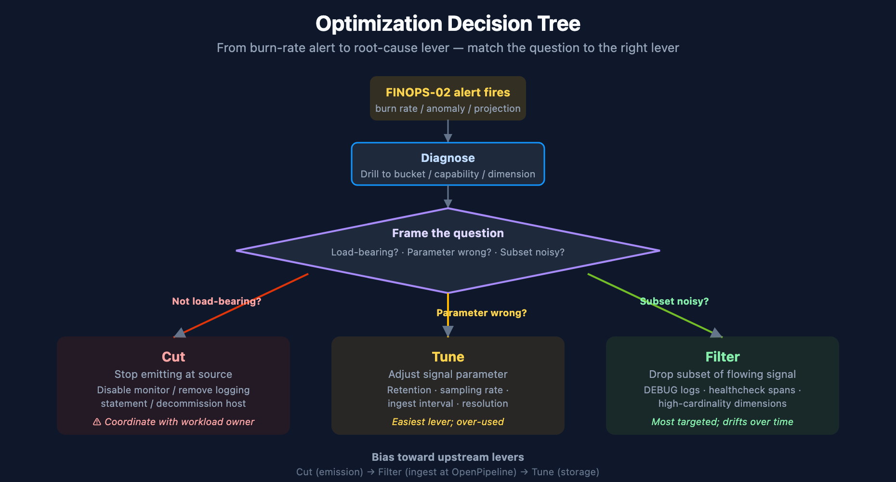
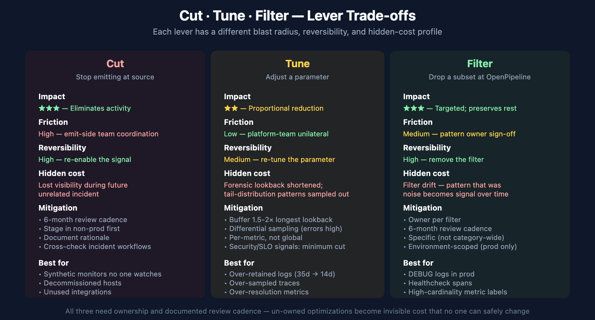

# FINOPS-03: DPS Consumption Optimization — When to Cut, Tune, or Filter

> **Series:** FINOPS — Cost Management & FinOps | **Reference:** 03 — DPS Consumption Optimization — When to Cut, Tune, or Filter | **Created:** May 2026 | **Last Updated:** 05/19/2026

## Overview

FINOPS-01 told you what's being consumed. FINOPS-02 told you when an alert should fire. **FINOPS-03 answers the only question that matters after the alert fires: what do you actually change?**

Most cost-optimization conversations stall because the team treats every reduction option as roughly equivalent — *"let's just sample more,"* or *"let's just shorten retention."* They are not equivalent. Each option has a different blast radius, a different reversibility profile, and a different relationship to the observability the business actually needs. Picking the wrong lever produces savings that erode the value of the platform.

**The framework: three levers — Cut, Tune, Filter.** Cut drops a signal entirely at the source. Tune adjusts a parameter on an otherwise-flowing signal (sample rate, retention period, resolution). Filter drops a *subset* of a flowing signal conditionally (specific severities, specific paths, specific apps). Each lever applies in different situations; mixing them up is the most common failure mode.

**Bias toward upstream levers.** The further upstream a change happens, the cheaper it is and the more reversible. Cut at the source (don't emit) beats Filter at OpenPipeline (don't ingest) beats Tune at storage (ingest cheaply). A flowing log stream that's been DEBUG-filtered at OpenPipeline still cost something to transit; the same stream that never emitted DEBUG didn't.

> **Scope:** Dynatrace SaaS on DPS. The decision framework is platform-agnostic but the implementation handles (OpenPipeline filter syntax, retention configuration, sampling controls) are Dynatrace-specific. Implementation depth lives in cross-referenced series (ORGNZ for buckets and retention; OPLOGS for sampling; OPIPE for non-log pipeline shapes).

---

## Table of Contents

1. [Short Answer](#short-answer)
2. [The Three Levers — Cut / Tune / Filter](#three-levers)
3. [When to Cut](#when-to-cut)
4. [When to Tune](#when-to-tune)
5. [When to Filter](#when-to-filter)
6. [Decision Tree by Data Type](#decision-tree)
7. [Trade-offs and Hidden Costs](#tradeoffs)
8. [Worked Example — Production Log Stream](#wx-logs)
9. [Worked Example — High-Cardinality Metric](#wx-metrics)
10. [Cross-References to Implementation Depth](#cross-refs)
11. [Recommended Approach](#recommendation)
12. [Summary and Next Steps](#summary)

---

## Prerequisites

| Requirement | Details |
|-------------|---------|
| **Familiarity with FINOPS-01** | Understanding of per-capability schema and the `dt.system.events` / `dt.billing.*` surfaces — this entry assumes the *what is being consumed* picture is already in place. |
| **Familiarity with FINOPS-02** | This entry is the *response* layer to the alerts FINOPS-02 sets up. |
| **Audience** | Platform / Observability Lead (primary); Executive / Procurement (TL;DR, §7 trade-offs, §11 recommendation). |
| **Companion series** | ORGNZ (bucket strategy and retention), OPLOGS (OpenPipeline filtering and sampling), OPIPE (OpenPipeline for non-log signals), ADOPT-05 (optimization in the maturity-roadmap context). |
| **Posture** | This is a decision framework, not a tuning recipe. Decisions belong to the team that owns the affected workload; this notebook structures the conversation. |

<a id="short-answer"></a>
## 1. Short Answer

| Lever | What it does | When to reach for it | Reversibility |
|-------|--------------|----------------------|---------------|
| **Cut** | Stop emitting the signal at the source (agent setting, app config, integration disabled) | The signal has no consumer that depends on it; or the cost-of-emission consistently exceeds the value | High — turn the signal back on |
| **Tune** | Keep the signal flowing but adjust a parameter (sample rate, retention, metric resolution) | The signal is useful but at a different fidelity than current; rate / depth can be reduced without losing the workload | Medium — re-tune the parameter |
| **Filter** | Drop a subset of an otherwise-flowing signal at OpenPipeline (or equivalent) | The signal is useful overall but specific subsets are noise (DEBUG logs, healthcheck spans, synthetic-test bots) | High — remove the filter |

**The headline:** match the lever to the question. *"Is this signal still load-bearing?"* → Cut. *"Is the granularity right?"* → Tune. *"Is some-but-not-all of it noise?"* → Filter. Reach for the upstream-most option that solves the problem — emission-time changes are cheaper than ingest-time, which are cheaper than storage-time.

> <sub>**Sources:** Framework is engagement-level synthesis — Dynatrace docs cover the implementation handles (OpenPipeline filters, retention configuration, sampling) but do not present them as a unified three-lever decision framework. **Derived** throughout.</sub>

<a id="three-levers"></a>
## 2. The Three Levers — Cut / Tune / Filter



<!-- MARKDOWN_TABLE_ALTERNATIVE
| Lever | Question that triggers it | What it does |
|-------|---------------------------|---------------|
| Cut | Not load-bearing? | Stop emitting at source — disable monitor, remove logging, decommission host |
| Tune | Parameter wrong? | Adjust signal parameter — retention, sampling rate, ingest interval, resolution |
| Filter | Subset noisy? | Drop subset of flowing signal at OpenPipeline — DEBUG logs, healthcheck spans, high-cardinality dimensions |
Bias toward upstream levers: Cut (emission) → Filter (ingest) → Tune (storage).
-->

Every consumption-reduction option in the Dynatrace platform reduces to one of three patterns. Naming them helps the conversation move past *"reduce cost"* to *"change which signal-emission behavior."*

### Cut

Stop emitting the signal at the source. Examples:

- Disable a synthetic monitor that no one looks at
- Remove a logging statement from application code
- Disable verbose collector exporters
- Disable a Dynatrace integration that no team owns
- Decommission a host that no longer hosts production workload

Cut is the strongest lever — it eliminates the underlying activity, not just its observability. It is also the lever with the most organizational friction, because *someone* originally chose to emit the signal and someone has to confirm it's safe to stop.

### Tune

Keep the signal flowing but adjust a parameter. Examples:

- Reduce log retention from 35 days to 14 days (Logs - Retain)
- Lower trace sampling rate (Traces - Ingest)
- Increase metric ingestion interval (Metrics - Ingest)
- Move a bucket from Retain with Included Queries to standard Retain
- Switch a synthetic monitor from 1-minute to 5-minute frequency

Tune preserves the signal's existence — useful for cases where the signal is load-bearing but at lower fidelity than current. Tune is the lever most often over-used because it requires no organizational conversation: the platform team can lower retention without consulting any application team.

### Filter

Drop a subset of an otherwise-flowing signal, typically at OpenPipeline (logs / events / spans) or at the source SDK (custom metrics).

Examples:

- OpenPipeline pipeline that drops DEBUG / TRACE level logs in production buckets
- Span filter that excludes spans from healthcheck endpoints
- Metric filter that excludes test / synthetic-traffic dimensions
- Log filter that drops noisy known-benign error patterns (e.g., expected 404s on /favicon.ico)

Filter is the most targeted lever — keep the load-bearing subset, drop the noise. It is also the most likely to drift over time: a filter that was correct in 2024 may suppress a signal that became load-bearing in 2026. Filters need ownership and periodic review.

> <sub>**Sources:** [OpenPipeline (DT docs)](https://docs.dynatrace.com/docs/discover-dynatrace/grail/openpipeline), [DPS Hosts (DT docs)](https://docs.dynatrace.com/docs/shortlink/dps-hosts) — synthetic monitor frequency configuration. Examples are illustrative; the underlying mechanisms are documented per-capability. **Derived:** the three-lever taxonomy is engagement-level synthesis.</sub>

<a id="when-to-cut"></a>
## 3. When to Cut

Cut applies when the signal has no consumer that justifies the cost-of-emission. Three diagnostic questions:

### Q1 — Who looks at this signal?

If the answer is "nobody for the last 90 days," the signal is a candidate. The audit pattern: query notebook open events, dashboard queries, and alert configurations that reference the signal. If none exist over a 90-day window, the signal is operationally dark.

**Counter-question:** is the signal a *compliance* requirement (audit logs, security events, regulator-mandated retention)? Compliance retention is not a value question — the signal must exist for the contract / regulation even if no one looks at it. Do not Cut compliance signals; Tune retention to the minimum mandated period instead.

### Q2 — Does any alert / SLO depend on this signal?

If the signal feeds a workflow, an SLO calculation, a Davis problem-detection input, or a Cost Monitor, it is load-bearing in a way that's hard to see by reading logs / dashboards. Cross-check alert configurations before recommending Cut.

### Q3 — Has this signal generated actionable insight in the last incident?

An audit by incident — for the last 5 production incidents, did this signal contribute to detection, diagnosis, or post-mortem? If consistently no, the signal is operationally low-value and Cut is appropriate.

### How to Cut safely

1. **Communicate before disabling.** Find the team that owns the workload emitting the signal, even if they're not the team consuming it. The emit-side team may have a non-obvious dependency.
2. **Stage the Cut.** Disable in a non-production environment first, observe for one week, then promote to production.
3. **Document the Cut.** A short note in the team's runbook on what was disabled, when, and why. If the signal needs to come back, the documentation tells the next operator how.
4. **Set a review date.** Cuts that were correct in 2024 may be wrong in 2026 — schedule a 6-month review of the disabled signals list.

> <sub>**Sources:** **Derived** — Cut is the highest-impact, highest-friction lever; the diagnostic-question framing is engagement practice. Compliance-retention guidance is generic — verify against your specific regulatory framework.</sub>

<a id="when-to-tune"></a>
## 4. When to Tune

Tune applies when the signal is load-bearing but at lower fidelity than the current configuration. Three categories of tuning:

### Retention tuning

The most common Tune. Logs / spans / events stored for 35 days when the use case only references the last 7 days. Workflow:

1. Audit query history: what's the longest lookback that actually fired against this bucket in the last 90 days?
2. Add a buffer — typically 1.5-2× the longest observed lookback.
3. Verify the buffer covers known periodic patterns: month-end batch jobs, quarterly audits, annual cleanups.
4. Apply the new retention; observe for one full periodic cycle (often a month) before declaring success.

Retention tuning is the easiest lever to justify because it has no impact on emission, ingestion, or current investigation — only on historical lookback that wasn't being used anyway. It is the lever to reach for first when in doubt.

### Sampling tuning

For traces especially. Reduce trace-ingest sample rate from 100% (all spans) to a lower rate (e.g., 25% — keep 1 in 4 traces). Workflow:

1. Determine the *statistical* requirement: at what sampling rate do you still detect error patterns reliably? (For most apps with sustained traffic, 10-25% is sufficient.)
2. Use head-based sampling (deterministic per-trace) rather than tail-based when possible — it's simpler and avoids the "sampled out half my errors" surprise.
3. Keep error and exception traces at higher sampling — the platform supports differential sampling.
4. Measure investigation success after one month — can your team still root-cause issues with the new sample rate?

### Resolution tuning

For metrics. Reducing metric ingest interval from 1-second to 1-minute granularity dramatically lowers `data_points` consumption. Workflow:

1. What SLO depends on this metric? If it's a high-criticality SLO (sub-minute MTTD), keep high resolution.
2. Otherwise, 1-minute or even 5-minute resolution is sufficient for trend visibility and most alerts.
3. Apply per-metric, not globally — some metrics warrant high resolution; most do not.

### When NOT to Tune

- **Compliance-mandated retention:** tune *down to the minimum*, not below.
- **Security-investigation logs:** under-sampling here is paid for during the next breach investigation. Sampling decisions on security signals merit security-team sign-off.
- **SLO-feeder metrics:** if the metric is the foundation of an availability SLO, reducing resolution may break the SLO calculation. Verify before tuning.

> <sub>**Sources:** [DPS Log Management (DT docs)](https://docs.dynatrace.com/docs/shortlink/dps-log-management) — retention configuration. [DPS Traces (DT docs)](https://docs.dynatrace.com/docs/shortlink/dps-traces) — sampling. [DPS Metrics (DT docs)](https://docs.dynatrace.com/docs/shortlink/dps-metrics) — ingest interval. **Derived:** the audit-then-tune workflow is engagement practice.</sub>

<a id="when-to-filter"></a>
## 5. When to Filter

Filter applies when the signal is useful overall but specific subsets are noise. The most common filter targets:

### Logs — severity-based filters

DEBUG / TRACE logs in production. The most common, highest-impact filter. OpenPipeline can drop these conditionally based on the source bucket / app / environment.

Implementation: OpenPipeline pipeline with a drop processor matching `loglevel in ("DEBUG", "TRACE")` and a bucket-name predicate (e.g., `usage.bucket startsWith "prod_"`). Full syntax covered in OPLOGS.

**Common mistake:** dropping ALL DEBUG everywhere. Some pre-production environments need DEBUG; some pre-incident-replay scenarios need DEBUG. Filter on environment, not globally.

### Spans — endpoint-based filters

Healthcheck endpoints (`/health`, `/ping`, `/readiness`, `/liveness`) emit one span per check, often every few seconds, and almost never carry diagnostic value. A trace filter that drops these is high-impact, low-risk.

**Common mistake:** dropping spans from any endpoint matching `/health` — some apps have legitimate `/health/<subsystem>` endpoints that are diagnostically valuable. Be specific.

### Logs — pattern-based filters for known-benign noise

Repetitive log lines that are *known to be benign* (e.g., favicon.ico 404s, robots.txt 404s, expected timeout messages from a known-flaky third-party). Drop them; they were never going to be investigated.

**Common mistake:** filtering on broad patterns. *"Drop all 404s"* hides the day a real customer flow starts 404-ing. Filter on the specific path or message pattern, not the category.

### Metrics — high-cardinality dimension filters

Custom metrics emitted with a high-cardinality dimension (user.id, request.id, span.id as a label) produce one time series per unique value, exploding `data_points` cost. Filter the dimension at the SDK or at ingest — keep the metric, drop the high-cardinality label.

**Common mistake:** assuming the dimension is the data. Often, the metric is useful at aggregate (counts per minute) and the dimension was added for debug-style exploration. Confirm before dropping the dimension.

### When to Filter vs Tune

Filter targets a *known-noisy subset*. Tune adjusts a *parameter applied to everything*. If the noise is concentrated in a subset you can name ("DEBUG logs in prod," "healthcheck spans," "synthetic-traffic dimension on app metric X"), Filter. If the noise is *diffuse* ("all our traces are too detailed for the value they provide"), Tune the sample rate.

### Filter ownership and review

Filters drift. A filter rule that was correct in 2024 may suppress a signal that became load-bearing in 2026. Every filter needs:

- An owner (the team responsible for the filtered signal)
- A rationale (what makes the filtered subset noise)
- A review date (6-12 months)

Filters without owners become invisible cost optimization that no one can safely change.

> <sub>**Sources:** [OpenPipeline (DT docs)](https://docs.dynatrace.com/docs/discover-dynatrace/grail/openpipeline), [OPLOGS topic series](../../oplogs/) — full filter-syntax depth. **Derived:** the filter-vs-tune distinction and the ownership-and-review pattern are engagement practice.</sub>

<a id="decision-tree"></a>
## 6. Decision Tree by Data Type

A working version of the framework for each major data type:

### Logs

1. **Cut first?** Is the log-emitting application code still relevant? If a service emits logs no one reads and the service itself is on a deprecation path, Cut at the application.
2. **Filter next?** Are DEBUG / TRACE logs being emitted in production? Filter at OpenPipeline. Are known-benign patterns repeating (favicon 404s, etc.)? Filter pattern-by-pattern.
3. **Tune last?** Adjust retention per bucket based on actual lookback patterns. Move buckets between Retain and Retain-with-Included-Queries tiers based on query frequency.

### Traces

1. **Cut first?** Is the service still in active use? If not, OneAgent / OTel SDK can be disabled for the service entirely.
2. **Filter next?** Are healthcheck spans dominating volume? Filter them at the OpenPipeline pipeline. Are synthetic-test traces inflating ingest? Filter them.
3. **Tune last?** Reduce overall sample rate, keeping error traces at higher rate (differential sampling).

### Metrics

1. **Cut first?** Is the custom metric still in use? Audit Notebooks, Dashboards, and alerts.
2. **Filter next?** Are high-cardinality dimensions inflating data_points without value? Drop the dimension at the SDK.
3. **Tune last?** Reduce ingest interval for non-SLO-feeder metrics from 10s to 1min.

### Synthetic monitors

1. **Cut first?** Is anyone watching this monitor? Disable monitors no one has touched in 90 days.
2. **Tune next?** Reduce frequency (5min → 15min) for monitors that don't feed sub-15-minute SLOs.
3. **Filter** — N/A for synthetic; synthetic actions are atomic, no subset to filter.

### Host monitoring (Full-Stack / Infrastructure)

1. **Cut first?** Decommission hosts that no longer host workload. Downgrade Full-Stack to Infrastructure for hosts that don't need code-level visibility.
2. **Tune** — no granularity dial for host monitoring; the lever is monitoring mode (Full-Stack / Infrastructure / Foundation).
3. **Filter** — N/A; host monitoring is per-host billed.

### Automation Workflows

1. **Cut first?** Is anyone using this workflow? Workflows that haven't run in 90 days are candidates.
2. **Tune next?** Reduce scheduled-trigger frequency. Workflows scheduled hourly that could be daily are often a quick win.
3. **Filter** — workflow filtering is at the trigger condition (only fire if X), which is an action-level filter.

> <sub>**Sources:** Decision tree is **Derived** — synthesizes the lever framework with per-capability semantics documented across the [DPS docs](https://docs.dynatrace.com/docs/license). Verify per-data-type recommendations against your tenant's actual usage patterns before applying.</sub>

<a id="tradeoffs"></a>
## 7. Trade-offs and Hidden Costs



<!-- MARKDOWN_TABLE_ALTERNATIVE
| Lever | Impact | Friction | Reversibility | Hidden cost | Mitigation |
|-------|--------|----------|---------------|-------------|------------|
| Cut | ★★★ Eliminates activity | High (emit-side coordination) | High (re-enable) | Lost visibility during future unrelated incident | 6-month review, stage in non-prod, document rationale |
| Tune | ★★ Proportional reduction | Low (platform-team unilateral) | Medium (re-tune) | Forensic lookback shortened; tail-distribution sampled out | Buffer 1.5-2× longest lookback, differential sampling, per-metric not global |
| Filter | ★★★ Targeted; preserves rest | Medium (pattern owner sign-off) | High (remove filter) | Filter drift — noise becomes signal over time | Owner per filter, 6-month review, specific not category-wide, env-scoped |
-->

| Lever | Visible benefit | Hidden cost | Mitigation |
|-------|-----------------|-------------|------------|
| **Cut** | Largest cost reduction; eliminates underlying activity | Lost visibility may surface during an unrelated future incident — "I wish we still had X" | 6-month review cadence; documented Cut rationale; non-prod staging before prod |
| **Tune (retention)** | Easy to apply; no emit-side coordination | Forensic / audit lookback becomes shorter — the next breach investigation may exceed the new retention window | Audit longest *historical* lookback used; buffer 1.5-2×; coordinate with security on logs of audit interest |
| **Tune (sampling)** | Reduces trace volume proportionally | Tail-of-distribution patterns (rare errors, edge-case latency) may sample out | Keep error / exception traces at higher rate (differential sampling); review investigation-success metrics after first month |
| **Tune (resolution)** | Reduces metric data_points | SLO calculations with sub-resolution sensitivity may break or become noisy | Per-metric, not global; preserve high resolution for SLO-feeder metrics |
| **Filter (severity)** | Drops known-noisy log volume | A real DEBUG-level diagnostic might be needed during a future deep-investigation | Filter on environment (prod only), not globally; keep DEBUG flowing in pre-prod |
| **Filter (endpoint)** | Drops healthcheck-span volume | If a healthcheck endpoint starts misbehaving, the noise *was* the signal | Filter on specific paths, not patterns; monitor health endpoints at the underlying-app layer instead |
| **Filter (pattern)** | Drops known-benign error patterns | The known-benign pattern may shift to known-malign without a clear signal | Pattern-specific, not category-wide; document the rationale per filter |
| **Filter (cardinality)** | Reduces metric series explosion | The cardinality may have been load-bearing for a specific debug workflow | Confirm with the team that added the high-cardinality dimension; preserve the dimension on a subset if needed |

### The category of trade-off that hurts most

**Coverage gaps surface at the worst moment.** A Cut to a synthetic monitor that no one watches is fine — until the day the corresponding service has a real outage and the absent monitor would have caught it 20 minutes earlier. The cost-savings math from optimization usually understates this risk by treating signals as if their value were proportional to their use-frequency. In practice, signal value follows a power-law distribution — most signals are operationally dark most of the time and load-bearing during specific incidents.

**Mitigation:** never optimize a signal that participates in incident-response workflows without explicit incident-team sign-off. *"Did the last 3 incidents reference this signal?"* is a better question than *"is anyone querying this dashboard regularly?"*

> <sub>**Sources:** **Derived** + **Softened** — the trade-off framing is engagement-level guidance. Power-law signal value distribution is community-asserted; specific numeric distribution depends heavily on workload and incident patterns — verify in your own environment.</sub>

<a id="wx-logs"></a>
## 8. Worked Example — Production Log Stream

**Scenario:** The FINOPS-02 weekly burn-rate alert fires on Monday morning. The `payments-prod` bucket grew 60% week-over-week. The platform team wants to act before the next Cost Monitor anomaly.

### Step 1 — Diagnose

Run the FINOPS-01 §6 query to confirm the bucket-level numbers. Then drill in:

```dql
// Diagnose the spike — payments-prod log volume by loglevel over the last 7 days
fetch logs, from:-7d
| filter dt.system.bucket == "payments-prod"
| summarize { record_count = count() }, by:{ loglevel }
| sort record_count desc
```

Suppose the result shows DEBUG = 14M records, INFO = 800K, WARN = 50K, ERROR = 5K. DEBUG is overwhelmingly dominant.

### Step 2 — Frame the levers

- **Cut?** The payments service is in active use — its logs are load-bearing. Cut is not the right lever.
- **Tune?** Retention is already 14 days. Lowering retention won't help the ingest spike.
- **Filter?** DEBUG logs in production are the canonical Filter target. The application team may have left a feature-flag DEBUG enabled in a recent deploy, or DEBUG is on permanently and shouldn't be.

**Filter is the right lever.** Specifically, an OpenPipeline pipeline that drops `loglevel == "DEBUG"` from the `payments-prod` bucket.

### Step 3 — Coordinate before filtering

Ping the payments team before adding the filter. Two outcomes possible:

1. **Team confirms DEBUG should not be on in prod:** they fix the application config; the ingest returns to baseline; no filter needed. (Best outcome — root-cause fix.)
2. **Team explains DEBUG was intentionally enabled for an ongoing investigation:** add the filter with a time-boxed expiry (e.g., 30 days), and notify the team when the filter is removed.

### Step 4 — Implement (after coordination)

Implementation depth lives in OPLOGS. The filter spec at the framework level:

- Source: `payments-prod` bucket
- Condition: `loglevel in ("DEBUG", "TRACE")`
- Action: drop
- Owner: platform team (with payments team as informed party)
- Review: 6 months

### Step 5 — Verify and measure

After deploying the filter, the FINOPS-02 daily burn-rate alert should show the bucket returning to baseline within 24-48 hours. If it doesn't, the spike has a different root cause (volume from non-DEBUG levels) and the framework loops back to Step 1 with a sharper question.

> <sub>**Sources:** [OpenPipeline (DT docs)](https://docs.dynatrace.com/docs/discover-dynatrace/grail/openpipeline). **Derived:** the diagnose → frame → coordinate → implement → verify loop is engagement practice; verify against your team's actual change-management process.</sub>

<a id="wx-metrics"></a>
## 9. Worked Example — High-Cardinality Metric

**Scenario:** Metrics-Ingest billable usage is climbing. The FINOPS-01 §6 per-bucket query identifies `default_metrics` as the dominant bucket, and a deeper drill shows `monitoring_source == "other"` (custom metrics) dominating. One specific custom metric, `app.request.processed`, is contributing 70% of the volume.

### Step 1 — Diagnose the cardinality

Query the metric's dimensions to find the high-cardinality one:

```dql
// Find unique dimension values per dimension on a metric — cardinality audit
fetch metric.series, from:-1d
| filter metric.key == "app.request.processed"
| describe
// describe returns one row per dimension with the unique-value count;
// look for dimensions with cardinality in the thousands or millions
```

Suppose the result shows: `app.name` (12 values), `endpoint` (47 values), `request.id` (8.4M values). `request.id` is the runaway dimension — every request creates a new time series.

### Step 2 — Frame the levers

- **Cut?** The metric itself (`app.request.processed`) is useful — it's the count of processed requests. Cut would lose load-bearing data.
- **Tune?** Lowering ingest interval helps proportionally but doesn't address the cardinality root cause.
- **Filter?** Drop the `request.id` dimension at the SDK or at ingest. The metric remains; the cardinality explosion stops.

**Filter is the right lever.** Specifically, remove the `request.id` label from the metric emission.

### Step 3 — Coordinate before changing

`request.id` was added for some reason. The application team may have used it for per-request debugging via traces or logs (where high cardinality is appropriate). If yes — confirm the use case is satisfied via spans / logs, not metrics. If no — the label can be removed.

### Step 4 — Implement

Implementation lives in the application's metric-emission code (OneAgent SDK, OpenTelemetry SDK, etc.). The framework-level spec:

- Source: application emitting `app.request.processed`
- Change: remove `request.id` label
- Owner: app team
- Review: not needed — root-cause fix

### Step 5 — Verify

After the app team deploys the change, the metric's cardinality should drop to the cross-product of remaining dimensions (`app.name` × `endpoint` = ~564 series instead of 8.4M+). Billable data_points should drop accordingly.

### The pattern

High-cardinality metrics are a frequent cost driver and almost always have the same root cause: a label that should be a span attribute or log field, not a metric dimension. The fix is structural — emit it as a span attribute (where high cardinality is fine) and remove it from the metric.

> <sub>**Sources:** [DPS Metrics (DT docs)](https://docs.dynatrace.com/docs/shortlink/dps-metrics) — cardinality semantics. [OpenTelemetry semantic conventions](https://opentelemetry.io/docs/specs/semconv/) — guidance on what belongs in metric dimensions vs span attributes. **Derived:** the "label that should be a span attribute" framing is engagement guidance grounded in OpenTelemetry conventions.</sub>

<a id="cross-refs"></a>
## 10. Cross-References to Implementation Depth

This entry is the *framework* — it answers *which lever, when, why*. The implementation depth (how to write the OpenPipeline filter, how to configure retention per bucket, how to tune sample rate) lives in adjacent series:

| For depth on... | See |
|------------------|-----|
| Bucket strategy and retention configuration | **ORGNZ** topic series |
| OpenPipeline filter syntax for logs | **OPLOGS** topic series |
| OpenPipeline for non-log signals (spans, metrics, events) | **OPIPE** topic series |
| Trace sampling configuration | **SPANS** topic series |
| Custom metric emission with OneAgent SDK or OpenTelemetry | **OTEL** topic series |
| Synthetic monitor configuration and frequency tuning | **SYNTH** topic series |
| Optimization in the maturity-roadmap context | **ADOPT-05** notebook |
| `dt.cost.costcenter` / `dt.cost.product` label setup at ingest | **FAQ-02** (tagging sources, standards, strategy) |

This entry is intentionally shallow on syntax — the goal is to structure the decision before the team reaches for the implementation depth in the adjacent series. Reach for the right *lever* first; then read the adjacent series for the *handle*.

> <sub>**Sources:** Cross-reference targets are the project's existing topic series. Implementation depth is owned in those series, not duplicated here.</sub>

<a id="recommendation"></a>
## 11. Recommended Approach

A repeatable workflow for using the three-lever framework when an alert (FINOPS-02) fires:

1. **Diagnose at the bucket / capability / dimension level.** Use the FINOPS-01 §6-§10 queries to pinpoint *where* the consumption is. "Logs are up" is not enough — *which bucket, which loglevel, which app*.
2. **Frame the lever before reaching for syntax.** Ask the three diagnostic questions: is this signal load-bearing (Cut?), is the parameter wrong (Tune?), is a subset noisy (Filter?). Pick one lever; reaching for two at once muddies the diagnosis.
3. **Reach for the upstream-most lever that solves the problem.** Cut at source > Filter at OpenPipeline > Tune at storage. Each step downstream is cheaper to implement but moves further from the root cause.
4. **Coordinate before implementing.** The team that owns the workload should be informed (Cut, Filter) or consulted (Tune on their signal). Cost optimization done unilaterally erodes trust faster than it saves money.
5. **Implement, verify, document.** The FINOPS-02 burn-rate alert is also the verification mechanism — if the change worked, the alert should clear within 24-48 hours. Document the change with owner, rationale, review date.
6. **Set the review cadence.** Every Cut and every Filter should have a documented review date (6 months default). Reviews catch the case where the optimization was correct at the time and isn't anymore.
7. **Resist the urge to combine optimizations across teams in one change.** One team, one lever, one change at a time. Bundled cost reductions become un-debuggable when something breaks.

<a id="summary"></a>
## 12. Summary

Every DPS consumption-reduction option reduces to one of three levers: Cut (stop emitting), Tune (adjust a parameter), or Filter (drop a subset). Match the lever to the question — *is the signal load-bearing*, *is the parameter wrong*, *is a subset noisy*. Bias toward upstream levers — emission-time changes beat ingest-time changes beat storage-time changes. Coordinate before changing; document with owner, rationale, and review date. The cost savings that hurt most are the ones that surface six months later during an incident, because someone optimized a signal that turned out to be load-bearing — mitigate by treating signals that participate in incident response as off-limits without incident-team sign-off.

## Next Steps

- Read **FINOPS-01** if you skipped it — the *what is being consumed* picture is the diagnostic foundation for the levers in this entry.
- Read **FINOPS-02** for the alert-and-forecast layer that signals *when* a lever needs to be reached for.
- Read **ORGNZ** for bucket strategy and retention configuration — the structural decisions that make Tune effective.
- Read **OPLOGS** for log-pipeline filter syntax — the implementation depth for the Filter lever on logs.
- Read **OPIPE** for OpenPipeline beyond logs — Filter implementations for spans, metrics, and events.
- Audit your tenant's most-expensive bucket against the §8 worked example. Apply the diagnose → frame → coordinate → implement → verify loop once; build the muscle.

---

<sub>*This notebook was AI-generated from community-submitted and publicly available sources. This notebook series is not officially supported by Dynatrace. Always verify information against official [Dynatrace documentation](https://docs.dynatrace.com/docs).*</sub>
