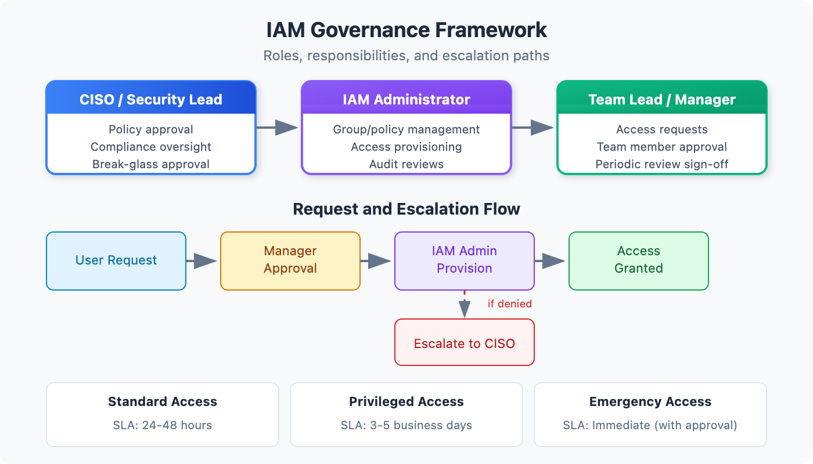

# IAM-01: IAM Governance Foundations

> **Series:** IAM — IAM Administration | **Notebook:** 1 of 10 | **Created:** January 2026 | **Last Updated:** 04/04/2026

## Building a Strong Foundation for Identity Management
Effective IAM governance is the cornerstone of enterprise security. This notebook establishes the framework for managing identities, groups, policies, and access controls in Dynatrace's Gen3 IAM system.

> **Migrating from Management Zones?** If you have existing Management Zones and need to migrate them to Gen3 Policies and Boundaries, see the **MZ2POL** series instead. This series is for greenfield IAM governance.

---

## Table of Contents

1. [The ABAC Model](#the-abac-model)
2. [Governance Roles and Responsibilities](#governance-roles-and-responsibilities)
3. [Account vs Environment Permissions](#account-vs-environment-permissions)
4. [Centralized vs Federated Models](#centralized-vs-federated-models)
5. [Documentation and Change Management](#documentation-and-change-management)
6. [Governance Assessment](#governance-assessment)

---

## Prerequisites

| Requirement | Details |
|-------------|----------|
| **Dynatrace Environment** | SaaS with Gen3 IAM enabled |
| **Permissions** | Account Administrator or IAM Administrator |
| **Knowledge** | Basic understanding of identity concepts |

## 1. Gen3 IAM Overview

Dynatrace Gen3 IAM replaces the legacy Management Zone-based access control with a modern **Attribute-Based Access Control (ABAC)** model. This provides fine-grained, scalable access management for enterprises.

### Key Components

| Component | Purpose | Scope |
|-----------|---------|-------|
| **Policies** | Define what actions users can perform | Account or Environment |
| **Boundaries** | Filter which entities users can see | Environment |
| **Buckets** | Physically partition data for team isolation | Environment |
| **Segments** | Reusable DQL-based data filters | Environment |
| **Groups** | Collections of users with shared access | Account |
| **Users** | Individual identities (local or federated) | Account |

### Data Partitioning Options

Choose the right isolation mechanism for your needs:

| Mechanism | Isolation Type | Reversible | Best For |
|-----------|---------------|------------|----------|
| **Buckets** | Physical separation | ❌ No | Strict team isolation, compliance |
| **Boundaries** | Query-time filtering | ✅ Yes | Flexible access scoping |
| **Segments** | Query-time filtering | ✅ Yes | Ad-hoc data views |

> **⚠️ Key Decision:** If you need **hard data isolation** between teams (e.g., Team A can never see Team B's data), use **Buckets**. If you need flexible, changeable access controls, use **Boundaries**.

### Why Gen3?

The Gen3 model provides several advantages over legacy Management Zones:

- **Scalability**: Policies and boundaries scale to thousands of entities
- **Flexibility**: Attribute-based rules adapt as your environment changes
- **Separation of Concerns**: Policies (actions) separate from boundaries (visibility)
- **Grail Integration**: Native support for Grail data lakehouse permissions
- **Bucket Partitioning**: Physical data isolation for compliance and team separation

> **Note:** If you're migrating from Management Zones, see the **MZ2POL** series for migration guidance. This series assumes you're using Gen3 IAM.

<a id="the-abac-model"></a>
## 2. The ABAC Model
Attribute-Based Access Control (ABAC) evaluates access requests based on attributes rather than static role assignments.


<!-- MARKDOWN_TABLE_ALTERNATIVE
| Layer | Component | Function |
|-------|-----------|----------|
| Identity | Users, Groups | Who is requesting access |
| Policy | Permissions | What actions are allowed |
| Boundary | Conditions | Which entities are visible |
| Data | Segments | How data is filtered |
-->

### How Access is Evaluated

When a user attempts an action, Dynatrace evaluates:

1. **Identity**: Who is the user? What groups do they belong to?
2. **Policy**: Does any assigned policy grant this action?
3. **Boundary**: Is the target entity within their boundary conditions?
4. **Segment**: Does the data match their segment filters?

Access is granted only if ALL conditions are satisfied.

### Policy Statement Structure

```
ALLOW <service>:<resource>:<action> [WHERE <condition>]
```

Example:
```
ALLOW storage:logs:read WHERE storage:dt.security_context = "team-a"
```

### Three Permission Domains

| Domain | Controls | Examples |
|--------|----------|----------|
| **Environment** | Smartscape entities (hosts, services) | View hosts, see topology |
| **Storage** | Grail data (logs, spans, metrics) | Read logs, query spans |
| **Settings** | Configuration objects | Edit alerting rules |

<a id="governance-roles-and-responsibilities"></a>
## 3. Governance Roles and Responsibilities
Effective IAM governance requires clear ownership and accountability. Define these roles within your organization.

### Core IAM Roles

| Role | Responsibilities | Typical Team |
|------|------------------|---------------|
| **Account Administrator** | Manage account-level settings, billing, environments | Platform Team |
| **IAM Administrator** | Manage groups, policies, boundaries, user access | Security/IAM Team |
| **Environment Administrator** | Manage environment-specific settings and integrations | Platform Team |
| **Security Auditor** | Review access logs, compliance reporting | Security/Compliance |
| **Group Owner** | Manage membership of specific groups | Application Teams |

### Separation of Duties

Implement checks and balances:

| Action | Primary | Approver |
|--------|---------|----------|
| Create new policy | IAM Admin | Security Lead |
| Add user to admin group | IAM Admin | Account Admin |
| Modify boundaries | IAM Admin | Environment Owner |
| Create service account | IAM Admin | Application Owner |

### RACI Matrix for IAM Operations

| Activity | Account Admin | IAM Admin | Env Admin | Auditor |
|----------|---------------|-----------|-----------|----------|
| Policy creation | A | R | C | I |
| Group management | I | R | C | I |
| Access reviews | A | R | C | R |
| Compliance reporting | I | C | I | R |
| Break-glass procedures | R | R | I | I |

*R=Responsible, A=Accountable, C=Consulted, I=Informed*

<a id="account-vs-environment-permissions"></a>
## 4. Account vs Environment Permissions
Understanding the two-tier permission model is critical for proper governance.

### Account Level

Account-level permissions apply across ALL environments:

| Permission | Grants |
|------------|--------|
| `account-viewer` | View account settings, environments |
| `account-editor` | Modify account settings |
| `account-iam-admin` | Manage users, groups, account policies |
| `environment-creator` | Create new environments |

### Environment Level

Environment-level permissions scope to a single environment:

| Permission | Grants |
|------------|--------|
| `environment-viewer` | Read-only access to environment data |
| `environment-editor` | Modify environment configurations |
| `environment-admin` | Full environment control |
| Custom policies | Fine-grained access per your design |

### Best Practice: Least Privilege

```
Account Level → Minimal, highly restricted
Environment Level → Scoped to team/function need
```

**Example Structure:**

| User Type | Account Permission | Environment Permission |
|-----------|-------------------|------------------------|
| Platform Admin | account-iam-admin | environment-admin (all) |
| App Team Lead | account-viewer | environment-editor (their env) |
| Developer | None | Custom policy (read + limited write) |
| Auditor | account-viewer | environment-viewer (all) |

<a id="centralized-vs-federated-models"></a>
## 5. Centralized vs Federated Models
Choose the governance model that fits your organization's structure.

### Centralized Model

A single team controls all IAM operations.

**Characteristics:**
- Central IAM team manages all policies, groups, boundaries
- Consistent standards across the organization
- Single point of control and audit

**Best For:**
- Regulated industries (finance, healthcare)
- Organizations requiring strict compliance
- Smaller deployments (< 500 users)

**Implementation:**
```
Central IAM Team → All policy/group/boundary management
App Teams → Request access via tickets
```

### Federated Model

Distributed ownership with central oversight.

**Characteristics:**
- Business units manage their own groups/boundaries
- Central team sets standards and audits
- Faster response to team needs

**Best For:**
- Large enterprises with autonomous teams
- Organizations with diverse tech stacks
- DevOps/platform engineering models

**Implementation:**
```
Central IAM Team → Policies, standards, audit
Group Owners → Group membership management
Environment Owners → Environment-specific boundaries
```

### Hybrid Model

Most enterprises adopt a hybrid approach:

| Area | Ownership |
|------|------------|
| Account-level policies | Central IAM team |
| Environment policies | Central IAM team |
| Group membership | Delegated to group owners |
| Boundary definitions | Collaborative (central + env owners) |

<a id="documentation-and-change-management"></a>
## 6. Documentation and Change Management
Governance requires documentation and controlled changes.

### Required Documentation

| Document | Content | Review Frequency |
|----------|---------|------------------|
| **Access Policy** | Who can access what | Annual |
| **Group Catalog** | All groups, owners, purposes | Quarterly |
| **Policy Inventory** | All policies with descriptions | Quarterly |
| **Boundary Definitions** | Boundary rules and rationale | Quarterly |
| **Onboarding Guide** | New user access process | As needed |
| **Offboarding Checklist** | Access revocation steps | As needed |

### Change Management Process

All IAM changes should follow a controlled process:

1. **Request**: Ticket with business justification
2. **Review**: IAM admin reviews against policy
3. **Approval**: Required approver signs off
4. **Implementation**: Change made with audit trail
5. **Verification**: Requestor confirms access works
6. **Documentation**: Update catalogs/inventories

### GitOps for IAM

Consider version-controlling your IAM configuration:

```yaml
# policies/team-a-readonly.yaml
name: team-a-readonly
description: Read-only access for Team A
statements:
  - effect: ALLOW
    service: storage
    resource: logs
    action: read
    conditions:
      - storage:dt.security_context = "team-a"
```

Benefits:
- Full audit trail via git history
- Peer review before changes
- Rollback capability
- Documentation as code

See **AUTOM-03: Monaco** for configuration-as-code implementation.

<a id="governance-assessment"></a>
## 7. Governance Assessment
Use these queries to assess your current IAM governance posture.

```dql
// Count entities by security context - see how data is partitioned
fetch dt.entity.service
| summarize 
    total = count(),
    withContext = countIf(isNotNull(dt.security_context)),
    missingContext = countIf(isNull(dt.security_context))
| fieldsAdd coveragePercent = round(100.0 * withContext / total, decimals: 2)

// Alternative: Smartscape on Grail (entity.name → name)
// smartscapeNodes SERVICE
// | summarize
// total = count(),
// withContext = countIf(isNotNull(dt.security_context)),
// missingContext = countIf(isNull(dt.security_context))
// | fieldsAdd coveragePercent = round(100.0 * withContext / total, decimals: 2)

```

```dql
// List services without security context (governance gaps)
fetch dt.entity.service
| filter isNull(dt.security_context)
| fields entity.name, tags
| sort entity.name
| limit 50
```

```dql
// Review security context distribution
fetch dt.entity.service
| filter isNotNull(dt.security_context)
| summarize serviceCount = count(), by:{dt.security_context}
| sort serviceCount desc
| limit 20
```

```dql
// Check host security context coverage
fetch dt.entity.host
| summarize 
    total = count(),
    withContext = countIf(isNotNull(dt.security_context)),
    missingContext = countIf(isNull(dt.security_context))
| fieldsAdd coveragePercent = round(100.0 * withContext / total, decimals: 2)

// Alternative: Smartscape on Grail (entity.name → name)
// smartscapeNodes HOST
// | summarize
// total = count(),
// withContext = countIf(isNotNull(dt.security_context)),
// missingContext = countIf(isNull(dt.security_context))
// | fieldsAdd coveragePercent = round(100.0 * withContext / total, decimals: 2)

```

### Interpreting Results

| Metric | Target | Action if Below |
|--------|--------|------------------|
| Security context coverage | > 95% | Review tagging strategy |
| Orphaned entities | < 5% | Assign ownership |
| Context distribution | Balanced | Review boundary design |

## 8. Next Steps

With governance foundations in place, proceed to implement the specific components:

### Recommended Path

1. **IAM-02: SSO and Authentication** - Configure SSO before users and groups
2. **IAM-03: Group Architecture and Design** - Design your group hierarchy
3. **IAM-04: Policy Authoring and Management** - Create custom policies
4. **IAM-05: Boundary Design Patterns** - Implement data boundaries

### Bonus Workshop

> **IAM-11: Policy Persona Workshop** — A hands-on exercise for mapping organizational roles to Dynatrace IAM policies using persona-based design. Recommended after completing the core series.

### Governance Checklist

Before moving on, ensure you have:

- [ ] Identified IAM roles and owners in your organization
- [ ] Chosen centralized, federated, or hybrid model
- [ ] Documented your access policy framework
- [ ] Established a change management process
- [ ] Assessed current security context coverage

---

## Summary

In this notebook, you learned:

- The Gen3 IAM model and its components (policies, boundaries, segments)
- How ABAC evaluates access requests
- Core governance roles and their responsibilities
- The difference between account and environment permissions
- Centralized vs federated governance models
- Documentation and change management requirements

---

## References

- [IAM Overview](https://docs.dynatrace.com/docs/manage/identity-access-management)
- [Manage User Permissions with Policies](https://docs.dynatrace.com/docs/manage/identity-access-management/permission-management/manage-user-permissions-policies)
- [Account Management](https://docs.dynatrace.com/docs/manage/identity-access-management/account-management)

---

<sub>*This notebook was AI-generated from community-submitted and publicly available sources. This notebook series is not officially supported by Dynatrace. Always verify information against official Dynatrace documentation.*</sub>
