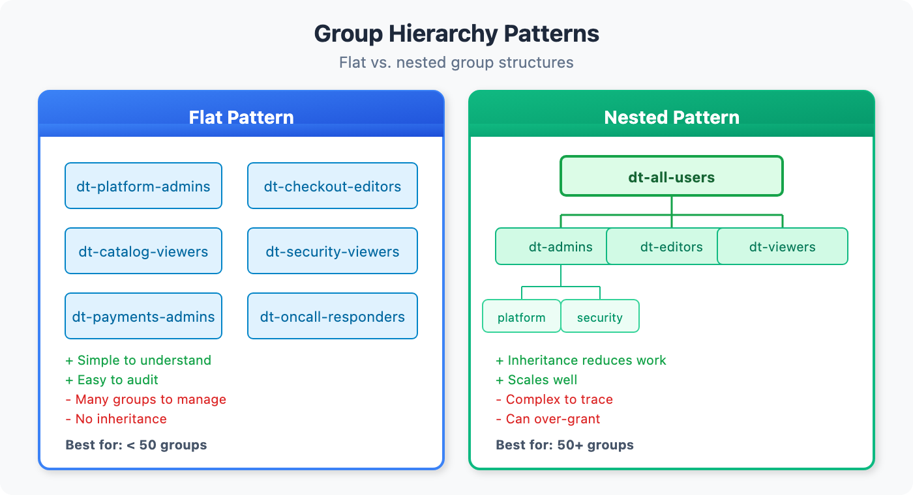
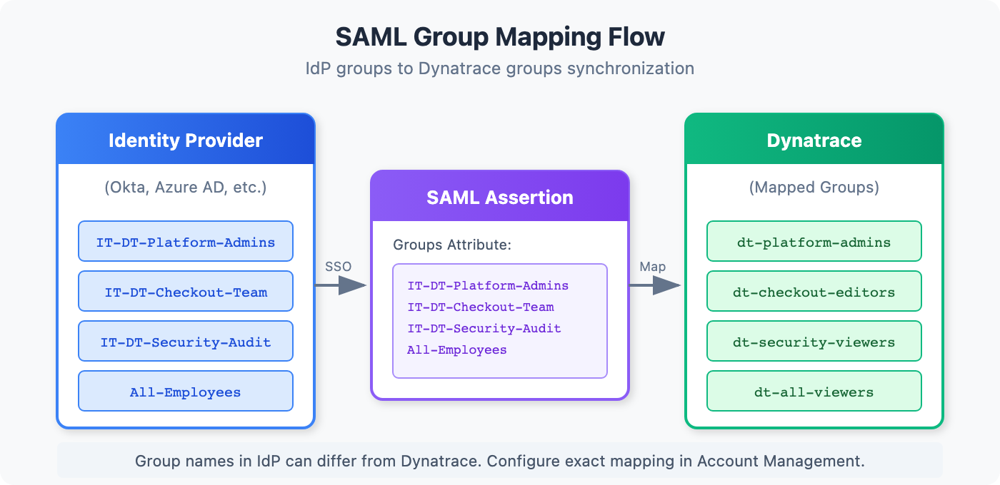

# IAM-03: Group Architecture and Design

> **Series:** IAM — IAM Administration | **Notebook:** 3 of 12 | **Created:** January 2026 | **Last Updated:** 04/25/2026

## Designing Scalable Group Structures
Groups are the foundation of access management. A well-designed group architecture simplifies administration, improves security, and scales with your organization.

---

## Table of Contents

1. [Group Fundamentals](#group-fundamentals)
2. [Group Hierarchy Patterns](#group-hierarchy-patterns)
3. [Naming Conventions](#naming-conventions)
4. [SAML Group Mapping](#saml-group-mapping)
5. [Group Lifecycle Management](#group-lifecycle-management)
6. [Separation of Duties](#separation-of-duties)
7. [Cross-Environment Patterns](#cross-environment-patterns)
8. [Group Assessment Queries](#group-assessment-queries)

---

## Prerequisites

| Requirement | Details |
|-------------|----------|
| **Dynatrace Environment** | SaaS with Gen3 IAM enabled |
| **Permissions** | `account-iam-admin` or group management rights |
| **Prior Knowledge** | **IAM-01** and **IAM-02** (SSO configured) |

<a id="group-fundamentals"></a>
## 1. Group Fundamentals
Groups in Dynatrace Gen3 IAM are collections of users that share access permissions. Groups exist at the **account level** and can be assigned to one or more environments.

### Group Properties

| Property | Description | Required |
|----------|-------------|----------|
| **Name** | Unique identifier for the group | Yes |
| **Description** | Purpose and ownership information | Recommended |
| **Owner** | Person responsible for membership | Recommended |
| **Federated ID** | SAML group mapping (if SSO) | Optional |

### What Groups Control

Groups are assigned:
- **Account-level policies** (apply to all environments)
- **Environment-level policies** (scoped to specific environments)
- **Boundaries** (what entities they can see)

### Group vs User Assignment

| Approach | Use When | Maintenance |
|----------|----------|-------------|
| Group-based | Standard case for all users | Low - manage membership only |
| Direct user | Break-glass, temporary access | High - track individual grants |

> **Best Practice:** Always prefer group-based access. Direct user assignment should be rare and time-limited.

<a id="group-hierarchy-patterns"></a>
## 2. Group Hierarchy Patterns
Choose a structure that matches your organization and scales appropriately.


<!-- MARKDOWN_TABLE_ALTERNATIVE
| Pattern | Structure | Best For |
|---------|-----------|----------|
| Flat | All groups at same level | Small orgs (< 50 groups) |
| Role-Based | Groups by function (viewers, editors, admins) | Simple permission models |
| Team-Based | Groups by team/app ownership | DevOps models |
| Matrix | Role x Team combinations | Large enterprises |
-->

### Pattern 1: Flat Structure

All groups exist at the same level with no hierarchy.

```
Groups:
├── platform-admins
├── platform-viewers
├── team-a-users
├── team-b-users
└── auditors
```

**Pros:** Simple, easy to understand  
**Cons:** Doesn't scale, no inheritance

### Pattern 2: Role-Based

Groups organized by function/role.

```
Groups:
├── dt-admins              (full access)
├── dt-editors             (read + write)
├── dt-viewers             (read only)
└── dt-auditors            (compliance access)
```

**Pros:** Clear permission levels  
**Cons:** Limited data segregation

### Pattern 3: Team-Based

Groups organized by team ownership.

```
Groups:
├── checkout-team          (checkout service owners)
├── payments-team          (payments service owners)
├── platform-team          (infrastructure owners)
└── sre-oncall             (incident response)
```

**Pros:** Maps to ownership model  
**Cons:** Permission levels mixed within groups

### Pattern 4: Matrix (Recommended for Enterprise)

Combines role and team dimensions.

```
Groups:
├── checkout-admins        (checkout team, admin access)
├── checkout-editors       (checkout team, edit access)
├── checkout-viewers       (checkout team, view access)
├── payments-admins
├── payments-editors
├── payments-viewers
├── platform-admins        (cross-cutting admin)
└── all-viewers            (everyone, read-only)
```

**Pros:** Fine-grained control, scales well  
**Cons:** More groups to manage

### Choosing a Pattern

| Organization Size | Recommended Pattern |
|-------------------|---------------------|
| < 50 users | Flat or Role-Based |
| 50-500 users | Team-Based or Matrix |
| > 500 users | Matrix |

<a id="naming-conventions"></a>
## 3. Naming Conventions
Consistent naming makes groups discoverable and self-documenting.

### Recommended Format

```
<scope>-<team/domain>-<role>
```

**Examples:**

| Group Name | Scope | Team | Role |
|------------|-------|------|------|
| `dt-checkout-admins` | Dynatrace | Checkout | Admin |
| `dt-payments-viewers` | Dynatrace | Payments | Viewer |
| `dt-platform-editors` | Dynatrace | Platform | Editor |
| `dt-all-oncall` | Dynatrace | All | On-call access |

### Naming Rules

| Rule | Rationale |
|------|------------|
| Use lowercase | Consistency, SAML compatibility |
| Use hyphens (not underscores) | URL-safe, readable |
| Prefix with `dt-` | Identify Dynatrace groups in IdP |
| Keep under 50 characters | Display limits |
| Avoid abbreviations | Clarity over brevity |

### Anti-Patterns to Avoid

| Bad Name | Problem | Better Name |
|----------|---------|-------------|
| `Team A` | Spaces, generic | `dt-team-a-users` |
| `ADMINS` | Uppercase, no context | `dt-platform-admins` |
| `grp_dt_chk_adm` | Cryptic abbreviations | `dt-checkout-admins` |
| `dynatrace-users` | Too generic | `dt-all-viewers` |

<a id="saml-group-mapping"></a>
## 4. SAML Group Mapping
Federating groups from your Identity Provider (IdP) automates user provisioning and ensures consistent access.


<!-- MARKDOWN_TABLE_ALTERNATIVE
| Step | Component | Action |
|------|-----------|--------|
| 1 | IdP | User authenticates, groups in assertion |
| 2 | Dynatrace | Receives SAML assertion |
| 3 | Mapping | IdP group mapped to DT group |
| 4 | Access | User gets group permissions |
-->

### How It Works

1. User authenticates via SAML SSO
2. IdP includes group memberships in SAML assertion
3. Dynatrace maps IdP groups to Dynatrace groups
4. User receives permissions from mapped groups

### Mapping Strategies

| Strategy | Description | Use When |
|----------|-------------|----------|
| **1:1 Mapping** | IdP group = DT group | Simple, clear ownership |
| **Many:1 Mapping** | Multiple IdP groups → one DT group | Consolidating access |
| **1:Many Mapping** | One IdP group → multiple DT groups | Granting multiple roles |

### IdP Group Attribute

Configure your IdP to send groups in the SAML assertion:

**Azure AD (Entra ID):**
```
Claim name: groups
Source attribute: user.assignedgroups
```

**Okta:**
```
Attribute: groups
Value: Matches regex: dt-.*
```

**OneLogin:**
```
SAML Attribute: groups
Value: Member Of (filtered)
```

### Mapping Configuration in Dynatrace

In Account Management → Identity providers → Your IdP:

1. **Group claim name**: The attribute name from your IdP (e.g., `groups`)
2. **Group mappings**: Map each IdP group to a Dynatrace group

**Example Mappings:**

| IdP Group | Dynatrace Group |
|-----------|------------------|
| `IT-Dynatrace-Admins` | `dt-platform-admins` |
| `App-Checkout-Team` | `dt-checkout-editors` |
| `All-Employees` | `dt-all-viewers` |

> **Best Practice:** Use explicit mappings rather than auto-create. This prevents unauthorized groups from being provisioned.

<a id="group-lifecycle-management"></a>
## 5. Group Lifecycle Management
Groups have a lifecycle that requires ongoing management.

### Group Lifecycle Stages

| Stage | Actions | Owner |
|-------|---------|-------|
| **Request** | Business justification, approval | Requestor |
| **Create** | Create group, configure policies | IAM Admin |
| **Populate** | Add initial members | IAM Admin / Group Owner |
| **Operate** | Ongoing membership changes | Group Owner |
| **Review** | Periodic membership audit | Group Owner + Auditor |
| **Retire** | Remove members, delete group | IAM Admin |

### Group Owner Responsibilities

Every group should have a designated owner who:

- Approves membership requests
- Removes departed employees
- Participates in access reviews
- Maintains group description/documentation

### Membership Change Process

**Adding Members:**
1. User or manager requests access
2. Group owner approves request
3. IAM admin (or automated process) adds user
4. User confirms access works

**Removing Members:**
1. Triggered by: role change, termination, access review
2. Group owner authorizes removal
3. IAM admin removes user
4. Audit log captures change

### Periodic Access Reviews

| Group Type | Review Frequency | Reviewer |
|------------|------------------|----------|
| Admin groups | Monthly | Security + Account Admin |
| Editor groups | Quarterly | Group Owner + Manager |
| Viewer groups | Semi-annually | Group Owner |

See **IAM-07: Audit Logging and Compliance** for access review automation.

<a id="separation-of-duties"></a>
## 6. Separation of Duties
Design your group structure to enforce separation of duties and reduce risk.

### Key Separations

| Separation | Groups to Separate | Reason |
|------------|-------------------|--------|
| Admin vs User | `dt-platform-admins` vs `dt-all-viewers` | Prevent privilege escalation |
| Dev vs Prod | `dt-app-dev-*` vs `dt-app-prod-*` | Protect production |
| Configure vs Operate | `dt-config-editors` vs `dt-operations` | Change control |
| Audit vs Admin | `dt-auditors` vs `dt-*-admins` | Independent oversight |

### Incompatible Group Pairs

Users should NOT be in both groups simultaneously:

| Group A | Group B | Risk |
|---------|---------|------|
| Production Admins | Development Editors | Dev-to-prod escalation |
| Security Auditors | Platform Admins | Self-audit |
| Token Managers | Application Users | Token abuse |

### Enforcement Options

1. **Manual Review**: Check during access reviews
2. **IdP Rules**: Configure mutually exclusive groups in IdP
3. **Automation**: Script to detect violations

### Break-Glass Groups

Emergency access should be handled through special groups:

```
dt-breakglass-admins
├── Empty by default
├── Temporary membership only (< 24h)
├── Requires documented incident
└── Automatic expiration
```

<a id="cross-environment-patterns"></a>
## 7. Cross-Environment Patterns
When you have multiple Dynatrace environments, design groups that work across them.

### Environment Types

| Environment | Purpose | Typical Access |
|-------------|---------|----------------|
| Production | Live customer data | Restricted, audit-heavy |
| Non-Production | Dev, test, staging | Broader access |
| Sandbox | Learning, experimentation | Open access |

### Cross-Environment Group Patterns

**Pattern A: Environment-Specific Groups**
```
dt-prod-checkout-admins    (prod env only)
dt-nonprod-checkout-admins (nonprod env only)
```

**Pattern B: Role Groups + Environment Assignment**
```
dt-checkout-admins
├── Assigned to Prod env with boundary X
└── Assigned to NonProd env with boundary Y
```

**Pattern C: Tiered Groups**
```
dt-tier1-admins  (all environments, full access)
dt-tier2-admins  (nonprod only, full access)
dt-tier3-viewers (all environments, view only)
```

### Recommendations

| Scenario | Recommended Pattern |
|----------|---------------------|
| Strong prod/nonprod separation | Pattern A (env-specific) |
| Simplified management | Pattern B (role + assignment) |
| Clear access tiers | Pattern C (tiered) |

<a id="group-assessment-queries"></a>
## 8. Group Assessment Queries
Use these queries to understand your current group usage.

```dql
// Review recent group membership changes
fetch logs, from: now() - 30d
| filter matchesPhrase(log.source, "audit")
| filter matchesPhrase(content, "group") and matchesPhrase(content, "member")
| fields timestamp, content
| sort timestamp desc
| limit 100
```

```dql
// Audit group creation events
fetch logs, from: now() - 90d
| filter matchesPhrase(log.source, "audit")
| filter matchesPhrase(content, "group") and matchesPhrase(content, "created")
| fields timestamp, content
| sort timestamp desc
| limit 50
```

```dql
// Find group-related changes by admin user
fetch logs, from: now() - 7d
| filter matchesPhrase(log.source, "audit")
| filter matchesPhrase(content, "group")
| summarize changeCount = count(), by:{content}
| sort changeCount desc
| limit 20
```

## Next Steps

With your group architecture defined, proceed to configure access controls:

### Recommended Path

1. **IAM-04: Policy Authoring and Management** - Create policies for your groups
2. **IAM-05: Boundary Design Patterns** - Define what each group can see
3. **IAM-06: User Lifecycle and Provisioning** - Automate user management

> **Workshop:** See **IAM-11: Policy Persona Workshop** for a guided exercise on mapping personas to groups.

### Group Architecture Checklist

Before moving on, ensure you have:

- [ ] Chosen a group hierarchy pattern
- [ ] Defined naming conventions
- [ ] Configured SAML group mappings (if using SSO)
- [ ] Documented group ownership
- [ ] Planned separation of duties
- [ ] Designed cross-environment patterns (if applicable)

---

## Summary

In this notebook, you learned:

- Group fundamentals and properties
- Four hierarchy patterns: flat, role-based, team-based, and matrix
- Naming conventions for scalable group management
- SAML group mapping strategies
- Group lifecycle management and ownership
- Separation of duties through group design
- Cross-environment group patterns

---

## References

- [User Groups](https://docs.dynatrace.com/docs/manage/identity-access-management/user-management/user-groups)
- [SAML 2.0 Integration](https://docs.dynatrace.com/docs/manage/identity-access-management/single-sign-on/saml-2-0)
- [Manage User Permissions](https://docs.dynatrace.com/docs/manage/identity-access-management/permission-management/manage-user-permissions-policies)

---

<sub>*This notebook was AI-generated from community-submitted and publicly available sources. This notebook series is not officially supported by Dynatrace. Always verify information against official Dynatrace documentation.*</sub>
