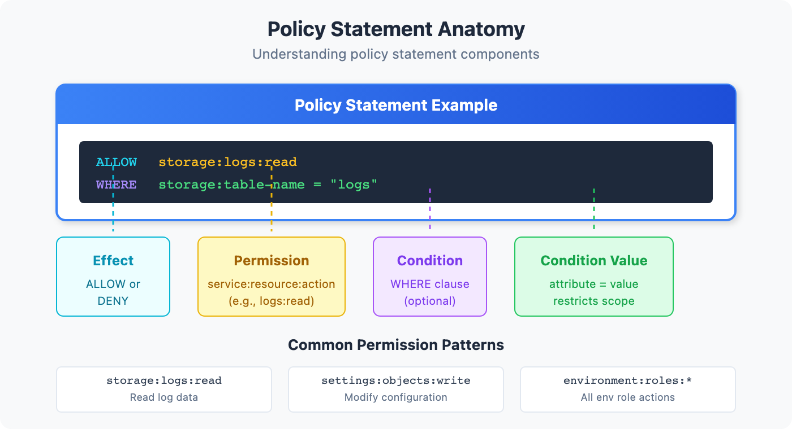
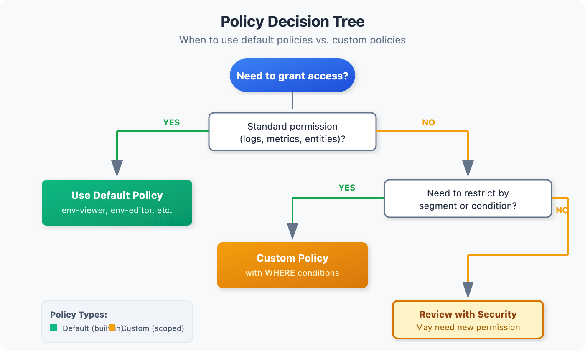

# IAM-04: Policy Authoring and Management

> **Series:** IAM — IAM Administration | **Notebook:** 4 of 12 | **Created:** January 2026 | **Last Updated:** 05/26/2026

## Mastering Dynatrace Policy Syntax
Policies are the heart of Dynatrace Gen3 IAM. They define what actions users can perform. This notebook provides a comprehensive guide to policy authoring, from basic syntax to advanced patterns.

---

## Table of Contents

1. [Policy Fundamentals](#policy-fundamentals)
2. [Policy Statement Syntax](#policy-statement-syntax)
3. [Services and Actions Reference](#services-and-actions-reference)
4. [Condition Expressions](#condition-expressions)
5. [Common Policy Patterns](#common-policy-patterns)
6. [Default vs Custom Policies](#default-vs-custom-policies)
7. [Policy Testing and Validation](#policy-testing-and-validation)
8. [GitOps for Policies](#gitops-for-policies)
9. [Policy Assessment Queries](#policy-assessment-queries)

---

## Prerequisites

| Requirement | Details |
|-------------|----------|
| **Dynatrace Environment** | SaaS with Gen3 IAM enabled |
| **Permissions** | `account-iam-admin` to create/modify policies |
| **Prior Knowledge** | **IAM-01** through **IAM-03** |

### Sprint 1.337 (April 2026): Permission Updates

**New `frontend.name` permission field for Grail RUM data.** Sprint 1.337 introduced `frontend.name` as a permission-relevant field on `metric` and `dt.entity.*` Smartscape data. You can now scope IAM policies to specific frontend applications at the **record-level** and **field-level**, instead of relying on bucket-only isolation:

```text
ALLOW storage:metric:read
  WHERE storage:metric.frontend.name == "checkout-web"
  OR    storage:metric.frontend.name == "account-web";

ALLOW storage:user.sessions:read
  WHERE storage:user.sessions.frontend.name STARTS WITH "public-";
```

Use this when multiple teams own different frontends but share a single RUM tenant — fine-grained ABAC without splitting buckets.

**`dt.security_context` is now a primary field at source.** OneAgent now enriches all telemetry with `dt.security_context` (and `dt.cost.*`) as **top-level primary fields** at ingestion on Latest Dynatrace tenants. The MATCH() ABAC patterns covered later in this notebook (and across IAM-04, IAM-05, IAM-07) work directly against the primary-field value with no need for OpenPipeline parse processors on OneAgent-instrumented data. The structured-context spread completed in PR #50 already aligns with this — the sprint-1.337 change makes the field guarantee tenant-wide rather than pipeline-dependent.

---

<a id="policy-fundamentals"></a>
## 1. Policy Fundamentals
Policies define **what actions** users can perform. They're separate from boundaries (which control **what data** users can see).

> **One policy language for all authorization.** Dynatrace's security policies are the single configuration surface for *every* authorization requirement — environment access, Grail data access, and AppEngine capabilities alike. What used to be split between classic *roles* (RBAC — "viewer", "admin") and attribute-based permissions is now unified: classic roles are expressed as `environment:roles:*` permissions inside the same `ALLOW` grammar as `storage:*` and `app-engine:*`. There is no separate RBAC subsystem to manage — one policy, one language, optionally scoped by `WHERE` conditions or boundaries.

### Policy Scope Levels

| Scope | Applies To | Managed By |
|-------|------------|------------|
| **Account** | All environments in account | Account Admin |
| **Environment** | Single environment | Environment Admin |

### Policy Assignment

Policies are assigned to **groups**, not individual users:

```
Group: dt-checkout-editors
├── Policy: environment-editor (default)
├── Policy: log-management (custom)
└── Boundary: checkout-services-only
```

### Policy Types

| Type | Description | Examples |
|------|-------------|----------|
| **Default Policies** | Pre-built by Dynatrace | `environment-viewer`, `environment-editor` |
| **Custom Policies** | Created by you | `log-read-only`, `dashboard-manager` |

<a id="policy-statement-syntax"></a>
## 2. Policy Statement Syntax
Every policy contains one or more **statements** that define allowed actions.


<!-- MARKDOWN_TABLE_ALTERNATIVE
| Component | Description | Example |
|-----------|-------------|----------|
| Effect | ALLOW or DENY | ALLOW |
| Service | What capability | storage |
| Resource | What object type | logs |
| Action | What operation | read |
| Condition | Optional filter | WHERE dt.security_context = "team-a" |
-->

### Basic Statement Structure

```
ALLOW <service>:<resource>:<action>
```

**Examples:**

| Statement | Meaning |
|-----------|----------|
| `ALLOW storage:logs:read` | Read all logs |
| `ALLOW storage:spans:read` | Read all spans |
| `ALLOW settings:objects:write` | Modify settings |
| `ALLOW document:documents:read` | Read dashboards/notebooks |

### Wildcards

Use `*` to match multiple values:

| Statement | Matches |
|-----------|----------|
| `ALLOW storage:*:read` | Read any storage type (logs, spans, metrics) |
| `ALLOW storage:logs:*` | Any action on logs (read, write) |
| `ALLOW *:*:read` | Read access to everything |

### Multiple Statements

Combine statements to build complete policies:

```
ALLOW storage:logs:read;
ALLOW storage:spans:read;
ALLOW storage:metrics:read;
ALLOW document:documents:read;
```

> **Note:** Statements are additive. Multiple ALLOW statements combine to grant broader access.

<a id="services-and-actions-reference"></a>
## 3. Services and Actions Reference
### Core Services

| Service | Purpose | Common Resources |
|---------|---------|------------------|
| `storage` | Grail data access | `logs`, `spans`, `metrics`, `events`, `bizevents` |
| `settings` | Configuration objects | `objects`, `schemas` |
| `document` | Notebooks, dashboards | `documents`, `directShares` |
| `environment` | Environment management | `extensions`, `activeGates`, `oneAgents` |
| `state` | Entity management | `entities`, `problems` |
| `automation` | Workflows, AutomationEngine | `workflows`, `calendars` |

### Common Actions

| Action | Description |
|--------|-------------|
| `read` | View/query data |
| `write` | Create/modify data |
| `delete` | Remove data |
| `share` | Share with others |
| `execute` | Run (for workflows) |

### Storage Service Details

| Resource | Description | Actions |
|----------|-------------|----------|
| `logs` | Log records | read, write |
| `spans` | Distributed traces | read, write |
| `metrics` | Metric data | read, write |
| `events` | Platform events | read, write |
| `bizevents` | Business events | read, write |
| `entities` | Smartscape entities (Classic surface) | read |
| `system` | System/audit data (query events, internal) | read |
| `buckets` | Storage buckets | read, write, delete |

Specialized record tables follow the same `storage:<table>:read` shape — e.g. `storage:security.events:read`, `storage:user.sessions:read`, `storage:user.replays:read`, `storage:application.snapshots:read`, `storage:smartscape:read`.

**Storage condition attributes:** scope `storage:*` reads with `storage:bucket-name` (e.g. `startsWith "default_"`), `storage:table-name` (e.g. `= "logs"`), and `storage:dt.security_context` (the Gen3 record-level scoping spine — see IAM-05). Example — default-bucket monitoring read:

```
ALLOW storage:buckets:read WHERE storage:bucket-name startsWith "default_";
ALLOW storage:logs:read, storage:events:read, storage:metrics:read,
      storage:entities:read, storage:bizevents:read, storage:spans:read;
```

For system/audit data (the *Storage All System Data Read* managed policy), add `storage:system:read`:

```
ALLOW storage:buckets:read;
ALLOW storage:system:read;
ALLOW storage:logs:read, storage:events:read, storage:metrics:read,
      storage:entities:read, storage:bizevents:read, storage:spans:read;
```

### Settings Service Details

| Resource | Description | Actions |
|----------|-------------|----------|
| `objects` | Configuration objects | read, write, delete |
| `schemas` | Schema definitions | read |

### Document Service Details

| Resource | Description | Actions |
|----------|-------------|----------|
| `documents` | Dashboards, notebooks | read, write, delete, share |
| `directShares` | Direct share links | write |

### Environment Roles (`environment:roles:*`)

Classic environment roles are expressed as IAM permissions. This is how RBAC folds into the one policy language (see §1). All are scoped by the `environment:management-zone` attribute **except** `agent-install` and `configure-request-capture-data` (management-zone not applicable).

| Permission | Classic role meaning |
|------------|----------------------|
| `environment:roles:viewer` | Access environment (read) |
| `environment:roles:manage-settings` | Change monitoring settings |
| `environment:roles:agent-install` | Download / install OneAgent |
| `environment:roles:logviewer` | View logs |
| `environment:roles:view-sensitive-request-data` | View sensitive request data |
| `environment:roles:configure-request-capture-data` | Configure capture of sensitive data |
| `environment:roles:replay-sessions-with-masking` | Replay session data (masked) |
| `environment:roles:replay-sessions-without-masking` | Replay session data (unmasked) |
| `environment:roles:view-security-problems` | View security problems |
| `environment:roles:manage-security-problems` | Manage security problems |

> **Privacy / compliance note.** The session-replay pair and `view-sensitive-request-data` are the load-bearing least-privilege controls here — `replay-sessions-without-masking` and `view-sensitive-request-data` expose unmasked end-user data and should be granted narrowly (specific groups, specific management zones), never bundled into a broad editor policy.

### Extensions Service Details

Extension authorization splits into *definitions* (the extension package) and *configurations* (a deployed instance):

| Permission | Description | Condition attributes |
|------------|-------------|----------------------|
| `extensions:definitions:read` / `:write` | The extension package itself | `extensions:extension-name` |
| `extensions:configurations:read` / `:write` | A deployed configuration | `extensions:host`, `extensions:host-group`, `extensions:ag-group`, `extensions:management-zone` |
| `extensions:configuration.actions:write` | Run configuration actions | (as above) |
| `extensions:discovery.jmx:read` / `extensions:discovery.pmi:read` | Discovery surfaces | — |

**Extension-ownership delegation** — let a team manage *their* extension on *their* hosts without granting tenant-wide extension rights:

```
ALLOW extensions:definitions:read, extensions:definitions:write
WHERE extensions:extension-name = "com.acme.payments";
ALLOW extensions:configurations:read, extensions:configurations:write
WHERE extensions:host-group startsWith "payments-";
```

### AppEngine Service Details (`app-engine:*`)

| Permission | Description |
|------------|-------------|
| `app-engine:apps:run` | See / open an app (controls navigation visibility) |
| `app-engine:functions:run` | Execute AppEngine functions |
| `app-engine:apps:install` | Install apps |
| `app-engine:apps:delete` | Remove apps |

App-level scoping uses the `shared:app-id` attribute (operators `=`, `!=`, `IN`, `NOT IN`, `startsWith`, `NOT startsWith`). Example — let developers install only their own apps, and grant Workflows access:

```
ALLOW app-engine:apps:install, app-engine:apps:delete WHERE shared:app-id startsWith "my.";
ALLOW app-engine:apps:run WHERE shared:app-id = "dynatrace.automations";
```

<a id="condition-expressions"></a>
## 4. Condition Expressions
Conditions add fine-grained control to policy statements.

> **Boundary standardization (canonical pattern).** The examples in this section illustrate condition operators with literal values for clarity. In production, the literal value should be a `${bindParam:NAME}` placeholder bound at policy-binding time, with the boundary field standardized on `dt.security_context` (Gen3) or management zone (Classic). See **IAM REFERENCE.md § Policy Parameterization and Boundary Standardization** for the canonical pattern, and **IAM-10: Templated Policy-Group Assignments** for binding mechanics.

### Condition Syntax

```
ALLOW <service>:<resource>:<action> WHERE <condition>
```

### Condition Operators

| Operator | Description | Example |
|----------|-------------|----------|
| `=` | Equals | `storage:dt.security_context = "team-a"` |
| `!=` | Not equals | `storage:dt.security_context != "restricted"` |
| `IN` | In list | `storage:dt.security_context IN ("team-a", "team-b")` |
| `startsWith` | Prefix match | `settings:schemaId startsWith "builtin:alerting"` |
| `contains` | Contains substring | `settings:schemaId contains "custom"` |
| `MATCH` | Wildcard pattern match | `storage:dt.security_context MATCH('*/app:easytrade')` |

> **`MATCH()` vs `startsWith`:** Use `MATCH()` for flexible wildcard patterns anywhere in the value (e.g. middle segment). Use `startsWith` when matching a fixed leading prefix.

### Common Condition Fields

| Domain | Field | Description |
|--------|-------|-------------|
| Storage | `storage:dt.security_context` | Security context on data |
| Storage | `storage:bucket-name` | Bucket name (for team isolation) |
| Settings | `settings:schemaId` | Settings schema |
| Settings | `settings:dt.security_context` | Security context on settings |

### Security Context vs Bucket Conditions

> **Default to `dt.security_context` for general team-scoped access.** Bucket conditions work well when the bucket already exists for a specific reason — compliance separation, retention isolation, or hard cost attribution. For routine team-scoped access without one of those scenarios, the `dt.security_context` condition alone is usually simpler. See **IAM REFERENCE.md § Bucket-Match Overlay** for the scenario gating.

| Condition Type | Use Case | Example |
|----------------|----------|----------|
| **Security Context** | Flexible, changeable access | `storage:dt.security_context = "team-a"` |
| **Bucket** | Hard data isolation | `storage:bucket-name = "team-a-logs"` |
| **Both** | Defense in depth | Both conditions in policy + boundary |

### Condition Examples

**Scope to security context (exact):**
```
ALLOW storage:logs:read WHERE storage:dt.security_context = "checkout"
```

**Scope to specific bucket (team isolation):**
```
ALLOW storage:logs:read WHERE storage:bucket-name = "checkout_logs"
```

**Scope to settings schema:**
```
ALLOW settings:objects:write WHERE settings:schemaId startsWith "builtin:alerting"
```

**Multiple conditions (AND):**
```
ALLOW storage:logs:read WHERE storage:dt.security_context = "team-a" AND storage:bucket-name = "team-a-logs"
```

**Multiple values (IN):**
```
ALLOW storage:logs:read WHERE storage:dt.security_context IN ("team-a", "team-b", "shared")
```

**Multiple buckets (team access):**
```
ALLOW storage:logs:read WHERE storage:bucket-name IN ("checkout_logs", "shared_logs")
ALLOW storage:spans:read WHERE storage:bucket-name IN ("checkout_spans", "shared_spans")
```

**Parameterizing the boundary (recommended for production):**

The examples above use literal values to illustrate operators. In production, replace each literal with a `${bindParam:NAME}` placeholder and supply the value at binding time. One policy template, N bindings — instead of N near-identical policies.

**Recommended (parameterized):**
```
ALLOW storage:logs:read WHERE storage:dt.security_context = "${bindParam:team}";
```

**Resolved when bound with `{"parameters": {"team": "checkout"}}`:**
```
ALLOW storage:logs:read WHERE storage:dt.security_context = "checkout";
```

The same approach applies to bucket-name overlays, MATCH() patterns, and IN lists. See **IAM-10: Templated Policy-Group Assignments** for binding mechanics and **IAM REFERENCE.md § Policy Parameterization and Boundary Standardization** for the full canonical pattern (including the Gen3 = `dt.security_context` standardization rule and the change-management caveat).

### Structured Security Context Design

For organisations with multiple teams and cross-cutting access requirements, a flat single-value context (e.g. `"checkout"`) scales poorly. Instead, encode multiple dimensions into a structured key-value string:

```
comp:<component>/bu:<business-unit>/app:<application>
```

**Examples:**

| Entity | Security Context |
|--------|-----------------|
| Easytrade application | `comp:app/bu:digital/app:easytrade` |
| Easytrade database | `comp:db/bu:digital/app:easytrade` |
| Easytrade load balancer | `comp:lb/bu:digital/app:easytrade` |

> **⚠️ Dimension order matters for Smartscape/Classic entities.** Place the dimension you need transversal access on **first** — typically `comp` for infrastructure teams. Use `MATCH('comp:db*')` to anchor at the start (equivalent to a prefix match). **Do not use `startsWith` on `storage:smartscape:read` or `storage:entities:read`** — there is a known bug; `MATCH` with a trailing `*` is the supported alternative.

**Using `MATCH()` for flexible policy conditions:**

App team — access all components within their application:
```
// 3rd Gen signals
ALLOW storage:metrics:read WHERE storage:dt.security_context MATCH('*/app:easytrade');
ALLOW storage:logs:read    WHERE storage:dt.security_context MATCH('*/app:easytrade');
ALLOW storage:spans:read   WHERE storage:dt.security_context MATCH('*/app:easytrade');
```

Transversal database team — access all database components across all applications:
```
// 3rd Gen signals
ALLOW storage:metrics:read WHERE storage:dt.security_context MATCH('comp:db*');
ALLOW storage:logs:read    WHERE storage:dt.security_context MATCH('comp:db*');
ALLOW storage:spans:read   WHERE storage:dt.security_context MATCH('comp:db*');
// Smartscape/Classic entities — use MATCH (NOT startsWith — known bug)
ALLOW storage:entities:read  WHERE storage:dt.security_context MATCH('comp:db*');
ALLOW storage:smartscape:read WHERE storage:dt.security_context MATCH('comp:db*');
```

> **Note:** `MATCH()` is the recommended operator for both Grail signals (`storage:logs:read` etc.) and Smartscape/Classic entity access (`storage:smartscape:read`, `storage:entities:read`). Anchor at the start with a trailing `*` to mimic prefix matching (e.g. `MATCH('comp:db*')`). `startsWith` has a known bug on `storage:smartscape:read` and is no longer recommended. See **IAM-05** for the corresponding boundary patterns.

<a id="common-policy-patterns"></a>
## 5. Common Policy Patterns

<!-- MARKDOWN_TABLE_ALTERNATIVE
| Need | Policy Type | Recommendation |
|------|-------------|----------------|
| Simple read-only | Default | Use environment-viewer |
| Read + limited write | Custom | Create scoped policy |
| Full access | Default | Use environment-admin |
| Specific capability | Custom | Create targeted policy |
-->

### Pattern 1: Read-Only Access

```
// Read all data, no write access
ALLOW storage:*:read;
ALLOW document:documents:read;
ALLOW state:*:read;
ALLOW settings:objects:read;
```

### Pattern 2: Team-Scoped Access (Security Context)

> **Recommended (parameterized):** One policy bound per team via binding parameters. Boundary field standardized on `dt.security_context` (Gen3 universal scoping field). See **IAM REFERENCE.md § Policy Parameterization and Boundary Standardization**.

```
// Parameterized — one policy template, bound per team via binding parameters
ALLOW storage:*:read WHERE storage:dt.security_context = "${bindParam:team}";
ALLOW storage:*:write WHERE storage:dt.security_context = "${bindParam:team}";
ALLOW settings:objects:* WHERE settings:dt.security_context = "${bindParam:team}";
```

**Resolved when bound with `{"parameters": {"team": "checkout-team"}}`:**

```
ALLOW storage:*:read WHERE storage:dt.security_context = "checkout-team";
ALLOW storage:*:write WHERE storage:dt.security_context = "checkout-team";
ALLOW settings:objects:* WHERE settings:dt.security_context = "checkout-team";
```

Bind the same template to each team with a different `team` value rather than duplicating the policy. See **IAM-10** for binding mechanics.

### Pattern 3: Bucket-Based Team Isolation (Recommended for Strict Isolation)

> **Use this pattern** when teams must have physically separated data with no cross-team visibility.

> **When this pattern fits:** bucket boundaries are well-suited to scenarios where the bucket already exists for a specific reason — compliance separation (PCI/HIPAA), retention isolation, or hard cost attribution. For general team-scoped access without one of those reasons, **Pattern 2 (`dt.security_context`) is usually the simpler choice**. When the bucket-based scenario does apply, parameterize per-team bucket names via binding parameters (shared bucket statements stay as literals — "shared" is a singleton, not a per-team scope). See **IAM REFERENCE.md § Bucket-Match Overlay** for scenario gating, and **§ Policy Parameterization and Boundary Standardization** for the full pattern.

```
// Parameterized — per-team data permissions (one policy template, bound per team)
ALLOW storage:logs:read    WHERE storage:bucket-name = "${bindParam:log-bucket}";
ALLOW storage:logs:write   WHERE storage:bucket-name = "${bindParam:log-bucket}";
ALLOW storage:spans:read   WHERE storage:bucket-name = "${bindParam:span-bucket}";
ALLOW storage:spans:write  WHERE storage:bucket-name = "${bindParam:span-bucket}";
ALLOW storage:metrics:read WHERE storage:bucket-name = "${bindParam:metric-bucket}";
ALLOW storage:metrics:write WHERE storage:bucket-name = "${bindParam:metric-bucket}";

// Shared buckets — literal (Class C: shared is a singleton, not per-team)
ALLOW storage:logs:read  WHERE storage:bucket-name = "shared_logs";
ALLOW storage:spans:read WHERE storage:bucket-name = "shared_spans";
```

**Resolved when bound with `{"parameters": {"log-bucket": "checkout_logs", "span-bucket": "checkout_spans", "metric-bucket": "checkout_metrics"}}`:**

```
ALLOW storage:logs:read    WHERE storage:bucket-name = "checkout_logs";
ALLOW storage:logs:write   WHERE storage:bucket-name = "checkout_logs";
ALLOW storage:spans:read   WHERE storage:bucket-name = "checkout_spans";
ALLOW storage:spans:write  WHERE storage:bucket-name = "checkout_spans";
ALLOW storage:metrics:read WHERE storage:bucket-name = "checkout_metrics";
ALLOW storage:metrics:write WHERE storage:bucket-name = "checkout_metrics";
ALLOW storage:logs:read  WHERE storage:bucket-name = "shared_logs";
ALLOW storage:spans:read WHERE storage:bucket-name = "shared_spans";
```

**Bucket + Security Context (Defense in Depth):**

> **Recommended (parameterized):** Both fields parameterized; the bucket-match clause is the Gen3 data overlay on the `dt.security_context` spine.

```
// Parameterized defense-in-depth
ALLOW storage:logs:read WHERE storage:bucket-name = "${bindParam:log-bucket}"
  AND storage:dt.security_context = "${bindParam:team}";
```

**Resolved when bound with `{"parameters": {"log-bucket": "checkout_logs", "team": "checkout"}}`:**

```
ALLOW storage:logs:read WHERE storage:bucket-name = "checkout_logs"
  AND storage:dt.security_context = "checkout";
```

### Pattern 4: Log Management

```
// Read all logs, manage log pipelines
ALLOW storage:logs:read;
ALLOW settings:objects:* WHERE settings:schemaId startsWith "builtin:logmonitoring";
```

### Pattern 5: Dashboard Creator

```
// Create and share dashboards
ALLOW document:documents:*;
ALLOW storage:*:read;
```

### Pattern 6: Alerting Manager

```
// Manage alerting configuration
ALLOW settings:objects:* WHERE settings:schemaId startsWith "builtin:alerting";
ALLOW settings:objects:* WHERE settings:schemaId startsWith "builtin:problem";
ALLOW automation:workflows:*;
```

### Pattern 7: SRE On-Call Access

```
// Broad read access + problem management
ALLOW storage:*:read;
ALLOW state:problems:*;
ALLOW document:documents:read;
ALLOW settings:objects:read;
```

### Pattern 8: Security Auditor

```
// Read everything, write nothing
ALLOW storage:*:read;
ALLOW settings:*:read;
ALLOW document:*:read;
ALLOW state:*:read;
```

### Pattern 9: Compliance-Scoped Access (Bucket-Based)

```
// Access only to PCI-compliant data bucket
ALLOW storage:logs:read WHERE storage:bucket-name = "pci_logs";
ALLOW storage:spans:read WHERE storage:bucket-name = "pci_spans";
// No access to non-PCI buckets
```

### Pattern 10: Tiered Environment Access (Management Zones)

Grant full access in lower environments and read-only in production — using `environment:roles:*` permissions scoped by the `environment:management-zone` attribute (the classic-role surface, complementary to the Grail patterns above):

```
// Full access in dev and hardening
ALLOW environment:roles:viewer, environment:roles:manage-settings
WHERE environment:management-zone IN ("dev", "hardening");

// Read-only in production
ALLOW environment:roles:viewer
WHERE environment:management-zone IN ("prod");
```

This is the canonical app-developer shape: iterate freely in non-prod, observe-only in prod. Add `environment:roles:logviewer` to the prod statement if the team needs production log access without settings rights.

### Choosing Between Patterns

| Requirement | Recommended Pattern |
|-------------|---------------------|
| Teams can share data flexibly | Pattern 2 (Security Context) |
| Teams must never see each other's data | **Pattern 3 (Buckets)** |
| Compliance/regulatory data separation | **Pattern 9 (Bucket-Based)** |
| Temporary project access | Pattern 2 (Security Context) |
| Cost allocation by team | **Pattern 3 (Buckets)** |
| Full in non-prod, read-only in prod | **Pattern 10 (Management Zones)** |

<a id="default-vs-custom-policies"></a>
## 6. Default vs Custom Policies
### Built-in Default Policies

Dynatrace provides default policies for common use cases:

| Policy | Description | Use Case |
|--------|-------------|----------|
| `environment-viewer` | Read-only access | Stakeholders, auditors |
| `environment-editor` | Read + write (most things) | Team members |
| `environment-admin` | Full environment control | Administrators |
| `account-viewer` | View account settings | Cross-team visibility |
| `account-iam-admin` | Manage IAM | IAM administrators |

### Reach for Managed Policies First

**Default to the policies Dynatrace ships before authoring custom ones.** Most standard scenarios — monitoring read access, app users, automation access — are already covered by managed policies; hand-rolling a custom policy for these is extra surface to maintain and audit. Author custom policies only when no managed policy fits (team-scoped data, specific single-capability grants, compliance constraints).

Commonly used managed policies for Grail and AppEngine onboarding:

| Managed policy | Grants |
|----------------|--------|
| **Storage Default Monitoring Read** | Read on default buckets; auto-adjusts as new tables are added |
| **Storage `<table>` Read** | Per-table read (e.g. *Storage logs Read*) |
| **Storage All System Data Read** | System/audit + query-event data |
| **Storage All Grail Data Read** | Unrestricted Grail read |
| **AppEngine User** | `apps:run` + `functions:run` (+ document/state access) |
| **AppEngine Admin** | Full app lifecycle (install/delete) + settings |
| **AppEngine Developer** | App install/delete scoped to own apps |
| **AutomationEngine Access** | Workflows app + automation run access |

> Environment-admin groups typically receive *AppEngine Admin*, *AutomationEngine Access*, and *Storage All Grail Data Read* automatically. Verify the exact managed-policy set in your tenant's Account Management — the catalog evolves.

### When to Use Default Policies

| Scenario | Recommendation |
|----------|----------------|
| Simple permission levels | Use defaults |
| Quick onboarding | Use defaults |
| Standard roles | Use defaults |

### When to Create Custom Policies

| Scenario | Recommendation |
|----------|----------------|
| Team-scoped data access | Custom policy |
| Specific capability (logs only) | Custom policy |
| Compliance requirements | Custom policy |
| Least privilege needs | Custom policy |

### Combining Default and Custom

Groups can have both:

```
Group: dt-checkout-editors
├── Default Policy: environment-viewer (base access)
└── Custom Policy: checkout-write-access (team-specific writes)
```

This provides base read access plus targeted write permissions.

<a id="policy-testing-and-validation"></a>
## 7. Policy Testing and Validation
### Testing Methodology

1. **Create policy in test environment** (or account)
2. **Assign to test group** with a test user
3. **Verify intended access** works
4. **Verify unintended access** is blocked
5. **Document results** and adjust

### Common Validation Tests

| Test | Expected Result |
|------|------------------|
| Query logs in scope | Success |
| Query logs out of scope | Empty or denied |
| Modify settings in scope | Success |
| Modify settings out of scope | Denied |
| Create dashboard | Success (if allowed) |

### Debugging Policy Issues

If access isn't working as expected:

1. **Check group membership** - Is user in the correct group?
2. **Check policy assignment** - Is policy assigned to group?
3. **Check boundary** - Does boundary allow access to the entity?
4. **Check conditions** - Do condition values match?
5. **Check security context** - Is data tagged correctly?

See **IAM-09: Troubleshooting Access Issues** for detailed debugging.

<a id="gitops-for-policies"></a>
## 8. GitOps for Policies
Version control your policies for audit trail and peer review.

### Policy as Code Structure

```
iam-config/
├── policies/
│   ├── team-checkout-access.yaml
│   ├── team-payments-access.yaml
│   ├── sre-oncall.yaml
│   └── security-auditor.yaml
├── groups/
│   └── group-assignments.yaml
└── README.md
```

### Policy YAML Format (Monaco)

> **Recommended (parameterized):** One policy template, bound to each team's group with a different `team` value. Source-control the policy AND the bindings — that's how you safely shepherd parameter-shape changes across N bindings (see **IAM REFERENCE.md § Change-Management Caveat**).

**Parameterized policy:**

```yaml
# policies/team-data-access.yaml
configs:
  - id: team-data-access-policy
    type:
      settings:
        schema: builtin:iam.policy
    config:
      name: team-data-access
      description: "Parameterized: data access scoped to ${bindParam:team}"
      statements:
        - effect: ALLOW
          service: storage
          resource: "*"
          action: read
          condition: "storage:dt.security_context = '${bindParam:team}'"
        - effect: ALLOW
          service: storage
          resource: "*"
          action: write
          condition: "storage:dt.security_context = '${bindParam:team}'"
```

**Bindings (one per team, same policy, different parameter values):**

```yaml
# bindings/team-bindings.yaml
configs:
  - id: checkout-team-binding
    type:
      settings:
        schema: builtin:iam.binding
    config:
      policyId: "{{ .team-data-access-policy }}"
      groupId: "{{ .dt-checkout-team }}"
      parameters:
        team: "checkout"
  - id: payments-team-binding
    type:
      settings:
        schema: builtin:iam.binding
    config:
      policyId: "{{ .team-data-access-policy }}"
      groupId: "{{ .dt-payments-team }}"
      parameters:
        team: "payments"
```

Adding a new team is a binding (values-file edit), not a policy review. The policy YAML stays unchanged. See **IAM-10: Templated Policy-Group Assignments** for the full Monaco + IAM API integration pattern.

### GitOps Workflow

1. **Branch**: Create feature branch for policy change
2. **Edit**: Modify policy YAML
3. **Review**: Submit PR, get peer review
4. **Test**: Deploy to test environment
5. **Approve**: Merge after validation
6. **Deploy**: CI/CD applies to production

### Benefits

| Benefit | Description |
|---------|-------------|
| **Audit Trail** | Git history shows who changed what, when |
| **Peer Review** | Changes reviewed before apply |
| **Rollback** | Easy revert to previous state |
| **Documentation** | Policies are self-documenting |
| **Consistency** | Same process for all changes |

See **AUTOM-03: Monaco** for full implementation details.

<a id="policy-assessment-queries"></a>
## 9. Policy Assessment Queries
Use these queries to audit policy-related activity.

```dql
// Track policy changes in audit log
fetch logs, from: now() - 30d
| filter matchesPhrase(log.source, "audit")
| filter matchesPhrase(content, "policy")
| fields timestamp, content
| sort timestamp desc
| limit 50
```

```dql
// Find access denied events
fetch logs, from: now() - 7d
| filter matchesPhrase(log.source, "audit")
| filter matchesPhrase(content, "denied") or matchesPhrase(content, "unauthorized")
| fields timestamp, content
| sort timestamp desc
| limit 100
```

```dql
// Summarize permission-related audit events
fetch logs, from: now() - 7d
| filter matchesPhrase(log.source, "audit")
| filter matchesPhrase(content, "permission") or matchesPhrase(content, "policy")
| summarize eventCount = count(), by:{content}
| sort eventCount desc
| limit 20
```

## Next Steps

With policies defined, complete your access control setup:

### Recommended Path

1. **IAM-05: Boundary Design Patterns** - Control what entities users can see
2. **IAM-06: User Lifecycle and Provisioning** - Automate user management
3. **IAM-07: Audit Logging and Compliance** - Monitor policy effectiveness
4. **IAM-10: Templated Policy-Group Assignments** - Reusable parameterized policies for team/environment scoping at scale
5. **IAM-11: Policy Persona Workshop** - Design persona-based policies from stakeholder requirements using a structured 6-goal methodology

### Policy Checklist

Before moving on, ensure you have:

- [ ] Understood policy statement syntax
- [ ] Reviewed services and actions reference
- [ ] Designed policies for your team structure
- [ ] Decided on default vs custom policy usage
- [ ] Established testing methodology
- [ ] Considered GitOps for policy management

---

## Summary

In this notebook, you learned:

- Policy fundamentals and scope levels
- Statement syntax: `ALLOW <service>:<resource>:<action>`
- Services and actions reference
- Condition expressions for fine-grained control
- Seven common policy patterns
- When to use default vs custom policies
- Policy testing and validation approaches
- GitOps for policy version control

---

## References

- [Policy Statements Reference](https://docs.dynatrace.com/docs/manage/identity-access-management/permission-management/manage-user-permissions-policies/policy-statement)
- [Permission Management](https://docs.dynatrace.com/docs/manage/identity-access-management/permission-management)
- [Account Policies](https://docs.dynatrace.com/docs/manage/identity-access-management/permission-management/manage-user-permissions-policies)

### References

- [IAM policy statements reference (DT docs)](https://docs.dynatrace.com/docs/manage/identity-access-management/permission-management/manage-user-permissions-policies/advanced/iam-policystatements) — authoritative permission + attribute catalog
- [Tailored access management, Part 1 — one configuration for all authorization requirements (Dynatrace News)](https://www.dynatrace.com/news/blog/tailored-access-management-for-dynatrace-part-1-one-configuration-for-all-authorization-requirements/)
- [Tailored access management, Part 2 — onboard users to Grail and AppEngine (Dynatrace News)](https://www.dynatrace.com/news/blog/tailored-access-management-part-2-onboard-users-to-grail-and-appengine/)

---

<sub>*This notebook was AI-generated from community-submitted and publicly available sources. This notebook series is not officially supported by Dynatrace. Always verify information against official Dynatrace documentation.*</sub>
