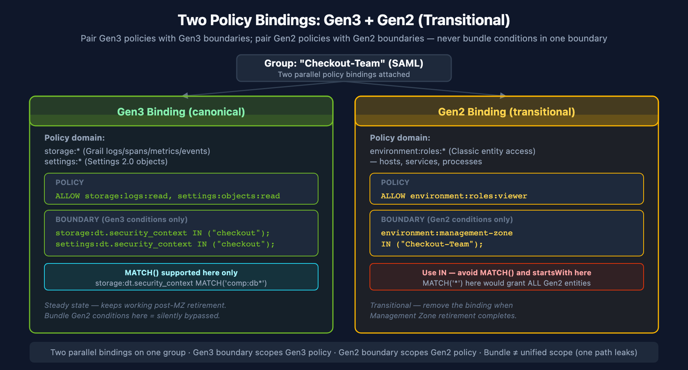
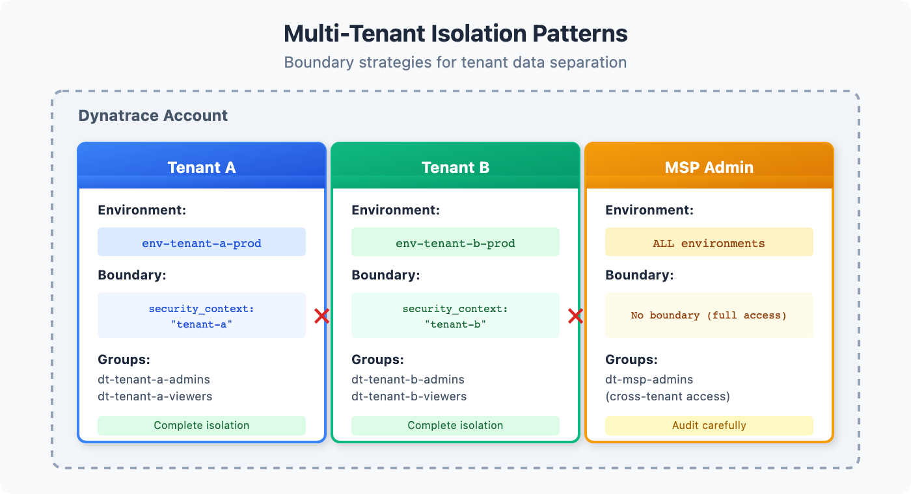

# IAM-05: Boundary Design Patterns

> **Series:** IAM — IAM Administration | **Notebook:** 5 of 12 | **Created:** January 2026 | **Last Updated:** 04/27/2026

## Controlling Data Visibility with Boundaries
Boundaries determine **what data** users can see. While policies control actions, boundaries filter visibility. This notebook covers boundary syntax, patterns, and implementation strategies.

---

## Table of Contents

1. [Boundary Fundamentals](#boundary-fundamentals)
2. [The Three-Domain Model](#the-three-domain-model)
3. [Boundary Syntax Reference](#boundary-syntax-reference)
4. [Security Context and Data Partitioning Strategy](#security-context-and-data-partitioning-strategy)
5. [Common Boundary Patterns](#common-boundary-patterns)
6. [Multi-Tenant Isolation](#multi-tenant-isolation)
7. [Boundary Testing](#boundary-testing)

---

## Prerequisites

| Requirement | Details |
|-------------|----------|
| **Dynatrace Environment** | SaaS with Gen3 IAM enabled |
| **Permissions** | `environment-admin` or boundary management rights |
| **Prior Knowledge** | **IAM-01** through **IAM-04** |

<a id="boundary-fundamentals"></a>
## 1. Boundary Fundamentals
Boundaries filter what entities and data a user can see within an environment.

### Policies vs Boundaries

| Concept | Controls | Example |
|---------|----------|----------|
| **Policy** | What actions | "Can read logs" |
| **Boundary** | What data | "Logs from checkout service only" |

A user needs BOTH:
- A **policy** granting the action (e.g., `storage:logs:read`)
- A **boundary** including the data (e.g., `checkout` security context)

### How Boundaries Work

1. User attempts to access data (query, view, etc.)
2. Dynatrace checks if user's policy allows the action
3. Dynatrace filters results to match user's boundary
4. User sees only data within their boundary

### Boundary Scope

Boundaries are **environment-level** and assigned to groups:

```
Group: dt-checkout-editors
├── Policy: environment-editor
└── Boundary: checkout-services-only
```

<a id="the-three-domain-model"></a>
## 2. The Three-Domain Model
Boundaries filter across three domains. A complete boundary typically includes all three.


<!-- MARKDOWN_TABLE_ALTERNATIVE
| Domain | Controls | Key Field |
|--------|----------|------------|
| Environment | Smartscape entities (hosts, services) | dt.security_context |
| Storage | Grail data (logs, spans, metrics) | dt.security_context |
| Settings | Configuration objects | dt.security_context |
-->

### Domain 1: Environment

Controls visibility of Smartscape entities:
- Hosts
- Services
- Applications
- Databases
- Cloud resources

### Domain 2: Storage

Controls visibility of Grail data:
- Logs
- Spans (traces)
- Metrics
- Events
- Business events

### Domain 3: Settings

Controls visibility of configuration:
- Alerting rules
- SLOs
- Custom settings

### Why All Three Matter

If you only boundary one domain:

| Missing Domain | Problem |
|----------------|----------|
| Environment | User can't see services in UI |
| Storage | User can't query logs/spans |
| Settings | User can't see/edit config |

<a id="boundary-syntax-reference"></a>
## 3. Boundary Syntax Reference
### Basic Boundary Structure

```
<domain>:<field> <operator> (<values>)
```

**Pair Gen2 policies with Gen2 boundaries; pair Gen3 policies with Gen3 boundaries.** Each boundary's conditions evaluate against the policy it's attached to — using `environment:management-zone` to scope a `storage:logs:read` policy is a no-op (the Gen3 policy doesn't read `environment:` conditions), and using `storage:dt.security_context` to scope an `environment:roles:viewer` policy is also a no-op (Classic entity access doesn't read Gen3 conditions). Mixing them in one boundary creates the illusion of unified scope while leaving one path wide open.

The right shape is **two parallel policy bindings on the same group**:

```
# Gen3 policy
ALLOW storage:logs:read,
      storage:spans:read,
      storage:metrics:read,
      settings:objects:read,
      settings:objects:write;
```

```
# Gen3 boundary
storage:dt.security_context  IN ("checkout");
settings:dt.security_context IN ("checkout");
```

```
# Gen2 policy (transitional, for Classic entity access)
ALLOW environment:roles:viewer;
```

```
# Gen2 boundary
environment:management-zone IN ("checkout");
```

Attach both to the user's group. When Management Zone retirement completes, the Gen2 binding is removed cleanly without touching the Gen3 one. **A `MATCH` operator on a Gen2 policy's boundary (e.g., `MATCH('*')` against `storage:entities:read`) would grant access to all Gen2 entities — `MATCH` belongs in Gen3 boundaries only.**

### Operators

| Operator | Description | Example |
|----------|-------------|----------|
| `IN` | Match any in list | `IN ("a", "b", "c")` |
| `=` | Exact match | `= "checkout"` |
| `!=` | Not equal | `!= "restricted"` |
| `startsWith` | Prefix match | `startsWith "team-"` |
| `contains` | Substring | `contains "prod"` |
| `MATCH` | Wildcard pattern match | `storage:dt.security_context MATCH('*/app:easytrade')` |

> **`MATCH()` is available for the `storage` and `settings` domains.** It supports `*` as a wildcard at any position — anchor with a trailing `*` to mimic prefix matching. The `environment:` domain (Classic Management Zones) does **not** support `MATCH()` — use `IN` (preferred) or `startsWith` there.
>
> **⚠️ `storage:smartscape:read` + `startsWith` has a known bug.** Use `MATCH('value*')` instead (e.g. `MATCH('comp:db*')`) for Smartscape and Classic entity access.

### Common Fields

| Domain | Field | Description |
|--------|-------|-------------|
| environment | `management-zone` | Management zone filter |
| storage | `dt.security_context` | Data security context |
| storage | `bucket-name` | Storage bucket name |
| settings | `dt.security_context` | Settings security context |
| settings | `schemaId` | Settings schema |

### Multiple Values

Grant access to multiple security contexts (two parallel policy bindings):

```
# Gen3 policy
ALLOW storage:logs:read,
      storage:spans:read,
      settings:objects:read;
```

```
# Gen3 boundary
storage:dt.security_context  IN ("checkout", "payments", "shared");
settings:dt.security_context IN ("checkout", "payments", "shared");
```

```
# Gen2 policy (transitional)
ALLOW environment:roles:viewer;
```

```
# Gen2 boundary
environment:management-zone IN ("checkout", "payments", "shared");
```

### Wildcard Access

For admin groups needing full access (still two parallel policy bindings):

```
# Gen3 admin: all data + settings, no boundary scope
ALLOW storage:logs:read, storage:spans:read, storage:metrics:read,
      settings:objects:read, settings:objects:write;
```

```
# Gen2 admin: all Classic entity access (transitional, remove once MZ retirement is complete)
ALLOW environment:roles:manage-settings, environment:roles:viewer;
```

> **Don't write `MATCH('*')` on a Gen2 policy.** `MATCH` is a Gen3-domain operator only; using it as a wildcard on `storage:entities:read` (a Gen2 surface) would silently grant access to all Gen2 entities.

### Boundary Limitations

| Limitation | Description | Workaround |
|------------|-------------|------------|
| **Max 10 conditions** | Only 10 lines per boundary | Create multiple boundaries |
| **No AND between lines** | Each line is OR-combined | Use multiple boundaries for AND logic |
| **MATCH not in `environment:`** | `MATCH()` not supported in `environment:` domain (Classic MZ) | Use `IN` (preferred) for management zones |

<a id="security-context-and-data-partitioning-strategy"></a>
## 4. Security Context and Data Partitioning Strategy
Security contexts and Grail buckets form the foundation of boundary filtering and data partitioning. Plan your strategy carefully.

### What is a Security Context?

A **security context** is a label applied to:
- Entities (hosts, services)
- Data (logs, spans)
- Settings (configurations)

Boundaries filter based on these labels.

### Primary Grail Fields

**Primary Grail fields** are first-class attributes that Dynatrace uses for data organization. These should drive your bucket, permission, and segmentation strategy:

| Field | Source | Use Case |
|-------|--------|----------|
| `k8s.cluster.name` | Kubernetes | Cluster-level isolation |
| `k8s.namespace.name` | Kubernetes | Namespace-level access |
| `aws.account.id` | AWS metadata | AWS account separation |
| `azure.subscription.id` | Azure metadata | Azure subscription separation |
| `gcp.project.id` | GCP metadata | GCP project separation |
| `dt.host_group.id` | OneAgent config | Host group-based isolation |

These fields are automatically enriched from infrastructure metadata and provide consistent, reliable partitioning dimensions.

### Grail Bucket Strategy

**Buckets** partition data in Grail for access control, retention, and query performance.

**Key Principle:** Set up buckets along organizational lines and route data based on primary Grail fields.

| Bucket Design | Example | Benefit |
|---------------|---------|---------|
| **By Environment** | `prod_logs`, `dev_logs` | Separate prod/non-prod access |
| **By Team/LOB** | `checkout_data`, `payments_data` | Team-level isolation |
| **By Compliance** | `pci_logs`, `general_logs` | Regulatory separation |
| **By Region** | `us_data`, `eu_data` | Geographic compliance |

### Bucket Limitations

> **⚠️ Critical:** Plan buckets carefully - these constraints cannot be changed later.

| Limitation | Details |
|------------|---------|
| **One data type per bucket** | Logs, metrics, events, OR spans - not mixed |
| **Names are immutable** | Bucket names CANNOT be changed after creation |
| **No data migration** | Data CANNOT be moved between buckets |
| **Naming rules** | 3-100 chars, lowercase alphanumeric, underscores, hyphens only |
| **Maximum buckets** | 80 per environment (default limit) |
| **Optimal ingest** | ~1 TB/day per bucket for best query performance |
| **Acceptable ingest** | 1-3 TB/day per bucket (limited query window) |
| **Maximum ingest** | 3 TB/day per bucket hard limit |

### Query Constraints

| Limit | Value | Impact |
|-------|-------|--------|
| **Maximum data scanned** | 500 GB | Limits queryable time window |
| **Maximum records returned** | 1,000 | Use aggregations for larger datasets |
| **Maximum response payload** | 1 MB | Large result sets may be truncated |

### Default Bucket Retentions

| Bucket | Retention |
|--------|-----------|
| `default_logs` | 35 days |
| `default_metrics` | 15 months |
| `default_spans` | 10 days |
| `default_events` | 35 days |

**Naming Convention:** Include organization, data type, and retention in bucket names:
- `teamA_logs_90d`
- `prod_spans_30d`
- `pci_metrics_365d`

### Bucket + Boundary Integration

Use `storage:bucket-name` in boundaries to restrict team access to their data:

```
// Policy: Grant read access to team's bucket
ALLOW storage:logs:read WHERE storage:bucket-name = "checkout_logs"
ALLOW storage:spans:read WHERE storage:bucket-name = "checkout_spans"
```

```
# Gen3 boundary — pair with a Gen3 policy (storage:*, settings:*)
storage:bucket-name IN ("checkout_logs", "checkout_spans");
storage:dt.security_context IN ("checkout");
settings:dt.security_context IN ("checkout");
```

```
# Gen2 boundary — pair with a Gen2 policy (environment:*), transitional
environment:management-zone IN ("Checkout");
```

### Using Buckets for Team Isolation

For team-level data access control:

1. **Create team-specific buckets** - `teamA_logs`, `teamA_spans`, etc.
2. **Configure pipeline routing** - Route data to buckets based on primary Grail fields
3. **Create bucket-based policies** - Grant access to specific buckets
4. **Apply boundaries** - Combine bucket + security context restrictions

```
// Complete team isolation example
Group: Checkout-Team
├── Policy: Checkout Data Access
│   ├── ALLOW storage:logs:read WHERE storage:bucket-name = "checkout_logs"
│   ├── ALLOW storage:spans:read WHERE storage:bucket-name = "checkout_spans"
│   └── ALLOW storage:metrics:read WHERE storage:bucket-name = "checkout_metrics"
└── Boundary:
    storage:bucket-name IN ("checkout_logs", "checkout_spans", "checkout_metrics");
    storage:dt.security_context IN ("checkout");
    environment:management-zone IN ("Checkout");
```

> **For comprehensive bucket guidance**, see **ORGNZ-03: Bucket Strategy and Design** which covers naming conventions, retention planning, and cost attribution patterns.

### Primary Grail Tags

Beyond fields, **Primary Grail Tags** can be configured from:
- Kubernetes labels (first 3 selected during setup)
- AWS resource tags
- Azure resource tags

These tags become first-class Grail attributes available for:
- Bucket assignment rules
- Policy/boundary conditions
- Pipeline routing
- Segment filters

### Assigning Security Context

Security context is set via (modern approaches):

1. **Entity Enrichment rules** - Automatic based on entity properties
2. **Host properties** - Set on hosts and inherited by services
3. **Primary Grail fields/tags** - First-class tags for Grail data
4. **OneAgent group** - Inherited from deployment
5. **Log attributes** - Set during OpenPipeline ingestion

> **Note:** Auto-tagging is a legacy approach. Prefer Entity Enrichment and Primary Grail Fields for new implementations.

### Security Context Design Patterns

| Pattern | Example Values | Use Case |
|---------|----------------|----------|
| **Team-based** | `checkout-team`, `payments-team` | Team ownership |
| **Application-based** | `ecommerce-app`, `mobile-app` | App isolation |
| **Environment-based** | `prod`, `staging`, `dev` | Env separation |
| **Business unit** | `retail`, `wholesale`, `corporate` | Business isolation |
| **Geography** | `us-east`, `eu-west`, `apac` | Regional separation |

### Naming Conventions

| Rule | Good | Bad |
|------|------|-----|
| Lowercase | `checkout` | `Checkout` |
| Hyphens | `team-checkout` | `team_checkout` |
| Descriptive | `payments-api` | `pa` |
| No spaces | `mobile-app` | `mobile app` |

### Shared Context

Some data should be visible to multiple teams:

```
Security Contexts:
├── checkout      (checkout team data)
├── payments      (payments team data)
└── shared        (cross-team data - infrastructure, common services)
```

Teams get their context + `shared`:
```
environment:management-zone IN ("checkout", "shared");
```

### Recommended Partitioning Strategy

1. **Identify primary dimensions** - What drives access control? (team, environment, region, compliance)
2. **Map to Primary Grail Fields** - Use `k8s.cluster.name`, `aws.account.id`, `dt.host_group.id`
3. **Design buckets** - Create buckets aligned with access control boundaries
4. **Configure pipelines** - Route data to buckets based on primary fields
5. **Define policies** - Grant bucket-specific permissions per team
6. **Apply boundaries** - Use `storage:bucket-name` and `storage:dt.security_context`
7. **Create segments** - For cross-bucket query filtering

> **See Also:** For migration from Management Zones, refer to **MZ2POL-04: Policies and Boundaries** which covers mapping MZ patterns to the new model.

<a id="common-boundary-patterns"></a>
## 5. Common Boundary Patterns
### Pattern 1: Single Team Boundary

Restrict to one team's data using two boundaries (Gen3 canonical + Gen2 transitional). Both attach to the same policy.

```
# Gen3 boundary — pair with Gen3 policy
storage:dt.security_context IN ("checkout");
settings:dt.security_context IN ("checkout");
```

```
# Gen2 boundary — pair with Gen2 policy (transitional)
environment:management-zone IN ("checkout");
```

### Pattern 2: Team + Shared

Team data plus shared infrastructure:

```
# Gen3 boundary — pair with Gen3 policy
storage:dt.security_context IN ("checkout", "shared", "infrastructure");
settings:dt.security_context IN ("checkout", "shared");
```

```
# Gen2 boundary — pair with Gen2 policy (transitional)
environment:management-zone IN ("checkout", "shared", "infrastructure");
```

### Pattern 3: Multiple Teams (Cross-Functional)

For SRE or platform teams:

```
# Gen3 boundary — pair with Gen3 policy
storage:dt.security_context IN ("checkout", "payments", "catalog", "shared");
settings:dt.security_context IN ("checkout", "payments", "catalog", "shared");
```

```
# Gen2 boundary — pair with Gen2 policy (transitional)
environment:management-zone IN ("checkout", "payments", "catalog", "shared");
```

### Pattern 4: Environment Tier

Production vs non-production:

**Production (two boundaries):**
```
# Gen3 boundary — pair with Gen3 policy
storage:dt.security_context IN ("prod-checkout", "prod-payments");
settings:dt.security_context IN ("prod-checkout", "prod-payments");
```

```
# Gen2 boundary — pair with Gen2 policy (transitional)
environment:management-zone IN ("prod-checkout", "prod-payments");
```

**Non-Production (two boundaries):**
```
# Gen3 boundary — pair with Gen3 policy
storage:dt.security_context IN ("dev-checkout", "staging-checkout");
settings:dt.security_context IN ("dev-checkout", "staging-checkout");
```

```
# Gen2 boundary — pair with Gen2 policy (transitional)
environment:management-zone IN ("dev-checkout", "staging-checkout");
```

### Pattern 5: Read-All, Write-Scoped

Using two groups for the same user:

**Group 1: All-Viewers (broad read)**
```
Policy: environment-viewer
Boundary: environment:management-zone IN ("*");
```

**Group 2: Checkout-Editors (scoped write)**
```
Policy: checkout-write-policy
Boundary: environment:management-zone IN ("checkout");
```

### Pattern 6: Application Team — Structured Security Context

When `dt.security_context` follows the `comp:<component>/bu:<bu>/app:<app>` format (see **Structured Security Context Design** in **IAM-04**), app teams can access all component types for their application using a single wildcard boundary:

```
// 3rd Gen Grail data — wildcard on app dimension (mid-string)
storage:dt.security_context MATCH('*/app:easytrade');

// Smartscape/Classic entities — anchored MATCH per component
// (do NOT use startsWith on storage:smartscape:read or storage:entities:read — known bug)
storage:dt.security_context MATCH('comp:app/bu:digital/app:easytrade*');
storage:dt.security_context MATCH('comp:db/bu:digital/app:easytrade*');
storage:dt.security_context MATCH('comp:lb/bu:digital/app:easytrade*');
```

This grants access to all data tagged with any component prefix for that application:
- `comp:app/bu:digital/app:easytrade`
- `comp:db/bu:digital/app:easytrade`
- `comp:lb/bu:digital/app:easytrade`

### Pattern 7: Transversal Team — Component-Based Access

Infrastructure teams (database, network, OS) that need cross-application access to their component type use a leading `comp:` prefix to enable a single rule:

```
// 3rd Gen Grail data — all database components, all applications
storage:dt.security_context MATCH('comp:db*');

// Smartscape/Classic entities — anchored MATCH (NOT startsWith — known bug)
storage:dt.security_context MATCH('comp:db*');
```

This grants access to all data matching:
- `comp:db/bu:digital/app:easytrade`
- `comp:db/bu:digital/app:easytravel`
- `comp:db/bu:corp/app:hipstershop`

> **Dimension order is the key design decision.** Placing `comp` first in the string means component-based transversal access is always a simple anchored match. Access by `bu` or other mid-string dimensions requires `MATCH('*/bu:digital/*')`.

### Multi-Value Security Context (Upcoming)

> **Planned: CQ3** — `PRODUCT-14849`

The current single-string model requires choosing one leading dimension. A future **multi-value `dt.security_context`** will store each dimension independently:

```
dt.security_context = ["bu:digital", "app:easytrade", "comp:db"]
```

This removes the dimension-ordering trade-off and simplifies all three team types to a single boundary condition per signal type:

| Team | Boundary (future) |
|------|-------------------|
| App team (easytrade) | `storage:dt.security_context MATCH('app:easytrade')` |
| Database team (transversal) | `storage:dt.security_context MATCH('comp:db')` |
| Business unit (digital) | `storage:dt.security_context MATCH('bu:digital')` |

Until multi-value is available, the structured single-string pattern above is the recommended approach.

<a id="multi-tenant-isolation"></a>
## 6. Multi-Tenant Isolation
For organizations serving multiple customers or business units that require strict isolation.


<!-- MARKDOWN_TABLE_ALTERNATIVE
| Tenant | Security Context | Isolated Data |
|--------|------------------|---------------|
| Customer A | tenant-a | All logs, spans, metrics |
| Customer B | tenant-b | All logs, spans, metrics |
| Internal | internal | Platform metrics only |
-->

### Isolation Requirements

| Requirement | Implementation |
|-------------|----------------|
| Data isolation | Unique security context per tenant |
| No cross-tenant access | Strict boundary matching |
| Audit capability | Centralized logging |
| Shared infrastructure | Separate "platform" context |

### Multi-Tenant Boundary Example

**Tenant A Group (two boundaries):**
```
# Gen3 boundary — pair with Gen3 policy
storage:dt.security_context IN ("tenant-a");
settings:dt.security_context IN ("tenant-a");
```

```
# Gen2 boundary — pair with Gen2 policy (transitional)
environment:management-zone IN ("tenant-a");
```

**Tenant B Group (two boundaries):**
```
# Gen3 boundary — pair with Gen3 policy
storage:dt.security_context IN ("tenant-b");
settings:dt.security_context IN ("tenant-b");
```

```
# Gen2 boundary — pair with Gen2 policy (transitional)
environment:management-zone IN ("tenant-b");
```

**Platform Team (cross-tenant, two boundaries):**
```
# Gen3 boundary — pair with Gen3 policy
storage:dt.security_context IN ("platform", "shared");
settings:dt.security_context IN ("platform", "shared");
```

```
# Gen2 boundary — pair with Gen2 policy (transitional)
environment:management-zone IN ("platform", "shared");
```

### Entity Enrichment for Multi-Tenancy

Use Entity Enrichment rules (Settings > Entity Enrichment) to assign tenant context:

```yaml
# Entity Enrichment rule based on host group
Rule: Assign security context from host group
Entity Type: Host
Condition: Host group name contains "tenant-"
Action: Set dt.security_context = {hostGroup.name}
```

Alternatively, use **host properties** to set context at deployment:

```bash
# Set via OneAgent installer
--set-host-property=dt.security_context=tenant-a
```

<a id="boundary-testing"></a>
## 7. Boundary Testing
Verify boundaries work as expected before production use.

```dql
// Check security context distribution on services
fetch dt.entity.service
| summarize count = count(), by:{dt.security_context}
| sort count desc
| limit 20

// Alternative: Smartscape on Grail (entity.name → name)
// smartscapeNodes SERVICE
// | summarize count = count(), by:{dt.security_context}
// | sort count desc
// | limit 20

```

```dql
// Find entities without security context (boundary gaps)
fetch dt.entity.service
| filter isNull(dt.security_context)
| fields entity.name, tags
| sort entity.name
| limit 50
```

```dql
// Check host security context coverage
fetch dt.entity.host
| summarize 
    total = count(),
    withContext = countIf(isNotNull(dt.security_context)),
    missing = countIf(isNull(dt.security_context))
| fieldsAdd coveragePercent = round(100.0 * withContext / total, decimals: 2)

// Alternative: Smartscape on Grail (entity.name → name)
// smartscapeNodes HOST
// | summarize
// total = count(),
// withContext = countIf(isNotNull(dt.security_context)),
// missing = countIf(isNull(dt.security_context))
// | fieldsAdd coveragePercent = round(100.0 * withContext / total, decimals: 2)

```

```dql
// Verify logs have security context
fetch logs, from: now() - 1h
| summarize 
    total = count(),
    withContext = countIf(isNotNull(dt.security_context))
| fieldsAdd coveragePercent = round(100.0 * withContext / total, decimals: 2)
```

### Testing Methodology

1. **Create test group** with the boundary
2. **Add test user** to the group
3. **Log in as test user** (or impersonate)
4. **Verify visible entities** match expected
5. **Verify hidden entities** are not visible
6. **Query data** to confirm filtering works

### Validation Checklist

| Test | Expected |
|------|----------|
| List services | Only boundary-included services |
| Query logs | Only logs with matching context |
| View settings | Only settings with matching context |
| Access denied entity | Empty result or error |

## Next Steps

With boundaries configured, complete your IAM implementation:

### Recommended Path

1. **IAM-06: User Lifecycle and Provisioning** - Automate user management
2. **IAM-07: Audit Logging and Compliance** - Monitor access patterns
3. **IAM-08: Multi-Environment IAM** - Scale across environments

### Boundary Checklist

Before moving on, ensure you have:

- [ ] Understood the three-domain model
- [ ] Designed your security context strategy
- [ ] Created boundaries for each team/group
- [ ] Configured entity enrichment for context assignment
- [ ] Tested boundaries with real users
- [ ] Verified no entities are missing context

---

## Summary

In this notebook, you learned:

- Boundary fundamentals and how they differ from policies
- The three-domain model (environment, storage, settings)
- Boundary syntax and operators
- Security context strategy and naming
- Five common boundary patterns
- Multi-tenant isolation design
- Boundary testing and validation

---

## References

- [Permission Boundaries](https://docs.dynatrace.com/docs/manage/identity-access-management/permission-management/manage-user-permissions-policies/advanced/permission-boundaries)
- [Security Context](https://docs.dynatrace.com/docs/manage/identity-access-management/permission-management/manage-user-permissions-policies/advanced/security-context)
- [Entity Enrichment](https://docs.dynatrace.com/docs/manage/tags-and-metadata/setup/entity-enrichment)
- [Host Properties](https://docs.dynatrace.com/docs/setup-and-configuration/dynatrace-oneagent/host-properties)

---

<sub>*This notebook was AI-generated from community-submitted and publicly available sources. This notebook series is not officially supported by Dynatrace. Always verify information against official Dynatrace documentation.*</sub>
