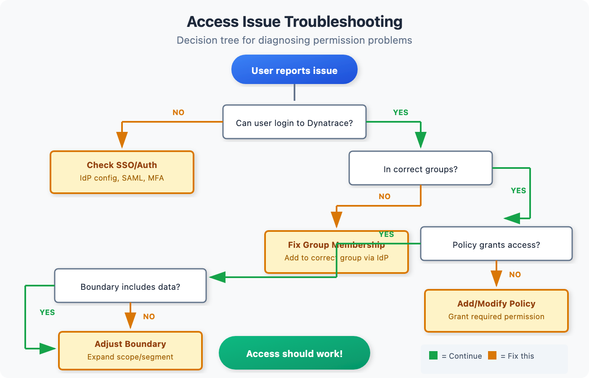

# IAM-09: Troubleshooting Access Issues

> **Series:** IAM — IAM Administration | **Notebook:** 9 of 12 | **Created:** January 2026 | **Last Updated:** 04/25/2026

## Systematic Diagnosis of IAM Problems
Access issues are among the most common support requests. This notebook provides a systematic methodology for diagnosing and resolving IAM-related problems including permission denials, policy conflicts, and boundary issues.

---

## Table of Contents

1. [Troubleshooting Methodology](#troubleshooting-methodology)
2. [Common Access Issues](#common-access-issues)
3. [Permission Denied Debugging](#permission-denied-debugging)
4. [Policy Conflict Resolution](#policy-conflict-resolution)
5. [Boundary Troubleshooting](#boundary-troubleshooting)
6. [SSO and Authentication Issues](#sso-and-authentication-issues)
7. [Token and API Access Issues](#token-and-api-access-issues)
8. [Diagnostic Queries](#diagnostic-queries)
9. [Troubleshooting Checklist](#troubleshooting-checklist)
10. [Escalation Path](#escalation-path)
11. [Series Conclusion](#series-conclusion)

---

## Prerequisites

| Requirement | Details |
|-------------|----------|
| **Dynatrace Environment** | SaaS with Gen3 IAM |
| **Permissions** | `account-iam-admin` for full diagnosis |
| **Knowledge** | IAM-01 through 08 completed |

<a id="troubleshooting-methodology"></a>
## 1. Troubleshooting Methodology
Follow a systematic approach to diagnose access issues.


<!-- MARKDOWN_TABLE_ALTERNATIVE
| Step | Question | If Yes | If No |
|------|----------|--------|-------|
| 1 | Can user login? | Go to step 2 | Check SSO/auth |
| 2 | Is user in correct groups? | Go to step 3 | Add to group |
| 3 | Do policies grant access? | Go to step 4 | Modify policy |
| 4 | Do boundaries allow access? | Check other issues | Adjust boundary |
-->

### Step-by-Step Methodology

| Step | Check | Tools |
|------|-------|-------|
| 1 | User can authenticate | SSO logs, IdP logs |
| 2 | User exists in Dynatrace | Account Management → Users |
| 3 | User is in correct groups | Account Management → Groups |
| 4 | Groups have correct policies | Account Management → Policies |
| 5 | Policies grant required permissions | Policy viewer |
| 6 | Boundaries don't restrict access | Boundary configuration |
| 7 | No conflicting policies | Policy evaluation |
| 8 | Data exists and is accessible | DQL query |

### Information Gathering

Before troubleshooting, collect:

```
User Information:
□ User's email address
□ What action they're trying to perform
□ Exact error message received
□ When the issue started
□ What changed recently (role, team, etc.)

Environment Information:
□ Which environment(s) affected
□ What data/resource they're accessing
□ Screenshot of error (if available)
```

<a id="common-access-issues"></a>
## 2. Common Access Issues
### Issue Categories

| Category | Symptoms | Common Cause |
|----------|----------|---------------|
| **Authentication** | Can't login | SSO misconfigured, account disabled |
| **Authorization** | Access denied | Missing policy, wrong group |
| **Data Access** | No results | Boundary restriction, no data |
| **Partial Access** | See some, not all | Segment restrictions |
| **Intermittent** | Sometimes works | Caching, eventual consistency |

### Quick Diagnosis Table

| Symptom | Likely Cause | First Check |
|---------|--------------|-------------|
| "Access Denied" | Missing permission | Policy assignments |
| "Forbidden" | Boundary restriction | Boundary config |
| "Not Found" | No data or no access | Query without filters |
| "Unauthorized" | Token/auth issue | Token validity |
| Can't see entity | Segment restriction | Segment coverage |
| Can read, can't write | Read-only policy | Policy permissions |

<a id="permission-denied-debugging"></a>
## 3. Permission Denied Debugging
When users receive "Access Denied" or "Forbidden" errors.

### Diagnostic Steps

**Step 1: Verify User Exists**

1. Go to Account Management → Users
2. Search for user by email
3. Verify account is active (not disabled)

**Step 2: Check Group Membership**

1. Click on user to view details
2. Note all groups user belongs to
3. Verify expected groups are present

**Step 3: Review Group Policies**

1. For each group, check assigned policies
2. Verify policies grant needed permissions
3. Check policy conditions/restrictions

**Step 4: Check Boundaries**

1. Review boundaries assigned to groups
2. Verify boundaries include target resources
3. Check boundary conditions

### Permission Evaluation Order

```
1. User authenticated? → No = Auth failure
2. User in any groups? → No = No permissions
3. Any policy grants permission? → No = Access denied
4. Any boundary restricts? → Yes = Check boundary scope
5. Access granted
```

### Common Permission Issues

| Issue | Symptom | Resolution |
|-------|---------|------------|
| Not in group | No access at all | Add user to group via IdP |
| Wrong group | Partial access | Move to correct group |
| Policy too restrictive | Can't perform action | Modify or add policy |
| Missing environment | Can't access env | Add env to policy scope |

<a id="policy-conflict-resolution"></a>
## 4. Policy Conflict Resolution
When multiple policies interact unexpectedly.

### How Policy Evaluation Works

1. Collect all policies from all user's groups
2. Evaluate each policy's conditions
3. **Any ALLOW** = access granted (unless explicitly denied)
4. **No matching ALLOW** = access denied

### Conflict Scenarios

| Scenario | Policy A | Policy B | Result |
|----------|----------|----------|--------|
| Both allow | ALLOW read | ALLOW write | ALLOW both |
| One allows | ALLOW read | No match | ALLOW read |
| Overlapping | ALLOW all envs | ALLOW prod only | ALLOW all envs |
| Condition mismatch | ALLOW (condition: A) | ALLOW (condition: B) | Depends on conditions |

### Debugging Policy Conflicts

**Step 1: List All Applicable Policies**

1. Identify all groups user belongs to
2. List all policies assigned to those groups
3. Note overlapping permissions

**Step 2: Evaluate Each Policy**

For each policy, check:
- Does it apply to the target resource?
- Does it grant the required permission?
- Are conditions met?

**Step 3: Identify Conflict**

| Conflict Type | Indicator | Resolution |
|---------------|-----------|------------|
| Unintended restriction | User in wrong group | Remove from group |
| Missing permission | No policy grants access | Add policy |
| Condition not met | Policy exists but doesn't apply | Adjust condition |
| Scope mismatch | Policy applies to wrong scope | Correct scope |

<a id="boundary-troubleshooting"></a>
## 5. Boundary Troubleshooting
Boundaries restrict what data users can access within their permissions.

### Boundary Evaluation

```
User wants to access data
  ↓
Policy grants permission? → No = Access denied
  ↓ Yes
User has boundary assigned? → No = Access all data
  ↓ Yes
Data within boundary scope? → No = Data hidden
  ↓ Yes
Data returned
```

### Common Boundary Issues

| Issue | Symptom | Cause | Resolution |
|-------|---------|-------|------------|
| Too restrictive | See no data | Boundary too narrow | Expand boundary |
| Not restrictive enough | See too much | Boundary too broad | Narrow boundary |
| Segment mismatch | Some data missing | Segment doesn't match | Fix segment definition |
| Environment excluded | No env access | Env not in boundary | Add environment |

### Boundary Debugging Steps

**Step 1: Identify Boundary**

1. Find user's groups
2. Check boundaries assigned to groups
3. Note boundary scope (environment, storage, settings)

**Step 2: Verify Boundary Scope**

For each domain:
- **Environment**: Which environments included?
- **Storage**: Which data types included?
- **Settings**: Which settings accessible?

**Step 3: Test Without Boundary**

Temporarily:
1. Add user to unbounded admin group
2. Test if access works
3. If yes, boundary is the issue
4. Remove from admin group

**Step 4: Adjust Boundary**

Modify boundary to include:
- Missing environments
- Missing segments
- Missing data types

<a id="sso-and-authentication-issues"></a>
## 6. SSO and Authentication Issues
When users can't login at all.

### SSO Troubleshooting

| Symptom | Check | Resolution |
|---------|-------|------------|
| Redirect loop | IdP configuration | Verify ACS URL |
| SAML error | SAML response | Check attribute mapping |
| User not found | JIT provisioning | Enable auto-provisioning |
| MFA failure | MFA configuration | Verify MFA setup |
| Session expired | Session settings | Extend session duration |

### SAML Debugging

**Check SAML Response:**

1. Use browser dev tools → Network
2. Find SAML response during login
3. Decode and verify:
   - Subject/NameID (email)
   - Groups attribute
   - Conditions (timestamps)

**Common SAML Issues:**

| Issue | Indicator | Fix |
|-------|-----------|-----|
| Wrong NameID | Email doesn't match | Configure NameID format |
| Missing groups | Groups not in assertion | Add groups attribute in IdP |
| Expired assertion | Time mismatch | Sync clocks, extend validity |
| Invalid signature | Signature error | Update IdP certificate |

### Group Mapping Issues

If user logs in but has wrong permissions:

1. Check SAML groups in assertion
2. Verify group mapping configuration
3. Confirm IdP group names match exactly
4. Check for case sensitivity

<a id="token-and-api-access-issues"></a>
## 7. Token and API Access Issues
When API tokens or OAuth clients don't work as expected.

### Token Issues

| Error | Cause | Resolution |
|-------|-------|------------|
| `401 Unauthorized` | Token invalid/expired | Regenerate token |
| `403 Forbidden` | Missing scope | Add required scope |
| `404 Not Found` | Wrong endpoint or no data | Verify API path |
| Token rejected | Token revoked | Create new token |

### Token Debugging Steps

**Step 1: Verify Token Valid**

1. Check token hasn't expired
2. Verify token not revoked
3. Confirm token is for correct environment

**Step 2: Check Scopes**

1. List token's scopes
2. Compare to required scopes for API
3. Add missing scopes if needed

**Step 3: Test with curl**

```bash
curl -H "Authorization: Api-Token <TOKEN>" \
  https://<env>.live.dynatrace.com/api/v2/entities
```

### OAuth Client Issues

| Issue | Check | Resolution |
|-------|-------|------------|
| Can't get token | Client credentials | Verify client ID/secret |
| Wrong permissions | Client scopes | Add required scopes |
| Token expired | Token lifetime | Request new token |

<a id="diagnostic-queries"></a>
## 8. Diagnostic Queries
DQL queries to help diagnose IAM issues.

```dql
// Find recent access denied events for specific user
fetch logs, from: now() - 24h
| filter matchesPhrase(log.source, "audit")
| filter matchesPhrase(content, "denied") or matchesPhrase(content, "forbidden")
| fields timestamp, content
| sort timestamp desc
| limit 50
```

```dql
// User's recent authentication events
fetch logs, from: now() - 7d
| filter matchesPhrase(log.source, "audit")
| filter matchesPhrase(content, "login") or matchesPhrase(content, "authentication")
| fields timestamp, content
| sort timestamp desc
| limit 100
```

```dql
// Failed authentication attempts
fetch logs, from: now() - 7d
| filter matchesPhrase(log.source, "audit")
| filter matchesPhrase(content, "failed") and (matchesPhrase(content, "login") or matchesPhrase(content, "authentication"))
| fields timestamp, content
| sort timestamp desc
| limit 50
```

```dql
// Recent policy or group changes that might affect access
fetch logs, from: now() - 7d
| filter matchesPhrase(log.source, "audit")
| filter (matchesPhrase(content, "policy") or matchesPhrase(content, "group") or matchesPhrase(content, "boundary"))
| filter matchesPhrase(content, "modified") or matchesPhrase(content, "created") or matchesPhrase(content, "deleted")
| fields timestamp, content
| sort timestamp desc
| limit 50
```

```dql
// Token-related events
fetch logs, from: now() - 7d
| filter matchesPhrase(log.source, "audit")
| filter matchesPhrase(content, "token")
| fields timestamp, content
| sort timestamp desc
| limit 50
```

```dql
// All audit events in last getHour(for immediate troubleshooting)
fetch logs, from: now() - 1h
| filter matchesPhrase(log.source, "audit")
| fields timestamp, content
| sort timestamp desc
| limit 200
```

<a id="troubleshooting-checklist"></a>
## Troubleshooting Checklist
Use this checklist when debugging access issues:

```
AUTHENTICATION
□ User can access IdP login page
□ User can authenticate with IdP
□ SAML assertion is valid
□ User account exists in Dynatrace
□ User account is active (not disabled)

GROUP MEMBERSHIP
□ User is in expected groups
□ Groups are synced from IdP (if using SCIM/JIT)
□ No unexpected group memberships

POLICIES
□ Groups have policies assigned
□ Policies grant required permissions
□ Policy conditions are met
□ No conflicting policies

BOUNDARIES
□ Boundary includes target environment
□ Boundary includes target data type
□ Segment definitions are correct
□ No overly restrictive boundaries

DATA
□ Data exists in target timeframe
□ Data matches segment criteria
□ Query syntax is correct
```

<a id="escalation-path"></a>
## Escalation Path
When self-service troubleshooting doesn't resolve the issue:

| Level | Who | When |
|-------|-----|------|
| L1 | Team lead | Can't determine cause |
| L2 | IAM admin | Need policy/boundary changes |
| L3 | Platform team | Infrastructure/IdP issues |
| L4 | Dynatrace support | Product issues |

### Information for Escalation

Include in escalation:

```
□ User email/identifier
□ Exact error message
□ Steps to reproduce
□ Timestamp of issue
□ What was already checked
□ Audit log excerpts
□ Screenshots
```

<a id="series-conclusion"></a>
## Series Conclusion
Congratulations! You've completed the IAM series.

### Series Recap

| Notebook | Key Topics |
|----------|------------|
| **01: Governance Foundations** | Framework, roles, models |
| **02: SSO and Authentication** | SAML, IdP integration, MFA |
| **03: Group Architecture** | Hierarchy, naming, SAML mapping |
| **04: Policy Authoring** | Syntax, conditions, GitOps |
| **05: Boundary Design** | Three domains, isolation patterns |
| **06: User Lifecycle** | SCIM, JIT, tokens |
| **07: Audit and Compliance** | Audit queries, SOC2/SOX/HIPAA |
| **08: Multi-Environment** | Account vs env, break-glass |
| **09: Troubleshooting** | Methodology, common issues |
| **10: Templated Policy-Group Assignments** | Parameterized policies, IAM API bindings, Monaco |
| **11: Policy Persona Workshop** | Persona-based policy design, schema audit, domain mapping |

### Ongoing Maintenance

| Task | Frequency |
|------|----------|
| Access reviews | Quarterly |
| Policy review | Semi-annually |
| Boundary review | Semi-annually |
| Token rotation | Per policy (90 days typical) |
| Audit log review | Monthly |
| Documentation update | As needed |

---

## Summary

In this notebook, you learned:

- Systematic troubleshooting methodology
- Common access issue categories
- Permission denied debugging steps
- Policy conflict identification and resolution
- Boundary troubleshooting techniques
- SSO and authentication debugging
- Token and API access troubleshooting
- Diagnostic DQL queries

---

## References

- [IAM Troubleshooting](https://docs.dynatrace.com/docs/manage/identity-access-management)
- [SAML Configuration](https://docs.dynatrace.com/docs/manage/identity-access-management/user-management/single-sign-on)
- [API Authentication](https://docs.dynatrace.com/docs/manage/identity-access-management/access-tokens-and-oauth-clients)

---

<sub>*This notebook was AI-generated from community-submitted and publicly available sources. This notebook series is not officially supported by Dynatrace. Always verify information against official Dynatrace documentation.*</sub>
