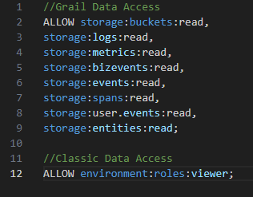
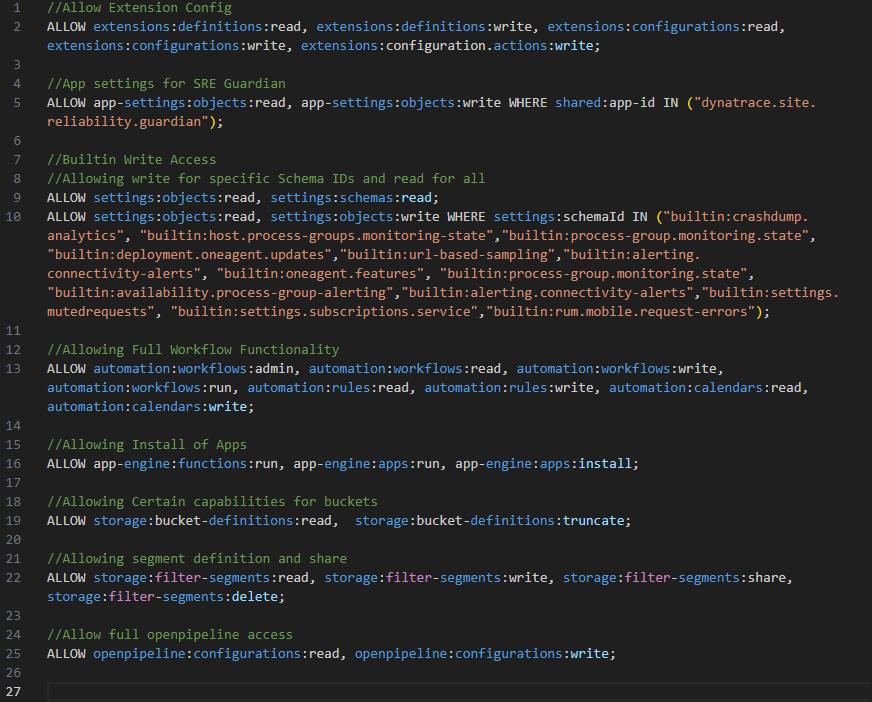
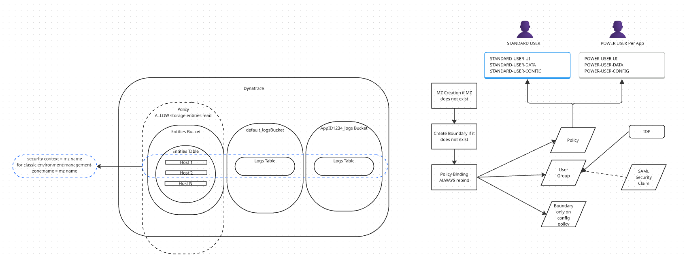

# IAM-11: Policy Persona Workshop

> **Series:** IAM — IAM Administration | **Notebook:** Bonus Workshop | **Created:** February 2026 | **Last Updated:** 03/05/2026

## Overview

Every enterprise has distinct roles — application developers, SREs, platform engineers, security teams — each needing different levels of access to Dynatrace. A **persona-based permissions model** maps these roles to standardized policies across three domains: UI visibility, data access, and configuration control.

This workshop walks you through a structured, six-goal process to design that model for your organization. You will identify personas, align them with your identity provider, audit the Dynatrace UI for schema-level permissions, define data boundaries, and compose the policies that enforce your design.

> **Workshop Format:** This is a hands-on planning exercise that synthesizes concepts from **IAM-01** through **IAM-10**. Work through each goal sequentially, filling in the templates for your organization. Bring your AD team, security lead, and platform owners into the conversation.

---

## Table of Contents

1. [Tips and Key Principles](#tips-and-principles)
2. [Procedure: Building Your Permissions Model](#procedure)
   - [Goal 1: Identify Personas](#goal-1-personas)
   - [Goal 2: Active Directory Alignment](#goal-2-active-directory)
   - [Goal 3: Configuration Schema Audit](#goal-3-ui-audit)
   - [Goal 4: App Visibility by Persona](#goal-4-ui-audit-persona)
   - [Goal 5: Data Requirements](#goal-5-data-requirements)
   - [Goal 6: Configuration Policy Design](#goal-6-config-policy)
3. [Writing Policies](#writing-policies)
4. [Naming Standards](#naming-standards)
5. [Policy Flow and Examples](#policy-flow)
6. [Validating Your Design](#validating-design)
7. [End-to-End Provisioning Script](#provisioning-script) *(→ IAM-12)*
8. [Appendix](#appendix)

---

## Prerequisites

| Requirement | Details |
|-------------|----------|
| **Dynatrace Environment** | SaaS with Gen3 IAM enabled |
| **Permissions** | `account-iam-admin` to create/modify policies and group assignments |
| **Prior Knowledge** | **IAM-01** (Governance), **IAM-02** (SSO), **IAM-03** (Groups), **IAM-04** (Policies), **IAM-05** (Boundaries) |
| **Administrative Access** | Access to Active Directory or identity provider |
| **Business Context** | Knowledge of role definitions in your organization |

> **Recommended Reading:** Complete **IAM-06** (User Lifecycle) and **IAM-10** (Templated Policy Assignments) before this workshop for the full context on provisioning and parameterized policies.

## Learning Objectives

By the end of this workshop, you will:

- Identify and consolidate personas relevant to your Dynatrace deployment
- Align personas with Active Directory groups and a provisioning strategy
- Audit the Dynatrace UI to map configuration schemas to per-persona permissions
- Define data access requirements per persona using boundaries and segments
- Design configuration policies following the three-domain model (UI, Data, Config)
- Apply naming standards for policies, groups, and boundaries
- Validate your IAM design using DQL audit queries

<a id="tips-and-principles"></a>

## Tips and Key Principles

Every company is different. The size of the user population and the division of responsibility can alter your approach. However, several rules are constant:

* **DEFAULT USER permissions apply to everyone** — Any permission granted to the default user group affects every user in your organization, including new hires provisioned via SCIM. Audit this group first. See **IAM-04** for policy evaluation order.

* **DENY trumps any ALLOW — use it sparingly** — A single DENY statement overrides all ALLOW statements for the same resource, regardless of which group it comes from. This means DENY in a broadly-scoped group (like Standard Users or Default Users) will **break composability** — a user who belongs to both Standard and Power User groups would be blocked by the Standard group's DENY, even though the Power User group grants ALLOW. **Use implicit deny instead:** simply omit the ALLOW for permissions you don't want to grant. Reserve explicit DENY only for narrowing a broad ALLOW within the *same* policy (e.g., "ALLOW write on all schemas EXCEPT this sensitive one"). This is covered in detail in **IAM-04: Policy Authoring**.

* **At minimum, distinguish "Standard" and "Power User" tiers** — Standard users view data and dashboards; power users can modify alerting thresholds, create workflows, and change configuration. Only trained individuals should hold power-user or admin access.

* **Grant the minimum necessary** — Every additional permission is an additional risk. Start restrictive and widen on request rather than starting wide and trying to lock down later.

* **Balance group count vs. administrative overhead** — More groups give finer control but require more maintenance (policy updates, membership reviews, SCIM mappings). Too few groups force you to over-grant. Aim for 5-10 groups in a typical mid-size deployment. See **IAM-03: Group Architecture** for patterns.

* **Use templated policies to scale** — When multiple teams need similar permissions with different scopes, use `${bindParam:...}` parameters instead of duplicating policies. See **IAM-10: Templated Policy Assignments**.

<a id="procedure"></a>

## Procedure: Building Your Permissions Model

The six goals below guide you from raw role identification through to tested, deployable policies. Each goal produces a specific deliverable that feeds the next goal.

<a id="goal-1-personas"></a>

### Goal 1: Identify Personas Within the Enterprise

A **persona** is a category of user defined by their job function and the Dynatrace capabilities they need. Start by listing every distinct role that interacts with Dynatrace, then consolidate overlapping roles into a manageable set of personas.

#### Step 1: Brainstorm Roles

Interview team leads, review existing AD groups, and check who currently has Dynatrace access. List every role, even if they seem similar:

* Application developer who monitors their own service
* Application developer who sets alerting thresholds for their team
* SRE responsible for multiple services in one business unit
* SRE responsible for cross-cutting infrastructure (networking, DNS, load balancers)
* Platform engineer managing OpenShift/Kubernetes clusters on-premise
* Cloud operations engineer managing AWS/Azure/GCP resources
* Security analyst reviewing access logs and vulnerability data
* Dynatrace administrator with full platform management

#### Step 2: Consolidate Into Personas

Group similar roles into a smaller set. Two developers who differ only by team can share a persona; an SRE who also manages infrastructure may need a separate one. Typical consolidation:

| Raw Role | Consolidated Persona |
|----------|---------------------|
| App dev (view only) | **Standard User** |
| App dev (sets thresholds) | **Power User** |
| SRE for one org | **SRE - Scoped** |
| SRE cross-cutting | **SRE - Platform** |
| Security analyst | **Security Viewer** |
| DT admin | **Admin** |

#### Step 3: Build Your Personas Table

Create a single-row table with one column per consolidated persona. This table will be your column header for the permission matrices in Goals 3-6. Fill each cell with a short label you will use consistently throughout this workshop and in your policy/group names.

| Standard User | Power User | SRE - Scoped | SRE - Platform | Security Viewer | Admin |
|:---:|:---:|:---:|:---:|:---:|:---:|
| *View dashboards, run queries* | *Modify alerting, create notebooks* | *Full ops for assigned apps* | *Infrastructure-wide ops* | *Read-only audit and security data* | *Full platform management* |

> **Tip:** Keep it to 4-7 personas. Fewer than 4 usually means you are over-granting; more than 7 becomes hard to maintain. You can always split a persona later.

#### Deliverable

A finalized personas table with clear labels and one-line scope descriptions.

#### Finding Available Configuration Schemas

Before auditing permissions, you need to know which schemas exist. Every settings screen in the **classic (Gen2) Dynatrace UI** is backed by a schema (e.g., `builtin:anomaly-detection.metric-events`). These schemas are still in use today but will eventually be phased out as Gen3 **apps** fully replace them. Gen3 apps have their own independent access control via `app:` permissions (covered in Goal 4).

Until that transition is complete, you still need to audit and manage classic schema-level permissions. You can discover schemas in three ways:

1. **In the UI** — Navigate to **Settings** and open any settings page. The **Schema ID** and **Schema Group** appear in the upper-right corner of the page.
2. **Via search** — Use the settings search bar to find schemas by keyword (e.g., search "alerting" to find all alerting-related schemas).
3. **Via the API** — Call `GET /api/v2/settings/schemas` (requires `settings.read` scope) to get the full list programmatically.

The following code retrieves all schemas programmatically. Paste it into a **notebook code cell** (JavaScript/TypeScript) to run it directly:

```javascript
import { settingsSchemasClient } from "@dynatrace-sdk/client-classic-environment-v2";
export default async function() {
    const includeCriteria = ['']; // filter by raw text here
    const data = await settingsSchemasClient.getAvailableSchemaDefinitions();
    const schemaSet = data.items;
    const schemas = schemaSet.filter(schema =>
        includeCriteria.some(substring => schema.schemaId.includes(substring))
    );
    const result = [];
    for (const schema of schemas) {
        const id = schema.schemaId;
        const displayName = schema.displayName;
        result.push({ id, displayName });
    }
    return result;
}
```

> **Tip:** Set `includeCriteria` to filter results — e.g., `['anomaly', 'alerting']` to find only anomaly detection and alerting schemas. Use `['']` to return all schemas.

<a id="goal-2-active-directory"></a>

### Goal 2: Align with Active Directory Strategy

Each consolidated persona needs a corresponding group in your identity provider. Before creating groups, answer these questions with your AD/IdP team:

**Group logistics:**
* Are there limits on the number of groups you can create?
* Must groups live under a specific enterprise application registration?
* Will each application team own their own AD groups, or will a central team manage them?
* Who approves group membership requests?

**SAML/OIDC integration:**
* What attributes does your IdP return in the SAML assertion or OIDC token?
* Can you include group membership as a claim? (Required for automated group mapping — see **IAM-02: SSO Authentication**)

**Provisioning method** (see **IAM-06: User Lifecycle**):
* **SCIM** — Automated sync from your IdP. Best for large deployments.
* **JIT (Just-In-Time)** — Users are created on first SSO login. Simpler but less control.
* **Manual** — Invite by email via the Dynatrace UI. Only suitable for admin/break-glass accounts.

#### Deliverable

A mapping table showing each persona, its AD group, and the provisioning method:

| Persona | AD Group Name | Provisioning | Approval | Notes |
|---------|---------------|--------------|----------|-------|
| Standard User | `DT-Standard-Users` | SCIM | Auto | Default for all Dynatrace users |
| Power User | `DT-Power-Users` | SCIM | Manager | Requires Dynatrace training completion |
| SRE - Scoped | `DT-SRE-<OrgName>` | SCIM | Team lead | One group per org/team |
| SRE - Platform | `DT-SRE-Platform` | SCIM | Platform lead | Cross-cutting infrastructure |
| Security Viewer | `DT-Security-Viewers` | SCIM | Security lead | Read-only audit access |
| Admin | `DT-Admins` | Manual | CISO + quarterly review | Break-glass; see **IAM-08** |

<a id="goal-3-ui-audit"></a>

### Goal 3: Audit the Dynatrace UI for Configuration Permissions

This goal covers **classic (Gen2) settings schemas** — the configuration screens found under Settings in Dynatrace. These schemas are still actively used but are being progressively replaced by Gen3 apps with independent access control (see Goal 4 for app-level permissions).

Walk through the Dynatrace settings UI and catalog which configuration schemas each persona needs access to. This is the most time-intensive goal — budget 1-2 hours for a thorough audit.

**How to build the audit table:**

1. Open Dynatrace **Settings** and navigate through each category: **Host** → **Process** → **Service** → **Web Applications** → **Synthetic** → **Anomaly Detection** → etc.
2. For each settings screen, note the **Schema ID** (top-right corner) and the **Schema Group** (breadcrumb path).
3. Add a row to the table below and assign a permission level per persona:
   - **none** — Persona cannot see this setting at all
   - **read** — Persona can view but not modify
   - **write** — Persona can read and modify

> **Tip:** Start with the defaults: Standard Users get **read** on most schemas and **none** on sensitive ones. Admins get **write** on everything. Then adjust the middle tiers.

#### Reference: Schema Audit Table

Create your own table and update the personas for your organization. Below is a starter template with common **classic (Gen2) schemas**. As Gen3 apps replace these settings screens, update your policies to use `app:` permissions instead:

| Functionality | Schema ID | Schema Group | Standard User | Power User | SRE - Scoped | SRE - Platform | Admin |
|---|---|---|:---:|:---:|:---:|:---:|:---:|
| Host monitoring | `group:host-monitoring` | `group:host-monitoring` | read | read | write | write | write |
| Containers | `group:processes-and-containers.containers` | `group:processes-and-containers` | read | read | write | write | write |
| Preferences | `group:preferences` | `group:preferences` | read | write | write | write | write |
| General monitoring | `group:monitoring` | `group:monitoring` | read | write | write | write | write |
| Process group state | `builtin:process-group.monitoring.state` | N/A | read | write | write | write | write |
| OneAgent features | `builtin:oneagent.features` | `group:preferences` | read | write | write | write | write |
| Anomaly detection | `group:anomaly-detection` | `group:anomaly-detection.infrastructure` | read | write | write | write | write |
| OneAgent updates | `builtin:deployment.oneagent.updates` | `group:updates` | read | write | write | write | write |
| OS services monitoring | `builtin:os-services-monitoring` | `group:monitoring` | read | read | read | write | write |
| Log monitoring | `group:log-monitoring` | `group:log-monitoring.ingest-and-processing` | read | read | read | write | write |
| Network & discovery | `group:network-and-discovery` | `group:monitoring` | read | read | read | write | write |
| Failure detection | `group:failure-detection` | `group:failure-detection` | read | write | write | write | write |
| Privacy settings | `group:privacy-settings` | `group:preferences` | read | read | write | write | write |
| RUM settings | `group:rum-settings` | `group:rum-settings` | read | write | write | write | write |
| RUM injection | `group:rum-injection` | `group:rum-injection` | read | read | read | read | write |
| Web & mobile monitoring | `group:web-and-mobile-monitoring` | `group:web-and-mobile-monitoring` | read | write | write | write | write |

#### Gen3 Platform Permissions

Beyond classic settings schemas, Gen3 introduces platform-level permissions that control access to newer capabilities:

| Capability | Standard User | Power User | SRE | Admin |
|---|:---:|:---:|:---:|:---:|
| Anomaly Detector — Create | none | none | write | write |
| Extensions — Create | none | none | read | write |
| Site Reliability Guardian — Read | read | read | read | read |
| Synthetic HTTP & NAM — Create | none | write | write | write |
| Segments — Read | read | read | read | read |
| Segments — Create/Edit | none | none | write | write |

#### Deliverable

A completed schema audit table with a permission level in every cell. This drives your **configuration policies** in Goal 6.

<a id="goal-4-ui-audit-persona"></a>

### Goal 4: Audit the UI for Each Persona's App Visibility

Separate from configuration schemas, determine which **Dynatrace apps and views** each persona should see in the navigation. Hiding apps that a persona does not need reduces cognitive load and prevents accidental changes.

Walk through the Dynatrace left-hand navigation and fill in this matrix:

| App / View | Standard User | Power User | SRE | Admin |
|------------|:---:|:---:|:---:|:---:|
| Dashboards | View shared | View + Create | View + Create | Full |
| Notebooks | View shared | View + Create | View + Create | Full |
| Workflows | Hidden | View | View + Create | Full |
| Extensions | Hidden | Hidden | View | Full |
| Settings | Hidden | Limited | Scoped | Full |
| Account Management | Hidden | Hidden | Hidden | Full |
| Security Overview | Hidden | Hidden | View | Full |
| Release Management | View | View | View + Manage | Full |

Gen3 UI policies use three services together:

- `app-engine:apps:run` — Controls whether a persona can **see** an app in the navigation. Works for both Gen3 apps and Gen2 classic screens. Use `shared:app-id` to target specific apps.
- `document:` — Controls what the persona can **do** with dashboards and notebooks (read, write, create, delete, share)
- `environment:roles:viewer` — Grants baseline read access to the environment

```
// Grant baseline environment viewer role
ALLOW environment:roles:viewer;

// Make specific Gen3 apps visible — apps not listed here are implicitly hidden
ALLOW app-engine:apps:run WHERE shared:app-id IN ("dynatrace.notebooks", "dynatrace.dashboards");

// Grant access to a Gen2 (classic) screen
ALLOW app-engine:apps:run WHERE shared:app-id IN ("dynatrace.classic.synthetic");

// Allow viewing documents only — write/create/delete are implicitly denied
// (do NOT use DENY here — it would override ALLOWs from other groups)
ALLOW document:documents:read;
```

> **Key distinction:** `app-engine:apps:run` controls app visibility for both Gen3 apps (e.g., `dynatrace.dashboards`) and Gen2 classic screens (e.g., `dynatrace.classic.synthetic`). `document:documents:read` lets the persona open and view dashboard/notebook content. Both are needed for a persona to use dashboards.

#### Discovering Installed Apps

To build your visibility matrix, you need to know which apps are installed. Use the **App Engine Registry API** to get a complete list of active, runnable apps in your environment:

```bash
GET /platform/app-engine/registry/v1/apps?include-deactivated=false&include-non-runnable=false&include-all-app-versions=false
```

This requires a bearer token with appropriate scopes. The response includes every app's ID (e.g., `dynatrace.dashboards`, `dynatrace.notebooks`, `dynatrace.classic.synthetic`) — use these IDs directly in your `app-engine:apps:run WHERE shared:app-id` policy statements.

See **IAM-04: Policy Authoring** for the full `app-engine:apps:run` and `document:` permission syntax.

#### Deliverable

A completed app visibility matrix. This becomes the basis for your **UI policies**.

<a id="goal-5-data-requirements"></a>

### Goal 5: Determine Data Requirements Per Persona

Beyond configuration and UI access, determine what **data** each persona should see. This drives your **data policies** and **boundary** design (see **IAM-05: Boundary Design Patterns**).

Consider five dimensions:

| Dimension | Question to Answer |
|-----------|-------------------|
| **Scope** | Should this persona see data from all applications, or only their team's? |
| **Data domains** | Which data types: metrics, logs, traces, events, business events? |
| **Boundaries** | Which Dynatrace boundaries restrict their data view? |
| **Sensitive fields** | Do they need access to fieldsets like `builtin-sensitive-spans`? (See [Appendix](#appendix)) |
| **Bucket scoping** | Should data access be limited to specific Grail buckets (e.g., `prod_logs` only)? |

#### Data Access Matrix Template

| Persona | Metrics | Logs | Traces | Events | Boundary Scope | Sensitive Fields |
|---------|:---:|:---:|:---:|:---:|----------------|:---:|
| Standard User | All | Own apps | Own apps | All | App boundary | No |
| Power User | All | All | All | All | Environment-wide | No |
| SRE - Scoped | All | Own org | Own org | All | Org boundary | Yes |
| SRE - Platform | All | All | All | All | No restriction | Yes |
| Security Viewer | None | Audit only | None | Security events | Audit bucket only | No |
| Admin | All | All | All | All | No restriction | Yes |

#### Deliverable

A completed data access matrix. This becomes the basis for your **data policies** and **boundary assignments**.

<a id="goal-6-config-policy"></a>

### Goal 6: Design Configuration Policies Per Persona

With your schema audit (Goal 3), app visibility (Goal 4), and data requirements (Goal 5) complete, translate each row of those matrices into policy statements.

For each persona, create one policy per domain (UI, Data, Config). Use the schema IDs from your Goal 3 audit table directly in the `WHERE` clauses.

#### Configuration Policy Examples

```
// GLOBAL-Standard-Config
// Standard Users: read-only access to all settings
// Write access is implicitly denied — no ALLOW means no access
ALLOW settings:objects:read, settings:schemas:read;
```

```
// GLOBAL-PowerUser-Config
// Power Users: read all settings, write only alerting and notifications
ALLOW settings:objects:read, settings:schemas:read;
ALLOW settings:objects:read, settings:objects:write, settings:schemas:read
  WHERE settings:schemaId startsWith "builtin:alerting.profile";
ALLOW settings:objects:read, settings:objects:write, settings:schemas:read
  WHERE settings:schemaId startsWith "builtin:problem.notifications";
ALLOW settings:objects:read, settings:objects:write, settings:schemas:read
  WHERE settings:schemaId startsWith "group:preferences";
```

```
// ORG1-SRE-Config (use templated policy from IAM-10 if multiple orgs)
// SREs: full settings access scoped by schema group
ALLOW settings:objects:read, settings:schemas:read;
ALLOW settings:objects:read, settings:objects:write, settings:schemas:read
  WHERE settings:schemaId startsWith "group:host-monitoring";
ALLOW settings:objects:read, settings:objects:write, settings:schemas:read
  WHERE settings:schemaId startsWith "group:anomaly-detection";
ALLOW settings:objects:read, settings:objects:write, settings:schemas:read
  WHERE settings:schemaId startsWith "group:failure-detection";
ALLOW settings:objects:read, settings:objects:write, settings:schemas:read
  WHERE settings:schemaId startsWith "group:processes-and-containers";
```

> **Scaling tip:** If you have multiple orgs that need the same SRE config policy with different data scopes, create a **templated policy** with `${bindParam:team}` and bind it per-group. See **IAM-10**.

#### Deliverable

A policy statement (or template reference from **IAM-10**) for each persona covering configuration access. You should have 3 policies per persona (UI + Data + Config) = typically 15-21 policy documents total.

<a id="writing-policies"></a>

## Writing Policies

Now that you have deliverables from all six goals, assemble the actual policies. Keep each policy focused on a single domain. Resist the temptation to combine UI, data, and config permissions into one large policy — separate policies are easier to audit, reuse, and update independently.

### The Three Policy Domains

Every persona needs at least one policy in each domain:

**UI Policy** — Controls which Dynatrace apps the persona can see in the navigation (`app-engine:apps:run` service with `shared:app-id`), baseline environment access (`environment:roles:viewer`), and what they can do with documents like dashboards and notebooks (`document:` service).

**Data Policy** — Controls which data (metrics, logs, traces, events) is returned when the persona queries the platform. Scoped by boundaries, buckets, or security context.



<!-- MARKDOWN_TABLE_ALTERNATIVE
| Domain | Description |
|--------|-------------|
| Data Policy | Controls what data (metrics, logs, traces, events) is returned to a persona when using the platform |
| Scope mechanisms | Boundaries, bucket names, security context, entity selectors |
| Key permissions | storage:logs:read, storage:metrics:read, storage:spans:read, storage:events:read |
For environments where images don't render
-->

**Config Policy** — Controls which settings and configurations the persona can read or modify. Scoped by schema ID or schema group.



<!-- MARKDOWN_TABLE_ALTERNATIVE
| Domain | Description |
|--------|-------------|
| Config Policy | Controls what settings and configurations a persona can read or modify |
| Scope mechanisms | settings:schema-id, settings:schema-group |
| Key permissions | settings:objects:read, settings:objects:write |
For environments where images don't render
-->

### Assembling a Complete Persona Policy Set

For each persona, compose three policy documents using your deliverables from Goals 3-6:

| Step | Input | Output Policy |
|------|-------|---------------|
| 1 | Goal 4 app visibility matrix | `<SCOPE>-<PERSONA>-UI` |
| 2 | Goal 5 data access matrix | `<SCOPE>-<PERSONA>-Data` |
| 3 | Goal 3 schema audit + Goal 6 config design | `<SCOPE>-<PERSONA>-Config` |

**Example: Complete Standard User policy set**

```
// GLOBAL-Standard-UI
// Baseline environment access
ALLOW environment:roles:viewer;
// App visibility — only these apps appear in the navigation
// All other apps (Settings, Account Management, etc.) are implicitly hidden
ALLOW app-engine:apps:run WHERE shared:app-id IN ("dynatrace.dashboards", "dynatrace.notebooks");
// Document permissions — read only; write/create/delete are implicitly denied
ALLOW document:documents:read;
```

```
// GLOBAL-Standard-Data
ALLOW storage:logs:read WHERE storage:dt.security_context = "${bindParam:team}";
ALLOW storage:spans:read WHERE storage:dt.security_context = "${bindParam:team}";
ALLOW storage:metrics:read;
ALLOW storage:events:read;
```

```
// GLOBAL-Standard-Config
// Read-only access to all settings — write is implicitly denied
ALLOW settings:objects:read, settings:schemas:read;
```

> **Why no DENY?** These policies rely on **implicit deny** — if a permission is not ALLOWed, it is denied by default. This is critical for composability: a Standard User who is *also* added to a Power User or SRE group will correctly inherit the additional ALLOWs from those groups. If this policy contained `DENY settings:objects:write`, that DENY would **override** the Power User's `ALLOW settings:objects:write` and the user would be locked out of configuration — even though the intent was to grant them elevated access.
>
> **When to use DENY:** Reserve DENY for narrowing a broad ALLOW within the *same* policy — for example, "ALLOW write on all schemas EXCEPT this sensitive one." Never place DENY in a broadly-assigned group (like Default Users) where it would block permissions granted by other groups.

> **Review checkpoint:** Before binding policies to groups, have a second person review each policy statement. A misplaced DENY in the default user group can lock everyone out of a capability.

<a id="naming-standards"></a>

## Naming Standards

Consistent naming is critical for maintainability. When you have 20+ policies across 6 personas, clear names prevent confusion during audits, incident response, and onboarding new admins.

### Policy Naming Convention

```
<SCOPE>-<PERSONA>-<DOMAIN>
```

| Component | Description | Examples |
|-----------|-------------|---------|
| **Scope** | Organizational scope of the policy | `GLOBAL`, `LOB1`, `TEAM-PLATFORM`, `ORG2` |
| **Persona** | The consolidated persona name | `Standard`, `PowerUser`, `SRE`, `Admin` |
| **Domain** | The policy domain | `UI`, `Data`, `Config` |

| Policy Name | What It Controls |
|------------|-----------------|
| `GLOBAL-PowerUser-UI` | App visibility for power users (all orgs) |
| `LOB1-Standard-Data` | Data access scoped to LOB1 applications |
| `ORG2-SRE-Config` | Configuration write access for SREs in Org 2 |
| `GLOBAL-Admin-Config` | Full configuration access for admins |

### Group Naming Convention

Groups follow a parallel pattern (see **IAM-03: Group Architecture**):

```
DT-<SCOPE>-<PERSONA>
```

| Group Name | Assigned Policies |
|-----------|------------------|
| `DT-GLOBAL-PowerUsers` | `GLOBAL-PowerUser-UI`, `GLOBAL-PowerUser-Data`, `GLOBAL-PowerUser-Config` |
| `DT-LOB1-StandardUsers` | `LOB1-Standard-UI`, `LOB1-Standard-Data`, `LOB1-Standard-Config` |
| `DT-ORG2-SREs` | `ORG2-SRE-UI`, `ORG2-SRE-Data`, `ORG2-SRE-Config` |

### Boundary Naming Convention

```
bnd-<ISOLATION-TYPE>-<SCOPE>
```

| Boundary Name | Isolation |
|--------------|-----------|
| `bnd-team-checkout` | Data scoped to the checkout team |
| `bnd-env-production` | Data scoped to production environment |
| `bnd-audit-security` | Audit logs only |

<a id="policy-flow"></a>

## Policy Flow and Examples

The following diagram shows the end-to-end flow from persona identification through policy assignment, including automation with Monaco:



<!-- MARKDOWN_TABLE_ALTERNATIVE
| Step | Action | Tool |
|------|--------|------|
| 1. Identify | Map enterprise roles to Dynatrace personas | This workshop (Goals 1-2) |
| 2. Audit | Catalog schemas and data requirements | This workshop (Goals 3-5) |
| 3. Design | Write UI + Data + Config policies per persona | This workshop (Goal 6) |
| 4. Bind | Assign policies to AD/SCIM groups | Dynatrace UI or IAM API |
| 5. Validate | Run DQL audit queries to verify assignments | IAM-07 queries |
| 6. Automate | Manage policies as code with Monaco | IAM-10 Monaco YAML |
For environments where images don't render
-->

> **Next Step:** Once your policies are defined and bound, use **IAM-10: Templated Policy Assignments** to parameterize policies that repeat across teams or scopes, and manage everything as code with Monaco.

<a id="validating-design"></a>

## Validating Your Design

After binding your policies to groups, validate that the implementation matches your design. See **IAM-07: Audit Logging and Compliance** for the full audit query catalog.

### Key Validation Checks

| Check | How | Reference |
|-------|-----|-----------|
| Policies bound to correct groups | Query audit logs for recent policy binding events | **IAM-07** Section 4 |
| No unintended DENY overrides | Review effective permissions per group; test as each persona | **IAM-04** evaluation order |
| Users provisioned into correct groups | Query group membership changes in audit logs | **IAM-07** Section 3 |
| Data boundaries working | Run the same DQL query as different personas and compare results | **IAM-05** boundary testing |
| SCIM sync functioning | Monitor SCIM provisioning events for errors | **IAM-06** lifecycle events |

Use the following DQL query to audit recent IAM changes and confirm your policy bindings are in place:

```dql
// Audit recent IAM policy and group changes (last 7 days)
// Use this after binding persona policies to verify assignments are in place
// Note: audit log field names may vary by tenant — adjust filters as needed
fetch logs, from:-7d
| filter matchesPhrase(log.source, "audit")
| filter matchesPhrase(content, "policy") or matchesPhrase(content, "group")
| fields timestamp, content
| sort timestamp desc
| limit 50

```

<a id="provisioning-script"></a>

## End-to-End Provisioning Script

The complete provisioning script — including OAuth setup, group creation, policy creation across all three domains, and templated data bindings — lives in **IAM-12: API Provisioning & Validation Scripts**.

**IAM-12** includes:

| Script | Purpose |
|--------|---------|
| **Script 1: End-to-End Provisioning** | Creates groups, policies (UI + Config + Data), and bindings for all personas |
| **Script 2: Policy & Binding Report** | Queries the API and displays all policies with bindings and template parameter values |
| **Script 3: Cleanup** | Removes test resources by name prefix |
| **DQL Validation Queries** | Audit policy changes, verify security contexts, check bucket assignments |
| **API Reference** | Endpoint summary, valid permissions, common quirks |
| **Troubleshooting** | Error codes, silent-failure checklist, templated-policy debugging |

> **Why a separate notebook?** The provisioning scripts are operational tooling — they change every time you add a persona or team. Keeping them in IAM-12 lets you iterate on the scripts without touching the workshop design in this notebook.

<a id="appendix"></a>

## Appendix

### Fieldsets

Tables can have sensitive fields visible only to users with the right permissions. A **fieldset** is a named collection of sensitive fields defined at the bucket, table, or tenant scope.

Currently, fieldsets are available only on the **spans** table with two predefined fieldsets:

| Fieldset | Contents |
|----------|----------|
| `builtin-request-attributes-spans` | Dynamically generated from Request Attributes |
| `builtin-sensitive-spans` | `client.ip`, `db.connection_string`, `http.request.header.referer`, `url.full`, `url.query`, `db.bind.parameter` |

### Fieldset Permissions

To read sensitive fieldsets, a user needs an explicit `storage:fieldsets:read` permission. Without it, queries against those fields return `null` (not a 403 error — the query still runs, but sensitive values are masked).

**Unconditional** (access to all fieldsets):
```
ALLOW storage:fieldsets:read;
```

**Conditional** (scoped to specific buckets, tables, or fieldsets):
```
// By bucket
ALLOW storage:fieldsets:read
  WHERE storage:bucket-name IN ("default_spans", "sensitive_spans");

// By table
ALLOW storage:fieldsets:read
  WHERE storage:table-name = "spans";

// By fieldset name
ALLOW storage:fieldsets:read
  WHERE storage:fieldset-name = "builtin-sensitive-spans";
```

> **Note:** An unconditional fieldset permission overrides any conditional ones (same precedence logic as bucket/table permissions).

### References

**IAM Series Cross-References:**

| Notebook | Relevance to This Workshop |
|----------|---------------------------|
| **IAM-01**: IAM Governance Foundations | Governance models and organizational patterns |
| **IAM-02**: SSO Authentication | SAML/OIDC setup for AD integration (Goal 2) |
| **IAM-03**: Group Architecture | Group hierarchy patterns for persona mapping |
| **IAM-04**: Policy Authoring | Policy syntax, `app:` permissions, evaluation order |
| **IAM-05**: Boundary Design Patterns | Data segmentation for per-persona scoping |
| **IAM-06**: User Lifecycle | SCIM provisioning, JIT, offboarding |
| **IAM-07**: Audit Logging and Compliance | DQL audit queries for validation |
| **IAM-08**: Multi-Environment IAM | Break-glass accounts, cross-env patterns |
| **IAM-09**: Troubleshooting | Permission denied debugging |
| **IAM-10**: Templated Policy Assignments | Parameterized policies for scaling |

**Dynatrace Documentation:**

- [Identity and Access Management](https://docs.dynatrace.com/docs/manage/identity-access-management)
- [Policy Overview](https://docs.dynatrace.com/docs/manage/identity-access-management/permission-management/manage-user-permissions-policies)
- [Account Management API](https://docs.dynatrace.com/docs/dynatrace-api/account-management/identity-and-access-management)

---

> **\u26a0\ufe0f DISCLAIMER**: This notebook was AI-generated from community-submitted and publicly available sources. This notebook series is not officially supported by Dynatrace. Always verify information against official [Dynatrace documentation](https://docs.dynatrace.com/docs).
