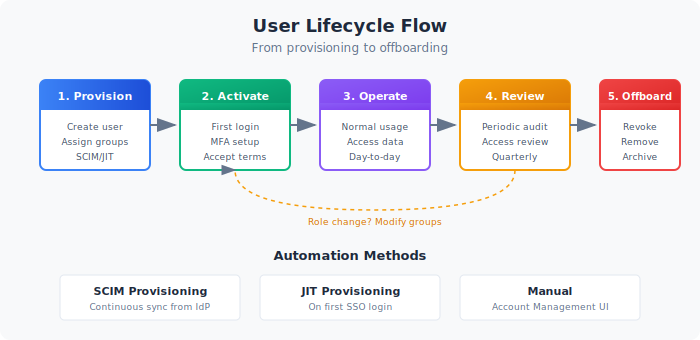
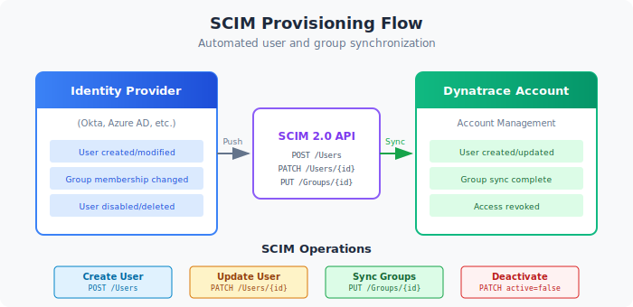

# User Lifecycle and Provisioning

> **Series:** IAM | **Notebook:** 6 of 10 | **Created:** January 2026 | **Last Updated:** 02/27/2026

## Automating User Management at Scale
Manual user management doesn't scale. This notebook covers user lifecycle automation including SCIM provisioning, JIT access, service accounts, and token management.

---

## Table of Contents

1. [SCIM Provisioning](#scim-provisioning)
2. [Just-in-Time Provisioning](#just-in-time-provisioning)
3. [User Onboarding Workflows](#user-onboarding-workflows)
4. [User Offboarding](#user-offboarding)
5. [Service Accounts and OAuth Clients](#service-accounts-and-oauth-clients)
6. [API Token Management](#api-token-management)

---

## Prerequisites

| Requirement | Details |
|-------------|----------|
| **Dynatrace Environment** | SaaS with Gen3 IAM enabled |
| **Permissions** | `account-iam-admin` for user/token management |
| **IdP** | Enterprise IdP (Okta, Azure AD, etc.) for SCIM |

## 1. User Lifecycle Overview

Users have a lifecycle from creation to deactivation. Effective management requires automation at each stage.


<!-- MARKDOWN_TABLE_ALTERNATIVE
| Stage | Trigger | Actions |
|-------|---------|----------|
| Provision | New hire, role change | Create user, assign groups |
| Activate | First login | MFA setup, accept terms |
| Operate | Ongoing | Access resources, membership changes |
| Review | Periodic | Verify access still needed |
| Offboard | Termination, role change | Revoke access, disable account |
-->

### Lifecycle Stages

| Stage | Description | Automation |
|-------|-------------|------------|
| **Provision** | Create user identity | SCIM, JIT |
| **Assign** | Add to groups, grant access | SCIM group sync |
| **Activate** | First login, MFA setup | SSO integration |
| **Operate** | Normal access and usage | N/A |
| **Review** | Periodic access review | Audit queries |
| **Modify** | Change groups/access | SCIM update |
| **Offboard** | Remove access | SCIM delete, JIT expiry |

### Manual vs Automated

| Method | Pros | Cons | Scale |
|--------|------|------|-------|
| **Manual** | Full control | Slow, error-prone | < 50 users |
| **SCIM** | Automated sync | Setup complexity | 50 - 10,000+ users |
| **JIT** | No pre-provisioning | Less control | Any size |

<a id="scim-provisioning"></a>
## 2. SCIM Provisioning
SCIM (System for Cross-domain Identity Management) automatically syncs users and groups from your IdP to Dynatrace.


<!-- MARKDOWN_TABLE_ALTERNATIVE
| Step | Component | Action |
|------|-----------|--------|
| 1 | IdP | Detects user/group change |
| 2 | SCIM Client | Sends API request to Dynatrace |
| 3 | Dynatrace | Processes user/group operation |
| 4 | Sync | User/group state matches IdP |
-->

### How SCIM Works

1. You configure SCIM in your IdP (Okta, Azure AD, etc.)
2. When users/groups change in IdP, SCIM syncs to Dynatrace
3. Users are automatically created, updated, or deactivated
4. Group memberships stay in sync

### Supported IdPs

| IdP | SCIM Support | Notes |
|-----|--------------|-------|
| Okta | Full | Native integration |
| Azure AD (Entra ID) | Full | Enterprise app provisioning |
| OneLogin | Full | Directory provisioning |
| PingFederate | Full | Provisioning connector |
| Google Workspace | Partial | Requires adapter |

### SCIM Configuration Steps

**In Dynatrace:**

1. Navigate to Account Management → Identity providers
2. Select your IdP configuration
3. Enable SCIM provisioning
4. Copy the SCIM endpoint URL and token

**In Your IdP (Example: Okta):**

1. Open your Dynatrace SAML application
2. Go to Provisioning tab
3. Configure SCIM connection:
   - SCIM connector base URL
   - API token (from Dynatrace)
4. Enable provisioning features:
   - Create Users
   - Update User Attributes
   - Deactivate Users
   - Push Groups

### SCIM Attributes Synced

| Attribute | Source | Dynatrace Field |
|-----------|--------|------------------|
| userName | IdP email | Email (login) |
| givenName | IdP first name | First name |
| familyName | IdP last name | Last name |
| active | IdP status | Account status |
| groups | IdP group membership | Group membership |

### Best Practices

- **Test in sandbox** before production
- **Map groups explicitly** - don't auto-create
- **Use consistent naming** between IdP and Dynatrace
- **Monitor sync status** for failures

<a id="just-in-time-provisioning"></a>
## 3. Just-in-Time Provisioning
JIT provisioning creates users automatically on first login via SSO.

### How JIT Works

1. User authenticates via SAML SSO
2. If user doesn't exist, Dynatrace creates them
3. Group memberships assigned based on SAML assertion
4. User accesses Dynatrace immediately

### JIT vs SCIM

| Aspect | JIT | SCIM |
|--------|-----|------|
| User created | On first login | Before login |
| Deactivation | Manual or session-based | Automatic sync |
| Group sync | At login only | Continuous |
| Setup | Simple | More complex |
| Control | Less | More |

### Configuring JIT

1. Navigate to Account Management → Identity providers
2. Select your SAML configuration
3. Enable "Auto-provision users on login"
4. Configure default group for new users
5. Map SAML groups to Dynatrace groups

### JIT Group Mapping

SAML assertion includes groups, which are mapped to Dynatrace groups:

| SAML Group | Dynatrace Group |
|------------|------------------|
| `IT-Dynatrace-Admins` | `dt-platform-admins` |
| `App-Checkout-Team` | `dt-checkout-editors` |
| `All-Employees` | `dt-all-viewers` |

### JIT Considerations

| Pro | Con |
|-----|-----|
| Simple setup | User created only after login |
| No pre-provisioning needed | Group sync only at login |
| Self-service access | Harder to audit who has access |

<a id="user-onboarding-workflows"></a>
## 4. User Onboarding Workflows
### Standard Onboarding Process

| Step | Action | Owner |
|------|--------|-------|
| 1 | Add user to IdP group | HR/IT |
| 2 | SCIM syncs user to Dynatrace | Automatic |
| 3 | User receives welcome email | IT |
| 4 | User logs in via SSO | User |
| 5 | User completes MFA setup | User |
| 6 | Access verified | User/Manager |

### New Employee Checklist

```
□ Employee added to corporate directory
□ Employee assigned to appropriate IdP groups
□ SCIM sync verified (user appears in Dynatrace)
□ Employee logs in successfully
□ Employee completes MFA enrollment
□ Employee confirms access to required data
```

### Role Change Process

When users change roles:

1. Manager requests access change
2. IAM admin approves
3. Update IdP group membership
4. SCIM syncs changes
5. User has new access on next login

### Temporary Access

For contractors or short-term access:

| Method | Duration | Automation |
|--------|----------|------------|
| IdP time-limited group | Days to months | IdP policy |
| Manual group removal | Any | Calendar reminder |
| OAuth client expiry | Hours to days | Token config |

<a id="user-offboarding"></a>
## 5. User Offboarding
Proper offboarding is critical for security.

### Offboarding Triggers

| Trigger | Response | Timing |
|---------|----------|--------|
| Termination | Full revocation | Immediate |
| Resignation | Full revocation | Last day |
| Role change | Partial revocation | At change |
| Contract end | Full revocation | End date |

### Automated Offboarding (SCIM)

1. User disabled/removed in IdP
2. SCIM syncs deactivation to Dynatrace
3. User cannot login
4. Existing sessions invalidated

### Manual Offboarding Checklist

```
□ Remove from all Dynatrace groups
□ Revoke any API tokens created by user
□ Deactivate OAuth clients owned by user
□ Transfer ownership of dashboards/notebooks
□ Review audit log for recent activity
□ Document offboarding completion
```

### Token Revocation on Offboarding

Critical: User-created tokens remain active until explicitly revoked.

**Query to find user's tokens:**
```
Account Management → API tokens
Filter by: Created by [user email]
Action: Revoke all tokens
```

### Verification

After offboarding, verify:

- [ ] User cannot login via SSO
- [ ] User not in any groups
- [ ] User's tokens are revoked
- [ ] No active OAuth clients

<a id="service-accounts-and-oauth-clients"></a>
## 6. Service Accounts and OAuth Clients
Non-human identities require special handling.

### Service Accounts vs OAuth Clients

| Type | Use Case | Authentication |
|------|----------|----------------|
| **Service Account** | Automation, scripts | API token |
| **OAuth Client** | Apps, integrations | OAuth 2.0 |

### Creating OAuth Clients

1. Account Management → OAuth clients
2. Create new client
3. Configure:
   - Name and description
   - Grant type (client credentials)
   - Scopes (permissions)
   - Token lifetime
4. Save client ID and secret securely

### OAuth Client Best Practices

| Practice | Rationale |
|----------|------------|
| One client per application | Isolation, easy revocation |
| Minimum scopes | Least privilege |
| Short token lifetime | Reduce exposure |
| Rotate secrets regularly | Security hygiene |
| Document ownership | Accountability |

### OAuth Scopes

Common scopes for automation:

| Scope | Grants |
|-------|--------|
| `storage:logs:read` | Read logs |
| `storage:metrics:read` | Read metrics |
| `settings:objects:read` | Read settings |
| `settings:objects:write` | Modify settings |
| `document:documents:read` | Read dashboards |

### Service Account Lifecycle

| Event | Action |
|-------|--------|
| Create | Document owner, purpose, expiry |
| Review (quarterly) | Verify still needed |
| Owner change | Update documentation |
| Decommission | Revoke client, archive docs |

<a id="api-token-management"></a>
## 7. API Token Management
API tokens provide access for scripts, tools, and legacy integrations.

### Token Types

| Type | Scope | Use Case |
|------|-------|----------|
| **Personal** | User's permissions | User automation |
| **Service** | Specific scopes | Application integration |

### Token Scopes Reference

| Scope | Permission |
|-------|------------|
| `logs.read` | Read log data |
| `metrics.read` | Read metrics |
| `entities.read` | Read entity data |
| `settings.read` | Read settings |
| `settings.write` | Modify settings |
| `problems.read` | Read problems |
| `events.ingest` | Send events |

### Token Best Practices

| Practice | Implementation |
|----------|----------------|
| Minimum scopes | Only grant what's needed |
| Descriptive names | `cicd-pipeline-metrics-reader` |
| Expiration dates | Set reasonable expiry |
| Rotation schedule | Rotate every 90 days |
| Secure storage | Use secrets manager |
| No sharing | One token per use case |

### Token Rotation Process

1. Create new token with same scopes
2. Update applications with new token
3. Verify applications work
4. Revoke old token
5. Document rotation

### Monitoring Token Usage

Use audit logs to track token activity.

```dql
// Track API token usage patterns
fetch logs, from: now() - 7d
| filter matchesPhrase(log.source, "audit")
| filter matchesPhrase(content, "token")
| fields timestamp, content
| sort timestamp desc
| limit 100
```

```dql
// Find token creation events
fetch logs, from: now() - 30d
| filter matchesPhrase(log.source, "audit")
| filter matchesPhrase(content, "token") and matchesPhrase(content, "created")
| fields timestamp, content
| sort timestamp desc
| limit 50
```

```dql
// Monitor OAuth client activity
fetch logs, from: now() - 7d
| filter matchesPhrase(log.source, "audit")
| filter matchesPhrase(content, "oauth") or matchesPhrase(content, "client")
| fields timestamp, content
| sort timestamp desc
| limit 50
```

## Next Steps

With user lifecycle management in place, proceed to compliance:

### Recommended Path

1. **IAM-07: Audit Logging and Compliance** - Monitor and report on access
2. **IAM-08: Multi-Environment IAM** - Scale across environments
3. **IAM-09: Troubleshooting Access Issues** - Debug problems

### User Lifecycle Checklist

Before moving on, ensure you have:

- [ ] Chosen SCIM, JIT, or manual provisioning
- [ ] Configured IdP integration for provisioning
- [ ] Documented onboarding process
- [ ] Documented offboarding process
- [ ] Established token management policy
- [ ] Created service account inventory

---

## Summary

In this notebook, you learned:

- User lifecycle stages and automation options
- SCIM provisioning configuration
- Just-in-time provisioning via SSO
- User onboarding and offboarding workflows
- Service account and OAuth client management
- API token best practices and rotation

---

## References

- [SCIM Provisioning](https://docs.dynatrace.com/docs/manage/identity-access-management/user-management/scim)
- [OAuth Clients](https://docs.dynatrace.com/docs/manage/identity-access-management/account-management/oauth-clients)
- [API Tokens](https://docs.dynatrace.com/docs/manage/identity-access-management/access-tokens-and-oauth-clients/access-tokens)

---

<sub>*This notebook was AI-generated from community-submitted and publicly available sources. This notebook series is not officially supported by Dynatrace. Always verify information against official Dynatrace documentation.*</sub>
