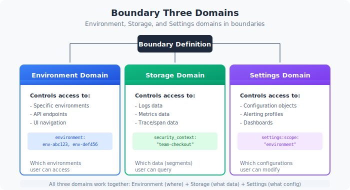
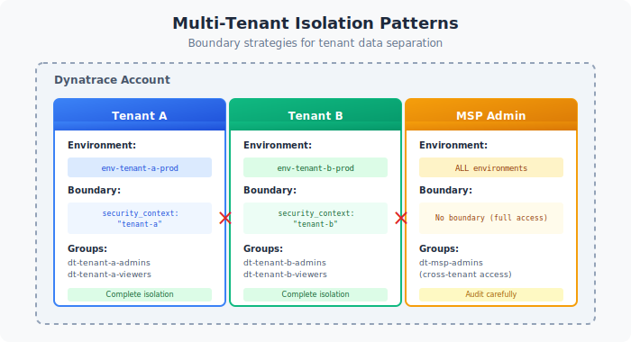

# Boundary Design Patterns

> **Series:** IAMADM | **Notebook:** 5 of 9 | **Created:** January 2026

## Controlling Data Visibility with Boundaries

Boundaries determine **what data** users can see. While policies control actions, boundaries filter visibility. This notebook covers boundary syntax, patterns, and implementation strategies.

---

## Table of Contents

1. Boundary Fundamentals
2. The Three-Domain Model
3. Boundary Syntax Reference
4. Security Context Strategy
5. Common Boundary Patterns
6. Multi-Tenant Isolation
7. Boundary Testing
8. Next Steps

---

## Prerequisites

| Requirement | Details |
|-------------|----------|
| **Dynatrace Environment** | SaaS with Gen3 IAM enabled |
| **Permissions** | `environment-admin` or boundary management rights |
| **Prior Knowledge** | **IAMADM-01** through **IAMADM-04** |

## 1. Boundary Fundamentals

Boundaries filter what entities and data a user can see within an environment.

### Policies vs Boundaries

| Concept | Controls | Example |
|---------|----------|----------|
| **Policy** | What actions | "Can read logs" |
| **Boundary** | What data | "Logs from checkout service only" |

A user needs BOTH:
- A **policy** granting the action (e.g., `storage:logs:read`)
- A **boundary** including the data (e.g., `checkout` security context)

### How Boundaries Work

1. User attempts to access data (query, view, etc.)
2. Dynatrace checks if user's policy allows the action
3. Dynatrace filters results to match user's boundary
4. User sees only data within their boundary

### Boundary Scope

Boundaries are **environment-level** and assigned to groups:

```
Group: dt-checkout-editors
├── Policy: environment-editor
└── Boundary: checkout-services-only
```

## 2. The Three-Domain Model

Boundaries filter across three domains. A complete boundary typically includes all three.


<!-- MARKDOWN_TABLE_ALTERNATIVE
| Domain | Controls | Key Field |
|--------|----------|------------|
| Environment | Smartscape entities (hosts, services) | dt.security_context |
| Storage | Grail data (logs, spans, metrics) | dt.security_context |
| Settings | Configuration objects | dt.security_context |
-->

### Domain 1: Environment

Controls visibility of Smartscape entities:
- Hosts
- Services
- Applications
- Databases
- Cloud resources

### Domain 2: Storage

Controls visibility of Grail data:
- Logs
- Spans (traces)
- Metrics
- Events
- Business events

### Domain 3: Settings

Controls visibility of configuration:
- Alerting rules
- SLOs
- Custom settings

### Why All Three Matter

If you only boundary one domain:

| Missing Domain | Problem |
|----------------|----------|
| Environment | User can't see services in UI |
| Storage | User can't query logs/spans |
| Settings | User can't see/edit config |

## 3. Boundary Syntax Reference

### Basic Boundary Structure

```
<domain>:<field> <operator> (<values>)
```

**Complete Three-Domain Boundary:**
```
environment:dt.security_context IN ("checkout");
storage:dt.security_context IN ("checkout");
settings:dt.security_context IN ("checkout");
```

### Operators

| Operator | Description | Example |
|----------|-------------|----------|
| `IN` | Match any in list | `IN ("a", "b", "c")` |
| `=` | Exact match | `= "checkout"` |
| `!=` | Not equal | `!= "restricted"` |
| `startsWith` | Prefix match | `startsWith "team-"` |
| `contains` | Substring | `contains "prod"` |

### Common Fields

| Domain | Field | Description |
|--------|-------|-------------|
| environment | `dt.security_context` | Entity security context |
| environment | `management-zone` | Legacy MZ (deprecated) |
| storage | `dt.security_context` | Data security context |
| storage | `bucket.name` | Storage bucket name |
| settings | `dt.security_context` | Settings security context |
| settings | `schemaId` | Settings schema |

### Multiple Values

Grant access to multiple security contexts:

```
environment:dt.security_context IN ("checkout", "payments", "shared");
storage:dt.security_context IN ("checkout", "payments", "shared");
settings:dt.security_context IN ("checkout", "payments", "shared");
```

### Wildcard Access

For admin groups needing full access:

```
environment:dt.security_context IN ("*");
storage:dt.security_context IN ("*");
settings:dt.security_context IN ("*");
```

## 4. Security Context Strategy

Security contexts are the foundation of boundary filtering. Plan your strategy carefully.

### What is a Security Context?

A **security context** is a label applied to:
- Entities (hosts, services)
- Data (logs, spans)
- Settings (configurations)

Boundaries filter based on these labels.

### Assigning Security Context

Security context is set via (modern approaches):

1. **Entity Enrichment rules** - Automatic based on entity properties
2. **Host properties** - Set on hosts and inherited by services
3. **Primary Grail tags** - First-class tags for Grail data
4. **OneAgent group** - Inherited from deployment
5. **Log attributes** - Set during OpenPipeline ingestion

> **Note:** Auto-tagging is a legacy approach. Prefer Entity Enrichment for new implementations.

### Security Context Design Patterns

| Pattern | Example Values | Use Case |
|---------|----------------|----------|
| **Team-based** | `checkout-team`, `payments-team` | Team ownership |
| **Application-based** | `ecommerce-app`, `mobile-app` | App isolation |
| **Environment-based** | `prod`, `staging`, `dev` | Env separation |
| **Business unit** | `retail`, `wholesale`, `corporate` | Business isolation |
| **Geography** | `us-east`, `eu-west`, `apac` | Regional separation |

### Naming Conventions

| Rule | Good | Bad |
|------|------|-----|
| Lowercase | `checkout` | `Checkout` |
| Hyphens | `team-checkout` | `team_checkout` |
| Descriptive | `payments-api` | `pa` |
| No spaces | `mobile-app` | `mobile app` |

### Shared Context

Some data should be visible to multiple teams:

```
Security Contexts:
├── checkout      (checkout team data)
├── payments      (payments team data)
└── shared        (cross-team data - infrastructure, common services)
```

Teams get their context + `shared`:
```
environment:dt.security_context IN ("checkout", "shared");
```

## 5. Common Boundary Patterns

### Pattern 1: Single Team Boundary

Restrict to one team's data:

```
environment:dt.security_context IN ("checkout");
storage:dt.security_context IN ("checkout");
settings:dt.security_context IN ("checkout");
```

### Pattern 2: Team + Shared

Team data plus shared infrastructure:

```
environment:dt.security_context IN ("checkout", "shared", "infrastructure");
storage:dt.security_context IN ("checkout", "shared", "infrastructure");
settings:dt.security_context IN ("checkout", "shared");
```

### Pattern 3: Multiple Teams (Cross-Functional)

For SRE or platform teams:

```
environment:dt.security_context IN ("checkout", "payments", "catalog", "shared");
storage:dt.security_context IN ("checkout", "payments", "catalog", "shared");
settings:dt.security_context IN ("checkout", "payments", "catalog", "shared");
```

### Pattern 4: Environment Tier

Production vs non-production:

**Production:**
```
environment:dt.security_context IN ("prod-checkout", "prod-payments");
storage:dt.security_context IN ("prod-checkout", "prod-payments");
settings:dt.security_context IN ("prod-checkout", "prod-payments");
```

**Non-Production:**
```
environment:dt.security_context IN ("dev-checkout", "staging-checkout");
storage:dt.security_context IN ("dev-checkout", "staging-checkout");
settings:dt.security_context IN ("dev-checkout", "staging-checkout");
```

### Pattern 5: Read-All, Write-Scoped

Using two groups for the same user:

**Group 1: All-Viewers (broad read)**
```
Policy: environment-viewer
Boundary: environment:dt.security_context IN ("*");
```

**Group 2: Checkout-Editors (scoped write)**
```
Policy: checkout-write-policy
Boundary: environment:dt.security_context IN ("checkout");
```

## 6. Multi-Tenant Isolation

For organizations serving multiple customers or business units that require strict isolation.


<!-- MARKDOWN_TABLE_ALTERNATIVE
| Tenant | Security Context | Isolated Data |
|--------|------------------|---------------|
| Customer A | tenant-a | All logs, spans, metrics |
| Customer B | tenant-b | All logs, spans, metrics |
| Internal | internal | Platform metrics only |
-->

### Isolation Requirements

| Requirement | Implementation |
|-------------|----------------|
| Data isolation | Unique security context per tenant |
| No cross-tenant access | Strict boundary matching |
| Audit capability | Centralized logging |
| Shared infrastructure | Separate "platform" context |

### Multi-Tenant Boundary Example

**Tenant A Group:**
```
environment:dt.security_context IN ("tenant-a");
storage:dt.security_context IN ("tenant-a");
settings:dt.security_context IN ("tenant-a");
```

**Tenant B Group:**
```
environment:dt.security_context IN ("tenant-b");
storage:dt.security_context IN ("tenant-b");
settings:dt.security_context IN ("tenant-b");
```

**Platform Team (cross-tenant):**
```
environment:dt.security_context IN ("platform", "shared");
storage:dt.security_context IN ("platform", "shared");
settings:dt.security_context IN ("platform", "shared");
```

### Entity Enrichment for Multi-Tenancy

Use Entity Enrichment rules (Settings > Entity Enrichment) to assign tenant context:

```yaml
# Entity Enrichment rule based on host group
Rule: Assign security context from host group
Entity Type: Host
Condition: Host group name contains "tenant-"
Action: Set dt.security_context = {hostGroup.name}
```

Alternatively, use **host properties** to set context at deployment:

```bash
# Set via OneAgent installer
--set-host-property=dt.security_context=tenant-a
```

## 7. Boundary Testing

Verify boundaries work as expected before production use.

```dql
// Check security context distribution on services
fetch dt.entity.service
| summarize count(), by:{dt.security_context}
| sort count() desc
| limit 20
```

```dql
// Find entities without security context (boundary gaps)
fetch dt.entity.service
| filter isNull(dt.security_context)
| fields entity.name, tags
| sort entity.name
| limit 50
```

```dql
// Check host security context coverage
fetch dt.entity.host
| summarize 
    total = count(),
    withContext = countIf(isNotNull(dt.security_context)),
    missing = countIf(isNull(dt.security_context))
| fieldsAdd coveragePercent = round(100.0 * withContext / total, decimals: 2)
```

```dql
// Verify logs have security context
fetch logs, from: now() - 1h
| summarize 
    total = count(),
    withContext = countIf(isNotNull(dt.security_context))
| fieldsAdd coveragePercent = round(100.0 * withContext / total, decimals: 2)
```

### Testing Methodology

1. **Create test group** with the boundary
2. **Add test user** to the group
3. **Log in as test user** (or impersonate)
4. **Verify visible entities** match expected
5. **Verify hidden entities** are not visible
6. **Query data** to confirm filtering works

### Validation Checklist

| Test | Expected |
|------|----------|
| List services | Only boundary-included services |
| Query logs | Only logs with matching context |
| View settings | Only settings with matching context |
| Access denied entity | Empty result or error |

## Next Steps

With boundaries configured, complete your IAM implementation:

### Recommended Path

1. **IAMADM-06: User Lifecycle and Provisioning** - Automate user management
2. **IAMADM-07: Audit Logging and Compliance** - Monitor access patterns
3. **IAMADM-08: Multi-Environment IAM** - Scale across environments

### Boundary Checklist

Before moving on, ensure you have:

- [ ] Understood the three-domain model
- [ ] Designed your security context strategy
- [ ] Created boundaries for each team/group
- [ ] Configured entity enrichment for context assignment
- [ ] Tested boundaries with real users
- [ ] Verified no entities are missing context

---

## Summary

In this notebook, you learned:

- Boundary fundamentals and how they differ from policies
- The three-domain model (environment, storage, settings)
- Boundary syntax and operators
- Security context strategy and naming
- Five common boundary patterns
- Multi-tenant isolation design
- Boundary testing and validation

---

## References

- [Permission Boundaries](https://docs.dynatrace.com/docs/manage/identity-access-management/permission-management/manage-user-permissions-policies/advanced/permission-boundaries)
- [Security Context](https://docs.dynatrace.com/docs/manage/identity-access-management/permission-management/manage-user-permissions-policies/advanced/security-context)
- [Entity Enrichment](https://docs.dynatrace.com/docs/manage/tags-and-metadata/setup/entity-enrichment)
- [Host Properties](https://docs.dynatrace.com/docs/setup-and-configuration/dynatrace-oneagent/host-properties)

---

<sub>*This notebook was AI-generated from community-submitted and publicly available sources. This notebook series is not officially supported by Dynatrace. Always verify information against official Dynatrace documentation.*</sub>
