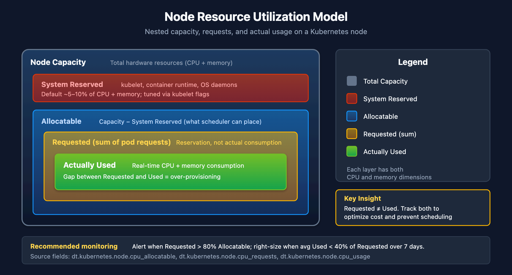

# K8S-04: Cluster Health Monitoring

> **Series:** K8S — Kubernetes Monitoring | **Notebook:** 4 of 13 | **Created:** January 2026 | **Last Updated:** 05/29/2026

## Deep-Dive into Kubernetes Cluster Metrics
Cluster health monitoring provides visibility into the infrastructure layer of Kubernetes: nodes, control plane, and cluster-wide resources. This notebook covers key metrics, thresholds, and DQL queries for proactive cluster management.

---

## Table of Contents

1. [Node Monitoring](#node-monitoring)
2. [Resource Capacity Planning](#resource-capacity-planning)
3. [Control Plane Health](#control-plane-health)
4. [Cluster-Wide Events](#cluster-wide-events)
5. [Cost Optimization Queries](#cost-optimization-queries)
6. [Alerting Strategies](#alerting-strategies)

---

## Prerequisites

| Requirement | Details |
|-------------|----------|
| **Dynatrace Environment** | SaaS with Kubernetes monitoring |
| **DynaKube** | ActiveGate with `kubernetes-monitoring` capability |
| **Permissions** | `metrics.read`, `entities.read`, `logs.read` |
| **Data** | At least 24 hours of cluster data |

## 1. Cluster Health Overview

### Key Health Indicators

| Category | Metrics | Healthy State |
|----------|---------|---------------|
| **Node Status** | Ready/NotReady | All nodes Ready |
| **Pod Scheduling** | Pending pods | No long-pending pods |
| **Resource Pressure** | CPU/Memory pressure | No pressure conditions |
| **Disk Pressure** | Disk space, inode usage | >15% available |
| **Network** | CNI health, DNS latency | <100ms DNS resolution |

### Dynatrace Kubernetes Dashboard

The built-in Kubernetes dashboard provides:
- Cluster overview with node status
- Namespace resource usage
- Workload health summary
- Recent events and problems

Navigate to: **Infrastructure > Kubernetes**

### Release Radar (April 2026): Enhanced Kubernetes Visibility

Three additions to the Kubernetes app's cluster and workload views:

| Capability | What it surfaces | Why it matters |
|---|---|---|
| **Horizontal Pod Autoscaler (HPA)** | HPA is now a first-class object — scaling triggers, current/desired replica counts, and the workloads it drives | See *why* a workload scaled (which metric crossed which threshold) without leaving Dynatrace |
| **Custom Resources (CRs)** | Monitor up to **5 Custom Resources per cluster**, surfacing CRD-heavy ecosystems (Argo, Istio, Cert-Manager, Kyverno, operator-managed databases) | Brings operator/CRD state into the same view as native Kubernetes objects |
| **Cloud configuration in cluster details** | The underlying managed-cluster configuration (EKS, AKS, GKE) shown inline as YAML or JSON | Correlate cluster and cloud state in one place — no jumping to the cloud console |

> **Note:** The per-cluster Custom Resource cap (5) means you choose which CRDs matter most — prioritize the operators whose state actually drives incidents in your environment.

```dql
// List all monitored Kubernetes clusters (smartscape topology)
smartscapeNodes "K8S_CLUSTER"
| fields entity.name = name, tags
| sort entity.name asc

// Legacy alternative (deprecated for new content):
// fetch dt.entity.kubernetes_cluster
// | fields entity.name, tags
// | sort entity.name asc

```

<a id="node-monitoring"></a>
## 2. Node Monitoring
### Node Status and Conditions

| Condition | Description | Alert When |
|-----------|-------------|------------|
| **Ready** | Node can accept pods | False for >5 min |
| **MemoryPressure** | Low memory | True |
| **DiskPressure** | Low disk space | True |
| **PIDPressure** | Too many processes | True |
| **NetworkUnavailable** | Network not configured | True |

```dql
// List all Kubernetes nodes (smartscape topology)
smartscapeNodes "K8S_NODE"
| fields entity.name = name, tags
| sort entity.name asc

// Legacy alternative (deprecated for new content):
// fetch dt.entity.kubernetes_node
// | fields entity.name, tags
// | sort entity.name asc

```

```dql
// Node CPU utilization over time (top 10 by name)
timeseries nodeCpu = avg(dt.kubernetes.node.cpu_usage), from:-1h, by:{dt.entity.kubernetes_node}
| limit 10
```

```dql
// Node memory utilization - average over time period
timeseries avgMemory = avg(dt.kubernetes.node.memory_usage), from:-1h, by:{dt.entity.kubernetes_node}
| fieldsAdd avgMemoryValue = arrayAvg(avgMemory)
| filter avgMemoryValue > 80
| sort avgMemoryValue desc
```

```dql
// Node filesystem usage - disk pressure detection
timeseries avgDiskUsage = avg(dt.host.disk.used.percent), from:-1h, by:{dt.entity.host}
| fieldsAdd avgDiskUsageValue = arrayAvg(avgDiskUsage)
| filter avgDiskUsageValue > 80
| sort avgDiskUsageValue desc
```

<a id="resource-capacity-planning"></a>
## 3. Resource Capacity Planning
### Capacity Metrics

| Metric | Description | Use Case |
|--------|-------------|----------|
| **Allocatable** | Resources available for pods | Scheduling decisions |
| **Requested** | Sum of pod requests | Capacity planning |
| **Used** | Actual consumption | Right-sizing |
| **Limits** | Maximum allowed | Burst capacity |

### Utilization vs. Allocation



<!-- MARKDOWN_TABLE_ALTERNATIVE
| Layer | Description |
|-------|-------------|
| Node Capacity | Total hardware resources |
| System Reserved | kubelet, runtime, OS |
| Allocatable | Available for pods |
| Requested (sum) | Pod requests |
| Actually Used | Real-time usage |

**Key Insight:** Requested ≠ Used. Over-provisioning wastes resources. Monitor both to optimize cluster efficiency.
For environments where SVG doesn't render
-->

```dql
// CPU requests by namespace (average over time period)
timeseries avgCpuRequests = avg(dt.kubernetes.workload.requests_cpu), from:-1h, by:{k8s.namespace.name}
| sort avgCpuRequests desc
| limit 15
```

```dql
// Memory requests by namespace (average over time period)
timeseries avgMemRequests = avg(dt.kubernetes.workload.requests_memory), from:-1h, by:{k8s.namespace.name}
| sort avgMemRequests desc
| limit 15
```

```dql
// Find over-provisioned workloads (low CPU usage)
timeseries avgCpuUsageMillicores = avg(dt.kubernetes.container.cpu_usage), from:-1h, by:{dt.entity.cloud_application}
| fieldsAdd avgCpuUsageMillicoresValue = arrayAvg(avgCpuUsageMillicores)
| sort avgCpuUsageMillicoresValue asc
| limit 20
```

<a id="control-plane-health"></a>
## 4. Control Plane Health
### Control Plane Components

| Component | Function | Key Metrics |
|-----------|----------|-------------|
| **API Server** | REST API for K8s | Request latency, error rate |
| **etcd** | Distributed KV store | Disk sync latency, leader elections |
| **Scheduler** | Pod placement | Scheduling latency, failures |
| **Controller Manager** | Reconciliation loops | Queue depth, sync latency |

### Managed Kubernetes Note

For managed Kubernetes (EKS, AKS, GKE), control plane metrics are limited. Focus on:
- API server response times (client-side)
- Kubernetes events for scheduling issues
- Cloud provider metrics for control plane health

```dql
// API server events and errors
fetch logs, from:-1h
| filter matchesPhrase(content, "kube-apiserver") or matchesPhrase(content, "api-server")
| filter matchesPhrase(content, "error") or matchesPhrase(content, "failed")
| fields timestamp, content
| sort timestamp desc
| limit 20
```

<a id="cluster-wide-events"></a>
## 5. Cluster-Wide Events
### Event Types to Monitor

| Event Type | Reason | Action |
|------------|--------|--------|
| **Warning** | FailedScheduling | Check resource constraints |
| **Warning** | FailedMount | Check PV/PVC configuration |
| **Warning** | OOMKilled | Increase memory limits |
| **Warning** | Evicted | Node under pressure |
| **Normal** | Pulling/Pulled | Image operations |
| **Normal** | Scheduled | Pod placement |

```dql
// Kubernetes warning events
fetch logs, from:-1h
| filter matchesPhrase(content, "Warning") and (matchesPhrase(log.source, "kubernetes") or matchesPhrase(log.source, "k8s"))
| fields timestamp, content
| sort timestamp desc
| limit 50
```

```dql
// Failed scheduling events
fetch logs, from:-1h
| filter matchesPhrase(content, "FailedScheduling") or matchesPhrase(content, "Insufficient")
| fields timestamp, content
| sort timestamp desc
| limit 30
```

```dql
// OOMKilled events - memory issues
fetch logs, from:-1h
| filter matchesPhrase(content, "OOMKilled") or matchesPhrase(content, "Out of memory")
| fields timestamp, content
| sort timestamp desc
| limit 30
```

```dql
// Event summary by type
fetch logs, from: now() - 24h
| filter matchesPhrase(log.source, "kubernetes") or matchesPhrase(log.source, "k8s")
| parse content, "LD:eventType ' ' LD"
| summarize count = count(), by:{eventType}
| sort count desc
| limit 20
```

<a id="cost-optimization-queries"></a>
## 6. Cost Optimization Queries
### Resource Efficiency Analysis

| Metric | Target | Action If Not Met |
|--------|--------|-------------------|
| **CPU Utilization** | >40% avg | Reduce requests |
| **Memory Utilization** | >50% avg | Reduce requests |
| **Node Utilization** | >60% | Scale down nodes |
| **Idle Pods** | 0 | Review necessity |

```dql
// Find workloads with very low CPU utilization (candidates for right-sizing)
timeseries avgCpuUsageMillicores = avg(dt.kubernetes.container.cpu_usage), from:-1h, by:{dt.entity.cloud_application}
| fieldsAdd avgCpuUsageMillicoresValue = arrayAvg(avgCpuUsageMillicores)
| sort avgCpuUsageMillicoresValue asc
| limit 25
```

```dql
// Memory usage efficiency by workload (low usage = over-provisioned)
timeseries avgMemUsageBytes = avg(dt.kubernetes.container.memory_working_set), from:-1h, by:{dt.entity.cloud_application}
| fieldsAdd avgMemUsageBytesValue = arrayAvg(avgMemUsageBytes)
| sort avgMemUsageBytesValue asc
| limit 25
```

<a id="dynatrace-component-health"></a>
## 7. Dynatrace Component Health

Monitor the health of Dynatrace's own components (OneAgent, ActiveGate) running on your clusters.

### Why Monitor the Monitoring?

| Component | What to Watch | Action Threshold |
|-----------|---------------|------------------|
| **OneAgent** | CPU usage, memory consumption | Sustained memory growth above baseline |
| **ActiveGate** | Memory headroom, pod restarts | Memory headroom < 20%, any OOMKill |
| **CSI Driver** | Volume mount failures | Any mount timeout |
| **Operator** | Reconciliation errors | Failed CR updates |

> **Note:** OneAgent runs without resource limits or requests by default. Headroom queries using `limits_memory` will return no data for OneAgent containers. Use absolute memory usage instead. ActiveGate **does** have limits configured, so headroom queries work for AG.

> **Tip:** These queries use `matchesValue(k8s.container.name, "dynatrace-oneagent")` to isolate Dynatrace components from application workloads.

```dql
// OneAgent CPU usage across clusters (top 20 consumers)
timeseries by:{k8s.cluster.name, k8s.pod.name}, from:-1h,
  oaCpu = avg(dt.kubernetes.container.cpu_usage),
  filter:{matchesValue(k8s.container.name, "dynatrace-oneagent")}
| fieldsAdd avgCpu = arrayAvg(oaCpu)
| sort avgCpu desc
| limit 20
```

```dql
// OneAgent memory usage across clusters (absolute usage — OA has no resource limits by default)
timeseries by:{k8s.cluster.name}, from:-1h,
  memUsage = avg(dt.kubernetes.container.memory_working_set),
  filter:{matchesValue(k8s.container.name, "dynatrace-oneagent")}
| fieldsAdd avgUsageMi = round(arrayAvg(memUsage) / 1048576, decimals: 0)
| sort avgUsageMi desc
```

```dql
// Dynatrace component restarts and OOM events (last 24h)
fetch events, from:-24h
| filter event.kind == "K8S_EVENT"
| filter matchesPhrase(event.description, "dynatrace") AND (
    matchesPhrase(event.description, "restart") OR
    matchesPhrase(event.description, "OOMKilled") OR
    matchesPhrase(event.description, "BackOff")
  )
| fields timestamp, event.description
| sort timestamp desc
| limit 50
```

<a id="alerting-strategies"></a>
## 8. Alerting Strategies
### Recommended Alerts

| Alert | Condition | Severity |
|-------|-----------|----------|
| **Node NotReady** | Node condition != Ready for 5 min | Critical |
| **High Node CPU** | CPU > 85% for 15 min | Warning |
| **High Node Memory** | Memory > 90% for 10 min | Critical |
| **Disk Pressure** | Disk > 85% | Warning |
| **Pod Scheduling Failed** | FailedScheduling events | Warning |
| **OOM Kills** | OOMKilled events | Warning |

### Alert Configuration in Dynatrace

Navigate to: **Settings > Anomaly detection > Kubernetes**

Configure:
- Node availability alerts
- Resource saturation thresholds
- Workload health anomalies

### Custom Metric Events

For advanced alerting, use custom metric events with DQL-derived thresholds.

## Next Steps

With cluster health monitoring in place, proceed to:

| Next Notebook | Topic |
|---------------|-------|
| **K8S-05: Workload Monitoring** | Application-level observability |
| **K8S-06: Namespace Organization** | Boundaries and access control |
| **K8S-07: Events and Logs** | Log ingestion and analysis |

---

## Summary

In this notebook, you learned:

- Cluster health overview and key indicators
- Node monitoring for CPU, memory, and disk
- Resource capacity planning with requests vs. usage analysis
- Control plane health considerations
- Cluster-wide event monitoring and analysis
- Cost optimization queries for right-sizing
- Alerting strategies for proactive cluster management

---

## References

- [Set up Dynatrace on Kubernetes (DT docs)](https://docs.dynatrace.com/docs/ingest-from/setup-on-k8s)
- [How K8s monitoring works (DT docs)](https://docs.dynatrace.com/docs/ingest-from/setup-on-k8s/how-it-works)
- [Full observability deployment (DT docs)](https://docs.dynatrace.com/docs/ingest-from/setup-on-k8s/deployment/full-stack-observability)
- [Kubernetes app — clusters and workloads view (DT docs)](https://docs.dynatrace.com/docs/observe/infrastructure-observability/kubernetes-app)
- [Davis Problems app (DT docs)](https://docs.dynatrace.com/docs/dynatrace-intelligence/problems-app)
- [smartscapeNodes command (DT docs)](https://docs.dynatrace.com/docs/discover-dynatrace/references/dynatrace-query-language)

---

<sub>*This notebook was AI-generated from community-submitted and publicly available sources. This notebook series is not officially supported by Dynatrace. Always verify information against official Dynatrace documentation.*</sub>
