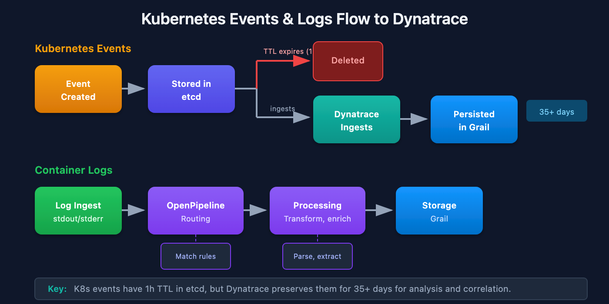

# K8S-07: Kubernetes Events and Log Ingestion

> **Series:** K8S — Kubernetes Monitoring | **Notebook:** 7 of 13 | **Created:** January 2026 | **Last Updated:** 01/30/2026

## Capturing and Analyzing Kubernetes Events and Logs
Kubernetes events and container logs provide crucial insights for debugging and operational awareness. This notebook covers event monitoring, log ingestion configuration, and analysis patterns in Dynatrace.

---

## Table of Contents

1. [Event Ingestion Configuration](#event-ingestion-configuration)
2. [Container Log Collection](#container-log-collection)
3. [OpenPipeline for K8s Logs](#openpipeline-for-k8s-logs)
4. [Event Analysis Patterns](#event-analysis-patterns)
5. [Log Analysis Patterns](#log-analysis-patterns)
6. [Alerting on Events and Logs](#alerting-on-events-and-logs)

---

## Prerequisites

| Requirement | Details |
|-------------|----------|
| **Dynatrace Environment** | SaaS with log ingestion enabled |
| **DynaKube** | ActiveGate with `kubernetes-monitoring` |
| **Permissions** | `logs.read`, `logs.ingest`, `events.read` |
| **Knowledge** | K8S-01 Fundamentals |

## 1. Kubernetes Events Overview

### Event Types

Kubernetes events are first-class objects that record what happened in the cluster.

| Type | Description | Examples |
|------|-------------|----------|
| **Normal** | Routine operations | Scheduled, Pulled, Created |
| **Warning** | Potential issues | FailedScheduling, BackOff, Unhealthy |

### Event Sources

| Source | Events Generated |
|--------|------------------|
| **Scheduler** | Scheduling decisions, failures |
| **Kubelet** | Pod lifecycle, probe results |
| **Controller Manager** | ReplicaSet scaling, Deployment rollouts |
| **Custom Controllers** | CRD reconciliation events |

### Event Lifecycle



<!-- MARKDOWN_TABLE_ALTERNATIVE
| Stage | Description |
|-------|-------------|
| Event Created | Kubernetes generates event |
| Stored in etcd | Event persisted temporarily |
| TTL expires (1h) | Event deleted from etcd |
| Dynatrace Ingests | Captured before deletion |
| Persisted in Grail | Long-term storage (35+ days) |

**Key:** K8s events have 1h TTL in etcd, but Dynatrace preserves them for 35+ days.
For environments where SVG doesn't render
-->

**Important:** Kubernetes events are short-lived. Dynatrace captures them for long-term storage and analysis.

<a id="event-ingestion-configuration"></a>
## 2. Event Ingestion Configuration
### ActiveGate Kubernetes Monitoring

Enable event collection via DynaKube:

```yaml
spec:
  activeGate:
    capabilities:
      - kubernetes-monitoring  # Enables event collection
      - routing
```

### Event Filtering

Configure which events to ingest:

| Setting | Location | Purpose |
|---------|----------|----------|
| Event types | Settings > Cloud and virtualization | Normal, Warning, or both |
| Namespace filter | DynaKube spec | Limit to specific namespaces |
| Event reasons | Settings | Include/exclude specific reasons |

### Recommended Configuration

| Use Case | Configuration |
|----------|---------------|
| **Full visibility** | All event types, all namespaces |
| **Warning focus** | Warning events only, all namespaces |
| **Cost optimization** | Warning events, specific namespaces |

```dql
// Recent Kubernetes events
fetch logs, from:-1h
| filter matchesPhrase(log.source, "kubernetes") or matchesPhrase(log.source, "k8s")
| fields timestamp, content
| sort timestamp desc
| limit 50
```

```dql
// Warning events only
fetch logs, from:-1h
| filter matchesPhrase(content, "Warning")
| filter matchesPhrase(log.source, "kubernetes") or matchesPhrase(log.source, "k8s")
| fields timestamp, content
| sort timestamp desc
| limit 30
```

<a id="container-log-collection"></a>
## 3. Container Log Collection
### Log Collection Methods

| Method | Source | Configuration |
|--------|--------|---------------|
| **OneAgent** | Container stdout/stderr | Automatic with OneAgent |
| **Log Monitoring** | Mounted log files | Custom paths in settings |
| **Fluentd/Fluent Bit** | External forwarder | OTLP endpoint |

### OneAgent Log Collection

OneAgent automatically collects:
- Container stdout logs
- Container stderr logs
- Process-generated log files (with configuration)

### Log Attributes

| Attribute | Source | Example |
|-----------|--------|----------|
| `k8s.namespace.name` | Container metadata | `checkout` |
| `k8s.pod.name` | Container metadata | `checkout-api-abc123` |
| `k8s.container.name` | Container metadata | `api` |
| `dt.entity.container_group_instance` | Entity relationship | `CONTAINER_GROUP_INSTANCE-XXX` |
| `loglevel` | Parsed from content | `ERROR`, `WARN`, `INFO` |

### DynaKube Log Configuration

```yaml
spec:
  oneAgent:
    cloudNativeFullStack:
      env:
        - name: ONEAGENT_ENABLE_LOG_ANALYTICS
          value: "true"
```

```dql
// Container logs by namespace
fetch logs, from:-1h
| filter isNotNull(k8s.namespace.name)
| summarize logCount = count(), by:{k8s.namespace.name}
| sort logCount desc
| limit 15
```

```dql
// Error logs with Kubernetes context
fetch logs, from:-1h
| filter loglevel == "ERROR" or loglevel == "SEVERE"
| filter isNotNull(k8s.namespace.name)
| fields timestamp, k8s.namespace.name, k8s.pod.name, content
| sort timestamp desc
| limit 30
```

<a id="openpipeline-for-k8s-logs"></a>
## 4. OpenPipeline for K8s Logs
### Log Processing Pipeline

OpenPipeline processes logs before storage:

```
Log Ingest → Routing → Processing → Storage
                ↓           ↓
         Match rules   Transform, enrich
```

### Common Processing Rules

| Rule Type | Use Case | Example |
|-----------|----------|----------|
| **Parse** | Extract fields | JSON parsing, regex |
| **Transform** | Modify content | Rename fields, mask data |
| **Filter** | Drop logs | Remove debug logs |
| **Route** | Direct to bucket | By namespace or app |

### Example: Parse JSON Logs

```yaml
# OpenPipeline configuration
pipelines:
  - name: k8s-json-logs
    routes:
      - match: k8s.namespace.name exists
    processing:
      - type: json
        source: content
```

### Example: Filter Debug Logs

```yaml
pipelines:
  - name: k8s-filter-debug
    routes:
      - match: k8s.namespace.name exists and loglevel == "DEBUG"
    processing:
      - type: drop
```

<a id="event-analysis-patterns"></a>
## 5. Event Analysis Patterns
### Key Event Reasons to Monitor

| Reason | Meaning | Action |
|--------|---------|--------|
| **FailedScheduling** | Pod can't be scheduled | Check resource availability |
| **FailedMount** | Volume mount failed | Check PV/PVC config |
| **BackOff** | Container restart backoff | Check logs, fix crash |
| **Unhealthy** | Probe failed | Check probe config, app health |
| **Evicted** | Pod evicted from node | Check node pressure |
| **OOMKilled** | Out of memory | Increase limits |

```dql
// Failed scheduling events
fetch logs, from:-1h
| filter matchesPhrase(content, "FailedScheduling")
| fields timestamp, content
| sort timestamp desc
| limit 20
```

```dql
// Pod restart events (BackOff, CrashLoopBackOff)
fetch logs, from:-1h
| filter matchesPhrase(content, "BackOff") or matchesPhrase(content, "CrashLoopBackOff")
| fields timestamp, content
| sort timestamp desc
| limit 20
```

```dql
// Volume mount failures
fetch logs, from:-1h
| filter matchesPhrase(content, "FailedMount") or matchesPhrase(content, "FailedAttachVolume")
| fields timestamp, content
| sort timestamp desc
| limit 20
```

```dql
// Event frequency by reason (last 24h)
fetch logs, from: now() - 24h
| filter matchesPhrase(log.source, "kubernetes") or matchesPhrase(log.source, "k8s")
| filter matchesPhrase(content, "Warning")
| summarize eventCount = count(), by:{timeBucket = bin(timestamp, 1h)}
| sort timeBucket asc
```

<a id="log-analysis-patterns"></a>
## 6. Log Analysis Patterns
### Error Log Investigation

```dql
// Pattern: Find errors with full context
fetch logs
| filter loglevel == "ERROR"
| filter k8s.namespace.name == "checkout"
| fields timestamp, k8s.pod.name, content
| sort timestamp desc
| limit 50
```

### Log Volume Analysis

```dql
// Pattern: Identify noisy pods
fetch logs, from: now() - 1h
| summarize count = count(), by:{k8s.pod.name}
| sort count desc
| limit 10
```

### Exception Tracking

```dql
// Pattern: Find stack traces
fetch logs
| filter matchesPhrase(content, "Exception") or matchesPhrase(content, "Traceback")
| fields timestamp, k8s.namespace.name, content
| sort timestamp desc
```

```dql
// Log volume by pod (find noisy pods)
fetch logs, from: now() - 1h
| filter isNotNull(k8s.pod.name)
| summarize logCount = count(), by:{k8s.pod.name}
| sort logCount desc
| limit 15
```

```dql
// Exception and error messages
fetch logs, from:-1h
| filter matchesPhrase(content, "Exception") or matchesPhrase(content, "error") or matchesPhrase(content, "failed")
| filter isNotNull(k8s.namespace.name)
| fields timestamp, k8s.namespace.name, k8s.pod.name, content
| sort timestamp desc
| limit 30
```

```dql
// Log level distribution by namespace
fetch logs, from: now() - 1h
| filter isNotNull(k8s.namespace.name) and isNotNull(loglevel)
| summarize count = count(), by:{k8s.namespace.name, loglevel}
| sort count desc
| limit 30
```

<a id="alerting-on-events-and-logs"></a>
## 7. Alerting on Events and Logs
### Event-Based Alerts

| Alert | Condition | Severity |
|-------|-----------|----------|
| **Failed Scheduling** | FailedScheduling events > 5 in 10 min | Warning |
| **Crash Loop** | CrashLoopBackOff events | Warning |
| **OOM Kills** | OOMKilled events | Critical |
| **Volume Failures** | FailedMount events | Critical |

### Log-Based Alerts

| Alert | Condition | Severity |
|-------|-----------|----------|
| **Error Spike** | Error log count > baseline | Warning |
| **Critical Errors** | Specific error patterns | Critical |
| **No Logs** | Log volume drops to 0 | Warning |

### Custom Metric Events

Create metric events for log-based alerting:

1. Navigate to **Settings > Anomaly detection > Custom events**
2. Create event based on log count metric
3. Set thresholds and notification targets

## Next Steps

With event and log monitoring configured, proceed to:

| Next Notebook | Topic |
|---------------|-------|
| **K8S-08: DQL for Kubernetes** | Advanced query patterns |
| **K8S-09: Troubleshooting** | Debugging K8s monitoring |

---

## Summary

In this notebook, you learned:

- Kubernetes event types and sources
- Event ingestion configuration via DynaKube
- Container log collection methods
- OpenPipeline for log processing
- Event analysis patterns for common issues
- Log analysis patterns for debugging
- Alerting strategies for events and logs

---

## References

- [Kubernetes Log Monitoring](https://docs.dynatrace.com/docs/observe/logs-and-events/log-monitoring)
- [Kubernetes Events](https://docs.dynatrace.com/docs/observe/infrastructure-monitoring/kubernetes-and-openshift-monitoring/kubernetes-events)
- [OpenPipeline](https://docs.dynatrace.com/docs/observe/logs-and-events/log-monitoring/log-processing/openpipeline)

---

<sub>*This notebook was AI-generated from community-submitted and publicly available sources. This notebook series is not officially supported by Dynatrace. Always verify information against official Dynatrace documentation.*</sub>
