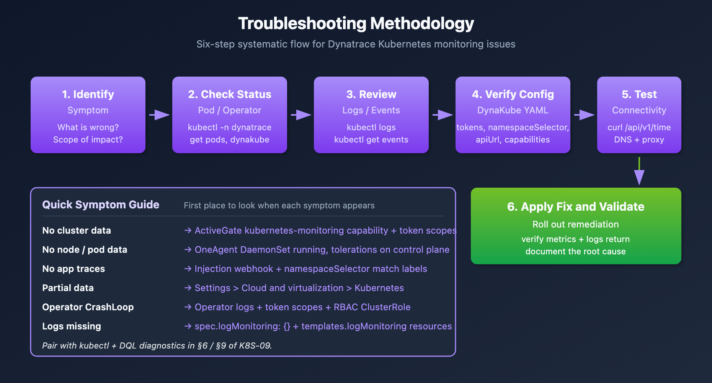

# K8S-09: Troubleshooting Kubernetes Monitoring

> **Series:** K8S — Kubernetes Monitoring | **Notebook:** 9 of 13 | **Created:** January 2026 | **Last Updated:** 07/14/2026

## Debugging Dynatrace Monitoring in Kubernetes
When monitoring doesn't work as expected, systematic troubleshooting is essential. This notebook covers common issues, diagnostic procedures, and resolution steps for Dynatrace Kubernetes monitoring.

---

## Table of Contents

1. [Troubleshooting Methodology](#troubleshooting-methodology)
2. [Operator Issues](#operator-issues)
3. [OneAgent Issues](#oneagent-issues)
4. [ActiveGate Issues](#activegate-issues)
5. [Injection Issues](#injection-issues)
6. [Data Collection Issues](#data-collection-issues)
7. [Connectivity Issues](#connectivity-issues)
8. [Diagnostic Commands](#diagnostic-commands)
9. [DQL-Based Diagnostics](#dql-diagnostics)
10. [Symptom-to-Resolution Index](#symptom-resolution-index)

---

## Prerequisites

| Requirement | Details |
|-------------|----------|
| **Dynatrace Environment** | SaaS/Managed access |
| **kubectl** | Configured for your cluster |
| **Permissions** | Cluster admin or debug access |
| **Knowledge** | K8S-01 through K8S-03 |

<a id="troubleshooting-methodology"></a>
## 1. Troubleshooting Methodology
### Systematic Approach



<!-- MARKDOWN_TABLE_ALTERNATIVE
| Step | Action | Purpose |
|------|--------|---------|
| 1 | Identify symptom | What's wrong? |
| 2 | Check status | Pods running? |
| 3 | Review logs/events | Error messages |
| 4 | Verify config | DynaKube YAML |
| 5 | Test connectivity | curl endpoints |
| 6 | Apply fix & validate | Fix, verify, document |
For environments where SVG doesn't render
-->

### Common Symptom Categories

| Symptom | Likely Component | Start Here |
|---------|------------------|------------|
| No cluster data | ActiveGate | Section 4 |
| No node/pod data | OneAgent | Section 3 |
| No app traces | Injection | Section 5 |
| Partial data | Data collection | Section 6 |
| Operator errors | Operator | Section 2 |

### First Checks

```bash
# DynaKube status
kubectl -n dynatrace get dynakube

# All Dynatrace pods
kubectl -n dynatrace get pods

# Recent events
kubectl -n dynatrace get events --sort-by='.lastTimestamp' | tail -20
```

<a id="operator-issues"></a>
## 2. Operator Issues
### Operator Not Running

**Symptoms:**
- DynaKube CR shows no status
- OneAgent pods not created

**Diagnostic:**
```bash
# Check operator deployment
kubectl -n dynatrace get deployment dynatrace-operator

# Check operator logs
kubectl -n dynatrace logs -l app.kubernetes.io/name=dynatrace-operator --tail=100
```

**Common Causes:**

| Cause | Resolution |
|-------|------------|
| Missing CRDs | Reinstall operator with Helm |
| RBAC issues | Check ServiceAccount permissions |
| Resource limits | Increase operator resources |
| Webhook failure | Check webhook certificates |

### DynaKube Stuck in Deploying

**Diagnostic:**
```bash
# Describe DynaKube
kubectl -n dynatrace describe dynakube dynakube

# Check conditions
kubectl -n dynatrace get dynakube -o jsonpath='{.items[*].status.conditions}' | jq .
```

**Common Causes:**

| Cause | Resolution |
|-------|------------|
| Invalid API token | Regenerate and update secret |
| Network policy blocking | Allow egress to Dynatrace |
| Image pull failure | Check pull secrets |

### Known Issues by Operator Version

Some failures are not configuration mistakes — they are known defects in specific Dynatrace Operator versions. Before deep-diving a symptom, check whether your Operator version falls in an affected window:

| First affected | Fixed / Mitigated | Issue |
|----------------|-------------------|-------|
| 1.8.0 | 1.8.1 | OpenShift OperatorHub-based install — Kubernetes API monitoring missing (1.8.1 shipped as a hotfix ten days after 1.8.0) |
| 1.3.0 | 1.4.1 (mitigated) | CSI driver pods crash frequently — liveness-probe failures under high simultaneous mount load (see below) |
| 1.1.0 | 1.5.1 | OneAgent pods unable to validate the SSL certificate of a containerized ActiveGate after an Operator upgrade |

```bash
# Which Operator version am I running?
kubectl -n dynatrace get deployment dynatrace-operator \
  -o jsonpath='{.spec.template.spec.containers[0].image}'
```

> **Tip:** The [Kubernetes/OpenShift troubleshooting map (Dynatrace community)](https://community.dynatrace.com/t5/Troubleshooting/Kubernetes-Openshift-troubleshooting-map/ta-p/264113) maintains this known-issues list as new Operator versions ship — check it alongside the [Operator releases (Dynatrace GitHub)](https://github.com/Dynatrace/dynatrace-operator/releases) when triaging a failure that appeared right after an upgrade.

### CSI Driver Crash Loops Under High Mount Load

On Operator 1.3.0+, clusters with a large number of simultaneous volume mounts per node (typically high pod density) can drive the CSI driver `server` container into a liveness-probe crash loop. Symptoms: high system load, high kubelet CPU, pods waiting on volume provisioning, `FailedMount` events referencing a missing `csi.sock`, and the CSI driver pod restarting with back-off.

Mitigations, in order of preference:

1. **Upgrade the Operator to 1.4.1 or later** — the liveness-probe parameters were adjusted to tolerate mount-storm load.
2. **Raise (or remove) the CSI `server` container resource limits** via Helm values:

```yaml
csidriver:
  server:
    resources:
      requests:
        cpu: 250m
        memory: 200Mi
      limits:
        cpu: 1000m
        memory: 200Mi
```

3. **Tune the liveness-probe timeouts** directly on the `dynatrace-oneagent-csi-driver` DaemonSet (`initialDelaySeconds: 15`, `periodSeconds: 15`, `timeoutSeconds: 10`, and `--probe-timeout=9s` on the liveness-probe container). Helm does not expose these — GitOps setups need a post-renderer.
4. **Disable the liveness probe** — last resort only; not recommended.

Alternatively, reduce simultaneous mounts by lowering max pods per node. If none of this resolves it, collect a support archive (Section 8) and open a support ticket.

<a id="oneagent-issues"></a>
## 3. OneAgent Issues
### OneAgent Pods Not Starting

**Diagnostic:**
```bash
# Check DaemonSet
kubectl -n dynatrace get daemonset -l app.kubernetes.io/component=oneagent

# Check pods
kubectl -n dynatrace get pods -l app.kubernetes.io/component=oneagent -o wide

# Describe failing pod
kubectl -n dynatrace describe pod <oneagent-pod-name>
```

**Common Causes:**

| Cause | Resolution |
|-------|------------|
| Tolerations missing | Add tolerations to DynaKube |
| Node selector mismatch | Update node selectors |
| Resource unavailable | Check node resources |
| Security context denied | Configure PSP/PSS |

### OneAgent Not Reporting

**Diagnostic:**
```bash
# Check OneAgent logs
kubectl -n dynatrace logs <oneagent-pod> -c oneagent --tail=100

# Check connectivity
kubectl -n dynatrace exec <oneagent-pod> -c oneagent -- curl -v https://<tenant>.live.dynatrace.com/api/v1/deployment/installer/agent/connectioninfo
```

**Common Causes:**

| Cause | Resolution |
|-------|------------|
| Firewall blocking | Allow egress port 443 |
| Proxy misconfiguration | Set proxy in DynaKube |
| Certificate issues | Check custom CA config |

<a id="activegate-issues"></a>
## 4. ActiveGate Issues
### ActiveGate Not Starting

**Diagnostic:**
```bash
# Check StatefulSet
kubectl -n dynatrace get statefulset -l app.kubernetes.io/component=activegate

# Check pods
kubectl -n dynatrace get pods -l app.kubernetes.io/component=activegate

# Check logs
kubectl -n dynatrace logs <activegate-pod> --tail=100
```

**Common Causes:**

| Cause | Resolution |
|-------|------------|
| Memory too low | Increase resources in DynaKube |
| PVC issues | Check storage class |
| Token invalid | Regenerate API token |

### No Kubernetes Metrics

**Diagnostic:**
```bash
# Check capabilities
kubectl -n dynatrace get dynakube -o jsonpath='{.items[*].spec.activeGate.capabilities}'

# Should include: kubernetes-monitoring
```

**Resolution:** Ensure `kubernetes-monitoring` capability is enabled:

```yaml
spec:
  activeGate:
    capabilities:
      - kubernetes-monitoring
      - routing
```

<a id="injection-issues"></a>
## 5. Injection Issues
### Pods Not Getting Injected

**Diagnostic:**
```bash
# Check namespace labels
kubectl get namespace <namespace> -o jsonpath='{.metadata.labels}'

# Check pod annotations
kubectl get pod <pod> -o jsonpath='{.metadata.annotations}'

# Check webhook
kubectl get mutatingwebhookconfigurations
```

**Common Causes:**

| Cause | Resolution |
|-------|------------|
| Namespace not selected | Add matching labels |
| Pod has opt-out annotation | Remove annotation |
| Webhook not registered | Restart operator |
| CSI driver not mounted | Enable CSI in DynaKube |

### Check Injection Status

```bash
# Check if init container present
kubectl get pod <pod> -o jsonpath='{.spec.initContainers[*].name}'

# Check environment variables
kubectl exec <pod> -c <container> -- env | grep DT_
```

### Namespace Selector Debugging

If using `namespaceSelector` in DynaKube:

```bash
# DynaKube selector
kubectl -n dynatrace get dynakube -o jsonpath='{.items[*].spec.namespaceSelector}'

# Label a namespace for injection
kubectl label namespace <namespace> dynatrace-injection=enabled
```

### Documented Injection-Skip Reason Annotations

When the webhook skips injection it stamps the pod with `oneagent.dynatrace.com/injected: "false"` (likewise `metadata-enrichment.dynatrace.com/injected` and `otlp-exporter-configuration.dynatrace.com/injected`) plus a companion `reason` annotation. Read them with `kubectl describe pod <pod> -n <namespace>`:

| Reason | Meaning | Typical Fix |
|--------|---------|-------------|
| `NoBootstrapperConfig` | Webhook can't find or create the bootstrapper config Secret in the pod's namespace | Incomplete DynaKube reconciliation — check DynaKube status and operator logs |
| `MissingTenantUUID` | DynaKube reconciliation incomplete; environment UUID not yet verified | Wait for / fix reconciliation (token, connectivity) |
| `DynaKubeStatusNotReady` | CodeModules status not ready — webhook can't determine which CodeModule to inject | Check DynaKube conditions; verify tenant connectivity |
| `OwnerLookupFailed` | Webhook can't determine the pod owner (name and kind) | Usually transient — Kubernetes API temporarily unreachable or slow; re-create the pod |
| `NoOTLPExporterConfigSecret` | Webhook can't find or create the OTLP exporter configuration Secret | Incomplete reconciliation or configuration preventing Secret creation |
| `IngestEndpointUnavailable` | Webhook can't construct a valid ingest endpoint URL at injection time | Check DynaKube `apiUrl` and tenant connectivity |

<a id="data-collection-issues"></a>
## 6. Data Collection Issues
### Missing Metrics

**Diagnostic Steps:**

1. Verify entity exists in Dynatrace
2. Check metric availability for entity type
3. Verify time range includes data
4. Check for filtering issues

```dql
// Verify Kubernetes entities are being discovered (smartscape topology)
smartscapeNodes "K8S_CLUSTER"
| fields entity.name = name, lifetime
| sort lifetime desc

// Legacy alternative (deprecated for new content):
// fetch dt.entity.kubernetes_cluster
// | fields entity.name, lifetime
// | sort lifetime desc

```

```dql
// Check if container metrics are flowing
timeseries cpu = avg(dt.kubernetes.container.cpu_usage), from:-1h
| limit 1
```

```dql
// Check if logs are being ingested
fetch logs, from: now() - 1h
| filter isNotNull(k8s.namespace.name)
| summarize logCount = count()
```

### Missing Logs

**Diagnostic:**

```bash
# Check if log analytics is enabled
kubectl -n dynatrace get dynakube -o yaml | grep -A5 "env:"

# Verify OneAgent log collection
kubectl -n dynatrace exec <oneagent-pod> -c oneagent -- cat /var/lib/dynatrace/oneagent/log/oneagent.log | tail -50
```

**Common Causes:**

| Cause | Resolution |
|-------|------------|
| Log ingest disabled | Enable in tenant settings |
| Log volume too high | Configure sampling/filtering |
| Log format unsupported | Configure custom parsing |

<a id="connectivity-issues"></a>
## 7. Connectivity Issues
### Testing Connectivity

```bash
# From OneAgent pod
kubectl -n dynatrace exec <oneagent-pod> -c oneagent -- \
  curl -v https://<tenant>.live.dynatrace.com/api/v1/time

# From ActiveGate pod
kubectl -n dynatrace exec <activegate-pod> -- \
  curl -v https://<tenant>.live.dynatrace.com/api/v1/time
```

### Network Policy Issues

```yaml
# Allow Dynatrace egress
apiVersion: networking.k8s.io/v1
kind: NetworkPolicy
metadata:
  name: allow-dynatrace-egress
  namespace: dynatrace
spec:
  podSelector: {}
  policyTypes:
    - Egress
  egress:
    - to:
        - ipBlock:
            cidr: 0.0.0.0/0
      ports:
        - protocol: TCP
          port: 443
```

### Proxy Configuration

```yaml
spec:
  proxy:
    value: https://proxy.example.com:8080
  # Or use a secret
  # proxy:
  #   valueFrom:
  #     secretKeyRef:
  #       name: proxy-secret
  #       key: proxy
```

<a id="diagnostic-commands"></a>
## 8. Diagnostic Commands
### Quick Health Check

```bash
#!/bin/bash
# dynatrace-health-check.sh

echo "=== DynaKube Status ==="
kubectl -n dynatrace get dynakube

echo "\n=== Dynatrace Pods ==="
kubectl -n dynatrace get pods

echo "\n=== OneAgent DaemonSet ==="
kubectl -n dynatrace get daemonset -l app.kubernetes.io/component=oneagent

echo "\n=== ActiveGate StatefulSet ==="
kubectl -n dynatrace get statefulset -l app.kubernetes.io/component=activegate

echo "\n=== Recent Events ==="
kubectl -n dynatrace get events --sort-by='.lastTimestamp' | tail -10
```

### Collect a Support Archive (Official Subcommand)

The Operator ships a built-in `support-archive` subcommand that packages version info, logs from all Dynatrace components (OneAgent, ActiveGate, webhook, CSI driver), Kubernetes manifests for operator components and DynaKubes, and troubleshoot output into a single zip — this is what Dynatrace support asks for:

```bash
kubectl exec -n dynatrace deployment/dynatrace-operator -- \
  dynatrace-operator support-archive --stdout > operator-support-archive.zip
```

If the operator pod itself won't start, run the archive from a standalone pod using the operator's ServiceAccount and image:

```bash
kubectl run -n dynatrace support-archive --rm -i \
  --overrides='{ "spec": { "serviceAccount": "dynatrace-operator" } }' \
  --restart Never --image <operator-image> -- \
  support-archive --delay 10 --stdout > support-archive.zip
```

### Collect Support Bundle (Manual Fallback)

```bash
# Create support bundle
mkdir dynatrace-debug
cd dynatrace-debug

# DynaKube
kubectl -n dynatrace get dynakube -o yaml > dynakube.yaml

# Pods
kubectl -n dynatrace get pods -o yaml > pods.yaml

# Events
kubectl -n dynatrace get events > events.txt

# Operator logs
kubectl -n dynatrace logs -l app.kubernetes.io/name=dynatrace-operator > operator.log

# OneAgent logs (one pod)
kubectl -n dynatrace logs $(kubectl -n dynatrace get pods -l app.kubernetes.io/component=oneagent -o jsonpath='{.items[0].metadata.name}') -c oneagent > oneagent.log

# Package
cd ..
tar -czf dynatrace-debug.tar.gz dynatrace-debug/
```

### Common kubectl Commands

| Command | Purpose |
|---------|----------|
| `kubectl -n dynatrace get all` | All resources |
| `kubectl -n dynatrace describe dynakube` | DynaKube details |
| `kubectl -n dynatrace logs <pod>` | Pod logs |
| `kubectl -n dynatrace exec -it <pod> -- sh` | Shell access |
| `kubectl -n dynatrace port-forward <pod> 9999:9999` | Local port forward |

<a id="dql-diagnostics"></a>
## 9. DQL-Based Diagnostics

Complement kubectl diagnostics with DQL queries that detect Dynatrace component issues across your cluster fleet.

### Common Failure Patterns

| Pattern | Symptoms | Detection Method |
|---------|----------|------------------|
| **CSI Volume Timeout** | Pods stuck in ContainerCreating | Events with `MountVolume` + `timeout` |
| **Injection Failure** | Missing init container | Events with `Failed` + `dynatrace` |
| **ActiveGate OOM** | AG restarts, data gaps | Events with `OOMKilled` + `activegate` |
| **OneAgent CrashLoop** | Incomplete monitoring | Events with `CrashLoopBackOff` + `oneagent` |
| **Connection Loss** | Stale data, no updates | detected events with `AGENT_CONNECTION` |

```dql
// Detect Dynatrace pod failures in the last 24h
fetch events, from:-24h
| filter event.kind == "K8S_EVENT"
| filter matchesPhrase(event.description, "dynatrace")
| filter matchesPhrase(event.description, "Failed") OR
        matchesPhrase(event.description, "Error") OR
        matchesPhrase(event.description, "BackOff") OR
        matchesPhrase(event.description, "OOMKilled") OR
        matchesPhrase(event.description, "CrashLoopBackOff")
| fields timestamp, event.description
| sort timestamp desc
| limit 50
```

```dql
// Detect ActiveGate connection issues via detected events
fetch dt.davis.events, from:-24h
| filter contains(toString(event.type), "ACTIVEGATE") OR
        contains(toString(event.type), "AGENT_CONNECTION")
| fields timestamp, event.type, event.category, affected_entity_ids
| sort timestamp desc
| limit 30
```

```dql
// Detect hosts with metric data gaps (missing CPU readings in last 6h)
timeseries from:-6h, interval:5m,
  cpuPoints = count(dt.host.cpu.usage),
  by:{dt.entity.host}
| fieldsAdd minPoints = arrayMin(cpuPoints)
| filter minPoints == 0
| fieldsAdd hostName = entityName(dt.entity.host, type:"dt.entity.host")
| fields hostName, minPoints
```

<a id="symptom-resolution-index"></a>
## 10. Symptom-to-Resolution Index

The Dynatrace community maintains a curated [Kubernetes/OpenShift troubleshooting map (Dynatrace community)](https://community.dynatrace.com/t5/Troubleshooting/Kubernetes-Openshift-troubleshooting-map/ta-p/264113) — a living index of exact error messages mapped to resolution articles, kept current by Dynatrace staff. The tables below index the most load-bearing entries by the error text you will actually see; use the map itself for the full, growing list. (A few entries live on the *Heads-up from Dynatrace* board, which requires community sign-in.)

### Deployment and Startup

| Error / Symptom | Resolution |
|-----------------|------------|
| `CrashLoopBackOff: Downgrading OneAgent is not supported, please uninstall the old version first` | [Downgrading OneAgent (Dynatrace community)](https://community.dynatrace.com/t5/Troubleshooting/CrashLoopBackOff-Downgrading-OneAgent-is-not-supported-uninstall/ta-p/230199) |
| Crash loop on pods when installing OneAgent | [Crash loop on install (Dynatrace community)](https://community.dynatrace.com/t5/Troubleshooting/Crash-loop-on-pods-when-installing-OneAgent/ta-p/230200) |
| Deployment succeeded but `dynatrace-oneagent` container not ready / not running / no meaningful logs / image can't be pulled | ["Deployment seems successful, but…" family (Dynatrace community)](https://community.dynatrace.com/t5/Troubleshooting/Deployment-seems-successful-but-the-dynatrace-oneagent-container/ta-p/230201) — sibling articles cover each variant |
| `ImagePullBackOff` on OneAgent / ActiveGate pods | [ImagePullBackoff (Dynatrace community)](https://community.dynatrace.com/t5/Troubleshooting/ImagePullBackoff-error-on-OneAgent-and-ActiveGate-pods/ta-p/230212); on K8s 1.35+ with private registries also check the `imagePullCredentialsVerificationPolicy` heads-up |
| `CannotPullContainerError` | [CannotPullContainerError (Dynatrace community)](https://community.dynatrace.com/t5/Troubleshooting/CannotPullContainerError/ta-p/230208) |
| No Dynatrace pods scheduled on control-plane nodes | [Control-plane taints/tolerations (Dynatrace community)](https://community.dynatrace.com/t5/Troubleshooting/No-pods-scheduled-on-control-plane-nodes/ta-p/230206) |
| Error applying the DynaKube custom resource on GKE | [GKE custom resource error (Dynatrace community)](https://community.dynatrace.com/t5/Troubleshooting/Error-when-applying-the-custom-resource-on-GKE/ta-p/230207) |
| Pods stuck in `Terminating` after an upgrade | [Pods stuck terminating (Dynatrace community)](https://community.dynatrace.com/t5/Troubleshooting/Pods-stuck-in-Terminating-state-after-upgrade/ta-p/230197) |
| OneAgent / CSI pod count doesn't match node count | [OA/CSI pod count mismatch (Dynatrace community)](https://community.dynatrace.com/t5/Troubleshooting/Dynatrace-Operator-Having-a-different-number-of-OA-CSI-pods-than/ta-p/262171) |

### Connectivity and Authentication

| Error / Symptom | Resolution |
|-----------------|------------|
| `There was an error with the TLS handshake` | [TLS handshake (Dynatrace community)](https://community.dynatrace.com/t5/Troubleshooting/There-was-an-error-with-the-TLS-handshake/ta-p/230213) |
| `Invalid bearer token` | [Invalid bearer token (Dynatrace community)](https://community.dynatrace.com/t5/Troubleshooting/Invalid-bearer-token/ta-p/230214) |
| Problem with ActiveGate token | [ActiveGate token (Dynatrace community)](https://community.dynatrace.com/t5/Troubleshooting/Problem-with-ActiveGate-token/ta-p/230211) |
| `Internal error occurred: failed calling webhook (…) x509: certificate signed by unknown authority` | [Webhook x509 certificate (Dynatrace community)](https://community.dynatrace.com/t5/Troubleshooting/Internal-error-occurred-failed-calling-webhook-x509-certificate/ta-p/230216) |
| `Could not check credentials. Process is started by other user` | [Credentials / process user (Dynatrace community)](https://community.dynatrace.com/t5/Troubleshooting/Could-not-check-credentials-Process-is-started-by-other-user/ta-p/230215) |
| OneAgent unable to connect when Istio is enabled | [OneAgent + Istio connectivity (Dynatrace community)](https://community.dynatrace.com/t5/Troubleshooting/OneAgent-unable-to-connect-when-using-Istio/ta-p/230217) |
| Dynatrace Kubernetes service missing / creation fails with Istio enabled | [Istio service creation (Dynatrace community)](https://community.dynatrace.com/t5/Troubleshooting/Dynatrace-Service-could-be-missing-when-Istio-is-enabled/ta-p/233608) |
| Connectivity issues with Calico network policies | [Calico connectivity (Dynatrace community)](https://community.dynatrace.com/t5/Troubleshooting/Connectivity-issues-when-using-Calico/ta-p/230218) |

### Injection

| Error / Symptom | Resolution |
|-----------------|------------|
| Cloud Native Full-Stack pods not injected — systematic validation walkthrough | [CNFS pod injection validation (Dynatrace community)](https://community.dynatrace.com/t5/Troubleshooting/Dynatrace-Operator-Cloud-Native-Full-Stack-Pod-Injection/ta-p/264697) |
| Application pods can't start post-injection | [Pods can't start post-injection (Dynatrace community)](https://community.dynatrace.com/t5/Troubleshooting/Application-pods-can-t-start-post-injection/ta-p/273048) |
| OpenShift: injected pods rejected at admission (seccomp × SCC) | FAQ-13 — Dynatrace injection and OpenShift SCCs |
| `MountVolume` error migrating Classic Full-Stack → Cloud Native Full-Stack | [CFS→CNFS MountVolume error (Dynatrace community)](https://community.dynatrace.com/t5/Troubleshooting/MountVolume-Error-while-migrating-from-ClassicFullstack-to/ta-p/260612) |
| Injection skipped with a `reason` annotation | Section 5 above — documented reason codes |

### Data Gaps and Metrics

| Error / Symptom | Resolution |
|-----------------|------------|
| Deployment successful but no monitoring data in Dynatrace | [No monitoring data (Dynatrace community)](https://community.dynatrace.com/t5/Troubleshooting/Deployment-was-successful-but-monitoring-data-isn-t-available-in/ta-p/230205) |
| Gaps in cluster monitoring after changing Kubernetes settings | [Gaps after settings change (Dynatrace community)](https://community.dynatrace.com/t5/Troubleshooting/Why-are-there-gaps-in-Kubernetes-monitoring-of-a-cluster-after-I/ta-p/232510) |
| Node memory usage reported greater than memory limits | [Node memory vs limits (Dynatrace community)](https://community.dynatrace.com/t5/Troubleshooting/Kubernetes-Node-memory-usage-is-greater-than-memory-limits/ta-p/241886) |
| PVC metrics not showing data | [PVC not showing data (Dynatrace community)](https://community.dynatrace.com/t5/Troubleshooting/Troubleshooting-PVC-not-showing-data/ta-p/245026) |
| "Monitoring not available" problem on an inactive cluster | [Inactive cluster (Dynatrace community)](https://community.dynatrace.com/t5/Troubleshooting/Monitoring-not-available-problem-for-inactive-Kubernetes-cluster/ta-p/262296) |
| Which dashboards / alerts / SLOs still use deprecated Kubernetes metrics? | [Deprecated K8s metrics audit (Dynatrace community)](https://community.dynatrace.com/t5/Troubleshooting/Which-of-my-custom-dashboards-custom-alerts-and-SLOs-use/ta-p/198098) |

### Prometheus Annotation Scraping

| Error / Symptom | Resolution |
|-----------------|------------|
| Excluded Prometheus metrics still fetched by ActiveGate | [Excluded metrics still fetched (Dynatrace community)](https://community.dynatrace.com/t5/Troubleshooting/Excluded-Prometheus-metrics-are-still-fetched-by-ActiveGate/ta-p/262203) |
| Prometheus metrics missing | [Missing Prometheus metrics (Dynatrace community)](https://community.dynatrace.com/t5/Troubleshooting/How-to-troubleshoot-missing-Prometheus-metrics/ta-p/211379) |
| `Counter metric cache limit exceeded` warning in ActiveGate logs | [Counter metric cache limit (Dynatrace community)](https://community.dynatrace.com/t5/Troubleshooting/A-warning-message-quot-Counter-metric-cache-limit-exceeded-quot/ta-p/264981) |

## Summary

In this notebook, you learned:

- Systematic troubleshooting methodology
- Operator debugging and common issues
- OneAgent troubleshooting steps
- ActiveGate diagnostics
- Code injection debugging
- Data collection issue resolution
- Connectivity testing and network policy configuration
- Diagnostic commands and the official Operator support-archive subcommand
- A symptom-to-resolution index built on the community troubleshooting map

---

## References

- [Operator + DynaKube troubleshooting (DT docs)](https://docs.dynatrace.com/docs/ingest-from/setup-on-k8s/deployment/troubleshooting)
- [Set up Dynatrace on Kubernetes (DT docs)](https://docs.dynatrace.com/docs/ingest-from/setup-on-k8s)
- [How K8s monitoring works (DT docs)](https://docs.dynatrace.com/docs/ingest-from/setup-on-k8s/how-it-works)
- [DynaKube parameters (DT docs)](https://docs.dynatrace.com/docs/ingest-from/setup-on-k8s/reference/dynakube-parameters)
- [Davis Problems app (DT docs)](https://docs.dynatrace.com/docs/dynatrace-intelligence/problems-app)
- [Kubernetes/OpenShift troubleshooting map (Dynatrace community)](https://community.dynatrace.com/t5/Troubleshooting/Kubernetes-Openshift-troubleshooting-map/ta-p/264113)
- [Dynatrace Operator releases (Dynatrace GitHub)](https://github.com/Dynatrace/dynatrace-operator/releases)
- [Kubernetes Operator CSI driver crashes frequently (Dynatrace community)](https://community.dynatrace.com/t5/Troubleshooting/Kubernetes-Operator-CSI-driver-crashes-frequently/ta-p/272021)
- [Cloud Native Full-Stack pod injection validation (Dynatrace community)](https://community.dynatrace.com/t5/Troubleshooting/Dynatrace-Operator-Cloud-Native-Full-Stack-Pod-Injection/ta-p/264697)

---

<sub>*This notebook was AI-generated from community-submitted and publicly available sources. This notebook series is not officially supported by Dynatrace. Always verify information against official Dynatrace documentation.*</sub>
