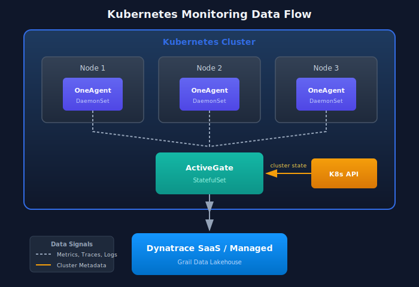
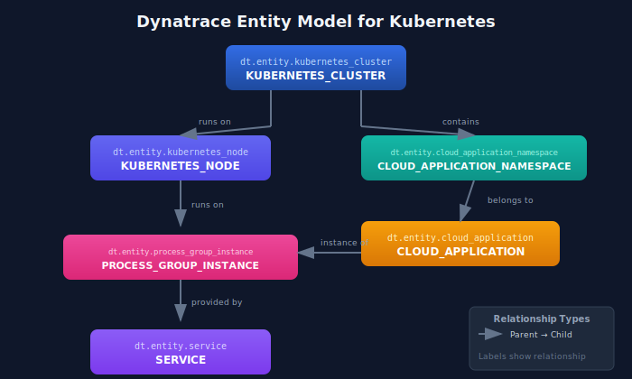

# Kubernetes Monitoring Fundamentals

> **Series:** K8S | **Notebook:** 1 of 9 | **Created:** January 2026 | **Last Updated:** 01/28/2026

## Introduction to Kubernetes Observability with Dynatrace

Kubernetes introduces unique observability challenges: ephemeral workloads, dynamic scaling, complex networking, and multi-layer abstractions. Dynatrace provides comprehensive Kubernetes monitoring through the DynaKube operator, which deploys and manages monitoring components automatically.

---

## Table of Contents

1. Kubernetes Observability Challenges
2. Dynatrace Monitoring Architecture
3. Entity Model for Kubernetes
4. Data Sources and Signals
5. Key Metrics and Dimensions
6. Your First Kubernetes Queries
7. Next Steps

---

## Prerequisites

| Requirement | Details |
|-------------|----------|
| **Dynatrace Environment** | SaaS with Kubernetes monitoring enabled |
| **Kubernetes Cluster** | Any distribution (EKS, AKS, GKE, OpenShift, etc.) |
| **Permissions** | `ReadConfig`, `metrics.read`, `entities.read` |
| **Knowledge** | Basic Kubernetes concepts (pods, deployments, services) |

## 1. Kubernetes Observability Challenges

Kubernetes environments present unique monitoring requirements:

| Challenge | Description | Dynatrace Solution |
|-----------|-------------|--------------------|
| **Ephemeral Workloads** | Pods come and go constantly | Entity relationships preserved across restarts |
| **Dynamic Scaling** | Replicas change based on load | Automatic discovery of new instances |
| **Multi-Layer Stack** | Infra → K8s → App complexity | Unified view from cluster to code |
| **Distributed Services** | Microservices across namespaces | End-to-end distributed tracing |
| **Resource Constraints** | CPU/memory limits and requests | Resource utilization vs. limits monitoring |
| **Network Complexity** | Service mesh, ingress, CNI | Network flow and latency analysis |

### Traditional vs. Cloud-Native Monitoring

| Aspect | Traditional | Kubernetes |
|--------|-------------|------------|
| **Identity** | IP address, hostname | Labels, selectors, namespaces |
| **Lifecycle** | Long-lived servers | Short-lived pods |
| **Configuration** | Static files | Dynamic ConfigMaps, Secrets |
| **Networking** | Fixed topology | Service discovery, DNS |
| **Scaling** | Manual or scheduled | HPA, VPA, KEDA |

## 2. Dynatrace Monitoring Architecture

Dynatrace monitors Kubernetes through multiple components:

### DynaKube Operator Components

| Component | Purpose | Deployment Mode |
|-----------|---------|------------------|
| **OneAgent** | Full-stack monitoring (processes, code) | DaemonSet or application-only |
| **ActiveGate** | Routing, K8s API monitoring | StatefulSet in cluster |
| **Kubernetes Monitoring** | Cluster state, events | Via ActiveGate |
| **Prometheus Integration** | Custom metrics ingestion | Optional |

### Deployment Modes

| Mode | Use Case | OneAgent | Code Modules |
|------|----------|----------|---------------|
| **cloudNativeFullStack** | Full visibility, K8s-native | Privileged DaemonSet | Injected via webhook |
| **classicFullStack** | Traditional deployment | Privileged DaemonSet | Loaded from host |
| **applicationMonitoring** | App-only, no infra | None | Injected via webhook |
| **hostMonitoring** | Infra-only | DaemonSet | None |

### Data Flow



<!-- MARKDOWN_TABLE_ALTERNATIVE
| Component | Location | Function |
|-----------|----------|----------|
| OneAgent (DaemonSet) | Each Node | Collects metrics, traces, logs |
| ActiveGate (StatefulSet) | In Cluster | Routes data, monitors K8s API |
| K8s API | Control Plane | Provides cluster state metadata |
| Dynatrace SaaS/Managed | Cloud | Stores and analyzes all telemetry |
For environments where SVG doesn't render
-->

## 3. Entity Model for Kubernetes

Dynatrace creates entities for each Kubernetes resource and maintains relationships between them.

### Kubernetes Entity Types

| Entity Type | Description | Key Attributes |
|-------------|-------------|----------------|
| `KUBERNETES_CLUSTER` | Cluster-level entity | Name, version, cloud provider |
| `KUBERNETES_NODE` | Worker nodes | CPU, memory, conditions |
| `CLOUD_APPLICATION_NAMESPACE` | Namespaces | Name, labels |
| `CLOUD_APPLICATION` | Deployments, StatefulSets | Replicas, strategy |
| `PROCESS_GROUP_INSTANCE` | Container processes | Image, resources |
| `SERVICE` | Detected services | Endpoints, technology |

### Entity Relationships



<!-- MARKDOWN_TABLE_ALTERNATIVE
| Parent Entity | Relationship | Child Entity |
|---------------|--------------|--------------|
| KUBERNETES_CLUSTER | runs on | KUBERNETES_NODE |
| KUBERNETES_NODE | runs on | PROCESS_GROUP_INSTANCE |
| PROCESS_GROUP_INSTANCE | provided by | SERVICE |
| KUBERNETES_CLUSTER | contains | CLOUD_APPLICATION_NAMESPACE |
| CLOUD_APPLICATION_NAMESPACE | belongs to | CLOUD_APPLICATION |
| CLOUD_APPLICATION | instance of | PROCESS_GROUP_INSTANCE |
For environments where SVG doesn't render
-->

### Entity Naming

| Resource | Dynatrace Entity Name Pattern |
|----------|-------------------------------|
| Cluster | Cluster name from kubeconfig |
| Namespace | `namespace-name` |
| Deployment | `deployment-name` in namespace |
| Pod | `pod-name` (ephemeral, tied to PGI) |
| Service | Auto-detected from traffic patterns |

## 4. Data Sources and Signals

Dynatrace collects multiple signal types from Kubernetes:

### Metrics

| Source | Metrics | Examples |
|--------|---------|----------|
| **Kubelet** | Container resources | CPU, memory, network I/O |
| **kube-state-metrics** | Cluster state | Replica counts, conditions |
| **cAdvisor** | Container stats | Filesystem, limits |
| **API Server** | Control plane | Request latency, etcd |
| **Custom** | Prometheus endpoints | App-specific metrics |

### Logs

| Log Type | Source | Use Case |
|----------|--------|----------|
| **Container logs** | stdout/stderr | Application debugging |
| **Kubernetes events** | API server | Scheduling, scaling, errors |
| **Audit logs** | API server | Security, compliance |
| **Node logs** | kubelet, runtime | Infrastructure issues |

### Traces

| Trace Source | Coverage |
|--------------|----------|
| **OneAgent auto-instrumentation** | Supported languages/frameworks |
| **OpenTelemetry** | Custom instrumentation |
| **Service mesh** | Istio, Linkerd sidecars |

## 5. Key Metrics and Dimensions

### Container Resource Metrics

| Metric | Description | Unit |
|--------|-------------|------|
| `builtin:containers.cpu.usagePercent` | CPU usage vs. limit | Percent |
| `builtin:containers.memory.usagePercent` | Memory usage vs. limit | Percent |
| `builtin:containers.cpu.throttledTime` | Time CPU was throttled | Milliseconds |
| `builtin:containers.memory.workingSetBytes` | Working set memory | Bytes |

### Kubernetes Workload Metrics

| Metric | Description | Unit |
|--------|-------------|------|
| `builtin:kubernetes.workload.requests_cpu` | CPU requests | Millicores |
| `builtin:kubernetes.workload.requests_memory` | Memory requests | Bytes |
| `builtin:kubernetes.workload.limits_cpu` | CPU limits | Millicores |
| `builtin:kubernetes.workload.limits_memory` | Memory limits | Bytes |

### Cluster Health Metrics

| Metric | Description | Unit |
|--------|-------------|------|
| `builtin:kubernetes.node.cpu_available` | Available CPU on nodes | Millicores |
| `builtin:kubernetes.node.memory_available` | Available memory on nodes | Bytes |
| `builtin:kubernetes.pods` | Pod count by state | Count |

```dql
// List all monitored Kubernetes clusters
fetch dt.entity.kubernetes_cluster
| fields entity.name, tags
| sort entity.name asc
```

```dql
// Count all Kubernetes nodes
fetch dt.entity.kubernetes_node
| summarize nodeCount = count()
```

```dql
// List namespaces
fetch dt.entity.cloud_application_namespace
| fields entity.name, tags
| sort entity.name asc
| limit 50
```

## 6. Your First Kubernetes Queries

Let's explore common queries for Kubernetes monitoring.

```dql
// Container CPU usage - find highest consumers
fetch dt.metrics
| filter metric.key == "dt.containers.cpu.usage_percent"
| summarize avgCpu = avg(value), by:{dt.entity.container_group_instance}
| sort avgCpu desc
| limit 20
```

```dql
// Container memory usage approaching limits
fetch dt.metrics
| filter metric.key == "dt.containers.memory.usage_percent"
| summarize avgMem = avg(value), by:{dt.entity.container_group_instance}
| filter avgMem > 80
| sort avgMem desc
```

```dql
// Kubernetes events - recent warnings and errors
fetch logs
| filter matchesPhrase(log.source, "kubernetes") or matchesPhrase(log.source, "k8s")
| filter matchesPhrase(content, "Warning") or matchesPhrase(content, "Error")
| fields timestamp, content
| sort timestamp desc
| limit 50
```

```dql
// Pod restarts - find crashlooping workloads
fetch logs
| filter matchesPhrase(content, "BackOff") or matchesPhrase(content, "CrashLoopBackOff")
| summarize restartCount = count(), by:{timeBucket = bin(timestamp, 1h)}
| sort timeBucket desc
```

## 7. Next Steps

Now that you understand Kubernetes monitoring fundamentals, proceed to:

| Next Notebook | Topic |
|---------------|-------|
| **K8S-02: DynaKube Operator Deployment** | Install and configure the operator |
| **K8S-03: GitOps for DynaKube** | Manage DynaKube with ArgoCD/Flux |
| **K8S-04: Cluster Health Monitoring** | Deep-dive into cluster metrics |

---

## Summary

In this notebook, you learned:

- Kubernetes observability challenges and how Dynatrace addresses them
- Dynatrace monitoring architecture (OneAgent, ActiveGate, DynaKube)
- Entity model for Kubernetes resources
- Data sources: metrics, logs, and traces
- Key metrics for container and cluster monitoring
- Basic DQL queries for Kubernetes data

---

## References

- [Kubernetes Monitoring Overview](https://docs.dynatrace.com/docs/observe/infrastructure-monitoring/kubernetes-and-openshift-monitoring)
- [DynaKube Operator](https://docs.dynatrace.com/docs/ingest-from/setup-on-k8s/deployment)
- [Kubernetes Metrics](https://docs.dynatrace.com/docs/observe/infrastructure-monitoring/kubernetes-and-openshift-monitoring/kubernetes-cluster-monitoring)

---

<sub>*This notebook was AI-generated from community-submitted and publicly available sources. This notebook series is not officially supported by Dynatrace. Always verify information against official Dynatrace documentation.*</sub>
