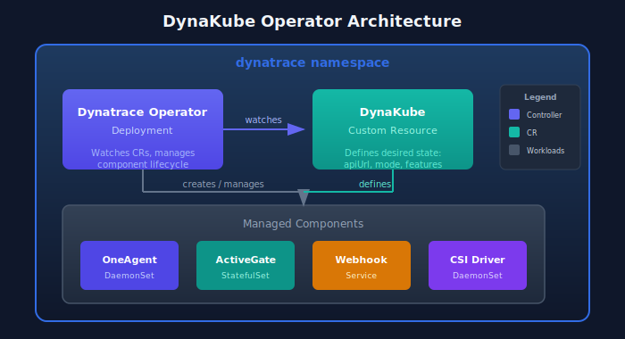

# DynaKube Operator Deployment

> **Series:** K8S | **Notebook:** 2 of 9 | **Created:** January 2026

## Installing and Configuring the Dynatrace Operator

The DynaKube operator is the recommended way to deploy Dynatrace monitoring in Kubernetes. This notebook covers installation via Helm, configuration options, and deployment modes for different use cases.

---

## Table of Contents

1. Operator Overview
2. Prerequisites Setup
3. Helm Chart Installation
4. DynaKube Custom Resource
5. Deployment Modes Explained
6. Configuration Options
7. Verification and Validation
8. Upgrading the Operator
9. Next Steps

---

## Prerequisites

| Requirement | Details |
|-------------|----------|
| **Dynatrace Environment** | SaaS tenant with API tokens |
| **Kubernetes Cluster** | v1.24+ with admin access |
| **Helm** | v3.x installed |
| **kubectl** | Configured for your cluster |
| **API Tokens** | Operator token + Data ingest token |

## 1. Operator Overview

The Dynatrace Operator manages the complete lifecycle of Dynatrace monitoring components.

### What the Operator Manages

| Component | Description | Managed By |
|-----------|-------------|------------|
| **OneAgent DaemonSet** | Node-level monitoring | Operator |
| **ActiveGate StatefulSet** | Routing and K8s API access | Operator |
| **Webhook** | Code module injection | Operator |
| **CSI Driver** | Volume-based code modules | Operator |

### Operator Architecture



<!-- MARKDOWN_TABLE_ALTERNATIVE
| Component | Type | Function |
|-----------|------|----------|
| Dynatrace Operator | Deployment | Watches DynaKube CR, manages components |
| DynaKube | Custom Resource | Defines desired monitoring state |
| OneAgent | DaemonSet | Full-stack monitoring on each node |
| ActiveGate | StatefulSet | Routing and K8s API monitoring |
| Webhook | Service | Code module injection |
| CSI Driver | DaemonSet | Volume-based code modules |
For environments where SVG doesn't render
-->

## 2. Prerequisites Setup

### Required API Tokens

Create two tokens in Dynatrace with these scopes:

**Operator Token:**

| Scope | Purpose |
|-------|----------|
| `activeGateTokenManagement.create` | ActiveGate tokens |
| `entities.read` | Entity information |
| `settings.read` | Read settings |
| `settings.write` | Write settings |
| `DataExport` | Export data (optional) |
| `InstallerDownload` | Download OneAgent |

**Data Ingest Token:**

| Scope | Purpose |
|-------|----------|
| `metrics.ingest` | Ingest metrics |
| `logs.ingest` | Ingest logs |
| `events.ingest` | Ingest events (optional) |

### Create Namespace and Secret

```bash
# Create namespace
kubectl create namespace dynatrace

# Create secret with tokens
kubectl create secret generic dynakube \
  --namespace dynatrace \
  --from-literal=apiToken=<OPERATOR_TOKEN> \
  --from-literal=dataIngestToken=<DATA_INGEST_TOKEN>
```

## 3. Helm Chart Installation

### Add the Dynatrace Helm Repository

```bash
# Add Dynatrace Helm repo
helm repo add dynatrace https://raw.githubusercontent.com/Dynatrace/dynatrace-operator/main/config/helm/repos/stable

# Update repo cache
helm repo update

# View available versions
helm search repo dynatrace/dynatrace-operator --versions
```

### Install the Operator

```bash
# Install operator only (DynaKube CR applied separately)
helm install dynatrace-operator dynatrace/dynatrace-operator \
  --namespace dynatrace \
  --create-namespace \
  --wait
```

### Install with Custom Values

```bash
# Create values file
cat > dt-values.yaml << 'EOF'
# Operator configuration
operator:
  image: ""
  customPullSecret: ""
  
# Platform-specific settings
platform: "kubernetes"  # or "openshift"

# Webhook configuration
webhook:
  hostNetwork: false

# CSI driver
csidriver:
  enabled: true
EOF

# Install with values
helm install dynatrace-operator dynatrace/dynatrace-operator \
  --namespace dynatrace \
  --values dt-values.yaml \
  --wait
```

## 4. DynaKube Custom Resource

The DynaKube CR defines how monitoring is deployed.

### Minimal DynaKube (cloudNativeFullStack)

```yaml
apiVersion: dynatrace.com/v1beta3
kind: DynaKube
metadata:
  name: dynakube
  namespace: dynatrace
spec:
  # Your Dynatrace environment URL
  apiUrl: https://ENVIRONMENT_ID.live.dynatrace.com/api
  
  # OneAgent deployment mode
  oneAgent:
    cloudNativeFullStack:
      tolerations:
        - effect: NoSchedule
          key: node-role.kubernetes.io/master
          operator: Exists
        - effect: NoSchedule
          key: node-role.kubernetes.io/control-plane
          operator: Exists
  
  # ActiveGate for Kubernetes monitoring
  activeGate:
    capabilities:
      - kubernetes-monitoring
      - routing
      - dynatrace-api
```

### Apply the DynaKube

```bash
# Apply DynaKube CR
kubectl apply -f dynakube.yaml

# Watch deployment progress
kubectl -n dynatrace get dynakube -w
```

## 5. Deployment Modes Explained

### cloudNativeFullStack (Recommended)

```yaml
oneAgent:
  cloudNativeFullStack:
    # Injected via webhook using CSI driver volumes
```

| Pros | Cons |
|------|------|
| No privileged containers for apps | Requires CSI driver |
| Best for multi-tenant clusters | Slightly more complex |
| Independent app/infra monitoring | |

### classicFullStack

```yaml
oneAgent:
  classicFullStack:
    # OneAgent DaemonSet provides code modules via host mounts
```

| Pros | Cons |
|------|------|
| Simpler architecture | All pods share OneAgent |
| Single component | Requires hostPath mounts |

### applicationMonitoring

```yaml
oneAgent:
  applicationMonitoring:
    # Only application-level monitoring, no infrastructure
    useCSIDriver: true
```

| Pros | Cons |
|------|------|
| Minimal footprint | No infrastructure visibility |
| No node-level access needed | No container metrics |
| Good for managed K8s | |

### hostMonitoring

```yaml
oneAgent:
  hostMonitoring: {}
```

| Pros | Cons |
|------|------|
| Infrastructure only | No application tracing |
| Lightweight | No code-level insight |

## 6. Configuration Options

### Resource Limits

```yaml
spec:
  oneAgent:
    cloudNativeFullStack:
      resources:
        requests:
          cpu: 100m
          memory: 256Mi
        limits:
          cpu: 300m
          memory: 512Mi
```

### Node Selectors and Tolerations

```yaml
spec:
  oneAgent:
    cloudNativeFullStack:
      nodeSelector:
        kubernetes.io/os: linux
      tolerations:
        - key: "dedicated"
          operator: "Equal"
          value: "monitoring"
          effect: "NoSchedule"
```

### Namespace Selectors

Control which namespaces get injection:

```yaml
spec:
  namespaceSelector:
    matchLabels:
      dynatrace-injection: enabled
```

Or exclude specific namespaces:

```yaml
spec:
  namespaceSelector:
    matchExpressions:
      - key: dynatrace-injection
        operator: NotIn
        values:
          - disabled
```

### Custom ActiveGate Configuration

```yaml
spec:
  activeGate:
    capabilities:
      - kubernetes-monitoring
      - routing
    replicas: 2
    resources:
      requests:
        cpu: 500m
        memory: 512Mi
      limits:
        cpu: 1000m
        memory: 1Gi
    topologySpreadConstraints:
      - maxSkew: 1
        topologyKey: topology.kubernetes.io/zone
        whenUnsatisfiable: ScheduleAnyway
```

### Feature Flags and Annotations

Control injection at the pod level:

| Annotation | Effect |
|------------|--------|
| `oneagent.dynatrace.com/inject: "false"` | Disable injection for pod |
| `oneagent.dynatrace.com/inject: "true"` | Force enable injection |
| `oneagent.dynatrace.com/technologies: "java,nodejs"` | Limit technologies |

DynaKube feature flags:

```yaml
spec:
  oneAgent:
    cloudNativeFullStack:
      env:
        - name: ONEAGENT_ENABLE_VOLUME_STORAGE
          value: "true"
```

## 7. Verification and Validation

### Check Operator Status

```bash
# Operator pods
kubectl -n dynatrace get pods -l app.kubernetes.io/name=dynatrace-operator

# DynaKube status
kubectl -n dynatrace get dynakube

# Detailed status
kubectl -n dynatrace describe dynakube dynakube
```

### Check OneAgent Deployment

```bash
# OneAgent DaemonSet
kubectl -n dynatrace get daemonset -l app.kubernetes.io/component=oneagent

# OneAgent pods on each node
kubectl -n dynatrace get pods -l app.kubernetes.io/component=oneagent -o wide
```

### Check ActiveGate

```bash
# ActiveGate StatefulSet
kubectl -n dynatrace get statefulset -l app.kubernetes.io/component=activegate

# ActiveGate pods
kubectl -n dynatrace get pods -l app.kubernetes.io/component=activegate
```

### DynaKube Status Phases

| Phase | Meaning |
|-------|----------|
| `Running` | All components healthy |
| `Deploying` | Components being created |
| `Error` | Check events for details |

```dql
// Verify Kubernetes cluster is reporting to Dynatrace
fetch dt.entity.kubernetes_cluster
| fields entity.name, tags
| sort entity.name asc
```

```dql
// Check OneAgent deployment health via events
fetch logs
| filter matchesPhrase(content, "dynatrace") and matchesPhrase(content, "oneagent")
| fields timestamp, content
| sort timestamp desc
| limit 20
```

## 8. Upgrading the Operator

### Helm Upgrade Process

```bash
# Update Helm repo
helm repo update

# Check current version
helm list -n dynatrace

# Upgrade to latest
helm upgrade dynatrace-operator dynatrace/dynatrace-operator \
  --namespace dynatrace \
  --reuse-values \
  --wait
```

### Version Compatibility

| Operator Version | Min K8s | Max K8s | Notes |
|------------------|---------|---------|-------|
| 1.0.x | 1.21 | 1.28 | Legacy |
| 1.1.x | 1.23 | 1.29 | Current |
| 1.2.x | 1.24 | 1.30 | Latest |

### Rollback if Needed

```bash
# View history
helm history dynatrace-operator -n dynatrace

# Rollback to previous version
helm rollback dynatrace-operator 1 -n dynatrace
```

## Next Steps

Now that the operator is deployed, proceed to:

| Next Notebook | Topic |
|---------------|-------|
| **K8S-03: GitOps for DynaKube** | Manage DynaKube with ArgoCD/Flux |
| **K8S-04: Cluster Health Monitoring** | Deep-dive into cluster metrics |
| **K8S-05: Workload Monitoring** | Application-level observability |

---

## Summary

In this notebook, you learned:

- Dynatrace Operator architecture and components
- Prerequisites: API tokens and namespace setup
- Helm chart installation with custom values
- DynaKube CR structure and configuration
- Deployment modes and when to use each
- Configuration options for resources, selectors, and features
- Verification commands and status phases
- Upgrade and rollback procedures

---

## References

- [Dynatrace Operator](https://docs.dynatrace.com/docs/ingest-from/setup-on-k8s/deployment)
- [DynaKube CRD Reference](https://docs.dynatrace.com/docs/ingest-from/setup-on-k8s/reference/dynakube-crd)
- [Helm Chart Values](https://github.com/Dynatrace/dynatrace-operator/blob/main/config/helm/chart/default/values.yaml)

---

<sub>*This notebook was AI-generated from community-submitted and publicly available sources. This notebook series is not officially supported by Dynatrace. Always verify information against official Dynatrace documentation.*</sub>
