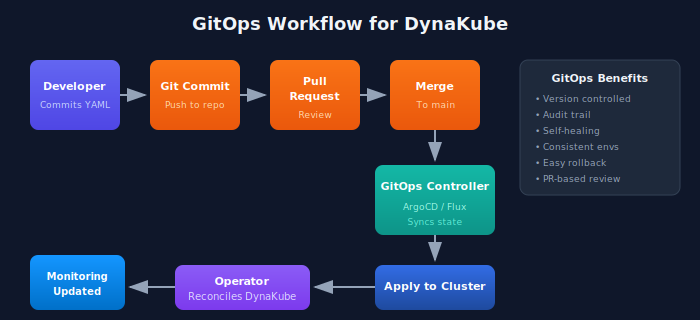

# GitOps for DynaKube

> **Series:** K8S | **Notebook:** 3 of 9 | **Created:** January 2026

## Managing DynaKube with ArgoCD and Flux

GitOps enables declarative, version-controlled management of your Dynatrace monitoring configuration. This notebook covers integrating DynaKube with popular GitOps tools: ArgoCD and Flux.

---

## Table of Contents

1. GitOps Principles for Observability
2. ArgoCD Integration
3. Flux Integration
4. Secret Management
5. Multi-Cluster Patterns
6. Progressive Rollouts
7. Troubleshooting GitOps Deployments
8. Next Steps

---

## Prerequisites

| Requirement | Details |
|-------------|----------|
| **GitOps Tool** | ArgoCD v2.x or Flux v2.x |
| **Git Repository** | Write access for configuration |
| **Kubernetes** | Dynatrace Operator installed |
| **Knowledge** | Familiarity with K8S-02: DynaKube Deployment |

## 1. GitOps Principles for Observability

### Why GitOps for Monitoring?

| Benefit | Description |
|---------|-------------|
| **Version Control** | Track all config changes in Git history |
| **Audit Trail** | Who changed what, when, and why |
| **Consistency** | Same config across dev/staging/prod |
| **Self-Healing** | Automatic drift correction |
| **Rollback** | Revert by reverting Git commits |

### GitOps Workflow for DynaKube



<!-- MARKDOWN_TABLE_ALTERNATIVE
| Step | Action | Component |
|------|--------|-----------|
| 1 | Developer commits YAML | Git Repository |
| 2 | Pull Request reviewed | Git Repository |
| 3 | Merge to main | Git Repository |
| 4 | GitOps controller detects | ArgoCD / Flux |
| 5 | Apply to cluster | Kubernetes API |
| 6 | Operator reconciles | Dynatrace Operator |
| 7 | Monitoring updated | OneAgent / ActiveGate |
For environments where SVG doesn't render
-->

### Repository Structure

```
monitoring-config/
├── base/
│   ├── namespace.yaml
│   ├── operator/
│   │   └── kustomization.yaml
│   └── dynakube/
│       ├── dynakube.yaml
│       └── kustomization.yaml
├── overlays/
│   ├── dev/
│   │   ├── kustomization.yaml
│   │   └── dynakube-patch.yaml
│   ├── staging/
│   │   └── ...
│   └── prod/
│       └── ...
└── clusters/
    ├── dev-cluster/
    ├── staging-cluster/
    └── prod-cluster/
```

## 2. ArgoCD Integration

### ArgoCD Application for Operator

```yaml
apiVersion: argoproj.io/v1alpha1
kind: Application
metadata:
  name: dynatrace-operator
  namespace: argocd
spec:
  project: monitoring
  source:
    repoURL: https://raw.githubusercontent.com/Dynatrace/dynatrace-operator/main/config/helm/repos/stable
    chart: dynatrace-operator
    targetRevision: 1.2.0  # Pin version for stability
    helm:
      releaseName: dynatrace-operator
      values: |
        platform: kubernetes
        csidriver:
          enabled: true
  destination:
    server: https://kubernetes.default.svc
    namespace: dynatrace
  syncPolicy:
    automated:
      prune: true
      selfHeal: true
    syncOptions:
      - CreateNamespace=true
```

### ArgoCD Application for DynaKube

```yaml
apiVersion: argoproj.io/v1alpha1
kind: Application
metadata:
  name: dynakube
  namespace: argocd
spec:
  project: monitoring
  source:
    repoURL: https://github.com/your-org/monitoring-config
    targetRevision: main
    path: overlays/prod
  destination:
    server: https://kubernetes.default.svc
    namespace: dynatrace
  syncPolicy:
    automated:
      prune: false  # Don't auto-delete DynaKube
      selfHeal: true
```

### ArgoCD App of Apps Pattern

Manage multiple clusters from a single Application:

```yaml
apiVersion: argoproj.io/v1alpha1
kind: Application
metadata:
  name: monitoring-apps
  namespace: argocd
spec:
  project: monitoring
  source:
    repoURL: https://github.com/your-org/monitoring-config
    targetRevision: main
    path: clusters
  destination:
    server: https://kubernetes.default.svc
    namespace: argocd
  syncPolicy:
    automated:
      prune: true
      selfHeal: true
```

## 3. Flux Integration

### Flux HelmRelease for Operator

```yaml
apiVersion: source.toolkit.fluxcd.io/v1beta2
kind: HelmRepository
metadata:
  name: dynatrace
  namespace: flux-system
spec:
  interval: 1h
  url: https://raw.githubusercontent.com/Dynatrace/dynatrace-operator/main/config/helm/repos/stable
---
apiVersion: helm.toolkit.fluxcd.io/v2beta1
kind: HelmRelease
metadata:
  name: dynatrace-operator
  namespace: dynatrace
spec:
  interval: 5m
  chart:
    spec:
      chart: dynatrace-operator
      version: "1.2.x"  # SemVer range for auto-updates
      sourceRef:
        kind: HelmRepository
        name: dynatrace
        namespace: flux-system
  values:
    platform: kubernetes
    csidriver:
      enabled: true
```

### Flux Kustomization for DynaKube

```yaml
apiVersion: kustomize.toolkit.fluxcd.io/v1
kind: Kustomization
metadata:
  name: dynakube
  namespace: flux-system
spec:
  interval: 10m
  path: ./overlays/prod
  prune: true
  sourceRef:
    kind: GitRepository
    name: monitoring-config
  healthChecks:
    - apiVersion: dynatrace.com/v1beta3
      kind: DynaKube
      name: dynakube
      namespace: dynatrace
  dependsOn:
    - name: dynatrace-operator
```

### Flux GitRepository Source

```yaml
apiVersion: source.toolkit.fluxcd.io/v1
kind: GitRepository
metadata:
  name: monitoring-config
  namespace: flux-system
spec:
  interval: 1m
  url: https://github.com/your-org/monitoring-config
  ref:
    branch: main
  secretRef:
    name: git-credentials
```

## 4. Secret Management

API tokens should never be stored in Git. Use these approaches:

### Option 1: External Secrets Operator

```yaml
apiVersion: external-secrets.io/v1beta1
kind: ExternalSecret
metadata:
  name: dynakube
  namespace: dynatrace
spec:
  refreshInterval: 1h
  secretStoreRef:
    kind: ClusterSecretStore
    name: vault  # or aws-secrets-manager, gcp-secret-manager
  target:
    name: dynakube
    creationPolicy: Owner
  data:
    - secretKey: apiToken
      remoteRef:
        key: dynatrace/operator-token
    - secretKey: dataIngestToken
      remoteRef:
        key: dynatrace/data-ingest-token
```

### Option 2: Sealed Secrets

```bash
# Create sealed secret from raw secret
kubectl create secret generic dynakube \
  --namespace dynatrace \
  --from-literal=apiToken=<your-api-token> \
  --from-literal=dataIngestToken=<your-data-ingest-token> \
  --dry-run=client -o yaml | \
  kubeseal --format yaml > dynakube-sealed.yaml
```

```yaml
# Sealed secret (safe to commit)
apiVersion: bitnami.com/v1alpha1
kind: SealedSecret
metadata:
  name: dynakube
  namespace: dynatrace
spec:
  encryptedData:
    apiToken: AgBy8hM...
    dataIngestToken: AgCtr9...
```

### Option 3: SOPS with Age/GPG

```yaml
# .sops.yaml in repo root
creation_rules:
  - path_regex: .*.secret.yaml$
    age: age1ql3z7hjy54pw...
```

```bash
# Encrypt secrets
sops --encrypt secrets.yaml > secrets.secret.yaml

# Flux decrypts automatically with kustomize-controller
```

## 5. Multi-Cluster Patterns

### Kustomize Overlays by Environment

**Base DynaKube (`base/dynakube/dynakube.yaml`):**

```yaml
apiVersion: dynatrace.com/v1beta3
kind: DynaKube
metadata:
  name: dynakube
spec:
  apiUrl: PLACEHOLDER  # Patched per environment
  oneAgent:
    cloudNativeFullStack: {}
  activeGate:
    capabilities:
      - kubernetes-monitoring
      - routing
```

**Production Overlay (`overlays/prod/kustomization.yaml`):**

```yaml
apiVersion: kustomize.config.k8s.io/v1beta1
kind: Kustomization
namespace: dynatrace
resources:
  - ../../base/dynakube
patches:
  - patch: |-
      - op: replace
        path: /spec/apiUrl
        value: https://prod-env.live.dynatrace.com/api
    target:
      kind: DynaKube
      name: dynakube
```

### Environment-Specific Configuration

| Environment | Config Difference |
|-------------|-------------------|
| **Dev** | Lower resources, fewer replicas |
| **Staging** | Match prod config, different tenant |
| **Prod** | High availability, more resources |

**Dev Patch (`overlays/dev/dynakube-patch.yaml`):**

```yaml
apiVersion: dynatrace.com/v1beta3
kind: DynaKube
metadata:
  name: dynakube
spec:
  activeGate:
    replicas: 1
    resources:
      requests:
        cpu: 100m
        memory: 256Mi
```

## 6. Progressive Rollouts

### ArgoCD Sync Waves

Control deployment order:

```yaml
# Wave 0: CRDs and Namespace
apiVersion: v1
kind: Namespace
metadata:
  name: dynatrace
  annotations:
    argocd.argoproj.io/sync-wave: "0"
---
# Wave 1: Operator
apiVersion: argoproj.io/v1alpha1
kind: Application
metadata:
  name: dynatrace-operator
  annotations:
    argocd.argoproj.io/sync-wave: "1"
---
# Wave 2: DynaKube
apiVersion: argoproj.io/v1alpha1
kind: Application
metadata:
  name: dynakube
  annotations:
    argocd.argoproj.io/sync-wave: "2"
```

### Flux Dependency Ordering

```yaml
apiVersion: kustomize.toolkit.fluxcd.io/v1
kind: Kustomization
metadata:
  name: dynakube
spec:
  dependsOn:
    - name: dynatrace-operator
    - name: external-secrets  # If using ESO for tokens
```

### Canary Deployments

Roll out monitoring changes gradually:

1. Deploy to dev cluster → validate
2. Deploy to staging → run tests
3. Deploy to prod-canary (subset) → monitor
4. Deploy to prod (all clusters)

## 7. Troubleshooting GitOps Deployments

### ArgoCD Troubleshooting

```bash
# Check application status
argocd app get dynakube

# View sync diff
argocd app diff dynakube

# Force sync
argocd app sync dynakube --force

# View logs
kubectl -n argocd logs -l app.kubernetes.io/name=argocd-application-controller
```

### Flux Troubleshooting

```bash
# Check kustomization status
flux get kustomizations

# Check helm releases
flux get helmreleases -n dynatrace

# Force reconciliation
flux reconcile kustomization dynakube --with-source

# View events
kubectl -n flux-system get events --sort-by='.lastTimestamp'
```

### Common Issues

| Issue | Cause | Solution |
|-------|-------|----------|
| **Secret not found** | External secret sync delay | Check ESO status, wait for sync |
| **CRD not found** | Operator not deployed | Check operator app status |
| **Sync failed** | YAML syntax error | Validate with `kubectl --dry-run` |
| **Drift detected** | Manual changes | Revert or accept drift in Git |

```dql
// Monitor GitOps-related events in the cluster
fetch logs
| filter matchesPhrase(content, "argocd") or matchesPhrase(content, "flux")
| fields timestamp, content
| sort timestamp desc
| limit 30
```

```dql
// Track DynaKube configuration changes
fetch logs
| filter matchesPhrase(content, "dynakube") and (matchesPhrase(content, "updated") or matchesPhrase(content, "created") or matchesPhrase(content, "deleted"))
| fields timestamp, content
| sort timestamp desc
| limit 20
```

## Next Steps

With GitOps configured, proceed to:

| Next Notebook | Topic |
|---------------|-------|
| **K8S-04: Cluster Health Monitoring** | Deep-dive into cluster metrics |
| **K8S-05: Workload Monitoring** | Application-level observability |
| **K8S-06: Namespace Organization** | Boundaries and access control |

---

## Summary

In this notebook, you learned:

- GitOps principles and benefits for monitoring
- ArgoCD Application definitions for operator and DynaKube
- Flux HelmRelease and Kustomization for DynaKube
- Secret management with External Secrets, Sealed Secrets, and SOPS
- Multi-cluster patterns with Kustomize overlays
- Progressive rollout strategies
- Troubleshooting GitOps deployments

---

## References

- [ArgoCD Documentation](https://argo-cd.readthedocs.io/en/stable/)
- [Flux Documentation](https://fluxcd.io/flux/)
- [External Secrets Operator](https://external-secrets.io/)
- [Kustomize](https://kustomize.io/)

---

<sub>*This notebook was AI-generated from community-submitted and publicly available sources. This notebook series is not officially supported by Dynatrace. Always verify information against official Dynatrace documentation.*</sub>
