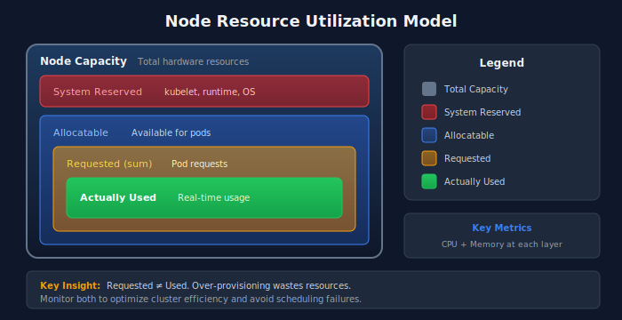

# Cluster Health Monitoring

> **Series:** K8S | **Notebook:** 4 of 9 | **Created:** January 2026

## Deep-Dive into Kubernetes Cluster Metrics

Cluster health monitoring provides visibility into the infrastructure layer of Kubernetes: nodes, control plane, and cluster-wide resources. This notebook covers key metrics, thresholds, and DQL queries for proactive cluster management.

---

## Table of Contents

1. Cluster Health Overview
2. Node Monitoring
3. Resource Capacity Planning
4. Control Plane Health
5. Cluster-Wide Events
6. Cost Optimization Queries
7. Alerting Strategies
8. Next Steps

---

## Prerequisites

| Requirement | Details |
|-------------|----------|
| **Dynatrace Environment** | SaaS with Kubernetes monitoring |
| **DynaKube** | ActiveGate with `kubernetes-monitoring` capability |
| **Permissions** | `metrics.read`, `entities.read`, `logs.read` |
| **Data** | At least 24 hours of cluster data |

## 1. Cluster Health Overview

### Key Health Indicators

| Category | Metrics | Healthy State |
|----------|---------|---------------|
| **Node Status** | Ready/NotReady | All nodes Ready |
| **Pod Scheduling** | Pending pods | No long-pending pods |
| **Resource Pressure** | CPU/Memory pressure | No pressure conditions |
| **Disk Pressure** | Disk space, inode usage | >15% available |
| **Network** | CNI health, DNS latency | <100ms DNS resolution |

### Dynatrace Kubernetes Dashboard

The built-in Kubernetes dashboard provides:
- Cluster overview with node status
- Namespace resource usage
- Workload health summary
- Recent events and problems

Navigate to: **Infrastructure > Kubernetes**

```dql
// Cluster overview - nodes and status
fetch dt.entity.kubernetes_cluster
| fields entity.name, clusterId, tags
| lookup [fetch dt.entity.kubernetes_node | summarize nodeCount = count(), by:{belongs_to[dt.entity.kubernetes_cluster]}], sourceField:id, lookupField:belongs_to[dt.entity.kubernetes_cluster]
| fields entity.name, nodeCount
| sort entity.name asc
```

## 2. Node Monitoring

### Node Status and Conditions

| Condition | Description | Alert When |
|-----------|-------------|------------|
| **Ready** | Node can accept pods | False for >5 min |
| **MemoryPressure** | Low memory | True |
| **DiskPressure** | Low disk space | True |
| **PIDPressure** | Too many processes | True |
| **NetworkUnavailable** | Network not configured | True |

```dql
// List all Kubernetes nodes with details
fetch dt.entity.kubernetes_node
| fields entity.name, kubernetesClusterName, cpuCores, physicalMemory, tags
| sort kubernetesClusterName asc, entity.name asc
```

```dql
// Node CPU utilization over time
timeseries nodeCpu = avg(dt.kubernetes.node.cpu_usage), by:{dt.entity.kubernetes_node}
| sort avg(nodeCpu) desc
| limit 10
```

```dql
// Node memory utilization - find nodes approaching limits
timeseries nodeMemory = avg(dt.kubernetes.node.memory_usage), by:{dt.entity.kubernetes_node}
| filter avg(nodeMemory) > 80
| sort avg(nodeMemory) desc
```

```dql
// Node filesystem usage - disk pressure detection
timeseries diskUsage = avg(dt.host.disk.used.percent), by:{dt.entity.host}
| filter avg(diskUsage) > 80
| sort avg(diskUsage) desc
```

## 3. Resource Capacity Planning

### Capacity Metrics

| Metric | Description | Use Case |
|--------|-------------|----------|
| **Allocatable** | Resources available for pods | Scheduling decisions |
| **Requested** | Sum of pod requests | Capacity planning |
| **Used** | Actual consumption | Right-sizing |
| **Limits** | Maximum allowed | Burst capacity |

### Utilization vs. Allocation



<!-- MARKDOWN_TABLE_ALTERNATIVE
| Layer | Description |
|-------|-------------|
| Node Capacity | Total hardware resources |
| System Reserved | kubelet, runtime, OS |
| Allocatable | Available for pods |
| Requested (sum) | Pod requests |
| Actually Used | Real-time usage |

**Key Insight:** Requested ≠ Used. Over-provisioning wastes resources. Monitor both to optimize cluster efficiency.
For environments where SVG doesn't render
-->

```dql
// CPU request vs. usage by namespace
timeseries cpuRequests = sum(dt.kubernetes.workload.requests_cpu), by:{k8s.namespace.name}
| sort avg(cpuRequests) desc
| limit 15
```

```dql
// Memory requests by namespace
timeseries memRequests = sum(dt.kubernetes.workload.requests_memory), by:{k8s.namespace.name}
| sort avg(memRequests) desc
| limit 15
```

```dql
// Find over-provisioned workloads (low usage vs high requests)
timeseries cpuUsage = avg(dt.containers.cpu.usage_percent), by:{dt.entity.cloud_application}
| filter avg(cpuUsage) < 20
| sort avg(cpuUsage) asc
| limit 20
```

## 4. Control Plane Health

### Control Plane Components

| Component | Function | Key Metrics |
|-----------|----------|-------------|
| **API Server** | REST API for K8s | Request latency, error rate |
| **etcd** | Distributed KV store | Disk sync latency, leader elections |
| **Scheduler** | Pod placement | Scheduling latency, failures |
| **Controller Manager** | Reconciliation loops | Queue depth, sync latency |

### Managed Kubernetes Note

For managed Kubernetes (EKS, AKS, GKE), control plane metrics are limited. Focus on:
- API server response times (client-side)
- Kubernetes events for scheduling issues
- Cloud provider metrics for control plane health

```dql
// API server events and errors
fetch logs
| filter matchesPhrase(content, "kube-apiserver") or matchesPhrase(content, "api-server")
| filter matchesPhrase(content, "error") or matchesPhrase(content, "failed")
| fields timestamp, content
| sort timestamp desc
| limit 20
```

## 5. Cluster-Wide Events

### Event Types to Monitor

| Event Type | Reason | Action |
|------------|--------|--------|
| **Warning** | FailedScheduling | Check resource constraints |
| **Warning** | FailedMount | Check PV/PVC configuration |
| **Warning** | OOMKilled | Increase memory limits |
| **Warning** | Evicted | Node under pressure |
| **Normal** | Pulling/Pulled | Image operations |
| **Normal** | Scheduled | Pod placement |

```dql
// Kubernetes warning events
fetch logs
| filter matchesPhrase(content, "Warning") and (matchesPhrase(log.source, "kubernetes") or matchesPhrase(log.source, "k8s"))
| fields timestamp, content
| sort timestamp desc
| limit 50
```

```dql
// Failed scheduling events
fetch logs
| filter matchesPhrase(content, "FailedScheduling") or matchesPhrase(content, "Insufficient")
| fields timestamp, content
| sort timestamp desc
| limit 30
```

```dql
// OOMKilled events - memory issues
fetch logs
| filter matchesPhrase(content, "OOMKilled") or matchesPhrase(content, "Out of memory")
| fields timestamp, content
| sort timestamp desc
| limit 30
```

```dql
// Event summary by type
fetch logs, from: now() - 24h
| filter matchesPhrase(log.source, "kubernetes") or matchesPhrase(log.source, "k8s")
| parse content, "LD:eventType ' ' LD"
| summarize count = count(), by:{eventType}
| sort count desc
| limit 20
```

## 6. Cost Optimization Queries

### Resource Efficiency Analysis

| Metric | Target | Action If Not Met |
|--------|--------|-------------------|
| **CPU Utilization** | >40% avg | Reduce requests |
| **Memory Utilization** | >50% avg | Reduce requests |
| **Node Utilization** | >60% | Scale down nodes |
| **Idle Pods** | 0 | Review necessity |

```dql
// Find workloads with very low CPU utilization (candidates for right-sizing)
timeseries cpuUsage = avg(dt.containers.cpu.usage_percent), by:{dt.entity.cloud_application}
| filter avg(cpuUsage) < 10
| sort avg(cpuUsage) asc
| limit 25
```

```dql
// Memory usage efficiency by workload
timeseries memUsage = avg(dt.containers.memory.usage_percent), by:{dt.entity.cloud_application}
| filter avg(memUsage) < 30
| sort avg(memUsage) asc
| limit 25
```

## 7. Alerting Strategies

### Recommended Alerts

| Alert | Condition | Severity |
|-------|-----------|----------|
| **Node NotReady** | Node condition != Ready for 5 min | Critical |
| **High Node CPU** | CPU > 85% for 15 min | Warning |
| **High Node Memory** | Memory > 90% for 10 min | Critical |
| **Disk Pressure** | Disk > 85% | Warning |
| **Pod Scheduling Failed** | FailedScheduling events | Warning |
| **OOM Kills** | OOMKilled events | Warning |

### Alert Configuration in Dynatrace

Navigate to: **Settings > Anomaly detection > Kubernetes**

Configure:
- Node availability alerts
- Resource saturation thresholds
- Workload health anomalies

### Custom Metric Events

For advanced alerting, use custom metric events with DQL-derived thresholds.

## Next Steps

With cluster health monitoring in place, proceed to:

| Next Notebook | Topic |
|---------------|-------|
| **K8S-05: Workload Monitoring** | Application-level observability |
| **K8S-06: Namespace Organization** | Boundaries and access control |
| **K8S-07: Events and Logs** | Log ingestion and analysis |

---

## Summary

In this notebook, you learned:

- Cluster health overview and key indicators
- Node monitoring for CPU, memory, and disk
- Resource capacity planning with requests vs. usage analysis
- Control plane health considerations
- Cluster-wide event monitoring and analysis
- Cost optimization queries for right-sizing
- Alerting strategies for proactive cluster management

---

## References

- [Kubernetes Cluster Monitoring](https://docs.dynatrace.com/docs/observe/infrastructure-monitoring/kubernetes-and-openshift-monitoring/kubernetes-cluster-monitoring)
- [Kubernetes Metrics](https://docs.dynatrace.com/docs/observe/infrastructure-monitoring/kubernetes-and-openshift-monitoring/kubernetes-workload-and-node-monitoring)
- [Kubernetes Anomaly Detection](https://docs.dynatrace.com/docs/observe/infrastructure-monitoring/kubernetes-and-openshift-monitoring/kubernetes-anomaly-detection)

---

<sub>*This notebook was AI-generated from community-submitted and publicly available sources. This notebook series is not officially supported by Dynatrace. Always verify information against official Dynatrace documentation.*</sub>
