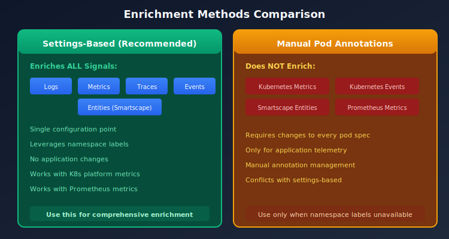

# K8S-10: Metadata Telemetry Enrichment

> **Series:** K8S | **Notebook:** 10 of 12 | **Created:** January 2026 | **Last Updated:** 01/30/2026

## Enriching All Telemetry with Kubernetes Metadata
Kubernetes metadata enrichment automatically adds labels and annotations from your Kubernetes resources to all telemetry signals. This is the **recommended approach** for adding context to your observability data because it enriches everything: metrics, logs, traces, events, and entities.

---

## Table of Contents

1. [Why Metadata Enrichment?](#why-metadata-enrichment)
2. [Enrichment Methods Comparison](#enrichment-methods-comparison)
3. [DynaKube Configuration](#dynakube-configuration)
4. [Configuring Settings-Based Enrichment](#configuring-settings-based-enrichment)
5. [Namespace Selectors](#namespace-selectors)
6. [Understanding Enrichment Files](#understanding-enrichment-files)
7. [Querying Enriched Data](#querying-enriched-data)
8. [Use Cases](#use-cases)
9. [Settings API](#settings-api)
10. [Troubleshooting](#troubleshooting)

---

## Prerequisites

| Requirement | Details |
|-------------|----------|
| **Dynatrace Environment** | SaaS with Grail |
| **Permissions** | `settings.read`, `settings.write` |
| **DynaKube** | Deployed with `metadataEnrichment` enabled |
| **Kubernetes** | Namespaces with labels/annotations to enrich |

<a id="why-metadata-enrichment"></a>
## 1. Why Metadata Enrichment?
Kubernetes metadata enrichment solves a critical observability challenge: **connecting telemetry to business context**.

### Common Use Cases

| Use Case | Metadata Example | Benefit |
|----------|------------------|----------|
| **Cost allocation** | `cost-center: finance` | Attribute costs to teams |
| **Environment identification** | `env: production` | Filter by deployment stage |
| **Team ownership** | `team: checkout` | Route alerts to owners |
| **Compliance tagging** | `compliance: pci-dss` | Identify regulated workloads |
| **Application grouping** | `app: ecommerce` | Group related services |

### What Gets Enriched

With settings-based enrichment, **all signals** receive metadata:

| Signal Type | Enriched? | Notes |
|-------------|-----------|-------|
| Logs | Yes | All container and pod logs |
| Metrics | Yes | Including Kubernetes platform metrics |
| Spans/Traces | Yes | Distributed tracing data |
| Events | Yes | Kubernetes events |
| Entities | Yes | Smartscape topology |

<a id="enrichment-methods-comparison"></a>
## 2. Enrichment Methods Comparison
Dynatrace offers multiple ways to add Kubernetes metadata. Choose based on your needs:



<!-- MARKDOWN_TABLE_ALTERNATIVE
| Method | Scope | All Signals? | Recommendation |
|--------|-------|--------------|----------------|
| **Settings-based rules** | Namespace labels/annotations | **Yes** | **Recommended** |
| Pod annotations | Individual pods | No | Fallback only |
| Environment variables | Container env vars | No | Legacy |
For environments where SVG doesn't render
-->

### Why Settings-Based is Recommended

Settings-based enrichment:
- Enriches **all signals**: logs, metrics, traces, events, entities
- Single configuration point (Dynatrace Settings)
- Leverages existing namespace labels
- No application changes required
- Works with Kubernetes platform metrics

Manual pod annotations:
- Does NOT enrich: Kubernetes metrics, events, Smartscape entities, Prometheus metrics
- Requires changes to every pod spec

> **Warning:** Do not mix settings-based enrichment with manual pod annotations. Using both simultaneously may cause conflicts and unexpected behavior.

<a id="dynakube-configuration"></a>
## 3. DynaKube Configuration
Metadata enrichment must be enabled in your DynaKube custom resource.

### Enable Metadata Enrichment

```yaml
apiVersion: dynatrace.com/v1beta3
kind: DynaKube
metadata:
  name: dynakube
  namespace: dynatrace
spec:
  apiUrl: https://ENVIRONMENT_ID.live.dynatrace.com/api
  
  # Enable metadata enrichment (enabled by default)
  metadataEnrichment:
    enabled: true
  
  oneAgent:
    cloudNativeFullStack: {}
  
  activeGate:
    capabilities:
      - kubernetes-monitoring
```

### Disable Metadata Enrichment (if needed)

```bash
# Using annotation
kubectl annotate dynakube -n dynatrace dynakube \
  feature.dynatrace.com/disable-metadata-enrichment="true"
```

Or in the DynaKube spec:

```yaml
spec:
  metadataEnrichment:
    enabled: false
```

<a id="configuring-settings-based-enrichment"></a>
## 4. Configuring Settings-Based Enrichment
### Access Settings

1. Navigate to **Settings** > **Cloud and virtualization** > **Kubernetes telemetry enrichment**
2. Select **Add rule**

### Rule Configuration Options

| Field | Description | Example |
|-------|-------------|----------|
| **Metadata type** | Source type (annotation or label) | `Label` |
| **Key** | The label/annotation key to capture | `team` |
| **Prefix** | Optional prefix for the enriched attribute | `k8s.` |

### Example: Capture Team Label

If your namespaces have:

```yaml
apiVersion: v1
kind: Namespace
metadata:
  name: checkout
  labels:
    team: checkout-team
    cost-center: engineering
    env: production
```

Create enrichment rules:

| Rule | Metadata Type | Key | Prefix |
|------|---------------|-----|--------|
| 1 | Label | `team` | `k8s.` |
| 2 | Label | `cost-center` | `k8s.` |
| 3 | Label | `env` | `k8s.` |

Result: All telemetry from the `checkout` namespace will have:
- `k8s.team: checkout-team`
- `k8s.cost-center: engineering`
- `k8s.env: production`

<a id="namespace-selectors"></a>
## 5. Namespace Selectors
By default, enrichment rules apply to **all namespaces**. Use namespace selectors to limit scope.

### DynaKube Namespace Selector

If your DynaKube uses a `namespaceSelector`, ensure it matches the namespaces you want to enrich:

```yaml
spec:
  metadataEnrichment:
    enabled: true
    namespaceSelector:
      matchLabels:
        dynatrace-enrich: enabled
```

### Labeling Namespaces for Enrichment

```bash
# Enable enrichment for a namespace
kubectl label namespace checkout dynatrace-enrich=enabled

# Verify labels
kubectl get namespace checkout --show-labels
```

### Match Expressions

For more complex selection:

```yaml
namespaceSelector:
  matchExpressions:
    - key: env
      operator: In
      values:
        - production
        - staging
```

<a id="understanding-enrichment-files"></a>
## 6. Understanding Enrichment Files
The Dynatrace Operator creates enrichment files that are used by OneAgent and applications.

### File Locations

| File | Location | Purpose |
|------|----------|----------|
| `dt_metadata.json` | `/var/lib/dynatrace/enrichment/` | JSON format metadata |
| `dt_metadata.properties` | `/var/lib/dynatrace/enrichment/` | Properties format |
| `dt_host_metadata.json` | `/var/lib/dynatrace/enrichment/` | Host-level metadata |

### Example dt_metadata.json Content

```json
{
  "k8s.namespace.name": "checkout",
  "k8s.pod.name": "checkout-api-7d9f8c6b4d-x2k9m",
  "k8s.team": "checkout-team",
  "k8s.cost-center": "engineering",
  "k8s.env": "production"
}
```

### Accessing Enrichment Files in Applications

For manual instrumentation or custom applications:

```python
import json
import os

# Load Dynatrace metadata
enrichment_paths = [
    '/var/lib/dynatrace/enrichment/dt_metadata.json',
    '/var/lib/dynatrace/enrichment/dt_host_metadata.json'
]

metadata = {}
for path in enrichment_paths:
    if os.path.exists(path):
        with open(path) as f:
            metadata.update(json.load(f))

print(metadata)
```

<a id="querying-enriched-data"></a>
## 7. Querying Enriched Data
Once enrichment is configured, you can filter and group by the enriched attributes.

```dql
// Query logs by enriched team label
fetch logs
| filter isNotNull(k8s.namespace.name)
| summarize logCount = count(), by:{k8s.namespace.name}
| sort logCount desc
| limit 20
```

```dql
// Group metrics by cost center (enriched label)
fetch dt.metrics
| filter metric.key == "dt.containers.cpu.usage_percent"
| filter isNotNull(k8s.namespace.name)
| summarize avgCpu = avg(value), by:{k8s.namespace.name}
| sort avgCpu desc
```

```dql
// Find all spans from production environment
fetch spans
| filter isNotNull(k8s.namespace.name)
| summarize 
    spanCount = count(),
    avgDuration = avg(duration),
    by:{k8s.namespace.name, service.name}
| sort spanCount desc
| limit 20
```

<a id="use-cases"></a>
## 8. Use Cases
### Cost Allocation by Team

Label namespaces with cost centers:

```bash
kubectl label namespace checkout cost-center=checkout-team
kubectl label namespace catalog cost-center=catalog-team
kubectl label namespace shared cost-center=platform
```

Create enrichment rule for `cost-center` label, then query:

```dql
fetch dt.metrics
| filter metric.key == "dt.containers.cpu.usage_percent"
| summarize totalCpu = sum(value), by:{k8s.cost-center}
```

### Pipeline Routing

Route logs to different buckets based on enriched metadata. In OpenPipeline:

```yaml
processors:
  - type: route
    rules:
      - condition: "k8s.env == 'production'"
        destination: "prod_logs_365d"
      - condition: "k8s.env == 'staging'"
        destination: "staging_logs_35d"
```

### Security Context Assignment

Use enriched metadata in security context for fine-grained access:

```yaml
processors:
  - type: security-context
    rules:
      - condition: "k8s.team == 'checkout-team'"
        context: "team:checkout"
```

### Grail Permissions

Create IAM policies based on Kubernetes attributes:

```
ALLOW storage:buckets:read WHERE storage:bucket-name STARTSWITH "default_";
ALLOW storage:logs:read WHERE storage:k8s.namespace.name = "checkout";
```

<a id="settings-api"></a>
## 9. Settings API
Manage enrichment rules programmatically via the Settings API.

### Schema

The schema for Kubernetes telemetry enrichment is: `builtin:kubernetes.generic.metadata.enrichment`

### List Current Rules

```bash
curl -X GET "https://ENVIRONMENT_ID.live.dynatrace.com/api/v2/settings/objects" \
  -H "Authorization: Api-Token YOUR_TOKEN" \
  -H "Content-Type: application/json" \
  -d '{
    "schemaIds": ["builtin:kubernetes.generic.metadata.enrichment"],
    "scopes": ["environment"]
  }'
```

### Create Rule via API

```bash
curl -X POST "https://ENVIRONMENT_ID.live.dynatrace.com/api/v2/settings/objects" \
  -H "Authorization: Api-Token YOUR_TOKEN" \
  -H "Content-Type: application/json" \
  -d '[
    {
      "schemaId": "builtin:kubernetes.generic.metadata.enrichment",
      "scope": "environment",
      "value": {
        "enabled": true,
        "metadataType": "LABEL",
        "key": "team",
        "prefix": "k8s."
      }
    }
  ]'
```

<a id="troubleshooting"></a>
## 10. Troubleshooting
### Enrichment Not Appearing

| Symptom | Cause | Solution |
|---------|-------|----------|
| No enriched attributes | Rules not propagated | Wait 45 minutes after rule creation |
| Some namespaces missing | namespaceSelector mismatch | Verify DynaKube namespaceSelector |
| Pods not enriched | metadataEnrichment disabled | Check DynaKube spec |

### Verify DynaKube Status

```bash
# Check DynaKube configuration
kubectl -n dynatrace get dynakube -o yaml | grep -A5 metadataEnrichment

# Check for disable annotation
kubectl -n dynatrace get dynakube -o yaml | grep disable-metadata-enrichment
```

### Verify Enrichment Files

```bash
# Check enrichment directory exists
kubectl exec -it <pod-name> -- ls -la /var/lib/dynatrace/enrichment/

# View enrichment content
kubectl exec -it <pod-name> -- cat /var/lib/dynatrace/enrichment/dt_metadata.json
```

### Timing Considerations

| Action | Propagation Time |
|--------|------------------|
| New rule created | Up to 45 minutes |
| Rule modified | Up to 45 minutes |
| DynaKube deployed first | Immediate (if rules exist) |

> **Tip:** If you configure enrichment rules **before** deploying DynaKube, the rules take effect immediately when DynaKube is applied.

## Summary

In this notebook, you learned:

- Why settings-based metadata enrichment is the recommended approach
- How to enable enrichment in DynaKube
- Creating enrichment rules in Settings UI
- Using namespace selectors to scope enrichment
- Understanding enrichment file locations and formats
- Querying enriched data with DQL
- Practical use cases: cost allocation, routing, security
- Troubleshooting common issues

---

## References

- [Metadata enrichment of all telemetry originating from Kubernetes](https://docs.dynatrace.com/docs/ingest-from/setup-on-k8s/guides/metadata-automation/k8s-metadata-telemetry-enrichment)
- [Configure enrichment directory](https://docs.dynatrace.com/docs/ingest-from/setup-on-k8s/guides/metadata-automation/metadata-enrichment)
- [Settings API - Kubernetes Telemetry Enrichment schema](https://docs.dynatrace.com/docs/discover-dynatrace/references/dynatrace-api/environment-api/settings/schemas/builtin-kubernetes-generic-metadata-enrichment)
- [Set up Grail permissions for telemetry from Kubernetes](https://docs.dynatrace.com/docs/ingest-from/setup-on-k8s/k8-security-context)

---

<sub>*This notebook was AI-generated from community-submitted and publicly available sources. This notebook series is not officially supported by Dynatrace. Always verify information against official Dynatrace documentation.*</sub>
