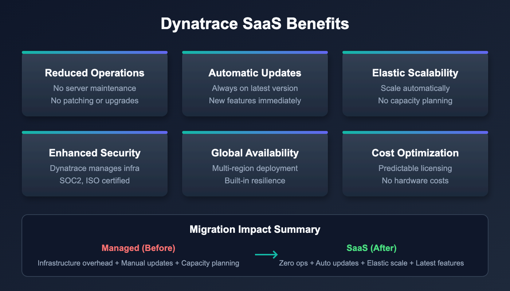

# M2S-01: Step 1 — Discover: Understand SaaS Differences

> **Series:** M2S — Managed to SaaS Migration | **Notebook:** 1 of 9 | **Phase:** Plan | **Step:** Discover | **Created:** March 2026 | **Last Updated:** 04/26/2026

The first step in any Managed-to-SaaS migration is understanding what you are moving to and why. This notebook helps you document the benefits of Dynatrace SaaS for your organization, take inventory of your current Managed environment, and confirm your use cases and goals for the upgrade.

> **M2S Migration Journey — 3 Phases / 9 Steps**
>
> **Plan:** **1. Discover** | 2. Strategize | 3. Design
>
> **Upgrade:** 4. Prepare | 5. Execute | 6. Integrate
>
> **Run:** 7. Expand | 8. Enable | 9. Optimize

### Sprint 1.337 (April 2026) Updates Affecting M2S

Three sprint-1.337 changes affect a Managed → SaaS migration:

1. **OneAgent primary fields/tags at source** — Latest Dynatrace SaaS tenants gain primary fields (`dt.security_context`, `dt.cost.costcenter`, `dt.cost.product`) and customer-defined primary tags as top-level attributes. Consider this in the M2S-03 (Design) step when deciding what tag/security-context model to recreate post-migration.
2. **Configuration API → Settings v2 acceleration** — Dynatrace Managed exposes the older Configuration API for many resources; the SaaS target's Settings v2 surface now covers more of those endpoints. Migration tooling (M2S-04/05) should target Settings v2 wherever possible. Plan for the legacy/v2 split where Managed has a unique Configuration API endpoint.
3. **Platform tokens** for new automation. Classic `dt0c01` still works for legacy paths, but new SaaS pipelines should default to `dt0s16`/`dt0s01` Platform tokens with `Authorization: Bearer …`.

**Extensions 3rd-gen API** (ToDo #1) — if Managed has custom 2nd-gen Extensions, migration to SaaS is also the natural moment to graduate to 3rd-gen via the Dynatrace API Application → Extensions surface.

---

---

## Table of Contents

1. [Why Upgrade to SaaS](#why-upgrade-to-saas)
2. [Review Your Current Environment](#review-your-current-environment)
3. [Confirm Use Cases and Goals](#confirm-use-cases-and-goals)
4. [SaaS Upgrade Assistant Overview](#saas-upgrade-assistant-overview)
5. [What Migrates and What Doesn't](#what-migrates-and-what-doesnt)
6. [Step Completion Checklist](#step-completion-checklist)

---

### Inventory Categories

A complete discovery must cover ALL of these categories — missing any one will create surprises during execution:

| Category | What to Inventory | Migration Method |
|----------|------------------|-----------------|
| **Configurations and settings** | All environment-level settings, entity-level settings | Automated via SaaS Upgrade Assistant |
| **Credential Vault** | All stored credentials, certificates | Manual — secrets cannot be exported |
| **API tokens** | All tokens and their scopes | Manual — recreate with minimal scopes |
| **Extensions** | OneAgent extensions, ActiveGate extensions — are they current or need upgrade? | Manual — evaluate for Extensions 2.0 |
| **External and custom sources** | Cloud integrations (AWS/Azure/GCP), Kubernetes integration, log ingest, custom metrics | Manual — reconfigure each source |
| **Other integrations** | ITSM, CMDB, reports, data lakes, CI/CD pipelines | Manual — update endpoints and tokens |
| **Monitoring components** | OneAgent instances (hosts, PaaS, K8s/OpenShift), ActiveGate instances (routing, extensions, synthetic, zRemote) | Automated (agent redirect) |
| **Dashboards** | All dashboards, their owners, and management zone filters | Automated via SaaS Upgrade Assistant |

> **Tip:** Consider environment clean-up during discovery. Excessive or legacy configuration items can be left behind. Most items like tags or management zones migrate in full, but others like dashboards should be reviewed and migrated selectively.

## Prerequisites

| Requirement | Details |
|-------------|----------|
| **Dynatrace Managed** | Active Managed environment with administrator access |
| **Dynatrace SaaS Tenant** | Provisioned SaaS environment (or planning to provision) |
| **API Tokens** | Tokens with `entities.read`, `settings.read` scopes on Managed |
| **Stakeholder Access** | Ability to document and share findings with decision-makers |



<!-- MARKDOWN_TABLE_ALTERNATIVE
| Benefit Category | Managed | SaaS |
|-----------------|---------|------|
| Infrastructure | Customer-managed clusters | Fully managed by Dynatrace |
| Updates | Manual cluster patching | Automatic bi-weekly updates |
| Availability | Customer-managed HA | 99.5%+ SLA |
| Data Platform | Time-series DB + Elasticsearch | Grail data lakehouse |
| Capabilities | Core monitoring | AppEngine, AutomationEngine, Dynatrace Assist |
For environments where SVG doesn't render
-->

<a id="why-upgrade-to-saas"></a>

## 1. Why Upgrade to SaaS

Moving from Dynatrace Managed to SaaS is not just a hosting change — it unlocks a fundamentally different platform architecture. Understanding these differences helps you build the business case and set expectations with stakeholders.

### Infrastructure and Operations

| Area | Managed | SaaS |
|------|---------|------|
| **Cluster management** | Customer-managed servers, storage, networking | Fully managed by Dynatrace |
| **Scaling** | Manual capacity planning and provisioning | Automatic scaling with licensing |
| **Updates** | Manual cluster patching (scheduled downtime) | Automatic bi-weekly updates (zero downtime) |
| **Availability** | Customer-managed HA/DR | 99.5%+ SLA with built-in redundancy |
| **Security patches** | Customer responsibility to apply | Automatic, managed by Dynatrace |

### Platform Capabilities

SaaS provides capabilities that are not available on Managed:

| Capability | Description |
|-----------|-------------|
| **Grail** | Petabyte-scale data lakehouse — unified querying across logs, metrics, traces, events, and entities |
| **DQL** | Dynatrace Query Language — context-aware queries replacing USQL |
| **Notebooks** | Interactive, collaborative analysis documents (you are reading one now) |
| **AppEngine** | Build and deploy custom Dynatrace apps |
| **AutomationEngine** | Advanced workflow engine for alerting, remediation, and orchestration |
| **Dynatrace Assist** | AI-powered assistant for natural-language queries and analysis |
| **OpenPipeline** | Custom data processing, routing, and enrichment at ingest |
| **Business Analytics** | Full business event tracking and conversion funnel analysis |

### Operational Cost Reduction

Migrating to SaaS eliminates operational overhead associated with running Managed clusters:

- No hardware procurement, racking, or lifecycle management
- No cluster OS patching or Dynatrace server upgrades
- No capacity planning for Cassandra, Elasticsearch, or transaction storage
- No backup/restore procedures for cluster data
- No need for dedicated Managed cluster administrators

### Enhanced Security and Compliance

| Compliance | Coverage |
|-----------|----------|
| **SOC 2 Type II** | Annual audit of security controls |
| **ISO 27001** | Information security management certification |
| **HIPAA** | Health data handling compliance |
| **FedRAMP** | US government security authorization (select regions) |
| **Automatic patching** | Security vulnerabilities addressed without customer action |

<a id="review-your-current-environment"></a>

## 2. Review Your Current Environment

Before planning the migration, take a complete inventory of what exists in your Managed environment. This inventory serves two purposes: sizing your SaaS license and identifying configurations that need migration.

> **Note:** DQL queries below run against your **SaaS tenant** (where entity data has been synced or where agents are already reporting). For Managed-only environments, use the **Entities API v2** or **Dynatrace UI** alternatives shown after each query.

### Host Inventory

```dql
// Count total monitored hosts
fetch dt.entity.host
| summarize hostCount = count()

// Alternative: Smartscape on Grail (entity.name → name)
// smartscapeNodes HOST
// | summarize hostCount = count()

```

```dql
// Hosts grouped by OS type
fetch dt.entity.host
| summarize hostCount = count(), by:{osType}
| sort hostCount desc

// Alternative: Smartscape on Grail (entity.name → name)
// smartscapeNodes HOST
// | summarize hostCount = count(), by:{osType}
// | sort hostCount desc
```

**Managed alternative (Entities API v2):**

```bash
# Total host count
curl -s "https://{managed-url}/api/v2/entities?entitySelector=type(HOST)&pageSize=1" \
  -H "Authorization: Api-Token {TOKEN}" | jq '.totalCount'
```

### Service Inventory

```dql
// Count total monitored services
fetch dt.entity.service
| summarize serviceCount = count()

// Alternative: Smartscape on Grail (entity.name → name)
// smartscapeNodes SERVICE
// | summarize serviceCount = count()

```

```dql
// Services grouped by technology
fetch dt.entity.service
| summarize serviceCount = count(), by:{serviceType}
| sort serviceCount desc

// Alternative: Smartscape on Grail (entity.name → name)
// smartscapeNodes SERVICE
// | summarize serviceCount = count(), by:{serviceType}
// | sort serviceCount desc
```

### Application Inventory

```dql
// Count monitored web applications
fetch dt.entity.application
| summarize appCount = count()

// Note: smartscapeNodes WEB_APPLICATION is not yet available on Grail
// Continue using fetch dt.entity.application until Smartscape coverage expands
```

### Synthetic Test Inventory

```dql
// Count synthetic monitors
fetch dt.entity.synthetic_test
| summarize syntheticCount = count()

// Note: smartscapeNodes SYNTHETIC_TEST is not yet available on Grail
// Continue using fetch dt.entity.synthetic_test until Smartscape coverage expands
```

```dql
// Synthetic tests by type
fetch dt.entity.synthetic_test
| summarize testCount = count(), by:{type}
| sort testCount desc

// Note: smartscapeNodes SYNTHETIC_TEST is not yet available on Grail
// Continue using fetch dt.entity.synthetic_test until Smartscape coverage expands
```

### OneAgent Version Assessment

Understanding your OneAgent version spread is important because SaaS supports a rolling 9-month (Standard) / 12-month (Enterprise) version window. Agents older than this window must be updated before or during migration.

```dql
// OneAgent versions across hosts
fetch dt.entity.host
| summarize hostCount = count(), by:{installerVersion}
| sort hostCount desc

// Alternative: Smartscape on Grail (entity.name → name)
// smartscapeNodes HOST
// | summarize hostCount = count(), by:{installerVersion}
// | sort hostCount desc
```

### ActiveGate Assessment

```dql
// ActiveGate inventory
fetch dt.entity.active_gate
| fieldsAdd entity.name
| summarize activeGateCount = count()

// Note: smartscapeNodes ACTIVE_GATE is not yet available on Grail
// Continue using fetch dt.entity.active_gate until Smartscape coverage expands
```

### Environment Size Summary

Record your findings in this table:

| Entity Type | Count | Notes |
|------------|-------|-------|
| Hosts | ___ | Include OS breakdown |
| Services | ___ | Include technology breakdown |
| Applications | ___ | Web and mobile |
| Synthetic Tests | ___ | HTTP, browser, scripted |
| ActiveGates | ___ | Environment and cluster |
| Management Zones | ___ | Will migrate as-is |
| Dashboards | ___ | Classic dashboards migrate; rebuild as modern recommended |

> **Important:** If your host count exceeds 25,000, you will need multiple SaaS tenants. Discuss tenant topology with your Dynatrace account team before proceeding.

<a id="confirm-use-cases-and-goals"></a>

## 3. Confirm Use Cases and Goals

Every migration needs clearly documented motivations and success criteria. Use the table below to identify which benefits matter most to your organization and align them with concrete goals.

### Common Migration Motivations

| Motivation | SaaS Benefit | Success Metric |
|-----------|-------------|----------------|
| Eliminate cluster maintenance | Fully managed infrastructure | Zero hours spent on cluster patching |
| Access new capabilities | Grail, Notebooks, AppEngine, Dynatrace Assist | Teams actively using SaaS-exclusive features |
| Improve availability | 99.5%+ SLA | Reduced monitoring downtime incidents |
| Reduce operational cost | No hardware, patching, capacity planning | Measured reduction in Managed infrastructure spend |
| Enhance security posture | Managed infrastructure, automatic security patches | Faster time-to-patch for vulnerabilities |
| Simplify compliance | SOC 2 Type II, ISO 27001, HIPAA | Inherited compliance controls |
| Consolidate tenants | Single SaaS platform | Fewer environments to manage |
| Enable self-service | IAM policies, Grail permissions | Teams can query their own data without admin requests |

### Documenting Your Goals

For each selected motivation, document:

1. **Current pain point** — What problem does this solve today?
2. **Expected outcome** — What does success look like after migration?
3. **Measurement** — How will you verify the goal was achieved?
4. **Timeline** — When should this benefit be realized (during migration or post-migration)?

> **Tip:** Share this goals document with stakeholders before proceeding to Step 2 (Strategize). Alignment on goals prevents scope creep and sets realistic expectations.

<a id="saas-upgrade-assistant-overview"></a>

## 4. SaaS Upgrade Assistant Overview

The **[SaaS Upgrade Assistant](https://docs.dynatrace.com/managed/upgrade/saas-upgrade-assistant/)** is Dynatrace's primary migration tool for Managed-to-SaaS upgrades. Understanding its capabilities early helps you plan what will be automated versus what requires manual effort.

### How It Works

1. **Export** — Download configuration archive from your Managed Cluster Management Console
2. **Upload** — Import the archive into the SaaS Upgrade Assistant app on your target SaaS tenant
3. **Review** — Configurations are grouped by type with error highlighting for incompatible items
4. **Edit** — Fix failed or incompatible configurations individually or in bulk
5. **Deploy** — Push selected configurations to your SaaS environment
6. **Track** — Monitor progress and download deployment result reports (CSV)

### Key Features

| Feature | Description |
|---------|-------------|
| **Automated configuration import** | Most settings and dashboards migrate automatically |
| **Selective import** | Smart dependency-aware import — choose what to deploy per wave |
| **Dashboard ownership migration** | Updates dashboard owners from Managed to SaaS user identifiers |
| **Entity ID adjustment** | Handles entity ID changes between environments |
| **Bulk editing** | Edit and correct failed configurations in batch |
| **Preview changes** | Review all changes before deploying |
| **Progress tracking** | Real-time status with CSV export of results |

### Requirements

| Requirement | Details |
|-------------|----------|
| **Managed version** | 1.294 or later |
| **Version alignment** | Best results when Managed and SaaS are on the same major version (e.g., both 1.294.x) |
| **IAM policy** | `upgrade-assistant:environments:write` assigned in Account Management |
| **Installation** | Install the SaaS Upgrade Assistant app on your target SaaS tenant |

> **Tip:** Contact your Dynatrace account team for guided migration support. They can help plan waves and troubleshoot incompatible configurations.

<a id="what-migrates-and-what-doesnt"></a>

## 5. What Migrates and What Doesn't

Understanding portability constraints upfront prevents surprises during execution. The SaaS Upgrade Assistant handles most configuration types, but some items require manual recreation.

### Portable via SaaS Upgrade Assistant

| Configuration Type | Notes |
|--------------------|-------|
| Settings and configurations | Application detection, service detection, data privacy |
| Management zones | Migrate as-is; consider converting to Grail permissions post-migration |
| Auto-tagging rules | Tag definitions and conditions |
| Alerting profiles | Alert filtering and notification routing |
| Classic dashboards | Migrate automatically; rebuild as modern dashboards recommended |
| Service detection rules | Custom service naming and merging |
| Request attributes | Capture rules for request metadata |
| Calculated metrics | Service, log, and RUM calculated metrics |
| Maintenance windows | Scheduled suppression windows |

### Requires Manual Recreation

| Configuration Type | Why | Recommended Action |
|--------------------|-----|--------------------|
| **Credentials Vault entries** | Security — secrets cannot be exported | Re-create in SaaS Credentials Vault |
| **API tokens** | Security — tokens are environment-specific | Generate new tokens in SaaS |
| **Webhook endpoints** | URLs may differ for SaaS network paths | Reconfigure notification integrations |
| **Synthetic private locations** | ActiveGate-bound, environment-specific | Deploy new ActiveGates, recreate locations |
| **Custom extensions (1.0)** | EF1 deprecated — must rebuild as Extensions 2.0 | Rebuild using Extensions 2.0 framework |
| **Network zones** | Environment-specific network configuration | Recreate in SaaS if needed |
| **Plugin-based integrations** | Legacy plugin framework | Migrate to Extensions 2.0 or ActiveGate extensions |

### Non-Portable (Data)

> **Important:** Historic data does **not** migrate. This includes metrics, logs, traces, user sessions, problems, and detected events. Plan for a baseline period where both Managed and SaaS run in parallel so SaaS accumulates its own history.

| Data Type | Retention Impact |
|-----------|------------------|
| Metrics | New baseline starts from SaaS go-live |
| Logs | No historic log data in SaaS |
| Traces/spans | Distributed traces start fresh |
| User sessions | RUM session data not transferred |
| Problems | detected problem history stays in Managed |
| Deployment events | Release tracking starts fresh |

<a id="step-completion-checklist"></a>

## 6. Step Completion Checklist

Before proceeding to Step 2, confirm that you have completed each item:

| Checkpoint | Status |
|-----------|--------|
| SaaS benefits documented and shared with stakeholders | [ ] |
| Current environment inventory complete (hosts, services, applications, synthetics) | [ ] |
| OneAgent version spread assessed (any agents outside support window identified) | [ ] |
| ActiveGate inventory documented | [ ] |
| Migration use cases and goals documented with success metrics | [ ] |
| SaaS Upgrade Assistant requirements understood (version, IAM, installation) | [ ] |
| Non-portable items identified and manual recreation plan noted | [ ] |
| Historic data limitation communicated to stakeholders | [ ] |

## Next Step

> **M2S-02: Step 2 — Strategize** — Define your migration approach, timeline, and risk assessment. Choose between big-bang and phased migration, plan your parallel-run period, and identify dependencies and risks.

### Additional Resources

- [SaaS Upgrade Assistant Documentation](https://docs.dynatrace.com/managed/upgrade/saas-upgrade-assistant/)
- [SaaS Upgrade Assistant on Dynatrace Hub](https://www.dynatrace.com/hub/detail/saas-upgrade-assistant/)
- [Upgrading from Dynatrace Managed to SaaS](https://www.dynatrace.com/platform/saas-upgrade/)
- [Grail Data Lakehouse](https://docs.dynatrace.com/docs/platform/grail)
- [DQL Reference](https://docs.dynatrace.com/docs/platform/grail/dynatrace-query-language)

---

## Summary

In Step 1, you:

- Documented the key benefits of Dynatrace SaaS compared to Managed
- Inventoried your current environment (hosts, services, applications, synthetics, ActiveGates)
- Confirmed your migration use cases and goals with measurable success criteria
- Understood the SaaS Upgrade Assistant as the primary migration tool
- Identified what migrates automatically, what requires manual recreation, and what data does not transfer

---

<sub>*This notebook was AI-generated from community-submitted and publicly available sources. This notebook series is not officially supported by Dynatrace. Always verify information against official Dynatrace documentation.*</sub>
