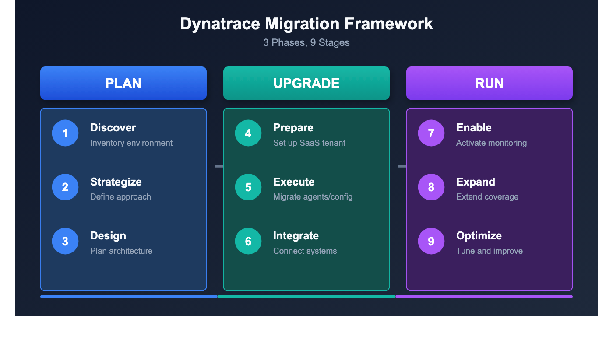

# M2S-02: Step 2 — Strategize: Define Your Migration Approach

> **Series:** M2S — Managed to SaaS Migration | **Notebook:** 2 of 9 | **Phase:** Plan | **Step:** Strategize | **Created:** March 2026 | **Last Updated:** 04/06/2026

With your discovery complete, it's time to turn inventory into action. This notebook helps you select a migration approach, sequence your operations, assess risks, and build a timeline that earns stakeholder confidence.

> **M2S Migration Journey — 3 Phases / 9 Steps**
>
> **Plan:** 1. Discover | **2. Strategize** | 3. Design
>
> **Upgrade:** 4. Prepare | 5. Execute | 6. Integrate
>
> **Run:** 7. Expand | 8. Enable | 9. Optimize

---

## Table of Contents

1. [The Three-Phase Framework](#three-phase-framework)
2. [Migration Approach Selection](#migration-approach-selection)
3. [Order of Operations](#order-of-operations)
4. [Migration Considerations and Dependencies](#migration-considerations)
5. [Risk Assessment](#risk-assessment)
6. [Defining Success Criteria](#defining-success-criteria)
7. [Timeline Planning](#timeline-planning)
8. [The 90/10 Rule](#the-90-10-rule)
9. [Step Completion Checklist](#step-completion-checklist)

---

## Prerequisites

| Requirement | Description |
|-------------|-------------|
| **Step 1 Complete** | Discovery inventory from M2S-01 (host counts, agent versions, ActiveGate topology, integrations) |
| **Stakeholder Access** | Ability to engage infrastructure, security, and application teams |
| **Dynatrace Account Team** | Contact established for licensing and migration support |
| **Risk Tolerance Understood** | Organizational appetite for maintenance windows and parallel operation |



<!-- MARKDOWN_TABLE_ALTERNATIVE
| Phase | Step 1 | Step 2 | Step 3 |
|-------|--------|--------|--------|
| **Plan** | 1. Discover | **2. Strategize** | 3. Design |
| **Upgrade** | 4. Prepare | 5. Execute | 6. Integrate |
| **Run** | 7. Expand | 8. Enable | 9. Optimize |
For environments where SVG doesn't render
-->

<a id="three-phase-framework"></a>

## 1. The Three-Phase Framework

The Managed-to-SaaS migration follows a proven three-phase, nine-step framework. Each phase builds on the previous one, and skipping steps leads to preventable failures.

### Phase Overview

| Phase | Steps | Focus |
|-------|-------|-------|
| **Plan** | 1. Discover → 2. Strategize → 3. Design | Understand what you have, decide how to move it, design the target |
| **Upgrade** | 4. Prepare → 5. Execute → 6. Integrate | Set up SaaS, migrate agents and config, reconnect integrations |
| **Run** | 7. Expand → 8. Enable → 9. Optimize | Extend coverage, activate new capabilities, tune for value |

### What Each Step Delivers

| Step | Name | Key Deliverable |
|------|------|----------------|
| 1 | **Discover** | Complete environment inventory (hosts, agents, configs, integrations) |
| 2 | **Strategize** | Migration approach, timeline, risk assessment, success criteria |
| 3 | **Design** | Target SaaS architecture, network topology, IAM model |
| 4 | **Prepare** | SaaS tenant provisioned, ActiveGates deployed, network validated |
| 5 | **Execute** | Configurations migrated, OneAgents redirected, data flowing |
| 6 | **Integrate** | Webhooks, CI/CD, ITSM, and third-party tools reconnected |
| 7 | **Expand** | Additional environments, cloud integrations, OpenTelemetry |
| 8 | **Enable** | Workflows, OpenPipeline, Business Analytics, Notebooks activated |
| 9 | **Optimize** | Alert tuning, cost management, query performance, feature adoption |

### Time Investment by Phase

| Phase | Typical Duration | Effort Level |
|-------|-----------------|-------------|
| Plan | 2-4 weeks | Medium — analysis and decision-making |
| Upgrade | 2-6 weeks | High — technical execution |
| Run | 2-4 weeks | Medium — enablement and tuning |

> **Note:** Duration varies significantly based on environment size, complexity, and organizational readiness. A 200-host environment can complete in 4 weeks. A 5,000-host multi-region deployment may take 12 weeks.

<a id="migration-approach-selection"></a>

## 2. Migration Approach Selection

The single most consequential decision in your migration is the approach. Choose based on environment size, risk tolerance, and operational constraints.

### Three Approaches

| Approach | When to Use | Pros | Cons |
|----------|------------|------|------|
| **Big Bang** | < 500 hosts, simple environment | Fast, decisive, clean cutover | Higher risk, requires extensive prep |
| **Phased by Environment** | 500-2,000 hosts | Lower risk, lessons learned per wave | Longer timeline, dual-run costs |
| **Phased by Region/App** | > 2,000 hosts or complex integrations | Lowest risk, maximum flexibility | Longest timeline, complex coordination |

### Big Bang Migration

All agents and configurations migrate in a single maintenance window.

| Factor | Detail |
|--------|--------|
| **Typical window** | 4-8 hours |
| **Best for** | Smaller environments with flexible maintenance windows |
| **Requires** | Complete preparation, tested rollback procedure |
| **Risk** | Higher — all-or-nothing in a single window |

### Phased by Environment

Migrate in waves: Dev → Staging → Production.

| Factor | Detail |
|--------|--------|
| **Typical duration** | 3-6 weeks (1-2 weeks per wave) |
| **Best for** | Mid-size environments with distinct environment tiers |
| **Requires** | Parallel operation budget, wave-by-wave validation |
| **Risk** | Medium — each wave validates the next |

### Phased by Region or Application

Migrate by geography (EMEA → APAC → Americas) or by application criticality.

| Factor | Detail |
|--------|--------|
| **Typical duration** | 6-12 weeks |
| **Best for** | Large, complex environments with regional or app-team ownership |
| **Requires** | Complex coordination, extended parallel operation |
| **Risk** | Lowest — isolated blast radius per wave |

### Decision Matrix

| Factor | Big Bang | Phased by Env | Phased by Region/App |
|--------|----------|---------------|---------------------|
| Hosts < 500 | Recommended | Optional | Unnecessary |
| Hosts 500-2,000 | Possible | Recommended | Optional |
| Hosts > 2,000 | Not recommended | Possible | Recommended |
| Simple integrations | Recommended | Optional | Unnecessary |
| Complex integrations | Risky | Recommended | Recommended |
| Short timeline required | Fastest | Moderate | Longest |
| Risk-averse organization | Higher risk | Lower risk | Lowest risk |

<a id="order-of-operations"></a>

## 3. Order of Operations

Regardless of which approach you choose, the migration must follow this exact 11-step sequence. Steps cannot be reordered — each depends on the previous one completing successfully. The rightmost column shows which notebook covers each operation in detail.

| Sequence | Activity | Why This Order | Covered In |
|----------|----------|---------------|------------|
| **1** | **Assess** — Inventory current environment | Cannot plan what you don't know | Step 4: Prepare |
| **2** | **Provision** — SaaS tenant and access (SSO) | Target environment must exist before anything moves | Step 4: Prepare |
| **3** | **Install** — New ActiveGates in parallel with old ActiveGates | Agents need routing infrastructure before redirect | Step 4: Prepare |
| **4** | **Migrate** — Configuration and integrations | Settings must be in place before agents report to SaaS | Step 5: Execute |
| **5** | **Rebuild** — Dashboards, zones, alerts | Operational visibility must be ready before cutover | Step 5: Execute |
| **6** | **Redirect** — OneAgents to SaaS | The actual migration moment — agents begin reporting to SaaS | Step 5: Execute |
| **7** | **Reconnect** — Integrations and extensions | Restore external system connections | Step 6: Integrate |
| **8** | **Migrate** — Any remaining configuration and integrations | Catch items missed in first pass or dependent on agent data | Step 6: Integrate |
| **9** | **Validate** — Data flow and performance | Confirm everything works before declaring success | Step 9: Optimize |
| **10** | **Cutover** — Full switch to SaaS | Formal declaration that SaaS is the primary platform | Step 9: Optimize |
| **11** | **Decommission** — Managed environment | Only after full validation and parallel observation period | Step 9: Optimize |

> **Important:** Steps 4 and 5 are where the [SaaS Upgrade Assistant](https://docs.dynatrace.com/managed/upgrade/saas-upgrade-assistant/) does the heavy lifting. Export from Managed, upload to SaaS, review, and deploy — most configurations migrate automatically.

### Critical Dependencies

| Dependency | Impact if Missed |
|-----------|------------------|
| ActiveGates before OneAgents | Agents have nowhere to route — data loss |
| Config before agent redirect | No alerting, no dashboards during cutover |
| SSO before user access | Teams locked out of new SaaS tenant |
| Firewall rules before anything | All traffic blocked — complete failure |

<a id="migration-considerations"></a>

## 4. Migration Considerations and Dependencies

These are the non-obvious factors that derail migrations when overlooked.

### Licensing and Contracts

| Consideration | Detail |
|---------------|--------|
| **Dual licensing** | You will run both Managed and SaaS in parallel during migration — coordinate with your Dynatrace account team early |
| **Contract alignment** | SaaS licensing model differs from Managed — DPS (Dynatrace Intelligence Processing Units) vs. host-based |
| **Timing** | Begin licensing discussions at least 4 weeks before migration start |

### Data Continuity

| Consideration | Detail |
|---------------|--------|
| **Historic data cannot be migrated** | Managed data stays in Managed — plan for a baseline period in SaaS |
| **Parallel observation** | Run both environments for 2-4 weeks to build SaaS baselines |
| **Data gap planning** | Brief gap during OneAgent redirect is unavoidable — minimize with maintenance window |

### Infrastructure

| Consideration | Detail |
|---------------|--------|
| **New ActiveGates required** | SaaS requires Environment ActiveGates — cannot reuse Managed Cluster ActiveGates |
| **Network zones** | Must be recreated in SaaS — plan ActiveGate placement per zone |
| **Firewall rules** | New outbound rules to `*.live.dynatrace.com` and `*.apps.dynatrace.com` on port 443 |
| **OneAgent version compatibility** | Dynatrace supports OneAgent versions for 9 months (Standard) / 12 months (Enterprise) — verify your oldest agents are within support |

### Configuration

| Consideration | Detail |
|---------------|--------|
| **Environment rebuild required** | SaaS is a new environment — settings, dashboards, and alerts must be migrated or recreated |
| **Credential Vault** | Manual migration — secrets cannot be exported from Managed |
| **Synthetic private locations** | Must be recreated with new ActiveGates in SaaS |
| **Custom extensions** | Extensions 2.0 required — legacy extensions need conversion |
| **Configuration freeze** | Freeze Managed changes during migration to prevent drift |

### Security and Compliance

| Consideration | Detail |
|---------------|--------|
| **Security approvals** | Firewall change requests may require weeks of lead time |
| **SSO/SAML configuration** | IdP must sign the **entire SAML message**, not just the assertion |
| **API token rotation** | New tokens needed for SaaS — update all automation and integrations |
| **Data residency** | Confirm SaaS tenant region meets compliance requirements |

### Execution Readiness

| Consideration | Detail |
|---------------|--------|
| **Rollback procedure** | Document and test on one host before full migration |
| **Maintenance window** | Coordinate with all application teams |
| **Communication plan** | Stakeholders must know what's happening and when |
| **Version alignment** | Align Managed cluster and SaaS to the same major version for SaaS Upgrade Assistant |

### Use Your Discovery Data to Identify Dependencies

The queries from Step 1 (Discover) provide the data you need to assess these dependencies. If you haven't run them yet, go back to **M2S-01** and complete the discovery first.

Once your agents are reporting to SaaS, use these DQL queries to validate coverage and identify gaps.

```dql
// Check OneAgent version distribution — agents outside the 9-month (Standard) / 12-month (Enterprise) support window need upgrading before migration
fetch dt.entity.host
| fieldsAdd version = installerVersion
| summarize hostCount = count(), by:{version}
| sort hostCount desc

// Alternative: Smartscape on Grail (entity.name → name)
// smartscapeNodes HOST
// | fieldsAdd version = installerVersion
// | summarize hostCount = count(), by:{version}
// | sort hostCount desc

```

```dql
// Count monitored entities by type — confirms your discovery inventory matches what SaaS sees after redirect
fetch dt.entity.host | summarize hosts = count()
| append [fetch dt.entity.service | summarize services = count()]
| append [fetch dt.entity.application | summarize applications = count()]
| append [fetch dt.entity.process_group | summarize process_groups = count()]

// Alternative: Smartscape on Grail (entity.name → name)
// smartscapeNodes SERVICE | summarize hosts = count()
// | append [fetch dt.entity.service | summarize services = count()]
// | append [fetch dt.entity.application | summarize applications = count()]
// | append [fetch dt.entity.process_group | summarize process_groups = count()]

```

```dql
// Verify ActiveGate connectivity — all Environment ActiveGates should be reporting
fetch dt.entity.active_gate
| fieldsAdd entity.name, networkZone
| sort entity.name asc

// Note: smartscapeNodes ACTIVE_GATE is not yet available on Grail
// Continue using fetch dt.entity.active_gate until Smartscape coverage expands
```

<a id="risk-assessment"></a>

## 5. Risk Assessment

Every migration carries risk. The goal is not to eliminate risk but to identify, quantify, and mitigate it before execution begins.

### Risk Register

| Risk | Impact | Likelihood | Mitigation |
|------|--------|------------|------------|
| **Data gaps during cutover** | High | Medium | Plan maintenance window; use parallel install to minimize gap to < 15 minutes |
| **Configuration drift** | Medium | High | Freeze Managed changes during migration; use SaaS Upgrade Assistant for snapshot export |
| **Integration failures** | High | Medium | Test all webhooks and APIs in SaaS before cutover; verify endpoints and tokens |
| **Rollback needed** | Medium | Low | Document rollback procedure; test on one host first; keep Managed running during parallel period |
| **Licensing overlap costs** | Low | High | Coordinate with Dynatrace account team early; align contract dates with migration timeline |
| **SSO/SAML misconfiguration** | High | Medium | Test IdP integration before any user access; verify full SAML message signing |
| **Network connectivity blocked** | High | Medium | Submit firewall change requests 4+ weeks early; test connectivity before migration day |
| **Unsupported OneAgent versions** | Medium | Low | Audit agent versions in discovery; upgrade agents outside support window before redirect |

### Risk Scoring

| Impact Level | Definition |
|-------------|------------|
| **High** | Migration failure, data loss, or monitoring gap > 1 hour |
| **Medium** | Partial functionality loss or delayed timeline |
| **Low** | Inconvenience or minor cost impact |

> **Tip:** Assign an owner to each risk. Unowned risks are unmitigated risks.

<a id="defining-success-criteria"></a>

## 6. Defining Success Criteria

Define measurable success criteria before migration starts. These criteria determine when the migration is "done" and when you can decommission Managed.

### Target Metrics

| Metric | Target | How to Measure |
|--------|--------|----------------|
| **Host coverage** | 100% of discovered hosts reporting | Compare DQL host count to discovery inventory |
| **Service discovery** | 100% of known services detected | Compare DQL service count to discovery inventory |
| **Data gaps** | < 15 minutes during cutover | Review data availability in SaaS after redirect |
| **Alert delivery** | 100% of critical alerts firing correctly | Trigger test alerts; verify notification channels |
| **Dashboard availability** | 100% of migrated dashboards rendering | Spot-check each dashboard in SaaS |
| **Integration success** | 100% of external integrations operational | Test each webhook, API, and ITSM connection |
| **User access** | All users can authenticate via SSO | Verify SSO login for each role/group |
| **Baseline established** | Dynatrace Intelligence baseline period complete (2-4 weeks) | Confirm Dynatrace Intelligence is generating problems correctly |

```dql
// Post-migration validation — compare host count to your discovery inventory
fetch dt.entity.host
| summarize totalHosts = count()
| fieldsAdd target = "<YOUR_DISCOVERY_COUNT>", coverage = "Compare totalHosts to target"

// Alternative: Smartscape on Grail (entity.name → name)
// smartscapeNodes HOST
// | summarize totalHosts = count()
// | fieldsAdd target = "<YOUR_DISCOVERY_COUNT>", coverage = "Compare totalHosts to target"
```

```dql
// Post-migration validation — check for recent detected problems (confirms AI baseline is building)
fetch dt.davis.problems, from:-24h
| summarize problemCount = count(), by:{event.status}
| sort problemCount desc
```

<a id="timeline-planning"></a>

## 7. Timeline Planning

Build your timeline working backward from the desired Managed decommission date.

### Milestone Durations

| Milestone | Typical Duration | Notes |
|-----------|-----------------|-------|
| **Discover + Strategize + Design** (Steps 1-3) | 2-4 weeks | Front-load planning — rushed planning causes failed execution |
| **Prepare** (Step 4) | 1-2 weeks | SaaS provisioning, ActiveGate deployment, network validation |
| **Execute** (Step 5, per wave) | 1-2 weeks | Config migration + OneAgent redirect per wave |
| **Integrate** (Step 6) | 1-2 weeks | Webhook, API, and ITSM reconnection |
| **Parallel operation** | 2-4 weeks | Both environments running — critical for Dynatrace Intelligence baseline |
| **Expand + Enable + Optimize** (Steps 7-9) | 2-4 weeks | New capabilities, tuning, adoption |
| **Decommission** | 1 week | Shutdown Managed after final validation |
| **Total typical** | **4-12 weeks** | Depends on environment size and approach |

### Sample Timelines by Approach

| Approach | Week 1-2 | Week 3-4 | Week 5-6 | Week 7-8 | Week 9-12 |
|----------|----------|----------|----------|----------|----------|
| **Big Bang** | Plan + Prepare | Execute + Validate | Parallel Run | Decommission | — |
| **Phased by Env** | Plan + Prepare | Dev wave | Staging wave | Prod wave | Parallel + Decommission |
| **Phased by Region** | Plan + Prepare | Region 1 | Region 2 | Region 3 | Parallel + Decommission |

> **Important:** The parallel operation period is non-negotiable. Dynatrace Intelligence needs 2-4 weeks to build baselines in SaaS before you can trust its problem detection. Do not decommission Managed until baselines are established.

### Migration Plan Checklist

When building your high-level migration plan, ensure these items are addressed:

1. **Catalog and evaluate** monitoring components (OneAgents, AG/OA extensions, external sources) — any version updates needed?
2. **Identify** configurations and settings — what can be migrated automatically vs. manually?
3. **Leave legacy behind** — excessive or outdated configuration items can be left behind; apply naming standards
4. **Understand procedures and timeline** for AG, OA, and configuration migrations plus application restarts
5. **Minimize dual running** — provide a seamless cutover for Dynatrace users
   - What can be done over a weekend or outside of peak/business hours?
   - Group components into migration waves; learn from non-production first

### Things to Include in Your Plan

| Item | Detail |
|------|--------|
| SSO implementation | IdP configuration, DNS domain validation, group mapping |
| Email allowlisting | Dynatrace email domain for SaaS platform/problem/security notifications |
| ActiveGate ordering | Procurement and provisioning of new AG machines |
| Root access requests | For new AG machines and monitored hosts |
| Network change requests | Connectivity between entities, AGs, proxies, and Dynatrace SaaS |
| Integration connectivity | External on-premise or SaaS systems, Dynatrace API, webhook integrations |
| Deployment automation | Prepare OA and AG deployment automation (Ansible, Puppet, Terraform, PowerShell) |
| Training | Train team on configuration migration tooling and SaaS administration |
| Execution plan | Environment configurations and application configurations, in what order |

<a id="the-90-10-rule"></a>

## 8. The 90/10 Rule

Based on hundreds of successful migrations, a consistent pattern emerges:

> **90% of configurations migrate automatically** via the [SaaS Upgrade Assistant](https://docs.dynatrace.com/managed/upgrade/saas-upgrade-assistant/). The remaining **10% takes 90% of the manual effort**.

### What Migrates Automatically (the 90%)

| Category | Tool |
|----------|------|
| Settings and configuration | SaaS Upgrade Assistant |
| Dashboards | SaaS Upgrade Assistant |
| Alert policies | SaaS Upgrade Assistant |
| Management zones | SaaS Upgrade Assistant |
| Auto-tag rules | SaaS Upgrade Assistant |
| Request attributes | SaaS Upgrade Assistant |
| Calculated metrics | SaaS Upgrade Assistant |

### What Requires Manual Effort (the 10%)

| Item | Why Manual | Effort Level |
|------|-----------|-------------|
| **Credential Vault entries** | Secrets cannot be exported from Managed | High — must recreate each credential |
| **Problem notification webhooks** | URLs and tokens change between environments | Medium — update each endpoint |
| **Cloud platform credentials** | AWS/Azure/GCP keys are tenant-specific | Medium — reconfigure each integration |
| **Synthetic private locations** | Tied to Managed ActiveGates | Medium — recreate with SaaS ActiveGates |
| **Custom extensions (v1)** | Legacy format not supported in SaaS | High — convert to Extensions 2.0 |
| **Custom scripts and automation** | Hardcoded Managed URLs and tokens | Medium — update all references |
| **Third-party ITSM integrations** | Webhook endpoints change | Medium — reconfigure each connection |

### Budget Accordingly

| Planning Item | Recommendation |
|--------------|----------------|
| **Identify the 10% early** | Use your discovery inventory to list every manual item |
| **Assign owners** | Each manual item needs a person responsible |
| **Track separately** | Manual items need their own checklist — do not mix with automated migration |
| **Test before cutover** | Every manual item should be validated in SaaS before redirecting agents |

<a id="step-completion-checklist"></a>

## 9. Step Completion Checklist

Do not proceed to Step 3 (Design) until all items are confirmed.

| Checkpoint | Status |
|-----------|--------|
| Migration approach selected (Big Bang / Phased by Env / Phased by Region) | [ ] |
| Order of operations documented and reviewed with stakeholders | [ ] |
| Risk assessment completed with owners assigned to each risk | [ ] |
| Success criteria defined with measurable targets | [ ] |
| High-level timeline established with milestone dates | [ ] |
| Dynatrace account team engaged for licensing and migration support | [ ] |
| 90/10 manual effort items identified and owners assigned | [ ] |
| Communication plan drafted for affected teams | [ ] |
| Rollback procedure documented | [ ] |

---

## Next Step

> **M2S-03: Step 3 — Design** — Create your target SaaS architecture, including network topology, ActiveGate placement, IAM model, and configuration mapping.

---

## Summary

In this notebook, you:

- Reviewed the three-phase, nine-step migration framework
- Selected a migration approach based on your environment size and risk tolerance
- Documented the required order of operations and critical dependencies
- Assessed key considerations across licensing, data, infrastructure, configuration, and security
- Completed a risk register with mitigations and owners
- Defined measurable success criteria for migration completion
- Built a timeline with milestone durations
- Identified the 90/10 split between automated and manual migration effort

> **Key Takeaway:** Strategy is about making decisions before the pressure is on. A clear approach, documented risks, and measurable success criteria are what separate migrations that succeed from those that spiral into firefighting.

---

*Continue to **M2S-03: Step 3 — Design** to create your target SaaS architecture.*

---

<sub>*This notebook was AI-generated from community-submitted and publicly available sources. This notebook series is not officially supported by Dynatrace. Always verify information against official Dynatrace documentation.*</sub>
