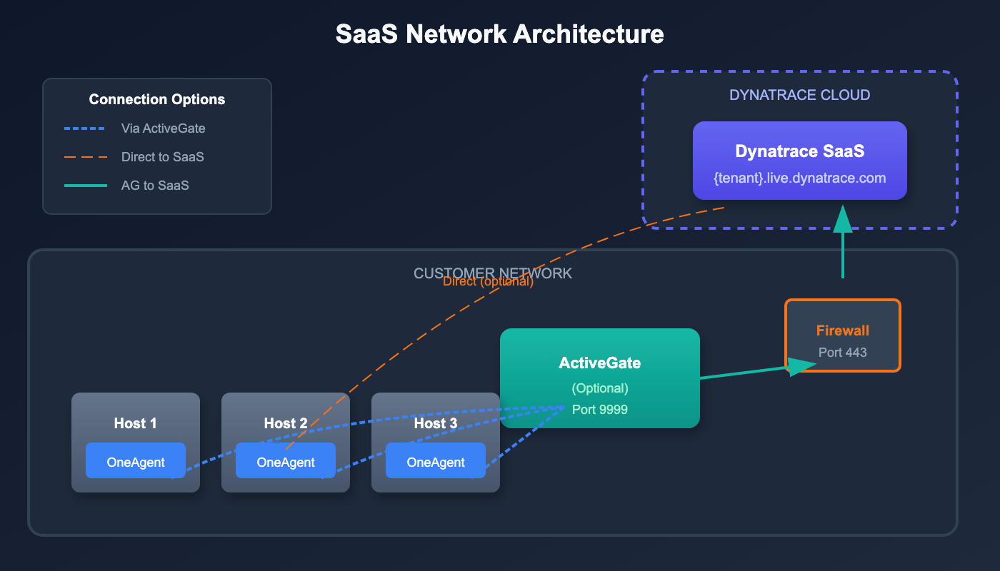
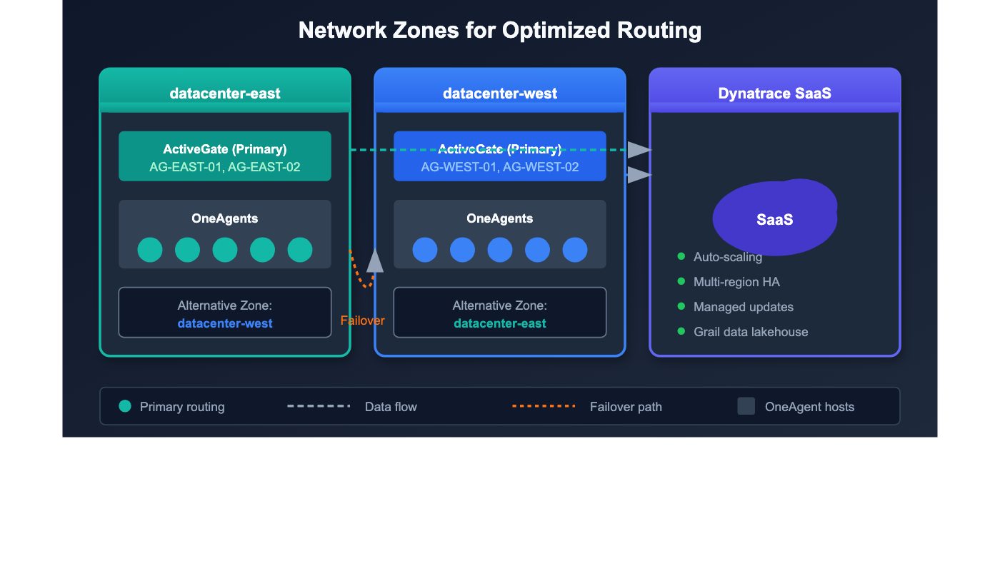
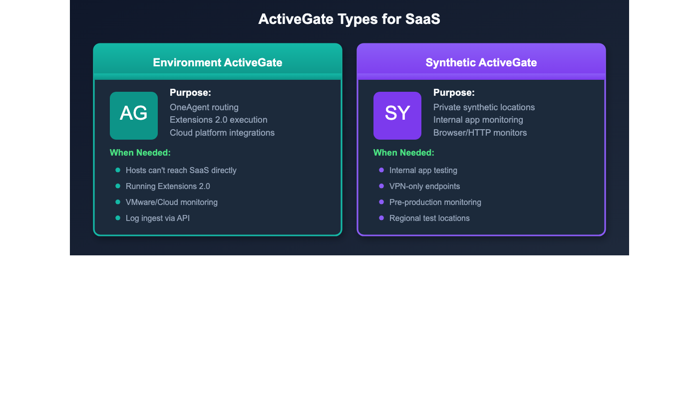
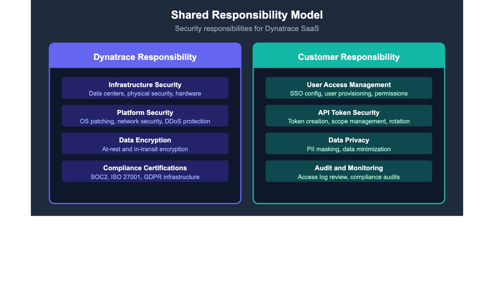

# M2S-03: Step 3 — Design: Create Target Architecture

> **Series:** M2S — Managed to SaaS Migration | **Notebook:** 3 of 9 | **Phase:** Plan | **Step:** Design | **Created:** March 2026 | **Last Updated:** 07/17/2026

With discovery and strategy complete, it's time to design the target architecture for your Dynatrace SaaS environment. This step produces the technical blueprints that guide every subsequent migration activity—network connectivity, ActiveGate topology, security controls, and high availability.

> **M2S Migration Journey — 3 Phases / 9 Steps**
>
> **Plan:** 1. Discover | 2. Strategize | **3. Design**
>
> **Upgrade:** 4. Prepare | 5. Execute | 6. Integrate
>
> **Run:** 7. Expand | 8. Enable | 9. Optimize
---

## Table of Contents

1. [Network Architecture](#network-architecture)
2. [Network Zones](#network-zones)
3. [ActiveGate Design](#activegate-design)
4. [Security Architecture](#security-architecture)
5. [High Availability Design](#high-availability-design)
6. [Architecture Design Checklist](#architecture-design-checklist)

---

## Prerequisites

Before starting this notebook, you should have:

| Requirement | Description |
|-------------|-------------|
| **Steps 1–2 completed** | Discovery inventory and migration strategy defined |
| **SaaS tenant provisioned** | Tenant ID and URL available |
| **Network diagrams** | Current Managed network topology documented |
| **Firewall change process** | Ability to request firewall rule changes |
| **Security stakeholders engaged** | Security and identity team involvement |

> The Settings 2.0 schema for network zones (`builtin:networkzones.zones`) is catalogued alongside every other domain's schema in **AUTOM-02**'s consolidated Settings 2.0 Schema Catalog.

---

## Learning Objectives

By the end of this notebook, you will:

- Design the network architecture for SaaS connectivity
- Plan network zone topology for optimized traffic routing
- Size and place ActiveGates for your environment
- Configure security controls including SSO and IAM
- Address high availability requirements
- Complete the architecture design checklist

---



<!-- MARKDOWN_TABLE_ALTERNATIVE
| Layer | Component | Direction |
|-------|-----------|----------|
| Hosts | OneAgent | Outbound to SaaS or ActiveGate |
| Routing | ActiveGate | Outbound to SaaS (port 443) |
| Cloud | SaaS Cluster | Receives all telemetry data |
For environments where SVG doesn't render
-->

---

<a id="network-architecture"></a>
## 1. Network Architecture

The most significant architectural change when moving to SaaS is connectivity—your monitored infrastructure must reach Dynatrace SaaS endpoints over the internet.

### 1.1 SaaS Endpoints

All communication uses outbound HTTPS (port 443).

| Endpoint Pattern | Purpose |
|------------------|--------|
| `{tenant-id}.live.dynatrace.com` | Main SaaS cluster (agent communication, API) |
| `{tenant-id}.apps.dynatrace.com` | Apps and platform services |

### 1.2 Connectivity Options

| Option | OneAgent → | ActiveGate → | Best For |
|--------|------------|--------------|----------|
| **Direct** | SaaS (443) | N/A | Open internet access |
| **Via Proxy** | Proxy → SaaS | N/A | Proxy-controlled environments |
| **Via ActiveGate** | ActiveGate (9999) | SaaS (443) | Restricted networks |
| **Via AG + Proxy** | ActiveGate (9999) | Proxy → SaaS (443) | Most restricted environments |

> **Recommendation:** For environments where hosts cannot reach the internet directly, deploy ActiveGates as routing proxies. OneAgents connect to the ActiveGate on port 9999; the ActiveGate forwards traffic to SaaS on port 443.

### 1.3 Firewall Requirements

**Minimum Requirements (Direct Connectivity):**

| Source | Destination | Port | Protocol |
|--------|-------------|------|----------|
| OneAgent hosts | `{tenant-id}.live.dynatrace.com` | 443 | HTTPS |
| OneAgent hosts | `{tenant-id}.apps.dynatrace.com` | 443 | HTTPS |

**ActiveGate Routing (Restricted Networks):**

| Source | Destination | Port | Protocol |
|--------|-------------|------|----------|
| OneAgent hosts | ActiveGate | 9999 | HTTPS |
| ActiveGate | `{tenant-id}.live.dynatrace.com` | 443 | HTTPS |
| ActiveGate | `{tenant-id}.apps.dynatrace.com` | 443 | HTTPS |

### 1.4 DNS Resolution

Ensure DNS can resolve these domains from all hosts and ActiveGates:

- `{tenant-id}.live.dynatrace.com`
- `{tenant-id}.apps.dynatrace.com`
- `*.dynatrace.com` (for additional services and updates)

### 1.5 Connectivity Testing

Test connectivity from representative hosts before migration:

```bash
# Test HTTPS connectivity to SaaS
curl -v https://{tenant-id}.live.dynatrace.com/api/v1/time

# Test apps endpoint
curl -v https://{tenant-id}.apps.dynatrace.com

# Test from behind ActiveGate (verify AG is reachable)
curl -v https://{activegate-host}:9999
```

> **Tip:** Run these tests from multiple network segments to identify connectivity gaps before migration begins.

### 1.6 Proxy Configuration

If a proxy is required for outbound HTTPS:

```bash
# OneAgent proxy configuration
sudo /opt/dynatrace/oneagent/agent/tools/oneagentctl --set-proxy=http://proxy.example.com:8080

# ActiveGate proxy configuration
# Edit /var/lib/dynatrace/gateway/config/custom.properties
# Add: proxy = http://proxy.example.com:8080
```

| Proxy Consideration | Detail |
|---------------------|--------|
| SSL inspection | Must not break TLS to Dynatrace endpoints |
| Authentication | Supported (basic auth in proxy URL) |
| Allowlist | `*.dynatrace.com` on port 443 |

---



<!-- MARKDOWN_TABLE_ALTERNATIVE
| Component | Role |
|-----------|------|
| Network Zone | Groups ActiveGates and OneAgents by network location |
| Primary Zone | Default routing target for agents in the zone |
| Alternative Zone | Failover if primary zone ActiveGates are unavailable |
For environments where SVG doesn't render
-->

---

### Zone Fallback Chain

Network zones follow a defined fallback hierarchy. Design your zones with this chain in mind:

**Primary → Alternative → Default → Cross-zone fallback**

| Level | Behavior |
|-------|---------|
| **Primary** | Agent connects to AGs in its assigned zone |
| **Alternative** | If primary zone AGs are unavailable, falls back to the alternative zone |
| **Default** | If no alternative defined, falls back to the default zone |
| **Cross-zone** | Last resort — connects to any available AG across zones |

### Metadata-Driven Zone Assignment

Use host properties and metadata tagging to automate zone assignment:

| Metadata Tag | Purpose | Example |
|-------------|---------|---------|
| `HOST_PROVIDER` | Cloud provider identification | `aws`, `azure`, `gcp` |
| `HOST_REGION` | Geographic region | `us-east-1`, `westeurope` |
| `HOST_ENVIRONMENT` | Environment tier | `production`, `staging` |

> **Best Practice:** Leverage host properties to replace manual tags. This ensures consistent, automated zone assignment as new hosts are deployed.

<a id="network-zones"></a>
## 2. Network Zones

Network Zones optimize routing of telemetry data from OneAgents to ActiveGates to SaaS. They are especially important in multi-datacenter or hybrid-cloud environments.

### 2.1 Why Network Zones Matter

| Benefit | Description |
|---------|-------------|
| **Traffic optimization** | Keep traffic local within network segments |
| **Failover routing** | Automatic failover to alternative zones |
| **Bandwidth reduction** | Minimize cross-datacenter WAN traffic |
| **Logical grouping** | Group agents and AGs by physical topology |

### 2.2 Network Zone Planning

Create zones that match your physical network topology:

| Zone Type | Naming Example | Description |
|-----------|----------------|-------------|
| Datacenter-based | `datacenter-east` | Primary datacenter in East region |
| Cloud region | `aws-us-east-1` | AWS region-specific zone |
| Environment-based | `production` | Production network segment |
| Hybrid | `dc-east-prod` | Datacenter + environment combined |

### 2.3 Failover Configuration

Define alternative zones for each primary zone:

| Primary Zone | Alternative Zone(s) | Failover Behavior |
|--------------|---------------------|--------------------|
| `datacenter-east` | `datacenter-west` | AGs in west serve east agents |
| `aws-us-east-1` | `aws-us-west-2` | Cross-region failover |
| `production` | `dr-production` | DR site serves production |

### 2.4 Creating Network Zones

> **Sprint 1.339 deprecation (May 2026):** The dedicated `/api/v2/networkZones` Configuration API endpoint is deprecated. New automation should target the Settings 2.0 schema `builtin:networkzones.zones` via `POST /api/v2/settings/objects` — the same pattern used elsewhere in the AUTOM series. The legacy endpoint below still functions during the deprecation window so existing scripts keep working; treat the Settings 2.0 form as canonical for new work.

**Settings 2.0 (recommended for new automation):**

```bash
curl -X POST "https://{tenant}.live.dynatrace.com/api/v2/settings/objects" \
  -H "Authorization: Api-Token {token}" \
  -H "Content-Type: application/json" \
  -d '[{
    "schemaId": "builtin:networkzones.zones",
    "scope": "environment",
    "value": {
      "name": "datacenter-east",
      "description": "Primary datacenter in East region",
      "alternativeZones": ["datacenter-west"]
    }
  }]'
```

**Legacy Configuration API (deprecated, still works during the deprecation window):**

```bash
curl -X POST "https://{tenant}.live.dynatrace.com/api/v2/networkZones" \
  -H "Authorization: Api-Token {token}" \
  -H "Content-Type: application/json" \
  -d '{
    "id": "datacenter-east",
    "description": "Primary datacenter in East region",
    "alternativeZones": ["datacenter-west"]
  }'
```

**Assigning ActiveGates:**

```bash
# During installation
sudo /bin/sh Dynatrace-ActiveGate-Linux.sh --set-network-zone=datacenter-east

# After installation
# Edit /var/lib/dynatrace/gateway/config/custom.properties
# Add: networkzone = datacenter-east
```

**Assigning OneAgents:**

```bash
# During installation
sudo /bin/sh Dynatrace-OneAgent-Linux.sh --set-network-zone=datacenter-east

# After installation
sudo /opt/dynatrace/oneagent/agent/tools/oneagentctl --set-network-zone=datacenter-east
```

> **Important:** Network Zones do NOT transfer from Managed—they must be recreated in your SaaS tenant before migrating OneAgents. Plan and deploy zones as part of Step 4 (Prepare).

---



<!-- MARKDOWN_TABLE_ALTERNATIVE
| ActiveGate Role | Purpose |
|-----------------|--------|
| Routing AG | OneAgent traffic routing to SaaS |
| Extensions AG | Extensions 2.0 execution |
| Synthetic AG | Private synthetic monitoring locations |
For environments where SVG doesn't render
-->

---

<a id="activegate-design"></a>
## 3. ActiveGate Design

### 3.1 Do You Need ActiveGates?

| Scenario | ActiveGate Required? |
|----------|---------------------|
| Hosts can reach SaaS directly | No (optional for extensions) |
| Hosts behind firewall, no direct internet | **Yes**, for routing |
| Running Extensions 2.0 | **Yes** (host-based AG required, not K8s-based) |
| Private synthetic monitoring | **Yes** |
| VMware monitoring | **Yes** |

### 3.2 ActiveGate Sizing

| Host Count (Routed) | CPU Cores | RAM | Disk |
|---------------------|-----------|-----|------|
| Up to 500 | 2 | 4 GB | 20 GB |
| 500–1,500 | 4 | 8 GB | 40 GB |
| 1,500–5,000 | 8 | 16 GB | 80 GB |
| >5,000 | Scale horizontally (multiple AGs) | | |

### 3.3 Placement Best Practices

| Practice | Rationale |
|----------|----------|
| **Close to monitored hosts** | Minimize latency between OneAgents and AGs |
| **Minimum 2 per network zone** | High availability within each zone |
| **Separate from monitored workloads** | Avoid resource contention |
| **In DMZ for cloud integrations** | If needed for external access |

### 3.4 ActiveGate Groups

Use AG groups to separate responsibilities:

| Group Name | Purpose | Members |
|------------|---------|--------|
| `production-routing` | Production OneAgent routing | AG-PROD-01, AG-PROD-02 |
| `nonprod-routing` | Non-production routing | AG-NONPROD-01, AG-NONPROD-02 |
| `extensions` | Extensions 2.0 execution | AG-EXT-01, AG-EXT-02 |
| `synthetic` | Private synthetic locations | AG-SYNTH-01, AG-SYNTH-02 |

> **Note:** Extensions 2.0 require **host-based** ActiveGates. Kubernetes-based ActiveGates do not support Extensions 2.0.

### 3.5 Parallel Deployment Strategy

Install new SaaS-connected ActiveGates in parallel with existing Managed ActiveGates:

1. **Deploy new AGs** connected to the SaaS tenant
2. **Validate connectivity** from AGs to SaaS endpoints
3. **Redirect OneAgents** to new AGs during migration
4. **Decommission Managed AGs** after all agents are migrated

This approach maintains monitoring continuity and provides easy rollback if issues occur.

---

```dql
// Inventory current ActiveGates and their versions
fetch dt.entity.active_gate
| fieldsAdd entity.name, version = softwareVersion
| fields entity.name, version, networkZone
| sort entity.name asc

// Note: smartscapeNodes ACTIVE_GATE is not yet available on Grail
// Continue using fetch dt.entity.active_gate until Smartscape coverage expands
```



<!-- MARKDOWN_TABLE_ALTERNATIVE
| Layer | Responsibility |
|-------|---------------|
| Infrastructure Security | Dynatrace |
| Platform Security | Dynatrace |
| Data Access & IAM | Customer |
| User Management & SSO | Customer |
For environments where SVG doesn't render
-->

---

<a id="security-architecture"></a>
## 4. Security Architecture

### 4.1 SAML SSO Configuration

SaaS does not support LDAP—if your Managed environment uses LDAP authentication, you must migrate to SAML 2.0.

| Authentication | Managed | SaaS |
|----------------|---------|------|
| Local users | Cluster Management Console | Dynatrace Account Management |
| SAML/SSO | IdP → Managed cluster | IdP → Dynatrace Account |
| LDAP | Direct LDAP integration | **Not supported** (use SAML 2.0) |

> **Critical:** Your Identity Provider (IdP) must sign the **entire SAML message**, not just the assertion. Failure to configure this correctly causes authentication errors. Azure Entra ID meets this requirement by default.

### 4.2 Azure Entra ID Considerations

| Consideration | Requirement |
|---------------|-------------|
| SAML message signing | Full message (not just assertion) |
| Group claim limit | 150 groups maximum per SAML token |
| Group filtering | **Filter claims to Dynatrace-related groups only** |
| Attribute mapping | Map UPN, email, first name, last name |

> **Warning:** If a user belongs to more than 150 Azure Entra groups, the SAML token will contain a group overage claim instead of individual groups. Filter your SAML group claims to include only Dynatrace-relevant groups.

### 4.3 IAM Role Mapping

Map your existing Managed roles to SaaS IAM policies:

| Managed Role | SaaS IAM Equivalent | Notes |
|--------------|---------------------|-------|
| Cluster administrator | Account administrator | Full account management |
| Environment administrator | Environment admin policy | Per-environment scope |
| Monitor user (read-only) | Viewer policy | Read-only access |
| Custom roles | Custom IAM policies | Recreate as policy statements |

### 4.4 TLS and Encryption

| Control | Detail |
|---------|--------|
| **TLS version** | TLS 1.2+ enforced for all connections |
| **Data at rest** | AES-256 encryption |
| **Certificate pinning** | OneAgent validates SaaS certificates |
| **Per-tenant keys** | Encryption keys isolated per tenant |

### 4.5 Data Residency

| Decision | Impact |
|----------|--------|
| Region selection | Choose at provisioning time (US, EU, APAC) |
| **Cannot change later** | Region is permanent after provisioning |
| Compliance alignment | Select region matching your regulatory requirements |

> **Important:** Data residency region is selected during SaaS provisioning and **cannot be changed** after the fact. Confirm your region choice with compliance and legal teams before provisioning.

### 4.6 Firewall and Egress Controls

| Control | Implementation |
|---------|----------------|
| Egress filtering | Restrict outbound to `*.dynatrace.com` on port 443 |
| IP allowlisting | SaaS endpoint IPs published by Dynatrace (subject to change) |
| DNS-based filtering | Preferred over IP-based (IPs may rotate) |

### 4.7 API Token Strategy

Create purpose-specific tokens with minimal scopes:

| Token Purpose | Required Scopes |
|---------------|----------------|
| OneAgent installation | `InstallerDownload` |
| ActiveGate installation | `InstallerDownload` |
| Configuration migration | `settings.read`, `settings.write` |
| Entity queries | `entities.read` |
| Metrics and logs | `metrics.read`, `logs.read` |
| AutomationEngine (Workflows) | OAuth client scopes `automation:workflows:read`, `automation:workflows:write` (not a classic API-token scope) |

---

### Bandwidth and Connectivity Planning

| Consideration | Detail |
|--------------|--------|
| **Increased outbound bandwidth** | Relocating the Dynatrace platform to SaaS increases outbound traffic from your network — plan for this with network team |
| **SSL certificates** | SSL certificates are possible for ActiveGates but NOT for the Dynatrace SaaS UI |
| **Service requests** | Plan for change management procedures, change windows, and deployment freezes |
| **OneAgent re-homing strategy** | Choose one: (1) Uninstall agents and install new, or (2) Update agents in place via `oneagentctl` to keep IDs (host, process group, services) and metadata |

<a id="high-availability-design"></a>
## 5. High Availability Design

### 5.1 SaaS-Side HA (Provided by Dynatrace)

Dynatrace SaaS includes built-in high availability:

| Capability | Detail |
|------------|--------|
| Multi-region deployment | Automatic geographic redundancy |
| Automatic failover | No customer action required |
| Data replication | Cross-region data copies |
| SLA | 99.5%+ availability (varies by contract) |

### 5.2 Customer-Side HA

Your responsibility is ensuring no single points of failure in the agent-to-SaaS path:

| Component | HA Strategy |
|-----------|-------------|
| **ActiveGates** | Minimum 2 per network zone |
| **Network zones** | Define alternative zones for failover |
| **Synthetic AGs** | Deploy pairs at each private location |
| **Load balancing** | OneAgent auto-discovers available AGs (no LB needed) |

### 5.3 Failover Behavior

| Scenario | OneAgent Behavior |
|----------|-------------------|
| Primary AG unavailable | Automatically fails over to secondary AG in same zone |
| All AGs in zone unavailable | Fails over to AGs in alternative network zone |
| All AGs unavailable | Buffers data locally (up to 2 hours) |
| AG + SaaS restored | Resumes normal transmission, flushes buffer |

### 5.4 Design for Zero Single Points of Failure

| Layer | Requirement |
|-------|-------------|
| Network zones | At least one alternative zone per primary |
| ActiveGates per zone | Minimum 2 per zone |
| Network paths | Redundant paths from agents to AGs |
| DNS | Multiple DNS resolvers for SaaS domains |

---

```dql
// Verify ActiveGate distribution across network zones
fetch dt.entity.active_gate
| summarize agCount = count(), by:{networkZone}
| sort agCount desc

// Note: smartscapeNodes ACTIVE_GATE is not yet available on Grail
// Continue using fetch dt.entity.active_gate until Smartscape coverage expands
```

<a id="architecture-design-checklist"></a>
## 6. Architecture Design Checklist

Complete this checklist before proceeding to Step 4 (Prepare).

### Network

| Checkpoint | Status |
|------------|--------|
| Network firewall rules documented (outbound 443 to SaaS) | [ ] |
| DNS resolution verified for `{tenant-id}.live.dynatrace.com` | [ ] |
| DNS resolution verified for `{tenant-id}.apps.dynatrace.com` | [ ] |
| Connectivity tested from representative hosts | [ ] |
| Proxy configuration documented (if required) | [ ] |

### Network Zones

| Checkpoint | Status |
|------------|--------|
| Network zone topology designed (matching physical topology) | [ ] |
| Alternative zones defined for failover | [ ] |
| Zone naming convention established | [ ] |

### ActiveGates

| Checkpoint | Status |
|------------|--------|
| ActiveGate sizing calculated based on host counts | [ ] |
| Placement planned (close to monitored hosts) | [ ] |
| Minimum 2 AGs per network zone for HA | [ ] |
| AG groups defined (routing, extensions, synthetic) | [ ] |
| Host-based AGs planned for Extensions 2.0 (if needed) | [ ] |

### Security

| Checkpoint | Status |
|------------|--------|
| SSO/SAML configuration designed | [ ] |
| IdP configured to sign full SAML message (not just assertion) | [ ] |
| Azure Entra group claims filtered to Dynatrace groups | [ ] |
| IAM policy mapping complete (Managed roles → SaaS policies) | [ ] |
| API token strategy defined with minimal scopes | [ ] |
| Data residency region confirmed with compliance team | [ ] |
| TLS 1.2+ confirmed for all connections | [ ] |

### High Availability

| Checkpoint | Status |
|------------|--------|
| No single points of failure in AG topology | [ ] |
| Network zone failover paths verified | [ ] |
| SaaS SLA reviewed and documented | [ ] |

---

## Next Step

> **→ M2S-04: Step 4 — Prepare** — Get your SaaS environment ready for migration execution. Deploy ActiveGates, configure network zones, create API tokens, and install the SaaS Upgrade Assistant.

### Continue the Series

| Next Notebook | Focus |
|---------------|-------|
| **M2S-04: Step 4 — Prepare** | Environment setup and migration preparation |

### Architecture Resources

- [ActiveGate Documentation](https://docs.dynatrace.com/docs/ingest-from/dynatrace-activegate)
- [Network Zones](https://docs.dynatrace.com/docs/manage/network-zones)
- [OneAgent Network Requirements](https://docs.dynatrace.com/docs/ingest-from/dynatrace-oneagent/oa-requirements)
- [IAM Documentation](https://docs.dynatrace.com/docs/manage/identity-access-management)
- [Dynatrace Trust Center](https://www.dynatrace.com/company/trust-center/)
- [SaaS Upgrade Assistant](https://docs.dynatrace.com/managed/upgrade/saas-upgrade-assistant/)

---

## Summary

In this notebook, you designed:

- **Network architecture** — Firewall rules, DNS, proxy configuration, and connectivity testing
- **Network zone topology** — Zones matching physical topology with failover alternatives
- **ActiveGate deployment** — Sizing, placement, groups, and parallel deployment strategy
- **Security architecture** — SAML SSO, IAM role mapping, TLS, data residency, and token strategy
- **High availability** — Redundant AGs, zone failover, and zero single points of failure

> **Key Takeaway:** The primary architectural change is network connectivity. Design your network zones and ActiveGate topology before migration begins—these decisions are difficult to change after OneAgents are redirected. Confirm data residency and SSO configuration with your compliance and security teams early.

---

*Continue to **M2S-04: Step 4 — Prepare** to set up your SaaS environment for migration execution.*

---

<sub>*This notebook was AI-generated from community-submitted and publicly available sources. This notebook series is not officially supported by Dynatrace. Always verify information against official Dynatrace documentation.*</sub>
