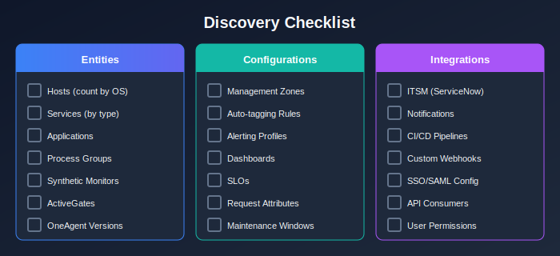

# Planning and Assessment

> **Series:** M2S | **Notebook:** 3 of 8 | **Created:** January 2026 | **Last Updated:** 01/28/2026

---

## Table of Contents

1. [Introduction](#introduction)
2. [Discovery: Inventory Your Environment](#discovery)
3. [Strategy: Define Your Approach](#strategy)
4. [Design: Create Your Plan](#design)
5. [Risk Assessment](#risk)
6. [Next Steps](#next-steps)

---

## Prerequisites

Before starting this notebook, you should have:

| Requirement | Description |
|-------------|-------------|
| Completed M2S-01 & M2S-02 | Framework understanding |
| API Token | With `entities.read`, `settings.read`, `metrics.read` scopes |
| Admin Access | To Dynatrace Managed environment |
| Spreadsheet Tool | For inventory documentation |

---

## Learning Objectives

By the end of this notebook, you will:

- Complete a thorough discovery of your Managed environment
- Document all configurations requiring migration
- Define success criteria for your migration
- Create a risk assessment matrix
- Have a preliminary migration plan

---

<a id="introduction"></a>
## 1. Introduction

The Plan phase is critical—most migration problems stem from incomplete discovery or unclear strategy. This notebook guides you through systematic planning.

### Why Planning Matters

| Planning Gap | Consequence |
|--------------|-------------|
| Missing host inventory | Incomplete migration |
| Unknown integrations | Broken workflows |
| Unclear timeline | Resource conflicts |
| No success criteria | Uncertain completion |

---

<a id="discovery"></a>
## 2. Discovery: Inventory Your Environment

### 2.1 Entity Inventory

> **Important:** DQL (Grail) is only available in SaaS environments. For discovering your Managed environment, use the **Entities API v2** or the **Dynatrace UI**.

Use the Entities API to build your entity inventory:

```bash
# Complete host inventory with details
curl -X GET "https://{your-managed-url}/api/v2/entities?entitySelector=type(HOST)&fields=properties.osType,properties.oneAgentVersion,properties.cloudType" \
  -H "Authorization: Api-Token {TOKEN}" > hosts.json

# Service inventory
curl -X GET "https://{your-managed-url}/api/v2/entities?entitySelector=type(SERVICE)&fields=properties.serviceType" \
  -H "Authorization: Api-Token {TOKEN}" > services.json

# Application inventory
curl -X GET "https://{your-managed-url}/api/v2/entities?entitySelector=type(APPLICATION)" \
  -H "Authorization: Api-Token {TOKEN}" > applications.json

# Synthetic monitor inventory
curl -X GET "https://{your-managed-url}/api/v2/entities?entitySelector=type(SYNTHETIC_TEST)" \
  -H "Authorization: Api-Token {TOKEN}" > synthetics.json
```

Or navigate in the Dynatrace UI:
- **Hosts:** Infrastructure → Hosts
- **Services:** Applications & Microservices → Services
- **Applications:** Applications & Microservices → Frontend
- **Synthetics:** Digital Experience → Synthetic

<!-- MARKDOWN_TABLE_ALTERNATIVE
| Discovery Area | Status |
|----------------|--------|
| Entities | Document all hosts, services, apps |
| Configurations | Export settings via API |
| Integrations | List all external connections |
| Users | Document roles and permissions |
-->



---

<a id="strategy"></a>
## 3. Strategy: Define Your Approach

### 3.1 Migration Approach Decision

Based on your discovery, choose your approach:

| Your Environment | Recommended Approach |
|------------------|---------------------|
| < 500 hosts, simple integrations | Big Bang |
| 500-2000 hosts, moderate complexity | Phased by environment |
| > 2000 hosts, complex integrations | Phased by region/application |
| Strict compliance requirements | Phased with extended validation |

### 3.2 Licensing Considerations

> **Important:** Dual licensing and contract alignment are critical considerations for migration planning.

| Consideration | Description |
|--------------|-------------|
| **Dual-run period** | Both Managed and SaaS may run simultaneously during migration |
| **License overlap** | Coordinate with Dynatrace for temporary overlap licensing |
| **Contract timing** | Align SaaS contract start with migration timeline |
| **Host counting** | Hosts appear in both environments during dual-run |

**Work with your Dynatrace account team to:**
- Clarify licensing for the migration period
- Align contract terms with migration timeline
- Understand any temporary cost implications
- Plan the decommissioning of Managed licenses

### 3.3 Historic Data Considerations

> **🚨 Critical:** Historic monitoring data cannot be migrated from Managed to SaaS.

| Data Type | Migration Status |
|-----------|-----------------|
| Metrics history | ❌ Cannot migrate |
| Log history | ❌ Cannot migrate |
| Trace history | ❌ Cannot migrate |
| Problem history | ❌ Cannot migrate |
| User session data | ❌ Cannot migrate |
| Configurations | ✅ Can migrate via API |

**Planning implications:**
- Start SaaS data collection before decommissioning Managed
- Consider dual-run period for baseline comparison
- Export any critical reports before shutdown
- Maintain Managed access for historical reference (if needed)

### 3.4 Success Criteria Definition

Define measurable success criteria:

| Criterion | Target | Measurement |
|-----------|--------|-------------|
| Host coverage | 100% of current hosts reporting | Entity count in SaaS |
| Service discovery | All services detected | Service count in SaaS |
| Data continuity | No gaps > 15 minutes | Metrics analysis |
| Alert functionality | Test alerts received | Notification test |
| Dashboard accuracy | All tiles showing data | Visual inspection |
| Integration health | All webhooks functioning | Integration tests |

### 3.5 Timeline Planning

| Phase | Duration | Key Milestones |
|-------|----------|----------------|
| Plan | Week 1-2 | Discovery complete, strategy approved |
| Prepare | Week 3 | SaaS tenant ready, network configured |
| Execute | Week 4 | Agents migrated, configs applied |
| Validate | Week 5 | All success criteria met |
| Optimize | Week 6+ | Tuning and feature adoption |

> **Best Practice:** Minimize the dual-run period to reduce complexity and cost, but allow enough time for proper validation.

### 3.6 Stakeholder Matrix

| Stakeholder | Role | Communication Frequency |
|-------------|------|------------------------|
| Executive Sponsor | Approval, escalation | Weekly status |
| Platform Team | Technical execution | Daily standups |
| Application Teams | Validation, feedback | Phase notifications |
| Security Team | Compliance sign-off | Design review, final approval |
| Dynatrace Account Team | Support, guidance | As needed |

---

<a id="design"></a>
## 4. Design: Create Your Plan

### 4.1 Migration Order of Operations

Follow this proven sequence for successful migration:

| Step | Phase | Activity | Details |
|------|-------|----------|---------|
| **1** | Plan | **Assess** | Inventory current environment - entities, configs, integrations |
| **2** | Prepare | **Provision** | SaaS tenant and access (SSO setup, IAM configuration) |
| **3** | Prepare | **Install** | New ActiveGates in parallel with old ActiveGates |
| **4** | Execute | **Migrate** | Configuration and integrations (via API/tooling) |
| **5** | Execute | **Rebuild** | Dashboards, management zones, alerts (non-portable items) |
| **6** | Execute | **Redirect** | OneAgents to SaaS (repoint or reinstall) |
| **7** | Execute | **Reconnect** | Integrations and extensions (validate connectivity) |
| **8** | Execute | **Migrate** | Any remaining configuration and integrations |
| **9** | Validate | **Validate** | Data flow, performance, coverage |
| **10** | Cutover | **Cutover** | Full switch to SaaS, notify stakeholders |
| **11** | Run | **Decommission** | Managed environment shutdown |

> **Note:** Steps 4-8 may overlap and iterate. The sequence ensures dependencies are satisfied (e.g., configurations in place before agents redirect).

### 4.2 Network Design

| Component | Current (Managed) | Target (SaaS) |
|-----------|-------------------|---------------|
| Cluster endpoint | Internal cluster URL | `{tenant}.live.dynatrace.com` |
| OneAgent routing | Cluster ActiveGate | Environment ActiveGate or direct |
| Firewall rules | Internal only | Outbound 443 to SaaS |

### 4.3 ActiveGate Strategy

| Scenario | Recommendation |
|----------|----------------|
| Direct internet access | OneAgent direct to SaaS |
| Proxy required | Configure proxy on OneAgent |
| No internet access | Environment ActiveGate for routing |
| Multi-region | Regional Environment ActiveGates |

### 4.4 Configuration Migration Sequence

**Migrate configurations BEFORE redirecting OneAgents:**

| Order | Configuration Type | Why This Order |
|-------|-------------------|----------------|
| 1 | Deep monitoring settings | Affects how services are detected |
| 2 | Custom process monitoring rules | Affects process group detection |
| 3 | Container injection rules | Affects Kubernetes monitoring |
| 4 | Management zones | Needed for proper organization |
| 5 | Auto-tagging rules | Needed for filtering/organizing |
| 6 | Service detection rules | Affects service discovery |
| 7 | Request attributes | Needed for request data capture |

**Migrate AFTER OneAgents redirect (entities must exist):**

| Order | Configuration Type | Why This Order |
|-------|-------------------|----------------|
| 8 | Entity-level settings | Requires entity to exist in SaaS |
| 9 | Dashboards | Need data to validate |
| 10 | Alerting profiles | Need entities for filtering |
| 11 | Problem notifications | Need integrations validated |

### 4.5 Rollback Plan

| Scenario | Rollback Action | Recovery Time |
|----------|-----------------|---------------|
| OneAgent issues | Reconfigure to Managed endpoint | Minutes |
| Data quality issues | Pause migration, investigate | Hours |
| Complete failure | Full rollback to Managed | Hours |

---

<a id="risk"></a>
## 5. Risk Assessment

### 5.1 Risk Matrix

| Risk | Likelihood | Impact | Mitigation |
|------|------------|--------|------------|
| Network connectivity issues | Medium | High | Pre-test connectivity, have rollback |
| Configuration mismatch | Medium | Medium | Thorough discovery, validation queries |
| Integration failures | Medium | High | Test integrations early, document endpoints |
| Data gaps during migration | Low | Medium | Parallel operation period |
| User access issues | Low | Medium | SSO configuration testing |
| Performance degradation | Low | High | Monitor during migration, capacity planning |

### 5.2 Go/No-Go Checklist

Before proceeding to Execute phase:

| Checkpoint | Status |
|------------|--------|
| Discovery documented | [ ] |
| Strategy approved | [ ] |
| Network connectivity verified | [ ] |
| SaaS tenant provisioned | [ ] |
| API tokens created | [ ] |
| Rollback plan documented | [ ] |
| Stakeholders notified | [ ] |
| Maintenance window scheduled | [ ] |

---

<a id="next-steps"></a>
## 6. Next Steps

### Immediate Actions

1. **Complete discovery API calls** - Run all API commands in this notebook
2. **Document configurations** - Create configuration inventory spreadsheet
3. **Define success criteria** - Get stakeholder agreement
4. **Create timeline** - Schedule phases and milestones
5. **Identify risks** - Complete risk assessment

### Continue the Series

| Next Notebook | Focus |
|---------------|-------|
| **M2S-04: Architecture & Design** | Network topology and ActiveGate placement |

### Planning Resources

- [Dynatrace API Documentation](https://docs.dynatrace.com/docs/dynatrace-api)
- [Settings API Reference](https://docs.dynatrace.com/docs/dynatrace-api/environment-api/settings)
- [ActiveGate Sizing](https://docs.dynatrace.com/docs/setup-and-configuration/dynatrace-activegate/installation/activegate-sizing)

---

## Summary

In this notebook, you learned:

- How to conduct thorough environment discovery using the Entities API
- API calls for building entity inventory from Managed environments
- Configuration categories requiring migration
- How to define success criteria and timeline
- Risk assessment methodology

> **Key Takeaway:** Thorough planning prevents migration problems. Invest time in discovery—every unknown configuration is a potential issue during execution.

---

*Continue to **M2S-04: Architecture & Design** for detailed technical planning.*

---

<sub>*This notebook was AI-generated from community-submitted and publicly available sources. This notebook series is not officially supported by Dynatrace. Always verify information against official Dynatrace documentation.*</sub>
