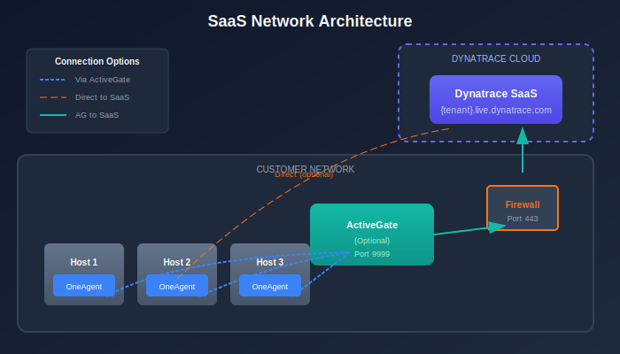
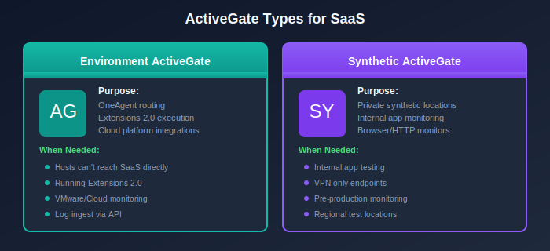

# Architecture and Design

> **Series:** M2S | **Notebook:** 4 of 8 | **Created:** January 2026 | **Last Updated:** 01/28/2026

---

## Table of Contents

1. [Introduction](#introduction)
2. [Network Architecture](#network)
3. [Network Zones](#network-zones)
4. [ActiveGate Design](#activegate)
5. [Security Architecture](#security)
6. [High Availability](#ha)
7. [Next Steps](#next-steps)

---

## Prerequisites

Before starting this notebook, you should have:

| Requirement | Description |
|-------------|-------------|
| Completed M2S-01 to M2S-03 | Discovery and planning complete |
| Network diagrams | Current Managed network topology |
| Firewall access | Ability to request firewall changes |
| SaaS tenant info | Tenant ID and URL |

---

## Learning Objectives

By the end of this notebook, you will:

- Design the network architecture for SaaS connectivity
- Plan ActiveGate deployment for your environment
- Configure security controls for the migration
- Understand high availability considerations

---

<a id="introduction"></a>
## 1. Introduction

Architecture design is critical for a successful migration. The key difference between Managed and SaaS is connectivity—your monitored infrastructure must reach Dynatrace SaaS endpoints.

### Key Architectural Changes

| Component | Managed | SaaS |
|-----------|---------|------|
| Cluster | On-premises servers | Dynatrace-hosted |
| OneAgent target | Internal cluster | SaaS endpoints or ActiveGate |
| ActiveGate role | Cluster component | Environment routing/extensions |
| Network flow | Internal only | Outbound to internet |

---

<!-- MARKDOWN_TABLE_ALTERNATIVE
| Layer | Component | Direction |
|-------|-----------|----------|
| Hosts | OneAgent | Outbound to SaaS/AG |
| Routing | ActiveGate | Outbound to SaaS |
| Cloud | SaaS Cluster | Receives all data |
-->



---

<a id="network"></a>
## 2. Network Architecture

### 2.1 SaaS Endpoints

All communication to Dynatrace SaaS uses HTTPS (port 443).

| Endpoint Pattern | Purpose |
|------------------|--------|
| `{tenant-id}.live.dynatrace.com` | Main SaaS cluster |
| `{tenant-id}.apps.dynatrace.com` | Apps and platform services |

### 2.2 Connectivity Options

| Option | OneAgent → | ActiveGate → | Best For |
|--------|------------|--------------|----------|
| **Direct** | SaaS | N/A | Open internet access |
| **Via Proxy** | Proxy → SaaS | N/A | Proxy-controlled environments |
| **Via ActiveGate** | ActiveGate | SaaS | Restricted networks |
| **Via AG + Proxy** | ActiveGate | Proxy → SaaS | Most restricted |

### 2.3 Firewall Requirements

**Minimum Requirements:**

| Source | Destination | Port | Protocol |
|--------|-------------|------|----------|
| OneAgent hosts | SaaS endpoint | 443 | HTTPS |
| ActiveGate | SaaS endpoint | 443 | HTTPS |

**If Using ActiveGate Routing:**

| Source | Destination | Port | Protocol |
|--------|-------------|------|----------|
| OneAgent hosts | ActiveGate | 9999 | HTTPS |
| ActiveGate | SaaS endpoint | 443 | HTTPS |

### 2.4 DNS Resolution

Ensure DNS can resolve:
- `{tenant-id}.live.dynatrace.com`
- `{tenant-id}.apps.dynatrace.com`
- `*.dynatrace.com` (for additional services)

### 2.5 Network Testing

Test connectivity before migration:

```bash
# Test HTTPS connectivity to SaaS
curl -v https://{tenant-id}.live.dynatrace.com/api/v1/time

# Test from a monitored host
curl -v https://{tenant-id}.live.dynatrace.com:443
```

---

<a id="network-zones"></a>
## 3. Network Zones

Network Zones provide optimized routing of telemetry data from OneAgents to ActiveGates to SaaS. This is especially important when migrating from Managed.

### 3.1 What Are Network Zones?

Network Zones allow you to:
- Group ActiveGates and OneAgents by network location
- Optimize traffic routing within and between network segments
- Define failover behavior for high availability
- Reduce cross-datacenter traffic

### 3.2 Why Network Zones Matter for Migration

| Consideration | Impact |
|--------------|--------|
| **Existing topology** | May need to recreate network zone structure in SaaS |
| **ActiveGate placement** | Zones determine which AGs serve which hosts |
| **Failover routing** | Hosts fail over to AGs in alternative zones |
| **Bandwidth optimization** | Local zones reduce WAN traffic |

### 3.3 Network Zone Planning

| Zone Type | Description | Example |
|-----------|-------------|---------|
| **Primary** | Default zone for a datacenter | `datacenter-east` |
| **Alternative** | Failover zone(s) | `datacenter-west` |
| **Cloud-specific** | Zone for cloud regions | `aws-us-east-1` |
| **Environment-specific** | By environment type | `production`, `nonprod` |

### 3.4 Configuring Network Zones

**Step 1: Create Network Zones in SaaS**

Navigate to **Settings → Network zones** or use the API:

```bash
curl -X POST "https://{tenant}.live.dynatrace.com/api/v2/networkZones" \
  -H "Authorization: Api-Token {token}" \
  -H "Content-Type: application/json" \
  -d '{
    "id": "datacenter-east",
    "description": "Primary datacenter in East region",
    "alternativeZones": ["datacenter-west"]
  }'
```

**Step 2: Assign ActiveGates to Zones**

During ActiveGate installation, specify the network zone:

```bash
# Linux
sudo /bin/sh Dynatrace-ActiveGate-Linux.sh --set-network-zone=datacenter-east

# Or via configuration after installation
sudo /opt/dynatrace/gateway/config/config.properties
# Add: networkzone=datacenter-east
```

**Step 3: Configure OneAgents for Network Zones**

```bash
# During OneAgent installation
sudo /bin/sh Dynatrace-OneAgent-Linux.sh --set-network-zone=datacenter-east

# Or after installation via oneagentctl
sudo /opt/dynatrace/oneagent/agent/tools/oneagentctl --set-network-zone=datacenter-east
```

### 3.5 Network Zone Best Practices

| Practice | Rationale |
|----------|-----------|
| **Minimum 2 AGs per zone** | High availability within zone |
| **Define alternative zones** | Failover if primary zone unavailable |
| **Match physical topology** | Zones should reflect network segments |
| **Use meaningful names** | Clear identification of location/purpose |
| **Plan before migration** | Deploy zones before moving OneAgents |

### 3.6 Migration Consideration: Host Groups vs Network Zones

| Feature | Host Groups | Network Zones |
|---------|-------------|---------------|
| Purpose | Logical grouping, config targeting | Traffic routing |
| Affects | Config inheritance | AG selection |
| Migration | Export/import via API | Recreate in SaaS |
| Assignment | Per host | Per host |

> **Important:** If you used Network Zones in Managed, you must recreate them in SaaS before migrating OneAgents. Zone configuration does not transfer automatically.

---

<!-- MARKDOWN_TABLE_ALTERNATIVE
| ActiveGate Type | Purpose |
|-----------------|--------|
| Environment AG | Routing, extensions |
| Synthetic AG | Private synthetic locations |
-->



---

<a id="activegate"></a>
## 4. ActiveGate Design

### 4.1 ActiveGate Types for SaaS

| Type | Purpose | When Needed |
|------|---------|-------------|
| **Environment ActiveGate** | OneAgent routing, extensions | Network-restricted hosts |
| **Synthetic ActiveGate** | Private synthetic monitoring | Internal application testing |

### 4.2 Do You Need ActiveGate?

| Scenario | ActiveGate Required? |
|----------|---------------------|
| Hosts can reach SaaS directly | No (optional for extensions) |
| Hosts behind firewall, no direct internet | Yes, for routing |
| Running Extensions 2.0 | Yes |
| Private synthetic monitoring | Yes |
| VMware monitoring | Yes |

### 4.3 ActiveGate Sizing

| Hosts Routed | CPU Cores | Memory | Disk |
|--------------|-----------|--------|------|
| Up to 500 | 2 | 4 GB | 20 GB |
| 500-1,500 | 4 | 8 GB | 40 GB |
| 1,500-5,000 | 8 | 16 GB | 80 GB |
| 5,000+ | Multiple AGs | Scale horizontally | - |

### 4.4 ActiveGate Placement

**Best Practices:**

1. **Close to monitored hosts** - Minimize latency
2. **In each network zone** - One AG per isolated segment (see Section 3)
3. **High availability** - Deploy minimum of 2 per datacenter
4. **DMZ for external access** - If needed for cloud integrations

### 4.5 ActiveGate Groups

Use groups to organize ActiveGates:

| Group | Purpose | Members |
|-------|---------|--------|
| `production-routing` | Prod OneAgent routing | AG-PROD-01, AG-PROD-02 |
| `nonprod-routing` | Non-prod routing | AG-NONPROD-01 |
| `extensions` | Extension execution | AG-EXT-01 |
| `synthetic` | Private synthetic | AG-SYNTH-01, AG-SYNTH-02 |

### 4.6 Install New ActiveGates in Parallel

> **Best Practice:** Install new SaaS-connected ActiveGates in parallel with existing Managed ActiveGates before migrating OneAgents.

This approach:
- Validates connectivity before impacting monitored hosts
- Allows gradual migration of OneAgents
- Provides easy rollback if issues occur
- Maintains monitoring continuity during transition

---

<a id="security"></a>
## 5. Security Architecture

### 5.1 API Token Strategy

Create purpose-specific tokens:

| Token Purpose | Required Scopes |
|---------------|----------------|
| OneAgent installation | `InstallerDownload` |
| ActiveGate installation | `InstallerDownload` |
| Configuration migration | `settings.read`, `settings.write` |
| Entity queries | `entities.read` |
| Metrics queries | `metrics.read` |
| Log queries | `logs.read` |
| Automation | `automation.read`, `automation.write` |

### 5.2 User Access Migration

| Authentication | Managed | SaaS |
|----------------|---------|------|
| Local users | Managed cluster | Account Management |
| SAML/SSO | IdP → Managed | IdP → Dynatrace Account |
| LDAP | Direct LDAP | Not supported (use SAML) |

### 5.3 Permission Mapping

| Managed Role | SaaS Equivalent |
|--------------|----------------|
| Cluster admin | Account admin |
| Environment admin | Environment admin |
| Monitor user | Viewer + specific policies |
| Custom roles | IAM policies |

### 5.4 Network Security

| Control | Implementation |
|---------|----------------|
| TLS encryption | Enforced by SaaS (TLS 1.2+) |
| Certificate pinning | OneAgent validates SaaS certs |
| IP allowlisting | SaaS IPs published by Dynatrace |
| Egress filtering | Limit to Dynatrace domains only |

---

<a id="ha"></a>
## 6. High Availability

### 6.1 SaaS HA (Provided by Dynatrace)

Dynatrace SaaS includes:
- Multi-region deployment
- Automatic failover
- Data replication
- 99.5% SLA (varies by contract)

### 6.2 Customer-Side HA

**ActiveGate High Availability:**

| Component | HA Strategy |
|-----------|-------------|
| Environment AG | Deploy multiple per network zone |
| Synthetic AG | Deploy pairs at each location |
| Load balancing | OneAgent auto-discovers available AGs |

### 6.3 Failover Behavior

| Scenario | OneAgent Behavior |
|----------|-------------------|
| Primary AG unavailable | Fails over to secondary AG |
| All AGs unavailable | Buffers data locally (up to 2 hours) |
| AG + SaaS available | Resumes normal transmission |

---

## Architecture Design Checklist

| Design Area | Completed |
|-------------|----------|
| Network connectivity verified | [ ] |
| Firewall rules documented | [ ] |
| Network Zones planned | [ ] |
| ActiveGate placement planned | [ ] |
| ActiveGate sizing calculated | [ ] |
| API token strategy defined | [ ] |
| User migration planned | [ ] |
| HA requirements addressed | [ ] |
| Bandwidth impact assessed | [ ] |

---

<a id="next-steps"></a>
## 7. Next Steps

### Immediate Actions

1. **Finalize network design** - Document all connectivity paths
2. **Request firewall changes** - Submit change requests early
3. **Plan Network Zones** - Recreate any zones from Managed
4. **Size ActiveGates** - Based on hosts to route
5. **Plan token strategy** - Document required scopes
6. **Create architecture diagram** - Visual documentation

### Continue the Series

| Next Notebook | Focus |
|---------------|-------|
| **M2S-05: Configuration Migration** | Settings, dashboards, and automation |

### Architecture Resources

- [ActiveGate Documentation](https://docs.dynatrace.com/docs/setup-and-configuration/dynatrace-activegate)
- [Network Zones](https://docs.dynatrace.com/docs/setup-and-configuration/dynatrace-activegate/network-zones)
- [Network Requirements](https://docs.dynatrace.com/docs/setup-and-configuration/setup-on-cloud-platforms/amazon-web-services/amazon-web-services-integrations/aws-vpc-and-outbound-proxy)
- [OneAgent Communication](https://docs.dynatrace.com/docs/setup-and-configuration/dynatrace-oneagent/oneagent-configuration/network-connectivity)

---

## Summary

In this notebook, you learned:

- How to design network architecture for SaaS connectivity
- Network Zones for optimized traffic routing
- ActiveGate sizing and placement strategies
- Security considerations for the migration
- High availability patterns for customer-side components

> **Key Takeaway:** The primary architectural change is network connectivity. Ensure all monitored hosts can reach SaaS endpoints, either directly or through ActiveGates. Plan Network Zones before migrating to optimize traffic routing.

---

*Continue to **M2S-05: Configuration Migration** for guidance on migrating settings and configurations.*

---

<sub>*This notebook was AI-generated from community-submitted and publicly available sources. This notebook series is not officially supported by Dynatrace. Always verify information against official Dynatrace documentation.*</sub>
