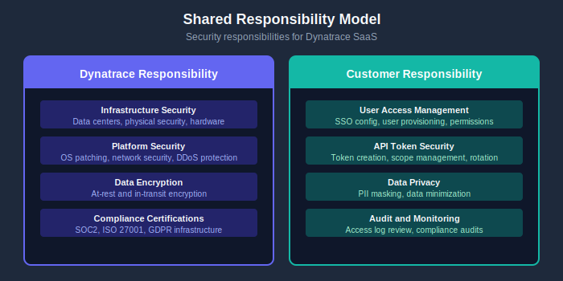

# Security and Privacy

> **Series:** M2S | **Notebook:** 7 of 8 | **Created:** January 2026

---

## Table of Contents

1. [Introduction](#introduction)
2. [Data Security in SaaS](#data-security)
3. [Compliance and Certifications](#compliance)
4. [Access Control](#access-control)
5. [Privacy Considerations](#privacy)
6. [Common Security Questions](#questions)
7. [Next Steps](#next-steps)

---

## Prerequisites

Before starting this notebook, you should have:

| Requirement | Description |
|-------------|-------------|
| Completed M2S-01 to M2S-06 | Agent migration complete or planned |
| Security team engagement | Security stakeholders involved |
| Compliance requirements | List of applicable regulations |

---

## Learning Objectives

By the end of this notebook, you will:

- Understand Dynatrace SaaS security architecture
- Know which compliance certifications Dynatrace holds
- Be able to configure access control for your organization
- Address common security concerns about SaaS

---

<a id="introduction"></a>
## 1. Introduction

Security is often the primary concern when moving to SaaS. This notebook addresses the security model, compliance, and privacy considerations for Dynatrace SaaS.

### Security Mindset Shift

| Managed | SaaS |
|---------|------|
| You own infrastructure security | Dynatrace owns infrastructure security |
| You patch servers | Dynatrace patches servers |
| Your data center controls | Dynatrace data center controls |
| Your compliance burden | Shared compliance responsibility |

---

<!-- MARKDOWN_TABLE_ALTERNATIVE
| Layer | Responsibility |
|-------|---------------|
| Infrastructure | Dynatrace |
| Platform | Dynatrace |
| Application | Dynatrace |
| Data Access | Customer |
| User Management | Customer |
-->



---

<a id="data-security"></a>
## 2. Data Security in SaaS

### 2.1 Data Encryption

| State | Encryption Method |
|-------|-------------------|
| In Transit | TLS 1.2+ (enforced) |
| At Rest | AES-256 encryption |
| Backups | Encrypted at rest |

### 2.2 Data Isolation

Dynatrace SaaS uses multi-tenant architecture with strict isolation:

- **Logical isolation** - Tenant data separated at application level
- **Encryption keys** - Per-tenant encryption keys
- **Access controls** - No cross-tenant access possible

### 2.3 Data Residency

Dynatrace offers regional deployment options:

| Region | Data Center Locations |
|--------|----------------------|
| US | Multiple US regions |
| EU | European data centers |
| APAC | Asia-Pacific regions |

> **Note:** Confirm data residency requirements with your Dynatrace account team during provisioning.

### 2.4 Data Retention

| Data Type | Default Retention | Configurable |
|-----------|-------------------|-------------|
| Transaction data | 35 days | Yes (via license) |
| Session replay | 35 days | Yes |
| Logs | Based on bucket config | Yes |
| Metrics | 5 years (aggregated) | Limited |

---

<a id="compliance"></a>
## 3. Compliance and Certifications

### 3.1 Certifications Held by Dynatrace

| Certification | Scope |
|---------------|-------|
| **SOC 2 Type II** | Security, availability, confidentiality |
| **ISO 27001** | Information security management |
| **ISO 27017** | Cloud security controls |
| **ISO 27018** | PII protection in cloud |
| **GDPR** | EU data protection compliance |
| **HIPAA** | Healthcare data (with BAA) |
| **FedRAMP** | US government (specific offerings) |

### 3.2 Compliance Documentation

Request the following from Dynatrace:

- SOC 2 Type II Report
- ISO 27001 Certificate
- Penetration test summaries
- Data Processing Addendum (DPA)

### 3.3 Your Compliance Responsibilities

While Dynatrace handles infrastructure compliance, you remain responsible for:

| Area | Your Responsibility |
|------|--------------------|
| User access | Manage who has access |
| Data masking | Configure PII masking rules |
| Audit logs | Review access logs |
| Token management | Secure API tokens |
| Integration security | Secure webhook configurations |

---

<a id="access-control"></a>
## 4. Access Control

### 4.1 Authentication Options

| Method | Use Case |
|--------|----------|
| Dynatrace Account | Simple setup, local users |
| SAML 2.0 SSO | Enterprise identity federation |
| Google SSO | Google Workspace integration |
| Microsoft SSO | Azure AD integration |

### 4.2 Authorization Model

Dynatrace SaaS uses IAM (Identity and Access Management):

| Concept | Description |
|---------|-------------|
| **Policies** | Define what actions are allowed |
| **Groups** | Collections of users |
| **Bindings** | Connect policies to groups/users |
| **Environments** | Scope of access |

### 4.3 Built-in Roles

| Role | Capabilities |
|------|-------------|
| Account Admin | Full account management |
| Environment Admin | Full environment access |
| Environment Viewer | Read-only environment access |
| Dashboard Editor | Dashboard management |
| Automation Editor | Workflow management |

### 4.4 Custom Policies

Create custom policies for fine-grained control:

```json
{
  "name": "Production Viewer",
  "statement": [
    {
      "effect": "ALLOW",
      "service": "dynatrace:platform:*",
      "action": ["read"],
      "condition": {
        "environment": "production-env-id"
      }
    }
  ]
}
```

### 4.5 API Token Security

| Best Practice | Implementation |
|---------------|----------------|
| Minimal scopes | Only grant required permissions |
| Token rotation | Rotate tokens regularly |
| Token naming | Use descriptive names for auditing |
| Expiration | Set expiration dates where possible |
| Secure storage | Use secrets management (Vault, etc.) |

---

<a id="privacy"></a>
## 5. Privacy Considerations

### 5.1 What Data Does Dynatrace Collect?

| Data Type | Examples | Masking Available |
|-----------|----------|------------------|
| Infrastructure metrics | CPU, memory, disk | N/A (no PII) |
| Application traces | Request paths, timing | Yes |
| Logs | Application logs | Yes |
| Session replay | User interactions | Yes |
| Real user data | IP addresses, user agents | Yes |

### 5.2 PII Masking Configuration

Configure data masking for sensitive information:

| Feature | Location | Purpose |
|---------|----------|--------|
| Request attribute masking | Settings → Request attributes | Mask captured values |
| Session replay masking | RUM settings | Mask form inputs |
| Log masking | OpenPipeline | Mask log content |
| IP anonymization | RUM settings | Anonymize IPs |

### 5.3 Data Minimization

Reduce data collection where not needed:

| Setting | Impact |
|---------|--------|
| Disable session replay | No user session recordings |
| Limit log ingestion | Only critical logs |
| Exclude URL parameters | No sensitive query strings |
| Disable RUM for internal apps | No external user tracking |

### 5.4 GDPR Considerations

| Requirement | Dynatrace Support |
|-------------|-------------------|
| Data subject access | Export user data via API |
| Right to erasure | Contact Dynatrace support |
| Data portability | Export functionality |
| Data processing agreement | DPA available |

---

<a id="questions"></a>
## 6. Common Security Questions

### Q1: Can Dynatrace employees access my data?

**Answer:** Access is strictly controlled:
- Support access requires customer approval
- All access is logged and audited
- Background checks for employees
- Need-to-know basis only

### Q2: What happens to my data if I leave Dynatrace?

**Answer:** Data handling at contract end:
- Data export available before termination
- Data deleted within 30 days of contract end
- Certification of deletion available

### Q3: How does Dynatrace handle security incidents?

**Answer:** Incident response process:
- 24/7 security monitoring
- Defined incident response procedures
- Customer notification within contractual timeframes
- Root cause analysis provided

### Q4: Can I use Dynatrace for PCI-DSS environments?

**Answer:** Yes, with proper configuration:
- Enable appropriate masking
- Configure log filtering
- Review data capture settings
- Document in your PCI scope

### Q5: How is data backed up?

**Answer:** Backup strategy:
- Regular automated backups
- Encrypted at rest
- Geographically distributed
- Regular restore testing

### Q6: What about supply chain security?

**Answer:** Supply chain controls:
- Vendor security assessments
- Dependency scanning
- Secure software development lifecycle
- Regular security testing

---

## Security Checklist for Migration

| Security Area | Action | Status |
|---------------|--------|--------|
| **Compliance** | Review certifications | [ ] |
| **Data residency** | Confirm region selection | [ ] |
| **Authentication** | Configure SSO | [ ] |
| **Authorization** | Set up IAM policies | [ ] |
| **API tokens** | Create with minimal scopes | [ ] |
| **PII masking** | Configure masking rules | [ ] |
| **Audit logging** | Enable and review | [ ] |
| **Security review** | Complete security assessment | [ ] |

---

<a id="next-steps"></a>
## 7. Next Steps

### Immediate Actions

1. **Review compliance docs** - Request SOC 2 report from Dynatrace
2. **Plan SSO integration** - Configure identity provider
3. **Design IAM structure** - Define roles and policies
4. **Configure masking** - Set up PII protection
5. **Document security posture** - For internal security review

### Continue the Series

| Next Notebook | Focus |
|---------------|-------|
| **M2S-08: Validation & Optimization** | Post-migration validation and tuning |

### Security Resources

- [Dynatrace Trust Center](https://www.dynatrace.com/company/trust-center/)
- [IAM Documentation](https://docs.dynatrace.com/docs/manage/identity-access-management)
- [Data Privacy](https://docs.dynatrace.com/docs/manage/data-privacy-and-security)

---

## Summary

In this notebook, you learned:

- Dynatrace SaaS security architecture and encryption
- Compliance certifications and your responsibilities
- Access control configuration with IAM
- Privacy considerations and PII masking
- Answers to common security questions

> **Key Takeaway:** Dynatrace SaaS has robust security controls and compliance certifications. Your responsibility shifts from infrastructure security to access control and data privacy configuration.

---

*Continue to **M2S-08: Validation & Optimization** for post-migration validation and optimization.*

---

<sub>*This notebook was AI-generated from community-submitted and publicly available sources. This notebook series is not officially supported by Dynatrace. Always verify information against official Dynatrace documentation.*</sub>
