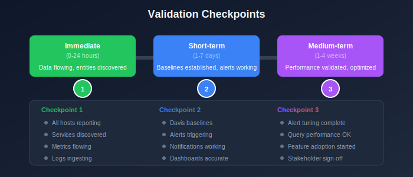

# Validation and Optimization

> **Series:** M2S | **Notebook:** 8 of 8 | **Created:** January 2026

---

## Table of Contents

1. [Introduction](#introduction)
2. [Migration Validation](#validation)
3. [Data Quality Checks](#data-quality)
4. [Performance Optimization](#optimization)
5. [Feature Adoption](#features)
6. [Migration Completion](#completion)

---

## Prerequisites

Before starting this notebook, you should have:

| Requirement | Description |
|-------------|-------------|
| Completed M2S-01 to M2S-07 | All migration steps executed |
| Agents migrated | OneAgents reporting to SaaS |
| Configurations applied | Settings imported to SaaS |
| Integrations configured | Notifications working |

---

## Learning Objectives

By the end of this notebook, you will:

- Validate complete migration success
- Verify data quality and completeness
- Optimize performance and configuration
- Plan adoption of new SaaS features
- Complete the migration formally

---

<a id="introduction"></a>
## 1. Introduction

Validation is the final and most critical phase. A migration isn't complete until all success criteria are verified and stakeholders sign off.

### Validation Approach

| Phase | Focus |
|-------|-------|
| Immediate (0-24h) | Data flowing, entities discovered |
| Short-term (1-7d) | Baselines established, alerts working |
| Medium-term (1-4w) | Performance validated, optimization complete |

---

<!-- MARKDOWN_TABLE_ALTERNATIVE
| Checkpoint | Validation |
|------------|------------|
| Entities | All hosts/services discovered |
| Metrics | Data flowing continuously |
| Alerting | Notifications working |
| Dashboards | All tiles showing data |
-->



---

<a id="validation"></a>
## 2. Migration Validation

### 2.1 Entity Count Validation

Compare entity counts between Managed (documented during planning) and SaaS:

```dql
// Complete entity summary
fetch dt.entity.host | summarize hosts = count()
| append [fetch dt.entity.service | summarize services = count()]
| append [fetch dt.entity.application | summarize applications = count()]
| append [fetch dt.entity.process_group | summarize processGroups = count()]
| append [fetch dt.entity.synthetic_monitor | summarize syntheticMonitors = count()]
```

### 2.2 Host Validation

Verify all expected hosts are reporting:

```dql
// List all hosts with last seen time
fetch dt.entity.host
| fieldsAdd hostName = entity.name, lastSeen = entity.lastSeenTms
| fields hostName, lastSeen
| sort lastSeen desc
```

```dql
// Find hosts not seen recently (potential issues)
fetch dt.entity.host
| fieldsAdd hostName = entity.name, lastSeen = entity.lastSeenTms
| filter lastSeen < now() - 30m
| fields hostName, lastSeen
| sort lastSeen asc
```

### 2.3 Service Discovery Validation

```dql
// Count services by technology
fetch dt.entity.service
| summarize count(), by:{serviceType}
| sort `count()` desc
```

```dql
// Active services in last hour
fetch dt.entity.service
| fieldsAdd serviceName = entity.name, lastSeen = entity.lastSeenTms
| filter lastSeen > now() - 1h
| summarize activeServices = count()
```

### 2.4 ActiveGate Validation

```dql
// Verify ActiveGates are connected
fetch dt.entity.active_gate
| fieldsAdd gateName = entity.name
| fields gateName, id
```

### 2.5 Validation Comparison Table

| Entity Type | Expected (from Planning) | Actual (SaaS) | Status |
|-------------|-------------------------|---------------|--------|
| Hosts | ___ | ___ | [ ] Match |
| Services | ___ | ___ | [ ] Match |
| Applications | ___ | ___ | [ ] Match |
| Process Groups | ___ | ___ | [ ] Match |
| Synthetic Monitors | ___ | ___ | [ ] Match |
| ActiveGates | ___ | ___ | [ ] Match |

---

<a id="data-quality"></a>
## 3. Data Quality Checks

### 3.1 Metrics Flow Validation

```dql
// Check CPU metrics are flowing
timeseries avg(dt.host.cpu.usage), by:{dt.entity.host}
| limit 10
```

```dql
// Check memory metrics
timeseries avg(dt.host.memory.usage), by:{dt.entity.host}
| limit 10
```

### 3.2 Log Ingestion Validation

```dql
// Check log volume over time
fetch logs
| summarize logCount = count(), by:{bin(timestamp, 5m)}
| sort timestamp desc
| limit 24
```

```dql
// Check logs by source
fetch logs
| summarize count(), by:{log.source}
| sort `count()` desc
| limit 10
```

### 3.3 Trace/Span Validation

```dql
// Check distributed traces are flowing
fetch spans
| summarize spanCount = count(), by:{bin(timestamp, 5m)}
| sort timestamp desc
| limit 12
```

```dql
// Check service request volume
fetch spans
| filter span.kind == "server"
| summarize requestCount = count(), by:{dt.entity.service}
| sort requestCount desc
| limit 10
```

### 3.4 Data Gaps Detection

```dql
// Look for gaps in metric data (should see consistent counts)
timeseries hosts = count(dt.host.cpu.usage), by:{}
| fieldsAdd gap = if(hosts < 1, then: "GAP", else: "OK")
| filter gap == "GAP"
```

---

<a id="optimization"></a>
## 4. Performance Optimization

### 4.1 Query Performance

Review and optimize frequently-used queries:

| Optimization | Technique |
|--------------|----------|
| Add time filters | Always filter by timestamp |
| Limit results | Use `limit` to reduce data |
| Filter early | Apply filters before aggregations |
| Use summarize | Aggregate instead of fetching all rows |

### 4.2 Dashboard Optimization

| Issue | Solution |
|-------|----------|
| Slow loading | Reduce tile count, optimize queries |
| Timeouts | Add time filters, reduce scope |
| Too much data | Use summarize/aggregations |

### 4.3 Alert Tuning

| Symptom | Action |
|---------|--------|
| Too many alerts | Raise thresholds, add filters |
| Missing alerts | Lower thresholds, verify coverage |
| Noisy alerts | Add time-based conditions |

### 4.4 Baseline Establishment

Davis AI needs time to establish baselines:

| Baseline Type | Time Required |
|---------------|---------------|
| Response time | 2-7 days |
| Error rates | 2-7 days |
| Resource usage | 7-14 days |
| Traffic patterns | 7-14 days |

> **Note:** Expect more alerts initially as baselines establish. This is normal.

---

<a id="features"></a>
## 5. Feature Adoption

### 5.1 SaaS-Only Features to Explore

| Feature | Benefit | Priority |
|---------|---------|----------|
| **Grail** | Unified data lakehouse | High |
| **Notebooks** | Interactive analysis | High |
| **Automations** | Advanced workflows | Medium |
| **Platform Apps** | Extended functionality | Medium |
| **Davis Copilot** | AI-assisted analysis | High |

### 5.2 Grail Adoption

Grail provides unified querying across all data:

| Data Type | Grail Table |
|-----------|-------------|
| Logs | `fetch logs` |
| Spans | `fetch spans` |
| Events | `fetch events` |
| Business Events | `fetch bizevents` |
| Entities | `fetch dt.entity.*` |

### 5.3 Automations Adoption

Replace manual processes with workflows:

| Use Case | Workflow Type |
|----------|---------------|
| Problem remediation | Problem trigger |
| Report generation | Scheduled trigger |
| Event response | Event trigger |
| Integration updates | HTTP request action |

### 5.4 Feature Adoption Plan

| Week | Focus |
|------|-------|
| 1-2 | Stabilize migration, tune alerts |
| 3-4 | Explore Notebooks, create team notebooks |
| 5-6 | Implement first automation workflows |
| 7-8 | Adopt platform apps, explore Copilot |

---

<a id="completion"></a>
## 6. Migration Completion

### 6.1 Final Validation Checklist

| Category | Checkpoint | Status |
|----------|------------|--------|
| **Entities** | All hosts reporting | [ ] |
| **Entities** | All services discovered | [ ] |
| **Entities** | All applications configured | [ ] |
| **Data** | Metrics flowing | [ ] |
| **Data** | Logs ingesting | [ ] |
| **Data** | Traces capturing | [ ] |
| **Config** | Dashboards working | [ ] |
| **Config** | Alerting functional | [ ] |
| **Config** | Notifications delivering | [ ] |
| **Security** | SSO configured | [ ] |
| **Security** | Access controls applied | [ ] |
| **Integration** | All webhooks working | [ ] |

### 6.2 Stakeholder Sign-Off

| Stakeholder | Approval | Date |
|-------------|----------|------|
| Platform Team Lead | [ ] | |
| Security Team | [ ] | |
| Application Teams | [ ] | |
| Executive Sponsor | [ ] | |

### 6.3 Managed Decommissioning

After successful validation:

| Step | Action | Timing |
|------|--------|--------|
| 1 | Confirm no agents pointing to Managed | Immediate |
| 2 | Keep Managed for comparison | 2-4 weeks |
| 3 | Export final Managed data | Before shutdown |
| 4 | Decommission Managed cluster | After validation period |

### 6.4 Documentation Updates

Update your documentation:

| Document | Update Required |
|----------|----------------|
| Runbooks | New SaaS URLs and procedures |
| Architecture diagrams | New network topology |
| Onboarding guides | SaaS-specific instructions |
| Disaster recovery | Updated recovery procedures |

---

## Migration Success Metrics

| Metric | Target | Actual |
|--------|--------|--------|
| Host coverage | 100% | |
| Service coverage | 100% | |
| Data gaps | < 15 minutes | |
| Alert delivery | 100% | |
| Dashboard availability | 100% | |
| Integration success | 100% | |

---

## Series Conclusion

Congratulations on completing the M2S migration series!

### What You've Accomplished

| Notebook | Achievement |
|----------|-------------|
| M2S-01 | Understood benefits and motivation |
| M2S-02 | Learned the migration framework |
| M2S-03 | Completed planning and assessment |
| M2S-04 | Designed architecture and network |
| M2S-05 | Migrated configurations |
| M2S-06 | Migrated agents |
| M2S-07 | Addressed security and privacy |
| M2S-08 | Validated and optimized |

### Ongoing Success

Your migration is complete, but the journey continues:

1. **Monitor baselines** - Watch Davis AI establish patterns
2. **Tune alerting** - Reduce noise over time
3. **Adopt features** - Leverage SaaS capabilities
4. **Share knowledge** - Train your teams on SaaS
5. **Provide feedback** - Help improve the platform

### Additional Resources

- [Dynatrace Documentation](https://docs.dynatrace.com/)
- [Dynatrace Community](https://community.dynatrace.com/)
- [Dynatrace University](https://university.dynatrace.com/)

---

## Summary

In this final notebook, you learned:

- How to validate migration completeness
- DQL queries for data quality verification
- Performance optimization techniques
- SaaS feature adoption planning
- Migration completion procedures

> **Key Takeaway:** A migration is only complete when all success criteria are validated and stakeholders sign off. Take time to verify everything before decommissioning Managed.

---

*Thank you for completing the M2S: Managed-to-SaaS Migration Best Practices series!*

---

<sub>*This notebook was AI-generated from community-submitted and publicly available sources. This notebook series is not officially supported by Dynatrace. Always verify information against official Dynatrace documentation.*</sub>
