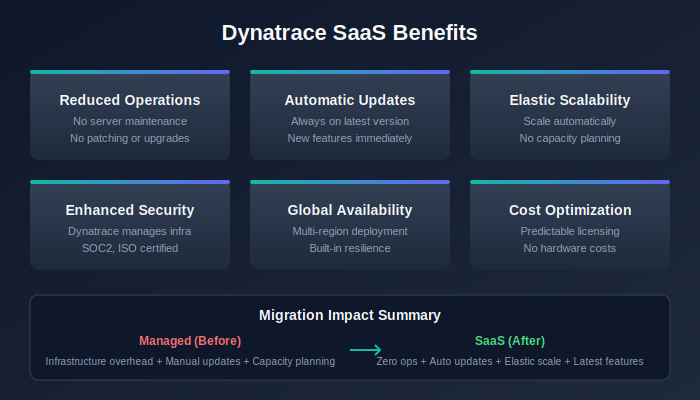

# What's Different in SaaS

> **Series:** M2S | **Notebook:** 1 of 8 | **Created:** January 2026 | **Last Updated:** 02/06/2026

Congratulations on your new Dynatrace SaaS tenant! This notebook series guides you through migrating your monitoring from Managed to SaaS.

---

## Table of Contents

1. [Introduction](#introduction)
2. [Key Differences from Managed](#key-differences-from-managed)
3. [Assessing Your Managed Environment](#assessing-your-managed-environment)

---

## Prerequisites

Before starting this series, ensure you have:

| Requirement | Description |
|-------------|-------------|
| SaaS tenant provisioned | Your new Dynatrace SaaS environment is ready |
| Managed environment access | Administrator access to your existing Managed deployment |
| API Tokens | Tokens with `entities.read`, `settings.read` scopes on both environments |

---

## Learning Objectives

By the end of this notebook, you will:

- Understand the Grail architecture that powers your new SaaS tenant
- Know the key differences between Managed and SaaS
- Have a complete assessment of your Managed environment
- Be ready to plan your migration strategy

---

<a id="introduction"></a>
## 1. Introduction
### What This Series Covers

| Notebook | Focus |
|----------|-------|
| **M2S-01** (this notebook) | What's different in SaaS |
| **M2S-02** | Migration framework overview |
| **M2S-03** | Planning and assessment |
| **M2S-04** | Architecture and design |
| **M2S-05** | Configuration migration |
| **M2S-06** | OneAgent and ActiveGate migration |
| **M2S-07** | Security and privacy |
| **M2S-08** | Validation and optimization |

### Important: Your SaaS Tenant Uses Grail

Your new SaaS tenant is powered by **Grail**, Dynatrace's modern data lakehouse architecture. This means:

- Some features work differently than in Managed
- New capabilities are available that weren't in Managed
- Some legacy features are not available

This notebook helps you understand these differences so you can plan accordingly.

---

<a id="grail"></a>
## 2. Grail Architecture Overview

### What is Grail?

Grail is Dynatrace's unified data lakehouse that powers all data storage and analytics in SaaS. It replaces the traditional time-series database used in Managed.

### Grail vs Legacy Architecture

| Aspect | Legacy/Managed | Grail (SaaS) |
|--------|----------------|--------------|
| Data storage | Time-series database | Unified data lakehouse |
| Query language | USQL (limited) | DQL (full-featured) |
| Dashboards | Classic dashboards | Modern dashboards + Notebooks |
| Log analytics | Log Monitoring v1 | Log Management powered by Grail |
| Business events | Limited | Full business analytics |
| Retention | Fixed tiers | Flexible, cost-optimized |

### Grail-Exclusive Features

These capabilities are only available on your new SaaS tenant:

| Feature | Description |
|---------|-------------|
| **Grail** | Petabyte-scale data lakehouse |
| **DQL** | Context-aware queries across all data types |
| **Notebooks** | Interactive analysis with collaboration |
| **Automations** | Advanced workflow engine |
| **OpenPipeline** | Custom data processing and routing |
| **Business Analytics** | Full business context and KPIs |

---

<!-- MARKDOWN_TABLE_ALTERNATIVE
| What Changes | Managed | SaaS |
|--------------|---------|------|
| Queries | USQL | DQL (required) |
| Dashboards | Classic | Modern + Classic |
| Logs | Log Monitoring v1 | Log Management |
| Alerting | Classic alerts | Workflows |
-->



---

<a id="key-differences-from-managed"></a>
## 3. Key Differences from Managed
### What Changes

| Area | Managed | SaaS (Grail) |
|------|---------|--------------|
| **Queries** | USQL | DQL (required for new features) |
| **Dashboards** | Classic only | Modern dashboards (recommended) |
| **Log Management** | Log Monitoring v1 | Log Management via Grail |
| **Metrics** | Classic metrics | Grail-powered metrics |
| **Alerting** | Classic alerts | Workflows and Davis Analyzers |

### What Stays the Same

Your existing investments are preserved:

- OneAgent deployment patterns
- Monitoring configurations (with migration)
- DQL query skills (DQL works on both)
- Classic dashboards (still supported, modern recommended)
- Core alerting concepts

### What You'll Need to Learn

| Topic | Why |
|-------|-----|
| **DQL** | Required for querying Grail data |
| **Modern dashboards** | New visualization approach |
| **Workflows** | Replaced classic alerting profiles |
| **OpenPipeline** | New log processing model |
| **Notebooks** | Interactive analysis tool |

---

### Important Limitations to Know

| Limitation | Impact | Planning Note |
|------------|--------|---------------|
| **Historic data** | Cannot be migrated | Plan for baseline period in SaaS |
| **Host limit** | 25,000 per tenant | Split tenants if exceeding |
| **SAML signing** | IdP must sign full message | Verify IdP configuration |
| **OneAgent versions** | 9-12 month support window | Check oldest versions |

### SAML/SSO Requirements

> **🚨 Critical:** Your Identity Provider (IdP) must sign the **entire SAML message**, not just the assertion. Azure AD meets this requirement by default.

| IdP Consideration | Requirement |
|-------------------|-------------|
| SAML message signing | Full message, not just assertion |
| Group limit (Azure Entra) | 150 groups per user in SAML claim |
| Group filtering | Filter to Dynatrace-related groups only |

---

<a id="assessing-your-managed-environment"></a>
## 4. Assessing Your Managed Environment
Before planning your migration, document your current state.

> **Important:** DQL (Grail) is only available in SaaS environments. For Managed environments, use the **Entities API v2** or the **Dynatrace UI** to gather this information.

### Environment Size Assessment

Use the Entities API v2 to gather counts from your Managed environment:

```bash
# Count total monitored hosts
curl -X GET "https://{your-managed-url}/api/v2/entities?entitySelector=type(HOST)&pageSize=1" \
  -H "Authorization: Api-Token {TOKEN}" | jq '.totalCount'

# Count hosts by OS type
curl -X GET "https://{your-managed-url}/api/v2/entities?entitySelector=type(HOST)&fields=properties.osType" \
  -H "Authorization: Api-Token {TOKEN}"

# Count services
curl -X GET "https://{your-managed-url}/api/v2/entities?entitySelector=type(SERVICE)&pageSize=1" \
  -H "Authorization: Api-Token {TOKEN}" | jq '.totalCount'

# Count applications
curl -X GET "https://{your-managed-url}/api/v2/entities?entitySelector=type(APPLICATION)&pageSize=1" \
  -H "Authorization: Api-Token {TOKEN}" | jq '.totalCount'
```

Or use the Dynatrace UI:
- **Hosts:** Navigate to Infrastructure → Hosts (count shown in header)
- **Services:** Navigate to Applications & Microservices → Services
- **Applications:** Navigate to Applications & Microservices → Frontend

### OneAgent Version Assessment

Understanding your OneAgent versions helps plan the migration. Use the Entities API:

```bash
# Get OneAgent versions
curl -X GET "https://{your-managed-url}/api/v2/entities?entitySelector=type(HOST)&fields=properties.oneAgentVersion" \
  -H "Authorization: Api-Token {TOKEN}"
```

Or use the Dynatrace UI: Navigate to **Manage → Deployment status → OneAgent**

### ActiveGate Assessment

Identify your ActiveGate deployment using the Entities API:

```bash
# Get ActiveGate inventory
curl -X GET "https://{your-managed-url}/api/v2/entities?entitySelector=type(ENVIRONMENT_ACTIVE_GATE)" \
  -H "Authorization: Api-Token {TOKEN}"
```

Or use the Dynatrace UI: Navigate to **Manage → Deployment status → ActiveGates**

```dql
// Check OneAgent versions across hosts
fetch dt.entity.host
| summarize hostCount = count(), by:{installerVersion}
| sort hostCount desc
```

<a id="next-steps"></a>
## 5. Next Steps

### The SaaS Upgrade Assistant

Dynatrace provides the **[SaaS Upgrade Assistant](https://docs.dynatrace.com/managed/upgrade/saas-upgrade-assistant/)** app to automate your migration from Managed to SaaS. This is the **recommended primary tool** for most migrations.

| Feature | Description |
|---------|-------------|
| **Automated Configuration Import** | Export configurations from Managed and upload to SaaS—most settings and dashboards migrate automatically |
| **Selective Import** | Smart dependency-aware import lets you choose which configurations to deploy per wave |
| **Dashboard Ownership Migration** | Automatically updates dashboard owners from Managed to SaaS user identifiers |
| **Entity ID Adjustment** | Handles entity ID changes between environments automatically |
| **Progress Tracking** | Real-time upgrade status with deployment result downloads (CSV) |
| **Bulk Editing** | Edit and correct failed configurations individually or in bulk mode |
| **Preview Changes** | Review all changes before deploying to ensure accuracy |

#### How It Works

1. **Export** configuration from your Managed Cluster Management Console
2. **Upload** the configuration archive to the SaaS Upgrade Assistant app in your target SaaS tenant
3. **Review** imported configurations—grouped by type with error highlighting
4. **Edit** any failed or incompatible configurations (single or bulk mode)
5. **Deploy** selected configurations to your SaaS environment
6. **Track** progress and download deployment result reports

#### Version Alignment Requirement

> **Important:** For best results, align your Managed cluster and SaaS environment to the **same major version** (e.g., both 1.294.x). Mismatched versions can cause false-positive migration failures. The SaaS Upgrade Assistant requires **Dynatrace Managed version 1.294 or later**.

#### IAM Requirements

Users need the `upgrade-assistant:environments:write` IAM policy assigned in Account Management to use the SaaS Upgrade Assistant.

> **Tip:** See the full documentation at [SaaS Upgrade Assistant](https://docs.dynatrace.com/managed/upgrade/saas-upgrade-assistant/) and contact your Dynatrace account team for guided migration support.

### Migration Tooling Options

| Tool | Best For | Approach |
|------|----------|----------|
| **[SaaS Upgrade Assistant](https://docs.dynatrace.com/managed/upgrade/saas-upgrade-assistant/)** | Most migrations—guided UI-based migration | Export from Managed, import via app |
| **Monaco** | Configuration-as-code standardized deployments | YAML-based config management |
| **Terraform** | Infrastructure-as-code environments | Dynatrace Terraform provider |
| **Settings API** | Custom automation scripts | Direct API export/import |

> **Warning:** Avoid mixing tooling approaches. For example, Monaco YAML templates can conflict with the SaaS Upgrade Assistant. Choose one primary method for consistency.

### Immediate Actions

1. **Run the assessment queries** - Document your Managed environment size
2. **Verify network connectivity** - Can you reach your SaaS tenant?
3. **Create API tokens** - On both Managed and SaaS
4. **Install the SaaS Upgrade Assistant** - On your target SaaS tenant
5. **Review the checklist** - Identify any gaps

### Continue the Series

| Next Notebook | Focus |
|---------------|-------|
| **M2S-02: Migration Framework** | Understanding the 3-phase migration approach |

### Additional Resources

- [SaaS Upgrade Assistant Documentation](https://docs.dynatrace.com/managed/upgrade/saas-upgrade-assistant/)
- [SaaS Upgrade Assistant on Dynatrace Hub](https://www.dynatrace.com/hub/detail/saas-upgrade-assistant/)
- [Upgrading from Dynatrace Managed to SaaS](https://www.dynatrace.com/platform/saas-upgrade/)
- [Dynatrace SaaS Documentation](https://docs.dynatrace.com/)
- [Grail Data Lakehouse](https://docs.dynatrace.com/docs/platform/grail)
- [DQL Reference](https://docs.dynatrace.com/docs/platform/grail/dynatrace-query-language)

---

## Summary

In this notebook, you learned:

- How Grail architecture differs from Managed
- Key changes to expect in your SaaS tenant
- Important limitations and requirements
- How to assess your current Managed environment
- The SaaS Upgrade Assistant as the primary migration tool
- Available migration tooling options

> **Key Takeaway:** Your SaaS tenant uses Grail, which means new capabilities but also some changes in how you work. The [SaaS Upgrade Assistant](https://docs.dynatrace.com/managed/upgrade/saas-upgrade-assistant/) automates the majority of configuration migration—start by installing it on your SaaS tenant.

---

*Continue to **M2S-02: Migration Framework Overview** to learn about the structured approach to migration.*
