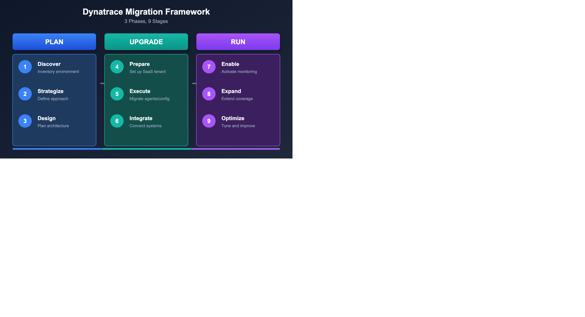
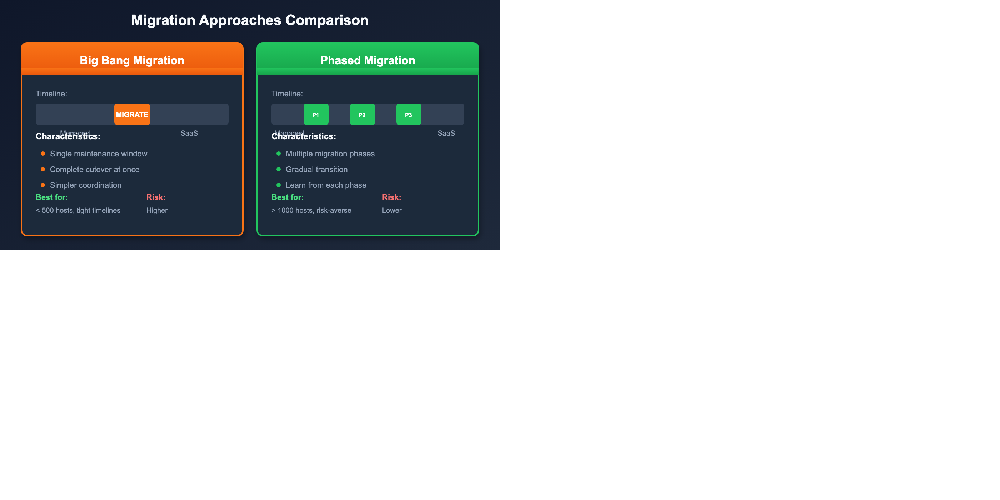

# Migration Framework Overview

> **Series:** M2S | **Notebook:** 2 of 8 | **Created:** January 2026 | **Last Updated:** 03/02/2026

Migrating from Dynatrace Managed to SaaS is not a single action—it's a journey. The Dynatrace Migration Framework provides a structured approach that has been validated across hundreds of successful migrations.

---

## Table of Contents

1. [Introduction](#introduction)
2. [The Three-Phase Framework](#the-three-phase-framework)
3. [Phase 1: Plan](#phase-1-plan)
4. [Phase 2: Upgrade](#phase-2-upgrade)
5. [Phase 3: Run](#phase-3-run)
6. [Migration Approaches](#migration-approaches)
7. [6 Best Practices for Migration](#6-best-practices-for-migration)
8. [Lessons Learned from Customer Migrations](#lessons-learned-from-customer-migrations)

---

## Prerequisites

Before starting this notebook, you should have:

| Requirement | Description |
|-------------|-------------|
| SaaS tenant provisioned | Access to your new Dynatrace SaaS environment |
| Environment assessment | Basic inventory of your Managed deployment |
| Stakeholder alignment | Team readiness for migration |

---

## Learning Objectives

By the end of this notebook, you will:

- Understand the three-phase migration framework
- Know the stages within each phase
- Be able to identify key activities for each stage
- Choose between Big Bang and Phased migration approaches

---

<a id="introduction"></a>
## 1. Introduction
### Why a Framework Matters

| Without Framework | With Framework |
|-------------------|----------------|
| Ad-hoc decisions | Structured approach |
| Missed configurations | Complete migration |
| Extended downtime | Minimized disruption |
| Unclear ownership | Defined responsibilities |
| Reactive troubleshooting | Proactive validation |

---

<!-- MARKDOWN_TABLE_ALTERNATIVE
| Phase | Stages | Focus |
|-------|--------|-------|
| PLAN | Discover, Strategize, Design | Preparation and planning |
| UPGRADE | Prepare, Execute, Integrate | Technical migration |
| RUN | Enable, Expand, Optimize | Post-migration success |
-->



---

<a id="the-three-phase-framework"></a>
## 2. The Three-Phase Framework
The migration framework consists of three phases, each with three stages:

### Framework Overview

| Phase | Stage 1 | Stage 2 | Stage 3 |
|-------|---------|---------|--------|
| **Plan** | Discover | Strategize | Design |
| **Upgrade** | Prepare | Execute | Integrate |
| **Run** | Enable | Expand | Optimize |

### Time Investment by Phase

| Phase | Typical Duration | Effort Level |
|-------|------------------|-------------|
| Plan | 2-4 weeks | Medium |
| Upgrade | 1-4 weeks | High |
| Run | 2-4 weeks | Medium |

> **Note:** Duration varies significantly based on environment size and complexity.

---

<a id="phase-1-plan"></a>
## 3. Phase 1: Plan
The Plan phase ensures you understand what you have and how you'll migrate it.

### Stage 1: Discover

**Objective:** Create a complete inventory of your current environment.

> **Critical Planning Constraint:** SaaS tenants have a maximum of 25,000 monitored hosts. If consolidating multiple Managed clusters, plan for multiple SaaS tenants if the combined host count exceeds this limit.

| Activity | Deliverable |
|----------|-------------|
| Enumerate monitored entities | Host, service, application counts |
| Document configurations | Settings export |
| Identify integrations | Webhook and API list |
| Map dependencies | Integration diagram |
| Review custom code | Extensions, plugins inventory |

#### Discovery Queries

```dql
// Get complete entity counts by type
fetch dt.entity.host | summarize hosts = count()
| append [fetch dt.entity.service | summarize services = count()]
| append [fetch dt.entity.application | summarize applications = count()]
| append [fetch dt.entity.synthetic_test | summarize synthetics = count()]
```

### Stage 2: Strategize

**Objective:** Define your migration approach and success criteria.

| Decision | Options | Considerations |
|----------|---------|----------------|
| Migration approach | Big Bang vs. Phased | Environment size, risk tolerance |
| Timeline | Weeks to months | Resource availability |
| Rollback plan | Full vs. partial | Business criticality |
| Success criteria | Metrics to validate | Coverage, performance |

#### Key Questions to Answer

1. **What is your risk tolerance?** (Determines approach)
2. **What is your maintenance window?** (Determines timeline)
3. **Who are the stakeholders?** (Determines communication plan)
4. **What are the success criteria?** (Determines validation approach)

### Stage 3: Design

**Objective:** Create the technical migration plan.

| Design Area | Considerations |
|-------------|----------------|
| Network architecture | ActiveGate placement, firewall rules |
| Security model | Token scopes, user permissions |
| Configuration mapping | What migrates, what's recreated |
| Testing strategy | Validation checkpoints |

---

<a id="phase-2-upgrade"></a>
## 4. Phase 2: Upgrade
The Upgrade phase is where the actual migration happens. The **[SaaS Upgrade Assistant](https://docs.dynatrace.com/managed/upgrade/saas-upgrade-assistant/)** is the primary tool for this phase.

### Stage 4: Prepare

**Objective:** Set up the SaaS environment and prepare for migration.

| Activity | Details |
|----------|--------|
| Provision SaaS tenant | Work with Dynatrace team |
| Configure network | Firewall rules, proxy settings |
| Create API tokens | With required scopes |
| Set up users | IAM configuration |
| Prepare ActiveGates | For agent routing |
| **Install SaaS Upgrade Assistant** | **On target SaaS tenant, assign `upgrade-assistant:environments:write` IAM policy** |

#### Network Preparation Checklist

| Endpoint | Purpose | Port |
|----------|---------|------|
| `{tenant}.live.dynatrace.com` | SaaS cluster | 443 |
| `{tenant}.apps.dynatrace.com` | Apps and platform services | 443 |

### Stage 5: Execute

**Objective:** Perform the actual migration.

The [SaaS Upgrade Assistant](https://docs.dynatrace.com/managed/upgrade/saas-upgrade-assistant/) automates the majority of configuration migration:

| Activity | Sequence | Tool |
|----------|----------|------|
| Deploy Environment ActiveGate | First | Manual |
| **Export configuration from Managed** | **Second** | **SaaS Upgrade Assistant** |
| **Upload and review in SaaS** | **Third** | **SaaS Upgrade Assistant** |
| **Deploy configurations (selective import)** | **Fourth** | **SaaS Upgrade Assistant** |
| Redirect OneAgents | Fifth | Manual / automated |
| Verify data flow | Sixth | DQL validation |
| Migrate synthetic monitors | Seventh | Manual |

> **Tip:** The SaaS Upgrade Assistant supports **selective import**—you can deploy configurations in waves, choosing which configuration types to include or exclude per deployment. Smart dependency management automatically adds or removes dependent configurations.

### Stage 6: Integrate

**Objective:** Connect external systems and validate integrations.

| Integration Type | Migration Action |
|------------------|------------------|
| ITSM webhooks | Update URLs to SaaS endpoints |
| CI/CD pipelines | Update API endpoints and tokens |
| Custom dashboards | SaaS Upgrade Assistant or recreate |
| Third-party tools | Reconfigure connections |

---

<a id="phase-3-run"></a>
## 5. Phase 3: Run
The Run phase ensures long-term success after migration.

### Stage 7: Enable

**Objective:** Activate full monitoring capabilities.

| Activity | Purpose |
|----------|--------|
| Enable all monitoring | Full coverage |
| Configure alerting | Problem notifications |
| Set up dashboards | Operational visibility |
| Train users | SaaS UI familiarity |

### Stage 8: Expand

**Objective:** Extend monitoring to additional areas.

| Expansion Area | Consideration |
|----------------|---------------|
| Additional environments | Dev, staging, DR |
| New applications | Recently deployed |
| Cloud integrations | AWS, Azure, GCP |
| OpenTelemetry | Custom instrumentation |

### Stage 9: Optimize

**Objective:** Tune for maximum value.

| Optimization | Approach |
|--------------|----------|
| Alert tuning | Reduce noise, increase signal |
| Query performance | Optimize DQL queries |
| Cost management | Right-size retention |
| Feature adoption | Leverage new SaaS capabilities |

---

<!-- MARKDOWN_TABLE_ALTERNATIVE
| Approach | Big Bang | Phased |
|----------|----------|--------|
| Duration | Single window | Multiple phases |
| Risk | Higher | Lower |
| Complexity | Simpler | More complex |
| Best for | Small envs | Large envs |
-->



---

<a id="migration-approaches"></a>
## 6. Migration Approaches
### Big Bang Migration

All agents and configurations migrate in a single maintenance window.

| Pros | Cons |
|------|------|
| Faster completion | Higher risk |
| Simpler coordination | Larger impact if issues |
| Clean cutover | Requires longer window |
| No parallel operation cost | All-or-nothing |

**Best for:**
- Smaller environments (< 500 hosts)
- Organizations with flexible maintenance windows
- Teams comfortable with higher risk

### Phased Migration

Migration happens in stages, often by environment, region, or application.

| Pros | Cons |
|------|------|
| Lower risk | Longer duration |
| Lessons learned apply to later phases | Parallel operation complexity |
| Smaller impact if issues | More coordination needed |
| Flexible timing | Temporary split visibility |

**Best for:**
- Larger environments (> 1,000 hosts)
- Risk-averse organizations
- Complex integrations
- Limited maintenance windows

### Phased Migration Patterns

| Pattern | Description | Example |
|---------|-------------|--------|
| By environment | Dev → Staging → Prod | Lowest risk |
| By region | EMEA → APAC → Americas | Geographic isolation |
| By application | Non-critical → Critical | Business priority |
| By technology | Linux → Windows | Technical grouping |

### Decision Matrix

| Factor | Big Bang | Phased |
|--------|----------|--------|
| Hosts < 500 | ✅ Recommended | ⚠️ Optional |
| Hosts > 1,000 | ⚠️ Possible | ✅ Recommended |
| Simple integrations | ✅ Recommended | ⚠️ Optional |
| Complex integrations | ⚠️ Risky | ✅ Recommended |
| Short timeline | ✅ Faster | ⚠️ Longer |
| Risk-averse | ⚠️ Higher risk | ✅ Lower risk |

---

<a id="6-best-practices-for-migration"></a>
## 6 Best Practices for Migration
Based on hundreds of successful migrations, these practices ensure success:

### 1. Engage Early
Involve Dynatrace Professional Services and your account team early in planning.

### 2. Assess Thoroughly
Complete discovery before making migration decisions. Unknown dependencies cause issues.

### 3. Plan Configuration
Document every setting that needs migration. Use the [SaaS Upgrade Assistant](https://docs.dynatrace.com/managed/upgrade/saas-upgrade-assistant/) to export and review all configurations before deploying.

### 4. Test Incrementally
Validate each phase before proceeding. The SaaS Upgrade Assistant's **selective import** supports a waved approach—deploy configuration types incrementally.

### 5. Communicate Broadly
Keep all stakeholders informed. Surprises damage trust.

### 6. Validate Completely
Verify all data flows post-migration. Use the SaaS Upgrade Assistant's deployment result downloads (CSV) alongside DQL validation queries to confirm expected data.

---

<a id="lessons-learned-from-customer-migrations"></a>
## Lessons Learned from Customer Migrations
Real-world migrations have revealed important insights:

### The 90/10 Rule

> **Key Learning:** 90% of configurations can be migrated automatically using the [SaaS Upgrade Assistant](https://docs.dynatrace.com/managed/upgrade/saas-upgrade-assistant/) and Terraform/Monaco. The remaining 10% (manual configurations, credentials, and custom scripts) often takes 90% of the time.

The SaaS Upgrade Assistant handles the bulk of this—dashboards, settings, alert policies, and more. Focus your manual effort on non-portable items like Credentials Vault entries, problem notification webhooks, and cloud platform integration credentials.

### Tenant Consolidation Limits

When consolidating multiple Managed tenants into a single SaaS tenant:
- **Maximum host count limit: 25,000** per tenant
- If this limit is exceeded, split into multiple SaaS tenants
- The SaaS Upgrade Assistant may encounter issues with **identical configuration names** when consolidating tenants—use Monaco instead in this scenario

### Version Alignment

> **Important:** Align your Managed cluster and SaaS environment to the **same major version** (e.g., both 1.294.x) when using the SaaS Upgrade Assistant. Version mismatches cause false-positive configuration failures.

### SSO/SAML Configuration

> **🚨 Critical:** Your Identity Provider (IdP) must sign the **entire SAML message**, not just the assertion. Failure causes authentication errors. Azure AD meets Dynatrace's SAML requirements.

| IdP Consideration | Requirement |
|-------------------|-------------|
| SAML message signing | Full message, not just assertion |
| Group limit (Azure Entra) | 150 groups per user in SAML claim |
| Group filtering | Filter to Dynatrace-related groups only |

### OneAgent Version Requirements

- Support for OneAgent versions is **9-12 months**
- Review oldest supported versions before migration
- Newer versions provide more configuration abilities and simpler re-homing

---

<a id="next-steps"></a>
## 7. Next Steps

### Immediate Actions

1. **Choose your approach** - Big Bang or Phased based on your environment
2. **Identify phases** - If phased, define the migration waves
3. **Build timeline** - Rough schedule for each phase
4. **Assign ownership** - Who leads each stage?
5. **Install the SaaS Upgrade Assistant** - Prepare on your target SaaS tenant

### Continue the Series

| Next Notebook | Focus |
|---------------|-------|
| **M2S-03: Planning & Assessment** | Deep dive into discovery and planning |

### Additional Resources

- [SaaS Upgrade Assistant Documentation](https://docs.dynatrace.com/managed/upgrade/saas-upgrade-assistant/)
- [Upgrading from Dynatrace Managed to SaaS](https://www.dynatrace.com/platform/saas-upgrade/)
- [Dynatrace Documentation](https://docs.dynatrace.com/)
- [Settings API](https://docs.dynatrace.com/docs/dynatrace-api/environment-api/settings)
- [ActiveGate Deployment](https://docs.dynatrace.com/docs/setup-and-configuration/dynatrace-activegate)

---

## Summary

In this notebook, you learned:

- The three-phase migration framework (Plan, Upgrade, Run)
- The nine stages within the framework
- How the SaaS Upgrade Assistant fits into Phase 2 (Upgrade)
- Key activities for each stage
- How to choose between Big Bang and Phased approaches
- The 6 best practices for successful migration

> **Key Takeaway:** A structured framework reduces risk and increases success probability. The [SaaS Upgrade Assistant](https://docs.dynatrace.com/managed/upgrade/saas-upgrade-assistant/) is your primary tool during the Upgrade phase—it automates configuration export, import, and tracking.

---

*Continue to **M2S-03: Planning & Assessment** for detailed guidance on the Discover, Strategize, and Design stages.*

---

<sub>*This notebook was AI-generated from community-submitted and publicly available sources. This notebook series is not officially supported by Dynatrace. Always verify information against official Dynatrace documentation.*</sub>
