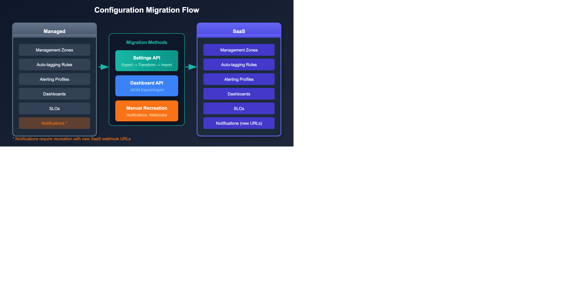

# Configuration Migration

> **Series:** M2S | **Notebook:** 5 of 8 | **Created:** January 2026 | **Last Updated:** 03/02/2026

Configuration migration is often the most time-consuming part of a Managed-to-SaaS migration. The **[SaaS Upgrade Assistant](https://docs.dynatrace.com/managed/upgrade/saas-upgrade-assistant/)** automates the bulk of this work, but a systematic approach ensures nothing is missed.

---

## Table of Contents

1. [Introduction](#introduction)
2. [SaaS Upgrade Assistant Workflow](#saas-upgrade-assistant-workflow)
3. [Configuration Categories](#configuration-categories)
4. [Settings API Migration](#settings-api-migration)
5. [Dashboard Migration](#dashboard-migration)
6. [Alerting Migration](#alerting-migration)
7. [Automation Migration](#automation-migration)
8. [Configuration Migration Checklist](#configuration-migration-checklist)

---

## Prerequisites

Before starting this notebook, you should have:

| Requirement | Description |
|-------------|-------------|
| Completed M2S-01 to M2S-04 | Architecture design complete |
| Source API Token | Managed token with `settings.read`, `dashboards.read` |
| Target API Token | SaaS token with `settings.write`, `dashboards.write` |
| Configuration inventory | List of items to migrate |

---

## Learning Objectives

By the end of this notebook, you will:

- Understand what configurations require migration
- Know how to use the Settings API for migration
- Be able to migrate dashboards between environments
- Migrate alerting and automation configurations

---

<a id="introduction"></a>
## 1. Introduction
### What Migrates vs. What's Recreated

| Category | Migration Method |
|----------|------------------|
| Settings (via API) | SaaS Upgrade Assistant or Settings API |
| Dashboards | SaaS Upgrade Assistant or JSON export/import |
| Management Zones | SaaS Upgrade Assistant, Settings API, or manual |
| Alerting profiles | SaaS Upgrade Assistant or manual recreation |
| Notifications | Recreate (new webhook URLs) |
| Automations/Workflows | Recreate in SaaS Automations app |

### Migration Tooling Options

Choose the right tool for your migration complexity:

| Tool | Best For | Description |
|------|----------|-------------|
| **[SaaS Upgrade Assistant](https://docs.dynatrace.com/managed/upgrade/saas-upgrade-assistant/)** | **Most migrations (recommended)** | Automated export/import with UI, selective import, progress tracking, bulk editing |
| **Monaco** | Configuration as Code | Version-controlled configuration management, ideal for standardized deployments |
| **Terraform** | Infrastructure as Code | Dynatrace Terraform provider for programmatic management |
| **Settings API** | Custom automation | Direct API calls for maximum flexibility |
| **Manual** | Non-portable items | Credentials Vault, Cloud Platform Integrations |

> **Warning:** Do not mix tooling approaches. Monaco YAML templates can conflict with the SaaS Upgrade Assistant. Choose one primary method for consistency.

---

<a id="saas-upgrade-assistant-workflow"></a>
## 2. SaaS Upgrade Assistant Workflow

The **[SaaS Upgrade Assistant](https://docs.dynatrace.com/managed/upgrade/saas-upgrade-assistant/)** is a Dynatrace app that automates the majority of configuration migration. It handles dashboards, settings, alert policies, custom metrics, request attributes, network zones, and Settings 2.0 objects.

### Prerequisites

| Requirement | Details |
|-------------|---------|
| **Managed version** | 1.294 or later |
| **Version alignment** | Same major version on Managed and SaaS recommended (e.g., both 1.294.x) |
| **IAM policy** | `upgrade-assistant:environments:write` assigned to migration users |
| **Token scopes** | `Read network zones`, `Write network zones`, `Capture request data` |

### Step-by-Step Workflow

#### Step 1: Export from Managed

1. Sign into the **Cluster Management Console** on your Managed cluster
2. Navigate to **Environments** and select the target environment
3. Select **Export Configuration** and confirm
4. The configuration archive is stored locally

#### Step 2: Upload to SaaS

1. Open the **SaaS Upgrade Assistant** app in your target SaaS tenant
2. Upload the exported configuration archive
3. The app validates the archive signature and processes all configurations

#### Step 3: Review Configurations

The app groups configurations by type with clear status indicators:

| Status | Meaning | Action |
|--------|---------|--------|
| **Ready** | Configuration can be deployed as-is | No action needed |
| **Failed** | Configuration has errors | Edit to fix, or exclude from deployment |
| **Deployed** | Already deployed to SaaS | No action needed |

- Failed configurations are highlighted with full error messages (JSON-formatted)
- Cyclic dependency detection helps resolve configuration conflicts

#### Step 4: Edit Failed Configurations

Two editing modes are available:

| Mode | Use Case |
|------|----------|
| **Single mode** | Fix individual configurations with the edit form |
| **Bulk mode** | Update hundreds of configurations at once (e.g., updating all dashboard owners) |

> **Tip:** Use **Preview Changes** to verify edits before deploying. The app retains original values for rollback reference.

#### Step 5: Selective Import (Waved Approach)

The Smart Selective Import lets you deploy in waves:

1. **Select configuration types** to include or exclude per deployment
2. **Smart dependency management** automatically adds or removes dependent configurations
3. **Deploy incrementally** — start with foundational configs (management zones, tags), then build up

**Recommended wave order:**

| Wave | Configuration Types |
|------|---------------------|
| 1 | Management zones, auto-tagging rules, host groups |
| 2 | Service detection, request attributes, deep monitoring settings |
| 3 | Alerting profiles, anomaly detection, SLOs |
| 4 | Dashboards, remaining configurations |

#### Step 6: Deploy and Track

1. Deploy selected configurations to SaaS
2. Monitor real-time progress via the upgrade status tracker
3. Download **deployment results** as CSV for auditing and validation
4. Review per-deployment and cumulative deployment summaries

### What the SaaS Upgrade Assistant Handles

| Configuration Type | Supported |
|--------------------|-----------|
| Dashboards (with owner migration) | ✅ |
| Settings 2.0 objects | ✅ |
| Alert policies | ✅ |
| Custom metrics | ✅ |
| Request attributes | ✅ |
| Network zones | ✅ |
| Web/mobile user action configs | ✅ |
| Notification templates | ✅ |

### What Still Requires Manual Migration

Even with the SaaS Upgrade Assistant, these items need manual handling:

| Item | Why |
|------|-----|
| Credentials Vault entries | Security isolation—cannot be exported |
| Cloud platform integration credentials | Must be re-entered in SaaS |
| Problem notification webhooks | Endpoint URLs change for SaaS |
| API tokens | Tenant-specific—generate new ones |
| Synthetic private locations | Infrastructure-specific deployment |

### Monaco for Migration (Alternative)

Monaco (Monitoring as Code) is an alternative when the SaaS Upgrade Assistant is not suitable (e.g., tenant consolidation with name conflicts):

```bash
# Download configurations from Managed
monaco download \
  --environments managed.yaml \
  --project managed-export

# Deploy to SaaS (with transformation)
monaco deploy \
  --environments saas.yaml \
  --project managed-export
```

### Terraform Provider (Alternative)

For organizations using Infrastructure as Code:

```hcl
# Example: Management Zone in Terraform
resource "dynatrace_management_zone_v2" "production" {
  name = "Production"
  
  rules {
    type    = "PROCESS_GROUP"
    enabled = true
    
    attribute_rule {
      entity_type = "PROCESS_GROUP"
      conditions {
        key       = "PROCESS_GROUP_TAGS"
        operator  = "TAG_KEY_EQUALS"
        string_value = "environment:production"
      }
    }
  }
}
```

---

<!-- MARKDOWN_TABLE_ALTERNATIVE
| Config Type | Migration Method |
|-------------|------------------|
| Management Zones | Settings API |
| Auto-tagging | Settings API |
| Dashboards | JSON Export |
| Alerting | Manual Recreation |
| Notifications | New Webhooks |
-->



---

<a id="configuration-categories"></a>
## 2. Configuration Categories
### 2.1 Portable vs Non-Portable Configurations

> **Understanding what can and cannot be automatically migrated is critical for planning.**

| Portable (API Migration) | Non-Portable (Manual Recreation) |
|-------------------------|----------------------------------|
| Management Zones | Credentials Vault entries |
| Auto-tagging Rules | Cloud Platform Integration credentials |
| Host Groups | Problem Notification webhooks |
| Alerting Profiles | Custom SSL certificates |
| SLOs | ActiveGate configurations |
| Dashboards | Extension configurations (some) |
| Request Attributes | API tokens (must create new) |
| Service Detection Rules | User sessions/permissions |

### 2.2 Core Platform Settings

| Setting | Schema ID | Migration Complexity |
|---------|-----------|---------------------|
| Management Zones | `builtin:management-zones` | Medium |
| Auto-tagging Rules | `builtin:tags.auto-tagging` | Low |
| Host Groups | `builtin:host-monitoring.host-group` | Low |
| Process Groups | `builtin:process-group.monitoring` | Low |
| Frequent Issue Detection | `builtin:anomaly-detection.frequent-issues` | Low |

### 2.3 Monitoring Settings

| Setting | Schema ID | Migration Complexity |
|---------|-----------|---------------------|
| Service Detection | `builtin:service-detection.full-web-request` | Medium |
| Request Attributes | `builtin:request-attribute` | Medium |
| Calculated Services | `builtin:calculated-service-metric` | High |
| Calculated Metrics | `builtin:host.monitoring.metric.customization` | Medium |
| OneAgent Features | `builtin:oneagent.features` | Low |
| Deep Monitoring | `builtin:deep-monitoring` | Low |

### 2.4 Alerting & Notifications

| Setting | Schema ID | Migration Complexity |
|---------|-----------|---------------------|
| Alerting Profiles | `builtin:alerting.profile` | Medium |
| Problem Notifications | N/A (webhooks) | **High - requires new URLs** |
| Maintenance Windows | `builtin:alerting.maintenance-window` | Low |
| SLOs | `builtin:monitoring.slo` | Medium |
| Metric Events | `builtin:anomaly-detection.metric-events` | Medium |

### 2.5 User Experience

| Setting | Schema ID | Migration Complexity |
|---------|-----------|---------------------|
| Web Applications | `builtin:rum.web.application` | Medium |
| Mobile Applications | `builtin:rum.mobile.application` | Medium |
| Session Replay | `builtin:session-replay` | Low |
| User Action Naming | `builtin:rum.web.user-action-custom-naming` | Medium |
| Key User Actions | `builtin:rum.web.key-user-actions` | Medium |

### 2.6 Non-Portable Configurations (Manual Effort Required)

> **⚠️ These items CANNOT be migrated via API and require manual recreation:**

| Configuration | Why Non-Portable | Action Required |
|--------------|------------------|-----------------|
| **Credentials Vault** | Security isolation | Re-enter all credentials in SaaS |
| **Cloud Platform Integrations** | Credential-dependent | Reconfigure AWS/Azure/GCP connections |
| **Problem Notifications** | Endpoint changes | Create new webhooks with SaaS URLs |
| **API Tokens** | Tenant-specific | Generate new tokens in SaaS |
| **SSL Certificates** | Tenant-specific | Upload certificates to SaaS |
| **Extensions 2.0** | Some require reconfiguration | Review each extension |
| **Synthetic Private Locations** | Infrastructure-specific | Deploy new Synthetic ActiveGates |

---

<a id="settings-api-migration"></a>
## 3. Settings API Migration
### 3.1 Export Settings from Managed

Use the Settings API to export configurations:

```bash
# Export Management Zones
curl -X GET "https://{managed-url}/e/{env-id}/api/v2/settings/objects?schemaIds=builtin:management-zones&pageSize=500" \
  -H "Authorization: Api-Token {token}" \
  -H "Content-Type: application/json" \
  > management-zones-export.json
```

### 3.2 Transform for SaaS

Before importing, you may need to:

1. **Remove object IDs** - Let SaaS generate new IDs
2. **Update entity references** - Managed entity IDs differ from SaaS
3. **Adjust scope** - Some scopes may differ

### 3.3 Import to SaaS

```bash
# Import Management Zones to SaaS
curl -X POST "https://{tenant}.live.dynatrace.com/api/v2/settings/objects" \
  -H "Authorization: Api-Token {saas-token}" \
  -H "Content-Type: application/json" \
  -d @management-zones-import.json
```

### 3.4 Common Schema IDs for Migration

| Purpose | Schema ID |
|---------|----------|
| Management Zones | `builtin:management-zones` |
| Auto-tagging | `builtin:tags.auto-tagging` |
| Alerting profiles | `builtin:alerting.profile` |
| Maintenance windows | `builtin:alerting.maintenance-window` |
| SLOs | `builtin:monitoring.slo` |
| Request attributes | `builtin:request-attribute` |

---

<a id="dashboard-migration"></a>
## 4. Dashboard Migration
### 4.1 Export Dashboards from Managed

```bash
# List all dashboards
curl -X GET "https://{managed-url}/e/{env-id}/api/config/v1/dashboards" \
  -H "Authorization: Api-Token {token}" \
  > dashboards-list.json

# Export specific dashboard
curl -X GET "https://{managed-url}/e/{env-id}/api/config/v1/dashboards/{dashboard-id}" \
  -H "Authorization: Api-Token {token}" \
  > dashboard-export.json
```

### 4.2 Dashboard Transformation

Before importing dashboards:

| Issue | Solution |
|-------|----------|
| Entity IDs hardcoded | Replace with entity selectors |
| Management Zone IDs | Update to SaaS MZ IDs |
| Dashboard ID | Remove (let SaaS generate) |
| Owner | Update to SaaS user |

### 4.3 Import to SaaS

```bash
# Import dashboard to SaaS
curl -X POST "https://{tenant}.live.dynatrace.com/api/config/v1/dashboards" \
  -H "Authorization: Api-Token {saas-token}" \
  -H "Content-Type: application/json" \
  -d @dashboard-import.json
```

### 4.4 Dashboard Validation Queries

After migration, verify dashboards are working:

```dql
// Verify data exists for dashboard queries
// Run sample queries from your dashboards to confirm data availability
fetch logs, from:-1h
| summarize count()
| fieldsAdd status = if(`count()` > 0, then: "Data available", else: "No data")
```

---

<a id="alerting-migration"></a>
## 5. Alerting Migration
### 5.1 Alerting Profiles

Alerting profiles can be exported via Settings API:

```bash
# Export alerting profiles
curl -X GET "https://{managed-url}/e/{env-id}/api/v2/settings/objects?schemaIds=builtin:alerting.profile" \
  -H "Authorization: Api-Token {token}" \
  > alerting-profiles.json
```

### 5.2 Problem Notifications

Problem notifications **must be recreated** because:

- Webhook URLs change (new SaaS endpoints)
- Integration IDs are different
- Some integrations have new configuration options

| Integration Type | Migration Action |
|------------------|------------------|
| Email | Recreate recipients |
| Slack | New webhook URL |
| Microsoft Teams | New webhook URL |
| PagerDuty | Update integration key |
| ServiceNow | New instance URL |
| Custom webhook | Update URL to new endpoint |

### 5.3 Anomaly Detection Settings

Export and import via Settings API:

| Schema | Purpose |
|--------|--------|
| `builtin:anomaly-detection.services` | Service anomaly detection |
| `builtin:anomaly-detection.infrastructure-hosts` | Host anomaly detection |
| `builtin:anomaly-detection.infrastructure-disks` | Disk anomaly detection |

---

<a id="automation-migration"></a>
## 6. Automation Migration
### 6.1 Workflows (Automations)

SaaS uses the Automations app for workflows. If migrating from Managed with custom automation:

| Managed Feature | SaaS Equivalent |
|-----------------|----------------|
| Problem notifications | Workflow triggers |
| Custom webhooks | HTTP Request action |
| Metric events | Event triggers |

### 6.2 Recreating Automations

1. Document existing automation logic from Managed
2. Create new workflow in SaaS Automations app
3. Configure triggers (problem, event, schedule)
4. Add actions (HTTP requests, scripts, etc.)
5. Test with synthetic events

### 6.3 API-Based Automations

If you have scripts calling Dynatrace APIs:

| Change Required | Details |
|-----------------|--------|
| Base URL | `{tenant}.live.dynatrace.com` |
| API Token | New SaaS token |
| Environment ID | Not needed for SaaS |
| API version | Verify endpoint compatibility |

---

<a id="configuration-migration-checklist"></a>
## Configuration Migration Checklist
### Portable Configurations (Settings API)

| Category | Schema ID | Status |
|----------|-----------|--------|
| Management Zones | `builtin:management-zones` | [ ] |
| Auto-tagging Rules | `builtin:tags.auto-tagging` | [ ] |
| Host Groups | `builtin:host-monitoring.host-group` | [ ] |
| Alerting Profiles | `builtin:alerting.profile` | [ ] |
| Maintenance Windows | `builtin:alerting.maintenance-window` | [ ] |
| SLOs | `builtin:monitoring.slo` | [ ] |
| Request Attributes | `builtin:request-attribute` | [ ] |
| Service Detection | `builtin:service-detection.full-web-request` | [ ] |
| Calculated Services | `builtin:calculated-service-metric` | [ ] |
| Anomaly Detection | `builtin:anomaly-detection.services` | [ ] |
| Web Applications | `builtin:rum.web.application` | [ ] |
| Mobile Applications | `builtin:rum.mobile.application` | [ ] |
| User Action Naming | `builtin:rum.web.user-action-custom-naming` | [ ] |
| Key User Actions | `builtin:rum.web.key-user-actions` | [ ] |
| Session Properties | `builtin:rum.web.session-properties` | [ ] |
| OneAgent Features | `builtin:oneagent.features` | [ ] |

### Dashboard Migration

| Item | Status |
|------|--------|
| Export all dashboards from Managed | [ ] |
| Transform entity references | [ ] |
| Remove hardcoded IDs | [ ] |
| Import to SaaS | [ ] |
| Validate dashboard data | [ ] |

### Non-Portable Configurations (Manual Recreation)

| Item | Action Required | Status |
|------|-----------------|--------|
| Credentials Vault | Re-enter all credentials | [ ] |
| Cloud Platform Integrations | Reconfigure with new credentials | [ ] |
| Problem Notifications | Create new webhooks with SaaS URLs | [ ] |
| API Tokens | Generate new tokens | [ ] |
| SSL Certificates | Upload to SaaS | [ ] |
| Extensions 2.0 | Review and reconfigure | [ ] |
| Synthetic Private Locations | Deploy new Synthetic ActiveGates | [ ] |
| Custom Services | Verify or recreate | [ ] |

### Automation Migration

| Item | Status |
|------|--------|
| Document existing automation logic | [ ] |
| Create workflows in Automations app | [ ] |
| Configure triggers | [ ] |
| Update API scripts with new URLs/tokens | [ ] |
| Test all automations | [ ] |

---

<a id="next-steps"></a>
## 8. Next Steps

### Immediate Actions

1. **Export configurations** - Use the [SaaS Upgrade Assistant](https://docs.dynatrace.com/managed/upgrade/saas-upgrade-assistant/) to export from Managed
2. **Upload and review** - Upload archive to SaaS and review configuration status
3. **Deploy in waves** - Use selective import to deploy foundational configs first
4. **Fix failed configs** - Use bulk or single edit mode for any failures
5. **Recreate notifications** - Set up integrations with new SaaS URLs
6. **Download deploy results** - CSV reports for auditing and validation

### Continue the Series

| Next Notebook | Focus |
|---------------|-------|
| **M2S-06: OneAgent & ActiveGate Migration** | Agent migration procedures |

### Configuration Resources

- [SaaS Upgrade Assistant Documentation](https://docs.dynatrace.com/managed/upgrade/saas-upgrade-assistant/)
- [SaaS Upgrade Assistant on Dynatrace Hub](https://www.dynatrace.com/hub/detail/saas-upgrade-assistant/)
- [Settings API Reference](https://docs.dynatrace.com/docs/dynatrace-api/environment-api/settings)
- [Dashboard API](https://docs.dynatrace.com/docs/dynatrace-api/configuration-api/dashboards-api)
- [Automations Documentation](https://docs.dynatrace.com/docs/platform-modules/automations)

---

## Summary

In this notebook, you learned:

- The SaaS Upgrade Assistant workflow for automated configuration migration
- Configuration categories and their migration methods
- How to use selective import for waved deployments
- How to handle failed configurations with bulk and single edit modes
- Dashboard migration and ownership transformation
- Why notifications must be recreated
- Automation migration considerations

> **Key Takeaway:** The [SaaS Upgrade Assistant](https://docs.dynatrace.com/managed/upgrade/saas-upgrade-assistant/) automates the majority of configuration migration—dashboards, settings, alert policies, and more. Use it as your primary tool, then handle non-portable items (credentials, webhooks) manually.

---

*Continue to **M2S-06: OneAgent & ActiveGate Migration** for agent migration procedures.*

---

<sub>*This notebook was AI-generated from community-submitted and publicly available sources. This notebook series is not officially supported by Dynatrace. Always verify information against official Dynatrace documentation.*</sub>
