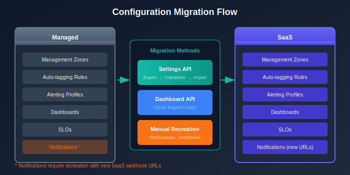

# Configuration Migration

> **Series:** M2S | **Notebook:** 5 of 8 | **Created:** January 2026 | **Last Updated:** 01/30/2026

Configuration migration is often the most time-consuming part of a Managed-to-SaaS migration. A systematic approach ensures nothing is missed.

---

## Table of Contents

1. [Introduction](#introduction)
2. [Configuration Categories](#configuration-categories)
3. [Settings API Migration](#settings-api-migration)
4. [Dashboard Migration](#dashboard-migration)
5. [Alerting Migration](#alerting-migration)
6. [Automation Migration](#automation-migration)
7. [Configuration Migration Checklist](#configuration-migration-checklist)

---

## Prerequisites

Before starting this notebook, you should have:

| Requirement | Description |
|-------------|-------------|
| Completed M2S-01 to M2S-04 | Architecture design complete |
| Source API Token | Managed token with `settings.read`, `dashboards.read` |
| Target API Token | SaaS token with `settings.write`, `dashboards.write` |
| Configuration inventory | List of items to migrate |

---

## Learning Objectives

By the end of this notebook, you will:

- Understand what configurations require migration
- Know how to use the Settings API for migration
- Be able to migrate dashboards between environments
- Migrate alerting and automation configurations

---

<a id="introduction"></a>
## 1. Introduction
### What Migrates vs. What's Recreated

| Category | Migration Method |
|----------|------------------|
| Settings (via API) | Export/Import via Settings API |
| Dashboards | Export JSON, Import to SaaS |
| Management Zones | Settings API or manual |
| Alerting profiles | Manual recreation (endpoint changes) |
| Notifications | Recreate (new webhook URLs) |
| Automations/Workflows | Recreate in SaaS Automations app |

### Migration Tooling Options

Choose the right tool for your migration complexity:

| Tool | Best For | Description |
|------|----------|-------------|
| **Monaco** | Configuration as Code | Version-controlled configuration management, ideal for standardized deployments |
| **Dynatrace Migration Assistant** | Guided migration | Built-in tooling for common migration scenarios |
| **Terraform** | Infrastructure as Code | Dynatrace Terraform provider for programmatic management |
| **Settings API** | Custom automation | Direct API calls for maximum flexibility |
| **Manual** | Non-portable items | Credentials Vault, Cloud Platform Integrations |

### Monaco for Migration

Monaco (Monitoring as Code) is particularly effective for configuration migration:

```bash
# Download configurations from Managed
monaco download \
  --environments managed.yaml \
  --project managed-export

# Deploy to SaaS (with transformation)
monaco deploy \
  --environments saas.yaml \
  --project managed-export
```

**Advantages of Monaco:**
- Version-controlled configuration history
- Handles dependencies between configurations
- Supports bulk export/import
- Enables configuration validation before deployment

### Terraform Provider

For organizations using Infrastructure as Code:

```hcl
# Example: Management Zone in Terraform
resource "dynatrace_management_zone_v2" "production" {
  name = "Production"
  
  rules {
    type    = "PROCESS_GROUP"
    enabled = true
    
    attribute_rule {
      entity_type = "PROCESS_GROUP"
      conditions {
        key       = "PROCESS_GROUP_TAGS"
        operator  = "TAG_KEY_EQUALS"
        string_value = "environment:production"
      }
    }
  }
}
```

---

<!-- MARKDOWN_TABLE_ALTERNATIVE
| Config Type | Migration Method |
|-------------|------------------|
| Management Zones | Settings API |
| Auto-tagging | Settings API |
| Dashboards | JSON Export |
| Alerting | Manual Recreation |
| Notifications | New Webhooks |
-->



---

<a id="configuration-categories"></a>
## 2. Configuration Categories
### 2.1 Portable vs Non-Portable Configurations

> **Understanding what can and cannot be automatically migrated is critical for planning.**

| Portable (API Migration) | Non-Portable (Manual Recreation) |
|-------------------------|----------------------------------|
| Management Zones | Credentials Vault entries |
| Auto-tagging Rules | Cloud Platform Integration credentials |
| Host Groups | Problem Notification webhooks |
| Alerting Profiles | Custom SSL certificates |
| SLOs | ActiveGate configurations |
| Dashboards | Extension configurations (some) |
| Request Attributes | API tokens (must create new) |
| Service Detection Rules | User sessions/permissions |

### 2.2 Core Platform Settings

| Setting | Schema ID | Migration Complexity |
|---------|-----------|---------------------|
| Management Zones | `builtin:management-zones` | Medium |
| Auto-tagging Rules | `builtin:tags.auto-tagging` | Low |
| Host Groups | `builtin:host-monitoring.host-group` | Low |
| Process Groups | `builtin:process-group.monitoring` | Low |
| Frequent Issue Detection | `builtin:anomaly-detection.frequent-issues` | Low |

### 2.3 Monitoring Settings

| Setting | Schema ID | Migration Complexity |
|---------|-----------|---------------------|
| Service Detection | `builtin:service-detection.full-web-request` | Medium |
| Request Attributes | `builtin:request-attribute` | Medium |
| Calculated Services | `builtin:calculated-service-metric` | High |
| Calculated Metrics | `builtin:host.monitoring.metric.customization` | Medium |
| OneAgent Features | `builtin:oneagent.features` | Low |
| Deep Monitoring | `builtin:deep-monitoring` | Low |

### 2.4 Alerting & Notifications

| Setting | Schema ID | Migration Complexity |
|---------|-----------|---------------------|
| Alerting Profiles | `builtin:alerting.profile` | Medium |
| Problem Notifications | N/A (webhooks) | **High - requires new URLs** |
| Maintenance Windows | `builtin:alerting.maintenance-window` | Low |
| SLOs | `builtin:monitoring.slo` | Medium |
| Metric Events | `builtin:anomaly-detection.metric-events` | Medium |

### 2.5 User Experience

| Setting | Schema ID | Migration Complexity |
|---------|-----------|---------------------|
| Web Applications | `builtin:rum.web.application` | Medium |
| Mobile Applications | `builtin:rum.mobile.application` | Medium |
| Session Replay | `builtin:session-replay` | Low |
| User Action Naming | `builtin:rum.web.user-action-custom-naming` | Medium |
| Key User Actions | `builtin:rum.web.key-user-actions` | Medium |

### 2.6 Non-Portable Configurations (Manual Effort Required)

> **⚠️ These items CANNOT be migrated via API and require manual recreation:**

| Configuration | Why Non-Portable | Action Required |
|--------------|------------------|-----------------|
| **Credentials Vault** | Security isolation | Re-enter all credentials in SaaS |
| **Cloud Platform Integrations** | Credential-dependent | Reconfigure AWS/Azure/GCP connections |
| **Problem Notifications** | Endpoint changes | Create new webhooks with SaaS URLs |
| **API Tokens** | Tenant-specific | Generate new tokens in SaaS |
| **SSL Certificates** | Tenant-specific | Upload certificates to SaaS |
| **Extensions 2.0** | Some require reconfiguration | Review each extension |
| **Synthetic Private Locations** | Infrastructure-specific | Deploy new Synthetic ActiveGates |

---

<a id="settings-api-migration"></a>
## 3. Settings API Migration
### 3.1 Export Settings from Managed

Use the Settings API to export configurations:

```bash
# Export Management Zones
curl -X GET "https://{managed-url}/e/{env-id}/api/v2/settings/objects?schemaIds=builtin:management-zones&pageSize=500" \
  -H "Authorization: Api-Token {token}" \
  -H "Content-Type: application/json" \
  > management-zones-export.json
```

### 3.2 Transform for SaaS

Before importing, you may need to:

1. **Remove object IDs** - Let SaaS generate new IDs
2. **Update entity references** - Managed entity IDs differ from SaaS
3. **Adjust scope** - Some scopes may differ

### 3.3 Import to SaaS

```bash
# Import Management Zones to SaaS
curl -X POST "https://{tenant}.live.dynatrace.com/api/v2/settings/objects" \
  -H "Authorization: Api-Token {saas-token}" \
  -H "Content-Type: application/json" \
  -d @management-zones-import.json
```

### 3.4 Common Schema IDs for Migration

| Purpose | Schema ID |
|---------|----------|
| Management Zones | `builtin:management-zones` |
| Auto-tagging | `builtin:tags.auto-tagging` |
| Alerting profiles | `builtin:alerting.profile` |
| Maintenance windows | `builtin:alerting.maintenance-window` |
| SLOs | `builtin:monitoring.slo` |
| Request attributes | `builtin:request-attribute` |

---

<a id="dashboard-migration"></a>
## 4. Dashboard Migration
### 4.1 Export Dashboards from Managed

```bash
# List all dashboards
curl -X GET "https://{managed-url}/e/{env-id}/api/config/v1/dashboards" \
  -H "Authorization: Api-Token {token}" \
  > dashboards-list.json

# Export specific dashboard
curl -X GET "https://{managed-url}/e/{env-id}/api/config/v1/dashboards/{dashboard-id}" \
  -H "Authorization: Api-Token {token}" \
  > dashboard-export.json
```

### 4.2 Dashboard Transformation

Before importing dashboards:

| Issue | Solution |
|-------|----------|
| Entity IDs hardcoded | Replace with entity selectors |
| Management Zone IDs | Update to SaaS MZ IDs |
| Dashboard ID | Remove (let SaaS generate) |
| Owner | Update to SaaS user |

### 4.3 Import to SaaS

```bash
# Import dashboard to SaaS
curl -X POST "https://{tenant}.live.dynatrace.com/api/config/v1/dashboards" \
  -H "Authorization: Api-Token {saas-token}" \
  -H "Content-Type: application/json" \
  -d @dashboard-import.json
```

### 4.4 Dashboard Validation Queries

After migration, verify dashboards are working:

```dql
// Verify data exists for dashboard queries
// Run sample queries from your dashboards to confirm data availability
fetch logs
| summarize count()
| fieldsAdd status = if(`count()` > 0, then: "Data available", else: "No data")
```

---

<a id="alerting-migration"></a>
## 5. Alerting Migration
### 5.1 Alerting Profiles

Alerting profiles can be exported via Settings API:

```bash
# Export alerting profiles
curl -X GET "https://{managed-url}/e/{env-id}/api/v2/settings/objects?schemaIds=builtin:alerting.profile" \
  -H "Authorization: Api-Token {token}" \
  > alerting-profiles.json
```

### 5.2 Problem Notifications

Problem notifications **must be recreated** because:

- Webhook URLs change (new SaaS endpoints)
- Integration IDs are different
- Some integrations have new configuration options

| Integration Type | Migration Action |
|------------------|------------------|
| Email | Recreate recipients |
| Slack | New webhook URL |
| Microsoft Teams | New webhook URL |
| PagerDuty | Update integration key |
| ServiceNow | New instance URL |
| Custom webhook | Update URL to new endpoint |

### 5.3 Anomaly Detection Settings

Export and import via Settings API:

| Schema | Purpose |
|--------|--------|
| `builtin:anomaly-detection.services` | Service anomaly detection |
| `builtin:anomaly-detection.infrastructure-hosts` | Host anomaly detection |
| `builtin:anomaly-detection.infrastructure-disks` | Disk anomaly detection |

---

<a id="automation-migration"></a>
## 6. Automation Migration
### 6.1 Workflows (Automations)

SaaS uses the Automations app for workflows. If migrating from Managed with custom automation:

| Managed Feature | SaaS Equivalent |
|-----------------|----------------|
| Problem notifications | Workflow triggers |
| Custom webhooks | HTTP Request action |
| Metric events | Event triggers |

### 6.2 Recreating Automations

1. Document existing automation logic from Managed
2. Create new workflow in SaaS Automations app
3. Configure triggers (problem, event, schedule)
4. Add actions (HTTP requests, scripts, etc.)
5. Test with synthetic events

### 6.3 API-Based Automations

If you have scripts calling Dynatrace APIs:

| Change Required | Details |
|-----------------|--------|
| Base URL | `{tenant}.live.dynatrace.com` |
| API Token | New SaaS token |
| Environment ID | Not needed for SaaS |
| API version | Verify endpoint compatibility |

---

<a id="configuration-migration-checklist"></a>
## Configuration Migration Checklist
### Portable Configurations (Settings API)

| Category | Schema ID | Status |
|----------|-----------|--------|
| Management Zones | `builtin:management-zones` | [ ] |
| Auto-tagging Rules | `builtin:tags.auto-tagging` | [ ] |
| Host Groups | `builtin:host-monitoring.host-group` | [ ] |
| Alerting Profiles | `builtin:alerting.profile` | [ ] |
| Maintenance Windows | `builtin:alerting.maintenance-window` | [ ] |
| SLOs | `builtin:monitoring.slo` | [ ] |
| Request Attributes | `builtin:request-attribute` | [ ] |
| Service Detection | `builtin:service-detection.full-web-request` | [ ] |
| Calculated Services | `builtin:calculated-service-metric` | [ ] |
| Anomaly Detection | `builtin:anomaly-detection.services` | [ ] |
| Web Applications | `builtin:rum.web.application` | [ ] |
| Mobile Applications | `builtin:rum.mobile.application` | [ ] |
| User Action Naming | `builtin:rum.web.user-action-custom-naming` | [ ] |
| Key User Actions | `builtin:rum.web.key-user-actions` | [ ] |
| Session Properties | `builtin:rum.web.session-properties` | [ ] |
| OneAgent Features | `builtin:oneagent.features` | [ ] |

### Dashboard Migration

| Item | Status |
|------|--------|
| Export all dashboards from Managed | [ ] |
| Transform entity references | [ ] |
| Remove hardcoded IDs | [ ] |
| Import to SaaS | [ ] |
| Validate dashboard data | [ ] |

### Non-Portable Configurations (Manual Recreation)

| Item | Action Required | Status |
|------|-----------------|--------|
| Credentials Vault | Re-enter all credentials | [ ] |
| Cloud Platform Integrations | Reconfigure with new credentials | [ ] |
| Problem Notifications | Create new webhooks with SaaS URLs | [ ] |
| API Tokens | Generate new tokens | [ ] |
| SSL Certificates | Upload to SaaS | [ ] |
| Extensions 2.0 | Review and reconfigure | [ ] |
| Synthetic Private Locations | Deploy new Synthetic ActiveGates | [ ] |
| Custom Services | Verify or recreate | [ ] |

### Automation Migration

| Item | Status |
|------|--------|
| Document existing automation logic | [ ] |
| Create workflows in Automations app | [ ] |
| Configure triggers | [ ] |
| Update API scripts with new URLs/tokens | [ ] |
| Test all automations | [ ] |

---

<a id="next-steps"></a>
## 7. Next Steps

### Immediate Actions

1. **Export all settings** - Use Settings API to export each schema
2. **Transform configurations** - Update entity references and IDs
3. **Import to SaaS** - Apply configurations to target
4. **Recreate notifications** - Set up integrations with new URLs
5. **Validate** - Confirm all settings are working

### Continue the Series

| Next Notebook | Focus |
|---------------|-------|
| **M2S-06: OneAgent & ActiveGate Migration** | Agent migration procedures |

### Configuration Resources

- [Settings API Reference](https://docs.dynatrace.com/docs/dynatrace-api/environment-api/settings)
- [Dashboard API](https://docs.dynatrace.com/docs/dynatrace-api/configuration-api/dashboards-api)
- [Automations Documentation](https://docs.dynatrace.com/docs/platform-modules/automations)

---

## Summary

In this notebook, you learned:

- Configuration categories and their migration methods
- How to use the Settings API for export/import
- Dashboard migration and transformation requirements
- Why notifications must be recreated
- Automation migration considerations

> **Key Takeaway:** Not all configurations can be directly migrated. Settings API handles most items, but notifications and automations require recreation due to endpoint changes.

---

*Continue to **M2S-06: OneAgent & ActiveGate Migration** for agent migration procedures.*

---

<sub>*This notebook was AI-generated from community-submitted and publicly available sources. This notebook series is not officially supported by Dynatrace. Always verify information against official Dynatrace documentation.*</sub>
