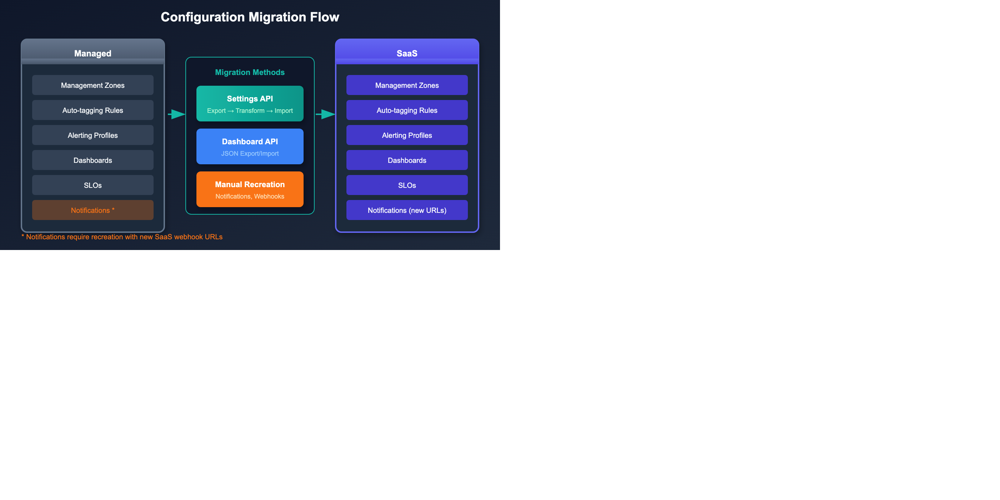
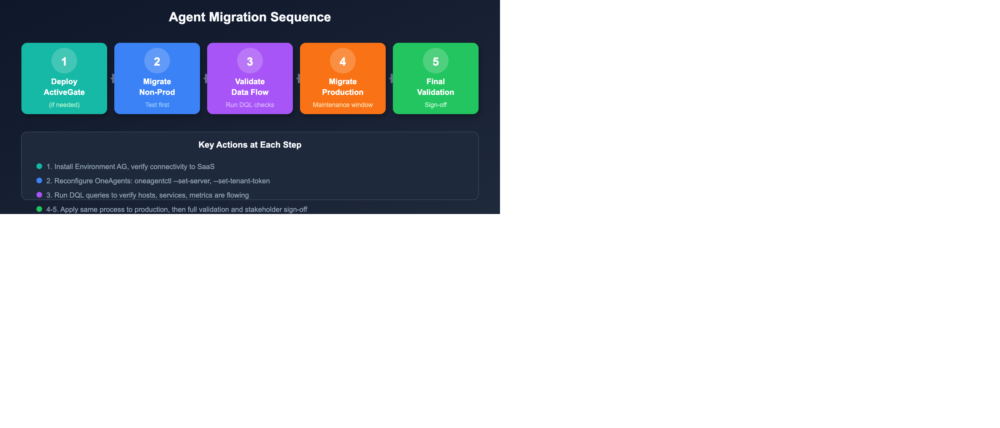

# M2S-05: Step 5 — Execute: Migrate Configuration and Agents

> **Series:** M2S | **Notebook:** 5 of 9 | **Phase:** Upgrade | **Step:** Execute | **Created:** March 2026 | **Last Updated:** 03/30/2026

With your SaaS environment prepared, it is time to execute the migration. This step covers deploying configurations via the SaaS Upgrade Assistant in dependency-ordered waves, redirecting OneAgents from Managed to SaaS, and validating data flow after each wave. By the end of this step, all hosts and services will be reporting to your SaaS tenant.

> **M2S Migration Journey — 3 Phases / 9 Steps**
>
> **Plan:** 1. Discover | 2. Strategize | 3. Design
>
> **Upgrade:** 4. Prepare | **5. Execute** | 6. Integrate
>
> **Run:** 7. Expand | 8. Enable | 9. Optimize

---

## Table of Contents

1. [Configuration Migration Strategy](#configuration-migration-strategy)
2. [Configuration Wave Deployment](#configuration-wave-deployment)
3. [Manual Configuration Items](#manual-configuration-items)
4. [OneAgent Migration](#oneagent-migration)
5. [Migration Wave Execution](#migration-wave-execution)
6. [SaaS Upgrade Assistant Deploy Results](#saas-upgrade-assistant-deploy-results)
7. [Step Completion Checklist](#step-completion-checklist)

---

## Prerequisites

| Requirement | Details |
|-------------|----------|
| **Steps 1-4 Complete** | Discovery, strategy, design, and preparation all finished |
| **SaaS Tenant** | Provisioned with Grail enabled and SaaS Upgrade Assistant installed |
| **ActiveGates Deployed** | SaaS-connected ActiveGates operational in all network zones (Step 4) |
| **Network Connectivity** | Firewall rules in place for OneAgent-to-SaaS or OneAgent-to-ActiveGate communication |
| **Configuration Archive** | Exported from Managed Cluster Management Console |
| **API Tokens** | SaaS tokens with `settings.write`, `entities.read`, `logs.read`, `metrics.read` scopes |
| **Change Windows** | Approved change windows for non-production and production waves |

> **Order of Operations — You Are Here**
>
> This notebook covers operations **4-6** of the 11-step Order of Operations (see **M2S-02: Step 2 — Strategize**) defined in Step 2:
>
> | # | Operation | Status |
> |---|-----------|--------|
> | 1 | Assess — Inventory current environment | Step 4: Prepare ✅ |
> | 2 | Provision — SaaS tenant and access (SSO) | Step 4: Prepare ✅ |
> | 3 | Install — New ActiveGates in parallel | Step 4: Prepare ✅ |
> | **4** | **Migrate — Configuration and integrations** | **This notebook** |
> | **5** | **Rebuild — Dashboards, zones, alerts** | **This notebook** |
> | **6** | **Redirect — OneAgents to SaaS** | **This notebook** |
> | 7 | Reconnect — Integrations and extensions | Step 6: Integrate |
> | 8 | Migrate — Remaining config and integrations | Step 6: Integrate |
> | 9 | Validate — Data flow and performance | Step 9: Optimize |
> | 10 | Cutover — Full switch to SaaS | Step 9: Optimize |
> | 11 | Decommission — Managed environment | Step 9: Optimize |



<!-- MARKDOWN_TABLE_ALTERNATIVE
| Phase | Action | Tool |
|-------|--------|------|
| Export | Download configuration archive | Managed CMC |
| Upload | Import archive to SaaS | SaaS Upgrade Assistant |
| Review | Inspect and fix incompatible items | SaaS Upgrade Assistant |
| Deploy | Push configurations in waves | SaaS Upgrade Assistant |
| Validate | Verify deployment results | Deploy result CSV |
For environments where SVG doesn't render
-->

<a id="configuration-migration-strategy"></a>

## 1. Configuration Migration Strategy

Configurations must be migrated **before** redirecting OneAgents. When agents start reporting to SaaS, they need to find the correct service detection rules, tagging rules, and monitoring settings already in place. Without this, you lose visibility during the transition.

### Migration Order Principle

```
Configurations FIRST → OneAgents SECOND → Validation AFTER EACH
```

### SaaS Upgrade Assistant Workflow

1. **Export** — Download the configuration archive from Managed Cluster Management Console
2. **Upload** — Import the archive into the SaaS Upgrade Assistant on your target tenant
3. **Review** — The assistant groups configurations by type and flags incompatible items
4. **Edit** — Fix failed or incompatible configurations individually or in bulk
5. **Deploy** — Use Smart Selective Import to push configurations in dependency-ordered waves
6. **Track** — Download the deploy result CSV after each wave

### Smart Selective Import

The SaaS Upgrade Assistant supports **Smart Selective Import**, which allows you to deploy configurations incrementally rather than all at once. This is critical for a controlled migration:

| Feature | Benefit |
|---------|----------|
| **Dependency awareness** | Automatically identifies prerequisite configurations |
| **Incremental deployment** | Deploy one configuration type at a time |
| **Preview before deploy** | Review every change before it takes effect |
| **Conflict detection** | Flags configurations that already exist in SaaS |
| **Rollback visibility** | CSV reports show exactly what was deployed |

> **Important:** Always preview changes before deploying. The SaaS Upgrade Assistant shows a diff of what will be created or modified in your SaaS environment.

<a id="configuration-wave-deployment"></a>

## 2. Configuration Wave Deployment

Deploy configurations in four waves, ordered by dependency. Each wave builds on the previous one.

### Wave Deployment Order

| Wave | Configurations | Rationale |
|------|---------------|------------|
| **Wave 1** | Management zones, auto-tagging rules, host groups | Foundation — everything else depends on these for scoping and targeting |
| **Wave 2** | Service detection rules, request attributes, deep monitoring settings | Instrumentation — must be in place before agents report so services are detected correctly |
| **Wave 3** | Alerting profiles, anomaly detection, SLOs, maintenance windows | Monitoring — needs entities present to validate thresholds and baselines |
| **Wave 4** | Dashboards, calculated metrics, remaining configurations | Visualization — needs data flowing to populate charts and tiles |

### Wave 1: Foundation

Deploy first because all other configurations reference management zones and tags:

| Configuration Type | Why First |
|--------------------|----------|
| Management zones | Scope alerting, dashboards, and access |
| Auto-tagging rules | Tag entities as they appear — must be ready before agents report |
| Host groups | Group hosts for configuration targeting |

### Wave 2: Instrumentation

Deploy before OneAgents migrate so services are detected with the correct naming and grouping:

| Configuration Type | Why Second |
|--------------------|----------|
| Service detection rules | Custom service naming and merging must match Managed behavior |
| Request attributes | Capture rules for request metadata used in filtering and analysis |
| Deep monitoring settings | Code-level visibility settings (exception rules, method sensors) |
| Data privacy settings | Masking rules must be active before data flows |

### Wave 3: Monitoring

Deploy after at least some entities exist in SaaS so the system can validate references:

| Configuration Type | Why Third |
|--------------------|----------|
| Alerting profiles | Filter and route alerts to the correct channels |
| Anomaly detection | Custom thresholds and sensitivity settings |
| SLOs | Service Level Objectives referencing services and management zones |
| Maintenance windows | Prevent false alerts during migration activity |

### Wave 4: Visualization

Deploy last because dashboards and calculated metrics need data to be meaningful:

| Configuration Type | Why Last |
|--------------------|----------|
| Classic dashboards | Need entities and data to populate tiles |
| Calculated metrics | Derive from incoming data — no value without data flow |
| Remaining configurations | Application detection, RUM settings, etc. |

> **After each wave:** Download the deploy result CSV, review failures, fix or document exclusions with justification, then proceed to the next wave.

### Entity-Level Configuration Timing

> **Important:** Some entity-level configurations can ONLY be migrated AFTER OneAgents are redirected, because they depend on entities that do not yet exist in the SaaS tenant. Examples: custom settings associated with a specific host or service entity.

| Config Type | When to Migrate | Why |
|------------|----------------|-----|
| **Environment-level** (management zones, tags, alerting) | BEFORE OneAgent redirect | Independent of entities |
| **Service detection, request attributes** | BEFORE OneAgent redirect | Must be in place when services appear |
| **Entity-level custom settings** | AFTER OneAgent redirect | Entity must exist in SaaS first |
| **Deep monitoring, container rules** | BEFORE OneAgent redirect | Needed for correct instrumentation |

Also note:
- **Process restarts are needed for full-stack mode** — for services to appear in the new SaaS tenant
- **Process restarts are also needed for infra-only mode** — for Application Security vulnerability detection and JMX metrics
- **Minimize delta** with recent configuration changes — this is why the configuration freeze (Step 4) is critical

<a id="manual-configuration-items"></a>

## 3. Manual Configuration Items

The SaaS Upgrade Assistant handles most configurations, but some items require manual recreation due to security constraints or architectural differences.

### Items Requiring Manual Recreation

| Item | Action | Priority |
|------|--------|----------|
| **Credentials Vault** | Re-enter all credentials in SaaS Credentials Vault — secrets cannot be exported | Before Wave 3 (integrations need credentials) |
| **API tokens** | Generate new tokens with minimal required scopes | Before OneAgent migration |
| **Webhook endpoints** | Create new notification integrations with SaaS-appropriate URLs | Before Wave 3 (alerting needs endpoints) |
| **Synthetic private locations** | Deploy new Synthetic ActiveGates in SaaS, recreate locations | After ActiveGate deployment |
| **Network zones** | Already created in Step 4 (Prepare) — verify they match Managed topology | Verify before OneAgent migration |
| **Custom extensions (1.0)** | Rebuild as Extensions 2.0 — EF1 is deprecated | Plan separately (may be post-migration) |
| **Plugin-based integrations** | Migrate to Extensions 2.0 or ActiveGate extensions | Plan separately |

### Credentials Vault Checklist

For each credential in Managed, recreate in SaaS:

| Credential Type | Examples | Notes |
|----------------|----------|-------|
| **Username/password** | Database monitoring, SNMP | Must be re-entered manually |
| **Token/key** | Third-party integration API keys | Generate new keys if possible |
| **Certificate** | mTLS, client certificates | Upload new certificates |

### API Token Strategy

Create purpose-specific tokens in SaaS with minimal scopes:

| Token Purpose | Required Scopes |
|---------------|----------------|
| OneAgent installation | `InstallerDownload` |
| Configuration API | `settings.read`, `settings.write` |
| Entity queries | `entities.read` |
| Metrics/logs queries | `metrics.read`, `logs.read` |
| Automation | `automation.read`, `automation.write` |

> **Important:** Never reuse Managed API tokens. Generate fresh tokens in SaaS with the principle of least privilege.



<!-- MARKDOWN_TABLE_ALTERNATIVE
| Step | Action | Result |
|------|--------|--------|
| 1 | Set new server endpoint | OneAgent targets SaaS/ActiveGate |
| 2 | Set new tenant token | Authentication to SaaS tenant |
| 3 | Set network zone | Route through correct ActiveGate |
| 4 | Restart OneAgent | Agent connects to new endpoint |
| 5 | Restart application processes | Full instrumentation (traces, services) |
For environments where SVG doesn't render
-->

<a id="oneagent-migration"></a>

## 4. OneAgent Migration

Once configurations are deployed, redirect OneAgents from Managed to SaaS. There are three migration methods — choose based on your requirements.

### Migration Methods

| Method | Command | Use When |
|--------|---------|----------|
| **Reconfigure (preferred)** | `oneagentctl --set-server` + `--set-tenant-token` + restart | Standard migration — preserves host identity, minimal downtime |
| **Parallel install** | Install SaaS agent alongside Managed | Zero-gap requirements — both agents report simultaneously during transition |
| **Reinstall** | Uninstall Managed agent, install SaaS agent | Clean start needed — resets all agent state |

### Reconfigure Method (Recommended)

The reconfigure method is preferred because it preserves host identity and requires only a brief restart:

```bash
# 1. Set new server endpoint
oneagentctl --set-server="https://{tenant-id}.live.dynatrace.com:443/communication"

# 2. Set new tenant token (from SaaS: Settings > Deployment > Installer download)
oneagentctl --set-tenant-token="{tenant-token}"

# 3. Set network zone (if applicable — must match zones created in Step 4)
oneagentctl --set-network-zone=<zone-name>

# 4. Restart OneAgent
# Linux:
systemctl restart oneagent
# Windows:
Restart-Service -Name "Dynatrace OneAgent"
```

### If Using ActiveGate Routing

When OneAgents connect through ActiveGates rather than directly to SaaS:

```bash
# Point to ActiveGate instead of SaaS directly
oneagentctl --set-server="https://{activegate-host}:9999/communication"
oneagentctl --set-tenant-token="{tenant-token}"
oneagentctl --set-network-zone=<zone-name>
systemctl restart oneagent
```

### Critical: Restart Application Processes

> **Warning:** Application processes **MUST** be restarted after OneAgent migration. Without a restart, you get host-level metrics but **NO distributed tracing**, **NO service detection**, and **NO code-level visibility**.

| What Works Without Restart | What Requires Restart |
|---------------------------|----------------------|
| Host CPU, memory, disk metrics | Distributed tracing (PurePaths) |
| Network metrics | Service detection and naming |
| Process-level metrics | Code-level exception analysis |
| Log monitoring | Request attributes capture |
| | Method-level hotspots |

Plan application restarts as part of your migration wave — coordinate with application teams for scheduled restart windows.

### Parallel Install Method

For environments requiring zero monitoring gaps:

1. Install the SaaS OneAgent alongside the existing Managed agent
2. Validate data flows to SaaS for the configured period
3. Uninstall the Managed agent once SaaS is confirmed
4. Restart application processes

> **Note:** Running two agents simultaneously doubles the CPU and memory overhead on the host. Use this method only when monitoring continuity is a hard requirement.

<a id="migration-wave-execution"></a>

## 5. Migration Wave Execution

Execute the OneAgent migration in waves, starting with non-production and progressing to production.

### Wave Execution Order

| Wave | Environment | Hosts | Purpose |
|------|-------------|-------|----------|
| **Wave A** | Development/Test | 5-10 hosts | Validate process, identify issues |
| **Wave B** | Non-production (all) | All non-prod | Confirm at scale, validate services |
| **Wave C** | Production (pilot) | 10-20% of prod | Validate production behavior |
| **Wave D** | Production (full) | Remaining prod | Complete migration |

### Per-Wave Procedure

For each wave, follow this sequence:

1. **Pre-check** — Verify SaaS ActiveGates are healthy and configurations are deployed
2. **Reconfigure agents** — Run `oneagentctl` commands (manually or via automation)
3. **Restart OneAgent** — Restart the agent service on each host
4. **Verify host check-in** — Confirm hosts appear in SaaS within 5 minutes
5. **Restart applications** — Coordinate with application teams for process restarts
6. **Validate data flow** — Run the DQL queries below to confirm metrics, traces, and logs
7. **Document results** — Record successes, failures, and lessons learned
8. **Apply lessons** — Adjust procedures for subsequent waves

### Automation for Bulk Migration

For large environments, use automation tools to execute the reconfigure commands across many hosts:

```bash
# Ansible example — reconfigure OneAgent on all hosts in a group
ansible-playbook -i inventory/nonprod migrate_oneagent.yml \
  --extra-vars "tenant_url=https://{tenant-id}.live.dynatrace.com:443/communication \
                tenant_token={token} \
                network_zone=datacenter-east"
```

### Post-Wave Validation

After each wave, run the following DQL queries against your SaaS tenant to verify data flow.

### Verify Hosts Reporting to SaaS

```dql
// Count hosts reporting to SaaS — compare against expected count from migration wave
fetch dt.entity.host
| summarize hostCount = count()
```

### Check for Metric Data Gaps

```dql
// Verify CPU metrics are flowing — hosts with data in the last hour
timeseries avgCpu = avg(dt.host.cpu.usage), from:-1h, by:{dt.entity.host}
| fieldsAdd hasData = arrayAvg(avgCpu)
| filter isNotNull(hasData)
| summarize hostsWithData = count()
```

### Verify Services Discovered

```dql
// Count discovered services — should grow as applications restart
fetch dt.entity.service
| summarize serviceCount = count()
```

### Check Distributed Traces Flowing

```dql
// Verify spans are arriving — traces require application process restart
fetch spans, from:-1h
| summarize spanCount = count(), by:{time_bucket = bin(timestamp, 5m)}
| sort time_bucket desc
| limit 12
```

### Verify Log Ingestion

```dql
// Confirm log data is flowing from migrated hosts
fetch logs, from:-1h
| summarize logCount = count(), by:{time_bucket = bin(timestamp, 5m)}
| sort time_bucket desc
| limit 12
```

### Compare Expected vs Actual Host Count

After each wave, compare the expected host count (from your migration plan) against actual hosts reporting:

```dql
// Hosts grouped by OS type — verify all expected host types are present
fetch dt.entity.host
| summarize hostCount = count(), by:{osType}
| sort hostCount desc
```

> **Tip:** If span counts are zero but host metrics are flowing, application processes have not been restarted yet. Coordinate restarts before declaring the wave complete.

<a id="saas-upgrade-assistant-deploy-results"></a>

## 6. SaaS Upgrade Assistant Deploy Results

After each configuration wave deployment, download and review the deploy result CSV from the SaaS Upgrade Assistant.

### Result Categories

| Status | Meaning | Action |
|--------|---------|--------|
| **Deployed** | Configuration successfully created or updated in SaaS | No action needed |
| **Skipped** | Configuration already exists in SaaS (no overwrite) | Verify existing config is correct |
| **Failed** | Configuration could not be deployed (incompatible or error) | Fix and retry, or document exclusion |
| **Excluded** | Manually excluded from deployment | Document justification |

### Handling Failed Configurations

For each failed configuration:

1. **Identify the failure reason** — The CSV includes error details
2. **Determine if fixable** — Can the configuration be edited in the SaaS Upgrade Assistant?
3. **Fix and retry** — Edit the configuration and redeploy
4. **Or exclude with justification** — If the configuration is no longer needed or will be rebuilt differently in SaaS

### Common Failure Reasons

| Failure | Cause | Resolution |
|---------|-------|------------|
| Entity reference not found | Entity ID changed between Managed and SaaS | Update entity reference or let it auto-resolve after agents report |
| Unsupported configuration type | Legacy feature not available in SaaS | Rebuild using SaaS-native equivalent |
| Duplicate name conflict | Configuration with same name already exists | Rename or merge with existing |
| Permission denied | Missing IAM policy | Add `upgrade-assistant:environments:write` policy |

### Archiving Deploy Results

Archive all deploy result CSVs for compliance and audit purposes:

```
deploy-results/
  wave-1-foundation-YYYY-MM-DD.csv
  wave-2-instrumentation-YYYY-MM-DD.csv
  wave-3-monitoring-YYYY-MM-DD.csv
  wave-4-visualization-YYYY-MM-DD.csv
```

> **Best Practice:** Store deploy result CSVs in your migration project repository alongside your migration runbook. This creates an auditable record of every configuration change.

<a id="step-completion-checklist"></a>

## 7. Step Completion Checklist

Before proceeding to Step 6, confirm that you have completed each item:

| Checkpoint | Status |
|-----------|--------|
| Wave 1 deployed: management zones, auto-tagging rules, host groups | [ ] |
| Wave 2 deployed: service detection, request attributes, deep monitoring | [ ] |
| Wave 3 deployed: alerting profiles, anomaly detection, SLOs | [ ] |
| Wave 4 deployed: dashboards, calculated metrics, remaining configs | [ ] |
| Manual items recreated (credentials vault, API tokens, webhook endpoints) | [ ] |
| All deploy result CSVs downloaded and archived | [ ] |
| Non-production OneAgents migrated and validated | [ ] |
| Production OneAgents migrated and validated | [ ] |
| Application processes restarted (all waves) | [ ] |
| Data flow confirmed: host metrics flowing | [ ] |
| Data flow confirmed: distributed traces flowing | [ ] |
| Data flow confirmed: log ingestion active | [ ] |

## Next Step

> **M2S-06: Step 6 — Integrate** — Reconnect all integrations and extensions. Migrate notification channels, rebuild Extensions 2.0, configure cloud integrations, and validate end-to-end alerting workflows.

### Additional Resources

- [SaaS Upgrade Assistant Documentation](https://docs.dynatrace.com/managed/upgrade/saas-upgrade-assistant/)
- [OneAgent Configuration via Command Line](https://docs.dynatrace.com/docs/setup-and-configuration/dynatrace-oneagent/oneagent-configuration/oneagent-command-line-interface)
- [Network Zones Configuration](https://docs.dynatrace.com/docs/setup-and-configuration/dynatrace-activegate/network-zones)
- [Extensions 2.0 Framework](https://docs.dynatrace.com/docs/extend-dynatrace/extensions20)

---

## Summary

In Step 5, you:

- Deployed configurations to SaaS in four dependency-ordered waves using the SaaS Upgrade Assistant
- Recreated manual configuration items (credentials vault, API tokens, webhook endpoints)
- Migrated OneAgents from Managed to SaaS using the reconfigure method
- Restarted application processes for full distributed tracing and service detection
- Validated data flow (metrics, traces, logs) after each migration wave
- Archived all deploy result CSVs for compliance

> **Key Takeaway:** Migrate configurations before agents, validate after every wave, and always restart application processes. Without application restarts, you see host metrics but lose distributed tracing and service detection.

---

<sub>*This notebook was AI-generated from community-submitted and publicly available sources. This notebook series is not officially supported by Dynatrace. Always verify information against official Dynatrace documentation.*</sub>
