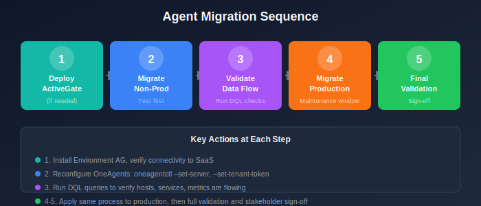

# OneAgent and ActiveGate Migration

> **Series:** M2S | **Notebook:** 6 of 8 | **Created:** January 2026 | **Last Updated:** 01/30/2026

Agent migration is the core technical step. OneAgents must be reconfigured to communicate with SaaS instead of Managed.

---

## Table of Contents

1. [Introduction](#introduction)
2. [ActiveGate Migration](#activegate-migration)
3. [OneAgent Migration Strategies](#oneagent-migration-strategies)
4. [Migration Execution](#migration-execution)
5. [Validation](#validation)
6. [Troubleshooting](#troubleshooting)

---

## Prerequisites

Before starting this notebook, you should have:

| Requirement | Description |
|-------------|-------------|
| Completed M2S-01 to M2S-05 | Configurations migrated |
| SaaS tenant ready | Tenant provisioned and accessible |
| Network connectivity | Hosts can reach SaaS or ActiveGate |
| Deployment tokens | SaaS installer tokens created |
| Maintenance window | Scheduled for migration |

---

## Learning Objectives

By the end of this notebook, you will:

- Deploy Environment ActiveGates for SaaS
- Understand OneAgent migration strategies
- Execute OneAgent reconfiguration
- Validate successful agent migration

---

<a id="introduction"></a>
## 1. Introduction
### Migration Options

| Option | Method | Best For |
|--------|--------|----------|
| **Reconfigure** | Update existing OneAgent config | Most environments |
| **Reinstall** | Fresh OneAgent installation | Major version upgrade |
| **Parallel** | Install new, remove old | Zero-downtime requirement |

### Migration Sequence

1. Deploy Environment ActiveGate (if needed)
2. Migrate non-production hosts first
3. Validate data flow
4. Migrate production hosts
5. Final validation

---

<!-- MARKDOWN_TABLE_ALTERNATIVE
| Step | Action |
|------|--------|
| 1 | Deploy ActiveGate |
| 2 | Migrate Non-Prod |
| 3 | Validate |
| 4 | Migrate Prod |
| 5 | Final Validation |
-->



---

<a id="activegate-migration"></a>
## 2. ActiveGate Migration
### 2.1 When ActiveGate is Required

| Scenario | ActiveGate Needed |
|----------|-------------------|
| Hosts can reach SaaS directly | No (optional) |
| Hosts behind firewall | Yes, for routing |
| Extensions 2.0 required | Yes |
| Private synthetic monitoring | Yes |
| VMware/cloud platform monitoring | Yes |

### 2.2 Deploy Environment ActiveGate

**Step 1: Download Installer**

From Dynatrace SaaS UI:
1. Go to **Deploy Dynatrace → ActiveGate**
2. Select **Linux** or **Windows**
3. Copy the installer URL and token

**Step 2: Linux Installation**

```bash
# Download installer
wget -O Dynatrace-ActiveGate-Linux.sh "https://{tenant}.live.dynatrace.com/api/v1/deployment/installer/gateway/unix/latest?Api-Token={token}&arch=x86&flavor=default"

# Run installer
sudo /bin/sh Dynatrace-ActiveGate-Linux.sh
```

**Step 3: Windows Installation**

```powershell
# Download installer
Invoke-WebRequest -Uri "https://{tenant}.live.dynatrace.com/api/v1/deployment/installer/gateway/windows/latest?Api-Token={token}" -OutFile Dynatrace-ActiveGate.exe

# Run installer
.\Dynatrace-ActiveGate.exe
```

### 2.3 Verify ActiveGate Connection

```dql
// ActiveGate validation - use the Entities API v2 or Settings API
// Note: ActiveGates are not directly queryable via DQL fetch
// Use: GET /api/v2/entities?entitySelector=type("ENVIRONMENT_ACTIVE_GATE")
// Or check the ActiveGates page in the Dynatrace UI
```

---

<a id="oneagent-migration-strategies"></a>
## 3. OneAgent Migration Strategies
### 3.1 Strategy 1: Reconfigure (Recommended)

Update the existing OneAgent to point to SaaS.

**Pros:**
- No reinstallation required
- Minimal disruption
- Configuration preserved

**Cons:**
- Requires restart of OneAgent service
- Brief monitoring gap during restart

### 3.2 Strategy 2: Reinstall

Uninstall Managed OneAgent, install SaaS OneAgent.

**Pros:**
- Clean installation
- Opportunity to upgrade version

**Cons:**
- Longer monitoring gap
- More complex process

### 3.3 Strategy 3: Parallel Installation

Install SaaS OneAgent alongside Managed (temporarily).

**Pros:**
- Zero monitoring gap
- Easy rollback

**Cons:**
- Resource overhead during parallel period
- More complex coordination

### 3.4 Strategy Selection Matrix

| Requirement | Recommended Strategy |
|-------------|---------------------|
| Minimal downtime | Reconfigure |
| Major version upgrade | Reinstall |
| Zero monitoring gap | Parallel |
| Risk-averse organization | Parallel |
| Limited change windows | Reconfigure |

---

<a id="migration-execution"></a>
## 4. Migration Execution
### 4.1 Reconfigure OneAgent (Linux)

**Option A: Using oneagentctl**

```bash
# Get current configuration
sudo /opt/dynatrace/oneagent/agent/tools/oneagentctl --get-server

# Set new SaaS server
sudo /opt/dynatrace/oneagent/agent/tools/oneagentctl --set-server="https://{tenant}.live.dynatrace.com:443/communication"

# Set tenant token (get from SaaS UI)
sudo /opt/dynatrace/oneagent/agent/tools/oneagentctl --set-tenant-token="{tenant-token}"

# Restart OneAgent
sudo systemctl restart oneagent
```

**Option B: Using Configuration File**

```bash
# Edit configuration
sudo vi /var/lib/dynatrace/oneagent/agent/config/hostcustomproperties.conf

# Add/update:
# Server=https://{tenant}.live.dynatrace.com:443/communication
# TenantToken={tenant-token}

# Restart
sudo systemctl restart oneagent
```

### 4.2 Reconfigure OneAgent (Windows)

```powershell
# Get current configuration
& "C:\Program Files\dynatrace\oneagent\agent\tools\oneagentctl.exe" --get-server

# Set new SaaS server
& "C:\Program Files\dynatrace\oneagent\agent\tools\oneagentctl.exe" --set-server="https://{tenant}.live.dynatrace.com:443/communication"

# Set tenant token
& "C:\Program Files\dynatrace\oneagent\agent\tools\oneagentctl.exe" --set-tenant-token="{tenant-token}"

# Restart service
Restart-Service Dynatrace*
```

### 4.3 Via ActiveGate Routing

If using ActiveGate for routing:

```bash
# Set ActiveGate as communication endpoint
sudo /opt/dynatrace/oneagent/agent/tools/oneagentctl --set-server="https://{activegate-ip}:9999/communication"

# Set tenant token
sudo /opt/dynatrace/oneagent/agent/tools/oneagentctl --set-tenant-token="{tenant-token}"

# Restart
sudo systemctl restart oneagent
```

### 4.4 Critical: Application Process Restarts

> **🚨 IMPORTANT:** After migrating OneAgent, application processes need to be restarted for full monitoring capabilities.

**When Restarts Are Required:**

| OneAgent Mode | Restart Required? | What Happens Without Restart |
|---------------|-------------------|------------------------------|
| **Full-stack monitoring** | ✅ **Yes** | Services won't appear; no distributed tracing |
| **Infrastructure-only** | ✅ **Yes** (for some features) | Application Security vulnerability detection and JMX metrics won't work |

**Full-Stack Monitoring (Process Restarts Required):**

| Technology | Why Restart Required |
|------------|---------------------|
| Java | Code modules inject at JVM startup |
| .NET | Profiler attaches at process start |
| Node.js | Instrumentation loads at startup |
| PHP | Zend extension loads at Apache/PHP-FPM start |
| Go | Instrumentation compiles at build time |

**What happens without restart:**
- Host-level metrics will flow (CPU, memory, disk)
- **Application-level monitoring will NOT work**
- No distributed tracing
- No code-level visibility
- No service detection for existing processes

**Infrastructure-Only Mode (Restarts Recommended):**

Even in infrastructure-only mode, restarts enable:
- Application Security vulnerability detection
- JMX metrics collection
- Some process-level insights

**Recommended Approach:**

1. Migrate OneAgent during maintenance window
2. Perform rolling restart of application services
3. Or schedule next regular deployment to restart processes

```bash
# Example: Restart Java application
sudo systemctl restart myapp.service

# Example: Restart Apache/PHP
sudo systemctl restart apache2

# Example: Restart Node.js application
pm2 restart all
```

### 4.5 Bulk Migration with Automation

For large environments, use configuration management:

**Ansible Example:**

```yaml
- name: Reconfigure OneAgent for SaaS
  hosts: all_monitored_hosts
  become: yes
  tasks:
    - name: Set SaaS server
      command: /opt/dynatrace/oneagent/agent/tools/oneagentctl --set-server="https://{{ saas_tenant }}.live.dynatrace.com:443/communication"
    
    - name: Set tenant token
      command: /opt/dynatrace/oneagent/agent/tools/oneagentctl --set-tenant-token="{{ tenant_token }}"
    
    - name: Restart OneAgent
      systemd:
        name: oneagent
        state: restarted
    
    - name: Restart application services (for full-stack monitoring)
      systemd:
        name: "{{ item }}"
        state: restarted
      loop: "{{ application_services }}"
      when: restart_apps | default(false)
```

### 4.6 OneAgent Re-homing Considerations

When using the `oneagentctl` reconfigure approach:

| Preserved | Not Preserved |
|-----------|---------------|
| Host ID | N/A (stays same) |
| Process group IDs | N/A (regenerated based on detection) |
| Service IDs | N/A (regenerated based on detection) |
| Custom metadata | ✅ Preserved |
| Environment tags | ✅ Preserved |
| Host group assignment | ✅ Preserved |
| Network zone assignment | Must reconfigure if changed |

> **Tip:** Using oneagentctl to reconfigure (rather than reinstall) preserves host identity and custom metadata.

---

<a id="validation"></a>
## 5. Validation
### 5.1 Immediate Validation

After migrating hosts, verify they appear in SaaS:

```dql
// Count hosts reporting to SaaS
fetch dt.entity.host
| summarize totalHosts = count()
```

```dql
// List hosts reporting to SaaS
fetch dt.entity.host
| fieldsAdd hostName = entity.name
| fields hostName, id
| sort hostName desc
| limit 20
```

### 5.1.1 OneAgent Version Check

> **Note:** OneAgent version is not available as a DQL field. Use the Dynatrace UI: Navigate to **Manage → Deployment status → OneAgent** to view version distribution.

### 5.2 Data Flow Validation

Verify metrics are flowing:

```dql
// Check for recent CPU metrics
timeseries avg(dt.host.cpu.usage), from:-1h, by:{dt.entity.host}
| limit 10
```

```dql
// Verify logs are flowing
fetch logs, from:-1h
| summarize logCount = count(), by:{time_bucket = bin(timestamp, 5m)}
| sort time_bucket desc
| limit 12
```

### 5.3 Service Discovery Validation

```dql
// Check active services discovered after migration
fetch dt.entity.service
| fieldsAdd serviceName = entity.name
| summarize activeServices = count()
```

### 5.4 Migration Completion Checklist

| Validation | Query/Method | Status |
|------------|--------------|--------|
| All hosts reporting | Entity count matches expected | [ ] |
| CPU metrics flowing | Timeseries query returns data | [ ] |
| Memory metrics flowing | Timeseries query returns data | [ ] |
| Logs ingesting | Log count > 0 | [ ] |
| Services discovered | Service count matches expected | [ ] |
| No OneAgent errors | Check OneAgent logs | [ ] |

---

<a id="troubleshooting"></a>
## Troubleshooting
### Common Issues

| Issue | Symptom | Solution |
|-------|---------|----------|
| Connection refused | Host offline in SaaS | Check firewall rules |
| Invalid token | OneAgent errors in log | Regenerate tenant token |
| DNS resolution | Can't reach endpoint | Verify DNS settings |
| Certificate errors | SSL/TLS failures | Check proxy configuration |
| ActiveGate not found | Routing failures | Verify AG is running |

### OneAgent Log Locations

| Platform | Log Path |
|----------|----------|
| Linux | `/var/log/dynatrace/oneagent/` |
| Windows | `C:\ProgramData\dynatrace\oneagent\log\` |

### Rollback Procedure

If migration fails, revert to Managed:

```bash
# Revert to Managed server
sudo /opt/dynatrace/oneagent/agent/tools/oneagentctl --set-server="https://{managed-cluster}/communication"
sudo /opt/dynatrace/oneagent/agent/tools/oneagentctl --set-tenant-token="{managed-token}"
sudo systemctl restart oneagent
```

---

<a id="next-steps"></a>
## 6. Next Steps

### Immediate Actions

1. **Deploy ActiveGate** - If required for your architecture
2. **Migrate test hosts** - Start with non-production
3. **Validate thoroughly** - Run all validation queries
4. **Migrate production** - After successful test
5. **Document issues** - Track any problems encountered

### Continue the Series

| Next Notebook | Focus |
|---------------|-------|
| **M2S-07: Security & Privacy** | Security considerations for SaaS |

### Agent Resources

- [OneAgent Documentation](https://docs.dynatrace.com/docs/setup-and-configuration/dynatrace-oneagent)
- [ActiveGate Documentation](https://docs.dynatrace.com/docs/setup-and-configuration/dynatrace-activegate)
- [OneAgentCtl Reference](https://docs.dynatrace.com/docs/setup-and-configuration/dynatrace-oneagent/oneagent-configuration/oneagentctl)

---

## Summary

In this notebook, you learned:

- How to deploy Environment ActiveGates for SaaS
- OneAgent migration strategies and when to use each
- Step-by-step reconfiguration procedures
- Validation queries to confirm successful migration
- Troubleshooting common migration issues

> **Key Takeaway:** The reconfigure strategy is simplest for most migrations. Use oneagentctl to update the server endpoint and tenant token, then restart the service.

---

*Continue to **M2S-07: Security & Privacy** for security considerations in SaaS.*

---

<sub>*This notebook was AI-generated from community-submitted and publicly available sources. This notebook series is not officially supported by Dynatrace. Always verify information against official Dynatrace documentation.*</sub>
