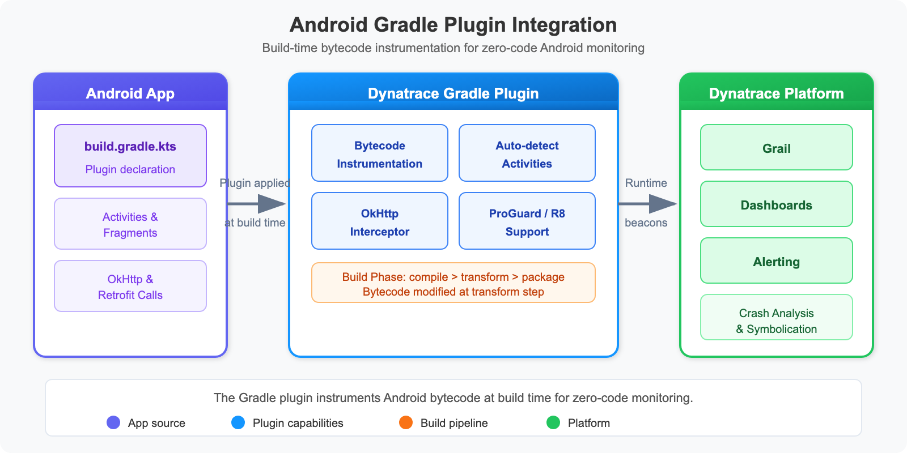

# MOBL-03: Android SDK Setup (Kotlin & Jetpack Compose)

> **Series:** MOBL — Mobile Monitoring | **Notebook:** 3 of 12 | **Created:** February 2026 | **Last Updated:** 06/23/2026

## Overview

This notebook walks through setting up Dynatrace Mobile RUM (Real User Monitoring) for Android applications using the Gradle plugin. It covers both traditional View-based architectures and modern Jetpack Compose UIs, including auto-instrumentation, manual action tracking, and data verification via DQL.

---

## Table of Contents

1. [Creating a Mobile App in Dynatrace](#creating-mobile-app)
2. [Gradle Plugin Setup](#gradle-plugin)
3. [build.gradle Configuration](#build-gradle-config)
4. [Auto-Instrumentation (Activities & Fragments)](#auto-instrumentation)
5. [Jetpack Compose Integration](#jetpack-compose)
6. [ProGuard & R8 Configuration](#proguard-r8)
7. [Verifying Data in Dynatrace](#verifying-data)

---

## Prerequisites

| Requirement | Details |
|-------------|----------|
| **Dynatrace Environment** | SaaS or Managed with Mobile RUM enabled |
| **Android Studio** | Arctic Fox (2020.3.1) or later |
| **Minimum SDK** | `minSdk 21` (Android 5.0 Lollipop) or higher |
| **Kotlin** | 1.8+ recommended |
| **Permissions** | Dynatrace admin access to create mobile applications |
| **Prior Knowledge** | MOBL-01 and MOBL-02 recommended |

<a id="creating-mobile-app"></a>
## 1. Creating a Mobile App in Dynatrace

Before instrumenting your Android project, you need to register the application in Dynatrace to obtain the **Application ID** and **Beacon URL**.

### Steps

1. Navigate to **Settings > Mobile & custom applications > Mobile applications** in your Dynatrace environment.
2. Click **Create mobile application**.
3. Enter a meaningful name (e.g., `My Android App - Production`).
4. Select **Android** as the platform.
5. After creation, open the application settings and note:

| Property | Description | Example |
|----------|-------------|----------|
| **Application ID** | Unique identifier for your mobile app in Dynatrace | `abcd1234-5678-efgh-ijkl-mnopqrstuvwx` |
| **Beacon URL** | Endpoint where the agent sends monitoring data | `https://{your-env-id}.bf.dynatrace.com/mbeacon` |

> **Tip:** Keep the Application ID and Beacon URL in a secure location. You will paste them into your `build.gradle.kts` in a later step.

### Optional Configuration

While in the Dynatrace UI, review these settings:

| Setting | Recommendation |
|---------|----------------|
| **Crash reporting** | Enable (captures unhandled exceptions) |
| **User action naming** | Configure meaningful rules for key screens |
| **Session replay** | Enable if you need visual session data (increases data volume) |
| **Data privacy** | Configure according to your organization's requirements |

<a id="gradle-plugin"></a>
## 2. Gradle Plugin Setup

The Dynatrace Android Gradle plugin handles bytecode instrumentation at build time. It automatically instruments Activity and Fragment lifecycle events, network requests, and UI interactions without requiring code changes.



<!-- MARKDOWN_TABLE_ALTERNATIVE
**Dynatrace Android Gradle Plugin Build Flow:**
| Step | Component | Description |
|------|-----------|-------------|
| 1 | App Source Code | Your Kotlin/Java source files |
| 2 | Gradle Build | Compilation and resource processing |
| 3 | Dynatrace Plugin | Bytecode instrumentation at build time |
| 4 | Instrumented APK/AAB | Final build artifact with monitoring |
| 5 | Runtime Agent | Sends beacons to Dynatrace cluster |
For environments where SVG doesn't render
-->

### Plugin Management (settings.gradle.kts)

Add the Dynatrace plugin repository to your `settings.gradle.kts`:

```kotlin
// settings.gradle.kts (Plugin Management)
pluginManagement {
    repositories {
        gradlePluginPortal()
        google()
        mavenCentral()
    }
}
```

### Project-Level build.gradle.kts

Declare the Dynatrace instrumentation plugin in your project-level build file:

```kotlin
// build.gradle.kts (project-level)
plugins {
    id("com.dynatrace.instrumentation") version "8.x.x" apply false
}
```

> **Important:** Replace `8.x.x` with the latest stable version from the [Dynatrace Android instrumentation release notes](https://docs.dynatrace.com/docs/setup-and-configuration/setup-on-mobile-platforms/android-monitoring). Always pin to a specific version to ensure reproducible builds.

<a id="build-gradle-config"></a>
## 3. build.gradle Configuration

Apply the plugin and configure the Dynatrace block in your app-level `build.gradle.kts`:

```kotlin
// build.gradle.kts (app-level)
plugins {
    id("com.android.application")
    id("org.jetbrains.kotlin.android")
    id("com.dynatrace.instrumentation")
}

dynatrace {
    defaultConfig {
        applicationId("YOUR_APP_ID")
        beaconUrl("YOUR_BEACON_URL")
        crashReporting(true)
        userOptIn(false)
    }
}
```

### Configuration Properties

| Property | Type | Default | Description |
|----------|------|---------|-------------|
| `applicationId` | String | *required* | App ID from Dynatrace mobile app settings |
| `beaconUrl` | String | *required* | Beacon endpoint URL |
| `crashReporting` | Boolean | `true` | Enable automatic crash reporting |
| `userOptIn` | Boolean | `false` | If `true`, monitoring starts only after explicit opt-in |
| `autoStart` | Boolean | `true` | Automatically start monitoring on app launch |
| `hybridMonitoring` | Boolean | `false` | Enable for apps with embedded WebViews |

### Build Variant Overrides

You can configure different settings per build variant (e.g., use a separate app ID for staging):

```kotlin
dynatrace {
    defaultConfig {
        applicationId("PROD_APP_ID")
        beaconUrl("PROD_BEACON_URL")
        crashReporting(true)
    }
    variants {
        register("debug") {
            applicationId("DEV_APP_ID")
            beaconUrl("DEV_BEACON_URL")
        }
    }
}
```

> **Warning:** Never commit real Application IDs or Beacon URLs to public repositories. Use environment variables or a `local.properties` file excluded from version control.

<a id="auto-instrumentation"></a>
## 4. Auto-Instrumentation (Activities & Fragments)

The Dynatrace Gradle plugin automatically instruments the following interactions at build time -- no code changes required:

### Automatically Detected

| Category | What Is Captured | Notes |
|----------|------------------|-------|
| **Activity lifecycle** | `onCreate`, `onResume`, `onPause`, `onDestroy` | Load actions generated per Activity |
| **Fragment lifecycle** | Fragment attach, detach, view creation | Visible as child actions |
| **Button clicks** | `View.OnClickListener` events | Captured with view ID and text |
| **RecyclerView taps** | Item click events in lists | Requires standard click listeners |
| **OkHttp requests** | HTTP/HTTPS calls via OkHttp 3.x / 4.x | Headers injected for distributed tracing |
| **HttpURLConnection** | Standard Java HTTP calls | Auto-correlated to user actions |
| **WebView actions** | Page loads and JS interactions | Requires `hybridMonitoring(true)` |

### How It Works

1. **Build time:** The Gradle plugin applies bytecode instrumentation to compiled classes.
2. **Runtime:** The Dynatrace agent initializes automatically on `Application.onCreate()`.
3. **User actions:** Each Activity load or tap generates a user action with child events (network calls, errors).
4. **Beacons:** Collected data is sent to the Dynatrace cluster via the beacon URL.

> **Note:** Auto-instrumentation works with traditional `View`-based layouts (XML + Activities/Fragments). For Jetpack Compose, manual action tracking is needed for interactions beyond lifecycle events. See the next section.

<a id="jetpack-compose"></a>
## 5. Jetpack Compose Integration

Jetpack Compose does not use the traditional `View.OnClickListener` pattern, so the Dynatrace auto-instrumentation cannot automatically detect button taps and navigation events within Compose trees. You need to use the **Dynatrace Android SDK API** to create manual user actions.

### Manual Action Tracking

Use `Dynatrace.enterAction()` and `action.leaveAction()` to wrap user interactions:

```kotlin
import com.dynatrace.android.agent.Dynatrace

@Composable
fun ProductListScreen() {
    LazyColumn {
        items(products) { product ->
            ProductCard(
                product = product,
                onClick = {
                    // Manual action for Compose interactions
                    val action = Dynatrace.enterAction("Tap on ${product.name}")
                    navigateToDetail(product.id)
                    action.leaveAction()
                }
            )
        }
    }
}
```

### Key Patterns for Compose

| Pattern | Example | When to Use |
|---------|---------|-------------|
| **Button tap** | `enterAction("Tap Add to Cart")` | Any `onClick` handler |
| **Navigation** | `enterAction("Navigate to Settings")` | Screen transitions |
| **Form submit** | `enterAction("Submit Order")` | Form submission events |
| **Pull-to-refresh** | `enterAction("Refresh Product List")` | Refresh gestures |
| **Tab selection** | `enterAction("Select Tab: Profile")` | Bottom nav / tab bar |

### Nested Actions with Network Calls

If an action triggers a network request, the Dynatrace agent automatically correlates the HTTP call as a child of the open action:

```kotlin
@Composable
fun CheckoutButton(cartId: String) {
    Button(onClick = {
        val action = Dynatrace.enterAction("Tap Checkout")
        viewModel.submitOrder(cartId) // OkHttp call auto-linked
        action.leaveAction()
    }) {
        Text("Checkout")
    }
}
```

### Coroutine-Safe Pattern

When using Kotlin coroutines, ensure `leaveAction()` is called after the async work completes:

```kotlin
fun onSearchClicked(query: String) {
    val action = Dynatrace.enterAction("Search: $query")
    viewModelScope.launch {
        try {
            val results = repository.search(query)
            _state.value = SearchState.Success(results)
        } catch (e: Exception) {
            action.reportError("Search failed", e)
            _state.value = SearchState.Error(e.message)
        } finally {
            action.leaveAction()
        }
    }
}
```

> **Tip:** Always call `leaveAction()` in a `finally` block to avoid orphaned actions that can skew session data.

<a id="proguard-r8"></a>
## 6. ProGuard & R8 Configuration

If your release builds use ProGuard or R8 (the default in Android Gradle Plugin 3.4+), you must add keep rules for the Dynatrace SDK to prevent critical classes from being obfuscated or removed.

### ProGuard / R8 Rules

Add the following to your `proguard-rules.pro` file:

```
# ProGuard rules for Dynatrace
-keep class com.dynatrace.** { *; }
-dontwarn com.dynatrace.**
```

### What These Rules Do

| Rule | Purpose |
|------|----------|
| `-keep class com.dynatrace.** { *; }` | Preserves all Dynatrace SDK classes and their members from obfuscation and shrinking |
| `-dontwarn com.dynatrace.**` | Suppresses warnings from the Dynatrace SDK during the R8/ProGuard step |

> **Note:** The Dynatrace Gradle plugin typically adds consumer ProGuard rules automatically. These manual rules serve as a safety net. Verify by checking your merged ProGuard configuration in `build/outputs/mapping/`.

### Symbol Upload for Crash Deobfuscation

To get readable stack traces in Dynatrace crash reports, the Gradle plugin automatically uploads the `mapping.txt` file during release builds. Verify this is working by checking the Dynatrace mobile app settings under **Symbol files**.

<a id="verifying-data"></a>
## 7. Verifying Data in Dynatrace

After building and running your instrumented Android app, use the following DQL queries to verify that monitoring data is arriving in Dynatrace.

```dql
// Find Android mobile applications
fetch dt.entity.mobile_application
| filter contains(toString(entity.name), "Android") or contains(toString(tags), "Android")
| fields entity.name, id, tags
| sort entity.name asc

```

The query above searches for mobile application entities with "Android" in their name or tags. If your app appears in the results, the Dynatrace environment is aware of it.

Next, check whether the app is sending user action data:

```dql
// Check recent Android user actions
fetch bizevents, from:-1h
| filter event.provider == "www.dynatrace.com/mobile"
| filter contains(toString(os.type), "Android")
| summarize action_count = count(), by:{useraction.name, useraction.type}
| sort action_count desc
| limit 20
```

This query shows the most frequent user actions reported from Android devices in the last hour. Look for:

- **Load actions** from Activity/Fragment lifecycle (auto-instrumented)
- **Tap actions** from button clicks or Compose `enterAction()` calls
- **Custom actions** from your manual instrumentation

Finally, verify the full range of event types being captured:

```dql
// Android app event type inventory
fetch bizevents, from:-1h
| filter event.provider == "www.dynatrace.com/mobile"
| filter contains(toString(os.type), "Android")
| summarize event_count = count(), by:{event.type}
| sort event_count desc
```

### Expected Event Types

| Event Type | Indicates |
|------------|----------|
| `com.dynatrace.mobile.useraction` | User action (load, tap, custom) |
| `com.dynatrace.mobile.webrequest` | HTTP request captured by auto-instrumentation |
| `com.dynatrace.mobile.crash` | Unhandled exception / crash report |
| `com.dynatrace.mobile.error` | Reported error (via `action.reportError()`) |

### Troubleshooting Checklist

If no data appears:

| Check | Action |
|-------|--------|
| **Application ID** | Verify it matches the Dynatrace mobile app configuration |
| **Beacon URL** | Confirm the URL is reachable from the device/emulator |
| **Network access** | Ensure the device has internet connectivity |
| **Plugin applied** | Verify `com.dynatrace.instrumentation` appears in Gradle sync output |
| **Build variant** | Confirm the correct variant config (debug vs. release) is active |
| **userOptIn** | If set to `true`, ensure `Dynatrace.startSession()` is called explicitly |

---

## Summary

In this notebook, you learned:

- How to create and configure a mobile application in the Dynatrace UI
- How to set up the Dynatrace Android Gradle plugin in `settings.gradle.kts` and `build.gradle.kts`
- The full range of auto-instrumented interactions (Activities, Fragments, clicks, HTTP requests)
- How to add manual user action tracking for Jetpack Compose interactions
- ProGuard / R8 keep rules for the Dynatrace SDK
- How to verify Android monitoring data using DQL queries

---

## Next Steps

| Next Notebook | Topic |
|---------------|-------|
| **MOBL-04** | iOS SDK Setup (Swift & SwiftUI) |
| **MOBL-05** | Custom User Actions & Session Properties |

---

## References

- [Dynatrace Android Instrumentation](https://docs.dynatrace.com/docs/setup-and-configuration/setup-on-mobile-platforms/android-monitoring)
- [Dynatrace Mobile RUM Overview](https://docs.dynatrace.com/docs/observe/digital-experience/mobile-applications)
- [Dynatrace Android Agent API](https://docs.dynatrace.com/docs/setup-and-configuration/setup-on-mobile-platforms/android-monitoring/android-manual-instrumentation)

---

<sub>*This notebook was AI-generated from community-submitted and publicly available sources. This notebook series is not officially supported by Dynatrace. Always verify information against official Dynatrace documentation.*</sub>
