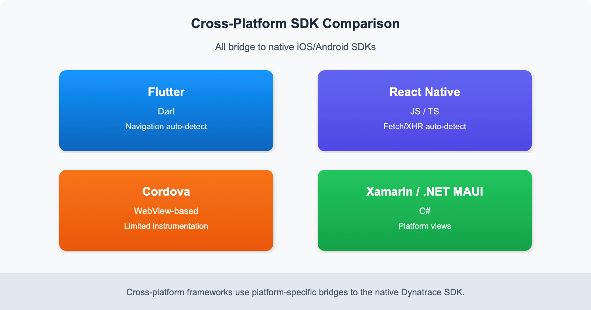

# MOBL-04: Cross-Platform Frameworks

> **Series:** MOBL | **Notebook:** 4 of 12 | **Created:** February 2026 | **Last Updated:** 04/04/2026

## Overview

Cross-platform frameworks like Flutter and React Native let teams ship to iOS and Android from a single codebase. Dynatrace provides dedicated plugins for these frameworks that bridge into the native mobile SDKs, giving you full auto-instrumentation, crash reporting, session replay, and custom action tracking without writing platform-specific monitoring code.

This notebook walks through instrumenting **Flutter**, **React Native**, **Cordova**, **Xamarin**, and **.NET MAUI** apps with Dynatrace. You will learn how each plugin integrates, how configuration bridging works under the hood, and how to choose the right approach for your stack.

---

## Table of Contents

1. [SDK Comparison](#sdk-comparison)
2. [Flutter Setup](#flutter-setup)
3. [React Native Setup](#react-native-setup)
4. [Configuration Bridging](#config-bridging)
5. [React Native Symbolication](#rn-symbolication)
6. [Other Frameworks](#other-frameworks)
7. [Choosing the Right Approach](#choosing-approach)

---

## Prerequisites

| Requirement | Details |
|-------------|----------|
| **Dynatrace Environment** | SaaS or Managed with Mobile App monitoring enabled |
| **Permissions** | `Mobile app settings` write access, `bizevents.read` |
| **Flutter** | Flutter 3.x with Dart 3.x (for Flutter sections) |
| **React Native** | React Native 0.72+ with Node.js 18+ (for RN sections) |
| **Mobile App** | At least one mobile application configured in Dynatrace |
| **Previous Notebooks** | MOBL-01 through MOBL-03 recommended |

<a id="sdk-comparison"></a>

## 1. SDK Comparison

Dynatrace offers dedicated plugins for the most popular cross-platform frameworks. Each plugin wraps the native iOS and Android mobile SDKs, exposing framework-specific APIs and auto-instrumentation hooks.



<!-- MARKDOWN_TABLE_ALTERNATIVE
| Framework | Auto-Instrumentation | Crash Reporting | Session Replay | Custom Actions | Maturity |
|-----------|---------------------|-----------------|----------------|----------------|----------|
| Flutter | Navigation, HTTP | Yes | Yes | Yes | High |
| React Native | Navigation, Fetch/XHR | Yes | Yes | Yes | High |
| Cordova | WebView | Yes | Limited | Yes | Moderate |
| Xamarin | Platform views | Yes | Limited | Yes | Legacy |
For environments where SVG doesn't render
-->

| Feature | Flutter | React Native | Cordova | Xamarin |
|---------|---------|-------------|---------|----------|
| Auto-instrumentation | Navigation, HTTP | Navigation, Fetch/XHR | WebView | Platform views |
| Crash reporting | Yes | Yes | Yes | Yes |
| Session replay | Yes | Yes | Limited | Limited |
| Custom actions | Yes | Yes | Yes | Yes |
| Maturity | High | High | Moderate | Legacy |

> **Note:** Flutter and React Native are the most actively developed plugins with the broadest feature coverage. Cordova and Xamarin remain supported but receive less frequent updates. .NET MAUI support is in preview.

<a id="flutter-setup"></a>

## 2. Flutter Setup

The Dynatrace Flutter plugin (`dynatrace_flutter_plugin`) integrates into your Flutter project via `pubspec.yaml` and auto-starts based on a configuration file at the project root.

### Step 1: Add the Dependency

```yaml
# pubspec.yaml
dependencies:
  dynatrace_flutter_plugin: ^3.x.x
```

Run `flutter pub get` to install the plugin.

### Step 2: Import and Initialize

```dart
// main.dart
import 'package:dynatrace_flutter_plugin/dynatrace_flutter_plugin.dart';

void main() {
  runApp(const MyApp());
  // SDK auto-starts based on dynatrace.config file
}
```

The plugin hooks into Flutter's navigation observer automatically. For `Navigator 2.0` or `go_router`, you may need to register the Dynatrace navigation observer explicitly.

### Step 3: Platform Configuration

Create a `dynatrace.config.yaml` file at your project root with platform-specific application IDs and beacon URLs from your Dynatrace environment:

```yaml
# dynatrace.config.yaml (project root)
dynatrace:
  configurations:
    android:
      applicationId: "YOUR_ANDROID_APP_ID"
      beaconUrl: "YOUR_BEACON_URL"
    ios:
      applicationId: "YOUR_IOS_APP_ID"
      beaconUrl: "YOUR_BEACON_URL"
```

> **Tip:** You can find the Application ID and Beacon URL in **Dynatrace > Mobile App > Settings > Instrumentation**. Each platform (Android, iOS) has its own Application ID.

<a id="react-native-setup"></a>

## 3. React Native Setup

The Dynatrace React Native plugin (`@dynatrace/react-native-plugin`) provides auto-instrumentation for navigation transitions, Fetch/XHR network calls, and crash reporting.

### Step 1: Install and Instrument

```bash
npm install @dynatrace/react-native-plugin
npx instrumentDynatrace
```

The `instrumentDynatrace` command modifies your native project files (Gradle for Android, Podfile for iOS) to integrate the Dynatrace mobile agent.

### Step 2: Configuration File

Create `dynatrace.config.js` at the project root:

```javascript
// dynatrace.config.js
module.exports = {
  react: {
    autoStart: true,
    debug: false,
  },
  android: {
    config: `
      dynatrace {
        configurations {
          defaultConfig {
            applicationId("YOUR_ANDROID_APP_ID")
            beaconUrl("YOUR_BEACON_URL")
          }
        }
      }
    `,
  },
  ios: {
    config: `
      <key>DTXApplicationID</key>
      <string>YOUR_IOS_APP_ID</string>
      <key>DTXBeaconURL</key>
      <string>YOUR_BEACON_URL</string>
    `,
  },
};
```

### Key Configuration Options

| Option | Description | Default |
|--------|-------------|---------|
| `autoStart` | Start monitoring automatically on app launch | `true` |
| `debug` | Enable verbose logging for troubleshooting | `false` |
| `lifecycleUpdate` | Automatically track lifecycle actions | `true` |
| `userOptIn` | Require explicit user consent before monitoring | `false` |

> **Important:** After changing `dynatrace.config.js`, re-run `npx instrumentDynatrace` to apply the updated configuration to native project files.

<a id="config-bridging"></a>

## 4. Configuration Bridging

Cross-platform Dynatrace plugins do not implement their own monitoring logic. Instead, they act as **bridges** to the native iOS and Android mobile SDKs.

### How Bridging Works

```
Your Cross-Platform Code (Dart / JavaScript)
        |
        v
Dynatrace Plugin (Flutter / React Native)
        |
   +---------+---------+
   |                   |
   v                   v
Native iOS SDK    Native Android SDK
(OneAgent Mobile) (OneAgent Mobile)
   |                   |
   v                   v
Dynatrace Backend (Beacon Endpoint)
```

### What This Means in Practice

- **Separate Application IDs**: iOS and Android are distinct mobile applications in Dynatrace. Each requires its own Application ID and Beacon URL.
- **Platform-specific behavior**: Some features (like WebView monitoring or specific crash formats) differ between iOS and Android because the underlying native SDK handles them.
- **Native crashes**: Native crashes (Objective-C/Swift on iOS, Java/Kotlin on Android) are captured by the native SDK, not the cross-platform plugin.
- **Dart/JS crashes**: Unhandled exceptions in Dart (Flutter) or JavaScript (React Native) are caught by the plugin and forwarded to the native SDK for reporting.

> **Tip:** Always verify that both platform configurations (Android and iOS) are correct and that both Application IDs appear as active in the Dynatrace UI. A common mistake is configuring only one platform.

### Verify Your Mobile App Inventory

Query all configured mobile applications to confirm both Android and iOS entries exist for your cross-platform app:

```dql
// Full mobile app inventory
fetch dt.entity.device_application
| fields entity.name, id, tags
| sort entity.name asc
| limit 50

```

You should see separate entries for your Android and iOS applications. If either is missing, revisit the configuration and ensure the Application ID and Beacon URL are correctly set for that platform.

<a id="rn-symbolication"></a>

## 5. React Native Symbolication

React Native apps ship with minified JavaScript bundles. When a crash or error occurs, the stack trace references obfuscated line and column numbers. **Source map upload** translates these back to your original source code.

### How It Works

1. During the build, React Native generates a `.map` file alongside the minified JS bundle.
2. The `npx instrumentDynatrace` command can be configured to automatically upload source maps to Dynatrace.
3. When a crash is reported, Dynatrace uses the uploaded source map to symbolicate the stack trace.

### Enabling Automatic Upload

In your `dynatrace.config.js`, ensure the React section includes source map settings:

```javascript
react: {
  autoStart: true,
  debug: false,
  sourceMap: {
    android: true,
    ios: true,
  },
},
```

### Manual Upload

If your CI/CD pipeline requires manual upload, use the Dynatrace API:

```bash
curl -X POST "https://YOUR_ENVIRONMENT.live.dynatrace.com/api/v2/rum/sourcemap" \
  -H "Authorization: Api-Token YOUR_API_TOKEN" \
  -F "file=@index.android.bundle.map" \
  -F "appId=YOUR_ANDROID_APP_ID" \
  -F "version=1.0.0" \
  -F "bundleUrl=index.android.bundle"
```

> **Note:** Source map upload applies to React Native and Cordova. Flutter uses Dart stack traces that are symbolicated differently via dSYM (iOS) and ProGuard/R8 mapping files (Android).

### Event Volume by Application

Check the volume of mobile events flowing into Dynatrace, grouped by application and event type. This helps confirm that your cross-platform instrumentation is actively reporting data:

```dql
// Event volume by application and event type
fetch bizevents, from:-1h
| filter event.provider == "www.dynatrace.com/mobile"
| summarize event_count = count(), by:{useraction.application, event.type}
| sort event_count desc
| limit 20
```

<a id="other-frameworks"></a>

## 6. Other Frameworks

### Cordova / Ionic

Cordova and Ionic apps run inside a WebView, and the Dynatrace Cordova plugin instruments both the WebView layer and native platform calls.

```bash
cordova plugin add @dynatrace/cordova-plugin --save
```

Configuration is managed through a `dynatrace.config.js` file similar to the React Native approach. The plugin instruments `XMLHttpRequest`, `fetch`, and page transitions within the WebView.

### Xamarin

For Xamarin applications, Dynatrace offers NuGet packages:

- **Dynatrace.Xamarin** for Xamarin.Forms
- **Dynatrace.Xamarin.Android** and **Dynatrace.Xamarin.iOS** for platform-specific projects

```bash
dotnet add package Dynatrace.Xamarin
```

> **Note:** Xamarin is in maintenance mode by Microsoft. New projects should consider .NET MAUI instead.

### .NET MAUI (Preview)

.NET MAUI is the successor to Xamarin.Forms. Dynatrace support for .NET MAUI is in preview. Instrumentation follows a similar pattern to Xamarin, with a NuGet package and platform-specific configuration.

Check the [Dynatrace documentation](https://docs.dynatrace.com/docs/platform-modules/digital-experience/mobile-applications) for the latest .NET MAUI support status.

### Platform Distribution

Understand which operating systems your mobile users are on. This is especially useful for cross-platform apps to see the iOS-to-Android ratio:

```dql
// Platform distribution across mobile apps
fetch bizevents, from:-1h
| filter event.provider == "www.dynatrace.com/mobile"
| summarize session_count = count(), by:{os.type}
| sort session_count desc
```

<a id="choosing-approach"></a>

## 7. Choosing the Right Approach

Use the following decision matrix to determine the best instrumentation path for your cross-platform project:

| Criteria | Flutter | React Native | Cordova | Xamarin / MAUI |
|----------|---------|-------------|---------|----------------|
| **New project (2025+)** | Recommended | Recommended | Not recommended | MAUI only |
| **Existing project** | If already Flutter | If already RN | If already Cordova | If already Xamarin |
| **Session replay needed** | Yes | Yes | Limited | Limited |
| **Team expertise** | Dart | JavaScript/TypeScript | Web technologies | C# / .NET |
| **Plugin maturity** | Stable, active | Stable, active | Stable, less active | Legacy / Preview |
| **Auto-instrumentation depth** | Deep | Deep | WebView only | Moderate |

### Recommendations

- **Starting a new cross-platform project?** Choose Flutter or React Native. Both have first-class Dynatrace support with the broadest feature coverage.
- **Migrating from Cordova?** Move to React Native for a smoother transition since both use JavaScript. The Dynatrace plugin API is similar.
- **Migrating from Xamarin?** Move to .NET MAUI. Monitor Dynatrace documentation for GA support.
- **Need the deepest auto-instrumentation?** Flutter and React Native offer the most comprehensive out-of-the-box instrumentation, including navigation tracking, HTTP call monitoring, and crash reporting without manual code changes.

## Summary

In this notebook you learned:

- **SDK landscape**: Flutter and React Native plugins are the most mature, while Cordova and Xamarin remain supported for existing projects.
- **Flutter integration**: Add the `dynatrace_flutter_plugin` dependency and configure via `dynatrace.config.yaml`.
- **React Native integration**: Install `@dynatrace/react-native-plugin`, run `npx instrumentDynatrace`, and configure via `dynatrace.config.js`.
- **Configuration bridging**: Cross-platform plugins delegate to native iOS/Android SDKs. Each platform needs its own Application ID.
- **Symbolication**: React Native requires source map upload for readable crash stack traces.
- **Other frameworks**: Cordova, Xamarin, and .NET MAUI are supported at varying maturity levels.
- **Decision matrix**: Choose your framework based on project status, team expertise, and required monitoring depth.

## Next Steps

Continue to **MOBL-05** to explore custom user actions, manual instrumentation APIs, and advanced tagging strategies for cross-platform mobile apps.

---

<sub>*This notebook was AI-generated from community-submitted and publicly available sources. This notebook series is not officially supported by Dynatrace. Always verify information against official [Dynatrace documentation](https://docs.dynatrace.com/docs).*</sub>
