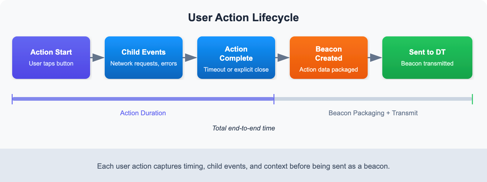

# MOBL-05: User Action Tracking

> **Series:** MOBL — Mobile Monitoring | **Notebook:** 5 of 12 | **Created:** February 2026 | **Last Updated:** 04/25/2026

## Overview

User actions are the foundation of mobile Real User Monitoring (RUM) in Dynatrace. Every tap, swipe, app launch, and custom interaction is captured as a **user action** — a discrete, measurable event that reveals how users interact with your mobile application. This notebook explores how Dynatrace captures these interactions, from auto-detected taps and navigation events to custom actions you instrument yourself. You will also learn about rage tap detection (a key frustration signal) and how to query action data with DQL for performance analysis and optimization.

---

## Table of Contents

1. [What Are User Actions?](#what-are-user-actions)
2. [Auto-Detected Actions](#auto-detected-actions)
3. [Action Lifecycle](#action-lifecycle)
4. [Rage Tap Detection](#rage-tap-detection)
5. [Custom User Actions](#custom-user-actions)
6. [Querying Actions with DQL](#querying-actions)
7. [Optimizing Action Naming](#optimizing-action-naming)

---

## Prerequisites

| Requirement | Details |
|-------------|---------|
| **Dynatrace Environment** | SaaS with Grail enabled |
| **Mobile App** | At least one mobile app with the Dynatrace Mobile SDK configured |
| **Permissions** | `storage:events:read`, `storage:bizevents:read` |
| **Data** | User action data actively flowing from mobile devices |
| **Prior Notebooks** | Completed MOBL-01 through MOBL-04 recommended |

<a id="what-are-user-actions"></a>
## 1. What Are User Actions?

A **user action** represents a single, discrete user interaction with a mobile application. Dynatrace captures each action with rich context including the action name, type, duration, associated network requests, and any errors that occurred during the interaction.

### Action Properties

Every user action includes the following key properties:

| Property | Description | Example |
|----------|-------------|---------|
| **Name** | Human-readable label describing the interaction | `"Tap on Login"`, `"Add to Cart"` |
| **Type** | Category of interaction | `Tap`, `Swipe`, `AppStart`, `Custom` |
| **Duration** | Time from action start to completion (including child events) | `450ms` |
| **Network Requests** | HTTP calls triggered during the action | API calls, image loads |
| **Errors** | Any crashes or HTTP errors during the action | 500 responses, exceptions |

### Action Types

Dynatrace classifies mobile user actions into the following types:

| Type | Description | Detection |
|------|-------------|-----------|
| **Tap** | User taps a button, link, or interactive element | Auto-detected for native UI components |
| **Swipe** | User swipes on a scrollable or gesture-responsive area | Auto-detected on supported views |
| **AppStart** | The app launches (cold start, warm start, or hot start) | Always auto-detected |
| **Custom** | Developer-defined action wrapping business logic | Manual instrumentation required |
| **RageTap** | Rapid repeated taps indicating user frustration | Auto-detected when enabled |

> **Note:** The exact set of auto-detected action types varies by platform and UI framework. See the next section for a detailed compatibility matrix.

<a id="auto-detected-actions"></a>
## 2. Auto-Detected Actions

Dynatrace auto-instrumentation capabilities differ between platforms and UI frameworks. Modern declarative frameworks (SwiftUI, Jetpack Compose) require more manual instrumentation than their imperative counterparts (UIKit, Android Views).

### Platform Compatibility Matrix

| Action | iOS (UIKit) | iOS (SwiftUI) | Android (Views) | Android (Compose) |
|--------|-------------|---------------|-----------------|-------------------|
| Button tap | Auto | Manual | Auto | Manual |
| List item tap | Auto | Manual | Auto | Manual |
| Navigation | Auto | Partial | Auto | Manual |
| App start | Auto | Auto | Auto | Auto |
| App background/foreground | Auto | Auto | Auto | Auto |

**Key takeaways:**

- **UIKit and Android Views** provide the most complete auto-detection out of the box. Button taps, list selections, and navigation transitions are captured automatically.
- **SwiftUI and Jetpack Compose** require explicit instrumentation for most tap and navigation events because the SDK cannot hook into declarative view hierarchies the same way it hooks into imperative widget trees.
- **App start and lifecycle events** (background/foreground) are always auto-detected regardless of UI framework.

> **Tip:** If your app uses SwiftUI or Jetpack Compose, plan for custom action instrumentation early in development. See Section 5 for code examples.

<a id="action-lifecycle"></a>
## 3. Action Lifecycle

Understanding the lifecycle of a user action is critical for interpreting duration metrics and troubleshooting slow interactions.



<!-- MARKDOWN_TABLE_ALTERNATIVE
| Phase | Description |
|-------|-------------|
| Action Start | User initiates the interaction (e.g., taps a button) |
| Child Events | Network requests, web API calls, and errors are associated as children |
| Action End | The action completes — either by timeout or explicit closure |
| Beacon Sent | The captured action data is batched and transmitted to Dynatrace |
For environments where SVG doesn't render
-->

### Lifecycle Phases

1. **Action Start** — The SDK detects a user interaction (tap, swipe) or the developer calls `enterAction()`. A timer begins.
2. **Child Event Association** — Any network requests, web API calls, or errors that occur while the action is open are automatically linked as child events. This gives you full visibility into what happened *during* the interaction.
3. **Action End** — The action closes in one of three ways:
   - **Auto-close:** The SDK detects the interaction is complete (e.g., the UI finished loading).
   - **Manual close:** The developer calls `leaveAction()` on a custom action.
   - **Timeout:** If no new child events are detected within the configured timeout window (default: 500ms for auto-detected actions), the action automatically closes.
4. **Beacon Transmission** — Completed actions are batched into a beacon and sent to Dynatrace during the next transmission cycle.

### Duration Calculation

The action duration is measured from **Action Start** to **Action End**. It includes the time for all child events to complete. This means a tap action that triggers a slow API call will have a longer duration than a tap that only updates the local UI.

> **Important:** The action timeout directly affects duration measurement. If the timeout is set too long, actions will appear artificially slow. If set too short, child events may not be properly associated.

<a id="rage-tap-detection"></a>
## 4. Rage Tap Detection

**Rage taps** occur when a user rapidly and repeatedly taps the same area of the screen. This behavior is a strong signal of **user frustration** — typically caused by unresponsive UI elements, slow loading, or confusing interaction patterns.

### How Dynatrace Detects Rage Taps

Dynatrace automatically detects rage taps by analyzing tap frequency and proximity:

| Parameter | Description | Default |
|-----------|-------------|---------|
| **Tap count threshold** | Minimum number of taps in rapid succession | 3 taps |
| **Time window** | Maximum time between first and last tap | 1 second |
| **Proximity radius** | Maximum distance between tap locations | Small area (platform-dependent) |

When these criteria are met, Dynatrace creates a `RageTap` user action with details about the target element and the number of taps detected.

### Configuration Options

Rage tap detection is enabled by default but can be tuned:

- **Enable/Disable** — Toggle rage tap detection per application in Dynatrace settings.
- **Sensitivity** — Adjust the tap count threshold and time window to control detection sensitivity.
- **Exclusions** — Exclude specific UI elements that legitimately require rapid tapping (e.g., game controls, increment/decrement buttons).

### Why Rage Taps Matter

Rage taps are a leading indicator of poor user experience. Common root causes include:

- **Unresponsive buttons** — The UI does not provide feedback that the tap was registered.
- **Slow transitions** — Navigation takes so long that users tap again thinking the first tap failed.
- **Broken interactions** — The tap target is not wired to any action (dead zone).
- **Layout shifts** — UI elements move after rendering, causing users to miss their intended target.

> **Tip:** Combine rage tap analysis with crash and error data to prioritize UX fixes that have the biggest impact on user satisfaction.

<a id="custom-user-actions"></a>
## 5. Custom User Actions

Custom user actions let you measure business-critical interactions that are not automatically captured by the SDK. Use them to wrap multi-step processes like checkout flows, search operations, or any logic where you want precise timing and child event association.

### iOS (Swift)

```swift
// iOS (Swift)
let action = DTXAction.enter(withName: "Add to Cart")
// ... perform the action logic (API calls, UI updates) ...
action.leave()
```

### Android (Kotlin)

```kotlin
// Android (Kotlin)
val action = Dynatrace.enterAction("Add to Cart")
// ... perform the action logic (API calls, UI updates) ...
action.leaveAction()
```

### Flutter (Dart)

```dart
// Flutter (Dart)
var action = await dtAgent.enterAction("Add to Cart");
// ... perform the action logic (API calls, UI updates) ...
await action.leaveAction();
```

### Best Practices for Custom Actions

| Practice | Description |
|----------|-------------|
| **Always call leave/leaveAction** | Forgetting to close an action causes it to time out, inflating duration metrics |
| **Use descriptive names** | `"Add to Cart"` is better than `"button_click_42"` |
| **Avoid nesting too deeply** | Keep action hierarchies shallow (parent + 1 level of child actions max) |
| **Wrap error handling** | Ensure `leaveAction()` is called in both success and error paths |
| **Report values** | Use `reportValue()` / `reportEvent()` to attach business context to the action |

<a id="querying-actions"></a>
## 6. Querying Actions with DQL

User action data is available in Dynatrace Grail as business events (`bizevents`). The following DQL queries demonstrate common analysis patterns for mobile user actions.

### 6.1 Recent Tap Actions

Retrieve the most recent tap actions across all monitored mobile applications to see what users are doing right now.

```dql
// Recent tap actions across all mobile apps
fetch bizevents, from:-1h
| filter event.provider == "www.dynatrace.com/mobile"
| filter useraction.type == "Tap"
| fields timestamp, useraction.name, useraction.application, useraction.duration
| sort timestamp desc
| limit 50
```

### 6.2 Action Volume by Type

Understand the distribution of action types to see which interaction patterns dominate your mobile app usage.

```dql
// Action volume by type across all apps
fetch bizevents, from:-1h
| filter event.provider == "www.dynatrace.com/mobile"
| filter isNotNull(useraction.type)
| summarize action_count = count(), by:{useraction.type}
| sort action_count desc
```

### 6.3 Rage Tap Events

Identify rage tap events over the past 24 hours. These are high-priority signals of user frustration that warrant investigation.

```dql
// Rage tap events (user frustration indicator)
fetch bizevents, from:-24h
| filter event.provider == "www.dynatrace.com/mobile"
| filter useraction.type == "RageTap" or contains(toString(useraction.name), "rage")
| fields timestamp, useraction.name, useraction.application, os.type
| sort timestamp desc
| limit 50
```

### 6.4 Action Trends Over Time

Visualize user action trends on an hourly basis, split by action type. This query produces a time-series chart suitable for dashboards.

```dql
// User action trends over time (hourly)
fetch bizevents, from:-24h
| filter event.provider == "www.dynatrace.com/mobile"
| filter isNotNull(useraction.type)
| makeTimeseries action_count = count(), by:{useraction.type}, interval:1h
```

### 6.5 Top Apps by Action Volume

Rank your mobile applications by the total number of user actions to identify the most actively used apps.

```dql
// Top apps by action volume
fetch bizevents, from:-1h
| filter event.provider == "www.dynatrace.com/mobile"
| filter isNotNull(useraction.type)
| summarize action_count = count(), by:{useraction.application}
| sort action_count desc
| limit 10
```

<a id="optimizing-action-naming"></a>
## 7. Optimizing Action Naming

Poorly named user actions make analysis difficult and can cause high-cardinality issues in aggregation queries. Follow these best practices to keep action names clean and useful.

### Naming Rules

| Rule | Good Example | Bad Example | Why |
|------|-------------|-------------|-----|
| **Use descriptive, stable names** | `"Add to Cart"` | `"btn_click"` | Descriptive names are self-documenting in queries and dashboards |
| **Avoid dynamic values** | `"View Product Details"` | `"View Product #48291"` | Dynamic values create thousands of unique action names, making aggregation impossible |
| **No user IDs in names** | `"User Profile"` | `"Profile: user_abc123"` | User-specific names are a cardinality explosion and a potential privacy issue |
| **No timestamps in names** | `"Refresh Dashboard"` | `"Refresh 2026-02-24T10:30"` | Timestamps guarantee every action name is unique, defeating grouping |
| **Use consistent casing** | `"Search Products"` | `"search products"` / `"SEARCH_PRODUCTS"` | Inconsistent casing creates duplicate entries in aggregations |
| **Group related actions** | `"Cart: Add Item"`, `"Cart: Remove Item"` | `"addToCart"`, `"removeFromBasket"` | Prefixes help group related actions in sorted lists |

### Action Naming Strategy

Adopt a naming convention across your team and enforce it through code review:

1. **Use a prefix for the feature area** — `"Cart: "`, `"Search: "`, `"Profile: "`, `"Checkout: "`
2. **Describe the user intent** — `"Add Item"`, `"Apply Filter"`, `"Submit Order"`
3. **Combine into a consistent pattern** — `"Cart: Add Item"`, `"Search: Apply Filter"`, `"Checkout: Submit Order"`

This approach produces clean, groupable action names that work well in both DQL queries and Dynatrace dashboards.

### Renaming Actions in Dynatrace

If auto-detected action names are not descriptive enough, you can configure **user action naming rules** in Dynatrace:

1. Navigate to **Settings > RUM > Mobile > User action naming**
2. Define naming rules based on CSS selectors, page groups, or custom attributes
3. Test rules against recent action data before deploying

> **Important:** Naming rule changes apply only to newly captured actions. Historical data retains the original action names.

---

## Summary

In this notebook, you learned:

- **What user actions are** — discrete interaction events with name, type, duration, and child events
- **Auto-detection capabilities** — UIKit and Android Views provide the best coverage; SwiftUI and Compose need manual instrumentation
- **Action lifecycle** — from start through child event association to beacon transmission
- **Rage tap detection** — an automatic frustration signal based on rapid repeated taps
- **Custom action instrumentation** — platform-specific code for iOS, Android, and Flutter
- **DQL queries** — how to retrieve and analyze user action data from Grail
- **Naming best practices** — descriptive, stable names without dynamic values or user IDs

---

## Next Steps

Continue to **MOBL-06** in the Mobile Monitoring series to explore:
- Session replay for mobile applications
- Correlating user actions with session-level context
- Advanced user behavior analytics

---

<sub>*This notebook was AI-generated from community-submitted and publicly available sources. This notebook series is not officially supported by Dynatrace. Always verify information against official Dynatrace documentation.*</sub>
