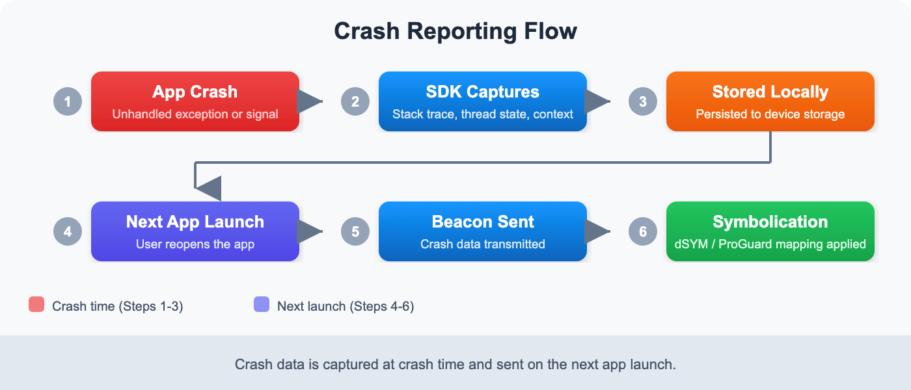

# MOBL-06: Crash Reporting & ANR Detection

> **Series:** MOBL — Mobile Monitoring | **Notebook:** 6 of 12 | **Created:** February 2026 | **Last Updated:** 02/24/2026

## Overview

Mobile app crashes are the single most damaging event for user retention and app store ratings. Dynatrace automatically captures, symbolizes, and groups crashes across iOS and Android -- including Android Application Not Responding (ANR) events. This notebook explains how crash reporting works end-to-end, how to configure symbolication for readable stack traces, and how to query crash data with DQL to identify trends and prioritize fixes.

---

## Table of Contents

1. [How Crash Reporting Works](#how-crash-reporting-works)
2. [iOS Symbolication (dSYM)](#ios-symbolication)
3. [Android Crash & ANR Detection](#android-crash-anr)
4. [Crash Grouping](#crash-grouping)
5. [Querying Crash Data](#querying-crash-data)
6. [Crash Rate Trends](#crash-rate-trends)
7. [Manual Error Reporting](#manual-error-reporting)

---

## Prerequisites

| Requirement | Details |
|-------------|---------||
| **Dynatrace Environment** | SaaS with Grail enabled |
| **Permissions** | `rum.read`, `events.read`, `bizevents.read` |
| **Mobile App** | At least one mobile application with crash reporting enabled |
| **Symbolication** | dSYM files (iOS) or ProGuard/R8 mapping files (Android) uploaded |
| **Prior Knowledge** | Familiarity with MOBL-01 through MOBL-05 recommended |

<a id="how-crash-reporting-works"></a>

## 1. How Crash Reporting Works

When a mobile app crashes, the Dynatrace SDK captures the crash details and sends them to the backend for processing. The process differs slightly between handled exceptions and unhandled crashes, but the overall flow is the same.



<!-- MARKDOWN_TABLE_ALTERNATIVE
| Step | Stage | Description |
|------|-------|-------------|
| 1 | App Crash | The app encounters an unhandled exception or fatal signal |
| 2 | SDK Captures Stack Trace | The Dynatrace SDK's crash handler captures the full stack trace, thread state, and device context |
| 3 | Beacon Stored Locally | The crash beacon is written to local storage (the app is terminating, so it cannot send immediately) |
| 4 | Next App Launch Sends Beacon | On the next app launch, the SDK detects the stored crash beacon and transmits it to the beacon endpoint |
| 5 | Server-Side Symbolication | The backend matches memory addresses against uploaded symbol files (dSYM/ProGuard) to produce human-readable stack traces |
| 6 | Crash Appears in UI | The symbolicated crash is grouped, stored in Grail, and visible in the Dynatrace mobile crash analysis view |
For environments where SVG doesn't render
-->

### Handled vs Unhandled Crashes

It is important to understand the distinction between handled exceptions and unhandled crashes:

| Type | Description | SDK Behavior |
|------|-------------|-------------|
| **Unhandled Crash** | The app terminates unexpectedly due to an unhandled exception (e.g., `NullPointerException`, `EXC_BAD_ACCESS`) or fatal signal | SDK crash handler fires, captures stack trace, stores beacon locally. Sent on next launch. |
| **Handled Exception** | The developer catches an error in a try/catch block and explicitly reports it via the SDK API | SDK sends the error beacon immediately (app is still running). Does not terminate the app. |

**Key difference:** Unhandled crashes terminate the app and the beacon is sent on the *next* launch. Handled exceptions are reported in real-time while the app continues running.

> **Note:** If a user never reopens the app after a crash, the crash beacon will never be sent. This means crash counts may underrepresent the true number of crashes, especially for severe issues that cause users to abandon the app entirely.

<a id="ios-symbolication"></a>

## 2. iOS Symbolication (dSYM)

When an iOS app is compiled in Release mode, the compiler strips debug symbols from the binary to reduce its size. These symbols are stored in **dSYM (Debug Symbol)** files. Without dSYM files, crash stack traces show only memory addresses like `0x00000001045a3b2c` instead of meaningful method names like `-[PaymentViewController processPayment:]`.

### What Are dSYM Files?

A dSYM file is a companion file generated during the Xcode build process that maps memory addresses back to source code symbols (class names, method names, file names, and line numbers). Each build produces a unique dSYM file identified by a UUID that must match the app binary.

### Upload Methods

| Method | Description | Best For |
|--------|-------------|----------|
| **Xcode Build Phase Script** | Add a run script phase to your Xcode project that automatically uploads dSYMs after each build | CI/CD pipelines using Xcode |
| **Manual Upload** | Upload dSYM files through the Dynatrace UI (Settings > Mobile > Symbol Files) | Ad-hoc builds, troubleshooting |
| **Fastlane** | Use the `dynatrace_process_symbols` Fastlane action in your deployment lane | Teams already using Fastlane |
| **REST API** | Upload via the Dynatrace API endpoint for symbol file management | Custom CI/CD systems |

### Xcode Build Phase Script Example

```bash
# Add this as a "Run Script" build phase in Xcode
"${PODS_ROOT}/Dynatrace/DTXDssClient" \
  -ApiToken "YOUR_API_TOKEN" \
  -DtApplicationID "YOUR_APP_ID" \
  -Server "https://your-environment.live.dynatrace.com" \
  -CFBundleVersion "${CURRENT_PROJECT_VERSION}" \
  -DTXLogLevel ALL
```

### Bitcode Considerations

If your app uses Bitcode (now deprecated in Xcode 14+), Apple recompiles the binary on their servers before distributing to users. This means the dSYM you generate locally does **not** match the binary users actually run. You must download the App Store-generated dSYMs from App Store Connect (or via Xcode Organizer) and upload those to Dynatrace instead.

### Symbolication Status

| Stack Trace Appearance | Meaning |
|----------------------|----------|
| `MyApp -[PaymentViewController processPayment:] + 42` | Fully symbolicated -- dSYM uploaded correctly |
| `MyApp 0x00000001045a3b2c` | Not symbolicated -- dSYM missing or UUID mismatch |
| `MyFramework 0x00000001089d1f30` | Framework dSYM missing -- upload framework symbols too |

> **Tip:** Always verify symbolication status after uploading dSYMs. If crashes still show memory addresses, check that the dSYM UUID matches the app binary UUID using `dwarfdump --uuid` on both files.

<a id="android-crash-anr"></a>

## 3. Android Crash & ANR Detection

Android crash reporting covers three distinct types of failures, each with different detection mechanisms:

| Type | Description | Detection |
|------|-------------|----------|
| **Unhandled Exception** | `RuntimeException`, `NullPointerException`, `OutOfMemoryError`, etc. | Automatic -- SDK installs an `UncaughtExceptionHandler` |
| **ANR (Application Not Responding)** | Main thread blocked for more than 5 seconds, causing the system to display the ANR dialog | Automatic -- SDK monitors the main thread responsiveness |
| **Native Crash** | Segfault or other fatal signal in NDK/C++ code (e.g., `SIGSEGV`, `SIGABRT`) | Requires enabling NDK crash reporting in the SDK configuration |

### ANR Detection in Detail

An ANR occurs when the Android system detects that the main (UI) thread has been unresponsive for more than 5 seconds. Common causes include:

- **Database operations on the main thread** -- SQLite queries, Room transactions
- **Network calls on the main thread** -- Synchronous HTTP requests
- **Heavy computation** -- Image processing, JSON parsing of large payloads
- **Lock contention** -- Main thread waiting for a lock held by a background thread
- **Deadlocks** -- Two threads waiting on each other

The Dynatrace SDK captures the full thread dump at the time of the ANR, including the main thread's stack trace showing exactly where it was blocked. This makes ANRs significantly easier to diagnose compared to the limited information in the Android vitals dashboard.

### ProGuard/R8 Mapping Files

When you enable code shrinking with ProGuard or R8 (the default for release builds), class and method names are obfuscated. Without the mapping file, crash stack traces show names like `a.b.c.d()` instead of `com.example.PaymentService.processPayment()`.

**Upload mapping files** through:

- **Dynatrace Gradle plugin** -- Automatically uploads mapping files as part of the build process
- **Manual upload** -- Upload via Dynatrace UI (Settings > Mobile > Symbol Files)
- **REST API** -- Upload programmatically in CI/CD pipelines

```groovy
// build.gradle - Dynatrace Gradle plugin configuration
dynatrace {
    configurations {
        release {
            autoStart {
                applicationId 'YOUR_APP_ID'
                beaconUrl 'https://your-environment.live.dynatrace.com/mbeacon'
            }
            symbols {
                apitoken 'YOUR_API_TOKEN'
            }
        }
    }
}
```

> **Important:** Upload mapping files for every release build. If a mapping file is missing for a specific app version, crashes from that version will show obfuscated stack traces.

<a id="crash-grouping"></a>

## 4. Crash Grouping

When Dynatrace receives crash reports, it does not treat each individual crash as a separate issue. Instead, it **groups crashes by root cause** to help you focus on the most impactful problems.

### How Grouping Works

Crashes are grouped based on a combination of:

1. **Exception type** -- The class of the exception (e.g., `NullPointerException`, `EXC_BAD_ACCESS`)
2. **Top stack frame** -- The topmost relevant frame in the stack trace (the method where the crash occurred)
3. **Crash message** -- The exception message (when available and consistent)

This means that 500 users crashing on the same `NullPointerException` in `PaymentViewController.processPayment()` will appear as a **single crash group** with a count of 500, rather than 500 individual crash entries.

### Benefits of Crash Grouping

| Benefit | Description |
|---------|-------------|
| **Prioritization** | See which crashes affect the most users and fix those first |
| **Trend tracking** | Monitor whether a specific crash is increasing or decreasing across versions |
| **Regression detection** | Quickly identify if a new app version introduced a new crash group |
| **Noise reduction** | Hundreds of individual crash reports collapse into actionable groups |

### Crash Group Fields

When querying crash data in DQL, each crash record includes fields that help identify its group:

| Field | Description |
|-------|-------------|
| `event.name` | The crash group name (exception type + top frame) |
| `event.type` | `com.dynatrace.crash` for crashes |
| `useraction.application` | The mobile application name |
| `app.version` | The app version where the crash occurred |
| `os.type` | `iOS` or `Android` |

> **Tip:** Use `summarize count(), by:{event.name}` to see crash groups ranked by frequency. This immediately shows which crash should be fixed first.

<a id="querying-crash-data"></a>

## 5. Querying Crash Data

Crash data is stored as business events in Grail. Use the following queries to explore recent crashes, identify the most affected applications, and visualize crash trends over time.

### Recent Mobile Crashes

Retrieve the 50 most recent crash events across all mobile applications:

```dql
// Recent mobile crashes
fetch bizevents, from:-24h
| filter event.provider == "www.dynatrace.com/mobile"
| filter event.type == "com.dynatrace.crash"
| fields timestamp, useraction.application, os.type, app.version, event.name
| sort timestamp desc
| limit 50
```

### Crash Count by Application

See which applications and platforms have the highest crash volume over the last 7 days:

```dql
// Crash count by application over last 7 days
fetch bizevents, from:-7d
| filter event.provider == "www.dynatrace.com/mobile"
| filter event.type == "com.dynatrace.crash"
| summarize crash_count = count(), by:{useraction.application, os.type}
| sort crash_count desc
```

### Daily Crash Trend

Visualize how overall crash volume is trending day-over-day. Spikes may indicate a problematic release:

```dql
// Daily crash trend
fetch bizevents, from:-7d
| filter event.provider == "www.dynatrace.com/mobile"
| filter event.type == "com.dynatrace.crash"
| makeTimeseries crash_count = count(), interval:1d
```

<a id="crash-rate-trends"></a>

## 6. Crash Rate Trends

Looking at raw crash counts is useful, but breaking them down by platform reveals whether iOS or Android is experiencing more instability. The following queries help you compare crash rates across platforms and identify handled exceptions reported through the SDK API.

### Crash Rate by Platform

Compare daily crash volumes between iOS and Android to spot platform-specific regressions:

```dql
// Crash rate timeseries by platform
fetch bizevents, from:-7d
| filter event.provider == "www.dynatrace.com/mobile"
| filter event.type == "com.dynatrace.crash"
| makeTimeseries crash_count = count(), by:{os.type}, interval:1d
```

### Reported Errors (Handled Exceptions)

In addition to unhandled crashes, developers can report caught exceptions using the SDK API. These are stored with `event.type == "com.dynatrace.error.report"` and represent errors that the app handled gracefully but that you still want visibility into:

```dql
// Reported errors (handled exceptions)
fetch bizevents, from:-24h
| filter event.provider == "www.dynatrace.com/mobile"
| filter event.type == "com.dynatrace.error.report"
| fields timestamp, useraction.application, event.name, os.type
| sort timestamp desc
| limit 50
```

<a id="manual-error-reporting"></a>

## 7. Manual Error Reporting

While Dynatrace automatically captures unhandled crashes, you should also report **handled exceptions** that are important to your business logic. For example, a payment failure caught in a try/catch block does not crash the app, but you absolutely want visibility into it.

### iOS (Swift)

```swift
// iOS - Report a handled error
let error = NSError(
    domain: "PaymentError",
    code: 402,
    userInfo: [NSLocalizedDescriptionKey: "Card declined"]
)
DTXAction.reportError(withName: "Payment Failed", error: error)
```

### Android (Kotlin)

```kotlin
// Android - Report a handled error
Dynatrace.reportError("Payment Failed", Exception("Card declined"))
```

### Best Practices for Manual Error Reporting

| Practice | Rationale |
|----------|----------|
| **Use descriptive error names** | `"Payment Failed"` is better than `"Error"` -- it makes DQL grouping meaningful |
| **Include context in the exception** | Pass the underlying exception object so the stack trace is captured |
| **Report at catch boundaries** | Report where you handle the error, not deep in utility methods |
| **Avoid over-reporting** | Don't report expected conditions (e.g., network timeout during retry) as errors |
| **Use consistent naming** | Establish naming conventions across your team so errors group predictably |

> **Note:** Reported errors appear in DQL with `event.type == "com.dynatrace.error.report"`, while unhandled crashes use `event.type == "com.dynatrace.crash"`. Use the appropriate filter depending on what you are investigating.

---

## Summary

In this notebook, you learned:

- **How crash reporting works** -- from the moment the app crashes through SDK capture, local storage, next-launch transmission, server-side symbolication, and display in the UI
- **iOS symbolication** -- why dSYM files are essential, how to upload them (Xcode build phase, Fastlane, manual), and Bitcode considerations
- **Android crash types** -- unhandled exceptions, ANRs (main thread blocked >5 seconds), and native NDK crashes, plus ProGuard/R8 mapping file upload
- **Crash grouping** -- how Dynatrace groups crashes by exception type and top stack frame to help you prioritize fixes by frequency
- **Querying crash data with DQL** -- fetching recent crashes, counting by application, and visualizing daily crash trends
- **Crash rate trends** -- comparing crash volumes across iOS and Android platforms, plus querying handled exceptions
- **Manual error reporting** -- using the SDK API to report handled exceptions in Swift and Kotlin with best practices for naming and context

---

## Next Steps

Continue to **MOBL-07** to explore:
- Network request monitoring for mobile applications
- Analyzing HTTP error rates and response times by endpoint
- Correlating network failures with user impact and crash data

---

<sub>*This notebook was AI-generated from community-submitted and publicly available sources. This notebook series is not officially supported by Dynatrace. Always verify information against official Dynatrace documentation.*</sub>
