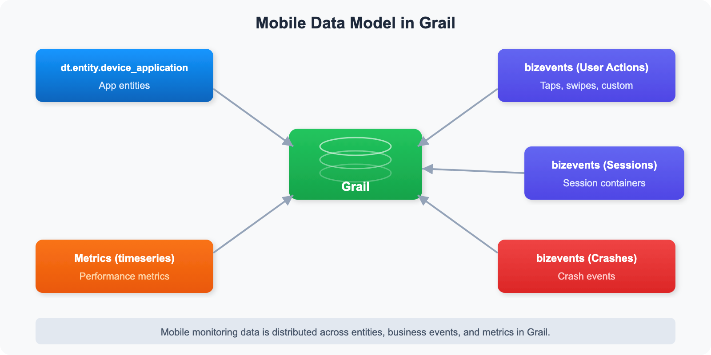

# MOBL-10: DQL for Mobile Analytics

> **Series:** MOBL — Mobile Monitoring | **Notebook:** 10 of 12 | **Created:** February 2026 | **Last Updated:** 04/25/2026

## Overview

A comprehensive DQL reference for mobile analytics — querying entities, user actions, crashes, performance metrics, device/OS segmentation, and geolocation. This notebook is designed as a **reusable query template library** that SREs and platform engineers can copy, adapt, and integrate into dashboards, notebooks, and automation workflows.

Every query in this notebook targets real mobile monitoring data in Grail and follows DQL best practices: explicit time ranges, early filtering, proper aliasing, and performance-conscious patterns.

---

## Table of Contents

1. [Mobile Data Model in Grail](#mobile-data-model)
2. [Querying Mobile Entities](#querying-entities)
3. [User Action Analytics](#user-action-analytics)
4. [Crash & Error Analytics](#crash-error-analytics)
5. [Performance Metrics](#performance-metrics)
6. [Device & OS Segmentation](#device-os-segmentation)
7. [Geolocation Analysis](#geolocation-analysis)
8. [Reusable Query Templates](#reusable-templates)

---

## Prerequisites

| Requirement | Details |
|-------------|---------|
| **Dynatrace Environment** | SaaS with Grail enabled |
| **Permissions** | `storage:bizevents:read`, `storage:metrics:read`, `storage:entities:read` |
| **Mobile App Data** | At least one mobile application (iOS or Android) instrumented with OneAgent Mobile SDK and sending data |
| **DQL Knowledge** | Familiarity with `fetch`, `filter`, `summarize`, and `makeTimeseries` commands |

<a id="mobile-data-model"></a>

## 1. Mobile Data Model in Grail

Understanding where mobile data lives in Grail is the foundation for writing effective DQL queries. Unlike traditional APM data that maps neatly to logs and spans, mobile monitoring data is distributed across multiple Grail data objects.



<!-- MARKDOWN_TABLE_ALTERNATIVE
| Data Source | Description |
|-------------|-------------|
| dt.entity.mobile_application | Mobile app entities registered in Dynatrace |
| bizevents (user actions) | Taps, swipes, app starts, and custom actions |
| bizevents (sessions) | Session lifecycle events with session IDs |
| bizevents (crashes) | Application crashes with stack traces |
| bizevents (network) | HTTP requests made by the mobile app |
| Metrics (timeseries) | Aggregated performance counters |
For environments where SVG doesn't render
-->

The following table maps each mobile data type to its Grail location and the DQL command used to query it:

| Data Type | Grail Location | DQL Command |
|-----------|---------------|-------------|
| App entities | `dt.entity.mobile_application` | `fetch dt.entity.mobile_application` |
| User actions | Business events | `fetch bizevents` with filter on `useraction.type` |
| Sessions | Business events | `fetch bizevents` with `dt.rum.session.id` |
| Crashes | Business events | `fetch bizevents` with `event.type == "com.dynatrace.crash"` |
| Network requests | Business events | `fetch bizevents` with HTTP fields |
| Performance metrics | Metrics | `timeseries` with mobile metric keys |

> **Note:** Mobile data in Dynatrace is primarily ingested as **business events** (`bizevents`). The `event.provider` field `"www.dynatrace.com/mobile"` identifies mobile-originated events. This is the key filter for all mobile DQL queries.

<a id="querying-entities"></a>

## 2. Querying Mobile Entities

The `dt.entity.mobile_application` entity type represents each mobile application registered in Dynatrace. Querying entities gives you an inventory of your monitored mobile apps along with their metadata.

This is typically the first query to run when onboarding a new environment — it confirms which mobile apps are being monitored and how they are tagged.

```dql
// Mobile application inventory with details
fetch dt.entity.mobile_application
| fields entity.name, id, lifetime, tags
| sort entity.name asc
| limit 50

```

**Expected output:** A table listing each mobile application entity with its display name, entity ID, lifetime (first seen to last seen), and any assigned tags.

> **Tip:** Entity queries against `dt.entity.*` do not require a `from:` time range because they return the current state of the entity, not time-series data.

<a id="user-action-analytics"></a>

## 3. User Action Analytics

User actions represent every meaningful interaction a user has with your mobile app — taps, swipes, app starts, and custom-defined actions. Analyzing user actions reveals engagement patterns, popular features, and potential friction points.

The query below calculates **total actions**, **unique sessions**, and **actions per session** for each application. A high actions-per-session ratio typically indicates strong engagement, while a low ratio may signal usability issues or users abandoning the app early.

```dql
// User engagement summary — actions per app with breakdown
fetch bizevents, from:-24h
| filter event.provider == "www.dynatrace.com/mobile"
| filter isNotNull(useraction.type)
| summarize total_actions = count(), unique_sessions = countDistinct(dt.rum.session.id), by:{useraction.application}
| fieldsAdd actions_per_session = toDouble(total_actions) / toDouble(unique_sessions)
| sort total_actions desc
| limit 20
```

**Expected output:** A ranked table of mobile applications showing total user actions, unique session count, and the computed actions-per-session engagement ratio.

**Key fields used:**

| Field | Description |
|-------|-------------|
| `event.provider` | Identifies the data source; `"www.dynatrace.com/mobile"` for mobile data |
| `useraction.type` | Type of user action (e.g., `Tap`, `Swipe`, `AppStart`) |
| `useraction.application` | Name of the mobile application |
| `dt.rum.session.id` | Unique session identifier for counting distinct sessions |

<a id="crash-error-analytics"></a>

## 4. Crash & Error Analytics

Crashes are the most critical mobile quality signal. A single crash can result in a negative app store review and lost users. This section provides queries for tracking crash volume trends over time.

The following query creates a 7-day timeseries of daily crash counts, broken down by application. This is ideal for spotting regressions after a new release.

```dql
// Daily crash volume by application (7 day trend)
fetch bizevents, from:-7d
| filter event.provider == "www.dynatrace.com/mobile"
| filter event.type == "com.dynatrace.crash"
| makeTimeseries crash_count = count(), by:{useraction.application}, interval:1d
```

**Expected output:** A time chart with one line per mobile application showing daily crash counts over the past 7 days.

> **Important:** A sudden spike in the crash timeseries after a deployment date is a strong signal that a release introduced a regression. Pair this query with the crash rate by app version query in [Section 8](#reusable-templates) for release-level analysis.

<a id="performance-metrics"></a>

## 5. Performance Metrics

App launch time is a key performance indicator for mobile applications. Users expect apps to start within 1–2 seconds on modern devices. Slow launch times correlate with higher abandonment rates.

This query tracks the average app launch duration over the past 24 hours at hourly granularity, using the `AppStart` user action type.

```dql
// App launch time trend (timeseries)
fetch bizevents, from:-24h
| filter event.provider == "www.dynatrace.com/mobile"
| filter useraction.type == "AppStart"
| filter isNotNull(useraction.duration)
| makeTimeseries avg_launch_time = avg(useraction.duration), interval:1h
```

**Expected output:** A time chart showing average app launch duration (in milliseconds) per hour over the last 24 hours.

**Performance benchmarks:**

| Launch Time | Rating |
|-------------|--------|
| < 1,000 ms | Excellent |
| 1,000–2,000 ms | Acceptable |
| 2,000–5,000 ms | Needs improvement |
| > 5,000 ms | Poor — investigate immediately |

> **Tip:** To break down launch time by OS type, add `by:{os.type}` to the `makeTimeseries` command. This helps identify whether performance issues are platform-specific.

<a id="device-os-segmentation"></a>

## 6. Device & OS Segmentation

Understanding the device and OS landscape of your user base is critical for prioritizing testing efforts and identifying platform-specific issues. These queries segment sessions by OS version and device model.

```dql
// OS version distribution
fetch bizevents, from:-24h
| filter event.provider == "www.dynatrace.com/mobile"
| filter isNotNull(os.type)
| summarize session_count = countDistinct(dt.rum.session.id), by:{os.type, os.version}
| sort session_count desc
| limit 20
```

**Expected output:** A table showing the top 20 OS type/version combinations ranked by unique session count. This helps answer questions like "What percentage of our users are on iOS 18 vs iOS 17?" and "Should we still support Android 12?"

The next query drills into the physical device landscape:

```dql
// Top device models by session count
fetch bizevents, from:-24h
| filter event.provider == "www.dynatrace.com/mobile"
| filter isNotNull(device.model)
| summarize session_count = countDistinct(dt.rum.session.id), by:{device.manufacturer, device.model}
| sort session_count desc
| limit 20
```

**Expected output:** A ranked table of the top 20 device manufacturer/model combinations by session count.

> **Tip:** Combine device segmentation with crash data to identify device-specific crash patterns. For example, if a particular Samsung model has a disproportionately high crash rate, it may indicate a hardware or firmware compatibility issue.

<a id="geolocation-analysis"></a>

## 7. Geolocation Analysis

Geographic distribution of mobile sessions helps you understand where your users are and whether regional performance or availability issues exist. This data is invaluable for CDN optimization, regional rollout planning, and compliance considerations.

```dql
// Geographic distribution of mobile sessions
fetch bizevents, from:-24h
| filter event.provider == "www.dynatrace.com/mobile"
| filter isNotNull(geo.country.name)
| summarize session_count = countDistinct(dt.rum.session.id), action_count = count(), by:{geo.country.name}
| sort session_count desc
| limit 20
```

**Expected output:** A table of the top 20 countries by session count, also showing total action count per country. This dual metric helps distinguish between countries with many casual users (high sessions, low actions) versus countries with highly engaged users (lower sessions, high actions per session).

> **Tip:** For city-level analysis, replace `geo.country.name` with `geo.city.name` in the `by:{}` clause. For region-level analysis, use `geo.region.name`.

<a id="reusable-templates"></a>

## 8. Reusable Query Templates

This section provides production-ready query templates that combine multiple concepts. The crash rate by app version query below is one of the most valuable templates for mobile release monitoring.

### Crash Rate by App Version

This query calculates the **crash rate percentage** for each app version and OS combination over the past 7 days. It uses a conditional `countDistinct()` with `if()` to count only sessions that experienced a crash, then divides by total sessions to derive the rate.

```dql
// Crash rate by app version — useful for release monitoring
fetch bizevents, from:-7d
| filter event.provider == "www.dynatrace.com/mobile"
| summarize {total_sessions = countDistinct(dt.rum.session.id), crash_sessions = countDistinct(if(event.type == "com.dynatrace.crash", then:dt.rum.session.id, else:null))}, by:{app.version, os.type}
| fieldsAdd crash_rate_pct = toDouble(crash_sessions) / toDouble(total_sessions) * 100.0
| sort crash_rate_pct desc
| limit 20
```

**Expected output:** A table showing each app version and OS combination with total sessions, crash sessions, and crash rate percentage.

**Interpreting crash rates:**

| Crash Rate | Assessment |
|------------|------------|
| < 0.5% | Healthy — industry standard target |
| 0.5–1.0% | Acceptable — monitor for trends |
| 1.0–2.0% | Elevated — investigate root causes |
| > 2.0% | Critical — immediate action required |

> **Note:** The conditional `countDistinct(if(...))` pattern counts only sessions where at least one crash event occurred. This prevents double-counting sessions with multiple crashes, giving you a true crash-free session rate when subtracted from 100%.

## Summary

This notebook provided 8 production-ready DQL queries covering the full spectrum of mobile analytics:

| Section | Query Focus | Key Insight |
|---------|-------------|-------------|
| Mobile Data Model | Data architecture | Mobile data lives primarily in `bizevents` |
| Entity Queries | App inventory | `dt.entity.mobile_application` for app metadata |
| User Action Analytics | Engagement | Actions per session measures user engagement |
| Crash Analytics | Stability | Daily crash trends reveal regression patterns |
| Performance Metrics | Launch time | App start duration is the key mobile KPI |
| Device/OS Segmentation | Compatibility | Identify platform-specific issues |
| Geolocation | Regional analysis | Session and action counts by country |
| Reusable Templates | Release monitoring | Crash rate by app version for release gates |

**Key patterns to remember:**
- Always filter on `event.provider == "www.dynatrace.com/mobile"` for mobile-specific data
- Use `countDistinct(dt.rum.session.id)` for unique session counts
- Use `countDistinct(if(condition, then:field, else:null))` for conditional counting (e.g., crash sessions)
- Add `isNotNull()` filters before grouping on optional fields like `os.type` or `device.model`

## Next Steps

Continue to **MOBL-11** to learn about building mobile monitoring dashboards and alerts that operationalize the DQL queries from this notebook into automated workflows.

---

<sub>*This notebook was AI-generated from community-submitted and publicly available sources. This notebook series is not officially supported by Dynatrace. Always verify information against official Dynatrace documentation.*</sub>
