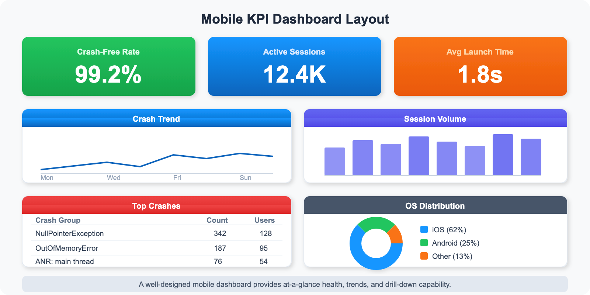
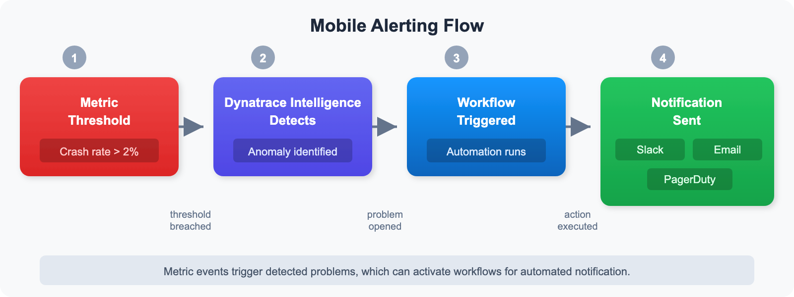

# MOBL-11: Dashboards & Alerting

> **Series:** MOBL | **Notebook:** 11 of 12 | **Created:** February 2026 | **Last Updated:** 02/24/2026

## Overview

Effective mobile monitoring requires more than raw telemetry -- you need dashboards that surface the right KPIs at a glance and alerts that notify the right people when something goes wrong. This notebook covers designing mobile KPI dashboards with tiles for crash-free rate, session volume, and performance trends; setting up crash rate monitoring with timeseries visualizations; tracking app performance metrics across user actions; and configuring alerts using Dynatrace Intelligence anomaly detection and metric events. The goal is to move from reactive troubleshooting to proactive mobile observability.

---

## Table of Contents

1. [Mobile KPI Dashboard Design](#kpi-dashboard-design)
2. [Crash Rate Monitoring](#crash-rate-monitoring)
3. [App Performance Metrics](#app-performance-metrics)
4. [Session Volume Trends](#session-volume-trends)
5. [Metric Alerts for Mobile](#metric-alerts)
6. [Detected Problem Correlation](#davis-problem-correlation)
7. [Executive Summary Tiles](#executive-summary)

---

## Prerequisites

| Requirement | Details |
|-------------|----------|
| **Dynatrace Environment** | SaaS with Grail enabled |
| **Permissions** | `rum.read`, `events.read`, `bizevents.read`, `metrics.read` |
| **Dashboard Permissions** | `document:documents:write` for creating and editing dashboards |
| **Workflow Permissions** | `automation:workflows:write` for configuring alert-triggered workflows |
| **Mobile App** | At least one mobile application with active sessions and crash data |
| **Prior Knowledge** | Familiarity with MOBL-01 through MOBL-10 recommended |

<a id="kpi-dashboard-design"></a>

## 1. Mobile KPI Dashboard Design

A well-designed mobile dashboard answers the question "Is our mobile app healthy right now?" at a glance. Rather than cramming every metric onto a single screen, organize tiles by purpose: health indicators at the top, trends in the middle, and drill-down tables at the bottom.



<!-- MARKDOWN_TABLE_ALTERNATIVE
| Row | Tile | Type | Purpose |
|-----|------|------|----------|
| Top | Crash-Free Rate | Single value | Overall app health indicator -- percentage of sessions without crashes |
| Top | Active Sessions | Single value | Current user engagement level |
| Middle | Session Volume | Timeseries | Usage trends over time to spot adoption changes |
| Middle | Action Duration | Timeseries | Performance monitoring for key user actions |
| Middle | Error Rate | Timeseries | Error monitoring to detect regressions early |
| Bottom | Top Crashes | Table | Prioritize fixes by crash frequency |
| Bottom | OS Distribution | Pie/Donut | Platform breakdown for resource allocation |
For environments where SVG doesn't render
-->

### Recommended Dashboard Layout

| Tile | Type | Purpose |
|------|------|----------|
| **Crash-Free Rate** | Single value | Overall app health indicator -- percentage of sessions without crashes |
| **Session Volume** | Timeseries | Usage trends over time to spot adoption changes or drops |
| **Top Crashes** | Table | Prioritize fixes by crash frequency and affected user count |
| **Action Duration** | Timeseries | Performance monitoring for key user actions (load, tap, swipe) |
| **OS Distribution** | Pie/Donut | Platform breakdown to allocate testing and development resources |
| **Error Rate** | Timeseries | Error monitoring to catch regressions before they become crashes |

### Design Principles

- **Top row: health at a glance** -- Use single-value tiles with color thresholds (green/yellow/red) for crash-free rate, active sessions, and error rate
- **Middle row: trends** -- Timeseries charts for session volume, action duration, and error trends over the last 7 days
- **Bottom row: drill-down** -- Tables for top crashes, slowest user actions, and most affected app versions
- **Use variables** -- Add a dashboard variable for `useraction.application` so stakeholders can filter to their specific app
- **Time range selector** -- Always include a time range control defaulting to the last 24 hours, with presets for 1h, 6h, 24h, 7d

<a id="crash-rate-monitoring"></a>

## 2. Crash Rate Monitoring

Crash rate is the most critical mobile KPI. App store algorithms use crash rate to determine visibility and ranking, and users who experience crashes are significantly more likely to uninstall. A crash-free rate below 99% typically indicates a serious quality problem.

The following query builds a daily timeseries showing both total event volume and crash event volume, which you can use to calculate crash rate as a derived metric in your dashboard.

```dql
// Crash rate timeseries by application
fetch bizevents, from:-7d
| filter event.provider == "www.dynatrace.com/mobile"
| fieldsAdd is_crash = if(event.type == "com.dynatrace.crash", then:1, else:0)
| makeTimeseries total_events = count(), crash_events = sum(is_crash), interval:1d
```

### Interpreting the Results

This query produces two timeseries arrays: `total_events` (all mobile business events) and `crash_events` (only crashes). To calculate the crash rate percentage on a dashboard tile, divide crash events by total events and multiply by 100. A healthy app should maintain a crash rate below 1%.

| Crash-Free Rate | Health Status | Action |
|----------------|---------------|--------|
| **> 99.5%** | Excellent | Monitor normally |
| **99.0% - 99.5%** | Acceptable | Review top crash groups |
| **98.0% - 99.0%** | Degraded | Investigate and prioritize fixes |
| **< 98.0%** | Critical | Immediate action required |

> **Tip:** Break crash rate down by app version using `by:{app.version}` to identify whether a specific release introduced a regression.

<a id="app-performance-metrics"></a>

## 3. App Performance Metrics

Beyond crashes, performance directly impacts user engagement. Slow app launches, sluggish screen transitions, and unresponsive taps all contribute to poor user experience and eventual churn. Track these metrics alongside crash data to get a complete picture of mobile app health.

The alerting flow for mobile performance follows a standard pattern from metric detection through notification:



<!-- MARKDOWN_TABLE_ALTERNATIVE
| Step | Stage | Description |
|------|-------|-------------|
| 1 | Metric Threshold Breached | A mobile KPI (crash rate, action duration, error count) crosses a configured threshold |
| 2 | Dynatrace Intelligence Detects Anomaly | Dynatrace Intelligence identifies the anomaly as a significant deviation from baseline behavior |
| 3 | Workflow Triggered | A Dynatrace workflow fires in response to the detected problem event |
| 4 | Notification Sent | The workflow delivers a notification via Slack, Email, PagerDuty, or other configured channel |
For environments where SVG doesn't render
-->

### Key Performance Indicators

| Metric | Good | Warning | Critical |
|--------|------|---------|----------|
| **App Launch Time** | < 2 seconds | 2-5 seconds | > 5 seconds |
| **Action Duration** | < 1 second | 1-3 seconds | > 3 seconds |
| **HTTP Error Rate** | < 1% | 1-5% | > 5% |
| **Crash-Free Rate** | > 99.5% | 98-99.5% | < 98% |

```dql
// Session volume timeseries (hourly)
fetch bizevents, from:-7d
| filter event.provider == "www.dynatrace.com/mobile"
| filter isNotNull(dt.rum.session.id)
| makeTimeseries session_count = countDistinct(dt.rum.session.id), interval:1h
```

This query counts the number of distinct sessions per hour over the past 7 days. Use it as a dashboard tile to spot usage patterns (peak hours, weekday vs weekend) and detect sudden drops that may indicate an outage or broken update.

<a id="session-volume-trends"></a>

## 4. Session Volume Trends

User action duration measures how long it takes for specific interactions to complete -- tapping a button, loading a screen, or submitting a form. Tracking these durations over time reveals performance regressions introduced by new releases or backend changes.

```dql
// User action duration trend by type
fetch bizevents, from:-24h
| filter event.provider == "www.dynatrace.com/mobile"
| filter isNotNull(useraction.duration)
| makeTimeseries avg_duration = avg(useraction.duration), by:{useraction.type}, interval:1h
```

### Reading the Duration Chart

The timeseries above breaks down average action duration by type (e.g., `Load`, `Tap`, `Swipe`, `Custom`). Look for:

- **Gradual increases** -- May indicate backend degradation or growing payload sizes
- **Sudden spikes** -- Often correlated with a new app release or backend deployment
- **Platform differences** -- Compare iOS vs Android by adding `by:{os.type}` to identify platform-specific bottlenecks

> **Note:** Action durations are captured in milliseconds. Divide by 1000 if you prefer to display values in seconds on your dashboard.

<a id="metric-alerts"></a>

## 5. Metric Alerts for Mobile

Dashboards are for humans looking at screens. Alerts are for ensuring problems are noticed even when nobody is watching. Dynatrace supports two complementary alerting mechanisms for mobile KPIs:

1. **Dynatrace Intelligence Anomaly Detection** -- Automatically detects deviations from baseline behavior without manual threshold configuration. Best for metrics with natural variance (session volume, action duration).
2. **Metric Events (Custom Alerts)** -- Manually defined thresholds that fire when a metric crosses a specific boundary. Best for hard limits (crash rate > X, error rate > Y).

### Recommended Alert Configuration

| Alert | Metric/Query | Threshold | Severity |
|-------|-------------|-----------|----------|
| **High Crash Rate** | Crash count per hour | > 10 crashes in a sliding 1-hour window | Critical |
| **Session Drop** | Session count drop | < 50% of the rolling 7-day baseline | Warning |
| **Slow App Launch** | App start duration | > 5 seconds average over 15 minutes | Warning |
| **High Error Rate** | HTTP 5xx from mobile | > 5% of requests returning server errors | Critical |

### Creating a Metric Event

To create a custom alert (metric event) in Dynatrace:

1. Navigate to **Settings** > **Anomaly Detection** > **Metric Events**
2. Click **Add metric event**
3. Configure the event:

```yaml
# Example: High crash rate alert
Summary: Mobile crash rate exceeds threshold
Type: Metric key
Metric key: dt.rum.mobile.crash.count  # (or use a DQL-based metric)
Aggregation: Count
Entity filter: Mobile application
Model type: Static threshold
Threshold: 10
Alert condition: Above
Sliding window: 1 hour
Dealerting samples: 3
Severity: Critical
```

### Dynatrace Intelligence vs Static Thresholds

| Approach | Best For | Limitations |
|----------|----------|-------------|
| **Dynatrace Intelligence** | Metrics with seasonal patterns, automatically adapts to baselines | May miss gradual degradation; requires learning period |
| **Static Threshold** | Hard business limits (SLAs, crash budgets) | Must be manually tuned; doesn't adapt to growth |
| **Both Combined** | Maximum coverage -- Dynatrace Intelligence catches anomalies, static thresholds enforce SLAs | More alerts to manage |

> **Tip:** Start with Dynatrace Intelligence for performance metrics (it adapts to your app's normal patterns) and add static thresholds only for KPIs with hard business requirements like crash-free rate SLAs.

<a id="davis-problem-correlation"></a>

## 6. Detected Problem Correlation

When Dynatrace Intelligence detects an anomaly affecting a mobile application, it creates a problem that can be correlated with the mobile telemetry you see on dashboards. The following query retrieves recent detected problems that impact mobile device applications, helping you bridge the gap between infrastructure-level detection and user-facing impact.

```dql
// detected problems affecting mobile applications
fetch dt.davis.problems, from:-7d
| expand affected_entity_ids
| filter contains(toString(affected_entity_ids), "DEVICE_APPLICATION")
| fields timestamp, display_id, event.name, event.status, affected_entity_ids
| sort timestamp desc
| limit 20
```

### Correlating Problems with Mobile Metrics

When you identify a detected problem affecting a mobile application, overlay the problem time range on your dashboard timeseries to see:

- **Did crash rate spike during the problem window?** -- If yes, the root cause likely caused crashes, not just slowdowns
- **Did session volume drop?** -- A sudden drop in sessions during a problem may indicate users are unable to launch the app
- **Did action duration increase?** -- Performance degradation detected by Dynatrace Intelligence should correlate with user-facing slowness

### Problem Workflow Integration

Connect detected problems to your notification channels so the mobile team is alerted immediately:

```yaml
# Workflow trigger for mobile-specific problems
trigger:
  type: davis-problem
  config:
    entityTagsMatch: any
    entityTags:
      - key: app-type
        value: mobile

tasks:
  - name: notify_mobile_team
    type: dynatrace.slack:send-message
    input:
      connection: slack-mobile-alerts
      channel: "#mobile-incidents"
      message: |
        :rotating_light: Mobile Problem Detected
        Problem: {{ event()['title'] }}
        Severity: {{ event()['severity'] }}
        Affected: {{ event()['affected_entity_ids'] | join(', ') }}
```

<a id="executive-summary"></a>

## 7. Executive Summary Tiles

Executive stakeholders need a single table that answers: "How are our mobile apps doing?" The following query produces a summary row per application with the key metrics that matter most -- total actions, unique sessions, crash count, and actions per session (an engagement indicator).

```dql
// Executive summary -- key metrics per mobile app
fetch bizevents, from:-24h
| filter event.provider == "www.dynatrace.com/mobile"
| summarize total_actions = count(), unique_sessions = countDistinct(dt.rum.session.id), crash_count = countIf(event.type == "com.dynatrace.crash"), by:{useraction.application}
| fieldsAdd actions_per_session = toDouble(total_actions) / toDouble(unique_sessions)
| sort total_actions desc
| limit 10
```

### Building the Executive Dashboard

Use the query above as a table tile on your dashboard. Add conditional formatting to highlight:

- **Crash count > 0** in red to draw attention to apps with active stability issues
- **Actions per session < 3** in yellow to flag apps with low user engagement
- **Unique sessions** trending down week-over-week as a leading indicator of user attrition

### Dashboard Sharing

| Audience | Dashboard Focus | Refresh Interval |
|----------|----------------|-------------------|
| **Mobile Developers** | Crash details, stack traces, action performance | 5 minutes |
| **QA Team** | Crash-free rate by version, error trends | 15 minutes |
| **Product Managers** | Session volume, engagement, feature adoption | 1 hour |
| **Executives** | Summary KPIs, crash-free rate, active users | Daily snapshot |

> **Tip:** Use Dynatrace dashboard sharing to send scheduled PDF snapshots to stakeholders who do not log into Dynatrace directly.

---

## Summary

In this notebook, you learned:

- **Dashboard design principles** -- Organize tiles by purpose (health indicators at top, trends in middle, drill-down tables at bottom) with application-level filtering
- **Crash rate monitoring** -- Build a timeseries comparing total events to crash events, and interpret crash-free rate thresholds
- **App performance metrics** -- Track session volume and user action duration to detect regressions and correlate with backend changes
- **Session volume trends** -- Identify usage patterns, peak hours, and sudden drops that may indicate outages
- **Metric alerts** -- Configure Dynatrace Intelligence anomaly detection for adaptive baselines and static thresholds for hard SLA limits
- **detected problem correlation** -- Query problems affecting mobile applications and overlay them with dashboard timeseries
- **Executive summary tiles** -- Build single-table summaries with total actions, unique sessions, crash count, and engagement metrics

---

## Next Steps

Continue to **MOBL-12** to explore:
- Advanced mobile analytics and business impact analysis
- Funnel analysis for mobile conversion tracking
- Combining mobile telemetry with business events for end-to-end visibility

---

## References

- [Dynatrace Dashboards](https://docs.dynatrace.com/docs/observe-and-explore/dashboards-and-notebooks/dashboards)
- [Metric Events for Alerting](https://docs.dynatrace.com/docs/observe-and-explore/davis-ai/anomaly-detection/metric-events-for-alerting)
- [Mobile App Monitoring](https://docs.dynatrace.com/docs/platform-modules/digital-experience/mobile-applications)
- [Dynatrace Intelligence Problems](https://docs.dynatrace.com/docs/observe-and-explore/davis-ai/davis-ai-problems)
- [Workflows for Alerting](https://docs.dynatrace.com/docs/platform/workflows)

---

<sub>*This notebook was AI-generated from community-submitted and publicly available sources. This notebook series is not officially supported by Dynatrace. Always verify information against official Dynatrace documentation.*</sub>
