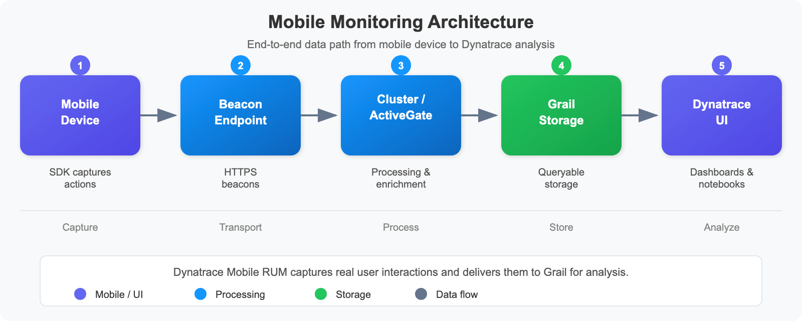
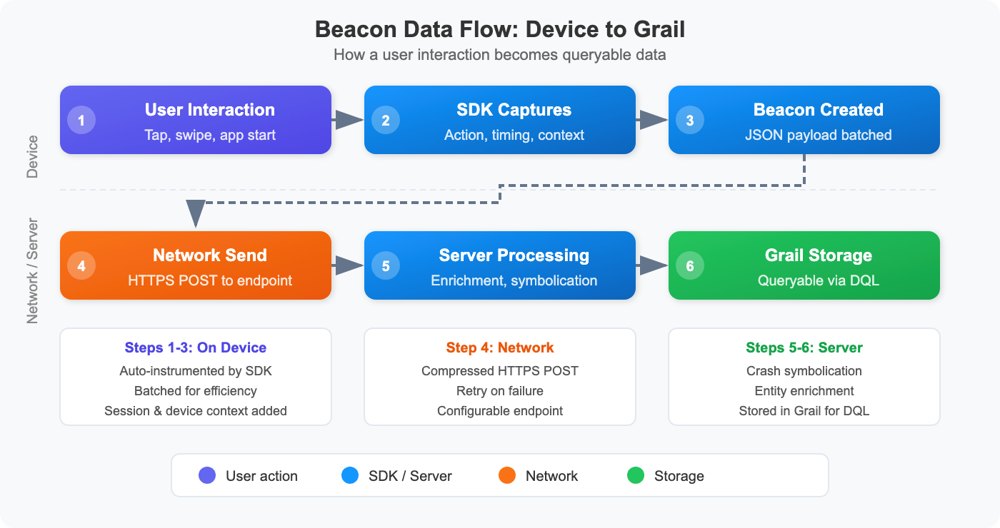

# MOBL-01: Mobile Monitoring Fundamentals

> **Series:** MOBL | **Notebook:** 1 of 12 | **Created:** February 2026 | **Last Updated:** 02/24/2026

## Overview

This notebook introduces Dynatrace mobile Real User Monitoring (RUM) -- the architecture, supported platforms, mobile entity types, and how beacon data flows from device to Grail. Whether you're a mobile developer instrumenting an app or an SRE analyzing mobile performance, this is your starting point.

---

## Table of Contents

1. [What is Mobile RUM?](#what-is-mobile-rum)
2. [Mobile Monitoring Architecture](#mobile-monitoring-architecture)
3. [Supported Platforms & SDKs](#supported-platforms)
4. [Mobile Entity Types](#mobile-entity-types)
5. [Data Flow: Beacon to Grail](#beacon-data-flow)
6. [Mobile vs Web RUM](#mobile-vs-web-rum)
7. [Getting Started Checklist](#getting-started-checklist)

---

## Prerequisites

| Requirement | Details |
|-------------|---------|
| **Dynatrace Environment** | SaaS with Grail enabled |
| **Permissions** | `rum.read`, `entities.read` |
| **Mobile App** | At least one configured mobile application |

<a id="what-is-mobile-rum"></a>

## 1. What is Mobile RUM?

**Real User Monitoring (RUM)** for mobile captures what real users experience when they interact with your native mobile applications. Unlike synthetic monitoring that simulates users, mobile RUM records actual sessions from real devices in the field.

Dynatrace mobile RUM automatically captures:

- **User actions** -- taps, swipes, screen loads, and custom actions
- **Sessions** -- complete user journeys from app launch to background/close
- **Crashes and ANRs** -- native crashes, unhandled exceptions, and Android Application Not Responding events
- **Network requests** -- all HTTP/HTTPS calls made by the app, including response times and errors
- **Device context** -- OS version, device model, carrier, connection type, battery level

### Key Mobile Metrics

| Metric | Description | Why It Matters |
|--------|-------------|----------------|
| **App Launch Time** | Time from tap to first interactive screen | Directly impacts user retention |
| **Crash Rate** | Percentage of sessions with a crash | Top driver of app store ratings |
| **User Actions per Session** | Average number of interactions | Measures engagement depth |
| **Network Error Rate** | Percentage of failed HTTP requests | Indicates backend or connectivity issues |
| **Session Duration** | Average time users spend in the app | Correlates with business value |
| **Apdex Score** | User satisfaction index (0-1) | Single number summarizing performance |

<a id="mobile-monitoring-architecture"></a>

## 2. Mobile Monitoring Architecture



<!-- MARKDOWN_TABLE_ALTERNATIVE
| Component | Role |
|-----------|------|
| Mobile SDK | Embedded in the app; captures user actions, crashes, network requests |
| Beacon Endpoint | HTTPS endpoint that receives beacon payloads from mobile devices |
| Cluster / ActiveGate | Processes, enriches, and routes beacon data |
| Grail Storage | Long-term storage for all mobile telemetry data |
| Dynatrace UI | Dashboards, notebooks, and analysis tools for mobile data |
For environments where SVG doesn't render
-->

### How It Works

1. **SDK embedded in app** -- The Dynatrace mobile SDK is integrated into your app during the build process. It hooks into lifecycle events, network layers, and crash handlers automatically.
2. **Collects telemetry** -- As users interact with the app, the SDK captures user actions (taps, screen loads), network requests (URL, status code, duration), crashes (stack traces, thread state), and device context.
3. **Sends beacons** -- Captured data is packaged into beacon payloads (compressed JSON) and sent to the Dynatrace beacon endpoint over HTTPS. Beacons are batched and buffered for efficiency.
4. **Processed by cluster** -- The cluster (or ActiveGate) receives beacons, validates them, enriches with server-side correlation data, and normalizes fields.
5. **Stored in Grail** -- Processed mobile data is stored in Grail, making it queryable via DQL alongside logs, spans, metrics, and other telemetry.
6. **Analyzed in UI** -- Use Dynatrace dashboards, notebooks, and the mobile app overview to visualize performance, detect regressions, and drill into individual sessions.

<a id="supported-platforms"></a>

## 3. Supported Platforms & SDKs

Dynatrace provides native SDKs for all major mobile platforms and cross-platform frameworks:

| Platform | SDK | Language | Auto-Instrumentation |
|----------|-----|----------|---------------------|
| iOS | Dynatrace iOS Agent | Swift, Objective-C | UIKit (full), SwiftUI (partial) |
| Android | Dynatrace Android Agent | Kotlin, Java | Activities, Fragments |
| Flutter | dynatrace_flutter_plugin | Dart | Navigation, HTTP |
| React Native | @dynatrace/react-native-plugin | JavaScript/TypeScript | Navigation, Fetch/XHR |
| Cordova | dynatrace-cordova-plugin | JavaScript | WebView-based |
| Xamarin | Dynatrace Xamarin Agent | C# | Platform views |

### SDK Integration Methods

| Method | Description | Best For |
|--------|-------------|----------|
| **Auto-instrumentation** | SDK automatically captures lifecycle events, network calls, and crashes | Most applications; fastest setup |
| **Manual instrumentation** | Developer explicitly starts/ends actions and reports values | Custom user actions, business events |
| **Hybrid** | Auto-instrumentation + manual calls for custom events | Best of both worlds |

> **Note:** Auto-instrumentation coverage varies by platform. iOS UIKit has the broadest auto-instrumentation. SwiftUI and Jetpack Compose require more manual instrumentation for view-level tracking.

<a id="mobile-entity-types"></a>

## 4. Mobile Entity Types

Dynatrace models mobile monitoring data using specific entity types and data objects:

| Entity Type | DQL Identifier | Description |
|-------------|---------------|-------------|
| Mobile Application | `dt.entity.device_application` | The configured mobile app (iOS, Android, or hybrid) |
| User Action | N/A (bizevents) | Tap, swipe, screen load, or custom action |
| Session | N/A (bizevents) | User session container linking all actions in a visit |
| Network Request | N/A (bizevents) | HTTP request initiated by the mobile app |
| Crash | N/A (events) | Native crash, ANR, or unhandled exception |

> **Note:** Mobile user actions, sessions, and network requests are stored as business events (bizevents) in Grail, not as traditional entities. Crashes appear as events. The `dt.entity.device_application` entity represents the configured app itself.

### Querying Mobile App Entities

The following query lists all configured mobile applications in your environment:

```dql
// List all configured mobile applications
fetch dt.entity.device_application
| fields entity.name, id, tags
| sort entity.name asc
```

<a id="beacon-data-flow"></a>

## 5. Data Flow: Beacon to Grail



<!-- MARKDOWN_TABLE_ALTERNATIVE
| Step | Stage | Description |
|------|-------|-------------|
| 1 | User Interaction | User taps a button, loads a screen, or triggers a network request |
| 2 | SDK Capture | The Dynatrace SDK captures the action with timing, context, and metadata |
| 3 | Beacon Creation | Captured data is serialized into a beacon payload (compressed JSON) |
| 4 | Beacon Transmission | Beacon is sent to the Dynatrace beacon endpoint over HTTPS |
| 5 | Processing & Enrichment | Cluster processes the beacon, correlates with server-side data, enriches fields |
| 6 | Grail Storage | Processed data is stored in Grail for querying via DQL |
For environments where SVG doesn't render
-->

### Beacon Lifecycle Details

**Batching:** The SDK does not send a beacon for every individual action. Instead, it batches multiple events into a single beacon payload to reduce network overhead and battery consumption.

**Offline Buffering:** When the device has no network connectivity, the SDK buffers beacons locally. Once connectivity is restored, buffered beacons are sent in order. This ensures no data is lost during subway rides, airplane mode, or poor signal areas.

**Compression:** Beacon payloads are compressed before transmission to minimize bandwidth usage, which is especially important for users on metered cellular connections.

**Session Correlation:** Each beacon includes a session ID that links all actions from a single user visit. The cluster uses this to reconstruct the full session timeline.

### Counting Mobile Applications by Name

Use the following query to see a summary of your configured mobile applications:

```dql
// Count mobile applications by operating system type
fetch dt.entity.device_application
| summarize app_count = count(), by:{entity.name}
| sort app_count desc
```

<a id="mobile-vs-web-rum"></a>

## 6. Mobile vs Web RUM

Understanding the differences between mobile and web RUM helps you choose the right approach and set correct expectations for each platform:

| Aspect | Mobile RUM | Web RUM |
|--------|-----------|--------|
| **Entity type** | `dt.entity.device_application` | `dt.entity.application` |
| **Instrumentation** | Native SDK embedded in app binary | JavaScript tag injected into page |
| **Crash detection** | Native crash, ANR, unhandled exception | JavaScript errors, promise rejections |
| **Network monitoring** | All HTTP/HTTPS calls from the app | XHR, Fetch API calls |
| **Session replay** | Screen recording (visual replay) | DOM replay (HTML reconstruction) |
| **Offline capability** | Beacon buffering (data saved locally) | No (requires active connectivity) |
| **Distribution** | App stores (Apple App Store, Google Play) | Web deployment (CDN, server) |
| **Update cycle** | Users must update the app | Instant (server-side deployment) |
| **Device diversity** | Thousands of device/OS combinations | Browser/OS combinations |
| **Performance factors** | CPU, memory, battery, network type | Browser rendering, network latency |

### Key Implications

- **Version fragmentation:** Mobile apps have multiple versions in the wild simultaneously. Your DQL queries should account for `app.version` when analyzing performance.
- **Offline data gaps:** Mobile beacons may arrive hours or days after the actual user action if the device was offline. Time-based queries should consider this latency.
- **Platform-specific issues:** iOS and Android have different crash signatures, lifecycle events, and performance characteristics. Analyze them separately when troubleshooting.

<a id="getting-started-checklist"></a>

## 7. Getting Started Checklist

Follow these steps to set up mobile monitoring for your application:

1. **Create a mobile application in Dynatrace** -- Navigate to the Mobile section in the Dynatrace UI and create a new application configuration. Choose the correct platform (iOS, Android, or hybrid).

2. **Integrate the SDK** -- Add the Dynatrace mobile SDK to your app's build system (CocoaPods/SPM for iOS, Gradle for Android, npm for React Native/Flutter). Follow the platform-specific setup guide.

3. **Configure the app ID and beacon URL** -- Set the application ID and beacon endpoint URL provided by Dynatrace in your SDK configuration file.

4. **Build and test** -- Build the app with the SDK integrated, launch it on a test device, and verify that sessions appear in the Dynatrace UI within a few minutes.

5. **Verify data in Grail** -- Use DQL to confirm that mobile telemetry is flowing into Grail. Run the entity query below to check your app appears.

6. **Configure user action naming rules** -- Customize how user actions are named in Dynatrace to make them meaningful for your team (e.g., "Tap on Checkout" instead of generic "Touch on Button").

7. **Set up crash symbolication** -- Upload dSYM files (iOS) or ProGuard/R8 mapping files (Android) so that crash stack traces show human-readable class and method names.

8. **Enable session replay (optional)** -- Turn on mobile session replay to capture visual recordings of user sessions for debugging UI issues.

9. **Define custom actions (optional)** -- Use the SDK API to report custom user actions and business events that are specific to your app's workflow.

10. **Create dashboards and alerts** -- Build dashboards for crash rate, app launch time, and network errors. Set up alerting profiles for anomaly detection.

### Verify Your Mobile App Configuration

Run this query to confirm your mobile applications are configured and visible in Dynatrace:

```dql
// Mobile app inventory overview
fetch dt.entity.device_application
| fields entity.name, id, lifetime, tags
| sort entity.name asc
| limit 20
```

---

## Summary

In this notebook, you learned:

- **What mobile RUM is** and the key metrics it captures (app launch time, crash rate, user actions per session, network error rate)
- **Mobile monitoring architecture** -- how the SDK, beacon endpoint, cluster, and Grail work together
- **Supported platforms** -- iOS, Android, Flutter, React Native, Cordova, and Xamarin SDKs
- **Mobile entity types** -- `dt.entity.device_application` for apps, plus bizevents for actions, sessions, and network requests
- **Beacon data flow** -- batching, offline buffering, compression, and session correlation
- **Mobile vs Web RUM differences** -- entity types, instrumentation methods, offline capability, and platform-specific considerations
- **Getting started steps** -- from SDK integration through dashboard creation

---

## Next Steps

Continue to **MOBL-02: Mobile Session Analysis** to learn:
- Querying mobile user sessions with DQL
- Analyzing session duration, action count, and crash correlation
- Filtering sessions by app version, OS, and device model
- Building session funnels for conversion analysis

---

<sub>*This notebook was AI-generated from community-submitted and publicly available sources. This notebook series is not officially supported by Dynatrace. Always verify information against official Dynatrace documentation.*</sub>
