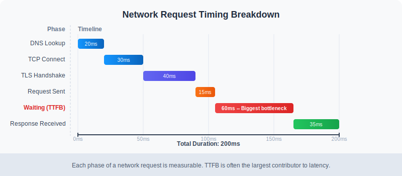
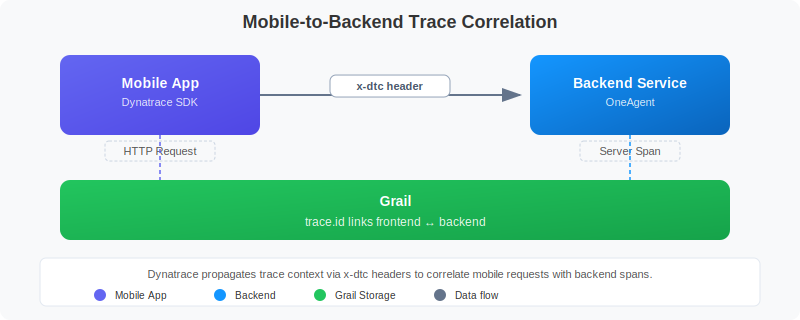

# MOBL-07: Network Request Monitoring

> **Series:** MOBL | **Notebook:** 7 of 12 | **Created:** February 2026 | **Last Updated:** 02/24/2026

## Overview

Every mobile app depends on the network. Whether it is fetching user profiles, loading product catalogs, or submitting orders, HTTP(S) requests are the lifeline between a mobile frontend and its backend services. Dynatrace automatically captures these network requests from instrumented mobile apps, providing deep visibility into:

- **What** is being requested (URL, method, status code)
- **How long** each request takes (with full timing breakdown)
- **How much** data is transferred (request and response sizes)
- **What connection** the device is using (WiFi, 5G, LTE, 3G)
- **Where** the request goes on the backend (distributed trace correlation)

This notebook explains how Dynatrace captures network requests across platforms, how to query and analyze them with DQL, and how to identify slow or failed requests that degrade the mobile user experience.

---

## Table of Contents

1. [Automatic HTTP Capture](#automatic-http-capture)
2. [Connection Type Detection](#connection-type-detection)
3. [Request Timing Breakdown](#request-timing-breakdown)
4. [Frontend-to-Backend Correlation](#frontend-backend-correlation)
5. [Querying Network Requests](#querying-network-requests)
6. [Slow & Failed Requests](#slow-failed-requests)
7. [Performance Optimization Tips](#performance-optimization)

---

## Prerequisites

| Requirement | Details |
|-------------|----------|
| **Dynatrace Environment** | SaaS or Managed with Grail enabled |
| **Mobile App Instrumented** | Dynatrace Mobile SDK deployed (iOS, Android, Flutter, or React Native) |
| **Network Requests** | Mobile app actively making HTTP(S) requests being captured by the SDK |
| **Permissions** | `bizevents.read`, `spans.read` |
| **Distributed Tracing** | Backend services instrumented with OneAgent or OpenTelemetry for correlation |

<a id="automatic-http-capture"></a>

## 1. Automatic HTTP Capture

The Dynatrace Mobile SDK automatically intercepts HTTP(S) requests made through standard networking libraries on each platform. No manual instrumentation is required for the libraries listed below.

### Supported Platforms and Libraries

| Platform | HTTP Library | Auto-Captured |
|----------|-------------|---------------|
| iOS | URLSession | Yes |
| iOS | Alamofire (URLSession-based) | Yes |
| Android | OkHttp | Yes |
| Android | HttpURLConnection | Yes |
| Flutter | dart:io HttpClient | Yes |
| React Native | Fetch API, XMLHttpRequest | Yes |

> **Note:** Third-party libraries that use non-standard HTTP stacks (e.g., custom socket implementations) may require manual instrumentation. Check the Dynatrace documentation for your specific SDK version.

### Data Captured Per Request

For each intercepted network request, the SDK captures:

| Data Point | Description |
|------------|-------------|
| **URL** | Full request URL (query parameters may be redacted based on privacy settings) |
| **HTTP Method** | GET, POST, PUT, DELETE, PATCH, etc. |
| **Status Code** | HTTP response status code (200, 404, 500, etc.) |
| **Request Size** | Size of the request body in bytes |
| **Response Size** | Size of the response body in bytes |
| **Duration** | Total time from request initiation to response completion |
| **Connection Type** | Network connection type at the time of the request (WiFi, LTE, 5G, etc.) |

The SDK batches captured data and sends it to the Dynatrace cluster at regular intervals, minimizing the performance impact on the mobile app.

<a id="connection-type-detection"></a>

## 2. Connection Type Detection

Understanding the network conditions under which requests are made is critical for diagnosing performance issues. A request that takes 3 seconds over a 2G connection is expected, but the same latency over WiFi signals a backend problem.



<!-- MARKDOWN_TABLE_ALTERNATIVE
| Phase | Description | Typical Duration |
|-------|-------------|------------------|
| DNS Lookup | Resolves domain to IP address | 1-50ms (WiFi), 50-200ms (cellular) |
| TCP Connect | Establishes TCP connection | 10-50ms (WiFi), 50-300ms (cellular) |
| TLS Handshake | Negotiates secure connection | 20-100ms (WiFi), 100-500ms (cellular) |
| Request Sent | Transmits request payload | Varies by payload size |
| Waiting (TTFB) | Server processing time | Varies by backend logic |
| Response Received | Downloads response payload | Varies by response size and bandwidth |
For environments where SVG doesn't render
-->

### Connection Types

The SDK detects the following connection types at the time each request is made:

| Type | Description |
|------|-------------|
| **WiFi** | Connected via WiFi network |
| **5G** | 5th generation cellular network |
| **LTE/4G** | 4th generation cellular network |
| **3G** | 3rd generation cellular network |
| **2G** | 2nd generation cellular network |
| **Offline** | No connectivity (request buffered for later transmission) |

Connection type is stored alongside each network request event, enabling you to:

- **Segment performance by connection type** to set realistic SLOs
- **Identify users on poor connections** who experience degraded performance
- **Build adaptive behavior** in your app based on detected connection quality

<a id="request-timing-breakdown"></a>

## 3. Request Timing Breakdown

A single network request goes through multiple phases, each of which can contribute to perceived latency. Understanding these phases helps pinpoint whether a performance issue originates from the network, the server, or the client.

### Timing Phases

| Phase | What Happens | What a Slow Phase Indicates |
|-------|-------------|-----------------------------|
| **DNS Lookup** | Resolves the domain name to an IP address | DNS server issues, missing DNS cache, poor network conditions |
| **TCP Connect** | Establishes a TCP connection to the server | Network latency, server unreachable, firewall delays |
| **TLS Handshake** | Negotiates the TLS/SSL secure connection | Certificate chain issues, slow TLS negotiation, outdated cipher suites |
| **Request Sent** | Transmits the HTTP request body to the server | Large request payload, low upload bandwidth |
| **Waiting (TTFB)** | Time to First Byte -- server processes the request | Slow backend logic, database queries, cold starts, overloaded services |
| **Response Received** | Downloads the HTTP response body | Large response payload, low download bandwidth, connection throttling |

### Diagnostic Guide

| Symptom | Likely Cause | Investigation |
|---------|-------------|---------------|
| High DNS time | DNS resolution issues | Check DNS provider, enable DNS caching |
| High TCP Connect time | Network path issues | Check CDN proximity, network hops |
| High TLS time | Certificate or cipher issues | Verify certificate chain, enable TLS session resumption |
| High TTFB | Backend performance | Check backend traces, database queries, cold starts |
| High Response time | Large payloads | Enable compression, paginate responses, reduce payload size |

> **Tip:** When TTFB is the dominant phase, the problem is almost always on the backend. Use the frontend-to-backend correlation (Section 4) to trace the request into your server-side services.

<a id="frontend-backend-correlation"></a>

## 4. Frontend-to-Backend Correlation

One of the most powerful features of Dynatrace mobile monitoring is the ability to correlate a network request on the mobile device with the corresponding backend service trace. This creates end-to-end visibility from the user's finger tap to the database query.



<!-- MARKDOWN_TABLE_ALTERNATIVE
| Step | Component | Action |
|------|-----------|--------|
| 1 | Mobile App | Initiates HTTP request |
| 2 | Dynatrace SDK | Injects x-dtc header into request |
| 3 | Network | Request travels to backend |
| 4 | Backend Service | Receives request with x-dtc header |
| 5 | OneAgent/OTel | Creates server-side span linked to mobile trace |
| 6 | Dynatrace | Stitches mobile action and backend trace into unified distributed trace |
For environments where SVG doesn't render
-->

### How It Works

1. **Request Initiation** -- The mobile app makes an HTTP(S) request using a standard networking library.
2. **Header Injection** -- The Dynatrace Mobile SDK automatically injects the `x-dtc` (Dynatrace correlation) header into the outgoing request. This header carries the trace context.
3. **Backend Processing** -- The backend service (instrumented with OneAgent or OpenTelemetry) reads the `x-dtc` header and creates a server-side span that is linked to the mobile trace.
4. **Trace Stitching** -- Dynatrace automatically stitches the mobile user action and the backend service call into a unified distributed trace.

### What This Enables

| Capability | Description |
|------------|-------------|
| **End-to-end latency** | See total time from mobile request to backend response |
| **Backend root cause** | When TTFB is high, drill into the exact backend service, method, and database call |
| **Service dependency mapping** | Understand which backend services support which mobile features |
| **Error correlation** | Link a mobile HTTP 500 error to the specific backend exception |

> **Important:** For correlation to work, the backend service must be instrumented with Dynatrace OneAgent or a compatible OpenTelemetry setup that understands the `x-dtc` header format.

<a id="querying-network-requests"></a>

## 5. Querying Network Requests

Network requests from mobile apps are stored as business events in Grail. The following queries demonstrate how to retrieve, aggregate, and analyze mobile network request data.

### Recent Network Requests

Retrieve the most recent network requests from mobile applications, showing the key attributes for each request.

```dql
// Recent network requests from mobile apps
fetch bizevents, from:-1h
| filter event.provider == "www.dynatrace.com/mobile"
| filter isNotNull(http.url)
| fields timestamp, useraction.application, http.url, http.method, http.status_code, connection.type
| sort timestamp desc
| limit 50
```

### Network Request Volume by Application

Understand which mobile applications are generating the most network traffic. This helps identify apps that may need optimization or capacity planning.

```dql
// Network request volume by application
fetch bizevents, from:-1h
| filter event.provider == "www.dynatrace.com/mobile"
| filter isNotNull(http.url)
| summarize request_count = count(), by:{useraction.application}
| sort request_count desc
| limit 20
```

### Backend Response Times for Mobile Requests

Query the backend spans that were correlated with mobile-originated requests. The `x-dtc` header presence indicates the request originated from a Dynatrace-instrumented mobile app.

```dql
// Backend response times for mobile-originated requests
fetch spans, from:-1h
| filter span.kind == "server"
| filter isNotNull(http.request.header.x-dtc)
| summarize avg_duration = avg(duration), request_count = count(), by:{service.name}
| sort avg_duration desc
| limit 20
```

<a id="slow-failed-requests"></a>

## 6. Slow & Failed Requests

Monitoring network request performance over time helps you detect regressions, correlate with deployments, and identify patterns. The following queries create time-series visualizations for request volume and error rates.

### Request Volume Over Time

Track how network request volume changes throughout the day for each mobile application.

```dql
// Network request volume timeseries by application
fetch bizevents, from:-24h
| filter event.provider == "www.dynatrace.com/mobile"
| filter isNotNull(http.url)
| makeTimeseries request_count = count(), by:{useraction.application}, interval:1h
```

### Request Volume by Status Code Group

Categorize network requests by HTTP status code group (2xx, 3xx, 4xx, 5xx) to visualize error trends over time. A rising 4xx or 5xx trend may indicate API issues or backend failures.

```dql
// Network request volume over time by status code group
fetch bizevents, from:-24h
| filter event.provider == "www.dynatrace.com/mobile"
| filter isNotNull(http.status_code)
| fieldsAdd status_group = if(http.status_code < 300, then:"2xx Success", else:if(http.status_code < 400, then:"3xx Redirect", else:if(http.status_code < 500, then:"4xx Client Error", else:"5xx Server Error")))
| makeTimeseries request_count = count(), by:{status_group}, interval:1h
```

### Interpreting the Results

| Pattern | What It Means | Action |
|---------|---------------|--------|
| **Spike in 5xx errors** | Backend service failures | Check backend service health, recent deployments |
| **Rising 4xx errors** | Client-side issues (bad URLs, auth failures) | Review API contracts, check token expiration logic |
| **Request volume drop** | Users abandoning the app or connectivity issues | Check app crash rates, network availability |
| **Slow upward trend** | Growing user base or increased API chattiness | Plan capacity, consider request batching |

<a id="performance-optimization"></a>

## 7. Performance Optimization Tips

Once you have visibility into your mobile network requests, apply these optimization strategies to improve the user experience.

### Reduce Payload Sizes

| Strategy | Impact |
|----------|--------|
| **Enable gzip/brotli compression** | Reduces response size by 60-80% |
| **Use pagination** | Avoid loading entire datasets at once |
| **Return only needed fields** | Use GraphQL or sparse fieldsets to minimize JSON payloads |
| **Optimize images** | Serve appropriately sized images via CDN with content negotiation |

### Minimize Round Trips

| Strategy | Impact |
|----------|--------|
| **Batch API calls** | Combine multiple requests into a single endpoint |
| **Use HTTP/2 or HTTP/3** | Multiplexing reduces connection overhead |
| **Implement prefetching** | Load data before the user navigates to a screen |
| **Cache responses** | Use ETags and Cache-Control headers to avoid redundant requests |

### Leverage CDNs

| Strategy | Impact |
|----------|--------|
| **Static asset delivery** | Serve images, scripts, and configs from edge locations |
| **API acceleration** | Some CDNs offer API caching and edge compute |
| **Geographic proximity** | Reduces DNS, TCP, and TLS times for global users |

### Adapt to Connection Type

| Strategy | Impact |
|----------|--------|
| **Detect connection type** | Use the SDK's connection type data to adjust app behavior |
| **Low-bandwidth mode** | Reduce image quality, defer non-critical requests on slow connections |
| **Offline support** | Queue requests when offline, sync when connectivity returns |
| **Progressive loading** | Load essential content first, enrich progressively |

> **Tip:** Combine Dynatrace mobile monitoring data with your CDN analytics to get a complete picture of content delivery performance from edge to device.

## Summary

In this notebook, we covered:

- **Automatic HTTP capture** across iOS, Android, Flutter, and React Native platforms
- **Connection type detection** and how network conditions affect request performance
- **Request timing breakdown** with the six phases of an HTTP request and diagnostic guidance
- **Frontend-to-backend correlation** via the `x-dtc` header for end-to-end distributed tracing
- **DQL queries** to retrieve, aggregate, and visualize mobile network request data
- **Slow and failed request analysis** using status code grouping and time-series trends
- **Performance optimization tips** covering payload reduction, round-trip minimization, CDN usage, and adaptive behavior

Network requests are the most tangible touchpoint between your mobile app and your backend infrastructure. Monitoring them effectively ensures you can detect, diagnose, and resolve performance issues before they impact your users.

## Next Steps

Continue to **MOBL-08** to explore crash analysis and error tracking for mobile applications, including how to correlate crashes with network request failures and backend errors.

### Related Notebooks

| Notebook | Topic |
|----------|-------|
| **MOBL-06** | User Session Analysis |
| **MOBL-08** | Crash Analysis & Error Tracking |
| **SPANS-01** | Distributed Tracing Fundamentals |

## References

- [Dynatrace Mobile App Monitoring](https://docs.dynatrace.com/docs/platform-modules/digital-experience/mobile-applications)
- [Dynatrace Mobile SDK Documentation](https://docs.dynatrace.com/docs/platform-modules/digital-experience/mobile-applications/instrument-mobile-apps)
- [Distributed Tracing with Mobile Apps](https://docs.dynatrace.com/docs/platform-modules/applications-and-microservices/distributed-tracing)
- [DQL Business Events Reference](https://docs.dynatrace.com/docs/platform/grail/dynatrace-query-language)

---

<sub>*This notebook was AI-generated from community-submitted and publicly available sources. This notebook series is not officially supported by Dynatrace. Always verify information against official Dynatrace documentation.*</sub>
