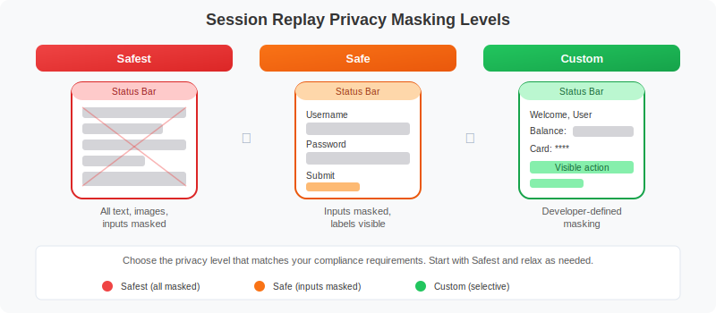

# MOBL-08: Session Replay for Mobile

> **Series:** MOBL | **Notebook:** 8 of 12 | **Created:** February 2026 | **Last Updated:** 02/24/2026

## Overview

Mobile Session Replay captures visual recordings of user sessions for debugging and UX analysis. Unlike traditional screen recording, Session Replay reconstructs the UI state from lightweight instrumentation data, making it efficient for production use. This notebook covers enabling Session Replay, configuring privacy masking, tuning sampling strategies to control costs, leveraging crash replay, and querying session data with DQL.

---

## Table of Contents

1. [What is Mobile Session Replay?](#what-is-session-replay)
2. [Enabling Session Replay](#enabling-session-replay)
3. [Privacy Masking Levels](#privacy-masking-levels)
4. [Sampling & Cost Control](#sampling-cost-control)
5. [Crash Session Replay](#crash-session-replay)
6. [Platform Configuration](#platform-configuration)
7. [Querying Session Data](#querying-session-data)

---

## Prerequisites

| Requirement | Details |
|-------------|----------|
| **Dynatrace Environment** | SaaS or Managed with Grail enabled |
| **Mobile SDK** | Dynatrace Mobile SDK 8.x or later |
| **Session Replay License** | DEM units with Session Replay entitlement |
| **Permissions** | `rum.read`, `bizevents.read` |
| **Platform** | iOS 13+ or Android API 21+ |
| **Data** | At least 24 hours of mobile user action data |

<a id="what-is-session-replay"></a>

## 1. What is Mobile Session Replay?

Mobile Session Replay provides a visual reconstruction of how users interact with your mobile application. It is **not** a video recording. Instead, the Dynatrace SDK captures UI state changes (screen transitions, taps, scrolls, text input) and transmits lightweight event data that Dynatrace reconstructs into a visual playback.

### How It Works

1. **UI state capture** -- The SDK observes the view hierarchy and records changes such as screen loads, element visibility, user gestures, and text field focus events.
2. **Delta transmission** -- Only changes (deltas) are sent to the Dynatrace cluster, minimizing network overhead and battery impact.
3. **Server-side reconstruction** -- Dynatrace reconstructs the visual session from the captured deltas, rendering a frame-by-frame playback in the web UI.

### Key Use Cases

| Use Case | Description |
|----------|-------------|
| **Bug reproduction** | Watch exactly what the user did before encountering an error, eliminating guesswork |
| **UX friction analysis** | Identify confusing navigation patterns, rage taps, and abandoned flows |
| **Crash context** | View the session leading up to a crash to understand the sequence of events |
| **Conversion optimization** | Trace drop-off points in checkout or onboarding funnels |
| **Support escalation** | Attach session replays to support tickets for faster resolution |

### Lightweight by Design

Because Session Replay captures UI state rather than pixels, it has minimal impact on:

- **Battery life** -- No continuous screen capture or encoding
- **Network bandwidth** -- Delta-based transmission typically adds < 50 KB per session
- **App performance** -- Observation hooks run on background threads

> **Note:** Session Replay quality depends on SDK version and platform. Native iOS and Android apps provide the richest replay; cross-platform frameworks (React Native, Flutter) may have limitations on custom component rendering.

<a id="enabling-session-replay"></a>

## 2. Enabling Session Replay

Session Replay must be enabled at two levels: the **Dynatrace server side** (application settings) and the **mobile SDK configuration**.

### Server-Side Activation

1. Navigate to **Mobile** in the Dynatrace menu.
2. Select your mobile application.
3. Go to **Settings > Session Replay**.
4. Toggle **Enable Session Replay** to on.
5. Configure the **sample rate** (percentage of sessions to capture).
6. Save changes.

### iOS SDK Configuration

Add the following keys to your `Info.plist`:

```xml
<key>DTXSessionReplayEnabled</key>
<true/>
<key>DTXSessionReplayPrivacyMode</key>
<string>SAFE</string>
<key>DTXSessionReplaySampleRate</key>
<integer>10</integer>
<key>DTXSessionReplayOnCrash</key>
<true/>
```

### Android SDK Configuration

Add the Session Replay settings in your `build.gradle` or `dynatrace` configuration block:

```groovy
dynatrace {
    configurations {
        defaultConfig {
            autoStart {
                applicationId "your-app-id"
                beaconUrl "https://your-environment.bf.dynatrace.com/mbeacon"
            }
            sessionReplay(true)
            sessionReplayPrivacyMode("SAFE")
            sessionReplaySampleRate(10)
            sessionReplayOnCrash(true)
        }
    }
}
```

> **Important:** The SDK-side sample rate and the server-side sample rate work together. If both are set to 10%, the effective capture rate is 10% (not 1%). The lower of the two values takes precedence.

<a id="privacy-masking-levels"></a>

## 3. Privacy Masking Levels

Privacy is a critical concern when capturing session replays. Dynatrace provides three masking levels to protect sensitive user data.



<!-- MARKDOWN_TABLE_ALTERNATIVE
| Privacy Level | Description | What Is Masked |
|---------------|-------------|----------------|
| Safest | Maximum privacy protection | All text content, images, user inputs, labels |
| Safe | Balanced approach for most apps | Input fields, personal data; static labels remain visible |
| Custom | Developer-controlled masking | Only elements explicitly tagged by the developer |
For environments where SVG doesn't render
-->

| Level | Description | Masked Elements |
|-------|-------------|----------------|
| **Safest** | Maximum privacy | All text, images, inputs masked |
| **Safe** | Balanced approach | Inputs, personal data masked; labels visible |
| **Custom** | Developer-defined | Manually tag elements to mask/unmask |

### Choosing the Right Level

- **Safest** -- Use for apps handling financial, healthcare, or highly regulated data. Replays show layout and navigation but no readable content.
- **Safe** -- Recommended starting point for most apps. Form inputs and personal data are masked, but UI labels and navigation elements remain visible for context.
- **Custom** -- Provides maximum flexibility. Developers annotate specific views to mask or unmask, giving precise control over what appears in replays.

### Custom Masking Examples

**iOS -- Mask a specific view:**

```swift
// iOS — mask a specific view
mySecretView.dtxMaskingMode = .mask
```

**iOS -- Unmask a safe view within a masked parent:**

```swift
// iOS — unmask a view that is safe to display
myPublicLabel.dtxMaskingMode = .unmask
```

**Android -- Configure privacy options programmatically:**

```kotlin
// Android — mask a specific view
Dynatrace.applyUserPrivacyOptions(
    UserPrivacyOptions.builder()
        .withDataCollectionLevel(DataCollectionLevel.USER_BEHAVIOR)
        .withCrashReplayOptedIn(true)
        .build()
)
```

> **Tip:** Always start with the **Safe** level and only move to **Custom** when you have specific elements that need to be unmasked for debugging purposes. This approach provides privacy by default.

<a id="sampling-cost-control"></a>

## 4. Sampling & Cost Control

Session Replay data consumes **DEM (Digital Experience Monitoring) units**. Controlling the sample rate is the primary lever for managing costs while still capturing enough data for meaningful analysis.

### Sampling Strategy

The sample rate determines what percentage of user sessions are recorded for replay. Not every session needs to be captured -- statistical sampling provides representative coverage.

| Environment | Recommended Sample Rate | Rationale |
|-------------|------------------------|----------|
| **Production** | 5--10% | Captures enough sessions for trend analysis while controlling DEM consumption |
| **Staging / QA** | 100% | Full coverage for pre-release testing and bug verification |
| **High-traffic production** | 1--5% | Even 1% of millions of sessions provides thousands of replays |
| **Post-incident** | Temporarily increase to 50--100% | Raise sampling when actively investigating a reported issue |

### Cost Estimation

Session Replay cost depends on:

1. **Number of captured sessions** -- Directly proportional to sample rate and total traffic.
2. **Session length** -- Longer sessions generate more replay data.
3. **UI complexity** -- Apps with frequent screen transitions and animations produce more delta events.

**Formula:**
```
Monthly replay sessions = Monthly active sessions x Sample rate (%)
DEM units consumed = Monthly replay sessions x Avg DEM units per session
```

### Best Practices

- **Start low** -- Begin with 5% in production and increase only if you need more coverage.
- **Use crash replay** -- Even at low sample rates, crash replay captures the sessions that matter most (see next section).
- **Monitor consumption** -- Track DEM unit usage in the Dynatrace license overview to avoid surprises.
- **Segment by app** -- Set different sample rates for different mobile applications based on their criticality.

<a id="crash-session-replay"></a>

## 5. Crash Session Replay

Crash Session Replay is one of the most valuable features of mobile Session Replay. It works independently of the general sampling rate to ensure that crash sessions are always captured.

### How It Works

1. The SDK maintains a **rolling buffer** of recent UI state changes in memory.
2. When a crash is detected, the SDK **retroactively saves** the buffered session data before the app terminates.
3. On the next app launch, the buffered crash replay data is transmitted to Dynatrace.
4. The crash session appears in the Dynatrace UI with full replay capability.

### Key Benefits

| Benefit | Description |
|---------|-------------|
| **Always-on crash capture** | Crash replays are saved regardless of the general sample rate |
| **Zero overhead until crash** | The rolling buffer uses minimal memory and only triggers transmission on crash |
| **Full context** | See the exact sequence of screens and interactions leading to the crash |
| **Faster root cause** | Developers can visually reproduce the crash scenario without relying on user descriptions |

### Configuration

Crash replay is enabled with a single setting per platform:

- **iOS:** `DTXSessionReplayOnCrash = true` in `Info.plist`
- **Android:** `sessionReplayOnCrash(true)` in the Dynatrace configuration block

> **Important:** Crash Session Replay requires Session Replay to be enabled overall. The crash replay setting controls whether crashed sessions that fall outside the normal sampling rate are still captured.

<a id="platform-configuration"></a>

## 6. Platform Configuration

The following table summarizes the key Session Replay configuration settings for both iOS and Android platforms.

| Setting | iOS (`Info.plist` key) | Android (Gradle/config) |
|---------|------------------------|-------------------------|
| **Enable Session Replay** | `DTXSessionReplayEnabled` = `true` | `sessionReplay(true)` |
| **Privacy Mode** | `DTXSessionReplayPrivacyMode` = `SAFE` | `sessionReplayPrivacyMode("SAFE")` |
| **Sample Rate** | `DTXSessionReplaySampleRate` = `10` | `sessionReplaySampleRate(10)` |
| **Crash Replay** | `DTXSessionReplayOnCrash` = `true` | `sessionReplayOnCrash(true)` |

### iOS Full Example (`Info.plist`)

```xml
<!-- Session Replay Configuration -->
<key>DTXSessionReplayEnabled</key>
<true/>
<key>DTXSessionReplayPrivacyMode</key>
<string>SAFE</string>
<key>DTXSessionReplaySampleRate</key>
<integer>10</integer>
<key>DTXSessionReplayOnCrash</key>
<true/>
```

### Android Full Example (`build.gradle`)

```groovy
dynatrace {
    configurations {
        defaultConfig {
            autoStart {
                applicationId "com.example.myapp"
                beaconUrl "https://your-environment.bf.dynatrace.com/mbeacon"
            }
            // Session Replay Configuration
            sessionReplay(true)
            sessionReplayPrivacyMode("SAFE")
            sessionReplaySampleRate(10)
            sessionReplayOnCrash(true)
        }
    }
}
```

### Cross-Platform Frameworks

| Framework | Session Replay Support | Notes |
|-----------|----------------------|-------|
| **React Native** | Supported | Native views captured; JS-rendered components may have gaps |
| **Flutter** | Limited | Platform views captured; Flutter-rendered widgets may not appear |
| **Xamarin / MAUI** | Supported | Native rendering provides good replay fidelity |
| **Cordova / Ionic** | Supported via WebView | WebView content captured as web Session Replay |

<a id="querying-session-data"></a>

## 7. Querying Session Data

Use DQL to analyze mobile session patterns, identify high-activity sessions, track trends, and find crash sessions for replay review.

### Session Counts by Mobile Application

Count distinct sessions per mobile application over the last 24 hours to understand session volume distribution.

```dql
// Session counts by mobile application
fetch bizevents, from:-24h
| filter event.provider == "www.dynatrace.com/mobile"
| filter isNotNull(dt.rum.session.id)
| summarize session_count = countDistinct(dt.rum.session.id), by:{useraction.application}
| sort session_count desc
```

### Most Active Sessions by Action Count

Identify the most active sessions in the last hour. High action counts may indicate power users, automated testing, or potential abuse.

```dql
// Most active sessions by action count
fetch bizevents, from:-1h
| filter event.provider == "www.dynatrace.com/mobile"
| filter isNotNull(dt.rum.session.id)
| summarize action_count = count(), by:{dt.rum.session.id, useraction.application}
| sort action_count desc
| limit 20
```

### Daily Session Volume Trends

Track session volume over the past 7 days to identify usage patterns, weekend vs. weekday differences, and growth trends.

```dql
// Daily session volume trends
fetch bizevents, from:-7d
| filter event.provider == "www.dynatrace.com/mobile"
| filter isNotNull(dt.rum.session.id)
| makeTimeseries session_count = countDistinct(dt.rum.session.id), interval:1d
```

### Crash Sessions for Replay Review

Find recent crash sessions to review their Session Replay. These are the highest-priority sessions for debugging, and crash replay ensures they are captured even at low sampling rates.

```dql
// Crash sessions for replay review
fetch bizevents, from:-24h
| filter event.provider == "www.dynatrace.com/mobile"
| filter event.type == "com.dynatrace.crash"
| fields timestamp, dt.rum.session.id, useraction.application, os.type, app.version
| sort timestamp desc
| limit 20
```

## Summary

This notebook covered the key aspects of Mobile Session Replay:

| Topic | Key Takeaway |
|-------|-------------|
| **What is Session Replay** | Lightweight UI state reconstruction, not video capture |
| **Enabling** | Requires both server-side and SDK configuration |
| **Privacy masking** | Three levels (Safest, Safe, Custom) to protect sensitive data |
| **Sampling** | Start at 5--10% for production; 100% for staging/QA |
| **Crash replay** | Retroactively captures sessions on crash regardless of sample rate |
| **Platform config** | iOS uses `Info.plist` keys; Android uses Gradle config block |
| **Querying** | Use DQL with `bizevents` to analyze session patterns and find crash sessions |

## Next Steps

Continue to **MOBL-09** to explore advanced mobile monitoring topics including custom user actions, lifecycle events, and offline monitoring capabilities.

## References

- [Session Replay for Mobile](https://docs.dynatrace.com/docs/platform-modules/digital-experience/mobile-applications/session-replay-for-mobile)
- [Mobile SDK Privacy Settings](https://docs.dynatrace.com/docs/platform-modules/digital-experience/mobile-applications/setup-and-configuration/privacy-settings)
- [DEM Licensing](https://docs.dynatrace.com/docs/manage/subscriptions/digital-experience-monitoring-units)

---

<sub>*This notebook was AI-generated from community-submitted and publicly available sources. This notebook series is not officially supported by Dynatrace. Always verify information against official Dynatrace documentation.*</sub>
