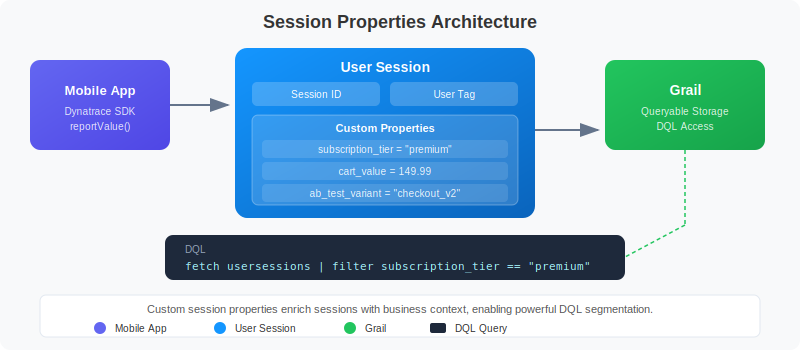
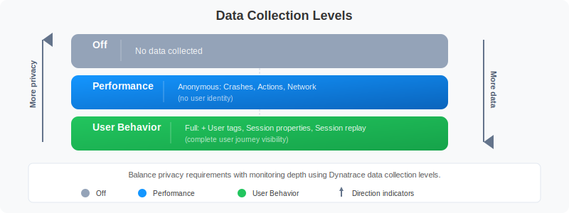

# MOBL-09: Session Properties & Data Privacy

> **Series:** MOBL | **Notebook:** 9 of 12 | **Created:** February 2026 | **Last Updated:** 02/24/2026

## Overview

This notebook covers how to enrich mobile sessions with custom session properties, implement user tagging for session identification, configure data collection levels to control what telemetry the SDK captures, and ensure compliance with GDPR and CCPA privacy regulations. Session properties and privacy controls are two sides of the same coin -- properties make your data actionable, while privacy controls ensure you collect only what you're permitted to.

---

## Table of Contents

1. [Custom Session Properties](#custom-session-properties)
2. [User Tagging](#user-tagging)
3. [Data Collection Levels](#data-collection-levels)
4. [Opt-In Mode](#opt-in-mode)
5. [Privacy Compliance (GDPR/CCPA)](#privacy-compliance)
6. [Querying with Session Properties](#querying-session-properties)
7. [Data Retention](#data-retention)

---

## Prerequisites

| Requirement | Details |
|-------------|---------|
| **Dynatrace Environment** | SaaS with Grail enabled |
| **Permissions** | `rum.read`, `entities.read`, `bizevents.read` |
| **Mobile App** | At least one mobile app with Dynatrace SDK integrated |
| **SDK Version** | iOS Agent 8.x+ or Android Agent 8.x+ |
| **Prior Knowledge** | Basic understanding of GDPR/CCPA privacy regulations |
| **Recommended** | Complete MOBL-01 through MOBL-08 first |

<a id="custom-session-properties"></a>

## 1. Custom Session Properties



<!-- MARKDOWN_TABLE_ALTERNATIVE
| Component | Description |
|-----------|-------------|
| Mobile SDK | Reports custom key-value pairs via reportValue() API |
| Session Context | Properties are attached to the user session and sent with beacons |
| Server-Side Rules | Additional properties can be extracted from request attributes |
| Grail Storage | Properties are stored alongside session data for DQL querying |
| Dynatrace UI | Filter and segment sessions by property values in dashboards |
For environments where SVG doesn't render
-->

**Session properties** are custom key-value pairs attached to a user session. They enrich your mobile telemetry with business context that Dynatrace cannot automatically detect -- subscription tier, A/B test variant, feature flags, cart value, or any other app-specific attribute.

### Property Types

| Type | Description | Example |
|------|-------------|---------|
| **String** | Text values | `"subscription_tier" = "premium"` |
| **Long** | Integer values | `"items_in_cart" = 5` |
| **Double** | Decimal values | `"cart_value" = 149.99` |
| **Date** | Timestamp values | `"trial_expiry" = 2026-03-15` |

### Setting Properties from the SDK

Properties can be set at any point during a session. They are sent with the next beacon and apply to the entire session.

**iOS (Swift):**

```swift
// iOS -- set custom session properties
Dynatrace.identifyUser("user@example.com")
DTXAction.reportValue(withName: "subscription_tier", stringValue: "premium")
DTXAction.reportValue(withName: "cart_value", doubleValue: 149.99)
```

**Android (Kotlin):**

```kotlin
// Android -- set custom session properties
Dynatrace.identifyUser("user@example.com")
Dynatrace.reportValue("subscription_tier", "premium")
Dynatrace.reportValue("cart_value", 149.99)
```

### Server-Side Session Properties

In addition to SDK-reported properties, Dynatrace can extract session properties from:

- **Request attributes** -- Values captured from HTTP headers, query parameters, or response bodies on the server side
- **CSS selectors** -- Values extracted from web view content (hybrid apps)
- **JavaScript variables** -- Values read from the web view's JavaScript context

Server-side properties are configured in the Dynatrace UI under **Mobile > Application settings > Session and user action properties**.

### Best Practices for Session Properties

| Practice | Reason |
|----------|--------|
| Use descriptive, consistent key names | Makes DQL queries readable and maintainable |
| Set properties early in the session | Ensures they are available for all subsequent actions |
| Limit to 20-30 properties per app | Excessive properties increase beacon size and processing overhead |
| Avoid PII in property values | Session properties are not subject to data masking |
| Use enum-like values for strings | Facilitates aggregation (e.g., `"tier" = "free"` vs `"tier" = "Free Trial Account"`) |

<a id="user-tagging"></a>

## 2. User Tagging

User tagging associates a mobile session with a specific user identity. This enables you to track individual user journeys across sessions, correlate mobile issues with support tickets, and analyze per-user performance.

### How User Tagging Works

The `identifyUser()` SDK call sets the user tag for the current session. Once set, the tag persists for the duration of the session and appears in all related telemetry.

**iOS (Swift):**

```swift
// Tag the session after user login
Dynatrace.identifyUser("user-id-12345")
```

**Android (Kotlin):**

```kotlin
// Tag the session after user login
Dynatrace.identifyUser("user-id-12345")
```

### Privacy-Aware User Tagging

User tagging requires careful consideration of privacy:

| Approach | Example | Privacy Level |
|----------|---------|---------------|
| **Opaque ID** (recommended) | `"usr_a1b2c3d4"` | High -- no PII exposed |
| **Hashed email** | `sha256("user@example.com")` | Medium -- reversible with rainbow tables |
| **Email address** | `"user@example.com"` | Low -- contains PII, not recommended |
| **Internal user ID** | `"12345"` | High -- meaningless without backend lookup |

> **Important:** Avoid using email addresses, phone numbers, or full names as user tags. Use opaque identifiers that can be correlated with user records on the backend but do not expose personally identifiable information (PII) in Dynatrace.

### Clearing the User Tag

When a user logs out, clear the user tag to prevent subsequent anonymous sessions from being attributed to the previous user:

```swift
// iOS -- clear user identity on logout
Dynatrace.identifyUser(nil)
```

```kotlin
// Android -- clear user identity on logout
Dynatrace.identifyUser(null)
```

<a id="data-collection-levels"></a>

## 3. Data Collection Levels



<!-- MARKDOWN_TABLE_ALTERNATIVE
| Level | Description | Data Captured |
|-------|-------------|---------------|
| Off | No monitoring at all | Nothing -- SDK is completely silent |
| Performance | Anonymous performance data only | Crashes, actions, network timings (no user identification) |
| User Behavior | Full RUM with user identification | All actions, sessions, user tags, session properties, replay |
For environments where SVG doesn't render
-->

Dynatrace provides three **data collection levels** that control how much telemetry the mobile SDK captures. This is the primary mechanism for implementing privacy controls at the SDK level.

| Level | Description | Data Captured |
|-------|-------------|---------------|
| **Off** | No monitoring | Nothing -- SDK is completely silent |
| **Performance** | Anonymous performance data | Crashes, actions, network timings (no user info) |
| **User Behavior** | Full RUM with user identification | Actions, sessions, user tags, properties, session replay |

### Setting the Data Collection Level

**iOS (Swift):**

```swift
// iOS -- configure data collection level and crash reporting
let privacyConfig = DTXUserPrivacyOptions()
privacyConfig.dataCollectionLevel = .userBehavior
privacyConfig.crashReportingOptedIn = true
Dynatrace.applyUserPrivacyOptions(privacyConfig)
```

**Android (Kotlin):**

```kotlin
// Android -- configure data collection level and crash reporting
Dynatrace.applyUserPrivacyOptions(
    UserPrivacyOptions.builder()
        .withDataCollectionLevel(DataCollectionLevel.USER_BEHAVIOR)
        .withCrashReportingOptedIn(true)
        .build()
)
```

### What Each Level Controls

| Feature | Off | Performance | User Behavior |
|---------|-----|-------------|---------------|
| User actions | No | Yes (anonymous) | Yes (with user context) |
| Network requests | No | Yes (anonymous) | Yes (with correlation) |
| Crash reporting | No | Only if opted in | Only if opted in |
| User tagging | No | No | Yes |
| Session properties | No | No | Yes |
| Session replay | No | No | Yes (if enabled) |
| Device context | No | Yes | Yes |

> **Note:** Crash reporting has its own separate opt-in flag (`crashReportingOptedIn`) that works independently of the data collection level. A user can be at the "Performance" level with crash reporting enabled or disabled.

<a id="opt-in-mode"></a>

## 4. Opt-In Mode

**Opt-in mode** means the Dynatrace SDK starts in the "Off" data collection level and waits for the user to explicitly consent before collecting any data. This is the recommended approach for GDPR compliance in the European Union.

### How Opt-In Mode Works

1. **SDK starts silently** -- The app launches with `DTXAutoStart = false` (iOS) or `autoStart = false` (Android). No beacons are sent.
2. **Consent dialog shown** -- The app displays a privacy consent dialog explaining what data will be collected and why.
3. **User grants consent** -- If the user accepts, the app calls the SDK startup method and sets the appropriate data collection level.
4. **User declines** -- If the user declines, the SDK remains in "Off" mode. The app functions normally without monitoring.

### iOS Configuration

```swift
// In your Info.plist or DTXConfig:
// DTXAutoStart = false

// After user grants consent:
func userGrantedConsent() {
    // Start the SDK
    Dynatrace.startup { error in
        if let error = error {
            print("Dynatrace startup failed: \(error)")
            return
        }
        // Set the privacy level based on what the user consented to
        let options = DTXUserPrivacyOptions()
        options.dataCollectionLevel = .userBehavior
        options.crashReportingOptedIn = true
        Dynatrace.applyUserPrivacyOptions(options)
    }
}

// If user declines -- do nothing, SDK stays off
func userDeclinedConsent() {
    // SDK remains in Off state, no data collected
}
```

### Android Configuration

```kotlin
// In your AndroidManifest.xml or Gradle config:
// autoStart = false

// After user grants consent:
fun userGrantedConsent() {
    Dynatrace.startup(application, DynatraceConfigurationBuilder(
        "<APP_ID>", "<BEACON_URL>"
    ).buildConfiguration())

    Dynatrace.applyUserPrivacyOptions(
        UserPrivacyOptions.builder()
            .withDataCollectionLevel(DataCollectionLevel.USER_BEHAVIOR)
            .withCrashReportingOptedIn(true)
            .build()
    )
}
```

### Persisting Consent

The Dynatrace SDK **does not** persist the user's consent choice. Your app is responsible for:

- Storing the consent status (e.g., in SharedPreferences or UserDefaults)
- Checking the stored consent on each app launch
- Starting or not starting the SDK accordingly
- Providing a way for the user to change their consent in app settings

<a id="privacy-compliance"></a>

## 5. Privacy Compliance (GDPR/CCPA)

When implementing mobile monitoring, you must comply with applicable privacy regulations. The two most common are GDPR (European Union) and CCPA (California, United States).

### Regulation Requirements & Dynatrace Features

| Regulation | Requirement | Dynatrace Feature |
|------------|-------------|-------------------|
| GDPR | Consent before collection | Opt-in mode (`DTXAutoStart = false`) |
| GDPR | Right to erasure (Art. 17) | Data deletion API |
| GDPR | Data minimization (Art. 5) | Data collection levels (Off / Performance / User Behavior) |
| GDPR | Purpose limitation | Configurable session properties (collect only what's needed) |
| CCPA | Right to opt out | Privacy options API (`applyUserPrivacyOptions`) |
| CCPA | Data disclosure | Session export via DQL and Grail APIs |
| CCPA | Right to delete | Data deletion API |

### GDPR Implementation Checklist

1. **Implement opt-in mode** -- SDK must not collect data before consent
2. **Display clear consent dialog** -- Explain what data is collected and why, using plain language
3. **Provide granular consent options** -- Allow users to consent to performance monitoring separately from user behavior tracking
4. **Support consent withdrawal** -- Users must be able to revoke consent at any time (set collection level to "Off")
5. **Implement data deletion** -- Use the Dynatrace data deletion API when users exercise their right to erasure
6. **Document data processing** -- Maintain records of processing activities (Art. 30)
7. **Avoid storing PII in session properties** -- Use opaque user IDs, not email addresses or names

### CCPA Implementation Checklist

1. **Add "Do Not Sell" option** -- Provide a mechanism to opt out of data sharing
2. **Disclose data collection in privacy policy** -- List categories of data collected by the mobile SDK
3. **Support data access requests** -- Be able to export a user's session data via DQL
4. **Support data deletion requests** -- Use the Dynatrace data deletion API
5. **Do not discriminate** -- Users who opt out should receive the same app experience

### Data Deletion API

When a user requests deletion of their data, use the Dynatrace API to remove their sessions:

```bash
# Request deletion of a specific user's data
curl -X POST 'https://{your-environment-id}.live.dynatrace.com/api/v2/data-privacy/deletion' \
  -H 'Authorization: Api-Token {api-token}' \
  -H 'Content-Type: application/json' \
  -d '{
    "dataTypes": ["RUM"],
    "userId": "user-id-12345",
    "startDate": "2025-01-01",
    "endDate": "2026-12-31"
  }'
```

> **Warning:** Data deletion is irreversible. Ensure you have proper authorization and audit logging before processing deletion requests.

<a id="querying-session-properties"></a>

## 6. Querying with Session Properties

Session properties, geolocation, device metadata, and operating system information are available in Grail and can be queried using DQL. The following queries demonstrate how to segment mobile sessions by various dimensions.

### Sessions by Country (Geolocation)

```dql
// Sessions by country (geolocation)
fetch bizevents, from:-24h
| filter event.provider == "www.dynatrace.com/mobile"
| filter isNotNull(dt.rum.session.id)
| summarize session_count = countDistinct(dt.rum.session.id), by:{geo.country.name}
| sort session_count desc
| limit 20
```

### Sessions by Device Manufacturer

```dql
// Sessions by device manufacturer
fetch bizevents, from:-24h
| filter event.provider == "www.dynatrace.com/mobile"
| filter isNotNull(device.manufacturer)
| summarize session_count = countDistinct(dt.rum.session.id), by:{device.manufacturer}
| sort session_count desc
| limit 15
```

### Sessions by Operating System

```dql
// Sessions by operating system
fetch bizevents, from:-24h
| filter event.provider == "www.dynatrace.com/mobile"
| filter isNotNull(os.type)
| summarize session_count = countDistinct(dt.rum.session.id), by:{os.type, os.version}
| sort session_count desc
| limit 20
```

### Sessions by App Version

```dql
// Sessions by app version
fetch bizevents, from:-24h
| filter event.provider == "www.dynatrace.com/mobile"
| filter isNotNull(app.version)
| summarize session_count = countDistinct(dt.rum.session.id), by:{app.version, os.type}
| sort session_count desc
| limit 20
```

<a id="data-retention"></a>

## 7. Data Retention

Dynatrace Grail stores mobile RUM data according to configurable retention policies. Understanding data retention is critical for both performance analysis and privacy compliance.

### Default Retention Periods

| Data Type | Default Retention | Configurable |
|-----------|-------------------|-------------|
| Business events (sessions, actions) | 35 days | Yes, per bucket |
| Events (crashes, errors) | 35 days | Yes, per bucket |
| Metrics (aggregated performance data) | 5 years | Limited |
| Entities (mobile app configurations) | Lifetime of entity | N/A |

### Configuring Retention with Grail Buckets

You can control retention by routing mobile data to specific Grail buckets with custom retention policies:

1. **Create a dedicated bucket** -- Create a Grail bucket for mobile RUM data with the desired retention period
2. **Configure OpenPipeline** -- Route mobile business events to the dedicated bucket using OpenPipeline processing rules
3. **Set retention policy** -- Configure the retention period on the bucket (e.g., 90 days for extended analysis, or 14 days for privacy-sensitive data)

### Privacy Implications of Retention

| Consideration | Recommendation |
|---------------|----------------|
| **GDPR data minimization** | Set the shortest retention period that meets business needs |
| **Right to erasure** | Use the data deletion API for individual user requests; do not rely solely on retention expiry |
| **Regulatory audit** | Ensure retention periods are documented in your data processing records |
| **Cross-border data** | Verify that Grail storage regions comply with data residency requirements |
| **Session replay** | Consider shorter retention for session replay data, which contains more sensitive visual information |

> **Tip:** For GDPR compliance, consider creating separate Grail buckets for EU and non-EU user data with different retention policies. Use OpenPipeline rules to route data based on geolocation.

---

## Summary

In this notebook, you learned:

- **Custom session properties** -- how to enrich mobile sessions with string, long, double, and date key-value pairs using the SDK `reportValue()` API
- **User tagging** -- how `identifyUser()` associates sessions with a user identity, and why opaque IDs are preferred over PII
- **Data collection levels** -- the three levels (Off, Performance, User Behavior) and what telemetry each controls
- **Opt-in mode** -- how to start the SDK in silent mode and only begin collection after explicit user consent
- **GDPR and CCPA compliance** -- regulation requirements mapped to Dynatrace features, including data deletion API
- **Querying session properties** -- DQL patterns for segmenting sessions by country, device, OS, and app version
- **Data retention** -- Grail bucket retention policies and their privacy implications

---

## Next Steps

Continue to **MOBL-10** to learn:
- Advanced session replay configuration and privacy masking
- Configuring action and input masking rules
- Analyzing replays for UX issue identification
- Balancing debugging capabilities with user privacy

---

<sub>*This notebook was AI-generated from community-submitted and publicly available sources. This notebook series is not officially supported by Dynatrace. Always verify information against official Dynatrace documentation.*</sub>
