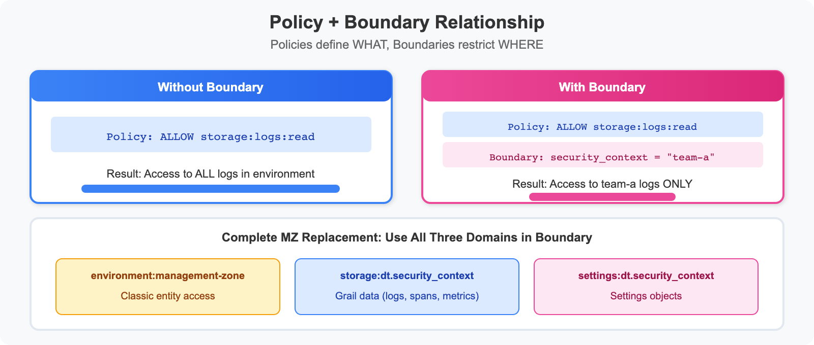
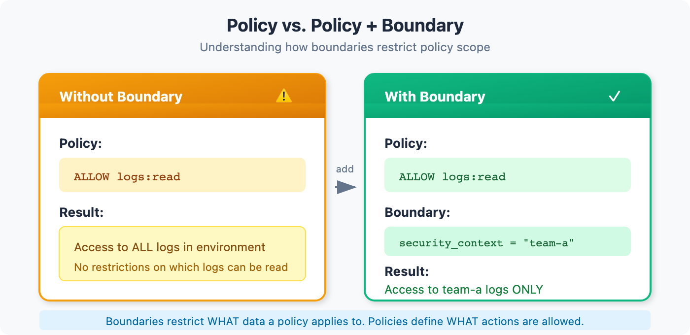
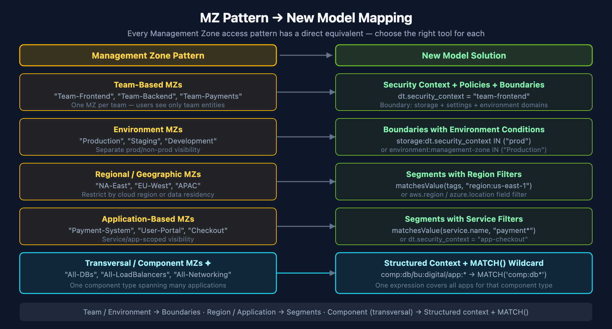

# MZ2POL-04: Policies and Boundaries

> **Series:** MZ2POL — Management Zone to Policy Migration | **Notebook:** 5 of 9 | **Created:** December 2025 | **Last Updated:** 07/16/2026

## Overview

This notebook provides a comprehensive guide to **IAM Policies** and **Policy Boundaries** - the two components that together replace Management Zone access control. Policies define **WHAT** users can do, while boundaries define **WHERE** those permissions apply.

---

## Table of Contents

1. [Understanding the Relationship](#understanding-the-relationship)
2. [Policy Fundamentals](#policy-fundamentals)
3. [Default Policies](#default-policies)
4. [Condition and Boundary Syntax](#condition-and-boundary-syntax)
5. [Creating Boundaries](#creating-boundaries)
6. [Best Practice: Two Boundaries (Gen3 + Gen2 Transitional)](#best-practice-complete-boundary-for-mz-restriction)
7. [Recommended Group-Policy-Boundary Structure](#recommended-group-policy-boundary-structure)
8. [Mapping MZ Access to Policies + Boundaries](#mapping-mz-access-to-policies-boundaries)
9. [Security Context and Bucket Strategy](#security-context-and-bucket-strategy)
10. [Custom Policies](#custom-policies)
11. [Best Practices](#best-practices)
12. [Troubleshooting](#troubleshooting)
13. [Additional Resources](#additional-resources)


---

## Prerequisites

- Completed MZ2POL-01 through MZ2POL-03
- Access to Dynatrace Account Management
- Policy Management permissions

## Learning Objectives

By the end of this notebook, you will:
1. Understand policy statement syntax and structure
2. Know the default policies and when to use them
3. Understand boundary syntax and how boundaries restrict policies
4. Be able to map MZ access patterns to policy + boundary combinations
5. Know the recommended group-policy-boundary structure for SAML/AD integration

---

<a id="understanding-the-relationship"></a>
## 1. Understanding the Relationship
### Policies vs Boundaries



<!--MARKDOWN_TABLE_ALTERNATIVE
| Component | Purpose | Analogy |
|-----------|---------|--------|
| Policy | Defines WHAT actions are allowed | "You can read logs" |
| Boundary | Defines WHERE policies apply | "...but only for team-frontend" |
-->

| Component | Purpose | Analogy |
|-----------|---------|--------|
| **Policy** | Defines WHAT actions are allowed | "You can read logs" |
| **Boundary** | Defines WHERE policies apply | "...but only for team-frontend" |

### How They Work Together



<!--MARKDOWN_TABLE_ALTERNATIVE
| Scenario | Policy | Boundary | Result |
|----------|--------|----------|--------|
| Without Boundary | ALLOW logs:read | (none) | Access to ALL logs |
| With Boundary | ALLOW logs:read | security_context = "team-a" | Access to team-a logs ONLY |
-->

### Key Characteristics

**Policies:**
- Define permissions (ALLOW statements)
- Can include conditions (WHERE clauses)
- Default policies cover most use cases

**Boundaries:**
- Separate from policies (decoupled)
- Reusable across multiple policies
- Can only narrow permissions, never expand
- Optional - policies work without them (full scope)

---

<a id="policy-fundamentals"></a>
## 2. Policy Fundamentals
### Policy Statement Structure

```
<effect> <service>:<resource>:<action> [WHERE <condition>]
```

| Component | Description | Examples |
|-----------|-------------|----------|
| **Effect** | Permission type | `ALLOW` or `DENY` (a `DENY` always overrules a matching `ALLOW`) |
| **Service** | Dynatrace service | `storage`, `settings`, `app` |
| **Resource** | Resource type | `logs`, `buckets`, `objects` |
| **Action** | Operation | `read`, `write`, `delete` |
| **Condition** | Optional filter | `WHERE field = "value"` |

> **Effects:** Authorization is **implicit-deny** — anything not `ALLOW`ed is denied. Compose access from `ALLOW` statements and simply omit what you don't want to grant. Reserve explicit `DENY` for narrowing a broad `ALLOW`; a `DENY` always wins over any `ALLOW`, regardless of order.
>
> **Combining conditions:** A policy `WHERE` clause supports **`AND`** (e.g. `WHERE settings:schemaId = "..." AND storage:bucket-name = "logs_prod"`). It does **not** support `OR` — to express OR, write multiple `ALLOW` statements.

### Basic Policy Statements

```
// Grant read access to all logs
ALLOW storage:logs:read

// Grant read access to bucket metadata
// (storage:buckets:write does not exist — buckets are managed via the
//  Grail bucket-management API, not an IAM storage permission)
ALLOW storage:buckets:read

// Grant read AND write on logs — enumerate both actions.
// Wildcards (storage:logs:*) are rejected by the API (live-verified 07/2026).
ALLOW storage:logs:read, storage:logs:write
```

### Common Services and Resources

| Service | Resources | Common Actions |
|---------|-----------|----------------|
| `storage` | `logs`, `spans`, `events`, `metrics`, `bizevents`, `entities`, `system`, `buckets`, `smartscape` | `read` on all; `write` ONLY on `logs`, `metrics`, `events` (never condition-scoped) |
| `settings` | `objects`, `schemas` | `read`, `write` (objects only) |
| `app` | `apps`, `functions` | `run`, `install` |
| `automation` | `workflows` | `read`, `write`, `run` |
| `document` | `documents` | `read`, `write`, `delete`, `share` |

---

<a id="default-policies"></a>
## 3. Default Policies
Dynatrace provides **built-in (default) IAM policies** that cover common access patterns. They are managed by Dynatrace (not editable) and auto-adjust as the platform evolves.

> **Naming note:** The classic Gen2 roles "Dynatrace Viewer / Standard User / Professional User / Admin User" and "Data Viewer / Data Editor" are **not** current IAM policy names — they were RBAC roles. The names below are the current built-in IAM policies (see the [default policies reference](https://docs.dynatrace.com/docs/manage/identity-access-management/permission-management/default-policies)).

### Platform Access Policies

| Policy | Use Case | Grants |
|--------|----------|--------|
| **Standard User** | Regular users | Access the environment and run Dynatrace Apps |
| **Pro User** | Power users | Build, deploy, and run apps + automated workflows |
| **Admin User** | Administrators | Administrative access across all Platform Services |

There is **no built-in "Viewer" policy** — compose read-only access from a platform policy plus the granular data-read policies below.

### Data Access Policies

| Policy | Use Case |
|--------|----------|
| **All Grail data read access** | Unrestricted read across all Grail tables and buckets |
| **Storage Default Monitoring Read** | Read on the default monitoring buckets; auto-extends as new tables are added |
| **Read Logs** / **Read Spans** / **Read Metrics** / **Read Events** / **Read Entities** | Granular read, one policy per signal type |
| **Settings Reader** / **Settings Writer** | Read / read-write of Settings 2.0 objects |

### Environment Role Policies (Classic surface)

| Policy | Use Case |
|--------|----------|
| **Environment role - Access environment** | Viewer-level Classic environment access |
| **Environment role - Change monitoring settings** | Edit Classic monitoring settings |

### Choosing the Right Built-in Policies

```
User Type              → Platform Policy   + Data / Settings Policies
──────────────────────────────────────────────────────────────────────
Executives/Viewers     → Standard User     + Read Logs / Read Metrics (or All Grail data read access)
Developers             → Standard User     + Read Logs / Read Spans / Read Metrics
SRE/Operations         → Pro User          + All Grail data read access + Settings Writer
Platform Admins        → Admin User        + (admin policies as needed)
```

---

<a id="condition-and-boundary-syntax"></a>
## 4. Condition and Boundary Syntax
Policies and boundaries share the same condition syntax.

### Supported Operators

| Operator | Description | Example |
|----------|-------------|----------|
| `=` | Exact match | `field = "value"` |
| `!=` | Not equal | `field != "value"` |
| `startsWith` | Prefix match | `field startsWith "prefix"` |
| `in` | Value in list | `field in ("a", "b", "c")` |
| `IN` | Value in list (alternative) | `field IN ("a", "b")` |
| `MATCH` | Wildcard pattern match (storage domain only) | `field MATCH ('team-*')` |

### Supported Fields

| Field | Description | Used In |
|-------|-------------|----------|
| `environment` | Environment restrictions | Boundaries |
| `environment:name` | Environment by name | Boundaries |
| `environment:management-zone` | MZ-based (transitional) | Boundaries |
| `storage:dt.security_context` | Security context | Both |
| `storage:bucket-name` | Grail bucket | Both |
| `settings:schemaId` | Settings schema ID | Policies |
| `settings:dt.security_context` | Settings security context | Boundaries |

### Combining Conditions

**AND logic** (all conditions must match):
```
ALLOW storage:logs:read 
  WHERE storage:dt.security_context = "team-a"
  AND storage:bucket-name = "production_logs"
```

**OR logic** (multiple statements or lines):
```
// In policies: Multiple statements
ALLOW storage:logs:read WHERE storage:dt.security_context = "team-a"
ALLOW storage:logs:read WHERE storage:dt.security_context = "team-b"

// In boundaries: Each line is OR-combined
storage:dt.security_context = "team-a"
storage:dt.security_context = "team-b"
```

---

<a id="creating-boundaries"></a>
## 5. Creating Boundaries
### Via UI

1. Navigate to **Account Management** → **Identity & Access Management**
2. Select **Policy Boundaries** → **Boundaries** tab
3. Click **Create boundary**
4. Enter:
   - **Boundary name**: Descriptive name
   - **Boundary query**: Restriction conditions
5. Click **Save**

### Boundary Examples

**Team-Based Boundary:**
```
Name: Frontend Team Scope
Query: storage:dt.security_context = "team-frontend"
```

**Environment Boundary:**
```
Name: Production Only
Query: storage:dt.security_context startsWith "prod-"
```

**Multi-Team Boundary (OR logic):**
```
Name: Platform Teams
Query:
storage:dt.security_context = "team-infra"
storage:dt.security_context = "team-sre"
storage:dt.security_context = "team-platform"
```

### Boundary Limitations

| Limitation | Description | Workaround |
|------------|-------------|------------|
| Max 10 lines | Only 10 conditions per boundary | Create multiple boundaries |
| No AND in lines | Each line is one condition | Use multiple boundaries for AND |
| No complex expressions | Limited to basic operators | Simplify conditions |

---

<a id="best-practice-complete-boundary-for-mz-restriction"></a>
## 6. Best Practice: Two Boundaries (Gen3 + Gen2 Transitional)
When restricting access to replicate a Management Zone, **don't bundle Gen2 and Gen3 conditions inside one boundary.** Split them across **two parallel policy bindings** on the same group — a Gen3 binding scoped by Gen3 conditions and a Gen2 binding scoped by the `environment:management-zone` condition. Their effective scope is the intersection.

```
# Gen3 policy binding (canonical) — Grail data + Settings 2.0
ALLOW storage:logs:read, storage:spans:read, storage:metrics:read,
      settings:objects:read, settings:objects:write
WHERE storage:dt.security_context IN ("LOB5")
  AND settings:dt.security_context IN ("LOB5");
```

> The `WHERE` clause uses **`AND`**, not `OR` — a policy `WHERE` does not support `OR`. Each condition only constrains the permissions of its own service: `storage:dt.security_context` scopes the `storage:*` reads, and `settings:dt.security_context` scopes the `settings:*` actions.

```
# Gen2 policy binding (transitional) — Classic entity access via Management Zones
ALLOW environment:roles:viewer
WHERE environment:management-zone IN ("LOB5");
```

### Why Split Gen2 from Gen3?

| Boundary | Domain | What It Restricts | Generation |
|---|---|---|---|
| **Boundary 1 (Gen3)** | `storage:dt.security_context` | Grail data (logs, spans, metrics, events) | Modern, canonical |
| **Boundary 1 (Gen3)** | `settings:dt.security_context` | Settings 2.0 objects | Modern, canonical |
| **Boundary 2 (Gen2)** | `environment:management-zone` | Classic entity access (hosts, services, processes) | Transitional |

Each boundary's conditions evaluate against the policy it's attached to — using `environment:management-zone` to scope a `storage:logs:read` policy is a no-op (the Gen3 policy doesn't read `environment:` conditions), and using `storage:dt.security_context` to scope an `environment:roles:viewer` policy is also a no-op. Mixing them in one boundary creates the illusion of unified scope while leaving one path wide open. Use **two parallel policy bindings** on the same group instead.

Until MZ retirement is complete, keep both bindings active so legacy entity-level paths still resolve. After retirement, the Gen2 binding is removed cleanly without touching the Gen3 one. **Don't use `MATCH` on a Gen2 policy** — `MATCH('*')` against `storage:entities:read` (a Gen2 surface) silently grants access to all Gen2 entities.
---

---

<a id="recommended-group-policy-boundary-structure"></a>
## 7. Recommended Group-Policy-Boundary Structure
For organizations using SAML/SSO with Active Directory, this structure provides clear separation of duties:

```
Group: "LOB5-Team" (SAML from Active Directory)
├── Policy binding 1 — Gen3 (canonical):
│   Policies: Standard User (+ Read Logs / Read Spans / Read Metrics; Settings Reader)
│   Boundary:
│     storage:dt.security_context IN ("LOB5");
│     settings:dt.security_context IN ("LOB5");
└── Policy binding 2 — Gen2 (transitional):
    Policy: Environment role - Access environment
    Boundary:
      environment:management-zone IN ("LOB5");
```

### Key Benefits

- **SAML Group**: Ties to existing AD group membership - no separate user management
- **Gen3 binding**: Grail data + Settings access scoped by `dt.security_context`
- **Gen2 binding**: Classic entity access scoped by `environment:management-zone`, retired cleanly after MZ migration

### Alternative: Tighten the Platform Policy Too

For stricter isolation, bind a higher platform policy under the same Gen3 boundary:

```
Group: "LOB5-Team" (SAML from AD)
├── Policy: Standard User
│   └── Boundary: LOB5-Scope (Gen3)
└── Policy: Pro User
    └── Boundary: LOB5-Scope (Gen3)
```

### Binding via UI

1. Navigate to **Group Management**
2. Select or create a group
3. Go to **Permissions** tab
4. Click **Add permission**
5. Select:
   - **Policy**: Choose policy to bind
   - **Boundary** (optional): Select restriction
   - **Environment**: Select target environment
6. Click **Save**

---

<a id="mapping-mz-access-to-policies-boundaries"></a>
## 8. Mapping MZ Access to Policies + Boundaries
### Common MZ Permission Patterns



<!--MARKDOWN_TABLE_ALTERNATIVE
| MZ Pattern | New Approach |
|------------|-------------|
| Team-Based MZs | Security Context + Policies + Boundaries |
| Environment MZs | Boundaries with environment conditions |
| Regional MZs | Segments with region filters |
| Application MZs | Segments with service filters |
-->

| MZ Permission | Equivalent Policy + Boundary |
|---------------|-----------------------------|
| View only | `Standard User` + data-read policies + Boundary |
| View + Edit | `Pro User` + `Settings Writer` + Boundary |
| Full access to MZ | `Pro User` + `All Grail data read access` + Boundary |
| Admin in MZ | `Admin User` (or a custom policy) + Boundary |

### Migration Example: Team-Based MZ

**Before (MZ-based):**
- Management Zone: "Frontend-Team"
- Rules: Services with tag `team:frontend`
- Users assigned via RBAC

**After (Policy + Boundary):**
```
1. Set security context on entities:
   - Services get dt.security_context = "team-frontend"

2. Create two parallel policy bindings — Gen3 with Gen3 boundary, Gen2 with Gen2 boundary:

   Binding 1 — Gen3 (canonical):
     ALLOW storage:logs:read, storage:spans:read, storage:metrics:read,
           settings:objects:read, settings:objects:write
     WHERE storage:dt.security_context IN ("team-frontend")
       AND settings:dt.security_context IN ("team-frontend");
     (policy WHERE uses AND, not OR — each condition scopes its own service)

   Binding 2 — Gen2 (transitional, until MZ retirement):
     ALLOW environment:roles:viewer
     WHERE environment:management-zone IN ("Frontend-Team");

3. Attach both bindings to the group:
   Group: Frontend Developers (SAML)
   Bindings: Gen3 binding + Gen2 binding (both active during migration window)
```

### Migration Example: Environment MZ

**Before (MZ-based):**
- Management Zone: "Production"
- Rules: Hosts with tag `env:production`
- Users get MZ-filtered view

**After (Policy + Boundary):**
```
1. Set security context on entities:
   - Hosts get dt.security_context = "prod-{region}"

2. Create two boundaries (don't mix Gen2 and Gen3 in one):
   Gen3 boundary "Production - Grail":
     storage:dt.security_context startsWith "prod-";
     settings:dt.security_context startsWith "prod-";
   Gen2 boundary "Production - Classic":
     environment:management-zone IN ("Production");

3. Bind to group with two parallel bindings:
   Group: Production Operators (SAML)
   Binding 1 (Gen3): Pro User + data-read policies, Boundary "Production - Grail"
   Binding 2 (Gen2): Environment role - Access environment, Boundary "Production - Classic"
```

---

<a id="security-context-and-bucket-strategy"></a>
## 9. Security Context and Bucket Strategy
### What Is Security Context?

**Security Context** (`dt.security_context`) is an entity attribute used for access control. It's the recommended way to scope boundaries for Grail data.

### Primary Grail Fields

When migrating from Management Zones, leverage **Primary Grail Fields** for consistent data partitioning:

| Field | Source | MZ Migration Use |
|-------|--------|------------------|
| `k8s.cluster.name` | Kubernetes | Replace cluster-based MZs |
| `k8s.namespace.name` | Kubernetes | Replace namespace-based MZs |
| `aws.account.id` | AWS metadata | Replace AWS account MZs |
| `dt.host_group.id` | OneAgent config | Replace host group-based MZs |

### Bucket Strategy for Migration

**Buckets** partition Grail data and integrate with policies and boundaries for team-level access control.

### Bucket Limitations

> **⚠️ Critical:** Plan buckets carefully during migration - these constraints cannot be changed later.

| Limitation | Details |
|------------|---------|
| **One data type per bucket** | Logs, metrics, events, OR spans - not mixed |
| **Names are immutable** | Bucket names CANNOT be changed after creation |
| **No data migration** | Data CANNOT be moved between buckets |
| **Naming rules** | 3-100 chars, lowercase alphanumeric, underscores, hyphens only |
| **Maximum buckets** | 80 per environment (default limit) |
| **Optimal ingest** | ~1 TB/day per bucket for best query performance |
| **Acceptable ingest** | 1-3 TB/day per bucket (limited query window) |
| **Maximum ingest** | 3 TB/day per bucket hard limit |

### Query Constraints

| Limit | Value | Impact |
|-------|-------|--------|
| **Maximum data scanned** | 500 GB | Limits queryable time window |
| **Maximum records returned** | 1,000 | Use aggregations for larger datasets |
| **Maximum response payload** | 1 MB | Large result sets may be truncated |

### Default Bucket Retentions

| Bucket | Retention |
|--------|-----------|
| `default_logs` | 35 days |
| `default_metrics` | 15 months |
| `default_spans` | 10 days |
| `default_events` | 35 days |

### Using Buckets for Team Isolation (MZ Replacement)

When replacing team-based MZs, use buckets in **both policies AND boundaries**:

**Pair Gen3 policies with Gen3 boundaries; pair Gen2 policies with Gen2 boundaries.** Two parallel bindings on the group, not one mixed boundary:

```
# Gen3 policy
ALLOW storage:logs:read,
      storage:spans:read,
      storage:metrics:read,
      settings:objects:read,
      settings:objects:write;
```

```
# Gen3 boundary — scoped by bucket + security context
storage:bucket-name          IN ("frontend_logs", "frontend_spans", "frontend_metrics");
storage:dt.security_context  IN ("team-frontend");
settings:dt.security_context IN ("team-frontend");
```

```
# Gen2 policy — Classic entity access, transitional
ALLOW environment:roles:viewer;
```

```
# Gen2 boundary
environment:management-zone IN ("Frontend-Team");
```

> **Don't** use `MATCH` on Gen2 policies (e.g., `MATCH('*')` against `storage:entities:read` — that's a Gen2 surface). `MATCH` is a Gen3-only operator; using it as a wildcard in a Gen2 boundary will silently grant access to all Gen2 entities.

### Migration Mapping: MZ to Buckets

| MZ Pattern | Bucket Strategy |
|------------|-----------------|
| **Team MZ** (e.g., "Frontend-Team") | Team-specific buckets: `frontend_logs`, `frontend_spans` |
| **Environment MZ** (e.g., "Production") | Environment buckets: `prod_logs`, `prod_metrics` |
| **Regional MZ** (e.g., "US-East") | Region buckets: `useast_logs`, `useast_spans` |
| **Compliance MZ** (e.g., "PCI") | Compliance buckets: `pci_logs`, `pci_events` |

### Complete Team Migration Example

**Before (MZ-based):**
- Management Zone: "Checkout-Team"
- Users see all data within the MZ

**After (Policy + Bucket + Boundary):**
```
Group: Checkout-Team (SAML from AD)
├── Policy: Checkout Data Access
│   ├── ALLOW storage:logs:read WHERE storage:bucket-name = "checkout_logs"
│   ├── ALLOW storage:spans:read WHERE storage:bucket-name = "checkout_spans"
│   └── ALLOW storage:metrics:read WHERE storage:bucket-name = "checkout_metrics"
└── Boundary:
    storage:bucket-name IN ("checkout_logs", "checkout_spans", "checkout_metrics");
    storage:dt.security_context IN ("checkout");
    environment:management-zone IN ("Checkout-Team");
```

> **For detailed bucket design guidance**, see **ORGNZ-03: Bucket Strategy and Design** which covers naming conventions, retention planning, and cost attribution patterns in depth.

### Setting Security Context

Security context can be set via:
- **Entity Enrichment rules** (recommended)
- **Host properties** via OneAgent
- **OpenPipeline processing**
- **Auto-tagging rules** (legacy)

### Security Context Naming Strategy

| Pattern | Example | Use Case |
|---------|---------|----------|
| `team-{name}` | `team-frontend` | Team ownership |
| `env-{name}` | `env-production` | Environment separation |
| `region-{code}` | `region-us-east` | Geographic isolation |
| `app-{name}` | `app-checkout` | Application scoping |
| `{env}-{team}` | `prod-frontend` | Combined scoping |

> **For transversal access patterns** (teams spanning multiple applications by component type — database, networking, OS), consider a structured multi-dimensional format: `comp:<component>/bu:<business-unit>/app:<application>`. This enables `MATCH('comp:db*')` to reach all database layers across all applications, while `MATCH('*/app:easytrade')` scopes to all components of one app. The dimension you need for transversal slicing must come *first* for Classic entity access. See **IAM-04: Policy Authoring** for the complete design pattern.

### Query Entities by Security Context

```dql
// List services with their security context
// Identify services that need security context assignment
fetch dt.entity.service
| fields entity.name,
         dt.security_context,
         tags,
         managementZones
| sort dt.security_context asc
| limit 50

// Alternative: Smartscape on Grail (entity.name → name)
// smartscapeNodes SERVICE
// | fields name,
// dt.security_context,
// tags,
// managementZones
// | sort dt.security_context asc
// | limit 50

```

```dql
// Count entities by security context
// Helps verify security context distribution
fetch dt.entity.service
| summarize count = count(), by:{dt.security_context}
| sort count desc
```

---

<a id="custom-policies"></a>
## 10. Custom Policies
### When to Create Custom Policies

- Default policies are too broad or narrow
- Need specific permission combinations
- Require conditional access
- Compliance requirements

### Custom Policy Examples

**Log Viewer for Specific Team:**
```
// Policy Name: Frontend Team Log Access
// Description: Read-only access to frontend service logs

ALLOW storage:logs:read 
  WHERE storage:dt.security_context = "team-frontend"

ALLOW storage:spans:read 
  WHERE storage:dt.security_context = "team-frontend"
```

**Environment-Restricted Admin:**
```
// Policy Name: Development Admin
// Description: Full access to development environment only

// Reads are condition-scoped; storage writes cannot take WHERE conditions
// (live-verified) — grant them unscoped only where justified.
ALLOW storage:logs:read, storage:spans:read, storage:metrics:read,
      storage:events:read, storage:bizevents:read,
      storage:entities:read, storage:system:read, storage:buckets:read
  WHERE storage:dt.security_context startsWith "dev-"

ALLOW settings:objects:read, settings:objects:write
  WHERE settings:scope startsWith "environment:dev"
```

**Dashboard and Notebook Creator:**
```
// Policy Name: Dashboard Creator
// Description: Create and manage dashboards and notebooks

ALLOW document:documents:read
ALLOW document:documents:write
ALLOW document:documents:delete
ALLOW document:direct-shares:write

// Read data for dashboards
ALLOW storage:logs:read
ALLOW storage:metrics:read
ALLOW storage:spans:read
```

---

<a id="best-practices"></a>
## 11. Best Practices
### Do's

- ✅ **Start with default policies** - customize only when needed
- ✅ **Use least privilege** - grant minimum required permissions
- ✅ **Document policies and boundaries** - clear names and descriptions
- ✅ **Test before production** - verify with test users
- ✅ **Use boundaries for scope** - keep policies reusable
- ✅ **Include all three domains** in boundaries for complete MZ replacement
- ✅ **Use SAML groups** tied to AD for team management

### Don'ts

- ❌ **Don't create policy per user** - use groups
- ❌ **Don't duplicate default policies** - extend instead
- ❌ **Don't use overly broad wildcards** - be specific
- ❌ **Don't embed conditions in policies** when boundaries are better
- ❌ **Don't forget the settings domain** in boundaries

### Naming Conventions

```
// Good names
"Frontend Team - Standard Access"     (policy)
"Production Environment"              (boundary)
"LOB5-Scope"                          (boundary)

// Bad names
"Policy 1"
"Test"
"John's boundary"
```

### Audit Checklist

- [ ] Each boundary has a clear purpose
- [ ] Boundary names follow naming convention
- [ ] All three domains included (environment, storage, settings)
- [ ] SAML groups aligned with AD structure
- [ ] Dependencies tracked (which policies use which boundaries)
- [ ] Regular review scheduled

---

<a id="troubleshooting"></a>
## 12. Troubleshooting
### Common Issues

| Issue | Likely Cause | Solution |
|-------|-------------|----------|
| User can't access anything | No policy bound | Bind policy to user's group |
| User sees too much | Boundary too broad or missing | Tighten boundary conditions |
| User can't see expected data | Missing data policy | Add a data-read policy (e.g. `Read Logs` / `All Grail data read access`) |
| Permissions inconsistent | Multiple conflicting policies | Review all bound policies |
| Works in classic, not Grail | Only environment domain used | Add storage domain (Gen3 boundary) |
| Settings not restricted | Missing settings domain | Add `settings:dt.security_context` boundary |

### Debugging Steps

1. **Verify group membership**: Is user in correct group?
2. **Check policy bindings**: What policies are bound to group?
3. **Review boundaries**: Are both Gen3 and Gen2 boundaries attached where needed?
4. **Test with admin**: Does admin see the data?
5. **Check security context**: Is it set on the entities?

### Testing Boundaries

1. **Create test user** in target group
2. **Log in as test user**
3. **Verify access**:
   - Can access expected data?
   - Cannot access restricted data?
4. **Test edge cases**:
   - Entities at boundary edges
   - New entities without security context

---

## Summary

In this notebook, you learned:

1. **Policies define WHAT**, boundaries define **WHERE**
2. **Default policies** cover most use cases - customize only when needed
3. **Shared syntax** for conditions in both policies and boundaries
4. **Three domains** needed for complete MZ replacement (environment, storage, settings)
5. **SAML + Policy + Boundary** structure for AD integration
6. **Migration patterns** for team-based and environment-based MZs

## Next Steps

Continue to **MZ2POL-05: Segments Implementation** to:
- Create DQL-based data filters
- Replace MZ data filtering with Segments
- Configure cross-app filtering

For large-scale migrations with many Management Zones, see **MZ2POL-08: Templated Policies for MZ Migration** to:
- Convert MZ patterns to parameterized policy templates
- Automate bulk policy binding via IAM API
- Validate migrated access with DQL queries

<a id="additional-resources"></a>
## Additional Resources
- [Working with Policies](https://docs.dynatrace.com/docs/manage/identity-access-management/permission-management/manage-user-permissions-policies)
- [IAM Policy Reference](https://docs.dynatrace.com/docs/manage/identity-access-management/permission-management/manage-user-permissions-policies/advanced/iam-policystatements)
- [Policy Boundaries Documentation](https://docs.dynatrace.com/docs/manage/identity-access-management/permission-management/manage-user-permissions-policies/iam-policy-boundaries)
- [Grant Access with Security Context](https://docs.dynatrace.com/docs/manage/identity-access-management/use-cases/access-security-context)
- [Policy Templating](https://docs.dynatrace.com/docs/manage/identity-access-management/permission-management/manage-user-permissions-policies/advanced/iam-policy-templating)

---

<sub>*This notebook was AI-generated from community-submitted and publicly available sources. This notebook series is not officially supported by Dynatrace. Always verify information against official Dynatrace documentation.*</sub>
