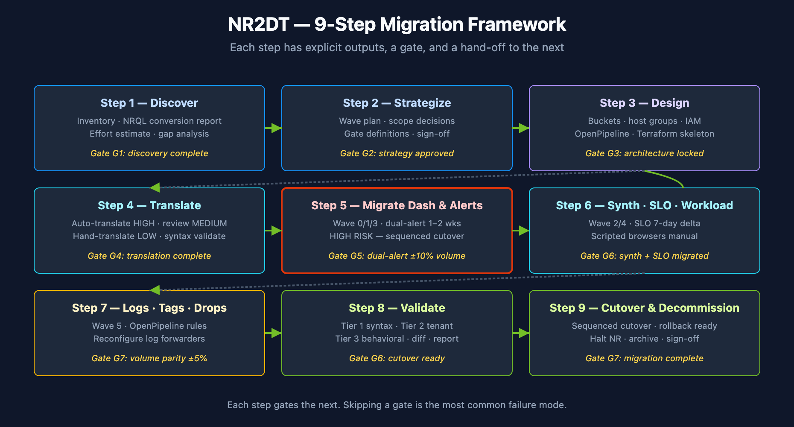

# NR2DT-01: Step 1 — Discover

> **Series:** NR2DT | **Notebook:** 1 of 10 | **Created:** April 2026 | **Last Updated:** 04/17/2026

## Overview

**Goal of this step:** produce a complete inventory of the source New Relic account, a translation-confidence report, and a defensible effort estimate. Nothing else moves until discovery is complete.

This is procedural. For the *why* behind each artifact and the deeper translation theory, see **NRLC-02** (NRQL→DQL Translation) and the relevant NRLC component notebook for each entity class.

---

## Table of Contents

1. [What You'll Produce](#outputs)
2. [Prerequisites & Access](#access)
3. [Run the Inventory](#inventory)
4. [Translate the NRQL Surface](#translate)
5. [Generate the Effort Estimate](#estimate)
6. [Step Exit Criteria](#gate)

---

## Prerequisites

| Requirement | Details |
|-------------|----------|
| **Audience** | Migration lead + assigned engineer for this step |
| **Format** | Procedural step — use as a runbook; defer to NRLC for depth |
| **NRLC deep dives** | NRLC-01 (Platform Comparison) for orientation |

<a id="outputs"></a>
## 1. What You'll Produce

By the end of this step you will have these artifacts checked into your migration repo:

| Artifact | Format | Purpose |
|----------|--------|---------|
| `inventory/exports/newrelic_export.json` | JSON | Full enumeration of all NR entity classes |
| `nrql-conversion-report.csv` | CSV | Every NRQL query with HIGH/MEDIUM/LOW confidence + DQL output |
| `effort-estimate.md` | Markdown | Hours/days/weeks per component class |
| `gap-analysis.md` | Markdown | Entities flagged for manual work (APM conditions, scripted browsers) |
| `risk-register.md` | Markdown | Known risks with proposed mitigations |

These artifacts gate Step 2 (Strategize). Don't proceed without them.




<!-- MARKDOWN_TABLE_ALTERNATIVE
| Step | Output |
|------|--------|
| 1 Discover | Inventory + translation report |
| 2 Strategize | Wave plan + gates |
| 3 Design | Buckets + IAM + OpenPipeline |
| 4 Translate | All NRQL → DQL |
| 5 Migrate Dash & Alerts | Wave 0/1/3 |
| 6 Migrate Synth/SLO | Wave 2/4 |
| 7 Migrate Logs/Tags | Wave 5 |
| 8 Validate | 3-tier validation passed |
| 9 Cutover & Decommission | NR archived |
For environments where SVG doesn't render
-->

<a id="access"></a>
## 2. Prerequisites & Access

### NR API token

User-level API key with **read** scope on:
- Dashboards, Alerts, NRQL, Synthetics, SLO, Workloads, Logs

```bash
export NR_API_KEY="NRAK-..."
export NR_ACCOUNT_ID="<numeric>"
export NR_REGION="US"  # or EU
```


### DT platform token

Step 5 (effort report) and Step 8 (validation) connect to the target Dynatrace tenant, so you also need DT credentials configured before you run them:

```bash
export DYNATRACE_API_TOKEN="dt0c01.XXXXX..."  # platform token recommended
export DYNATRACE_ENVIRONMENT_URL="https://<env-id>.live.dynatrace.com"
```

Store these in `.env` rather than the shell for long-running work. Verify with:

```bash
python3 migrate.py preflight
```

`preflight` probes the tenant for Settings 2.0 / Document API / Automation API availability. Green here means Step 5+ will actually connect.

### Tooling

Clone the migration framework:

```bash
git clone https://github.com/timstewart-dynatrace/Dynatrace-NewRelic
cd Dynatrace-NewRelic
pip install -r requirements.txt
cp .env.example .env  # populate NR_* vars
```

<a id="inventory"></a>
## 3. Run the Inventory

**Command:**

```bash
python3 migrate.py migrate --export-only --output ./inventory
```

This runs the NerdGraph enumeration for every entity class and writes per-component JSON files plus the consolidated `inventory/exports/newrelic_export.json`.

**Check the output:**

```bash
ls -lh inventory/
cat inventory/exports/newrelic_export.json | jq '. | keys, [.dashboards|length, .alert_policies|length, .synthetic_monitors|length, .slos|length, .workloads|length]'
```

**Expected counts to capture** (your numbers, for the wave plan in Step 2):

- Dashboards (and total widget count across all pages)
- Alert policies + NRQL conditions + APM conditions
- Synthetic monitors by type (Ping / Browser / API / Step)
- SLOs
- Workloads
- Notification channels by type
- Drop rules + log parsing rules + tag rules


### Extract NRQL for the translation pass

`compile` and `batch` (Step 4) need a flat list of NRQL queries. The export JSON has the NRQL embedded inside dashboards, alert conditions, and SLO indicators — use the `extract-nrql` subcommand to pull them into a file:

```bash
# Plain text (one NRQL per line — feeds `compile --file`):
python3 migrate.py extract-nrql \
    --input ./inventory \
    --output ./inventory/all-nrql.txt

# Or CSV with an `nrql` column (feeds `batch --file`):
python3 migrate.py extract-nrql \
    --input ./inventory \
    --output ./inventory/all-nrql.csv
```

The subcommand walks dashboards, alert conditions, and SLO indicators; dedupes; writes either format depending on the output extension (override with `--format txt|csv`). Capture the query count from the success line — that's the denominator for Step 4's confidence distribution.

<details><summary><b>Fallback for older tool versions</b> (without <code>extract-nrql</code>)</summary>

If your `Dynatrace-NewRelic` checkout predates 2026-04-20, the `extract-nrql` subcommand isn't available. Run this `jq` one-liner instead (same logic, manual):

```bash
jq -r '
  (.dashboards[]?.pages[]?.widgets[]?.rawConfiguration?.nrqlQueries[]?.query // empty),
  (.alert_policies[]?.conditions[]? | .. | .query? // empty | select(type=="string")),
  (.slos[]? | (.indicator?.from // empty), (.indicator?.where // empty))
' inventory/exports/newrelic_export.json \
  | sed '/^$/d' \
  | sort -u > inventory/all-nrql.txt
```

Upgrade to a current tool version (`git pull origin main` in your `Dynatrace-NewRelic` clone) when convenient; then switch to the subcommand.
</details>

<a id="translate"></a>
## 4. Translate the NRQL Surface

Every dashboard widget, alert condition, and SLO indicator contains a NRQL query that must compile to DQL. Run the compiler now to size the translation effort.

**Command** (uses the `inventory/all-nrql.txt` or `inventory/all-nrql.csv` produced by `extract-nrql` in §3):

```bash
# (a) compile — writes translated DQL, one per input query
python3 migrate.py compile --file inventory/all-nrql.txt --output nrql-translated.dql

# (b) batch — writes a CSV with nrql / dql / confidence / warnings columns.
#     Feed the .csv you created in §3 directly (or convert a .txt with awk):
python3 migrate.py batch --file inventory/all-nrql.csv --output nrql-conversion-report.csv
```

(If you extracted to `.txt` in §3 instead of `.csv`, convert with: `awk 'BEGIN{print "nrql"} {print "\"" $0 "\""}' inventory/all-nrql.txt > inventory/all-nrql.csv`)

**Which artifact matters for the G1 gate?** The CSV from `batch` — it has the confidence distribution you need to compare against the table below.

**Output:**

- `compile --output <file>` writes a plain DQL file (one translated query per input).
- `batch --output <file.csv>` writes a CSV with one row per query: source NRQL, translated DQL, confidence (HIGH/MEDIUM/LOW), confidence score (0–100), notes, warnings. **This is the artifact to review for the Step 1 gate.**

**Expected confidence distribution** for a typical NR account:

| Confidence | Typical share | Action in Step 4 |
|-----------|--------------|------------------|
| HIGH | 70–80% | Auto-translate; sample-validate during dual-run |
| MEDIUM | 15–25% | 100% review during dual-run |
| LOW | 0–10% | Hand-translate or reformulate |

If LOW is > 15%, surface this to stakeholders early — it's the dominant cost driver.

**Deep-dive reference:** NRLC-02 explains the compiler architecture, the 292 patterns, and how confidence is scored.

<a id="estimate"></a>
## 5. Generate the Effort Estimate

### 5a. Run the report generator (connects to DT)

```bash
python3 migrate.py migrate --report --input inventory --output effort-estimate.md
```

> **Requires DT credentials** — `DYNATRACE_API_TOKEN` and `DYNATRACE_ENVIRONMENT_URL` from §2. If they aren't configured yet, the command exits with "Failed to connect to Dynatrace" and doesn't write the file.

### 5b. Offline fallback (no DT connection required)

If your Step 1 run happens before DT access is provisioned — typical for the first discovery sprint — derive the estimate offline from the inventory + conversion CSV:

```bash
python3 - << 'PY' > effort-estimate.md
import json, csv, pathlib

inv = json.loads(pathlib.Path('inventory/exports/newrelic_export.json').read_text())
rows = list(csv.DictReader(open('nrql-conversion-report.csv')))

print('# NR→DT Migration — Discovery Artifact (Step 1)\n')
print('## Inventory counts\n')
for k in ('dashboards', 'alert_policies', 'synthetic_monitors', 'slos', 'workloads'):
    print(f'- **{k}**: {len(inv.get(k, []))}')
print('\n## Translation confidence distribution\n')
conf = {}
for r in rows: conf[r["confidence"]] = conf.get(r["confidence"], 0) + 1
total = sum(conf.values())
for k, v in sorted(conf.items()):
    pct = 100 * v / total if total else 0
    print(f'- **{k}**: {v} ({pct:.0f}%)')
print(f'\n## Totals\n\n- NRQL queries: {total}')
PY

cat effort-estimate.md
```

Both paths (5a and 5b) produce an `effort-estimate.md` that satisfies the G1 exit criterion. Use 5a when DT access is ready; use 5b during early discovery.

Estimating heuristic per component class:

| Class | Light (hrs) | Moderate (days) | Heavy (weeks) |
|-------|-------------|-----------------|---------------|
| Dashboards | < 20 | 20–80 | 80+ |
| Alert conditions | < 50 | 50–200 | 200+ |
| Synthetics (incl. scripted) | < 10 | 10–40 | 40+ |
| SLOs | < 5 | 5–20 | 20+ |
| Notification channels (with secrets) | < 5 | 5–20 | 20+ |

<a id="gate"></a>
## 6. Step Exit Criteria

**G1 — Discovery Complete**

Pass criteria — all five must be true:

- [ ] `inventory/exports/newrelic_export.json` complete; every entity class has a non-empty array; no enumeration errors in log
- [ ] Per-component counts captured and documented
- [ ] `nrql-conversion-report.csv` generated; LOW count <= 15% of total
- [ ] `effort-estimate.md` reviewed by lead
- [ ] `gap-analysis.md` reviewed; manual-work items have estimated owners

If any check fails, do not proceed to Step 2. Fix the gap first.

**Next step:** **NR2DT-02 — Strategize** (wave planning, scope decisions, gate definitions for the rest of the migration).

---

<sub>*This notebook was AI-generated from community-submitted and publicly available sources, including the open-source [Dynatrace-NewRelic](https://github.com/timstewart-dynatrace/Dynatrace-NewRelic), [nrql-engine](https://github.com/timstewart-dynatrace/nrql-engine), and [nrql-translator](https://github.com/timstewart-dynatrace/nrql-translator) projects. This notebook series is not officially supported by Dynatrace or New Relic. Always verify information against the official [Dynatrace documentation](https://docs.dynatrace.com/docs) and [New Relic documentation](https://docs.newrelic.com).*</sub>
