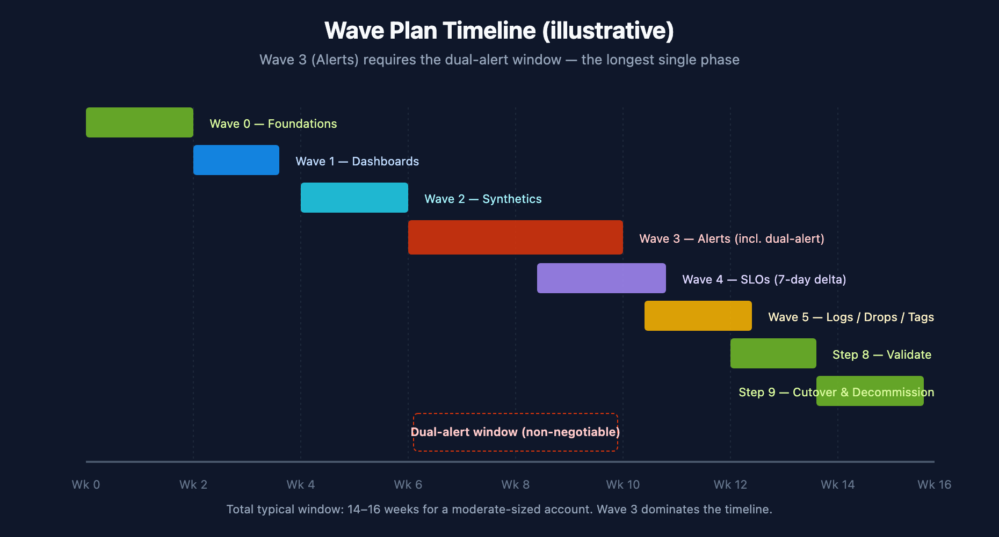

# NR2DT-02: Step 2 — Strategize

> **Series:** NR2DT | **Notebook:** 2 of 10 | **Created:** April 2026 | **Last Updated:** 04/14/2026

## Overview

**Goal of this step:** turn the discovery output into a wave plan, scope decisions, and gate definitions for the rest of the migration. Stakeholders sign off here.

Procedural — if you want the *why* behind wave ordering or trade-offs, the relevant NRLC component notebooks have it.

---

## Table of Contents

1. [What You'll Produce](#outputs)
2. [The Standard Wave Plan](#waves)
3. [Scope Decisions](#scope)
4. [Define the Validation Gates](#gates)
5. [Stakeholder Sign-off](#signoff)
6. [Step Exit Criteria](#gate)

---

## Prerequisites

| Requirement | Details |
|-------------|----------|
| **Audience** | Migration lead + assigned engineer for this step |
| **Completed** | NR2DT-01 — Discover |
| **Format** | Procedural step — use as a runbook; defer to NRLC for depth |
| **NRLC deep dives** | Each component NRLC notebook for trade-off depth |

## 1. What You'll Produce

| Artifact | Format | Purpose |
|----------|--------|---------|
| `wave-plan.md` | Markdown | Sequenced delivery plan with owners and timing |
| `scope-decisions.md` | Markdown | What's in / out / deferred / dropped |
| `gate-definitions.md` | Markdown | Pass criteria for each wave's exit |
| `stakeholder-signoff.md` | Markdown | Who approved what, when |

## 2. The Standard Wave Plan

Use this as a starting template; adjust for your inventory.

| Wave | Components | Risk | Typical Duration | Owner |
|------|-----------|------|------------------|-------|
| **0 — Foundations** | Bucket strategy, host groups, IAM groups, OpenPipeline enrichments | Low | 1–2 weeks | Platform team |
| **1 — Dashboards (read-only)** | All migrated dashboards | Low | 1 week + dual-run | Each team owns its dashboards |
| **2 — Synthetics** | HTTP first, then Browser, then API | Medium | 1–2 weeks | SRE |
| **3 — Alerts (HIGH RISK)** | Metric Events + Workflows; dual-alert window | **High** | 2–3 weeks (with dual-alert) | On-call leads |
| **4 — SLOs** | All SLOs after the underlying metrics are stable | Medium | 1 week + 7-day delta | SRE + service owners |
| **5 — Logs / Drops / Tags** | OpenPipeline filter and enrichment rules | Low | 1–2 weeks | Platform + FinOps |
| **6 — Decommission NR** | Disable routes, archive dashboards, halt ingest | Low (after sign-off) | 1 week | Platform + leadership |

Each wave has an exit gate (defined in §4). Don't run waves in parallel until you have explicit approval — the gates are sequenced for a reason.

<!-- MARKDOWN_TABLE_ALTERNATIVE
| Wave | Duration | Risk |
|------|----------|------|
| 0 Foundations | 1–2 weeks | Low |
| 1 Dashboards | 1 week + dual-run | Low |
| 2 Synthetics | 1–2 weeks | Medium |
| 3 Alerts (incl. dual-alert) | 2–3 weeks | **High** |
| 4 SLOs (7-day delta) | 1 week + 7d | Medium |
| 5 Logs / Drops / Tags | 1–2 weeks | Low |
| 6/7 Cutover & Decommission | 1 week | Low |

Total typical window: 14–16 weeks for a moderate-sized account.
For environments where SVG doesn't render
-->

## 3. Scope Decisions

Discovery surfaces things that don't fit the standard pattern. Decide explicitly for each:

| Category | Decision Required |
|----------|-------------------|
| LOW-confidence NRQL queries | Translate manually, reformulate, or drop the artifact |
| APM conditions | Replace with Dynatrace Intelligence adaptive baselines (recommended) or hand-port |
| Scripted browser monitors | Rebuild as DT clickpaths or drop |
| Custom NR Nerdpacks | Out of scope (no DT equivalent) |
| Historical NRDB data | Not migrated (configuration only) |
| Multi-account NR setup | Becomes single tenant + buckets + OpenPipeline enrichment + IAM scoping |

Document each decision in `scope-decisions.md` with the rationale and the impacted artifacts.

## 4. Define the Validation Gates

Each wave has a go/no-go gate. Document the pass criteria up front.

| Gate | Question | Pass Criteria |
|------|----------|--------------|
| **G0 — Foundations** | Can DT receive and route data per the bucket strategy? | Test ingestion lands in the correct bucket; IAM scopes work |
| **G1 — Dashboards** | Migrated dashboards display the same data shape? | Visual diff sample (10–20%) acceptable |
| **G2 — Synthetics** | Migrated synthetics meet SLA continuity? | Availability ±0.5% during dual-run |
| **G3 — Alerts** | Dual-alert volume aligned? | DT vs NR alert count within ±10% over 1–2 weeks |
| **G4 — SLOs** | SLI math equivalent? | 7-day SLI delta ≤ 0.5% |
| **G5 — Logs** | Log volumes, parsing, drops in line? | Volume ±5%; parsed fields present; drops working |
| **G6 — Cutover Ready** | Parallel-run period long enough? | ≥ 2 weeks of clean dual operation |
| **G7 — Decommission** | All stakeholders confirm? | Sign-offs documented; rollback plan still valid |

## 5. Stakeholder Sign-off

Sign-off is per-wave, not at the start. But the **plan** must be approved before Step 3.

| Stakeholder | What They Approve |
|-------------|-------------------|
| Migration lead | Wave sequence, owners, timeline |
| On-call leads | Wave 3 (alerts) plan + dual-alert window |
| Service owners | Their dashboards / alerts / SLOs are in scope |
| Compliance / Security | IAM model, log retention, audit-trail bucket |
| FinOps | DPS budget; bucket pricing model |
| Leadership | Decommission target date |

## 6. Step Exit Criteria

**G2 — Strategy Approved**

- [ ] `wave-plan.md` complete with owners and timing
- [ ] `scope-decisions.md` covers every gap from Step 1
- [ ] `gate-definitions.md` documents pass criteria for each wave
- [ ] All required stakeholders have signed off on the plan

**Next step:** **NR2DT-03 — Design** (target Dynatrace architecture: buckets, host groups, IAM, OpenPipeline).

---

*This notebook was AI-generated from community-submitted and publicly available sources, including the open-source [Dynatrace-NewRelic](https://github.com/timstewart-dynatrace/Dynatrace-NewRelic), [nrql-engine](https://github.com/timstewart-dynatrace/nrql-engine), and [nrql-translator](https://github.com/timstewart-dynatrace/nrql-translator) projects. This notebook series is not officially supported by Dynatrace or New Relic. Always verify information against the official [Dynatrace documentation](https://docs.dynatrace.com/docs) and [New Relic documentation](https://docs.newrelic.com).*
