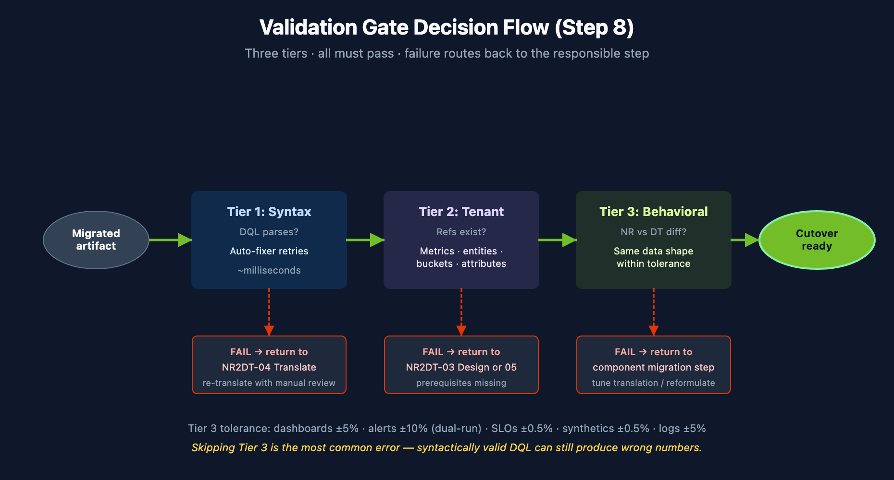

# NR2DT-08: Step 8 — Validate

> **Series:** NR2DT | **Notebook:** 8 of 10 | **Created:** April 2026 | **Last Updated:** 04/17/2026

## Overview

**Goal of this step:** run the three-tier validation across every migrated artifact. Syntax, tenant, and behavioral checks must all pass before cutover.

Procedural — see **NRLC-08** (Validation, Diff & Rollback) for the validation theory and tooling depth.

---

## Table of Contents

1. [Three-Tier Validation Pass](#tiers)
2. [Diff Against Live Config](#diff)
3. [Generate the Quality Report](#report)
4. [Step Exit Criteria](#gate)

---

## Prerequisites

| Requirement | Details |
|-------------|----------|
| **Audience** | Migration lead + assigned engineer for this step |
| **Completed** | NR2DT-07 — Migrate Logs, Tags & Drops |
| **Format** | Procedural step — use as a runbook; defer to NRLC for depth |
| **NRLC deep dives** | NRLC-08 (Validation deep dive) |

<a id="tiers"></a>
## 1. Three-Tier Validation Pass

The three validation tiers map onto three real `migrate.py` subcommands (there is no single `validate` subcommand — each tier uses the purpose-built command).

### Tier 1 — Syntax

Re-run for any changed translated queries (the `compile --validate` path runs parser-level validation with auto-fix):

```bash
python3 migrate.py compile --validate --file translated-queries.csv
```

### Tier 2 — Tenant

Confirm referenced metrics, entities, buckets, and OpenPipeline enrichment attributes exist in the target tenant:

```bash
python3 migrate.py preflight
```

Common Tier 2 failures:

- Migrated alert references a metric the tenant doesn't ingest
- DQL filter on `environment` attribute that no enrichment rule produces
- Synthetic location `AWS_US_EAST_1` not enabled in this tenant

### Tier 3 — Output Parity (Behavioral)

Compare NR vs. DT outputs across the dual-run window using the drift-audit command against a captured baseline:

```bash
python3 migrate.py audit --baseline baseline-counts.json
```

> The baseline file is produced by exporting NR + DT counts across the dual-run window; the audit command compares live DT output against those values. See NRLC-08 §4 for the capture pattern.

Tolerance per artifact:

| Artifact | Tolerance |
|---------|-----------|
| Dashboards | ±5% |
| Alerts (dual-run volume) | ±10% |
| SLOs | ±0.5% |
| Synthetics | ±0.5% |
| Log volumes | ±5% |




<!-- MARKDOWN_TABLE_ALTERNATIVE
| Tier | Pass / Fail Action |
|------|--------------------|
| 1 Syntax | Fail → return to NR2DT-04 (re-translate) |
| 2 Tenant | Fail → return to NR2DT-03 (design) or 05+ (prerequisites) |
| 3 Behavioral | Fail → return to component migration step (tune translation) |
For environments where SVG doesn't render
-->

<a id="diff"></a>
## 2. Diff Against Live Config

Confirm no drift since import:

```bash
python3 migrate.py migrate --diff --components all
```

Investigate any `EXISTING_DRIFT` entries — someone manually changed a migrated artifact in DT. Decide whether the change should be incorporated into the migration source-of-truth (Terraform), reverted, or accepted.

<a id="report"></a>
## 3. Generate the Quality Report

```bash
python3 migrate.py migrate --report --output validation-report.html
```

Report sections:

- Per-component pass/fail counts
- Failed translations (with reasons)
- Manual-review queue (APM conditions, scripted browsers, deferred queries)
- Rollback-eligible entities (within retention window)
- Recommended next actions

Attach this report to the cutover change-management ticket.

<a id="gate"></a>
## 4. Step Exit Criteria

**G8 — Cutover Ready**

- [ ] Tier 1 (syntax) — all components pass
- [ ] Tier 2 (tenant) — all references resolve
- [ ] Tier 3 (behavioral / output parity) — all artifacts within tolerance
- [ ] Diff report shows no unexpected drift
- [ ] Quality report attached to cutover ticket
- [ ] Stakeholders briefed on remaining manual-review items

**Next step:** **NR2DT-09 — Cutover, Rollback & Decommission**.

---

<sub>*This notebook was AI-generated from community-submitted and publicly available sources, including the open-source [Dynatrace-NewRelic](https://github.com/timstewart-dynatrace/Dynatrace-NewRelic), [nrql-engine](https://github.com/timstewart-dynatrace/nrql-engine), and [nrql-translator](https://github.com/timstewart-dynatrace/nrql-translator) projects. This notebook series is not officially supported by Dynatrace or New Relic. Always verify information against the official [Dynatrace documentation](https://docs.dynatrace.com/docs) and [New Relic documentation](https://docs.newrelic.com).*</sub>
